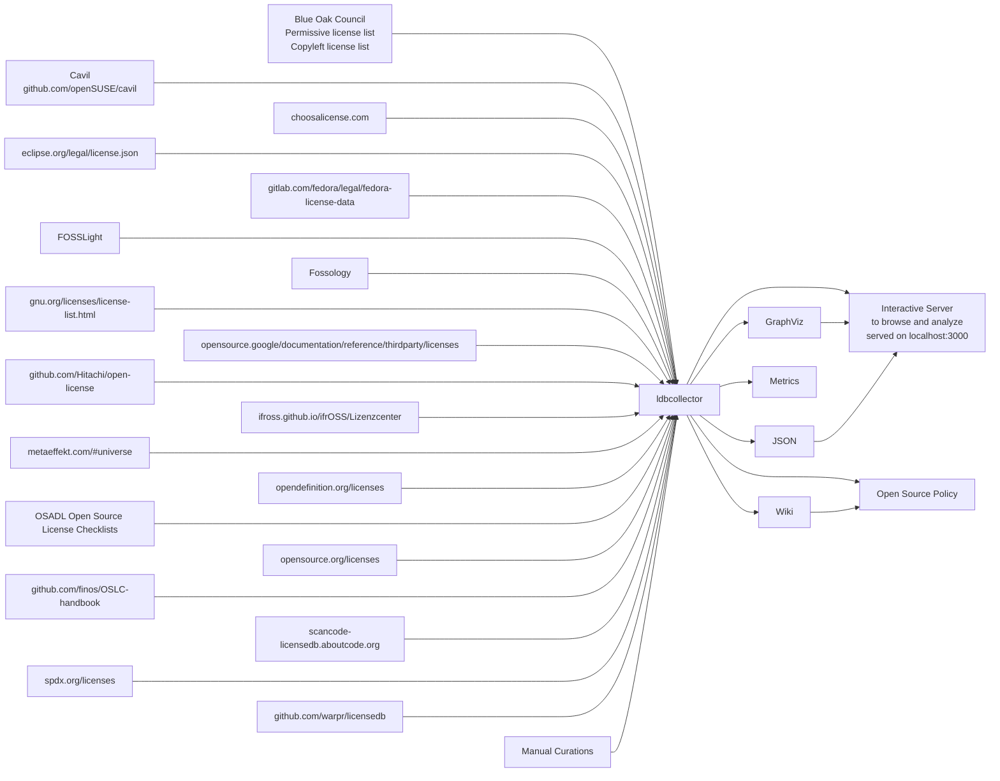

# ldbcollector

This is a framework to collect, parse, normalize and join metadata about open source and other software licenses.

## Quickstart:

(this might be blocked by missing permissions)

```bash
$ docker pull ghcr.io/maxhbr/ldbcollector-with-data:latest
$ docker run --env PORT=3001 -p "3001:3001" "ghcr.io/maxhbr/ldbcollector-with-data:latest"
```

## History:
This is a rewrite of the old ldbcollector, which is found  in the branch v1.

This rewrite is not yet stable and for stable use the old version is prefered.

# Sources and Outputs



# Ways to build, run and develop:
After cloning, one needs to initialize the submodules, e.g. with `git submodule update --init --recursive || true` (some recursive submodules might fail, this is not a problem and should be ignored).

## Nix
Nix is used to build the package and to create a container with it. It uses flakes.

### Develop
A development environment where cabal is provided can be started with `nix develop`.
One can directly trigger cabal comands via `nix develop --command "cabal build --test"`.
This is wrapped in `./nix-develop*.sh` scripts.

The `fmt.sh` script is used to apply formatting rules to the code.

### Building
The relevant targets are:
- `nix build .#` or `nix build .#ldbcollector` to build the package
- `nix build .#ldbcollector-untested` to build the package without tests in nix
- `nix build -o ldbcollector.tar.gz .#ldbcollector-image` to build the container
  - it will create an output in `ldbcollector.tar.gz` and has the tag `maxhbr/ldbcollector:latest` and can be loaded with `docker load -i ldbcollector.tar.gz`
  - this is wrapped in the script `./nix-docker-build-and-load.sh`

#### Docker with data

The script `./.github/workflows/docker-add-data-to-img.sh` is used to add the data to the container. It is used in the pipeline and creates `{ghcr.io/}maxhbr/ldbcollector-with-data:latest`.

### Building and Running
- `nix run .#` or `nix run .#ldbcollector` to (build and) run the package
  - this is wrapped in the script `./nix-run.sh`
- for development one can also use `nix develop --command cabal run` to (build and) run it directly via cabal in the dev environment

## Docker
If the relevant docker images is available (`maxhbr/ldbcollector` or `localhost/maxhbr/ldbcollector`), you can run the container with

```bash
./docker-run.sh
```

There is no direct way to build the image without nix, but you can fetch the images from ghcr.io (`docker pull ghcr.io/maxhbr/ldbcollector:latest` or `docker pull ghcr.io/maxhbr/ldbcollector-with-data:latest`, if you have permissions or if they become public) or as a build artifact of the pipeline.

## Cabal
This is also a cabal project and can be developed that way. But the nix way is prefered and actually used.
