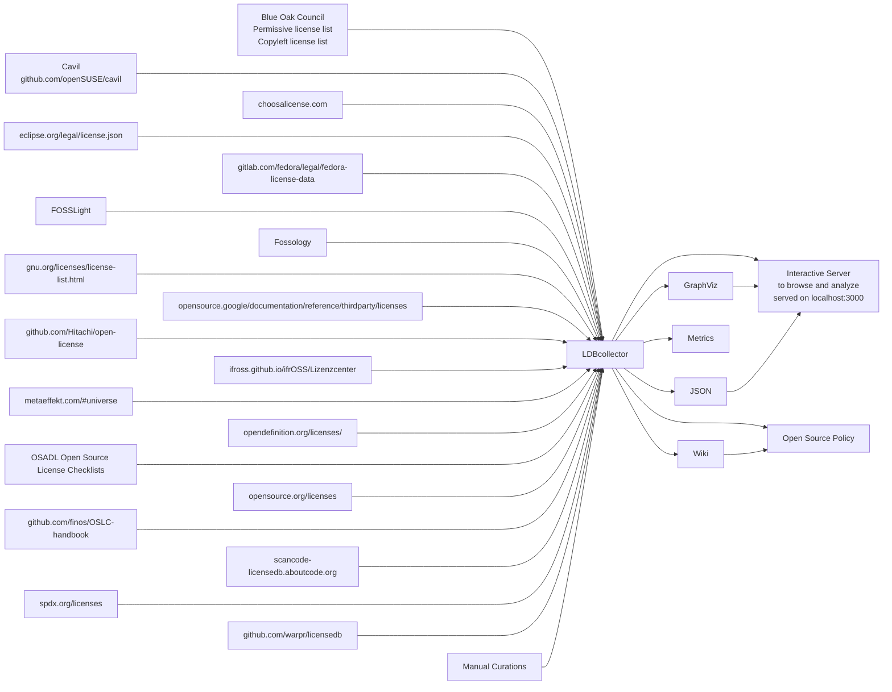

# ldbcollector

This is a framework to collect, parse, normalize and join metadata about open source and other software licenses.

## History:
This is a rewrite of the old ldbcollector, which is found in ./old-ldbcollector or in the branch v1.

This rewrite is not yet stable and for stable use the old version is prefered.

# Sources and Outputs

