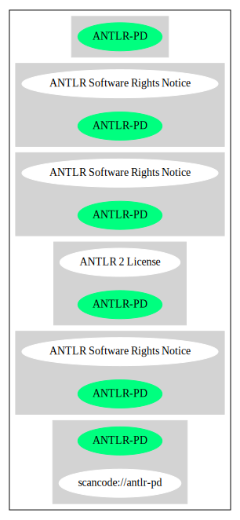

== ANTLR Software Rights Notice (ANTLR-PD)

[cols=",",options="header",]
|===
|Key |Value
|Fullname |ANTLR Software Rights Notice
|Shortname |ANTLR-PD
|Rating |Go
|Classification |NoCopyleft
|===

*Other Names:*

* `+scancode://antlr-pd+`

=== Comments on (easy) usability

* **↑**``Rating is: Bronze'' (source:
https://blueoakcouncil.org/list[BlueOak License List])

=== General Comments

* ``Per SPDX.org, ANTLR used this public domain notice through version
2.7 and then switched to a BSD license for version 3.0 and later. ''
(source:
https://github.com/nexB/scancode-toolkit/blob/develop/src/licensedcode/data/licenses/antlr-pd.yml[Scancode])

=== URLs

* *Homepage:* http://www.antlr2.org/
* *SPDX:* http://spdx.org/licenses/ANTLR-PD.json
* *SPDX:* https://spdx.org/licenses/ANTLR-PD.html
* http://www.antlr2.org/license.html
* http://www.spdx.org/licenses/ANTLR-PD

=== Text

....
ANTLR SOFTWARE RIGHTS

ANTLR 1989-2006 Developed by Terence Parr
Partially supported by University of San Francisco & jGuru.com

We reserve no legal rights to the ANTLR--it is fully in the
public domain. An individual or company may do whatever
they wish with source code distributed with ANTLR or the
code generated by ANTLR, including the incorporation of
ANTLR, or its output, into commerical software.

We encourage users to develop software with ANTLR. However,
we do ask that credit is given to us for developing
ANTLR. By "credit", we mean that if you use ANTLR or
incorporate any source code into one of your programs
(commercial product, research project, or otherwise) that
you acknowledge this fact somewhere in the documentation,
research report, etc... If you like ANTLR and have
developed a nice tool with the output, please mention that
you developed it using ANTLR. In addition, we ask that the
headers remain intact in our source code. As long as these
guidelines are kept, we expect to continue enhancing this
system and expect to make other tools available as they are
completed.

The primary ANTLR guy:

Terence Parr
parrt@cs.usfca.edu
parrt@antlr.org
....

'''''

=== Raw Data

* SPDX
* BlueOak License List
* Scancode

....
{
    "__impliedNames": [
        "ANTLR-PD",
        "ANTLR Software Rights Notice",
        "scancode://antlr-pd"
    ],
    "__impliedId": "ANTLR-PD",
    "__impliedComments": [
        [
            "Scancode",
            [
                "Per SPDX.org, ANTLR used this public domain notice through version 2.7 and\nthen switched to a BSD license for version 3.0 and later.\n"
            ]
        ]
    ],
    "facts": {
        "SPDX": {
            "isSPDXLicenseDeprecated": false,
            "spdxFullName": "ANTLR Software Rights Notice",
            "spdxDetailsURL": "http://spdx.org/licenses/ANTLR-PD.json",
            "_sourceURL": "https://spdx.org/licenses/ANTLR-PD.html",
            "spdxLicIsOSIApproved": false,
            "spdxSeeAlso": [
                "http://www.antlr2.org/license.html"
            ],
            "_implications": {
                "__impliedNames": [
                    "ANTLR-PD",
                    "ANTLR Software Rights Notice"
                ],
                "__impliedId": "ANTLR-PD",
                "__isOsiApproved": false,
                "__impliedURLs": [
                    [
                        "SPDX",
                        "http://spdx.org/licenses/ANTLR-PD.json"
                    ],
                    [
                        null,
                        "http://www.antlr2.org/license.html"
                    ]
                ]
            },
            "spdxLicenseId": "ANTLR-PD"
        },
        "Scancode": {
            "otherUrls": [
                "http://www.antlr2.org/license.html",
                "http://www.spdx.org/licenses/ANTLR-PD"
            ],
            "homepageUrl": "http://www.antlr2.org/",
            "shortName": "ANTLR-PD",
            "textUrls": null,
            "text": "ANTLR SOFTWARE RIGHTS\n\nANTLR 1989-2006 Developed by Terence Parr\nPartially supported by University of San Francisco & jGuru.com\n\nWe reserve no legal rights to the ANTLR--it is fully in the\npublic domain. An individual or company may do whatever\nthey wish with source code distributed with ANTLR or the\ncode generated by ANTLR, including the incorporation of\nANTLR, or its output, into commerical software.\n\nWe encourage users to develop software with ANTLR. However,\nwe do ask that credit is given to us for developing\nANTLR. By \"credit\", we mean that if you use ANTLR or\nincorporate any source code into one of your programs\n(commercial product, research project, or otherwise) that\nyou acknowledge this fact somewhere in the documentation,\nresearch report, etc... If you like ANTLR and have\ndeveloped a nice tool with the output, please mention that\nyou developed it using ANTLR. In addition, we ask that the\nheaders remain intact in our source code. As long as these\nguidelines are kept, we expect to continue enhancing this\nsystem and expect to make other tools available as they are\ncompleted.\n\nThe primary ANTLR guy:\n\nTerence Parr\nparrt@cs.usfca.edu\nparrt@antlr.org",
            "category": "Permissive",
            "osiUrl": null,
            "owner": "ANTLR",
            "_sourceURL": "https://github.com/nexB/scancode-toolkit/blob/develop/src/licensedcode/data/licenses/antlr-pd.yml",
            "key": "antlr-pd",
            "name": "ANTLR Software Rights Notice",
            "spdxId": "ANTLR-PD",
            "notes": "Per SPDX.org, ANTLR used this public domain notice through version 2.7 and\nthen switched to a BSD license for version 3.0 and later.\n",
            "_implications": {
                "__impliedNames": [
                    "scancode://antlr-pd",
                    "ANTLR-PD",
                    "ANTLR-PD"
                ],
                "__impliedId": "ANTLR-PD",
                "__impliedComments": [
                    [
                        "Scancode",
                        [
                            "Per SPDX.org, ANTLR used this public domain notice through version 2.7 and\nthen switched to a BSD license for version 3.0 and later.\n"
                        ]
                    ]
                ],
                "__impliedCopyleft": [
                    [
                        "Scancode",
                        "NoCopyleft"
                    ]
                ],
                "__calculatedCopyleft": "NoCopyleft",
                "__impliedText": "ANTLR SOFTWARE RIGHTS\n\nANTLR 1989-2006 Developed by Terence Parr\nPartially supported by University of San Francisco & jGuru.com\n\nWe reserve no legal rights to the ANTLR--it is fully in the\npublic domain. An individual or company may do whatever\nthey wish with source code distributed with ANTLR or the\ncode generated by ANTLR, including the incorporation of\nANTLR, or its output, into commerical software.\n\nWe encourage users to develop software with ANTLR. However,\nwe do ask that credit is given to us for developing\nANTLR. By \"credit\", we mean that if you use ANTLR or\nincorporate any source code into one of your programs\n(commercial product, research project, or otherwise) that\nyou acknowledge this fact somewhere in the documentation,\nresearch report, etc... If you like ANTLR and have\ndeveloped a nice tool with the output, please mention that\nyou developed it using ANTLR. In addition, we ask that the\nheaders remain intact in our source code. As long as these\nguidelines are kept, we expect to continue enhancing this\nsystem and expect to make other tools available as they are\ncompleted.\n\nThe primary ANTLR guy:\n\nTerence Parr\nparrt@cs.usfca.edu\nparrt@antlr.org",
                "__impliedURLs": [
                    [
                        "Homepage",
                        "http://www.antlr2.org/"
                    ],
                    [
                        null,
                        "http://www.antlr2.org/license.html"
                    ],
                    [
                        null,
                        "http://www.spdx.org/licenses/ANTLR-PD"
                    ]
                ]
            }
        },
        "BlueOak License List": {
            "BlueOakRating": "Bronze",
            "url": "https://spdx.org/licenses/ANTLR-PD.html",
            "isPermissive": true,
            "_sourceURL": "https://blueoakcouncil.org/list",
            "name": "ANTLR Software Rights Notice",
            "id": "ANTLR-PD",
            "_implications": {
                "__impliedNames": [
                    "ANTLR-PD",
                    "ANTLR Software Rights Notice"
                ],
                "__impliedJudgement": [
                    [
                        "BlueOak License List",
                        {
                            "tag": "PositiveJudgement",
                            "contents": "Rating is: Bronze"
                        }
                    ]
                ],
                "__impliedCopyleft": [
                    [
                        "BlueOak License List",
                        "NoCopyleft"
                    ]
                ],
                "__calculatedCopyleft": "NoCopyleft",
                "__impliedURLs": [
                    [
                        "SPDX",
                        "https://spdx.org/licenses/ANTLR-PD.html"
                    ]
                ]
            }
        }
    },
    "__impliedJudgement": [
        [
            "BlueOak License List",
            {
                "tag": "PositiveJudgement",
                "contents": "Rating is: Bronze"
            }
        ]
    ],
    "__impliedCopyleft": [
        [
            "BlueOak License List",
            "NoCopyleft"
        ],
        [
            "Scancode",
            "NoCopyleft"
        ]
    ],
    "__calculatedCopyleft": "NoCopyleft",
    "__isOsiApproved": false,
    "__impliedText": "ANTLR SOFTWARE RIGHTS\n\nANTLR 1989-2006 Developed by Terence Parr\nPartially supported by University of San Francisco & jGuru.com\n\nWe reserve no legal rights to the ANTLR--it is fully in the\npublic domain. An individual or company may do whatever\nthey wish with source code distributed with ANTLR or the\ncode generated by ANTLR, including the incorporation of\nANTLR, or its output, into commerical software.\n\nWe encourage users to develop software with ANTLR. However,\nwe do ask that credit is given to us for developing\nANTLR. By \"credit\", we mean that if you use ANTLR or\nincorporate any source code into one of your programs\n(commercial product, research project, or otherwise) that\nyou acknowledge this fact somewhere in the documentation,\nresearch report, etc... If you like ANTLR and have\ndeveloped a nice tool with the output, please mention that\nyou developed it using ANTLR. In addition, we ask that the\nheaders remain intact in our source code. As long as these\nguidelines are kept, we expect to continue enhancing this\nsystem and expect to make other tools available as they are\ncompleted.\n\nThe primary ANTLR guy:\n\nTerence Parr\nparrt@cs.usfca.edu\nparrt@antlr.org",
    "__impliedURLs": [
        [
            "SPDX",
            "http://spdx.org/licenses/ANTLR-PD.json"
        ],
        [
            null,
            "http://www.antlr2.org/license.html"
        ],
        [
            "SPDX",
            "https://spdx.org/licenses/ANTLR-PD.html"
        ],
        [
            "Homepage",
            "http://www.antlr2.org/"
        ],
        [
            null,
            "http://www.spdx.org/licenses/ANTLR-PD"
        ]
    ]
}
....

'''''

=== Dot Cluster Graph

