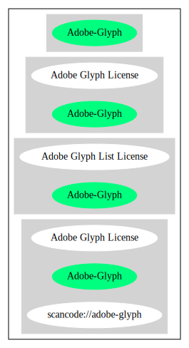

== Adobe Glyph List License (Adobe-Glyph)

[cols=",",options="header",]
|===
|Key |Value
|Fullname |Adobe Glyph List License
|Shortname |Adobe-Glyph
|Rating |Unknown, probably Attention or Stop or No-Go
|Classification |NoCopyleft
|===

*Other Names:*

* `+scancode://adobe-glyph+`
* `+Adobe Glyph License+`

=== Comments on (easy) usability

=== General Comments

=== URLs

* *Homepage:* https://fedoraproject.org/wiki/Licensing/MIT#AdobeGlyph
* *SPDX:* http://spdx.org/licenses/Adobe-Glyph.json

=== Text

....
Permission is hereby granted, free of charge, to any person obtaining a copy of this documentation file to use, copy, publish, distribute, sublicense, and/or sell copies of the documentation, and to permit others to do the same, provided that: 
     - No modification, editing or other alteration of this document is allowed; and 
     - The above copyright notice and this permission notice shall be included in all copies of the documentation. 

Permission is hereby granted, free of charge, to any person obtaining a copy of this documentation file, to create their own derivative works from the content of this document to use, copy, publish, distribute, sublicense, and/or sell the derivative works, and to permit others to do the same, provided that the derived work is not represented as being a copy or version of this document. 

Adobe shall not be liable to any party for any loss of revenue or profit or for indirect, incidental, special, consequential, or other similar damages, whether based on tort (including without limitation negligence or strict liability), contract or other legal or equitable grounds even if Adobe has been advised or had reason to know of the possibility of such damages. The Adobe materials are provided on an "AS IS" basis. Adobe specifically disclaims all express, statutory, or implied warranties relating to the Adobe materials, including but not limited to those concerning merchantability or fitness for a particular purpose or non-infringement of any third party rights regarding the Adobe materials.
....

'''''

=== Raw Data

==== Facts

* https://spdx.org/licenses/Adobe-Glyph.html[SPDX]
* https://github.com/nexB/scancode-toolkit/blob/develop/src/licensedcode/data/licenses/adobe-glyph.yml[Scancode]

==== Raw JSON

....
{
    "__impliedNames": [
        "Adobe-Glyph",
        "Adobe Glyph List License",
        "scancode://adobe-glyph",
        "Adobe Glyph License"
    ],
    "__impliedId": "Adobe-Glyph",
    "facts": {
        "SPDX": {
            "isSPDXLicenseDeprecated": false,
            "spdxFullName": "Adobe Glyph List License",
            "spdxDetailsURL": "http://spdx.org/licenses/Adobe-Glyph.json",
            "_sourceURL": "https://spdx.org/licenses/Adobe-Glyph.html",
            "spdxLicIsOSIApproved": false,
            "spdxSeeAlso": [
                "https://fedoraproject.org/wiki/Licensing/MIT#AdobeGlyph"
            ],
            "_implications": {
                "__impliedNames": [
                    "Adobe-Glyph",
                    "Adobe Glyph List License"
                ],
                "__impliedId": "Adobe-Glyph",
                "__isOsiApproved": false,
                "__impliedURLs": [
                    [
                        "SPDX",
                        "http://spdx.org/licenses/Adobe-Glyph.json"
                    ],
                    [
                        null,
                        "https://fedoraproject.org/wiki/Licensing/MIT#AdobeGlyph"
                    ]
                ]
            },
            "spdxLicenseId": "Adobe-Glyph"
        },
        "Scancode": {
            "otherUrls": null,
            "homepageUrl": "https://fedoraproject.org/wiki/Licensing/MIT#AdobeGlyph",
            "shortName": "Adobe Glyph License",
            "textUrls": null,
            "text": "Permission is hereby granted, free of charge, to any person obtaining a copy of this documentation file to use, copy, publish, distribute, sublicense, and/or sell copies of the documentation, and to permit others to do the same, provided that: \n     - No modification, editing or other alteration of this document is allowed; and \n     - The above copyright notice and this permission notice shall be included in all copies of the documentation. \n\nPermission is hereby granted, free of charge, to any person obtaining a copy of this documentation file, to create their own derivative works from the content of this document to use, copy, publish, distribute, sublicense, and/or sell the derivative works, and to permit others to do the same, provided that the derived work is not represented as being a copy or version of this document. \n\nAdobe shall not be liable to any party for any loss of revenue or profit or for indirect, incidental, special, consequential, or other similar damages, whether based on tort (including without limitation negligence or strict liability), contract or other legal or equitable grounds even if Adobe has been advised or had reason to know of the possibility of such damages. The Adobe materials are provided on an \"AS IS\" basis. Adobe specifically disclaims all express, statutory, or implied warranties relating to the Adobe materials, including but not limited to those concerning merchantability or fitness for a particular purpose or non-infringement of any third party rights regarding the Adobe materials.",
            "category": "Permissive",
            "osiUrl": null,
            "owner": "Adobe Systems",
            "_sourceURL": "https://github.com/nexB/scancode-toolkit/blob/develop/src/licensedcode/data/licenses/adobe-glyph.yml",
            "key": "adobe-glyph",
            "name": "Adobe Glyph License",
            "spdxId": "Adobe-Glyph",
            "notes": null,
            "_implications": {
                "__impliedNames": [
                    "scancode://adobe-glyph",
                    "Adobe Glyph License",
                    "Adobe-Glyph"
                ],
                "__impliedId": "Adobe-Glyph",
                "__impliedCopyleft": [
                    [
                        "Scancode",
                        "NoCopyleft"
                    ]
                ],
                "__calculatedCopyleft": "NoCopyleft",
                "__impliedText": "Permission is hereby granted, free of charge, to any person obtaining a copy of this documentation file to use, copy, publish, distribute, sublicense, and/or sell copies of the documentation, and to permit others to do the same, provided that: \n     - No modification, editing or other alteration of this document is allowed; and \n     - The above copyright notice and this permission notice shall be included in all copies of the documentation. \n\nPermission is hereby granted, free of charge, to any person obtaining a copy of this documentation file, to create their own derivative works from the content of this document to use, copy, publish, distribute, sublicense, and/or sell the derivative works, and to permit others to do the same, provided that the derived work is not represented as being a copy or version of this document. \n\nAdobe shall not be liable to any party for any loss of revenue or profit or for indirect, incidental, special, consequential, or other similar damages, whether based on tort (including without limitation negligence or strict liability), contract or other legal or equitable grounds even if Adobe has been advised or had reason to know of the possibility of such damages. The Adobe materials are provided on an \"AS IS\" basis. Adobe specifically disclaims all express, statutory, or implied warranties relating to the Adobe materials, including but not limited to those concerning merchantability or fitness for a particular purpose or non-infringement of any third party rights regarding the Adobe materials.",
                "__impliedURLs": [
                    [
                        "Homepage",
                        "https://fedoraproject.org/wiki/Licensing/MIT#AdobeGlyph"
                    ]
                ]
            }
        }
    },
    "__impliedCopyleft": [
        [
            "Scancode",
            "NoCopyleft"
        ]
    ],
    "__calculatedCopyleft": "NoCopyleft",
    "__isOsiApproved": false,
    "__impliedText": "Permission is hereby granted, free of charge, to any person obtaining a copy of this documentation file to use, copy, publish, distribute, sublicense, and/or sell copies of the documentation, and to permit others to do the same, provided that: \n     - No modification, editing or other alteration of this document is allowed; and \n     - The above copyright notice and this permission notice shall be included in all copies of the documentation. \n\nPermission is hereby granted, free of charge, to any person obtaining a copy of this documentation file, to create their own derivative works from the content of this document to use, copy, publish, distribute, sublicense, and/or sell the derivative works, and to permit others to do the same, provided that the derived work is not represented as being a copy or version of this document. \n\nAdobe shall not be liable to any party for any loss of revenue or profit or for indirect, incidental, special, consequential, or other similar damages, whether based on tort (including without limitation negligence or strict liability), contract or other legal or equitable grounds even if Adobe has been advised or had reason to know of the possibility of such damages. The Adobe materials are provided on an \"AS IS\" basis. Adobe specifically disclaims all express, statutory, or implied warranties relating to the Adobe materials, including but not limited to those concerning merchantability or fitness for a particular purpose or non-infringement of any third party rights regarding the Adobe materials.",
    "__impliedURLs": [
        [
            "SPDX",
            "http://spdx.org/licenses/Adobe-Glyph.json"
        ],
        [
            null,
            "https://fedoraproject.org/wiki/Licensing/MIT#AdobeGlyph"
        ],
        [
            "Homepage",
            "https://fedoraproject.org/wiki/Licensing/MIT#AdobeGlyph"
        ]
    ]
}
....

'''''

=== Dot Cluster Graph

