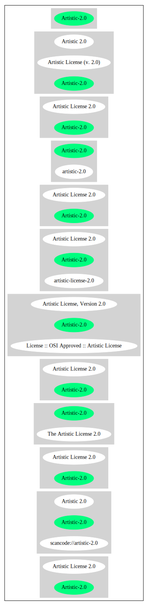

== Artistic License 2.0 (Artistic-2.0)

[cols=",",options="header",]
|===
|Key |Value
|Fullname |Artistic License 2.0
|Shortname |Artistic-2.0
|Rating |Unknown, probably Attention or Stop or No-Go
|Classification |WeakCopyleft
|Has Patent Hint |False
|===

*Other Names:*

* `+scancode://artistic-2.0+`
* `+Artistic 2.0+`
* `+Artistic License, Version 2.0+`
* `+License :: OSI Approved :: Artistic License+`
* `+Artistic License (v. 2.0)+`

=== Description

____
Heavily favored by the Perl community, the Artistic license requires
that modified versions of the software do not prevent users from running
the standard version.
____

(source: choosealicense.com
(https://github.com/github/choosealicense.com/blob/gh-pages/LICENSE.md[MIT]))

=== Comments on (easy) usability

* **↑**``Google Classification is NOTICE'' (source:
https://opensource.google.com/docs/thirdparty/licenses/[Google OSS
Policy])
* **↑**``Is OSI Approved'' (source:
https://spdx.org/licenses/Artistic-2.0.html[SPDX])
* **↑**``Rating is: Bronze'' (source:
https://blueoakcouncil.org/list[BlueOak License List])
* **↑**``This license is compatible with the
DebianFreeSoftwareGuidelines (DFSG-free)'' (source:
https://wiki.debian.org/DFSGLicenses[Debian Free Software Guidelines])

=== General Comments

* ``Per SPDX.org, this version was released 2006 This license is OSI
certifified. '' (source:
https://github.com/nexB/scancode-toolkit/blob/develop/src/licensedcode/data/licenses/artistic-2.0.yml[Scancode])

=== Obligations

[cols=",,",options="header",]
|===
|Rights: |Conditions: |Limitations:
a|
* commercial-use
* modifications
* distribution
* patent-use
* private-use

a|
* include-copyright
* document-changes

a|
* liability
* trademark-use
* warranty

|===

(source:
https://github.com/github/choosealicense.com/blob/gh-pages/_licenses/artistic-2.0.txt[choosealicense.com]
(https://github.com/github/choosealicense.com/blob/gh-pages/LICENSE.md[MIT]))

=== URLs

* *Homepage:* http://www.perlfoundation.org/
* *OSI Page:*
http://www.opensource.org/licenses/artistic-license-2.0.php
* *OSI Page:* https://opensource.org/licenses/Artistic-2.0
* *SPDX:* http://spdx.org/licenses/Artistic-2.0.json
* *SPDX:* https://spdx.org/licenses/Artistic-2.0.html
* http://www.perlfoundation.org/artistic_license_2_0
* https://opensource.org/licenses/artistic-license-2.0
* http://www.opensource.org/licenses/artistic-license-2.0

=== Text

....
Copyright (c) 2000-2006, The Perl Foundation.

Everyone is permitted to copy and distribute verbatim copies of this license document, but changing it is not allowed.

Preamble

This license establishes the terms under which a given free software Package may be copied, modified, distributed, and/or redistributed. The intent is that the Copyright Holder maintains some artistic control over the development of that Package while still keeping the Package available as open source and free software.

You are always permitted to make arrangements wholly outside of this license directly with the Copyright Holder of a given Package. If the terms of this license do not permit the full use that you propose to make of the Package, you should contact the Copyright Holder and seek a different licensing arrangement.

Definitions

"Copyright Holder" means the individual(s) or organization(s) named in the copyright notice for the entire Package.

"Contributor" means any party that has contributed code or other material to the Package, in accordance with the Copyright Holder's procedures.

"You" and "your" means any person who would like to copy, distribute, or modify the Package.

"Package" means the collection of files distributed by the Copyright Holder, and derivatives of that collection and/or of those files. A given Package may consist of either the Standard Version, or a Modified Version.

"Distribute" means providing a copy of the Package or making it accessible to anyone else, or in the case of a company or organization, to others outside of your company or organization.

"Distributor Fee" means any fee that you charge for Distributing this Package or providing support for this Package to another party. It does not mean licensing fees.

"Standard Version" refers to the Package if it has not been modified, or has been modified only in ways explicitly requested by the Copyright Holder.

"Modified Version" means the Package, if it has been changed, and such changes were not explicitly requested by the Copyright Holder.

"Original License" means this Artistic License as Distributed with the Standard Version of the Package, in its current version or as it may be modified by The Perl Foundation in the future.

"Source" form means the source code, documentation source, and configuration files for the Package.

"Compiled" form means the compiled bytecode, object code, binary, or any other form resulting from mechanical transformation or translation of the Source form.

Permission for Use and Modification Without Distribution
(1) You are permitted to use the Standard Version and create and use Modified Versions for any purpose without restriction, provided that you do not Distribute the Modified Version.

Permissions for Redistribution of the Standard Version
(2) You may Distribute verbatim copies of the Source form of the Standard Version of this Package in any medium without restriction, either gratis or for a Distributor Fee, provided that you duplicate all of the original copyright notices and associated disclaimers. At your discretion, such verbatim copies may or may not include a Compiled form of the Package.

(3) You may apply any bug fixes, portability changes, and other modifications made available from the Copyright Holder. The resulting Package will still be considered the Standard Version, and as such will be subject to the Original License.

Distribution of Modified Versions of the Package as Source
(4) You may Distribute your Modified Version as Source (either gratis or for a Distributor Fee, and with or without a Compiled form of the Modified Version) provided that you clearly document how it differs from the Standard Version, including, but not limited to, documenting any non-standard features, executables, or modules, and provided that you do at least ONE of the following:
(a) make the Modified Version available to the Copyright Holder of the Standard Version, under the Original License, so that the Copyright Holder may include your modifications in the Standard Version.
(b) ensure that installation of your Modified Version does not prevent the user installing or running the Standard Version. In addition, the Modified Version must bear a name that is different from the name of the Standard Version.
(c) allow anyone who receives a copy of the Modified Version to make the Source form of the Modified Version available to others under
(i) the Original License or
(ii) a license that permits the licensee to freely copy, modify and redistribute the Modified Version using the same licensing terms that apply to the copy that the licensee received, and requires that the Source form of the Modified Version, and of any works derived from it, be made freely available in that license fees are prohibited but Distributor Fees are allowed.

Distribution of Compiled Forms of the Standard Version or Modified Versions without the Source
(5) You may Distribute Compiled forms of the Standard Version without the Source, provided that you include complete instructions on how to get the Source of the Standard Version. Such instructions must be valid at the time of your distribution. If these instructions, at any time while you are carrying out such distribution, become invalid, you must provide new instructions on demand or cease further distribution. If you provide valid instructions or cease distribution within thirty days after you become aware that the instructions are invalid, then you do not forfeit any of your rights under this license.

(6) You may Distribute a Modified Version in Compiled form without the Source, provided that you comply with Section 4 with respect to the Source of the Modified Version.

Aggregating or Linking the Package
(7) You may aggregate the Package (either the Standard Version or Modified Version) with other packages and Distribute the resulting aggregation provided that you do not charge a licensing fee for the Package. Distributor Fees are permitted, and licensing fees for other components in the aggregation are permitted. The terms of this license apply to the use and Distribution of the Standard or Modified Versions as included in the aggregation.

(8) You are permitted to link Modified and Standard Versions with other works, to embed the Package in a larger work of your own, or to build stand-alone binary or bytecode versions of applications that include the Package, and Distribute the result without restriction, provided the result does not expose a direct interface to the Package.
Items That are Not Considered Part of a Modified Version

(9) Works (including, but not limited to, modules and scripts) that merely extend or make use of the Package, do not, by themselves, cause the Package to be a Modified Version. In addition, such works are not considered parts of the Package itself, and are not subject to the terms of this license.

General Provisions
(10) Any use, modification, and distribution of the Standard or Modified Versions is governed by this Artistic License. By using, modifying or distributing the Package, you accept this license. Do not use, modify, or distribute the Package, if you do not accept this license.

(11) If your Modified Version has been derived from a Modified Version made by someone other than you, you are nevertheless required to ensure that your Modified Version complies with the requirements of this license.

(12) This license does not grant you the right to use any trademark, service mark, tradename, or logo of the Copyright Holder.

(13) This license includes the non-exclusive, worldwide, free-of-charge patent license to make, have made, use, offer to sell, sell, import and otherwise transfer the Package with respect to any patent claims licensable by the Copyright Holder that are necessarily infringed by the Package. If you institute patent litigation (including a cross-claim or counterclaim) against any party alleging that the Package constitutes direct or contributory patent infringement, then this Artistic License to you shall terminate on the date that such litigation is filed.

(14) Disclaimer of Warranty: THE PACKAGE IS PROVIDED BY THE COPYRIGHT HOLDER AND CONTRIBUTORS "AS IS' AND WITHOUT ANY EXPRESS OR IMPLIED WARRANTIES. THE IMPLIED WARRANTIES OF MERCHANTABILITY, FITNESS FOR A PARTICULAR PURPOSE, OR NON-INFRINGEMENT ARE DISCLAIMED TO THE EXTENT PERMITTED BY YOUR LOCAL LAW. UNLESS REQUIRED BY LAW, NO COPYRIGHT HOLDER OR CONTRIBUTOR WILL BE LIABLE FOR ANY DIRECT, INDIRECT, INCIDENTAL, OR CONSEQUENTIAL DAMAGES ARISING IN ANY WAY OUT OF THE USE OF THE PACKAGE, EVEN IF ADVISED OF THE POSSIBILITY OF SUCH DAMAGE.
....

'''''

=== Raw Data

....
{
    "__impliedNames": [
        "Artistic-2.0",
        "Artistic License 2.0",
        "scancode://artistic-2.0",
        "Artistic 2.0",
        "artistic-2.0",
        "Artistic License, Version 2.0",
        "License :: OSI Approved :: Artistic License",
        "Artistic License (v. 2.0)"
    ],
    "__impliedId": "Artistic-2.0",
    "__impliedAmbiguousNames": [
        "Artistic License"
    ],
    "__impliedComments": [
        [
            "Scancode",
            [
                "Per SPDX.org, this version was released 2006 This license is OSI\ncertifified.\n"
            ]
        ]
    ],
    "__hasPatentHint": false,
    "facts": {
        "Open Knowledge International": {
            "is_generic": null,
            "status": "active",
            "domain_software": true,
            "url": "https://opensource.org/licenses/Artistic-2.0",
            "maintainer": "Perl Foundation",
            "od_conformance": "not reviewed",
            "_sourceURL": "https://github.com/okfn/licenses/blob/master/licenses.csv",
            "domain_data": false,
            "osd_conformance": "approved",
            "id": "Artistic-2.0",
            "title": "Artistic License 2.0",
            "_implications": {
                "__impliedNames": [
                    "Artistic-2.0",
                    "Artistic License 2.0"
                ],
                "__impliedId": "Artistic-2.0",
                "__impliedURLs": [
                    [
                        null,
                        "https://opensource.org/licenses/Artistic-2.0"
                    ]
                ]
            },
            "domain_content": false
        },
        "SPDX": {
            "isSPDXLicenseDeprecated": false,
            "spdxFullName": "Artistic License 2.0",
            "spdxDetailsURL": "http://spdx.org/licenses/Artistic-2.0.json",
            "_sourceURL": "https://spdx.org/licenses/Artistic-2.0.html",
            "spdxLicIsOSIApproved": true,
            "spdxSeeAlso": [
                "http://www.perlfoundation.org/artistic_license_2_0",
                "https://opensource.org/licenses/artistic-license-2.0"
            ],
            "_implications": {
                "__impliedNames": [
                    "Artistic-2.0",
                    "Artistic License 2.0"
                ],
                "__impliedId": "Artistic-2.0",
                "__impliedJudgement": [
                    [
                        "SPDX",
                        {
                            "tag": "PositiveJudgement",
                            "contents": "Is OSI Approved"
                        }
                    ]
                ],
                "__isOsiApproved": true,
                "__impliedURLs": [
                    [
                        "SPDX",
                        "http://spdx.org/licenses/Artistic-2.0.json"
                    ],
                    [
                        null,
                        "http://www.perlfoundation.org/artistic_license_2_0"
                    ],
                    [
                        null,
                        "https://opensource.org/licenses/artistic-license-2.0"
                    ]
                ]
            },
            "spdxLicenseId": "Artistic-2.0"
        },
        "Scancode": {
            "otherUrls": [
                "http://www.opensource.org/licenses/artistic-license-2.0",
                "https://opensource.org/licenses/artistic-license-2.0"
            ],
            "homepageUrl": "http://www.perlfoundation.org/",
            "shortName": "Artistic 2.0",
            "textUrls": null,
            "text": "Copyright (c) 2000-2006, The Perl Foundation.\n\nEveryone is permitted to copy and distribute verbatim copies of this license document, but changing it is not allowed.\n\nPreamble\n\nThis license establishes the terms under which a given free software Package may be copied, modified, distributed, and/or redistributed. The intent is that the Copyright Holder maintains some artistic control over the development of that Package while still keeping the Package available as open source and free software.\n\nYou are always permitted to make arrangements wholly outside of this license directly with the Copyright Holder of a given Package. If the terms of this license do not permit the full use that you propose to make of the Package, you should contact the Copyright Holder and seek a different licensing arrangement.\n\nDefinitions\n\n\"Copyright Holder\" means the individual(s) or organization(s) named in the copyright notice for the entire Package.\n\n\"Contributor\" means any party that has contributed code or other material to the Package, in accordance with the Copyright Holder's procedures.\n\n\"You\" and \"your\" means any person who would like to copy, distribute, or modify the Package.\n\n\"Package\" means the collection of files distributed by the Copyright Holder, and derivatives of that collection and/or of those files. A given Package may consist of either the Standard Version, or a Modified Version.\n\n\"Distribute\" means providing a copy of the Package or making it accessible to anyone else, or in the case of a company or organization, to others outside of your company or organization.\n\n\"Distributor Fee\" means any fee that you charge for Distributing this Package or providing support for this Package to another party. It does not mean licensing fees.\n\n\"Standard Version\" refers to the Package if it has not been modified, or has been modified only in ways explicitly requested by the Copyright Holder.\n\n\"Modified Version\" means the Package, if it has been changed, and such changes were not explicitly requested by the Copyright Holder.\n\n\"Original License\" means this Artistic License as Distributed with the Standard Version of the Package, in its current version or as it may be modified by The Perl Foundation in the future.\n\n\"Source\" form means the source code, documentation source, and configuration files for the Package.\n\n\"Compiled\" form means the compiled bytecode, object code, binary, or any other form resulting from mechanical transformation or translation of the Source form.\n\nPermission for Use and Modification Without Distribution\n(1) You are permitted to use the Standard Version and create and use Modified Versions for any purpose without restriction, provided that you do not Distribute the Modified Version.\n\nPermissions for Redistribution of the Standard Version\n(2) You may Distribute verbatim copies of the Source form of the Standard Version of this Package in any medium without restriction, either gratis or for a Distributor Fee, provided that you duplicate all of the original copyright notices and associated disclaimers. At your discretion, such verbatim copies may or may not include a Compiled form of the Package.\n\n(3) You may apply any bug fixes, portability changes, and other modifications made available from the Copyright Holder. The resulting Package will still be considered the Standard Version, and as such will be subject to the Original License.\n\nDistribution of Modified Versions of the Package as Source\n(4) You may Distribute your Modified Version as Source (either gratis or for a Distributor Fee, and with or without a Compiled form of the Modified Version) provided that you clearly document how it differs from the Standard Version, including, but not limited to, documenting any non-standard features, executables, or modules, and provided that you do at least ONE of the following:\n(a) make the Modified Version available to the Copyright Holder of the Standard Version, under the Original License, so that the Copyright Holder may include your modifications in the Standard Version.\n(b) ensure that installation of your Modified Version does not prevent the user installing or running the Standard Version. In addition, the Modified Version must bear a name that is different from the name of the Standard Version.\n(c) allow anyone who receives a copy of the Modified Version to make the Source form of the Modified Version available to others under\n(i) the Original License or\n(ii) a license that permits the licensee to freely copy, modify and redistribute the Modified Version using the same licensing terms that apply to the copy that the licensee received, and requires that the Source form of the Modified Version, and of any works derived from it, be made freely available in that license fees are prohibited but Distributor Fees are allowed.\n\nDistribution of Compiled Forms of the Standard Version or Modified Versions without the Source\n(5) You may Distribute Compiled forms of the Standard Version without the Source, provided that you include complete instructions on how to get the Source of the Standard Version. Such instructions must be valid at the time of your distribution. If these instructions, at any time while you are carrying out such distribution, become invalid, you must provide new instructions on demand or cease further distribution. If you provide valid instructions or cease distribution within thirty days after you become aware that the instructions are invalid, then you do not forfeit any of your rights under this license.\n\n(6) You may Distribute a Modified Version in Compiled form without the Source, provided that you comply with Section 4 with respect to the Source of the Modified Version.\n\nAggregating or Linking the Package\n(7) You may aggregate the Package (either the Standard Version or Modified Version) with other packages and Distribute the resulting aggregation provided that you do not charge a licensing fee for the Package. Distributor Fees are permitted, and licensing fees for other components in the aggregation are permitted. The terms of this license apply to the use and Distribution of the Standard or Modified Versions as included in the aggregation.\n\n(8) You are permitted to link Modified and Standard Versions with other works, to embed the Package in a larger work of your own, or to build stand-alone binary or bytecode versions of applications that include the Package, and Distribute the result without restriction, provided the result does not expose a direct interface to the Package.\nItems That are Not Considered Part of a Modified Version\n\n(9) Works (including, but not limited to, modules and scripts) that merely extend or make use of the Package, do not, by themselves, cause the Package to be a Modified Version. In addition, such works are not considered parts of the Package itself, and are not subject to the terms of this license.\n\nGeneral Provisions\n(10) Any use, modification, and distribution of the Standard or Modified Versions is governed by this Artistic License. By using, modifying or distributing the Package, you accept this license. Do not use, modify, or distribute the Package, if you do not accept this license.\n\n(11) If your Modified Version has been derived from a Modified Version made by someone other than you, you are nevertheless required to ensure that your Modified Version complies with the requirements of this license.\n\n(12) This license does not grant you the right to use any trademark, service mark, tradename, or logo of the Copyright Holder.\n\n(13) This license includes the non-exclusive, worldwide, free-of-charge patent license to make, have made, use, offer to sell, sell, import and otherwise transfer the Package with respect to any patent claims licensable by the Copyright Holder that are necessarily infringed by the Package. If you institute patent litigation (including a cross-claim or counterclaim) against any party alleging that the Package constitutes direct or contributory patent infringement, then this Artistic License to you shall terminate on the date that such litigation is filed.\n\n(14) Disclaimer of Warranty: THE PACKAGE IS PROVIDED BY THE COPYRIGHT HOLDER AND CONTRIBUTORS \"AS IS' AND WITHOUT ANY EXPRESS OR IMPLIED WARRANTIES. THE IMPLIED WARRANTIES OF MERCHANTABILITY, FITNESS FOR A PARTICULAR PURPOSE, OR NON-INFRINGEMENT ARE DISCLAIMED TO THE EXTENT PERMITTED BY YOUR LOCAL LAW. UNLESS REQUIRED BY LAW, NO COPYRIGHT HOLDER OR CONTRIBUTOR WILL BE LIABLE FOR ANY DIRECT, INDIRECT, INCIDENTAL, OR CONSEQUENTIAL DAMAGES ARISING IN ANY WAY OUT OF THE USE OF THE PACKAGE, EVEN IF ADVISED OF THE POSSIBILITY OF SUCH DAMAGE.",
            "category": "Copyleft Limited",
            "osiUrl": "http://www.opensource.org/licenses/artistic-license-2.0.php",
            "owner": "Perl Foundation",
            "_sourceURL": "https://github.com/nexB/scancode-toolkit/blob/develop/src/licensedcode/data/licenses/artistic-2.0.yml",
            "key": "artistic-2.0",
            "name": "Artistic License 2.0",
            "spdxId": "Artistic-2.0",
            "notes": "Per SPDX.org, this version was released 2006 This license is OSI\ncertifified.\n",
            "_implications": {
                "__impliedNames": [
                    "scancode://artistic-2.0",
                    "Artistic 2.0",
                    "Artistic-2.0"
                ],
                "__impliedId": "Artistic-2.0",
                "__impliedComments": [
                    [
                        "Scancode",
                        [
                            "Per SPDX.org, this version was released 2006 This license is OSI\ncertifified.\n"
                        ]
                    ]
                ],
                "__impliedCopyleft": [
                    [
                        "Scancode",
                        "WeakCopyleft"
                    ]
                ],
                "__calculatedCopyleft": "WeakCopyleft",
                "__impliedText": "Copyright (c) 2000-2006, The Perl Foundation.\n\nEveryone is permitted to copy and distribute verbatim copies of this license document, but changing it is not allowed.\n\nPreamble\n\nThis license establishes the terms under which a given free software Package may be copied, modified, distributed, and/or redistributed. The intent is that the Copyright Holder maintains some artistic control over the development of that Package while still keeping the Package available as open source and free software.\n\nYou are always permitted to make arrangements wholly outside of this license directly with the Copyright Holder of a given Package. If the terms of this license do not permit the full use that you propose to make of the Package, you should contact the Copyright Holder and seek a different licensing arrangement.\n\nDefinitions\n\n\"Copyright Holder\" means the individual(s) or organization(s) named in the copyright notice for the entire Package.\n\n\"Contributor\" means any party that has contributed code or other material to the Package, in accordance with the Copyright Holder's procedures.\n\n\"You\" and \"your\" means any person who would like to copy, distribute, or modify the Package.\n\n\"Package\" means the collection of files distributed by the Copyright Holder, and derivatives of that collection and/or of those files. A given Package may consist of either the Standard Version, or a Modified Version.\n\n\"Distribute\" means providing a copy of the Package or making it accessible to anyone else, or in the case of a company or organization, to others outside of your company or organization.\n\n\"Distributor Fee\" means any fee that you charge for Distributing this Package or providing support for this Package to another party. It does not mean licensing fees.\n\n\"Standard Version\" refers to the Package if it has not been modified, or has been modified only in ways explicitly requested by the Copyright Holder.\n\n\"Modified Version\" means the Package, if it has been changed, and such changes were not explicitly requested by the Copyright Holder.\n\n\"Original License\" means this Artistic License as Distributed with the Standard Version of the Package, in its current version or as it may be modified by The Perl Foundation in the future.\n\n\"Source\" form means the source code, documentation source, and configuration files for the Package.\n\n\"Compiled\" form means the compiled bytecode, object code, binary, or any other form resulting from mechanical transformation or translation of the Source form.\n\nPermission for Use and Modification Without Distribution\n(1) You are permitted to use the Standard Version and create and use Modified Versions for any purpose without restriction, provided that you do not Distribute the Modified Version.\n\nPermissions for Redistribution of the Standard Version\n(2) You may Distribute verbatim copies of the Source form of the Standard Version of this Package in any medium without restriction, either gratis or for a Distributor Fee, provided that you duplicate all of the original copyright notices and associated disclaimers. At your discretion, such verbatim copies may or may not include a Compiled form of the Package.\n\n(3) You may apply any bug fixes, portability changes, and other modifications made available from the Copyright Holder. The resulting Package will still be considered the Standard Version, and as such will be subject to the Original License.\n\nDistribution of Modified Versions of the Package as Source\n(4) You may Distribute your Modified Version as Source (either gratis or for a Distributor Fee, and with or without a Compiled form of the Modified Version) provided that you clearly document how it differs from the Standard Version, including, but not limited to, documenting any non-standard features, executables, or modules, and provided that you do at least ONE of the following:\n(a) make the Modified Version available to the Copyright Holder of the Standard Version, under the Original License, so that the Copyright Holder may include your modifications in the Standard Version.\n(b) ensure that installation of your Modified Version does not prevent the user installing or running the Standard Version. In addition, the Modified Version must bear a name that is different from the name of the Standard Version.\n(c) allow anyone who receives a copy of the Modified Version to make the Source form of the Modified Version available to others under\n(i) the Original License or\n(ii) a license that permits the licensee to freely copy, modify and redistribute the Modified Version using the same licensing terms that apply to the copy that the licensee received, and requires that the Source form of the Modified Version, and of any works derived from it, be made freely available in that license fees are prohibited but Distributor Fees are allowed.\n\nDistribution of Compiled Forms of the Standard Version or Modified Versions without the Source\n(5) You may Distribute Compiled forms of the Standard Version without the Source, provided that you include complete instructions on how to get the Source of the Standard Version. Such instructions must be valid at the time of your distribution. If these instructions, at any time while you are carrying out such distribution, become invalid, you must provide new instructions on demand or cease further distribution. If you provide valid instructions or cease distribution within thirty days after you become aware that the instructions are invalid, then you do not forfeit any of your rights under this license.\n\n(6) You may Distribute a Modified Version in Compiled form without the Source, provided that you comply with Section 4 with respect to the Source of the Modified Version.\n\nAggregating or Linking the Package\n(7) You may aggregate the Package (either the Standard Version or Modified Version) with other packages and Distribute the resulting aggregation provided that you do not charge a licensing fee for the Package. Distributor Fees are permitted, and licensing fees for other components in the aggregation are permitted. The terms of this license apply to the use and Distribution of the Standard or Modified Versions as included in the aggregation.\n\n(8) You are permitted to link Modified and Standard Versions with other works, to embed the Package in a larger work of your own, or to build stand-alone binary or bytecode versions of applications that include the Package, and Distribute the result without restriction, provided the result does not expose a direct interface to the Package.\nItems That are Not Considered Part of a Modified Version\n\n(9) Works (including, but not limited to, modules and scripts) that merely extend or make use of the Package, do not, by themselves, cause the Package to be a Modified Version. In addition, such works are not considered parts of the Package itself, and are not subject to the terms of this license.\n\nGeneral Provisions\n(10) Any use, modification, and distribution of the Standard or Modified Versions is governed by this Artistic License. By using, modifying or distributing the Package, you accept this license. Do not use, modify, or distribute the Package, if you do not accept this license.\n\n(11) If your Modified Version has been derived from a Modified Version made by someone other than you, you are nevertheless required to ensure that your Modified Version complies with the requirements of this license.\n\n(12) This license does not grant you the right to use any trademark, service mark, tradename, or logo of the Copyright Holder.\n\n(13) This license includes the non-exclusive, worldwide, free-of-charge patent license to make, have made, use, offer to sell, sell, import and otherwise transfer the Package with respect to any patent claims licensable by the Copyright Holder that are necessarily infringed by the Package. If you institute patent litigation (including a cross-claim or counterclaim) against any party alleging that the Package constitutes direct or contributory patent infringement, then this Artistic License to you shall terminate on the date that such litigation is filed.\n\n(14) Disclaimer of Warranty: THE PACKAGE IS PROVIDED BY THE COPYRIGHT HOLDER AND CONTRIBUTORS \"AS IS' AND WITHOUT ANY EXPRESS OR IMPLIED WARRANTIES. THE IMPLIED WARRANTIES OF MERCHANTABILITY, FITNESS FOR A PARTICULAR PURPOSE, OR NON-INFRINGEMENT ARE DISCLAIMED TO THE EXTENT PERMITTED BY YOUR LOCAL LAW. UNLESS REQUIRED BY LAW, NO COPYRIGHT HOLDER OR CONTRIBUTOR WILL BE LIABLE FOR ANY DIRECT, INDIRECT, INCIDENTAL, OR CONSEQUENTIAL DAMAGES ARISING IN ANY WAY OUT OF THE USE OF THE PACKAGE, EVEN IF ADVISED OF THE POSSIBILITY OF SUCH DAMAGE.",
                "__impliedURLs": [
                    [
                        "Homepage",
                        "http://www.perlfoundation.org/"
                    ],
                    [
                        "OSI Page",
                        "http://www.opensource.org/licenses/artistic-license-2.0.php"
                    ],
                    [
                        null,
                        "http://www.opensource.org/licenses/artistic-license-2.0"
                    ],
                    [
                        null,
                        "https://opensource.org/licenses/artistic-license-2.0"
                    ]
                ]
            }
        },
        "Cavil": {
            "implications": {
                "__impliedNames": [
                    "Artistic-2.0"
                ],
                "__impliedId": "Artistic-2.0"
            },
            "shortname": "Artistic-2.0",
            "riskInt": 2,
            "trademarkInt": 0,
            "opinionInt": 0,
            "otherNames": [],
            "patentInt": 0
        },
        "OpenChainPolicyTemplate": {
            "isSaaSDeemed": "no",
            "licenseType": "copyleft",
            "freedomOrDeath": "no",
            "typeCopyleft": "weak",
            "_sourceURL": "https://github.com/OpenChain-Project/curriculum/raw/ddf1e879341adbd9b297cd67c5d5c16b2076540b/policy-template/Open%20Source%20Policy%20Template%20for%20OpenChain%20Specification%201.2.ods",
            "name": "Artistic License 2.0",
            "commercialUse": true,
            "spdxId": "Artistic-2.0",
            "_implications": {
                "__impliedNames": [
                    "Artistic-2.0"
                ]
            }
        },
        "Debian Free Software Guidelines": {
            "LicenseName": "Artistic License",
            "State": "DFSGCompatible",
            "_sourceURL": "https://wiki.debian.org/DFSGLicenses",
            "_implications": {
                "__impliedNames": [
                    "Artistic-2.0"
                ],
                "__impliedAmbiguousNames": [
                    "Artistic License"
                ],
                "__impliedJudgement": [
                    [
                        "Debian Free Software Guidelines",
                        {
                            "tag": "PositiveJudgement",
                            "contents": "This license is compatible with the DebianFreeSoftwareGuidelines (DFSG-free)"
                        }
                    ]
                ]
            },
            "Comment": null,
            "LicenseId": "Artistic-2.0"
        },
        "Override": {
            "oNonCommecrial": null,
            "implications": {
                "__impliedNames": [
                    "Artistic-2.0",
                    "Artistic 2.0",
                    "Artistic License (v. 2.0)"
                ],
                "__impliedId": "Artistic-2.0"
            },
            "oName": "Artistic-2.0",
            "oOtherLicenseIds": [
                "Artistic 2.0",
                "Artistic License (v. 2.0)"
            ],
            "oDescription": null,
            "oJudgement": null,
            "oCompatibilities": null,
            "oRatingState": null
        },
        "BlueOak License List": {
            "BlueOakRating": "Bronze",
            "url": "https://spdx.org/licenses/Artistic-2.0.html",
            "isPermissive": true,
            "_sourceURL": "https://blueoakcouncil.org/list",
            "name": "Artistic License 2.0",
            "id": "Artistic-2.0",
            "_implications": {
                "__impliedNames": [
                    "Artistic-2.0",
                    "Artistic License 2.0"
                ],
                "__impliedJudgement": [
                    [
                        "BlueOak License List",
                        {
                            "tag": "PositiveJudgement",
                            "contents": "Rating is: Bronze"
                        }
                    ]
                ],
                "__impliedCopyleft": [
                    [
                        "BlueOak License List",
                        "NoCopyleft"
                    ]
                ],
                "__calculatedCopyleft": "NoCopyleft",
                "__impliedURLs": [
                    [
                        "SPDX",
                        "https://spdx.org/licenses/Artistic-2.0.html"
                    ]
                ]
            }
        },
        "OpenSourceInitiative": {
            "text": [
                {
                    "url": "https://opensource.org/licenses/Artistic-2.0",
                    "title": "HTML",
                    "media_type": "text/html"
                }
            ],
            "identifiers": [
                {
                    "identifier": "Artistic-2.0",
                    "scheme": "DEP5"
                },
                {
                    "identifier": "Artistic-2.0",
                    "scheme": "SPDX"
                },
                {
                    "identifier": "License :: OSI Approved :: Artistic License",
                    "scheme": "Trove"
                }
            ],
            "superseded_by": null,
            "_sourceURL": "https://opensource.org/licenses/",
            "name": "Artistic License, Version 2.0",
            "other_names": [],
            "keywords": [
                "miscellaneous",
                "osi-approved"
            ],
            "id": "Artistic-2.0",
            "links": [
                {
                    "note": "OSI Page",
                    "url": "https://opensource.org/licenses/Artistic-2.0"
                }
            ],
            "_implications": {
                "__impliedNames": [
                    "Artistic-2.0",
                    "Artistic License, Version 2.0",
                    "Artistic-2.0",
                    "Artistic-2.0",
                    "License :: OSI Approved :: Artistic License"
                ],
                "__impliedURLs": [
                    [
                        "OSI Page",
                        "https://opensource.org/licenses/Artistic-2.0"
                    ]
                ]
            }
        },
        "Wikipedia": {
            "Distribution": {
                "value": "With restrictions",
                "description": "distribution of the code to third parties"
            },
            "Sublicensing": {
                "value": "With restrictions",
                "description": "whether modified code may be licensed under a different license (for example a copyright) or must retain the same license under which it was provided"
            },
            "Linking": {
                "value": "With restrictions",
                "description": "linking of the licensed code with code licensed under a different license (e.g. when the code is provided as a library)"
            },
            "Publication date": "2000",
            "_sourceURL": "https://en.wikipedia.org/wiki/Comparison_of_free_and_open-source_software_licenses",
            "Koordinaten": {
                "name": "Artistic License",
                "version": "2.0",
                "spdxId": "Artistic-2.0"
            },
            "Patent grant": {
                "value": "No",
                "description": "protection of licensees from patent claims made by code contributors regarding their contribution, and protection of contributors from patent claims made by licensees"
            },
            "Trademark grant": {
                "value": "No",
                "description": "use of trademarks associated with the licensed code or its contributors by a licensee"
            },
            "_implications": {
                "__impliedNames": [
                    "Artistic-2.0",
                    "Artistic License 2.0"
                ],
                "__hasPatentHint": false
            },
            "Private use": {
                "value": "Permissive",
                "description": "whether modification to the code must be shared with the community or may be used privately (e.g. internal use by a corporation)"
            },
            "Modification": {
                "value": "With restrictions",
                "description": "modification of the code by a licensee"
            }
        },
        "finos-osr/OSLC-handbook": {
            "terms": [
                {
                    "termUseCases": [
                        "UB",
                        "US"
                    ],
                    "termSeeAlso": null,
                    "termDescription": "Retain all notices",
                    "termComplianceNotes": "Copyright notices and other notices",
                    "termType": "condition"
                },
                {
                    "termUseCases": [
                        "MB",
                        "MS"
                    ],
                    "termSeeAlso": null,
                    "termDescription": "Notice of modifications",
                    "termComplianceNotes": "Document how the modified version differs from the standard version",
                    "termType": "condition"
                },
                {
                    "termUseCases": [
                        "MB",
                        "MS"
                    ],
                    "termSeeAlso": null,
                    "termDescription": "Provide access to modified version",
                    "termComplianceNotes": "Do at least one of the following: make modified version available to copyright holder under same license; OR ensure modified version does not prevent user from installing or running standard version and use different name; OR allow any recipients of modified version to make source available to others under same license or a similarly free/open license (see section 4 for more details)",
                    "termType": "condition"
                },
                {
                    "termUseCases": [
                        "UB"
                    ],
                    "termSeeAlso": null,
                    "termDescription": "Access to source",
                    "termComplianceNotes": "Provide complete instructions on how to get source for standard version; instructions must be kept current for your distribution",
                    "termType": "condition"
                },
                {
                    "termUseCases": [
                        "UB",
                        "MB",
                        "US",
                        "MS"
                    ],
                    "termSeeAlso": null,
                    "termDescription": "You may distribute this package as part of a larger (commercial) distribution, but cannot charge a licensing fee for the standalone package. You may charge distributor fees or licensing fees for other components in the distribution.",
                    "termComplianceNotes": null,
                    "termType": "condition"
                },
                {
                    "termUseCases": null,
                    "termSeeAlso": null,
                    "termDescription": "Any patent claims accusing the work by a licensee results in termination of all licenses to the licensee",
                    "termComplianceNotes": null,
                    "termType": "termination"
                },
                {
                    "termUseCases": null,
                    "termSeeAlso": null,
                    "termDescription": "Modified or standard versions linked with other works; embedding the package in a larger work of your own; or stand-alone binary or bytecode versions of applications that include the package may be distributed without restriction provided the result does not expose a direct interface to the package. See sections 8 for more details.",
                    "termComplianceNotes": null,
                    "termType": "other"
                },
                {
                    "termUseCases": null,
                    "termSeeAlso": null,
                    "termDescription": "Works that merely extend or make use of the package do not cause the package to be a modified version, are not considered parts of the package itself, and are not subject to the terms of this license. See section 9 for more details.",
                    "termComplianceNotes": null,
                    "termType": "other"
                }
            ],
            "_sourceURL": "https://github.com/finos-osr/OSLC-handbook/blob/master/src/Artistic-2.0.yaml",
            "name": "Artistic License 2.0",
            "nameFromFilename": "Artistic-2.0",
            "notes": "This license has specific use cases and conditions that are difficult to summarize; please see sections 4-9 and relevant definitions for more details.",
            "_implications": {
                "__impliedNames": [
                    "Artistic-2.0",
                    "Artistic License 2.0"
                ]
            },
            "licenseId": [
                "Artistic-2.0",
                "Artistic License 2.0"
            ]
        },
        "choosealicense.com": {
            "limitations": [
                "liability",
                "trademark-use",
                "warranty"
            ],
            "_sourceURL": "https://github.com/github/choosealicense.com/blob/gh-pages/_licenses/artistic-2.0.txt",
            "content": "---\ntitle: Artistic License 2.0\nspdx-id: Artistic-2.0\nredirect_from: /licenses/artistic/\n\ndescription: Heavily favored by the Perl community, the Artistic license requires that modified versions of the software do not prevent users from running the standard version.\n\nhow: Create a text file (typically named LICENSE or LICENSE.txt) in the root of your source code, and copy the text of the license into the file. Do not replace the copyright notice (year, author), which refers to the license itself, not the licensed project.\n\nusing:\n\npermissions:\n  - commercial-use\n  - modifications\n  - distribution\n  - patent-use\n  - private-use\n\nconditions:\n  - include-copyright\n  - document-changes\n\nlimitations:\n  - liability\n  - trademark-use\n  - warranty\n\n---\n\n\t\t       The Artistic License 2.0\n\n\t    Copyright (c) 2000-2006, The Perl Foundation.\n\n     Everyone is permitted to copy and distribute verbatim copies\n      of this license document, but changing it is not allowed.\n\nPreamble\n\nThis license establishes the terms under which a given free software\nPackage may be copied, modified, distributed, and/or redistributed.\nThe intent is that the Copyright Holder maintains some artistic\ncontrol over the development of that Package while still keeping the\nPackage available as open source and free software.\n\nYou are always permitted to make arrangements wholly outside of this\nlicense directly with the Copyright Holder of a given Package.  If the\nterms of this license do not permit the full use that you propose to\nmake of the Package, you should contact the Copyright Holder and seek\na different licensing arrangement.\n\nDefinitions\n\n    \"Copyright Holder\" means the individual(s) or organization(s)\n    named in the copyright notice for the entire Package.\n\n    \"Contributor\" means any party that has contributed code or other\n    material to the Package, in accordance with the Copyright Holder's\n    procedures.\n\n    \"You\" and \"your\" means any person who would like to copy,\n    distribute, or modify the Package.\n\n    \"Package\" means the collection of files distributed by the\n    Copyright Holder, and derivatives of that collection and/or of\n    those files. A given Package may consist of either the Standard\n    Version, or a Modified Version.\n\n    \"Distribute\" means providing a copy of the Package or making it\n    accessible to anyone else, or in the case of a company or\n    organization, to others outside of your company or organization.\n\n    \"Distributor Fee\" means any fee that you charge for Distributing\n    this Package or providing support for this Package to another\n    party.  It does not mean licensing fees.\n\n    \"Standard Version\" refers to the Package if it has not been\n    modified, or has been modified only in ways explicitly requested\n    by the Copyright Holder.\n\n    \"Modified Version\" means the Package, if it has been changed, and\n    such changes were not explicitly requested by the Copyright\n    Holder.\n\n    \"Original License\" means this Artistic License as Distributed with\n    the Standard Version of the Package, in its current version or as\n    it may be modified by The Perl Foundation in the future.\n\n    \"Source\" form means the source code, documentation source, and\n    configuration files for the Package.\n\n    \"Compiled\" form means the compiled bytecode, object code, binary,\n    or any other form resulting from mechanical transformation or\n    translation of the Source form.\n\n\nPermission for Use and Modification Without Distribution\n\n(1)  You are permitted to use the Standard Version and create and use\nModified Versions for any purpose without restriction, provided that\nyou do not Distribute the Modified Version.\n\n\nPermissions for Redistribution of the Standard Version\n\n(2)  You may Distribute verbatim copies of the Source form of the\nStandard Version of this Package in any medium without restriction,\neither gratis or for a Distributor Fee, provided that you duplicate\nall of the original copyright notices and associated disclaimers.  At\nyour discretion, such verbatim copies may or may not include a\nCompiled form of the Package.\n\n(3)  You may apply any bug fixes, portability changes, and other\nmodifications made available from the Copyright Holder.  The resulting\nPackage will still be considered the Standard Version, and as such\nwill be subject to the Original License.\n\n\nDistribution of Modified Versions of the Package as Source\n\n(4)  You may Distribute your Modified Version as Source (either gratis\nor for a Distributor Fee, and with or without a Compiled form of the\nModified Version) provided that you clearly document how it differs\nfrom the Standard Version, including, but not limited to, documenting\nany non-standard features, executables, or modules, and provided that\nyou do at least ONE of the following:\n\n    (a)  make the Modified Version available to the Copyright Holder\n    of the Standard Version, under the Original License, so that the\n    Copyright Holder may include your modifications in the Standard\n    Version.\n\n    (b)  ensure that installation of your Modified Version does not\n    prevent the user installing or running the Standard Version. In\n    addition, the Modified Version must bear a name that is different\n    from the name of the Standard Version.\n\n    (c)  allow anyone who receives a copy of the Modified Version to\n    make the Source form of the Modified Version available to others\n    under\n\n\t(i)  the Original License or\n\n\t(ii)  a license that permits the licensee to freely copy,\n\tmodify and redistribute the Modified Version using the same\n\tlicensing terms that apply to the copy that the licensee\n\treceived, and requires that the Source form of the Modified\n\tVersion, and of any works derived from it, be made freely\n\tavailable in that license fees are prohibited but Distributor\n\tFees are allowed.\n\n\nDistribution of Compiled Forms of the Standard Version\nor Modified Versions without the Source\n\n(5)  You may Distribute Compiled forms of the Standard Version without\nthe Source, provided that you include complete instructions on how to\nget the Source of the Standard Version.  Such instructions must be\nvalid at the time of your distribution.  If these instructions, at any\ntime while you are carrying out such distribution, become invalid, you\nmust provide new instructions on demand or cease further distribution.\nIf you provide valid instructions or cease distribution within thirty\ndays after you become aware that the instructions are invalid, then\nyou do not forfeit any of your rights under this license.\n\n(6)  You may Distribute a Modified Version in Compiled form without\nthe Source, provided that you comply with Section 4 with respect to\nthe Source of the Modified Version.\n\n\nAggregating or Linking the Package\n\n(7)  You may aggregate the Package (either the Standard Version or\nModified Version) with other packages and Distribute the resulting\naggregation provided that you do not charge a licensing fee for the\nPackage.  Distributor Fees are permitted, and licensing fees for other\ncomponents in the aggregation are permitted. The terms of this license\napply to the use and Distribution of the Standard or Modified Versions\nas included in the aggregation.\n\n(8) You are permitted to link Modified and Standard Versions with\nother works, to embed the Package in a larger work of your own, or to\nbuild stand-alone binary or bytecode versions of applications that\ninclude the Package, and Distribute the result without restriction,\nprovided the result does not expose a direct interface to the Package.\n\n\nItems That are Not Considered Part of a Modified Version\n\n(9) Works (including, but not limited to, modules and scripts) that\nmerely extend or make use of the Package, do not, by themselves, cause\nthe Package to be a Modified Version.  In addition, such works are not\nconsidered parts of the Package itself, and are not subject to the\nterms of this license.\n\n\nGeneral Provisions\n\n(10)  Any use, modification, and distribution of the Standard or\nModified Versions is governed by this Artistic License. By using,\nmodifying or distributing the Package, you accept this license. Do not\nuse, modify, or distribute the Package, if you do not accept this\nlicense.\n\n(11)  If your Modified Version has been derived from a Modified\nVersion made by someone other than you, you are nevertheless required\nto ensure that your Modified Version complies with the requirements of\nthis license.\n\n(12)  This license does not grant you the right to use any trademark,\nservice mark, tradename, or logo of the Copyright Holder.\n\n(13)  This license includes the non-exclusive, worldwide,\nfree-of-charge patent license to make, have made, use, offer to sell,\nsell, import and otherwise transfer the Package with respect to any\npatent claims licensable by the Copyright Holder that are necessarily\ninfringed by the Package. If you institute patent litigation\n(including a cross-claim or counterclaim) against any party alleging\nthat the Package constitutes direct or contributory patent\ninfringement, then this Artistic License to you shall terminate on the\ndate that such litigation is filed.\n\n(14)  Disclaimer of Warranty:\nTHE PACKAGE IS PROVIDED BY THE COPYRIGHT HOLDER AND CONTRIBUTORS \"AS\nIS' AND WITHOUT ANY EXPRESS OR IMPLIED WARRANTIES. THE IMPLIED\nWARRANTIES OF MERCHANTABILITY, FITNESS FOR A PARTICULAR PURPOSE, OR\nNON-INFRINGEMENT ARE DISCLAIMED TO THE EXTENT PERMITTED BY YOUR LOCAL\nLAW. UNLESS REQUIRED BY LAW, NO COPYRIGHT HOLDER OR CONTRIBUTOR WILL\nBE LIABLE FOR ANY DIRECT, INDIRECT, INCIDENTAL, OR CONSEQUENTIAL\nDAMAGES ARISING IN ANY WAY OUT OF THE USE OF THE PACKAGE, EVEN IF\nADVISED OF THE POSSIBILITY OF SUCH DAMAGE.\n",
            "name": "artistic-2.0",
            "hidden": null,
            "spdxId": "Artistic-2.0",
            "conditions": [
                "include-copyright",
                "document-changes"
            ],
            "permissions": [
                "commercial-use",
                "modifications",
                "distribution",
                "patent-use",
                "private-use"
            ],
            "featured": null,
            "nickname": null,
            "how": "Create a text file (typically named LICENSE or LICENSE.txt) in the root of your source code, and copy the text of the license into the file. Do not replace the copyright notice (year, author), which refers to the license itself, not the licensed project.",
            "title": "Artistic License 2.0",
            "_implications": {
                "__impliedNames": [
                    "artistic-2.0",
                    "Artistic-2.0"
                ],
                "__obligations": {
                    "limitations": [
                        {
                            "tag": "ImpliedLimitation",
                            "contents": "liability"
                        },
                        {
                            "tag": "ImpliedLimitation",
                            "contents": "trademark-use"
                        },
                        {
                            "tag": "ImpliedLimitation",
                            "contents": "warranty"
                        }
                    ],
                    "rights": [
                        {
                            "tag": "ImpliedRight",
                            "contents": "commercial-use"
                        },
                        {
                            "tag": "ImpliedRight",
                            "contents": "modifications"
                        },
                        {
                            "tag": "ImpliedRight",
                            "contents": "distribution"
                        },
                        {
                            "tag": "ImpliedRight",
                            "contents": "patent-use"
                        },
                        {
                            "tag": "ImpliedRight",
                            "contents": "private-use"
                        }
                    ],
                    "conditions": [
                        {
                            "tag": "ImpliedCondition",
                            "contents": "include-copyright"
                        },
                        {
                            "tag": "ImpliedCondition",
                            "contents": "document-changes"
                        }
                    ]
                }
            },
            "description": "Heavily favored by the Perl community, the Artistic license requires that modified versions of the software do not prevent users from running the standard version."
        },
        "Google OSS Policy": {
            "rating": "NOTICE",
            "_sourceURL": "https://opensource.google.com/docs/thirdparty/licenses/",
            "id": "Artistic-2.0",
            "_implications": {
                "__impliedNames": [
                    "Artistic-2.0"
                ],
                "__impliedJudgement": [
                    [
                        "Google OSS Policy",
                        {
                            "tag": "PositiveJudgement",
                            "contents": "Google Classification is NOTICE"
                        }
                    ]
                ],
                "__impliedCopyleft": [
                    [
                        "Google OSS Policy",
                        "NoCopyleft"
                    ]
                ],
                "__calculatedCopyleft": "NoCopyleft"
            }
        }
    },
    "__impliedJudgement": [
        [
            "BlueOak License List",
            {
                "tag": "PositiveJudgement",
                "contents": "Rating is: Bronze"
            }
        ],
        [
            "Debian Free Software Guidelines",
            {
                "tag": "PositiveJudgement",
                "contents": "This license is compatible with the DebianFreeSoftwareGuidelines (DFSG-free)"
            }
        ],
        [
            "Google OSS Policy",
            {
                "tag": "PositiveJudgement",
                "contents": "Google Classification is NOTICE"
            }
        ],
        [
            "SPDX",
            {
                "tag": "PositiveJudgement",
                "contents": "Is OSI Approved"
            }
        ]
    ],
    "__impliedCopyleft": [
        [
            "BlueOak License List",
            "NoCopyleft"
        ],
        [
            "Google OSS Policy",
            "NoCopyleft"
        ],
        [
            "Scancode",
            "WeakCopyleft"
        ]
    ],
    "__calculatedCopyleft": "WeakCopyleft",
    "__obligations": {
        "limitations": [
            {
                "tag": "ImpliedLimitation",
                "contents": "liability"
            },
            {
                "tag": "ImpliedLimitation",
                "contents": "trademark-use"
            },
            {
                "tag": "ImpliedLimitation",
                "contents": "warranty"
            }
        ],
        "rights": [
            {
                "tag": "ImpliedRight",
                "contents": "commercial-use"
            },
            {
                "tag": "ImpliedRight",
                "contents": "modifications"
            },
            {
                "tag": "ImpliedRight",
                "contents": "distribution"
            },
            {
                "tag": "ImpliedRight",
                "contents": "patent-use"
            },
            {
                "tag": "ImpliedRight",
                "contents": "private-use"
            }
        ],
        "conditions": [
            {
                "tag": "ImpliedCondition",
                "contents": "include-copyright"
            },
            {
                "tag": "ImpliedCondition",
                "contents": "document-changes"
            }
        ]
    },
    "__isOsiApproved": true,
    "__impliedText": "Copyright (c) 2000-2006, The Perl Foundation.\n\nEveryone is permitted to copy and distribute verbatim copies of this license document, but changing it is not allowed.\n\nPreamble\n\nThis license establishes the terms under which a given free software Package may be copied, modified, distributed, and/or redistributed. The intent is that the Copyright Holder maintains some artistic control over the development of that Package while still keeping the Package available as open source and free software.\n\nYou are always permitted to make arrangements wholly outside of this license directly with the Copyright Holder of a given Package. If the terms of this license do not permit the full use that you propose to make of the Package, you should contact the Copyright Holder and seek a different licensing arrangement.\n\nDefinitions\n\n\"Copyright Holder\" means the individual(s) or organization(s) named in the copyright notice for the entire Package.\n\n\"Contributor\" means any party that has contributed code or other material to the Package, in accordance with the Copyright Holder's procedures.\n\n\"You\" and \"your\" means any person who would like to copy, distribute, or modify the Package.\n\n\"Package\" means the collection of files distributed by the Copyright Holder, and derivatives of that collection and/or of those files. A given Package may consist of either the Standard Version, or a Modified Version.\n\n\"Distribute\" means providing a copy of the Package or making it accessible to anyone else, or in the case of a company or organization, to others outside of your company or organization.\n\n\"Distributor Fee\" means any fee that you charge for Distributing this Package or providing support for this Package to another party. It does not mean licensing fees.\n\n\"Standard Version\" refers to the Package if it has not been modified, or has been modified only in ways explicitly requested by the Copyright Holder.\n\n\"Modified Version\" means the Package, if it has been changed, and such changes were not explicitly requested by the Copyright Holder.\n\n\"Original License\" means this Artistic License as Distributed with the Standard Version of the Package, in its current version or as it may be modified by The Perl Foundation in the future.\n\n\"Source\" form means the source code, documentation source, and configuration files for the Package.\n\n\"Compiled\" form means the compiled bytecode, object code, binary, or any other form resulting from mechanical transformation or translation of the Source form.\n\nPermission for Use and Modification Without Distribution\n(1) You are permitted to use the Standard Version and create and use Modified Versions for any purpose without restriction, provided that you do not Distribute the Modified Version.\n\nPermissions for Redistribution of the Standard Version\n(2) You may Distribute verbatim copies of the Source form of the Standard Version of this Package in any medium without restriction, either gratis or for a Distributor Fee, provided that you duplicate all of the original copyright notices and associated disclaimers. At your discretion, such verbatim copies may or may not include a Compiled form of the Package.\n\n(3) You may apply any bug fixes, portability changes, and other modifications made available from the Copyright Holder. The resulting Package will still be considered the Standard Version, and as such will be subject to the Original License.\n\nDistribution of Modified Versions of the Package as Source\n(4) You may Distribute your Modified Version as Source (either gratis or for a Distributor Fee, and with or without a Compiled form of the Modified Version) provided that you clearly document how it differs from the Standard Version, including, but not limited to, documenting any non-standard features, executables, or modules, and provided that you do at least ONE of the following:\n(a) make the Modified Version available to the Copyright Holder of the Standard Version, under the Original License, so that the Copyright Holder may include your modifications in the Standard Version.\n(b) ensure that installation of your Modified Version does not prevent the user installing or running the Standard Version. In addition, the Modified Version must bear a name that is different from the name of the Standard Version.\n(c) allow anyone who receives a copy of the Modified Version to make the Source form of the Modified Version available to others under\n(i) the Original License or\n(ii) a license that permits the licensee to freely copy, modify and redistribute the Modified Version using the same licensing terms that apply to the copy that the licensee received, and requires that the Source form of the Modified Version, and of any works derived from it, be made freely available in that license fees are prohibited but Distributor Fees are allowed.\n\nDistribution of Compiled Forms of the Standard Version or Modified Versions without the Source\n(5) You may Distribute Compiled forms of the Standard Version without the Source, provided that you include complete instructions on how to get the Source of the Standard Version. Such instructions must be valid at the time of your distribution. If these instructions, at any time while you are carrying out such distribution, become invalid, you must provide new instructions on demand or cease further distribution. If you provide valid instructions or cease distribution within thirty days after you become aware that the instructions are invalid, then you do not forfeit any of your rights under this license.\n\n(6) You may Distribute a Modified Version in Compiled form without the Source, provided that you comply with Section 4 with respect to the Source of the Modified Version.\n\nAggregating or Linking the Package\n(7) You may aggregate the Package (either the Standard Version or Modified Version) with other packages and Distribute the resulting aggregation provided that you do not charge a licensing fee for the Package. Distributor Fees are permitted, and licensing fees for other components in the aggregation are permitted. The terms of this license apply to the use and Distribution of the Standard or Modified Versions as included in the aggregation.\n\n(8) You are permitted to link Modified and Standard Versions with other works, to embed the Package in a larger work of your own, or to build stand-alone binary or bytecode versions of applications that include the Package, and Distribute the result without restriction, provided the result does not expose a direct interface to the Package.\nItems That are Not Considered Part of a Modified Version\n\n(9) Works (including, but not limited to, modules and scripts) that merely extend or make use of the Package, do not, by themselves, cause the Package to be a Modified Version. In addition, such works are not considered parts of the Package itself, and are not subject to the terms of this license.\n\nGeneral Provisions\n(10) Any use, modification, and distribution of the Standard or Modified Versions is governed by this Artistic License. By using, modifying or distributing the Package, you accept this license. Do not use, modify, or distribute the Package, if you do not accept this license.\n\n(11) If your Modified Version has been derived from a Modified Version made by someone other than you, you are nevertheless required to ensure that your Modified Version complies with the requirements of this license.\n\n(12) This license does not grant you the right to use any trademark, service mark, tradename, or logo of the Copyright Holder.\n\n(13) This license includes the non-exclusive, worldwide, free-of-charge patent license to make, have made, use, offer to sell, sell, import and otherwise transfer the Package with respect to any patent claims licensable by the Copyright Holder that are necessarily infringed by the Package. If you institute patent litigation (including a cross-claim or counterclaim) against any party alleging that the Package constitutes direct or contributory patent infringement, then this Artistic License to you shall terminate on the date that such litigation is filed.\n\n(14) Disclaimer of Warranty: THE PACKAGE IS PROVIDED BY THE COPYRIGHT HOLDER AND CONTRIBUTORS \"AS IS' AND WITHOUT ANY EXPRESS OR IMPLIED WARRANTIES. THE IMPLIED WARRANTIES OF MERCHANTABILITY, FITNESS FOR A PARTICULAR PURPOSE, OR NON-INFRINGEMENT ARE DISCLAIMED TO THE EXTENT PERMITTED BY YOUR LOCAL LAW. UNLESS REQUIRED BY LAW, NO COPYRIGHT HOLDER OR CONTRIBUTOR WILL BE LIABLE FOR ANY DIRECT, INDIRECT, INCIDENTAL, OR CONSEQUENTIAL DAMAGES ARISING IN ANY WAY OUT OF THE USE OF THE PACKAGE, EVEN IF ADVISED OF THE POSSIBILITY OF SUCH DAMAGE.",
    "__impliedURLs": [
        [
            "SPDX",
            "http://spdx.org/licenses/Artistic-2.0.json"
        ],
        [
            null,
            "http://www.perlfoundation.org/artistic_license_2_0"
        ],
        [
            null,
            "https://opensource.org/licenses/artistic-license-2.0"
        ],
        [
            "SPDX",
            "https://spdx.org/licenses/Artistic-2.0.html"
        ],
        [
            "Homepage",
            "http://www.perlfoundation.org/"
        ],
        [
            "OSI Page",
            "http://www.opensource.org/licenses/artistic-license-2.0.php"
        ],
        [
            null,
            "http://www.opensource.org/licenses/artistic-license-2.0"
        ],
        [
            "OSI Page",
            "https://opensource.org/licenses/Artistic-2.0"
        ],
        [
            null,
            "https://opensource.org/licenses/Artistic-2.0"
        ]
    ]
}
....

'''''

=== Dot Cluster Graph

