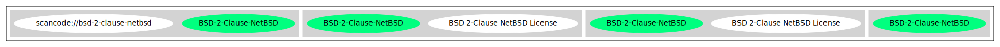

== BSD 2-Clause NetBSD License (BSD-2-Clause-NetBSD)

[cols=",",options="header",]
|===
|Key |Value
|Fullname |BSD 2-Clause NetBSD License
|Shortname |BSD-2-Clause-NetBSD
|Rating |Go
|Classification |NoCopyleft
|===

*Other Names:*

* `+scancode://bsd-2-clause-netbsd+`

=== Comments on (easy) usability

* **↑**``Rating is: Silver'' (source:
https://blueoakcouncil.org/list[BlueOak License List])

=== General Comments

* ``Except for the NetBSD Foundation name this license is identical to
the bsd-simplified Per SPDX.org, NetBSD adopted this 2-clause license in
2008 for code contributed to NetBSD Foundation. '' (source:
https://github.com/nexB/scancode-toolkit/blob/develop/src/licensedcode/data/licenses/bsd-2-clause-netbsd.yml[Scancode])

=== URLs

* *Homepage:* http://www.netbsd.org/about/redistribution.html#default
* *SPDX:* http://spdx.org/licenses/BSD-2-Clause-NetBSD.json
* *SPDX:* https://spdx.org/licenses/BSD-2-Clause-NetBSD.html

=== Text

....
Redistribution and use in source and binary forms, with or without modification,
are permitted provided that the following conditions are met:

1. Redistributions of source code must retain the above copyright notice, this
   list of conditions and the following disclaimer.

2. Redistributions in binary form must reproduce the above copyright notice,
   this list of conditions and the following disclaimer in the documentation
   and/or other materials provided with the distribution.

THIS SOFTWARE IS PROVIDED BY THE NETBSD FOUNDATION, INC. AND CONTRIBUTORS
``AS IS'' AND ANY EXPRESS OR IMPLIED WARRANTIES, INCLUDING, BUT NOT LIMITED
TO, THE IMPLIED WARRANTIES OF MERCHANTABILITY AND FITNESS FOR A PARTICULAR
PURPOSE ARE DISCLAIMED.  IN NO EVENT SHALL THE FOUNDATION OR CONTRIBUTORS
BE LIABLE FOR ANY DIRECT, INDIRECT, INCIDENTAL, SPECIAL, EXEMPLARY, OR
CONSEQUENTIAL DAMAGES (INCLUDING, BUT NOT LIMITED TO, PROCUREMENT OF
SUBSTITUTE GOODS OR SERVICES; LOSS OF USE, DATA, OR PROFITS; OR BUSINESS
INTERRUPTION) HOWEVER CAUSED AND ON ANY THEORY OF LIABILITY, WHETHER IN
CONTRACT, STRICT LIABILITY, OR TORT (INCLUDING NEGLIGENCE OR OTHERWISE)
ARISING IN ANY WAY OUT OF THE USE OF THIS SOFTWARE, EVEN IF ADVISED OF THE
POSSIBILITY OF SUCH DAMAGE.
....

'''''

=== Raw Data

....
{
    "__impliedNames": [
        "BSD-2-Clause-NetBSD",
        "BSD 2-Clause NetBSD License",
        "scancode://bsd-2-clause-netbsd"
    ],
    "__impliedId": "BSD-2-Clause-NetBSD",
    "__impliedComments": [
        [
            "Scancode",
            [
                "Except for the NetBSD Foundation name this license is identical to the\nbsd-simplified Per SPDX.org, NetBSD adopted this 2-clause license in 2008\nfor code contributed to NetBSD Foundation.\n"
            ]
        ]
    ],
    "facts": {
        "SPDX": {
            "isSPDXLicenseDeprecated": false,
            "spdxFullName": "BSD 2-Clause NetBSD License",
            "spdxDetailsURL": "http://spdx.org/licenses/BSD-2-Clause-NetBSD.json",
            "_sourceURL": "https://spdx.org/licenses/BSD-2-Clause-NetBSD.html",
            "spdxLicIsOSIApproved": false,
            "spdxSeeAlso": [
                "http://www.netbsd.org/about/redistribution.html#default"
            ],
            "_implications": {
                "__impliedNames": [
                    "BSD-2-Clause-NetBSD",
                    "BSD 2-Clause NetBSD License"
                ],
                "__impliedId": "BSD-2-Clause-NetBSD",
                "__isOsiApproved": false,
                "__impliedURLs": [
                    [
                        "SPDX",
                        "http://spdx.org/licenses/BSD-2-Clause-NetBSD.json"
                    ],
                    [
                        null,
                        "http://www.netbsd.org/about/redistribution.html#default"
                    ]
                ]
            },
            "spdxLicenseId": "BSD-2-Clause-NetBSD"
        },
        "Scancode": {
            "otherUrls": null,
            "homepageUrl": "http://www.netbsd.org/about/redistribution.html#default",
            "shortName": "BSD-2-Clause-NetBSD",
            "textUrls": null,
            "text": "Redistribution and use in source and binary forms, with or without modification,\nare permitted provided that the following conditions are met:\n\n1. Redistributions of source code must retain the above copyright notice, this\n   list of conditions and the following disclaimer.\n\n2. Redistributions in binary form must reproduce the above copyright notice,\n   this list of conditions and the following disclaimer in the documentation\n   and/or other materials provided with the distribution.\n\nTHIS SOFTWARE IS PROVIDED BY THE NETBSD FOUNDATION, INC. AND CONTRIBUTORS\n``AS IS'' AND ANY EXPRESS OR IMPLIED WARRANTIES, INCLUDING, BUT NOT LIMITED\nTO, THE IMPLIED WARRANTIES OF MERCHANTABILITY AND FITNESS FOR A PARTICULAR\nPURPOSE ARE DISCLAIMED.  IN NO EVENT SHALL THE FOUNDATION OR CONTRIBUTORS\nBE LIABLE FOR ANY DIRECT, INDIRECT, INCIDENTAL, SPECIAL, EXEMPLARY, OR\nCONSEQUENTIAL DAMAGES (INCLUDING, BUT NOT LIMITED TO, PROCUREMENT OF\nSUBSTITUTE GOODS OR SERVICES; LOSS OF USE, DATA, OR PROFITS; OR BUSINESS\nINTERRUPTION) HOWEVER CAUSED AND ON ANY THEORY OF LIABILITY, WHETHER IN\nCONTRACT, STRICT LIABILITY, OR TORT (INCLUDING NEGLIGENCE OR OTHERWISE)\nARISING IN ANY WAY OUT OF THE USE OF THIS SOFTWARE, EVEN IF ADVISED OF THE\nPOSSIBILITY OF SUCH DAMAGE.\n",
            "category": "Permissive",
            "osiUrl": null,
            "owner": "NetBSD",
            "_sourceURL": "https://github.com/nexB/scancode-toolkit/blob/develop/src/licensedcode/data/licenses/bsd-2-clause-netbsd.yml",
            "key": "bsd-2-clause-netbsd",
            "name": "BSD-2-Clause-NetBSD License",
            "spdxId": "BSD-2-Clause-NetBSD",
            "notes": "Except for the NetBSD Foundation name this license is identical to the\nbsd-simplified Per SPDX.org, NetBSD adopted this 2-clause license in 2008\nfor code contributed to NetBSD Foundation.\n",
            "_implications": {
                "__impliedNames": [
                    "scancode://bsd-2-clause-netbsd",
                    "BSD-2-Clause-NetBSD",
                    "BSD-2-Clause-NetBSD"
                ],
                "__impliedId": "BSD-2-Clause-NetBSD",
                "__impliedComments": [
                    [
                        "Scancode",
                        [
                            "Except for the NetBSD Foundation name this license is identical to the\nbsd-simplified Per SPDX.org, NetBSD adopted this 2-clause license in 2008\nfor code contributed to NetBSD Foundation.\n"
                        ]
                    ]
                ],
                "__impliedCopyleft": [
                    [
                        "Scancode",
                        "NoCopyleft"
                    ]
                ],
                "__calculatedCopyleft": "NoCopyleft",
                "__impliedText": "Redistribution and use in source and binary forms, with or without modification,\nare permitted provided that the following conditions are met:\n\n1. Redistributions of source code must retain the above copyright notice, this\n   list of conditions and the following disclaimer.\n\n2. Redistributions in binary form must reproduce the above copyright notice,\n   this list of conditions and the following disclaimer in the documentation\n   and/or other materials provided with the distribution.\n\nTHIS SOFTWARE IS PROVIDED BY THE NETBSD FOUNDATION, INC. AND CONTRIBUTORS\n``AS IS'' AND ANY EXPRESS OR IMPLIED WARRANTIES, INCLUDING, BUT NOT LIMITED\nTO, THE IMPLIED WARRANTIES OF MERCHANTABILITY AND FITNESS FOR A PARTICULAR\nPURPOSE ARE DISCLAIMED.  IN NO EVENT SHALL THE FOUNDATION OR CONTRIBUTORS\nBE LIABLE FOR ANY DIRECT, INDIRECT, INCIDENTAL, SPECIAL, EXEMPLARY, OR\nCONSEQUENTIAL DAMAGES (INCLUDING, BUT NOT LIMITED TO, PROCUREMENT OF\nSUBSTITUTE GOODS OR SERVICES; LOSS OF USE, DATA, OR PROFITS; OR BUSINESS\nINTERRUPTION) HOWEVER CAUSED AND ON ANY THEORY OF LIABILITY, WHETHER IN\nCONTRACT, STRICT LIABILITY, OR TORT (INCLUDING NEGLIGENCE OR OTHERWISE)\nARISING IN ANY WAY OUT OF THE USE OF THIS SOFTWARE, EVEN IF ADVISED OF THE\nPOSSIBILITY OF SUCH DAMAGE.\n",
                "__impliedURLs": [
                    [
                        "Homepage",
                        "http://www.netbsd.org/about/redistribution.html#default"
                    ]
                ]
            }
        },
        "BlueOak License List": {
            "BlueOakRating": "Silver",
            "url": "https://spdx.org/licenses/BSD-2-Clause-NetBSD.html",
            "isPermissive": true,
            "_sourceURL": "https://blueoakcouncil.org/list",
            "name": "BSD 2-Clause NetBSD License",
            "id": "BSD-2-Clause-NetBSD",
            "_implications": {
                "__impliedNames": [
                    "BSD-2-Clause-NetBSD"
                ],
                "__impliedJudgement": [
                    [
                        "BlueOak License List",
                        {
                            "tag": "PositiveJudgement",
                            "contents": "Rating is: Silver"
                        }
                    ]
                ],
                "__impliedCopyleft": [
                    [
                        "BlueOak License List",
                        "NoCopyleft"
                    ]
                ],
                "__calculatedCopyleft": "NoCopyleft",
                "__impliedURLs": [
                    [
                        "SPDX",
                        "https://spdx.org/licenses/BSD-2-Clause-NetBSD.html"
                    ]
                ]
            }
        }
    },
    "__impliedJudgement": [
        [
            "BlueOak License List",
            {
                "tag": "PositiveJudgement",
                "contents": "Rating is: Silver"
            }
        ]
    ],
    "__impliedCopyleft": [
        [
            "BlueOak License List",
            "NoCopyleft"
        ],
        [
            "Scancode",
            "NoCopyleft"
        ]
    ],
    "__calculatedCopyleft": "NoCopyleft",
    "__isOsiApproved": false,
    "__impliedText": "Redistribution and use in source and binary forms, with or without modification,\nare permitted provided that the following conditions are met:\n\n1. Redistributions of source code must retain the above copyright notice, this\n   list of conditions and the following disclaimer.\n\n2. Redistributions in binary form must reproduce the above copyright notice,\n   this list of conditions and the following disclaimer in the documentation\n   and/or other materials provided with the distribution.\n\nTHIS SOFTWARE IS PROVIDED BY THE NETBSD FOUNDATION, INC. AND CONTRIBUTORS\n``AS IS'' AND ANY EXPRESS OR IMPLIED WARRANTIES, INCLUDING, BUT NOT LIMITED\nTO, THE IMPLIED WARRANTIES OF MERCHANTABILITY AND FITNESS FOR A PARTICULAR\nPURPOSE ARE DISCLAIMED.  IN NO EVENT SHALL THE FOUNDATION OR CONTRIBUTORS\nBE LIABLE FOR ANY DIRECT, INDIRECT, INCIDENTAL, SPECIAL, EXEMPLARY, OR\nCONSEQUENTIAL DAMAGES (INCLUDING, BUT NOT LIMITED TO, PROCUREMENT OF\nSUBSTITUTE GOODS OR SERVICES; LOSS OF USE, DATA, OR PROFITS; OR BUSINESS\nINTERRUPTION) HOWEVER CAUSED AND ON ANY THEORY OF LIABILITY, WHETHER IN\nCONTRACT, STRICT LIABILITY, OR TORT (INCLUDING NEGLIGENCE OR OTHERWISE)\nARISING IN ANY WAY OUT OF THE USE OF THIS SOFTWARE, EVEN IF ADVISED OF THE\nPOSSIBILITY OF SUCH DAMAGE.\n",
    "__impliedURLs": [
        [
            "SPDX",
            "http://spdx.org/licenses/BSD-2-Clause-NetBSD.json"
        ],
        [
            null,
            "http://www.netbsd.org/about/redistribution.html#default"
        ],
        [
            "SPDX",
            "https://spdx.org/licenses/BSD-2-Clause-NetBSD.html"
        ],
        [
            "Homepage",
            "http://www.netbsd.org/about/redistribution.html#default"
        ]
    ]
}
....

'''''

=== Dot Cluster Graph

