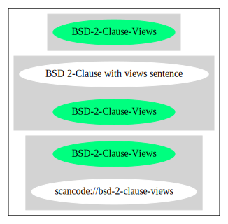

== BSD 2-Clause with views sentence (BSD-2-Clause-Views)

[cols=",",options="header",]
|===
|Key |Value
|Fullname |BSD 2-Clause with views sentence
|Shortname |BSD-2-Clause-Views
|Rating |Unknown, probably Attention or Stop or No-Go
|===

=== Comments on (easy) usability

=== General Comments

=== URLs

* *SPDX:* http://spdx.org/licenses/BSD-2-Clause-Views.json
* http://www.freebsd.org/copyright/freebsd-license.html
* https://people.freebsd.org/~ivoras/wine/patch-wine-nvidia.sh
* https://github.com/protegeproject/protege/blob/master/license.txt

'''''

=== Raw Data

* SPDX

....
{
    "__impliedNames": [
        "BSD-2-Clause-Views",
        "BSD 2-Clause with views sentence"
    ],
    "__impliedId": "BSD-2-Clause-Views",
    "facts": {
        "SPDX": {
            "isSPDXLicenseDeprecated": false,
            "spdxFullName": "BSD 2-Clause with views sentence",
            "spdxDetailsURL": "http://spdx.org/licenses/BSD-2-Clause-Views.json",
            "_sourceURL": "https://spdx.org/licenses/BSD-2-Clause-Views.html",
            "spdxLicIsOSIApproved": false,
            "spdxSeeAlso": [
                "http://www.freebsd.org/copyright/freebsd-license.html",
                "https://people.freebsd.org/~ivoras/wine/patch-wine-nvidia.sh",
                "https://github.com/protegeproject/protege/blob/master/license.txt"
            ],
            "_implications": {
                "__impliedNames": [
                    "BSD-2-Clause-Views",
                    "BSD 2-Clause with views sentence"
                ],
                "__impliedId": "BSD-2-Clause-Views",
                "__isOsiApproved": false,
                "__impliedURLs": [
                    [
                        "SPDX",
                        "http://spdx.org/licenses/BSD-2-Clause-Views.json"
                    ],
                    [
                        null,
                        "http://www.freebsd.org/copyright/freebsd-license.html"
                    ],
                    [
                        null,
                        "https://people.freebsd.org/~ivoras/wine/patch-wine-nvidia.sh"
                    ],
                    [
                        null,
                        "https://github.com/protegeproject/protege/blob/master/license.txt"
                    ]
                ]
            },
            "spdxLicenseId": "BSD-2-Clause-Views"
        }
    },
    "__isOsiApproved": false,
    "__impliedURLs": [
        [
            "SPDX",
            "http://spdx.org/licenses/BSD-2-Clause-Views.json"
        ],
        [
            null,
            "http://www.freebsd.org/copyright/freebsd-license.html"
        ],
        [
            null,
            "https://people.freebsd.org/~ivoras/wine/patch-wine-nvidia.sh"
        ],
        [
            null,
            "https://github.com/protegeproject/protege/blob/master/license.txt"
        ]
    ]
}
....

'''''

=== Dot Cluster Graph

