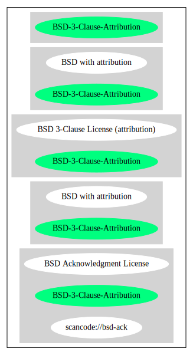

== BSD with attribution (BSD-3-Clause-Attribution)

[cols=",",options="header",]
|===
|Key |Value
|Fullname |BSD with attribution
|Shortname |BSD-3-Clause-Attribution
|Rating |Go
|Classification |NoCopyleft
|===

*Other Names:*

* `+scancode://bsd-ack+`
* `+BSD Acknowledgment License+`

=== Comments on (easy) usability

* **↑**``Rating is: Bronze'' (source:
https://blueoakcouncil.org/list[BlueOak License List])

=== General Comments

=== URLs

* *Homepage:*
https://fedoraproject.org/wiki/Licensing/BSD_with_Attribution
* *SPDX:* http://spdx.org/licenses/BSD-3-Clause-Attribution.json
* *SPDX:* https://spdx.org/licenses/BSD-3-Clause-Attribution.html

=== Text

....
Redistribution and use in source and binary forms, with or without modification,
are permitted provided that the following conditions are met:

     1. Redistributions of source code must retain the above copyright notice,
     this list of conditions and the following disclaimer.

     2. Redistributions in binary form must reproduce the above copyright
     notice, this list of conditions and the following disclaimer in the
     documentation and/or other materials provided with the distribution.

     3. Neither the name of the copyright holder nor the names of its
     contributors may be used to endorse or promote products derived from this
     software without specific prior written permission.

     4. Redistributions of any form whatsoever must retain the following
     acknowledgment: 'This product includes software developed by the
     "Universidad de Palermo, Argentina" (http://www.palermo.edu/).'

THIS SOFTWARE IS PROVIDED BY THE COPYRIGHT HOLDERS AND CONTRIBUTORS "AS IS" AND
ANY EXPRESS OR IMPLIED WARRANTIES, INCLUDING, BUT NOT LIMITED TO, THE IMPLIED
WARRANTIES OF MERCHANTABILITY AND FITNESS FOR A PARTICULAR PURPOSE ARE
DISCLAIMED. IN NO EVENT SHALL THE COPYRIGHT HOLDER OR CONTRIBUTORS BE LIABLE FOR
ANY DIRECT, INDIRECT, INCIDENTAL, SPECIAL, EXEMPLARY, OR CONSEQUENTIAL DAMAGES
(INCLUDING, BUT NOT LIMITED TO, PROCUREMENT OF SUBSTITUTE GOODS OR SERVICES;
LOSS OF USE, DATA, OR PROFITS; OR BUSINESS INTERRUPTION) HOWEVER CAUSED AND ON
ANY THEORY OF LIABILITY, WHETHER IN CONTRACT, STRICT LIABILITY, OR TORT
(INCLUDING NEGLIGENCE OR OTHERWISE) ARISING IN ANY WAY OUT OF THE USE OF THIS
SOFTWARE, EVEN IF ADVISED OF THE POSSIBILITY OF SUCH DAMAGE.
....

'''''

=== Raw Data

* SPDX
* BlueOak License List
* Scancode

....
{
    "__impliedNames": [
        "BSD-3-Clause-Attribution",
        "BSD with attribution",
        "scancode://bsd-ack",
        "BSD Acknowledgment License"
    ],
    "__impliedId": "BSD-3-Clause-Attribution",
    "facts": {
        "SPDX": {
            "isSPDXLicenseDeprecated": false,
            "spdxFullName": "BSD with attribution",
            "spdxDetailsURL": "http://spdx.org/licenses/BSD-3-Clause-Attribution.json",
            "_sourceURL": "https://spdx.org/licenses/BSD-3-Clause-Attribution.html",
            "spdxLicIsOSIApproved": false,
            "spdxSeeAlso": [
                "https://fedoraproject.org/wiki/Licensing/BSD_with_Attribution"
            ],
            "_implications": {
                "__impliedNames": [
                    "BSD-3-Clause-Attribution",
                    "BSD with attribution"
                ],
                "__impliedId": "BSD-3-Clause-Attribution",
                "__isOsiApproved": false,
                "__impliedURLs": [
                    [
                        "SPDX",
                        "http://spdx.org/licenses/BSD-3-Clause-Attribution.json"
                    ],
                    [
                        null,
                        "https://fedoraproject.org/wiki/Licensing/BSD_with_Attribution"
                    ]
                ]
            },
            "spdxLicenseId": "BSD-3-Clause-Attribution"
        },
        "Scancode": {
            "otherUrls": null,
            "homepageUrl": "https://fedoraproject.org/wiki/Licensing/BSD_with_Attribution",
            "shortName": "BSD Acknowledgment License",
            "textUrls": null,
            "text": "Redistribution and use in source and binary forms, with or without modification,\nare permitted provided that the following conditions are met:\n\n     1. Redistributions of source code must retain the above copyright notice,\n     this list of conditions and the following disclaimer.\n\n     2. Redistributions in binary form must reproduce the above copyright\n     notice, this list of conditions and the following disclaimer in the\n     documentation and/or other materials provided with the distribution.\n\n     3. Neither the name of the copyright holder nor the names of its\n     contributors may be used to endorse or promote products derived from this\n     software without specific prior written permission.\n\n     4. Redistributions of any form whatsoever must retain the following\n     acknowledgment: 'This product includes software developed by the\n     \"Universidad de Palermo, Argentina\" (http://www.palermo.edu/).'\n\nTHIS SOFTWARE IS PROVIDED BY THE COPYRIGHT HOLDERS AND CONTRIBUTORS \"AS IS\" AND\nANY EXPRESS OR IMPLIED WARRANTIES, INCLUDING, BUT NOT LIMITED TO, THE IMPLIED\nWARRANTIES OF MERCHANTABILITY AND FITNESS FOR A PARTICULAR PURPOSE ARE\nDISCLAIMED. IN NO EVENT SHALL THE COPYRIGHT HOLDER OR CONTRIBUTORS BE LIABLE FOR\nANY DIRECT, INDIRECT, INCIDENTAL, SPECIAL, EXEMPLARY, OR CONSEQUENTIAL DAMAGES\n(INCLUDING, BUT NOT LIMITED TO, PROCUREMENT OF SUBSTITUTE GOODS OR SERVICES;\nLOSS OF USE, DATA, OR PROFITS; OR BUSINESS INTERRUPTION) HOWEVER CAUSED AND ON\nANY THEORY OF LIABILITY, WHETHER IN CONTRACT, STRICT LIABILITY, OR TORT\n(INCLUDING NEGLIGENCE OR OTHERWISE) ARISING IN ANY WAY OUT OF THE USE OF THIS\nSOFTWARE, EVEN IF ADVISED OF THE POSSIBILITY OF SUCH DAMAGE.",
            "category": "Permissive",
            "osiUrl": null,
            "owner": "Universidad de Palermo",
            "_sourceURL": "https://github.com/nexB/scancode-toolkit/blob/develop/src/licensedcode/data/licenses/bsd-ack.yml",
            "key": "bsd-ack",
            "name": "BSD Acknowledgment License",
            "spdxId": "BSD-3-Clause-Attribution",
            "notes": null,
            "_implications": {
                "__impliedNames": [
                    "scancode://bsd-ack",
                    "BSD Acknowledgment License",
                    "BSD-3-Clause-Attribution"
                ],
                "__impliedId": "BSD-3-Clause-Attribution",
                "__impliedCopyleft": [
                    [
                        "Scancode",
                        "NoCopyleft"
                    ]
                ],
                "__calculatedCopyleft": "NoCopyleft",
                "__impliedText": "Redistribution and use in source and binary forms, with or without modification,\nare permitted provided that the following conditions are met:\n\n     1. Redistributions of source code must retain the above copyright notice,\n     this list of conditions and the following disclaimer.\n\n     2. Redistributions in binary form must reproduce the above copyright\n     notice, this list of conditions and the following disclaimer in the\n     documentation and/or other materials provided with the distribution.\n\n     3. Neither the name of the copyright holder nor the names of its\n     contributors may be used to endorse or promote products derived from this\n     software without specific prior written permission.\n\n     4. Redistributions of any form whatsoever must retain the following\n     acknowledgment: 'This product includes software developed by the\n     \"Universidad de Palermo, Argentina\" (http://www.palermo.edu/).'\n\nTHIS SOFTWARE IS PROVIDED BY THE COPYRIGHT HOLDERS AND CONTRIBUTORS \"AS IS\" AND\nANY EXPRESS OR IMPLIED WARRANTIES, INCLUDING, BUT NOT LIMITED TO, THE IMPLIED\nWARRANTIES OF MERCHANTABILITY AND FITNESS FOR A PARTICULAR PURPOSE ARE\nDISCLAIMED. IN NO EVENT SHALL THE COPYRIGHT HOLDER OR CONTRIBUTORS BE LIABLE FOR\nANY DIRECT, INDIRECT, INCIDENTAL, SPECIAL, EXEMPLARY, OR CONSEQUENTIAL DAMAGES\n(INCLUDING, BUT NOT LIMITED TO, PROCUREMENT OF SUBSTITUTE GOODS OR SERVICES;\nLOSS OF USE, DATA, OR PROFITS; OR BUSINESS INTERRUPTION) HOWEVER CAUSED AND ON\nANY THEORY OF LIABILITY, WHETHER IN CONTRACT, STRICT LIABILITY, OR TORT\n(INCLUDING NEGLIGENCE OR OTHERWISE) ARISING IN ANY WAY OUT OF THE USE OF THIS\nSOFTWARE, EVEN IF ADVISED OF THE POSSIBILITY OF SUCH DAMAGE.",
                "__impliedURLs": [
                    [
                        "Homepage",
                        "https://fedoraproject.org/wiki/Licensing/BSD_with_Attribution"
                    ]
                ]
            }
        },
        "BlueOak License List": {
            "BlueOakRating": "Bronze",
            "url": "https://spdx.org/licenses/BSD-3-Clause-Attribution.html",
            "isPermissive": true,
            "_sourceURL": "https://blueoakcouncil.org/list",
            "name": "BSD with attribution",
            "id": "BSD-3-Clause-Attribution",
            "_implications": {
                "__impliedNames": [
                    "BSD-3-Clause-Attribution",
                    "BSD with attribution"
                ],
                "__impliedJudgement": [
                    [
                        "BlueOak License List",
                        {
                            "tag": "PositiveJudgement",
                            "contents": "Rating is: Bronze"
                        }
                    ]
                ],
                "__impliedCopyleft": [
                    [
                        "BlueOak License List",
                        "NoCopyleft"
                    ]
                ],
                "__calculatedCopyleft": "NoCopyleft",
                "__impliedURLs": [
                    [
                        "SPDX",
                        "https://spdx.org/licenses/BSD-3-Clause-Attribution.html"
                    ]
                ]
            }
        }
    },
    "__impliedJudgement": [
        [
            "BlueOak License List",
            {
                "tag": "PositiveJudgement",
                "contents": "Rating is: Bronze"
            }
        ]
    ],
    "__impliedCopyleft": [
        [
            "BlueOak License List",
            "NoCopyleft"
        ],
        [
            "Scancode",
            "NoCopyleft"
        ]
    ],
    "__calculatedCopyleft": "NoCopyleft",
    "__isOsiApproved": false,
    "__impliedText": "Redistribution and use in source and binary forms, with or without modification,\nare permitted provided that the following conditions are met:\n\n     1. Redistributions of source code must retain the above copyright notice,\n     this list of conditions and the following disclaimer.\n\n     2. Redistributions in binary form must reproduce the above copyright\n     notice, this list of conditions and the following disclaimer in the\n     documentation and/or other materials provided with the distribution.\n\n     3. Neither the name of the copyright holder nor the names of its\n     contributors may be used to endorse or promote products derived from this\n     software without specific prior written permission.\n\n     4. Redistributions of any form whatsoever must retain the following\n     acknowledgment: 'This product includes software developed by the\n     \"Universidad de Palermo, Argentina\" (http://www.palermo.edu/).'\n\nTHIS SOFTWARE IS PROVIDED BY THE COPYRIGHT HOLDERS AND CONTRIBUTORS \"AS IS\" AND\nANY EXPRESS OR IMPLIED WARRANTIES, INCLUDING, BUT NOT LIMITED TO, THE IMPLIED\nWARRANTIES OF MERCHANTABILITY AND FITNESS FOR A PARTICULAR PURPOSE ARE\nDISCLAIMED. IN NO EVENT SHALL THE COPYRIGHT HOLDER OR CONTRIBUTORS BE LIABLE FOR\nANY DIRECT, INDIRECT, INCIDENTAL, SPECIAL, EXEMPLARY, OR CONSEQUENTIAL DAMAGES\n(INCLUDING, BUT NOT LIMITED TO, PROCUREMENT OF SUBSTITUTE GOODS OR SERVICES;\nLOSS OF USE, DATA, OR PROFITS; OR BUSINESS INTERRUPTION) HOWEVER CAUSED AND ON\nANY THEORY OF LIABILITY, WHETHER IN CONTRACT, STRICT LIABILITY, OR TORT\n(INCLUDING NEGLIGENCE OR OTHERWISE) ARISING IN ANY WAY OUT OF THE USE OF THIS\nSOFTWARE, EVEN IF ADVISED OF THE POSSIBILITY OF SUCH DAMAGE.",
    "__impliedURLs": [
        [
            "SPDX",
            "http://spdx.org/licenses/BSD-3-Clause-Attribution.json"
        ],
        [
            null,
            "https://fedoraproject.org/wiki/Licensing/BSD_with_Attribution"
        ],
        [
            "SPDX",
            "https://spdx.org/licenses/BSD-3-Clause-Attribution.html"
        ],
        [
            "Homepage",
            "https://fedoraproject.org/wiki/Licensing/BSD_with_Attribution"
        ]
    ]
}
....

'''''

=== Dot Cluster Graph

