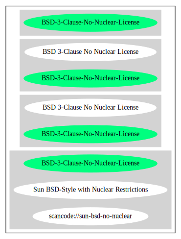

== BSD 3-Clause No Nuclear License (BSD-3-Clause-No-Nuclear-License)

[cols=",",options="header",]
|===
|Key |Value
|Fullname |BSD 3-Clause No Nuclear License
|Shortname |BSD-3-Clause-No-Nuclear-License
|Rating |Unknown, probably Attention or Stop or No-Go
|===

*Other Names:*

* `+scancode://sun-bsd-no-nuclear+`
* `+Sun BSD-Style with Nuclear Restrictions+`

=== Comments on (easy) usability

=== URLs

* *SPDX:* http://spdx.org/licenses/BSD-3-Clause-No-Nuclear-License.json
* http://download.oracle.com/otn-pub/java/licenses/bsd.txt?AuthParam=1467140197_43d516ce1776bd08a58235a7785be1cc
* https://jogamp.org/git/?p=gluegen.git;a=blob_plain;f=LICENSE.txt

=== Text

....
Redistribution and use in source and binary forms, with or without
modification, are permitted provided that the following conditions are
met:

Redistribution of source code must retain the above copyright notice,
this list of conditions and the following disclaimer.

Redistribution in binary form must reproduce the above copyright notice,
this list of conditions and the following disclaimer in the
documentation and/or other materials provided with the distribution.

Neither the name of Sun Microsystems, Inc. nor the names of contributors
may be used to endorse or promote products derived from this software
without specific prior written permission.

This software is provided "AS IS," without a warranty of any kind. ALL
EXPRESS OR IMPLIED CONDITIONS, REPRESENTATIONS AND WARRANTIES, INCLUDING
ANY IMPLIED WARRANTY OF MERCHANTABILITY, FITNESS FOR A PARTICULAR
PURPOSE OR NON-INFRINGEMENT, ARE HEREBY EXCLUDED. SUN MICROSYSTEMS, INC.
("SUN") AND ITS LICENSORS SHALL NOT BE LIABLE FOR ANY DAMAGES SUFFERED
BY LICENSEE AS A RESULT OF USING, MODIFYING OR DISTRIBUTING THIS
SOFTWARE OR ITS DERIVATIVES. IN NO EVENT WILL SUN OR ITS LICENSORS BE
LIABLE FOR ANY LOST REVENUE, PROFIT OR DATA, OR FOR DIRECT, INDIRECT,
SPECIAL, CONSEQUENTIAL, INCIDENTAL OR PUNITIVE DAMAGES, HOWEVER CAUSED
AND REGARDLESS OF THE THEORY OF LIABILITY, ARISING OUT OF THE USE OF OR
INABILITY TO USE THIS SOFTWARE, EVEN IF SUN HAS BEEN ADVISED OF THE
POSSIBILITY OF SUCH DAMAGES.

You acknowledge that this software is not designed, licensed or intended
for use in the design, construction, operation or maintenance of any
nuclear facility.
....

'''''

=== Raw Data

....
{
    "__impliedNames": [
        "BSD-3-Clause-No-Nuclear-License",
        "BSD 3-Clause No Nuclear License",
        "scancode://sun-bsd-no-nuclear",
        "Sun BSD-Style with Nuclear Restrictions"
    ],
    "__impliedId": "BSD-3-Clause-No-Nuclear-License",
    "facts": {
        "SPDX": {
            "isSPDXLicenseDeprecated": false,
            "spdxFullName": "BSD 3-Clause No Nuclear License",
            "spdxDetailsURL": "http://spdx.org/licenses/BSD-3-Clause-No-Nuclear-License.json",
            "_sourceURL": "https://spdx.org/licenses/BSD-3-Clause-No-Nuclear-License.html",
            "spdxLicIsOSIApproved": false,
            "spdxSeeAlso": [
                "http://download.oracle.com/otn-pub/java/licenses/bsd.txt?AuthParam=1467140197_43d516ce1776bd08a58235a7785be1cc"
            ],
            "_implications": {
                "__impliedNames": [
                    "BSD-3-Clause-No-Nuclear-License",
                    "BSD 3-Clause No Nuclear License"
                ],
                "__impliedId": "BSD-3-Clause-No-Nuclear-License",
                "__isOsiApproved": false,
                "__impliedURLs": [
                    [
                        "SPDX",
                        "http://spdx.org/licenses/BSD-3-Clause-No-Nuclear-License.json"
                    ],
                    [
                        null,
                        "http://download.oracle.com/otn-pub/java/licenses/bsd.txt?AuthParam=1467140197_43d516ce1776bd08a58235a7785be1cc"
                    ]
                ]
            },
            "spdxLicenseId": "BSD-3-Clause-No-Nuclear-License"
        },
        "Scancode": {
            "otherUrls": [
                "http://download.oracle.com/otn-pub/java/licenses/bsd.txt?AuthParam=1467140197_43d516ce1776bd08a58235a7785be1cc",
                "https://jogamp.org/git/?p=gluegen.git;a=blob_plain;f=LICENSE.txt"
            ],
            "homepageUrl": null,
            "shortName": "Sun BSD-Style with Nuclear Restrictions",
            "textUrls": null,
            "text": "Redistribution and use in source and binary forms, with or without\nmodification, are permitted provided that the following conditions are\nmet:\n\nRedistribution of source code must retain the above copyright notice,\nthis list of conditions and the following disclaimer.\n\nRedistribution in binary form must reproduce the above copyright notice,\nthis list of conditions and the following disclaimer in the\ndocumentation and/or other materials provided with the distribution.\n\nNeither the name of Sun Microsystems, Inc. nor the names of contributors\nmay be used to endorse or promote products derived from this software\nwithout specific prior written permission.\n\nThis software is provided \"AS IS,\" without a warranty of any kind. ALL\nEXPRESS OR IMPLIED CONDITIONS, REPRESENTATIONS AND WARRANTIES, INCLUDING\nANY IMPLIED WARRANTY OF MERCHANTABILITY, FITNESS FOR A PARTICULAR\nPURPOSE OR NON-INFRINGEMENT, ARE HEREBY EXCLUDED. SUN MICROSYSTEMS, INC.\n(\"SUN\") AND ITS LICENSORS SHALL NOT BE LIABLE FOR ANY DAMAGES SUFFERED\nBY LICENSEE AS A RESULT OF USING, MODIFYING OR DISTRIBUTING THIS\nSOFTWARE OR ITS DERIVATIVES. IN NO EVENT WILL SUN OR ITS LICENSORS BE\nLIABLE FOR ANY LOST REVENUE, PROFIT OR DATA, OR FOR DIRECT, INDIRECT,\nSPECIAL, CONSEQUENTIAL, INCIDENTAL OR PUNITIVE DAMAGES, HOWEVER CAUSED\nAND REGARDLESS OF THE THEORY OF LIABILITY, ARISING OUT OF THE USE OF OR\nINABILITY TO USE THIS SOFTWARE, EVEN IF SUN HAS BEEN ADVISED OF THE\nPOSSIBILITY OF SUCH DAMAGES.\n\nYou acknowledge that this software is not designed, licensed or intended\nfor use in the design, construction, operation or maintenance of any\nnuclear facility.",
            "category": "Free Restricted",
            "osiUrl": null,
            "owner": "Oracle (Sun)",
            "_sourceURL": "https://github.com/nexB/scancode-toolkit/blob/develop/src/licensedcode/data/licenses/sun-bsd-no-nuclear.yml",
            "key": "sun-bsd-no-nuclear",
            "name": "Sun BSD-Style with Nuclear Restrictions",
            "spdxId": "BSD-3-Clause-No-Nuclear-License",
            "_implications": {
                "__impliedNames": [
                    "scancode://sun-bsd-no-nuclear",
                    "Sun BSD-Style with Nuclear Restrictions",
                    "BSD-3-Clause-No-Nuclear-License"
                ],
                "__impliedId": "BSD-3-Clause-No-Nuclear-License",
                "__impliedText": "Redistribution and use in source and binary forms, with or without\nmodification, are permitted provided that the following conditions are\nmet:\n\nRedistribution of source code must retain the above copyright notice,\nthis list of conditions and the following disclaimer.\n\nRedistribution in binary form must reproduce the above copyright notice,\nthis list of conditions and the following disclaimer in the\ndocumentation and/or other materials provided with the distribution.\n\nNeither the name of Sun Microsystems, Inc. nor the names of contributors\nmay be used to endorse or promote products derived from this software\nwithout specific prior written permission.\n\nThis software is provided \"AS IS,\" without a warranty of any kind. ALL\nEXPRESS OR IMPLIED CONDITIONS, REPRESENTATIONS AND WARRANTIES, INCLUDING\nANY IMPLIED WARRANTY OF MERCHANTABILITY, FITNESS FOR A PARTICULAR\nPURPOSE OR NON-INFRINGEMENT, ARE HEREBY EXCLUDED. SUN MICROSYSTEMS, INC.\n(\"SUN\") AND ITS LICENSORS SHALL NOT BE LIABLE FOR ANY DAMAGES SUFFERED\nBY LICENSEE AS A RESULT OF USING, MODIFYING OR DISTRIBUTING THIS\nSOFTWARE OR ITS DERIVATIVES. IN NO EVENT WILL SUN OR ITS LICENSORS BE\nLIABLE FOR ANY LOST REVENUE, PROFIT OR DATA, OR FOR DIRECT, INDIRECT,\nSPECIAL, CONSEQUENTIAL, INCIDENTAL OR PUNITIVE DAMAGES, HOWEVER CAUSED\nAND REGARDLESS OF THE THEORY OF LIABILITY, ARISING OUT OF THE USE OF OR\nINABILITY TO USE THIS SOFTWARE, EVEN IF SUN HAS BEEN ADVISED OF THE\nPOSSIBILITY OF SUCH DAMAGES.\n\nYou acknowledge that this software is not designed, licensed or intended\nfor use in the design, construction, operation or maintenance of any\nnuclear facility.",
                "__impliedURLs": [
                    [
                        null,
                        "http://download.oracle.com/otn-pub/java/licenses/bsd.txt?AuthParam=1467140197_43d516ce1776bd08a58235a7785be1cc"
                    ],
                    [
                        null,
                        "https://jogamp.org/git/?p=gluegen.git;a=blob_plain;f=LICENSE.txt"
                    ]
                ]
            }
        }
    },
    "__isOsiApproved": false,
    "__impliedText": "Redistribution and use in source and binary forms, with or without\nmodification, are permitted provided that the following conditions are\nmet:\n\nRedistribution of source code must retain the above copyright notice,\nthis list of conditions and the following disclaimer.\n\nRedistribution in binary form must reproduce the above copyright notice,\nthis list of conditions and the following disclaimer in the\ndocumentation and/or other materials provided with the distribution.\n\nNeither the name of Sun Microsystems, Inc. nor the names of contributors\nmay be used to endorse or promote products derived from this software\nwithout specific prior written permission.\n\nThis software is provided \"AS IS,\" without a warranty of any kind. ALL\nEXPRESS OR IMPLIED CONDITIONS, REPRESENTATIONS AND WARRANTIES, INCLUDING\nANY IMPLIED WARRANTY OF MERCHANTABILITY, FITNESS FOR A PARTICULAR\nPURPOSE OR NON-INFRINGEMENT, ARE HEREBY EXCLUDED. SUN MICROSYSTEMS, INC.\n(\"SUN\") AND ITS LICENSORS SHALL NOT BE LIABLE FOR ANY DAMAGES SUFFERED\nBY LICENSEE AS A RESULT OF USING, MODIFYING OR DISTRIBUTING THIS\nSOFTWARE OR ITS DERIVATIVES. IN NO EVENT WILL SUN OR ITS LICENSORS BE\nLIABLE FOR ANY LOST REVENUE, PROFIT OR DATA, OR FOR DIRECT, INDIRECT,\nSPECIAL, CONSEQUENTIAL, INCIDENTAL OR PUNITIVE DAMAGES, HOWEVER CAUSED\nAND REGARDLESS OF THE THEORY OF LIABILITY, ARISING OUT OF THE USE OF OR\nINABILITY TO USE THIS SOFTWARE, EVEN IF SUN HAS BEEN ADVISED OF THE\nPOSSIBILITY OF SUCH DAMAGES.\n\nYou acknowledge that this software is not designed, licensed or intended\nfor use in the design, construction, operation or maintenance of any\nnuclear facility.",
    "__impliedURLs": [
        [
            "SPDX",
            "http://spdx.org/licenses/BSD-3-Clause-No-Nuclear-License.json"
        ],
        [
            null,
            "http://download.oracle.com/otn-pub/java/licenses/bsd.txt?AuthParam=1467140197_43d516ce1776bd08a58235a7785be1cc"
        ],
        [
            null,
            "https://jogamp.org/git/?p=gluegen.git;a=blob_plain;f=LICENSE.txt"
        ]
    ]
}
....

'''''

=== Dot Cluster Graph

