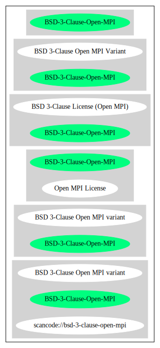

== BSD 3-Clause Open MPI variant (BSD-3-Clause-Open-MPI)

[cols=",",options="header",]
|===
|Key |Value
|Fullname |BSD 3-Clause Open MPI variant
|Shortname |BSD-3-Clause-Open-MPI
|Rating |Unknown, probably Attention or Stop or No-Go
|Classification |NoCopyleft
|===

*Other Names:*

* `+scancode://bsd-3-clause-open-mpi+`

=== Comments on (easy) usability

=== General Comments

=== URLs

* *Homepage:* https://www.open-mpi.org/community/license.php
* *SPDX:* http://spdx.org/licenses/BSD-3-Clause-Open-MPI.json
* http://www.netlib.org/lapack/LICENSE.txt

=== Text

....
Redistribution and use in source and binary forms, with or without
modification, are permitted provided that the following conditions are
met:

- Redistributions of source code must retain the above copyright
  notice, this list of conditions and the following disclaimer.

- Redistributions in binary form must reproduce the above copyright
  notice, this list of conditions and the following disclaimer listed
  in this license in the documentation and/or other materials
  provided with the distribution.

- Neither the name of the copyright holders nor the names of its
  contributors may be used to endorse or promote products derived from
  this software without specific prior written permission.

The copyright holders provide no reassurances that the source code
provided does not infringe any patent, copyright, or any other
intellectual property rights of third parties.  The copyright holders
disclaim any liability to any recipient for claims brought against
recipient by any third party for infringement of that parties
intellectual property rights.

THIS SOFTWARE IS PROVIDED BY THE COPYRIGHT HOLDERS AND CONTRIBUTORS
"AS IS" AND ANY EXPRESS OR IMPLIED WARRANTIES, INCLUDING, BUT NOT
LIMITED TO, THE IMPLIED WARRANTIES OF MERCHANTABILITY AND FITNESS FOR
A PARTICULAR PURPOSE ARE DISCLAIMED. IN NO EVENT SHALL THE COPYRIGHT
OWNER OR CONTRIBUTORS BE LIABLE FOR ANY DIRECT, INDIRECT, INCIDENTAL,
SPECIAL, EXEMPLARY, OR CONSEQUENTIAL DAMAGES (INCLUDING, BUT NOT
LIMITED TO, PROCUREMENT OF SUBSTITUTE GOODS OR SERVICES; LOSS OF USE,
DATA, OR PROFITS; OR BUSINESS INTERRUPTION) HOWEVER CAUSED AND ON ANY
THEORY OF LIABILITY, WHETHER IN CONTRACT, STRICT LIABILITY, OR TORT
(INCLUDING NEGLIGENCE OR OTHERWISE) ARISING IN ANY WAY OUT OF THE USE
OF THIS SOFTWARE, EVEN IF ADVISED OF THE POSSIBILITY OF SUCH DAMAGE.
....

'''''

=== Raw Data

....
{
    "__impliedNames": [
        "BSD-3-Clause-Open-MPI",
        "BSD 3-Clause Open MPI variant",
        "scancode://bsd-3-clause-open-mpi"
    ],
    "__impliedId": "BSD-3-Clause-Open-MPI",
    "facts": {
        "SPDX": {
            "isSPDXLicenseDeprecated": false,
            "spdxFullName": "BSD 3-Clause Open MPI variant",
            "spdxDetailsURL": "http://spdx.org/licenses/BSD-3-Clause-Open-MPI.json",
            "_sourceURL": "https://spdx.org/licenses/BSD-3-Clause-Open-MPI.html",
            "spdxLicIsOSIApproved": false,
            "spdxSeeAlso": [
                "https://www.open-mpi.org/community/license.php",
                "http://www.netlib.org/lapack/LICENSE.txt"
            ],
            "_implications": {
                "__impliedNames": [
                    "BSD-3-Clause-Open-MPI",
                    "BSD 3-Clause Open MPI variant"
                ],
                "__impliedId": "BSD-3-Clause-Open-MPI",
                "__isOsiApproved": false,
                "__impliedURLs": [
                    [
                        "SPDX",
                        "http://spdx.org/licenses/BSD-3-Clause-Open-MPI.json"
                    ],
                    [
                        null,
                        "https://www.open-mpi.org/community/license.php"
                    ],
                    [
                        null,
                        "http://www.netlib.org/lapack/LICENSE.txt"
                    ]
                ]
            },
            "spdxLicenseId": "BSD-3-Clause-Open-MPI"
        },
        "Scancode": {
            "otherUrls": [
                "https://www.open-mpi.org/community/license.php",
                "http://www.netlib.org/lapack/LICENSE.txt"
            ],
            "homepageUrl": "https://www.open-mpi.org/community/license.php",
            "shortName": "BSD 3-Clause Open MPI variant",
            "textUrls": null,
            "text": "Redistribution and use in source and binary forms, with or without\nmodification, are permitted provided that the following conditions are\nmet:\n\n- Redistributions of source code must retain the above copyright\n  notice, this list of conditions and the following disclaimer.\n\n- Redistributions in binary form must reproduce the above copyright\n  notice, this list of conditions and the following disclaimer listed\n  in this license in the documentation and/or other materials\n  provided with the distribution.\n\n- Neither the name of the copyright holders nor the names of its\n  contributors may be used to endorse or promote products derived from\n  this software without specific prior written permission.\n\nThe copyright holders provide no reassurances that the source code\nprovided does not infringe any patent, copyright, or any other\nintellectual property rights of third parties.  The copyright holders\ndisclaim any liability to any recipient for claims brought against\nrecipient by any third party for infringement of that parties\nintellectual property rights.\n\nTHIS SOFTWARE IS PROVIDED BY THE COPYRIGHT HOLDERS AND CONTRIBUTORS\n\"AS IS\" AND ANY EXPRESS OR IMPLIED WARRANTIES, INCLUDING, BUT NOT\nLIMITED TO, THE IMPLIED WARRANTIES OF MERCHANTABILITY AND FITNESS FOR\nA PARTICULAR PURPOSE ARE DISCLAIMED. IN NO EVENT SHALL THE COPYRIGHT\nOWNER OR CONTRIBUTORS BE LIABLE FOR ANY DIRECT, INDIRECT, INCIDENTAL,\nSPECIAL, EXEMPLARY, OR CONSEQUENTIAL DAMAGES (INCLUDING, BUT NOT\nLIMITED TO, PROCUREMENT OF SUBSTITUTE GOODS OR SERVICES; LOSS OF USE,\nDATA, OR PROFITS; OR BUSINESS INTERRUPTION) HOWEVER CAUSED AND ON ANY\nTHEORY OF LIABILITY, WHETHER IN CONTRACT, STRICT LIABILITY, OR TORT\n(INCLUDING NEGLIGENCE OR OTHERWISE) ARISING IN ANY WAY OUT OF THE USE\nOF THIS SOFTWARE, EVEN IF ADVISED OF THE POSSIBILITY OF SUCH DAMAGE.",
            "category": "Permissive",
            "osiUrl": null,
            "owner": "Open MPI",
            "_sourceURL": "https://github.com/nexB/scancode-toolkit/blob/develop/src/licensedcode/data/licenses/bsd-3-clause-open-mpi.yml",
            "key": "bsd-3-clause-open-mpi",
            "name": "BSD 3-Clause Open MPI variant",
            "spdxId": "BSD-3-Clause-Open-MPI",
            "notes": null,
            "_implications": {
                "__impliedNames": [
                    "scancode://bsd-3-clause-open-mpi",
                    "BSD 3-Clause Open MPI variant",
                    "BSD-3-Clause-Open-MPI"
                ],
                "__impliedId": "BSD-3-Clause-Open-MPI",
                "__impliedCopyleft": [
                    [
                        "Scancode",
                        "NoCopyleft"
                    ]
                ],
                "__calculatedCopyleft": "NoCopyleft",
                "__impliedText": "Redistribution and use in source and binary forms, with or without\nmodification, are permitted provided that the following conditions are\nmet:\n\n- Redistributions of source code must retain the above copyright\n  notice, this list of conditions and the following disclaimer.\n\n- Redistributions in binary form must reproduce the above copyright\n  notice, this list of conditions and the following disclaimer listed\n  in this license in the documentation and/or other materials\n  provided with the distribution.\n\n- Neither the name of the copyright holders nor the names of its\n  contributors may be used to endorse or promote products derived from\n  this software without specific prior written permission.\n\nThe copyright holders provide no reassurances that the source code\nprovided does not infringe any patent, copyright, or any other\nintellectual property rights of third parties.  The copyright holders\ndisclaim any liability to any recipient for claims brought against\nrecipient by any third party for infringement of that parties\nintellectual property rights.\n\nTHIS SOFTWARE IS PROVIDED BY THE COPYRIGHT HOLDERS AND CONTRIBUTORS\n\"AS IS\" AND ANY EXPRESS OR IMPLIED WARRANTIES, INCLUDING, BUT NOT\nLIMITED TO, THE IMPLIED WARRANTIES OF MERCHANTABILITY AND FITNESS FOR\nA PARTICULAR PURPOSE ARE DISCLAIMED. IN NO EVENT SHALL THE COPYRIGHT\nOWNER OR CONTRIBUTORS BE LIABLE FOR ANY DIRECT, INDIRECT, INCIDENTAL,\nSPECIAL, EXEMPLARY, OR CONSEQUENTIAL DAMAGES (INCLUDING, BUT NOT\nLIMITED TO, PROCUREMENT OF SUBSTITUTE GOODS OR SERVICES; LOSS OF USE,\nDATA, OR PROFITS; OR BUSINESS INTERRUPTION) HOWEVER CAUSED AND ON ANY\nTHEORY OF LIABILITY, WHETHER IN CONTRACT, STRICT LIABILITY, OR TORT\n(INCLUDING NEGLIGENCE OR OTHERWISE) ARISING IN ANY WAY OUT OF THE USE\nOF THIS SOFTWARE, EVEN IF ADVISED OF THE POSSIBILITY OF SUCH DAMAGE.",
                "__impliedURLs": [
                    [
                        "Homepage",
                        "https://www.open-mpi.org/community/license.php"
                    ],
                    [
                        null,
                        "https://www.open-mpi.org/community/license.php"
                    ],
                    [
                        null,
                        "http://www.netlib.org/lapack/LICENSE.txt"
                    ]
                ]
            }
        }
    },
    "__impliedCopyleft": [
        [
            "Scancode",
            "NoCopyleft"
        ]
    ],
    "__calculatedCopyleft": "NoCopyleft",
    "__isOsiApproved": false,
    "__impliedText": "Redistribution and use in source and binary forms, with or without\nmodification, are permitted provided that the following conditions are\nmet:\n\n- Redistributions of source code must retain the above copyright\n  notice, this list of conditions and the following disclaimer.\n\n- Redistributions in binary form must reproduce the above copyright\n  notice, this list of conditions and the following disclaimer listed\n  in this license in the documentation and/or other materials\n  provided with the distribution.\n\n- Neither the name of the copyright holders nor the names of its\n  contributors may be used to endorse or promote products derived from\n  this software without specific prior written permission.\n\nThe copyright holders provide no reassurances that the source code\nprovided does not infringe any patent, copyright, or any other\nintellectual property rights of third parties.  The copyright holders\ndisclaim any liability to any recipient for claims brought against\nrecipient by any third party for infringement of that parties\nintellectual property rights.\n\nTHIS SOFTWARE IS PROVIDED BY THE COPYRIGHT HOLDERS AND CONTRIBUTORS\n\"AS IS\" AND ANY EXPRESS OR IMPLIED WARRANTIES, INCLUDING, BUT NOT\nLIMITED TO, THE IMPLIED WARRANTIES OF MERCHANTABILITY AND FITNESS FOR\nA PARTICULAR PURPOSE ARE DISCLAIMED. IN NO EVENT SHALL THE COPYRIGHT\nOWNER OR CONTRIBUTORS BE LIABLE FOR ANY DIRECT, INDIRECT, INCIDENTAL,\nSPECIAL, EXEMPLARY, OR CONSEQUENTIAL DAMAGES (INCLUDING, BUT NOT\nLIMITED TO, PROCUREMENT OF SUBSTITUTE GOODS OR SERVICES; LOSS OF USE,\nDATA, OR PROFITS; OR BUSINESS INTERRUPTION) HOWEVER CAUSED AND ON ANY\nTHEORY OF LIABILITY, WHETHER IN CONTRACT, STRICT LIABILITY, OR TORT\n(INCLUDING NEGLIGENCE OR OTHERWISE) ARISING IN ANY WAY OUT OF THE USE\nOF THIS SOFTWARE, EVEN IF ADVISED OF THE POSSIBILITY OF SUCH DAMAGE.",
    "__impliedURLs": [
        [
            "SPDX",
            "http://spdx.org/licenses/BSD-3-Clause-Open-MPI.json"
        ],
        [
            null,
            "https://www.open-mpi.org/community/license.php"
        ],
        [
            null,
            "http://www.netlib.org/lapack/LICENSE.txt"
        ],
        [
            "Homepage",
            "https://www.open-mpi.org/community/license.php"
        ]
    ]
}
....

'''''

=== Dot Cluster Graph

