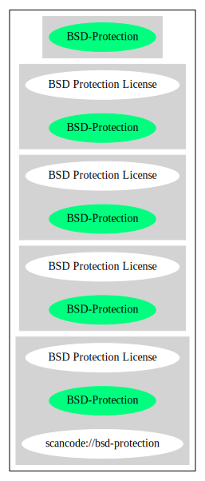

== BSD Protection License (BSD-Protection)

[cols=",",options="header",]
|===
|Key |Value
|Fullname |BSD Protection License
|Shortname |BSD-Protection
|Rating |Unknown, probably Attention or Stop or No-Go
|Classification |StrongCopyleft
|===

*Other Names:*

* `+scancode://bsd-protection+`

=== Comments on (easy) usability

=== General Comments

* ``Strong copyleft licenses require you to share both the licensed
software (like the weak copyleft licenses, and larger programs that you
build with the licensed software, when you give copies to others.''
(source: https://blueoakcouncil.org/copyleft[BlueOak License List])

=== URLs

* *Homepage:*
https://fedoraproject.org/wiki/Licensing/BSD_Protection_License
* *SPDX:* http://spdx.org/licenses/BSD-Protection.json
* https://spdx.org/licenses/BSD-Protection.html

=== Text

....
BSD Protection License
February 2002

Preamble
--------

The Berkeley Software Distribution ("BSD") license has proven very effective
over the years at allowing for a wide spread of work throughout both
commercial and non-commercial products.  For programmers whose primary
intention is to improve the general quality of available software, it is
arguable that there is no better license than the BSD license, as it
permits improvements to be used wherever they will help, without
idealogical or metallic constraint.

This is of particular value to those who produce reference
implementations of proposed standards: The case of TCP/IP clearly
illustrates that freely and universally available implementations leads
the rapid acceptance of standards -- often even being used instead of a
de jure standard (eg, OSI network models).

With the rapid proliferation of software licensed under the GNU General
Public License, however, the continued success of this role is called
into question.  Given that the inclusion of a few lines of "GPL-tainted"
work into a larger body of work will result in restricted distribution
-- and given that further work will likely build upon the "tainted"
portions, making them difficult to remove at a future date -- there are
inevitable circumstances where authors would, in order to protect their
goal of providing for the widespread usage of their work, wish to guard
against such "GPL-taint".

In addition, one can imagine that companies which operate by producing
and selling (possibly closed-source) code would wish to protect
themselves against the rise of a GPL-licensed competitor.  While under
existing licenses this would mean not releasing their code under any
form of open license, if a license existed under which they could
incorporate any improvements back into their own (commercial) products
then they might be far more willing to provide for non-closed distribution.

For the above reasons, we put forth this "BSD Protection License": A
license designed to retain the freedom granted by the BSD license to use
licensed works in a wide variety of settings, both non-commercial and
commercial, while protecting the work from having future contributors
restrict that freedom.

The precise terms and conditions for copying, distribution, and
modification follow.

BSD PROTECTION LICENSE
TERMS AND CONDITIONS FOR COPYING, DISTRIBUTION, AND MODIFICATION
----------------------------------------------------------------

0. Definitions.
   a) "Program", below, refers to any program or work distributed under
      the terms of this license.
   b) A "work based on the Program", below, refers to either the Program
      or any derivative work under copyright law.
   c) "Modification", below, refers to the act of creating derivative
      works.
   d) "You", below, refers to each licensee.

1. Scope.
   This license governs the copying, distribution, and modification of
   the Program.  Other activities are outside the scope of this
   license; The act of running the Program is not restricted, and the
   output from the Program is covered only if its contents constitute a
   work based on the Program.

2. Verbatim copies.
   You may copy and distribute verbatim copies of the Program as you
   receive it, in any medium, provided that you conspicuously and
   appropriately publish on each copy an appropriate copyright notice;
   keep intact all the notices that refer to this License and to the
   absence of any warranty; and give any other recipients of the
   Program a copy of this License along with the Program.

3. Modification and redistribution under closed license.
   You may modify your copy or copies of the Program, and distribute
   the resulting derivative works, provided that you meet the
   following conditions:
   a) The copyright notice and disclaimer on the Program must be
      reproduced and included in the source code, documentation, and/or
      other materials provided in a manner in which such notices are
      normally distributed.
   b) The derivative work must be clearly identified as such, in order
      that it may not be confused with the original work.
   c) The license under which the derivative work is distributed must
      expressly prohibit the distribution of further derivative works.

4. Modification and redistribution under open license.
   You may modify your copy or copies of the Program, and distribute
   the resulting derivative works, provided that you meet the
   following conditions:
   a) The copyright notice and disclaimer on the Program must be
      reproduced and included in the source code, documentation, and/or
      other materials provided in a manner in which such notices are
      normally distributed.
   b) You must clearly indicate the nature and date of any changes made
      to the Program.  The full details need not necessarily be
      included in the individual modified files, provided that each
      modified file is clearly marked as such and instructions are
      included on where the full details of the modifications may be
      found.
   c) You must cause any work that you distribute or publish, that in
      whole or in part contains or is derived from the Program or any
      part thereof, to be licensed as a whole at no charge to all third
      parties under the terms of this License.

5. Implied acceptance.
   You may not copy or distribute the Program or any derivative works
   except as expressly provided under this license.  Consequently, any
   such action will be taken as implied acceptance of the terms of this
   license.

6. NO WARRANTY.
   THIS SOFTWARE IS PROVIDED "AS IS" AND ANY EXPRESS OR IMPLIED
   WARRANTIES, INCLUDING, BUT NOT LIMITED TO, THE IMPLIED WARRANTIES OF
   MERCHANTABILITY AND FITNESS FOR A PARTICULAR PURPOSE ARE
   DISCLAIMED.  IN NO EVENT SHALL THE COPYRIGHT HOLDER, OR ANY OTHER
   PARTY WHO MAY MODIFY AND/OR REDISTRIBUTE THE PROGRAM AS PERMITTED
   ABOVE, BE LIABLE FOR ANY DIRECT, INDIRECT, INCIDENTAL, SPECIAL,
   EXEMPLARY, OR CONSEQUENTIAL DAMAGES ARISING OUT OF THE USE OR
   INABILITY TO USE THE PROGRAM (INCLUDING, BUT NOT LIMITED TO,
   PROCUREMENT OF SUBSTITUTE GOODS OR SERVICES; LOSS OF USE, DATA, OR
   PROFITS; OR BUSINESS INTERRUPTION) HOWEVER CAUSED AND ON ANY THEORY
   OF LIABILITY, WHETHER IN CONTRACT, STRICT LIABILITY, OR TORT, EVEN
   IF SUCH HOLDER OR OTHER PARTY HAS BEEN ADVISED OF THE POSSIBILITY OF
   SUCH DAMAGES.
....

'''''

=== Raw Data

==== Facts

* https://spdx.org/licenses/BSD-Protection.html[SPDX]
* https://blueoakcouncil.org/copyleft[BlueOak License List]
* https://github.com/nexB/scancode-toolkit/blob/develop/src/licensedcode/data/licenses/bsd-protection.yml[Scancode]

==== Raw JSON

....
{
    "__impliedNames": [
        "BSD-Protection",
        "BSD Protection License",
        "scancode://bsd-protection"
    ],
    "__impliedId": "BSD-Protection",
    "__impliedAmbiguousNames": [
        "BSD Protection License"
    ],
    "__impliedComments": [
        [
            "BlueOak License List",
            [
                "Strong copyleft licenses require you to share both the licensed software (like the weak copyleft licenses, and larger programs that you build with the licensed software, when you give copies to others."
            ]
        ]
    ],
    "facts": {
        "SPDX": {
            "isSPDXLicenseDeprecated": false,
            "spdxFullName": "BSD Protection License",
            "spdxDetailsURL": "http://spdx.org/licenses/BSD-Protection.json",
            "_sourceURL": "https://spdx.org/licenses/BSD-Protection.html",
            "spdxLicIsOSIApproved": false,
            "spdxSeeAlso": [
                "https://fedoraproject.org/wiki/Licensing/BSD_Protection_License"
            ],
            "_implications": {
                "__impliedNames": [
                    "BSD-Protection",
                    "BSD Protection License"
                ],
                "__impliedId": "BSD-Protection",
                "__isOsiApproved": false,
                "__impliedURLs": [
                    [
                        "SPDX",
                        "http://spdx.org/licenses/BSD-Protection.json"
                    ],
                    [
                        null,
                        "https://fedoraproject.org/wiki/Licensing/BSD_Protection_License"
                    ]
                ]
            },
            "spdxLicenseId": "BSD-Protection"
        },
        "Scancode": {
            "otherUrls": null,
            "homepageUrl": "https://fedoraproject.org/wiki/Licensing/BSD_Protection_License",
            "shortName": "BSD Protection License",
            "textUrls": null,
            "text": "BSD Protection License\nFebruary 2002\n\nPreamble\n--------\n\nThe Berkeley Software Distribution (\"BSD\") license has proven very effective\nover the years at allowing for a wide spread of work throughout both\ncommercial and non-commercial products.  For programmers whose primary\nintention is to improve the general quality of available software, it is\narguable that there is no better license than the BSD license, as it\npermits improvements to be used wherever they will help, without\nidealogical or metallic constraint.\n\nThis is of particular value to those who produce reference\nimplementations of proposed standards: The case of TCP/IP clearly\nillustrates that freely and universally available implementations leads\nthe rapid acceptance of standards -- often even being used instead of a\nde jure standard (eg, OSI network models).\n\nWith the rapid proliferation of software licensed under the GNU General\nPublic License, however, the continued success of this role is called\ninto question.  Given that the inclusion of a few lines of \"GPL-tainted\"\nwork into a larger body of work will result in restricted distribution\n-- and given that further work will likely build upon the \"tainted\"\nportions, making them difficult to remove at a future date -- there are\ninevitable circumstances where authors would, in order to protect their\ngoal of providing for the widespread usage of their work, wish to guard\nagainst such \"GPL-taint\".\n\nIn addition, one can imagine that companies which operate by producing\nand selling (possibly closed-source) code would wish to protect\nthemselves against the rise of a GPL-licensed competitor.  While under\nexisting licenses this would mean not releasing their code under any\nform of open license, if a license existed under which they could\nincorporate any improvements back into their own (commercial) products\nthen they might be far more willing to provide for non-closed distribution.\n\nFor the above reasons, we put forth this \"BSD Protection License\": A\nlicense designed to retain the freedom granted by the BSD license to use\nlicensed works in a wide variety of settings, both non-commercial and\ncommercial, while protecting the work from having future contributors\nrestrict that freedom.\n\nThe precise terms and conditions for copying, distribution, and\nmodification follow.\n\nBSD PROTECTION LICENSE\nTERMS AND CONDITIONS FOR COPYING, DISTRIBUTION, AND MODIFICATION\n----------------------------------------------------------------\n\n0. Definitions.\n   a) \"Program\", below, refers to any program or work distributed under\n      the terms of this license.\n   b) A \"work based on the Program\", below, refers to either the Program\n      or any derivative work under copyright law.\n   c) \"Modification\", below, refers to the act of creating derivative\n      works.\n   d) \"You\", below, refers to each licensee.\n\n1. Scope.\n   This license governs the copying, distribution, and modification of\n   the Program.  Other activities are outside the scope of this\n   license; The act of running the Program is not restricted, and the\n   output from the Program is covered only if its contents constitute a\n   work based on the Program.\n\n2. Verbatim copies.\n   You may copy and distribute verbatim copies of the Program as you\n   receive it, in any medium, provided that you conspicuously and\n   appropriately publish on each copy an appropriate copyright notice;\n   keep intact all the notices that refer to this License and to the\n   absence of any warranty; and give any other recipients of the\n   Program a copy of this License along with the Program.\n\n3. Modification and redistribution under closed license.\n   You may modify your copy or copies of the Program, and distribute\n   the resulting derivative works, provided that you meet the\n   following conditions:\n   a) The copyright notice and disclaimer on the Program must be\n      reproduced and included in the source code, documentation, and/or\n      other materials provided in a manner in which such notices are\n      normally distributed.\n   b) The derivative work must be clearly identified as such, in order\n      that it may not be confused with the original work.\n   c) The license under which the derivative work is distributed must\n      expressly prohibit the distribution of further derivative works.\n\n4. Modification and redistribution under open license.\n   You may modify your copy or copies of the Program, and distribute\n   the resulting derivative works, provided that you meet the\n   following conditions:\n   a) The copyright notice and disclaimer on the Program must be\n      reproduced and included in the source code, documentation, and/or\n      other materials provided in a manner in which such notices are\n      normally distributed.\n   b) You must clearly indicate the nature and date of any changes made\n      to the Program.  The full details need not necessarily be\n      included in the individual modified files, provided that each\n      modified file is clearly marked as such and instructions are\n      included on where the full details of the modifications may be\n      found.\n   c) You must cause any work that you distribute or publish, that in\n      whole or in part contains or is derived from the Program or any\n      part thereof, to be licensed as a whole at no charge to all third\n      parties under the terms of this License.\n\n5. Implied acceptance.\n   You may not copy or distribute the Program or any derivative works\n   except as expressly provided under this license.  Consequently, any\n   such action will be taken as implied acceptance of the terms of this\n   license.\n\n6. NO WARRANTY.\n   THIS SOFTWARE IS PROVIDED \"AS IS\" AND ANY EXPRESS OR IMPLIED\n   WARRANTIES, INCLUDING, BUT NOT LIMITED TO, THE IMPLIED WARRANTIES OF\n   MERCHANTABILITY AND FITNESS FOR A PARTICULAR PURPOSE ARE\n   DISCLAIMED.  IN NO EVENT SHALL THE COPYRIGHT HOLDER, OR ANY OTHER\n   PARTY WHO MAY MODIFY AND/OR REDISTRIBUTE THE PROGRAM AS PERMITTED\n   ABOVE, BE LIABLE FOR ANY DIRECT, INDIRECT, INCIDENTAL, SPECIAL,\n   EXEMPLARY, OR CONSEQUENTIAL DAMAGES ARISING OUT OF THE USE OR\n   INABILITY TO USE THE PROGRAM (INCLUDING, BUT NOT LIMITED TO,\n   PROCUREMENT OF SUBSTITUTE GOODS OR SERVICES; LOSS OF USE, DATA, OR\n   PROFITS; OR BUSINESS INTERRUPTION) HOWEVER CAUSED AND ON ANY THEORY\n   OF LIABILITY, WHETHER IN CONTRACT, STRICT LIABILITY, OR TORT, EVEN\n   IF SUCH HOLDER OR OTHER PARTY HAS BEEN ADVISED OF THE POSSIBILITY OF\n   SUCH DAMAGES.",
            "category": "Copyleft",
            "osiUrl": null,
            "owner": "FreeBSD",
            "_sourceURL": "https://github.com/nexB/scancode-toolkit/blob/develop/src/licensedcode/data/licenses/bsd-protection.yml",
            "key": "bsd-protection",
            "name": "BSD Protection License",
            "spdxId": "BSD-Protection",
            "notes": null,
            "_implications": {
                "__impliedNames": [
                    "scancode://bsd-protection",
                    "BSD Protection License",
                    "BSD-Protection"
                ],
                "__impliedId": "BSD-Protection",
                "__impliedCopyleft": [
                    [
                        "Scancode",
                        "Copyleft"
                    ]
                ],
                "__calculatedCopyleft": "Copyleft",
                "__impliedText": "BSD Protection License\nFebruary 2002\n\nPreamble\n--------\n\nThe Berkeley Software Distribution (\"BSD\") license has proven very effective\nover the years at allowing for a wide spread of work throughout both\ncommercial and non-commercial products.  For programmers whose primary\nintention is to improve the general quality of available software, it is\narguable that there is no better license than the BSD license, as it\npermits improvements to be used wherever they will help, without\nidealogical or metallic constraint.\n\nThis is of particular value to those who produce reference\nimplementations of proposed standards: The case of TCP/IP clearly\nillustrates that freely and universally available implementations leads\nthe rapid acceptance of standards -- often even being used instead of a\nde jure standard (eg, OSI network models).\n\nWith the rapid proliferation of software licensed under the GNU General\nPublic License, however, the continued success of this role is called\ninto question.  Given that the inclusion of a few lines of \"GPL-tainted\"\nwork into a larger body of work will result in restricted distribution\n-- and given that further work will likely build upon the \"tainted\"\nportions, making them difficult to remove at a future date -- there are\ninevitable circumstances where authors would, in order to protect their\ngoal of providing for the widespread usage of their work, wish to guard\nagainst such \"GPL-taint\".\n\nIn addition, one can imagine that companies which operate by producing\nand selling (possibly closed-source) code would wish to protect\nthemselves against the rise of a GPL-licensed competitor.  While under\nexisting licenses this would mean not releasing their code under any\nform of open license, if a license existed under which they could\nincorporate any improvements back into their own (commercial) products\nthen they might be far more willing to provide for non-closed distribution.\n\nFor the above reasons, we put forth this \"BSD Protection License\": A\nlicense designed to retain the freedom granted by the BSD license to use\nlicensed works in a wide variety of settings, both non-commercial and\ncommercial, while protecting the work from having future contributors\nrestrict that freedom.\n\nThe precise terms and conditions for copying, distribution, and\nmodification follow.\n\nBSD PROTECTION LICENSE\nTERMS AND CONDITIONS FOR COPYING, DISTRIBUTION, AND MODIFICATION\n----------------------------------------------------------------\n\n0. Definitions.\n   a) \"Program\", below, refers to any program or work distributed under\n      the terms of this license.\n   b) A \"work based on the Program\", below, refers to either the Program\n      or any derivative work under copyright law.\n   c) \"Modification\", below, refers to the act of creating derivative\n      works.\n   d) \"You\", below, refers to each licensee.\n\n1. Scope.\n   This license governs the copying, distribution, and modification of\n   the Program.  Other activities are outside the scope of this\n   license; The act of running the Program is not restricted, and the\n   output from the Program is covered only if its contents constitute a\n   work based on the Program.\n\n2. Verbatim copies.\n   You may copy and distribute verbatim copies of the Program as you\n   receive it, in any medium, provided that you conspicuously and\n   appropriately publish on each copy an appropriate copyright notice;\n   keep intact all the notices that refer to this License and to the\n   absence of any warranty; and give any other recipients of the\n   Program a copy of this License along with the Program.\n\n3. Modification and redistribution under closed license.\n   You may modify your copy or copies of the Program, and distribute\n   the resulting derivative works, provided that you meet the\n   following conditions:\n   a) The copyright notice and disclaimer on the Program must be\n      reproduced and included in the source code, documentation, and/or\n      other materials provided in a manner in which such notices are\n      normally distributed.\n   b) The derivative work must be clearly identified as such, in order\n      that it may not be confused with the original work.\n   c) The license under which the derivative work is distributed must\n      expressly prohibit the distribution of further derivative works.\n\n4. Modification and redistribution under open license.\n   You may modify your copy or copies of the Program, and distribute\n   the resulting derivative works, provided that you meet the\n   following conditions:\n   a) The copyright notice and disclaimer on the Program must be\n      reproduced and included in the source code, documentation, and/or\n      other materials provided in a manner in which such notices are\n      normally distributed.\n   b) You must clearly indicate the nature and date of any changes made\n      to the Program.  The full details need not necessarily be\n      included in the individual modified files, provided that each\n      modified file is clearly marked as such and instructions are\n      included on where the full details of the modifications may be\n      found.\n   c) You must cause any work that you distribute or publish, that in\n      whole or in part contains or is derived from the Program or any\n      part thereof, to be licensed as a whole at no charge to all third\n      parties under the terms of this License.\n\n5. Implied acceptance.\n   You may not copy or distribute the Program or any derivative works\n   except as expressly provided under this license.  Consequently, any\n   such action will be taken as implied acceptance of the terms of this\n   license.\n\n6. NO WARRANTY.\n   THIS SOFTWARE IS PROVIDED \"AS IS\" AND ANY EXPRESS OR IMPLIED\n   WARRANTIES, INCLUDING, BUT NOT LIMITED TO, THE IMPLIED WARRANTIES OF\n   MERCHANTABILITY AND FITNESS FOR A PARTICULAR PURPOSE ARE\n   DISCLAIMED.  IN NO EVENT SHALL THE COPYRIGHT HOLDER, OR ANY OTHER\n   PARTY WHO MAY MODIFY AND/OR REDISTRIBUTE THE PROGRAM AS PERMITTED\n   ABOVE, BE LIABLE FOR ANY DIRECT, INDIRECT, INCIDENTAL, SPECIAL,\n   EXEMPLARY, OR CONSEQUENTIAL DAMAGES ARISING OUT OF THE USE OR\n   INABILITY TO USE THE PROGRAM (INCLUDING, BUT NOT LIMITED TO,\n   PROCUREMENT OF SUBSTITUTE GOODS OR SERVICES; LOSS OF USE, DATA, OR\n   PROFITS; OR BUSINESS INTERRUPTION) HOWEVER CAUSED AND ON ANY THEORY\n   OF LIABILITY, WHETHER IN CONTRACT, STRICT LIABILITY, OR TORT, EVEN\n   IF SUCH HOLDER OR OTHER PARTY HAS BEEN ADVISED OF THE POSSIBILITY OF\n   SUCH DAMAGES.",
                "__impliedURLs": [
                    [
                        "Homepage",
                        "https://fedoraproject.org/wiki/Licensing/BSD_Protection_License"
                    ]
                ]
            }
        },
        "BlueOak License List": {
            "url": "https://spdx.org/licenses/BSD-Protection.html",
            "familyName": "BSD Protection License",
            "_sourceURL": "https://blueoakcouncil.org/copyleft",
            "name": "BSD Protection License",
            "id": "BSD-Protection",
            "_implications": {
                "__impliedNames": [
                    "BSD-Protection",
                    "BSD Protection License"
                ],
                "__impliedAmbiguousNames": [
                    "BSD Protection License"
                ],
                "__impliedComments": [
                    [
                        "BlueOak License List",
                        [
                            "Strong copyleft licenses require you to share both the licensed software (like the weak copyleft licenses, and larger programs that you build with the licensed software, when you give copies to others."
                        ]
                    ]
                ],
                "__impliedCopyleft": [
                    [
                        "BlueOak License List",
                        "StrongCopyleft"
                    ]
                ],
                "__calculatedCopyleft": "StrongCopyleft",
                "__impliedURLs": [
                    [
                        null,
                        "https://spdx.org/licenses/BSD-Protection.html"
                    ]
                ]
            },
            "CopyleftKind": "StrongCopyleft"
        }
    },
    "__impliedCopyleft": [
        [
            "BlueOak License List",
            "StrongCopyleft"
        ],
        [
            "Scancode",
            "Copyleft"
        ]
    ],
    "__calculatedCopyleft": "StrongCopyleft",
    "__isOsiApproved": false,
    "__impliedText": "BSD Protection License\nFebruary 2002\n\nPreamble\n--------\n\nThe Berkeley Software Distribution (\"BSD\") license has proven very effective\nover the years at allowing for a wide spread of work throughout both\ncommercial and non-commercial products.  For programmers whose primary\nintention is to improve the general quality of available software, it is\narguable that there is no better license than the BSD license, as it\npermits improvements to be used wherever they will help, without\nidealogical or metallic constraint.\n\nThis is of particular value to those who produce reference\nimplementations of proposed standards: The case of TCP/IP clearly\nillustrates that freely and universally available implementations leads\nthe rapid acceptance of standards -- often even being used instead of a\nde jure standard (eg, OSI network models).\n\nWith the rapid proliferation of software licensed under the GNU General\nPublic License, however, the continued success of this role is called\ninto question.  Given that the inclusion of a few lines of \"GPL-tainted\"\nwork into a larger body of work will result in restricted distribution\n-- and given that further work will likely build upon the \"tainted\"\nportions, making them difficult to remove at a future date -- there are\ninevitable circumstances where authors would, in order to protect their\ngoal of providing for the widespread usage of their work, wish to guard\nagainst such \"GPL-taint\".\n\nIn addition, one can imagine that companies which operate by producing\nand selling (possibly closed-source) code would wish to protect\nthemselves against the rise of a GPL-licensed competitor.  While under\nexisting licenses this would mean not releasing their code under any\nform of open license, if a license existed under which they could\nincorporate any improvements back into their own (commercial) products\nthen they might be far more willing to provide for non-closed distribution.\n\nFor the above reasons, we put forth this \"BSD Protection License\": A\nlicense designed to retain the freedom granted by the BSD license to use\nlicensed works in a wide variety of settings, both non-commercial and\ncommercial, while protecting the work from having future contributors\nrestrict that freedom.\n\nThe precise terms and conditions for copying, distribution, and\nmodification follow.\n\nBSD PROTECTION LICENSE\nTERMS AND CONDITIONS FOR COPYING, DISTRIBUTION, AND MODIFICATION\n----------------------------------------------------------------\n\n0. Definitions.\n   a) \"Program\", below, refers to any program or work distributed under\n      the terms of this license.\n   b) A \"work based on the Program\", below, refers to either the Program\n      or any derivative work under copyright law.\n   c) \"Modification\", below, refers to the act of creating derivative\n      works.\n   d) \"You\", below, refers to each licensee.\n\n1. Scope.\n   This license governs the copying, distribution, and modification of\n   the Program.  Other activities are outside the scope of this\n   license; The act of running the Program is not restricted, and the\n   output from the Program is covered only if its contents constitute a\n   work based on the Program.\n\n2. Verbatim copies.\n   You may copy and distribute verbatim copies of the Program as you\n   receive it, in any medium, provided that you conspicuously and\n   appropriately publish on each copy an appropriate copyright notice;\n   keep intact all the notices that refer to this License and to the\n   absence of any warranty; and give any other recipients of the\n   Program a copy of this License along with the Program.\n\n3. Modification and redistribution under closed license.\n   You may modify your copy or copies of the Program, and distribute\n   the resulting derivative works, provided that you meet the\n   following conditions:\n   a) The copyright notice and disclaimer on the Program must be\n      reproduced and included in the source code, documentation, and/or\n      other materials provided in a manner in which such notices are\n      normally distributed.\n   b) The derivative work must be clearly identified as such, in order\n      that it may not be confused with the original work.\n   c) The license under which the derivative work is distributed must\n      expressly prohibit the distribution of further derivative works.\n\n4. Modification and redistribution under open license.\n   You may modify your copy or copies of the Program, and distribute\n   the resulting derivative works, provided that you meet the\n   following conditions:\n   a) The copyright notice and disclaimer on the Program must be\n      reproduced and included in the source code, documentation, and/or\n      other materials provided in a manner in which such notices are\n      normally distributed.\n   b) You must clearly indicate the nature and date of any changes made\n      to the Program.  The full details need not necessarily be\n      included in the individual modified files, provided that each\n      modified file is clearly marked as such and instructions are\n      included on where the full details of the modifications may be\n      found.\n   c) You must cause any work that you distribute or publish, that in\n      whole or in part contains or is derived from the Program or any\n      part thereof, to be licensed as a whole at no charge to all third\n      parties under the terms of this License.\n\n5. Implied acceptance.\n   You may not copy or distribute the Program or any derivative works\n   except as expressly provided under this license.  Consequently, any\n   such action will be taken as implied acceptance of the terms of this\n   license.\n\n6. NO WARRANTY.\n   THIS SOFTWARE IS PROVIDED \"AS IS\" AND ANY EXPRESS OR IMPLIED\n   WARRANTIES, INCLUDING, BUT NOT LIMITED TO, THE IMPLIED WARRANTIES OF\n   MERCHANTABILITY AND FITNESS FOR A PARTICULAR PURPOSE ARE\n   DISCLAIMED.  IN NO EVENT SHALL THE COPYRIGHT HOLDER, OR ANY OTHER\n   PARTY WHO MAY MODIFY AND/OR REDISTRIBUTE THE PROGRAM AS PERMITTED\n   ABOVE, BE LIABLE FOR ANY DIRECT, INDIRECT, INCIDENTAL, SPECIAL,\n   EXEMPLARY, OR CONSEQUENTIAL DAMAGES ARISING OUT OF THE USE OR\n   INABILITY TO USE THE PROGRAM (INCLUDING, BUT NOT LIMITED TO,\n   PROCUREMENT OF SUBSTITUTE GOODS OR SERVICES; LOSS OF USE, DATA, OR\n   PROFITS; OR BUSINESS INTERRUPTION) HOWEVER CAUSED AND ON ANY THEORY\n   OF LIABILITY, WHETHER IN CONTRACT, STRICT LIABILITY, OR TORT, EVEN\n   IF SUCH HOLDER OR OTHER PARTY HAS BEEN ADVISED OF THE POSSIBILITY OF\n   SUCH DAMAGES.",
    "__impliedURLs": [
        [
            "SPDX",
            "http://spdx.org/licenses/BSD-Protection.json"
        ],
        [
            null,
            "https://fedoraproject.org/wiki/Licensing/BSD_Protection_License"
        ],
        [
            null,
            "https://spdx.org/licenses/BSD-Protection.html"
        ],
        [
            "Homepage",
            "https://fedoraproject.org/wiki/Licensing/BSD_Protection_License"
        ]
    ]
}
....

'''''

=== Dot Cluster Graph

