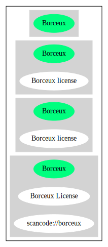

== Borceux license (Borceux)

[cols=",",options="header",]
|===
|Key |Value
|Fullname |Borceux license
|Shortname |Borceux
|Rating |Unknown, probably Stop or No-Go
|Classification |NoCopyleft
|===

*Other Names:*

* `+Bourceux+`
* `+scancode://borceux+`

=== Comments on (easy) usability

* **↑**``This software Licenses is OK for Fedora'' (source:
https://fedoraproject.org/wiki/Licensing:Main?rd=Licensing[Fedora
Project Wiki])
* **↓**``Rating is: Lead'' (source:
https://blueoakcouncil.org/list[BlueOak License List])

=== General Comments

=== URLs

* *Homepage:* https://fedoraproject.org/wiki/Licensing/Borceux
* *SPDX:* http://spdx.org/licenses/Borceux.json
* *SPDX:* https://spdx.org/licenses/Borceux.html

=== Text

....
Copyright 1993 Francis Borceux
You may freely use, modify, and/or distribute each of the files in this package without limitation.  The package consists of the following files:

README
compatibility/OldDiagram
compatibility/OldMaxiDiagram
compatibility/OldMicroDiagram
compatibility/OldMiniDiagram
compatibility/OldMultipleArrows
diagram/Diagram
diagram/MaxiDiagram
diagram/MicroDiagram
diagram/MiniDiagram
diagram/MultipleArrows
user-guides/Diagram_Mode_d_Emploi
user-guides/Diagram_Read_Me

Of course no support is guaranteed, but the author will attempt to assist with problems.  Current email address:
francis dot borceux at uclouvain dot be.
....

'''''

=== Raw Data

* https://spdx.org/licenses/Borceux.html[SPDX]
* https://blueoakcouncil.org/list[BlueOak License List]
* https://github.com/nexB/scancode-toolkit/blob/develop/src/licensedcode/data/licenses/borceux.yml[Scancode]
* https://fedoraproject.org/wiki/Licensing:Main?rd=Licensing[Fedora
Project Wiki]

....
{
    "__impliedNames": [
        "Borceux",
        "Borceux license",
        "Bourceux",
        "scancode://borceux",
        "Borceux License"
    ],
    "__impliedId": "Borceux",
    "__isFsfFree": true,
    "facts": {
        "SPDX": {
            "isSPDXLicenseDeprecated": false,
            "spdxFullName": "Borceux license",
            "spdxDetailsURL": "http://spdx.org/licenses/Borceux.json",
            "_sourceURL": "https://spdx.org/licenses/Borceux.html",
            "spdxLicIsOSIApproved": false,
            "spdxSeeAlso": [
                "https://fedoraproject.org/wiki/Licensing/Borceux"
            ],
            "_implications": {
                "__impliedNames": [
                    "Borceux",
                    "Borceux license"
                ],
                "__impliedId": "Borceux",
                "__isOsiApproved": false,
                "__impliedURLs": [
                    [
                        "SPDX",
                        "http://spdx.org/licenses/Borceux.json"
                    ],
                    [
                        null,
                        "https://fedoraproject.org/wiki/Licensing/Borceux"
                    ]
                ]
            },
            "spdxLicenseId": "Borceux"
        },
        "Fedora Project Wiki": {
            "GPLv2 Compat?": "Yes",
            "rating": "Good",
            "Upstream URL": "https://fedoraproject.org/wiki/Licensing/Borceux",
            "GPLv3 Compat?": "Yes",
            "Short Name": "Borceux",
            "licenseType": "license",
            "_sourceURL": "https://fedoraproject.org/wiki/Licensing:Main?rd=Licensing",
            "Full Name": "Borceux license",
            "FSF Free?": "Yes",
            "_implications": {
                "__impliedNames": [
                    "Borceux license"
                ],
                "__isFsfFree": true,
                "__impliedJudgement": [
                    [
                        "Fedora Project Wiki",
                        {
                            "tag": "PositiveJudgement",
                            "contents": "This software Licenses is OK for Fedora"
                        }
                    ]
                ]
            }
        },
        "Scancode": {
            "otherUrls": null,
            "homepageUrl": "https://fedoraproject.org/wiki/Licensing/Borceux",
            "shortName": "Borceux License",
            "textUrls": null,
            "text": "Copyright 1993 Francis Borceux\nYou may freely use, modify, and/or distribute each of the files in this package without limitation.  The package consists of the following files:\n\nREADME\ncompatibility/OldDiagram\ncompatibility/OldMaxiDiagram\ncompatibility/OldMicroDiagram\ncompatibility/OldMiniDiagram\ncompatibility/OldMultipleArrows\ndiagram/Diagram\ndiagram/MaxiDiagram\ndiagram/MicroDiagram\ndiagram/MiniDiagram\ndiagram/MultipleArrows\nuser-guides/Diagram_Mode_d_Emploi\nuser-guides/Diagram_Read_Me\n\nOf course no support is guaranteed, but the author will attempt to assist with problems.  Current email address:\nfrancis dot borceux at uclouvain dot be.",
            "category": "Permissive",
            "osiUrl": null,
            "owner": "Francis Borceux",
            "_sourceURL": "https://github.com/nexB/scancode-toolkit/blob/develop/src/licensedcode/data/licenses/borceux.yml",
            "key": "borceux",
            "name": "Borceux License",
            "spdxId": "Borceux",
            "notes": null,
            "_implications": {
                "__impliedNames": [
                    "scancode://borceux",
                    "Borceux License",
                    "Borceux"
                ],
                "__impliedId": "Borceux",
                "__impliedCopyleft": [
                    [
                        "Scancode",
                        "NoCopyleft"
                    ]
                ],
                "__calculatedCopyleft": "NoCopyleft",
                "__impliedText": "Copyright 1993 Francis Borceux\nYou may freely use, modify, and/or distribute each of the files in this package without limitation.  The package consists of the following files:\n\nREADME\ncompatibility/OldDiagram\ncompatibility/OldMaxiDiagram\ncompatibility/OldMicroDiagram\ncompatibility/OldMiniDiagram\ncompatibility/OldMultipleArrows\ndiagram/Diagram\ndiagram/MaxiDiagram\ndiagram/MicroDiagram\ndiagram/MiniDiagram\ndiagram/MultipleArrows\nuser-guides/Diagram_Mode_d_Emploi\nuser-guides/Diagram_Read_Me\n\nOf course no support is guaranteed, but the author will attempt to assist with problems.  Current email address:\nfrancis dot borceux at uclouvain dot be.",
                "__impliedURLs": [
                    [
                        "Homepage",
                        "https://fedoraproject.org/wiki/Licensing/Borceux"
                    ]
                ]
            }
        },
        "BlueOak License List": {
            "BlueOakRating": "Lead",
            "url": "https://spdx.org/licenses/Borceux.html",
            "isPermissive": true,
            "_sourceURL": "https://blueoakcouncil.org/list",
            "name": "Borceux license",
            "id": "Bourceux",
            "_implications": {
                "__impliedNames": [
                    "Bourceux",
                    "Borceux license"
                ],
                "__impliedJudgement": [
                    [
                        "BlueOak License List",
                        {
                            "tag": "NegativeJudgement",
                            "contents": "Rating is: Lead"
                        }
                    ]
                ],
                "__impliedCopyleft": [
                    [
                        "BlueOak License List",
                        "NoCopyleft"
                    ]
                ],
                "__calculatedCopyleft": "NoCopyleft",
                "__impliedURLs": [
                    [
                        "SPDX",
                        "https://spdx.org/licenses/Borceux.html"
                    ]
                ]
            }
        }
    },
    "__impliedJudgement": [
        [
            "BlueOak License List",
            {
                "tag": "NegativeJudgement",
                "contents": "Rating is: Lead"
            }
        ],
        [
            "Fedora Project Wiki",
            {
                "tag": "PositiveJudgement",
                "contents": "This software Licenses is OK for Fedora"
            }
        ]
    ],
    "__impliedCopyleft": [
        [
            "BlueOak License List",
            "NoCopyleft"
        ],
        [
            "Scancode",
            "NoCopyleft"
        ]
    ],
    "__calculatedCopyleft": "NoCopyleft",
    "__isOsiApproved": false,
    "__impliedText": "Copyright 1993 Francis Borceux\nYou may freely use, modify, and/or distribute each of the files in this package without limitation.  The package consists of the following files:\n\nREADME\ncompatibility/OldDiagram\ncompatibility/OldMaxiDiagram\ncompatibility/OldMicroDiagram\ncompatibility/OldMiniDiagram\ncompatibility/OldMultipleArrows\ndiagram/Diagram\ndiagram/MaxiDiagram\ndiagram/MicroDiagram\ndiagram/MiniDiagram\ndiagram/MultipleArrows\nuser-guides/Diagram_Mode_d_Emploi\nuser-guides/Diagram_Read_Me\n\nOf course no support is guaranteed, but the author will attempt to assist with problems.  Current email address:\nfrancis dot borceux at uclouvain dot be.",
    "__impliedURLs": [
        [
            "SPDX",
            "http://spdx.org/licenses/Borceux.json"
        ],
        [
            null,
            "https://fedoraproject.org/wiki/Licensing/Borceux"
        ],
        [
            "SPDX",
            "https://spdx.org/licenses/Borceux.html"
        ],
        [
            "Homepage",
            "https://fedoraproject.org/wiki/Licensing/Borceux"
        ]
    ]
}
....

'''''

=== Dot Cluster Graph

