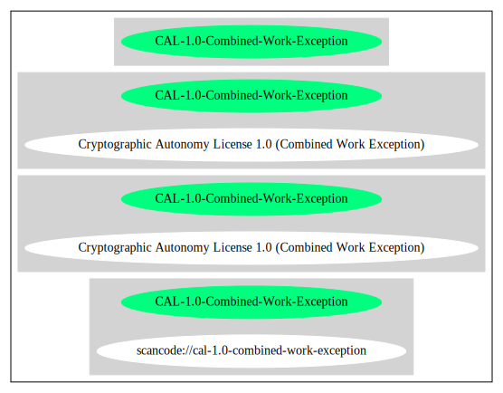

== Cryptographic Autonomy License 1.0 (Combined Work Exception) (CAL-1.0-Combined-Work-Exception)

[cols=",",options="header",]
|===
|Key |Value
|Fullname |Cryptographic Autonomy License 1.0 (Combined Work Exception)
|Shortname |CAL-1.0-Combined-Work-Exception
|Rating |Unknown, probably Attention or Stop or No-Go
|===

=== Comments on (easy) usability

* **↑**``Is OSI Approved'' (source:
https://spdx.org/licenses/CAL-1.0-Combined-Work-Exception.html[SPDX])

=== General Comments

=== URLs

* *SPDX:* http://spdx.org/licenses/CAL-1.0-Combined-Work-Exception.json
* http://cryptographicautonomylicense.com/license-text.html
* https://opensource.org/licenses/CAL-1.0

'''''

=== Raw Data

* SPDX

....
{
    "__impliedNames": [
        "CAL-1.0-Combined-Work-Exception",
        "Cryptographic Autonomy License 1.0 (Combined Work Exception)"
    ],
    "__impliedId": "CAL-1.0-Combined-Work-Exception",
    "facts": {
        "SPDX": {
            "isSPDXLicenseDeprecated": false,
            "spdxFullName": "Cryptographic Autonomy License 1.0 (Combined Work Exception)",
            "spdxDetailsURL": "http://spdx.org/licenses/CAL-1.0-Combined-Work-Exception.json",
            "_sourceURL": "https://spdx.org/licenses/CAL-1.0-Combined-Work-Exception.html",
            "spdxLicIsOSIApproved": true,
            "spdxSeeAlso": [
                "http://cryptographicautonomylicense.com/license-text.html",
                "https://opensource.org/licenses/CAL-1.0"
            ],
            "_implications": {
                "__impliedNames": [
                    "CAL-1.0-Combined-Work-Exception",
                    "Cryptographic Autonomy License 1.0 (Combined Work Exception)"
                ],
                "__impliedId": "CAL-1.0-Combined-Work-Exception",
                "__impliedJudgement": [
                    [
                        "SPDX",
                        {
                            "tag": "PositiveJudgement",
                            "contents": "Is OSI Approved"
                        }
                    ]
                ],
                "__isOsiApproved": true,
                "__impliedURLs": [
                    [
                        "SPDX",
                        "http://spdx.org/licenses/CAL-1.0-Combined-Work-Exception.json"
                    ],
                    [
                        null,
                        "http://cryptographicautonomylicense.com/license-text.html"
                    ],
                    [
                        null,
                        "https://opensource.org/licenses/CAL-1.0"
                    ]
                ]
            },
            "spdxLicenseId": "CAL-1.0-Combined-Work-Exception"
        }
    },
    "__impliedJudgement": [
        [
            "SPDX",
            {
                "tag": "PositiveJudgement",
                "contents": "Is OSI Approved"
            }
        ]
    ],
    "__isOsiApproved": true,
    "__impliedURLs": [
        [
            "SPDX",
            "http://spdx.org/licenses/CAL-1.0-Combined-Work-Exception.json"
        ],
        [
            null,
            "http://cryptographicautonomylicense.com/license-text.html"
        ],
        [
            null,
            "https://opensource.org/licenses/CAL-1.0"
        ]
    ]
}
....

'''''

=== Dot Cluster Graph

