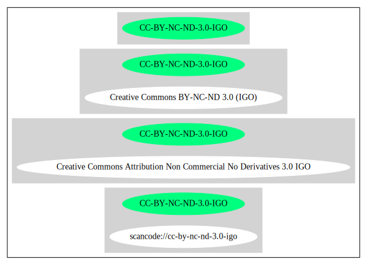

== Creative Commons Attribution Non Commercial No Derivatives 3.0 IGO (CC-BY-NC-ND-3.0-IGO)

[cols=",",options="header",]
|===
|Key |Value
|Fullname |Creative Commons Attribution Non Commercial No Derivatives
3.0 IGO

|Shortname |CC-BY-NC-ND-3.0-IGO

|Rating |Unknown, probably Attention or Stop or No-Go
|===

=== Comments on (easy) usability

=== General Comments

=== URLs

* *SPDX:* http://spdx.org/licenses/CC-BY-NC-ND-3.0-IGO.json
* https://creativecommons.org/licenses/by-nc-nd/3.0/igo/legalcode

'''''

=== Raw Data

* https://spdx.org/licenses/CC-BY-NC-ND-3.0-IGO.html[SPDX]

....
{
    "__impliedNames": [
        "CC-BY-NC-ND-3.0-IGO",
        "Creative Commons Attribution Non Commercial No Derivatives 3.0 IGO"
    ],
    "__impliedId": "CC-BY-NC-ND-3.0-IGO",
    "facts": {
        "SPDX": {
            "isSPDXLicenseDeprecated": false,
            "spdxFullName": "Creative Commons Attribution Non Commercial No Derivatives 3.0 IGO",
            "spdxDetailsURL": "http://spdx.org/licenses/CC-BY-NC-ND-3.0-IGO.json",
            "_sourceURL": "https://spdx.org/licenses/CC-BY-NC-ND-3.0-IGO.html",
            "spdxLicIsOSIApproved": false,
            "spdxSeeAlso": [
                "https://creativecommons.org/licenses/by-nc-nd/3.0/igo/legalcode"
            ],
            "_implications": {
                "__impliedNames": [
                    "CC-BY-NC-ND-3.0-IGO",
                    "Creative Commons Attribution Non Commercial No Derivatives 3.0 IGO"
                ],
                "__impliedId": "CC-BY-NC-ND-3.0-IGO",
                "__isOsiApproved": false,
                "__impliedURLs": [
                    [
                        "SPDX",
                        "http://spdx.org/licenses/CC-BY-NC-ND-3.0-IGO.json"
                    ],
                    [
                        null,
                        "https://creativecommons.org/licenses/by-nc-nd/3.0/igo/legalcode"
                    ]
                ]
            },
            "spdxLicenseId": "CC-BY-NC-ND-3.0-IGO"
        }
    },
    "__isOsiApproved": false,
    "__impliedURLs": [
        [
            "SPDX",
            "http://spdx.org/licenses/CC-BY-NC-ND-3.0-IGO.json"
        ],
        [
            null,
            "https://creativecommons.org/licenses/by-nc-nd/3.0/igo/legalcode"
        ]
    ]
}
....

'''''

=== Dot Cluster Graph

