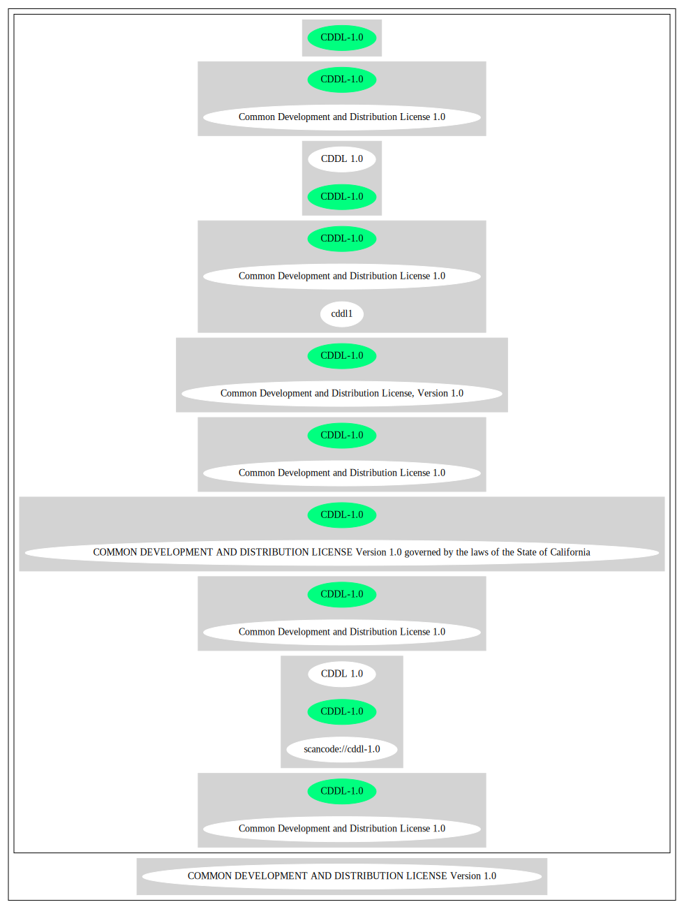

== Common Development and Distribution License 1.0 (CDDL-1.0)

[cols=",",options="header",]
|===
|Key |Value
|Fullname |Common Development and Distribution License 1.0
|Shortname |CDDL-1.0
|Rating |Unknown, probably Attention or Stop or No-Go
|Classification |WeakCopyleft
|Has Patent Hint |True
|===

*Other Names:*

* `+scancode://cddl-1.0+`
* `+CDDL 1.0+`
* `+Common Development and Distribution License, Version 1.0+`

=== Comments on (easy) usability

* **↑**``Is OSI Approved'' (source:
https://spdx.org/licenses/CDDL-1.0.html[SPDX])
* ``Google Classification is RECIPROCAL'' (source:
https://opensource.google.com/docs/thirdparty/licenses/[Google OSS
Policy])

=== General Comments

* ``Weak copyleft licenses require sharing changes and additions to the
licensed software when you give copies to others.'' (source:
https://blueoakcouncil.org/copyleft[BlueOak License List])
* ``Per SPDX.org, this license was released 24 January 2004. This
license is OSI certified. '' (source:
https://github.com/nexB/scancode-toolkit/blob/develop/src/licensedcode/data/licenses/cddl-1.0.yml[Scancode])

=== URLs

* *Homepage:* http://www.sun.com/cddl/
* *OSI Page:* http://www.opensource.org/licenses/cddl1.txt
* *OSI Page:* https://opensource.org/licenses/CDDL-1.0
* *SPDX:* http://spdx.org/licenses/CDDL-1.0.json
* *Wikipedia page:*
https://en.wikipedia.org/wiki/Common_Development_and_Distribution_License
* https://opensource.org/licenses/cddl1
* https://spdx.org/licenses/CDDL-1.0.html
* http://www.gnu.org/licenses/license-list.html#CDDL
* http://www.opensource.org/licenses/cddl1
* http://www.oracle.com/us/sun/index.html
* https://glassfish.dev.java.net/public/CDDLv1.0.html

=== OSADL Rule

....
USE CASE Source code delivery
	IF Software modification
		YOU MUST Forward Copyright notices
		YOU MUST Forward Patent notices
		YOU MUST Forward Trademark notices
		YOU MUST Grant License
			ATTRIBUTE Original license
		YOU MUST Provide Copyright notice
	YOU MUST NOT Restrict Granted rights
USE CASE Binary delivery
	YOU MUST Provide Delayed source code delivery
	YOU MUST Provide Written offer
		ATTRIBUTE Reasonable
		EITHER
			ATTRIBUTE Customary medium
		OR
			ATTRIBUTE Via Internet
	IF Software modification
		YOU MUST Forward Copyright notices
		YOU MUST Forward Patent notices
		YOU MUST Forward Trademark notices
		YOU MUST Grant License
			ATTRIBUTE Original license
		YOU MUST Provide Copyright notice
	YOU MUST NOT Restrict Granted rights
COMPATIBILITY BSD-2-Clause
COMPATIBILITY curl
COMPATIBILITY ISC
COMPATIBILITY MIT
COMPATIBILITY NTP
COMPATIBILITY UPL-1.0
COMPATIBILITY WTFPL
COMPATIBILITY X11
COMPATIBILITY Zlib
PATENT HINTS Yes
COPYLEFT CLAUSE Yes
....

(source: OSADL License Checklist)

=== Text

....
COMMON DEVELOPMENT AND DISTRIBUTION LICENSE (CDDL) Version 1.0 

1. Definitions.

1.1. Contributor means each individual or entity that creates or contributes to the creation of Modifications.

1.2. Contributor Version means the combination of the Original Software, prior Modifications used by a Contributor (if any), and the Modifications made by that particular Contributor.

1.3. Covered Software means (a) the Original Software, or (b) Modifications, or (c) the combination of files containing Original Software with files containing Modifications, in each case including portions thereof.

1.4. Executable means the Covered Software in any form other than Source Code.

1.5. Initial Developer means the individual or entity that first makes Original Software available under this License.

1.6. Larger Work means a work which combines Covered Software or portions thereof with code not governed by the terms of this License.

1.7. License means this document.

1.8. Licensable means having the right to grant, to the maximum extent possible, whether at the time of the initial grant or subsequently acquired, any and all of the rights conveyed herein.

1.9. Modifications means the Source Code and Executable form of any of the following: A. Any file that results from an addition to, deletion from or modification of the contents of a file containing Original Software or previous Modifications; B. Any new file that contains any part of the Original Software or previous Modification; or C. Any new file that is contributed or otherwise made available under the terms of this License.

1.10. Original Software means the Source Code and Executable form of computer software code that is originally released under this License.

1.11. Patent Claims means any patent claim(s), now owned or hereafter acquired, including without limitation, method, process, and apparatus claims, in any patent Licensable by grantor.

1.12. Source Code means (a) the common form of computer software code in which modifications are made and (b) associated documentation included in or with such code.

1.13. You (or Your) means an individual or a legal entity exercising rights under, and complying with all of the terms of, this License. For legal entities, You includes any entity which controls, is controlled by, or is under common control with You. For purposes of this definition, control means (a) the power, direct or indirect, to cause the direction or management of such entity, whether by contract or otherwise, or (b) ownership of more than fifty percent (50%) of the outstanding shares or beneficial ownership of such entity.

2. License Grants.

 2.1. The Initial Developer Grant. Conditioned upon Your compliance with Section 3.1 below and subject to third party intellectual property claims, the Initial Developer hereby grants You a world-wide, royalty-free, non-exclusive license:

(a) under intellectual property rights (other than patent or trademark) Licensable by Initial Developer, to use, reproduce, modify, display, perform, sublicense and distribute the Original Software (or portions thereof), with or without Modifications, and/or as part of a Larger Work; and

(b) under Patent Claims infringed by the making, using or selling of Original Software, to make, have made, use, practice, sell, and offer for sale, and/or otherwise dispose of the Original Software (or portions thereof);

 (c) The licenses granted in Sections 2.1(a) and (b) are effective on the date Initial Developer first distributes or otherwise makes the Original Software available to a third party under the terms of this License;

 (d) Notwithstanding Section 2.1(b) above, no patent license is granted: (1) for code that You delete from the Original Software, or (2) for infringements caused by: (i) the modification of the Original Software, or (ii) the combination of the Original Software with other software or devices.

2.2. Contributor Grant. Conditioned upon Your compliance with Section 3.1 below and subject to third party intellectual property claims, each Contributor hereby grants You a world-wide, royalty-free, non-exclusive license:

(a) under intellectual property rights (other than patent or trademark) Licensable by Contributor to use, reproduce, modify, display, perform, sublicense and distribute the Modifications created by such Contributor (or portions thereof), either on an unmodified basis, with other Modifications, as Covered Software and/or as part of a Larger Work; and

(b) under Patent Claims infringed by the making, using, or selling of Modifications made by that Contributor either alone and/or in combination with its Contributor Version (or portions of such combination), to make, use, sell, offer for sale, have made, and/or otherwise dispose of: (1) Modifications made by that Contributor (or portions thereof); and (2) the combination of Modifications made by that Contributor with its Contributor Version (or portions of such combination).

(c) The licenses granted in Sections 2.2(a) and 2.2(b) are effective on the date Contributor first distributes or otherwise makes the Modifications available to a third party.

(d) Notwithstanding Section 2.2(b) above, no patent license is granted: (1) for any code that Contributor has deleted from the Contributor Version; (2) for infringements caused by: (i) third party modifications of Contributor Version, or (ii) the combination of Modifications made by that Contributor with other software (except as part of the Contributor Version) or other devices; or (3) under Patent Claims infringed by Covered Software in the absence of Modifications made by that Contributor.

3. Distribution Obligations.

3.1. Availability of Source Code. Any Covered Software that You distribute or otherwise make available in Executable form must also be made available in Source Code form and that Source Code form must be distributed only under the terms of this License. You must include a copy of this License with every copy of the Source Code form of the Covered Software You distribute or otherwise make available. You must inform recipients of any such Covered Software in Executable form as to how they can obtain such Covered Software in Source Code form in a reasonable manner on or through a medium customarily used for software exchange.

3.2. Modifications. The Modifications that You create or to which You contribute are governed by the terms of this License. You represent that You believe Your Modifications are Your original creation(s) and/or You have sufficient rights to grant the rights conveyed by this License.

3.3. Required Notices. You must include a notice in each of Your Modifications that identifies You as the Contributor of the Modification. You may not remove or alter any copyright, patent or trademark notices contained within the Covered Software, or any notices of licensing or any descriptive text giving attribution to any Contributor or the Initial Developer.

3.4. Application of Additional Terms. You may not offer or impose any terms on any Covered Software in Source Code form that alters or restricts the applicable version of this License or the recipients rights hereunder. You may choose to offer, and to charge a fee for, warranty, support, indemnity or liability obligations to one or more recipients of Covered Software. However, you may do so only on Your own behalf, and not on behalf of the Initial Developer or any Contributor. You must make it absolutely clear that any such warranty, support, indemnity or liability obligation is offered by You alone, and You hereby agree to indemnify the Initial Developer and every Contributor for any liability incurred by the Initial Developer or such Contributor as a result of warranty, support, indemnity or liability terms You offer.

3.5. Distribution of Executable Versions. You may distribute the Executable form of the Covered Software under the terms of this License or under the terms of a license of Your choice, which may contain terms different from this License, provided that You are in compliance with the terms of this License and that the license for the Executable form does not attempt to limit or alter the recipients rights in the Source Code form from the rights set forth in this License. If You distribute the Covered Software in Executable form under a different license, You must make it absolutely clear that any terms which differ from this License are offered by You alone, not by the Initial Developer or Contributor. You hereby agree to indemnify the Initial Developer and every Contributor for any liability incurred by the Initial Developer or such Contributor as a result of any such terms You offer.

3.6. Larger Works. You may create a Larger Work by combining Covered Software with other code not governed by the terms of this License and distribute the Larger Work as a single product. In such a case, You must make sure the requirements of this License are fulfilled for the Covered Software.

4. Versions of the License.

4.1. New Versions. Sun Microsystems, Inc. is the initial license steward and may publish revised and/or new versions of this License from time to time. Each version will be given a distinguishing version number. Except as provided in Section 4.3, no one other than the license steward has the right to modify this License.

4.2. Effect of New Versions. You may always continue to use, distribute or otherwise make the Covered Software available under the terms of the version of the License under which You originally received the Covered Software. If the Initial Developer includes a notice in the Original Software prohibiting it from being distributed or otherwise made available under any subsequent version of the License, You must distribute and make the Covered Software available under the terms of the version of the License under which You originally received the Covered Software. Otherwise, You may also choose to use, distribute or otherwise make the Covered Software available under the terms of any subsequent version of the License published by the license steward.

4.3. Modified Versions. When You are an Initial Developer and You want to create a new license for Your Original Software, You may create and use a modified version of this License if You: (a) rename the license and remove any references to the name of the license steward (except to note that the license differs from this License); and (b) otherwise make it clear that the license contains terms which differ from this License.

5. DISCLAIMER OF WARRANTY. COVERED SOFTWARE IS PROVIDED UNDER THIS LICENSE ON AN AS IS BASIS, WITHOUT WARRANTY OF ANY KIND, EITHER EXPRESSED OR IMPLIED, INCLUDING, WITHOUT LIMITATION, WARRANTIES THAT THE COVERED SOFTWARE IS FREE OF DEFECTS, MERCHANTABLE, FIT FOR A PARTICULAR PURPOSE OR NON-INFRINGING. THE ENTIRE RISK AS TO THE QUALITY AND PERFORMANCE OF THE COVERED SOFTWARE IS WITH YOU. SHOULD ANY COVERED SOFTWARE PROVE DEFECTIVE IN ANY RESPECT, YOU (NOT THE INITIAL DEVELOPER OR ANY OTHER CONTRIBUTOR) ASSUME THE COST OF ANY NECESSARY SERVICING, REPAIR OR CORRECTION. THIS DISCLAIMER OF WARRANTY CONSTITUTES AN ESSENTIAL PART OF THIS LICENSE. NO USE OF ANY COVERED SOFTWARE IS AUTHORIZED HEREUNDER EXCEPT UNDER THIS DISCLAIMER.

6. TERMINATION.

6.1. This License and the rights granted hereunder will terminate automatically if You fail to comply with terms herein and fail to cure such breach within 30 days of becoming aware of the breach. Provisions which, by their nature, must remain in effect beyond the termination of this License shall survive.

6.2. If You assert a patent infringement claim (excluding declaratory judgment actions) against Initial Developer or a Contributor (the Initial Developer or Contributor against whom You assert such claim is referred to as Participant) alleging that the Participant Software (meaning the Contributor Version where the Participant is a Contributor or the Original Software where the Participant is the Initial Developer) directly or indirectly infringes any patent, then any and all rights granted directly or indirectly to You by such Participant, the Initial Developer (if the Initial Developer is not the Participant) and all Contributors under Sections 2.1 and/or 2.2 of this License shall, upon 60 days notice from Participant terminate prospectively and automatically at the expiration of such 60 day notice period, unless if within such 60 day period You withdraw Your claim with respect to the Participant Software against such Participant either unilaterally or pursuant to a written agreement with Participant.

6.3. In the event of termination under Sections 6.1 or 6.2 above, all end user licenses that have been validly granted by You or any distributor hereunder prior to termination (excluding licenses granted to You by any distributor) shall survive termination.

7. LIMITATION OF LIABILITY. UNDER NO CIRCUMSTANCES AND UNDER NO LEGAL THEORY, WHETHER TORT (INCLUDING NEGLIGENCE), CONTRACT, OR OTHERWISE, SHALL YOU, THE INITIAL DEVELOPER, ANY OTHER CONTRIBUTOR, OR ANY DISTRIBUTOR OF COVERED SOFTWARE, OR ANY SUPPLIER OF ANY OF SUCH PARTIES, BE LIABLE TO ANY PERSON FOR ANY INDIRECT, SPECIAL, INCIDENTAL, OR CONSEQUENTIAL DAMAGES OF ANY CHARACTER INCLUDING, WITHOUT LIMITATION, DAMAGES FOR LOST PROFITS, LOSS OF GOODWILL, WORK STOPPAGE, COMPUTER FAILURE OR MALFUNCTION, OR ANY AND ALL OTHER COMMERCIAL DAMAGES OR LOSSES, EVEN IF SUCH PARTY SHALL HAVE BEEN INFORMED OF THE POSSIBILITY OF SUCH DAMAGES. THIS LIMITATION OF LIABILITY SHALL NOT APPLY TO LIABILITY FOR DEATH OR PERSONAL INJURY RESULTING FROM SUCH PARTYS NEGLIGENCE TO THE EXTENT APPLICABLE LAW PROHIBITS SUCH LIMITATION. SOME JURISDICTIONS DO NOT ALLOW THE EXCLUSION OR LIMITATION OF INCIDENTAL OR CONSEQUENTIAL DAMAGES, SO THIS EXCLUSION AND LIMITATION MAY NOT APPLY TO YOU.

8. U.S. GOVERNMENT END USERS. The Covered Software is a commercial item, as that term is defined in 48 C.F.R. 2.101 (Oct. 1995), consisting of commercial computer software (as that term is defined at 48 C.F.R.  252.227-7014(a)(1)) and commercial computer software documentation as such terms are used in 48 C.F.R. 12.212 (Sept. 1995). Consistent with 48 C.F.R. 12.212 and 48 C.F.R. 227.7202-1 through 227.7202-4 (June 1995), all U.S. Government End Users acquire Covered Software with only those rights set forth herein. This U.S. Government Rights clause is in lieu of, and supersedes, any other FAR, DFAR, or other clause or provision that addresses Government rights in computer software under this License.

9. MISCELLANEOUS. This License represents the complete agreement concerning subject matter hereof. If any provision of this License is held to be unenforceable, such provision shall be reformed only to the extent necessary to make it enforceable. This License shall be governed by the law of the jurisdiction specified in a notice contained within the Original Software (except to the extent applicable law, if any, provides otherwise), excluding such jurisdictions conflict-of-law provisions. Any litigation relating to this License shall be subject to the jurisdiction of the courts located in the jurisdiction and venue specified in a notice contained within the Original Software, with the losing party responsible for costs, including, without limitation, court costs and reasonable attorneys fees and expenses. The application of the United Nations Convention on Contracts for the International Sale of Goods is expressly excluded. Any law or regulation which provides that the language of a contract shall be construed against the drafter shall not apply to this License. You agree that You alone are responsible for compliance with the United States export administration regulations (and the export control laws and regulation of any other countries) when You use, distribute or otherwise make available any Covered Software.

10. RESPONSIBILITY FOR CLAIMS. As between Initial Developer and the Contributors, each party is responsible for claims and damages arising, directly or indirectly, out of its utilization of rights under this License and You agree to work with Initial Developer and Contributors to distribute such responsibility on an equitable basis. Nothing herein is intended or shall be deemed to constitute any admission of liability.

NOTICE PURSUANT TO SECTION 9 OF THE COMMON DEVELOPMENT AND DISTRIBUTION LICENSE (CDDL) The code released under the CDDL shall be governed by the laws of the State of California (excluding conflict-of-law provisions). Any litigation relating to this License shall be subject to the jurisdiction of the Federal Courts of the Northern District of California and the state courts of the State of California, with venue lying in Santa Clara County, California.
....

'''''

=== Raw Data

....
{
    "__impliedNames": [
        "CDDL-1.0",
        "Common Development and Distribution License 1.0",
        "scancode://cddl-1.0",
        "CDDL 1.0",
        "Common Development and Distribution License, Version 1.0"
    ],
    "__impliedId": "CDDL-1.0",
    "__impliedAmbiguousNames": [
        "Common Development and Distribution License"
    ],
    "__impliedComments": [
        [
            "BlueOak License List",
            [
                "Weak copyleft licenses require sharing changes and additions to the licensed software when you give copies to others."
            ]
        ],
        [
            "Scancode",
            [
                "Per SPDX.org, this license was released 24 January 2004. This license is\nOSI certified.\n"
            ]
        ]
    ],
    "__hasPatentHint": true,
    "facts": {
        "Open Knowledge International": {
            "is_generic": null,
            "status": "active",
            "domain_software": true,
            "url": "https://opensource.org/licenses/CDDL-1.0",
            "maintainer": "",
            "od_conformance": "not reviewed",
            "_sourceURL": "https://github.com/okfn/licenses/blob/master/licenses.csv",
            "domain_data": false,
            "osd_conformance": "approved",
            "id": "CDDL-1.0",
            "title": "Common Development and Distribution License 1.0",
            "_implications": {
                "__impliedNames": [
                    "CDDL-1.0",
                    "Common Development and Distribution License 1.0"
                ],
                "__impliedId": "CDDL-1.0",
                "__impliedURLs": [
                    [
                        null,
                        "https://opensource.org/licenses/CDDL-1.0"
                    ]
                ]
            },
            "domain_content": false
        },
        "SPDX": {
            "isSPDXLicenseDeprecated": false,
            "spdxFullName": "Common Development and Distribution License 1.0",
            "spdxDetailsURL": "http://spdx.org/licenses/CDDL-1.0.json",
            "_sourceURL": "https://spdx.org/licenses/CDDL-1.0.html",
            "spdxLicIsOSIApproved": true,
            "spdxSeeAlso": [
                "https://opensource.org/licenses/cddl1"
            ],
            "_implications": {
                "__impliedNames": [
                    "CDDL-1.0",
                    "Common Development and Distribution License 1.0"
                ],
                "__impliedId": "CDDL-1.0",
                "__impliedJudgement": [
                    [
                        "SPDX",
                        {
                            "tag": "PositiveJudgement",
                            "contents": "Is OSI Approved"
                        }
                    ]
                ],
                "__isOsiApproved": true,
                "__impliedURLs": [
                    [
                        "SPDX",
                        "http://spdx.org/licenses/CDDL-1.0.json"
                    ],
                    [
                        null,
                        "https://opensource.org/licenses/cddl1"
                    ]
                ]
            },
            "spdxLicenseId": "CDDL-1.0"
        },
        "OSADL License Checklist": {
            "_sourceURL": "https://www.osadl.org/fileadmin/checklists/unreflicenses/CDDL-1.0.txt",
            "spdxId": "CDDL-1.0",
            "osadlRule": "USE CASE Source code delivery\n\tIF Software modification\n\t\tYOU MUST Forward Copyright notices\n\t\tYOU MUST Forward Patent notices\n\t\tYOU MUST Forward Trademark notices\n\t\tYOU MUST Grant License\n\t\t\tATTRIBUTE Original license\n\t\tYOU MUST Provide Copyright notice\n\tYOU MUST NOT Restrict Granted rights\nUSE CASE Binary delivery\n\tYOU MUST Provide Delayed source code delivery\n\tYOU MUST Provide Written offer\n\t\tATTRIBUTE Reasonable\n\t\tEITHER\n\t\t\tATTRIBUTE Customary medium\n\t\tOR\r\n\t\t\tATTRIBUTE Via Internet\n\tIF Software modification\n\t\tYOU MUST Forward Copyright notices\n\t\tYOU MUST Forward Patent notices\n\t\tYOU MUST Forward Trademark notices\n\t\tYOU MUST Grant License\n\t\t\tATTRIBUTE Original license\n\t\tYOU MUST Provide Copyright notice\n\tYOU MUST NOT Restrict Granted rights\nCOMPATIBILITY BSD-2-Clause\r\nCOMPATIBILITY curl\r\nCOMPATIBILITY ISC\r\nCOMPATIBILITY MIT\r\nCOMPATIBILITY NTP\r\nCOMPATIBILITY UPL-1.0\r\nCOMPATIBILITY WTFPL\r\nCOMPATIBILITY X11\r\nCOMPATIBILITY Zlib\r\nPATENT HINTS Yes\nCOPYLEFT CLAUSE Yes\n",
            "_implications": {
                "__impliedNames": [
                    "CDDL-1.0"
                ],
                "__hasPatentHint": true,
                "__impliedCopyleft": [
                    [
                        "OSADL License Checklist",
                        "Copyleft"
                    ]
                ],
                "__calculatedCopyleft": "Copyleft"
            }
        },
        "Scancode": {
            "otherUrls": [
                "http://www.gnu.org/licenses/license-list.html#CDDL",
                "http://www.opensource.org/licenses/cddl1",
                "http://www.oracle.com/us/sun/index.html",
                "https://glassfish.dev.java.net/public/CDDLv1.0.html",
                "https://opensource.org/licenses/cddl1"
            ],
            "homepageUrl": "http://www.sun.com/cddl/",
            "shortName": "CDDL 1.0",
            "textUrls": null,
            "text": "COMMON DEVELOPMENT AND DISTRIBUTION LICENSE (CDDL) Version 1.0 \n\n1. Definitions.\n\n1.1. Contributor means each individual or entity that creates or contributes to the creation of Modifications.\n\n1.2. Contributor Version means the combination of the Original Software, prior Modifications used by a Contributor (if any), and the Modifications made by that particular Contributor.\n\n1.3. Covered Software means (a) the Original Software, or (b) Modifications, or (c) the combination of files containing Original Software with files containing Modifications, in each case including portions thereof.\n\n1.4. Executable means the Covered Software in any form other than Source Code.\n\n1.5. Initial Developer means the individual or entity that first makes Original Software available under this License.\n\n1.6. Larger Work means a work which combines Covered Software or portions thereof with code not governed by the terms of this License.\n\n1.7. License means this document.\n\n1.8. Licensable means having the right to grant, to the maximum extent possible, whether at the time of the initial grant or subsequently acquired, any and all of the rights conveyed herein.\n\n1.9. Modifications means the Source Code and Executable form of any of the following: A. Any file that results from an addition to, deletion from or modification of the contents of a file containing Original Software or previous Modifications; B. Any new file that contains any part of the Original Software or previous Modification; or C. Any new file that is contributed or otherwise made available under the terms of this License.\n\n1.10. Original Software means the Source Code and Executable form of computer software code that is originally released under this License.\n\n1.11. Patent Claims means any patent claim(s), now owned or hereafter acquired, including without limitation, method, process, and apparatus claims, in any patent Licensable by grantor.\n\n1.12. Source Code means (a) the common form of computer software code in which modifications are made and (b) associated documentation included in or with such code.\n\n1.13. You (or Your) means an individual or a legal entity exercising rights under, and complying with all of the terms of, this License. For legal entities, You includes any entity which controls, is controlled by, or is under common control with You. For purposes of this definition, control means (a) the power, direct or indirect, to cause the direction or management of such entity, whether by contract or otherwise, or (b) ownership of more than fifty percent (50%) of the outstanding shares or beneficial ownership of such entity.\n\n2. License Grants.\n\n 2.1. The Initial Developer Grant. Conditioned upon Your compliance with Section 3.1 below and subject to third party intellectual property claims, the Initial Developer hereby grants You a world-wide, royalty-free, non-exclusive license:\n\n(a) under intellectual property rights (other than patent or trademark) Licensable by Initial Developer, to use, reproduce, modify, display, perform, sublicense and distribute the Original Software (or portions thereof), with or without Modifications, and/or as part of a Larger Work; and\n\n(b) under Patent Claims infringed by the making, using or selling of Original Software, to make, have made, use, practice, sell, and offer for sale, and/or otherwise dispose of the Original Software (or portions thereof);\n\n (c) The licenses granted in Sections 2.1(a) and (b) are effective on the date Initial Developer first distributes or otherwise makes the Original Software available to a third party under the terms of this License;\n\n (d) Notwithstanding Section 2.1(b) above, no patent license is granted: (1) for code that You delete from the Original Software, or (2) for infringements caused by: (i) the modification of the Original Software, or (ii) the combination of the Original Software with other software or devices.\n\n2.2. Contributor Grant. Conditioned upon Your compliance with Section 3.1 below and subject to third party intellectual property claims, each Contributor hereby grants You a world-wide, royalty-free, non-exclusive license:\n\n(a) under intellectual property rights (other than patent or trademark) Licensable by Contributor to use, reproduce, modify, display, perform, sublicense and distribute the Modifications created by such Contributor (or portions thereof), either on an unmodified basis, with other Modifications, as Covered Software and/or as part of a Larger Work; and\n\n(b) under Patent Claims infringed by the making, using, or selling of Modifications made by that Contributor either alone and/or in combination with its Contributor Version (or portions of such combination), to make, use, sell, offer for sale, have made, and/or otherwise dispose of: (1) Modifications made by that Contributor (or portions thereof); and (2) the combination of Modifications made by that Contributor with its Contributor Version (or portions of such combination).\n\n(c) The licenses granted in Sections 2.2(a) and 2.2(b) are effective on the date Contributor first distributes or otherwise makes the Modifications available to a third party.\n\n(d) Notwithstanding Section 2.2(b) above, no patent license is granted: (1) for any code that Contributor has deleted from the Contributor Version; (2) for infringements caused by: (i) third party modifications of Contributor Version, or (ii) the combination of Modifications made by that Contributor with other software (except as part of the Contributor Version) or other devices; or (3) under Patent Claims infringed by Covered Software in the absence of Modifications made by that Contributor.\n\n3. Distribution Obligations.\n\n3.1. Availability of Source Code. Any Covered Software that You distribute or otherwise make available in Executable form must also be made available in Source Code form and that Source Code form must be distributed only under the terms of this License. You must include a copy of this License with every copy of the Source Code form of the Covered Software You distribute or otherwise make available. You must inform recipients of any such Covered Software in Executable form as to how they can obtain such Covered Software in Source Code form in a reasonable manner on or through a medium customarily used for software exchange.\n\n3.2. Modifications. The Modifications that You create or to which You contribute are governed by the terms of this License. You represent that You believe Your Modifications are Your original creation(s) and/or You have sufficient rights to grant the rights conveyed by this License.\n\n3.3. Required Notices. You must include a notice in each of Your Modifications that identifies You as the Contributor of the Modification. You may not remove or alter any copyright, patent or trademark notices contained within the Covered Software, or any notices of licensing or any descriptive text giving attribution to any Contributor or the Initial Developer.\n\n3.4. Application of Additional Terms. You may not offer or impose any terms on any Covered Software in Source Code form that alters or restricts the applicable version of this License or the recipients rights hereunder. You may choose to offer, and to charge a fee for, warranty, support, indemnity or liability obligations to one or more recipients of Covered Software. However, you may do so only on Your own behalf, and not on behalf of the Initial Developer or any Contributor. You must make it absolutely clear that any such warranty, support, indemnity or liability obligation is offered by You alone, and You hereby agree to indemnify the Initial Developer and every Contributor for any liability incurred by the Initial Developer or such Contributor as a result of warranty, support, indemnity or liability terms You offer.\n\n3.5. Distribution of Executable Versions. You may distribute the Executable form of the Covered Software under the terms of this License or under the terms of a license of Your choice, which may contain terms different from this License, provided that You are in compliance with the terms of this License and that the license for the Executable form does not attempt to limit or alter the recipients rights in the Source Code form from the rights set forth in this License. If You distribute the Covered Software in Executable form under a different license, You must make it absolutely clear that any terms which differ from this License are offered by You alone, not by the Initial Developer or Contributor. You hereby agree to indemnify the Initial Developer and every Contributor for any liability incurred by the Initial Developer or such Contributor as a result of any such terms You offer.\n\n3.6. Larger Works. You may create a Larger Work by combining Covered Software with other code not governed by the terms of this License and distribute the Larger Work as a single product. In such a case, You must make sure the requirements of this License are fulfilled for the Covered Software.\n\n4. Versions of the License.\n\n4.1. New Versions. Sun Microsystems, Inc. is the initial license steward and may publish revised and/or new versions of this License from time to time. Each version will be given a distinguishing version number. Except as provided in Section 4.3, no one other than the license steward has the right to modify this License.\n\n4.2. Effect of New Versions. You may always continue to use, distribute or otherwise make the Covered Software available under the terms of the version of the License under which You originally received the Covered Software. If the Initial Developer includes a notice in the Original Software prohibiting it from being distributed or otherwise made available under any subsequent version of the License, You must distribute and make the Covered Software available under the terms of the version of the License under which You originally received the Covered Software. Otherwise, You may also choose to use, distribute or otherwise make the Covered Software available under the terms of any subsequent version of the License published by the license steward.\n\n4.3. Modified Versions. When You are an Initial Developer and You want to create a new license for Your Original Software, You may create and use a modified version of this License if You: (a) rename the license and remove any references to the name of the license steward (except to note that the license differs from this License); and (b) otherwise make it clear that the license contains terms which differ from this License.\n\n5. DISCLAIMER OF WARRANTY. COVERED SOFTWARE IS PROVIDED UNDER THIS LICENSE ON AN AS IS BASIS, WITHOUT WARRANTY OF ANY KIND, EITHER EXPRESSED OR IMPLIED, INCLUDING, WITHOUT LIMITATION, WARRANTIES THAT THE COVERED SOFTWARE IS FREE OF DEFECTS, MERCHANTABLE, FIT FOR A PARTICULAR PURPOSE OR NON-INFRINGING. THE ENTIRE RISK AS TO THE QUALITY AND PERFORMANCE OF THE COVERED SOFTWARE IS WITH YOU. SHOULD ANY COVERED SOFTWARE PROVE DEFECTIVE IN ANY RESPECT, YOU (NOT THE INITIAL DEVELOPER OR ANY OTHER CONTRIBUTOR) ASSUME THE COST OF ANY NECESSARY SERVICING, REPAIR OR CORRECTION. THIS DISCLAIMER OF WARRANTY CONSTITUTES AN ESSENTIAL PART OF THIS LICENSE. NO USE OF ANY COVERED SOFTWARE IS AUTHORIZED HEREUNDER EXCEPT UNDER THIS DISCLAIMER.\n\n6. TERMINATION.\n\n6.1. This License and the rights granted hereunder will terminate automatically if You fail to comply with terms herein and fail to cure such breach within 30 days of becoming aware of the breach. Provisions which, by their nature, must remain in effect beyond the termination of this License shall survive.\n\n6.2. If You assert a patent infringement claim (excluding declaratory judgment actions) against Initial Developer or a Contributor (the Initial Developer or Contributor against whom You assert such claim is referred to as Participant) alleging that the Participant Software (meaning the Contributor Version where the Participant is a Contributor or the Original Software where the Participant is the Initial Developer) directly or indirectly infringes any patent, then any and all rights granted directly or indirectly to You by such Participant, the Initial Developer (if the Initial Developer is not the Participant) and all Contributors under Sections 2.1 and/or 2.2 of this License shall, upon 60 days notice from Participant terminate prospectively and automatically at the expiration of such 60 day notice period, unless if within such 60 day period You withdraw Your claim with respect to the Participant Software against such Participant either unilaterally or pursuant to a written agreement with Participant.\n\n6.3. In the event of termination under Sections 6.1 or 6.2 above, all end user licenses that have been validly granted by You or any distributor hereunder prior to termination (excluding licenses granted to You by any distributor) shall survive termination.\n\n7. LIMITATION OF LIABILITY. UNDER NO CIRCUMSTANCES AND UNDER NO LEGAL THEORY, WHETHER TORT (INCLUDING NEGLIGENCE), CONTRACT, OR OTHERWISE, SHALL YOU, THE INITIAL DEVELOPER, ANY OTHER CONTRIBUTOR, OR ANY DISTRIBUTOR OF COVERED SOFTWARE, OR ANY SUPPLIER OF ANY OF SUCH PARTIES, BE LIABLE TO ANY PERSON FOR ANY INDIRECT, SPECIAL, INCIDENTAL, OR CONSEQUENTIAL DAMAGES OF ANY CHARACTER INCLUDING, WITHOUT LIMITATION, DAMAGES FOR LOST PROFITS, LOSS OF GOODWILL, WORK STOPPAGE, COMPUTER FAILURE OR MALFUNCTION, OR ANY AND ALL OTHER COMMERCIAL DAMAGES OR LOSSES, EVEN IF SUCH PARTY SHALL HAVE BEEN INFORMED OF THE POSSIBILITY OF SUCH DAMAGES. THIS LIMITATION OF LIABILITY SHALL NOT APPLY TO LIABILITY FOR DEATH OR PERSONAL INJURY RESULTING FROM SUCH PARTYS NEGLIGENCE TO THE EXTENT APPLICABLE LAW PROHIBITS SUCH LIMITATION. SOME JURISDICTIONS DO NOT ALLOW THE EXCLUSION OR LIMITATION OF INCIDENTAL OR CONSEQUENTIAL DAMAGES, SO THIS EXCLUSION AND LIMITATION MAY NOT APPLY TO YOU.\n\n8. U.S. GOVERNMENT END USERS. The Covered Software is a commercial item, as that term is defined in 48 C.F.R. 2.101 (Oct. 1995), consisting of commercial computer software (as that term is defined at 48 C.F.R.  252.227-7014(a)(1)) and commercial computer software documentation as such terms are used in 48 C.F.R. 12.212 (Sept. 1995). Consistent with 48 C.F.R. 12.212 and 48 C.F.R. 227.7202-1 through 227.7202-4 (June 1995), all U.S. Government End Users acquire Covered Software with only those rights set forth herein. This U.S. Government Rights clause is in lieu of, and supersedes, any other FAR, DFAR, or other clause or provision that addresses Government rights in computer software under this License.\n\n9. MISCELLANEOUS. This License represents the complete agreement concerning subject matter hereof. If any provision of this License is held to be unenforceable, such provision shall be reformed only to the extent necessary to make it enforceable. This License shall be governed by the law of the jurisdiction specified in a notice contained within the Original Software (except to the extent applicable law, if any, provides otherwise), excluding such jurisdictions conflict-of-law provisions. Any litigation relating to this License shall be subject to the jurisdiction of the courts located in the jurisdiction and venue specified in a notice contained within the Original Software, with the losing party responsible for costs, including, without limitation, court costs and reasonable attorneys fees and expenses. The application of the United Nations Convention on Contracts for the International Sale of Goods is expressly excluded. Any law or regulation which provides that the language of a contract shall be construed against the drafter shall not apply to this License. You agree that You alone are responsible for compliance with the United States export administration regulations (and the export control laws and regulation of any other countries) when You use, distribute or otherwise make available any Covered Software.\n\n10. RESPONSIBILITY FOR CLAIMS. As between Initial Developer and the Contributors, each party is responsible for claims and damages arising, directly or indirectly, out of its utilization of rights under this License and You agree to work with Initial Developer and Contributors to distribute such responsibility on an equitable basis. Nothing herein is intended or shall be deemed to constitute any admission of liability.\n\nNOTICE PURSUANT TO SECTION 9 OF THE COMMON DEVELOPMENT AND DISTRIBUTION LICENSE (CDDL) The code released under the CDDL shall be governed by the laws of the State of California (excluding conflict-of-law provisions). Any litigation relating to this License shall be subject to the jurisdiction of the Federal Courts of the Northern District of California and the state courts of the State of California, with venue lying in Santa Clara County, California.",
            "category": "Copyleft Limited",
            "osiUrl": "http://www.opensource.org/licenses/cddl1.txt",
            "owner": "Oracle Corporation",
            "_sourceURL": "https://github.com/nexB/scancode-toolkit/blob/develop/src/licensedcode/data/licenses/cddl-1.0.yml",
            "key": "cddl-1.0",
            "name": "Common Development and Distribution License 1.0",
            "spdxId": "CDDL-1.0",
            "notes": "Per SPDX.org, this license was released 24 January 2004. This license is\nOSI certified.\n",
            "_implications": {
                "__impliedNames": [
                    "scancode://cddl-1.0",
                    "CDDL 1.0",
                    "CDDL-1.0"
                ],
                "__impliedId": "CDDL-1.0",
                "__impliedComments": [
                    [
                        "Scancode",
                        [
                            "Per SPDX.org, this license was released 24 January 2004. This license is\nOSI certified.\n"
                        ]
                    ]
                ],
                "__impliedCopyleft": [
                    [
                        "Scancode",
                        "WeakCopyleft"
                    ]
                ],
                "__calculatedCopyleft": "WeakCopyleft",
                "__impliedText": "COMMON DEVELOPMENT AND DISTRIBUTION LICENSE (CDDL) Version 1.0 \n\n1. Definitions.\n\n1.1. Contributor means each individual or entity that creates or contributes to the creation of Modifications.\n\n1.2. Contributor Version means the combination of the Original Software, prior Modifications used by a Contributor (if any), and the Modifications made by that particular Contributor.\n\n1.3. Covered Software means (a) the Original Software, or (b) Modifications, or (c) the combination of files containing Original Software with files containing Modifications, in each case including portions thereof.\n\n1.4. Executable means the Covered Software in any form other than Source Code.\n\n1.5. Initial Developer means the individual or entity that first makes Original Software available under this License.\n\n1.6. Larger Work means a work which combines Covered Software or portions thereof with code not governed by the terms of this License.\n\n1.7. License means this document.\n\n1.8. Licensable means having the right to grant, to the maximum extent possible, whether at the time of the initial grant or subsequently acquired, any and all of the rights conveyed herein.\n\n1.9. Modifications means the Source Code and Executable form of any of the following: A. Any file that results from an addition to, deletion from or modification of the contents of a file containing Original Software or previous Modifications; B. Any new file that contains any part of the Original Software or previous Modification; or C. Any new file that is contributed or otherwise made available under the terms of this License.\n\n1.10. Original Software means the Source Code and Executable form of computer software code that is originally released under this License.\n\n1.11. Patent Claims means any patent claim(s), now owned or hereafter acquired, including without limitation, method, process, and apparatus claims, in any patent Licensable by grantor.\n\n1.12. Source Code means (a) the common form of computer software code in which modifications are made and (b) associated documentation included in or with such code.\n\n1.13. You (or Your) means an individual or a legal entity exercising rights under, and complying with all of the terms of, this License. For legal entities, You includes any entity which controls, is controlled by, or is under common control with You. For purposes of this definition, control means (a) the power, direct or indirect, to cause the direction or management of such entity, whether by contract or otherwise, or (b) ownership of more than fifty percent (50%) of the outstanding shares or beneficial ownership of such entity.\n\n2. License Grants.\n\n 2.1. The Initial Developer Grant. Conditioned upon Your compliance with Section 3.1 below and subject to third party intellectual property claims, the Initial Developer hereby grants You a world-wide, royalty-free, non-exclusive license:\n\n(a) under intellectual property rights (other than patent or trademark) Licensable by Initial Developer, to use, reproduce, modify, display, perform, sublicense and distribute the Original Software (or portions thereof), with or without Modifications, and/or as part of a Larger Work; and\n\n(b) under Patent Claims infringed by the making, using or selling of Original Software, to make, have made, use, practice, sell, and offer for sale, and/or otherwise dispose of the Original Software (or portions thereof);\n\n (c) The licenses granted in Sections 2.1(a) and (b) are effective on the date Initial Developer first distributes or otherwise makes the Original Software available to a third party under the terms of this License;\n\n (d) Notwithstanding Section 2.1(b) above, no patent license is granted: (1) for code that You delete from the Original Software, or (2) for infringements caused by: (i) the modification of the Original Software, or (ii) the combination of the Original Software with other software or devices.\n\n2.2. Contributor Grant. Conditioned upon Your compliance with Section 3.1 below and subject to third party intellectual property claims, each Contributor hereby grants You a world-wide, royalty-free, non-exclusive license:\n\n(a) under intellectual property rights (other than patent or trademark) Licensable by Contributor to use, reproduce, modify, display, perform, sublicense and distribute the Modifications created by such Contributor (or portions thereof), either on an unmodified basis, with other Modifications, as Covered Software and/or as part of a Larger Work; and\n\n(b) under Patent Claims infringed by the making, using, or selling of Modifications made by that Contributor either alone and/or in combination with its Contributor Version (or portions of such combination), to make, use, sell, offer for sale, have made, and/or otherwise dispose of: (1) Modifications made by that Contributor (or portions thereof); and (2) the combination of Modifications made by that Contributor with its Contributor Version (or portions of such combination).\n\n(c) The licenses granted in Sections 2.2(a) and 2.2(b) are effective on the date Contributor first distributes or otherwise makes the Modifications available to a third party.\n\n(d) Notwithstanding Section 2.2(b) above, no patent license is granted: (1) for any code that Contributor has deleted from the Contributor Version; (2) for infringements caused by: (i) third party modifications of Contributor Version, or (ii) the combination of Modifications made by that Contributor with other software (except as part of the Contributor Version) or other devices; or (3) under Patent Claims infringed by Covered Software in the absence of Modifications made by that Contributor.\n\n3. Distribution Obligations.\n\n3.1. Availability of Source Code. Any Covered Software that You distribute or otherwise make available in Executable form must also be made available in Source Code form and that Source Code form must be distributed only under the terms of this License. You must include a copy of this License with every copy of the Source Code form of the Covered Software You distribute or otherwise make available. You must inform recipients of any such Covered Software in Executable form as to how they can obtain such Covered Software in Source Code form in a reasonable manner on or through a medium customarily used for software exchange.\n\n3.2. Modifications. The Modifications that You create or to which You contribute are governed by the terms of this License. You represent that You believe Your Modifications are Your original creation(s) and/or You have sufficient rights to grant the rights conveyed by this License.\n\n3.3. Required Notices. You must include a notice in each of Your Modifications that identifies You as the Contributor of the Modification. You may not remove or alter any copyright, patent or trademark notices contained within the Covered Software, or any notices of licensing or any descriptive text giving attribution to any Contributor or the Initial Developer.\n\n3.4. Application of Additional Terms. You may not offer or impose any terms on any Covered Software in Source Code form that alters or restricts the applicable version of this License or the recipients rights hereunder. You may choose to offer, and to charge a fee for, warranty, support, indemnity or liability obligations to one or more recipients of Covered Software. However, you may do so only on Your own behalf, and not on behalf of the Initial Developer or any Contributor. You must make it absolutely clear that any such warranty, support, indemnity or liability obligation is offered by You alone, and You hereby agree to indemnify the Initial Developer and every Contributor for any liability incurred by the Initial Developer or such Contributor as a result of warranty, support, indemnity or liability terms You offer.\n\n3.5. Distribution of Executable Versions. You may distribute the Executable form of the Covered Software under the terms of this License or under the terms of a license of Your choice, which may contain terms different from this License, provided that You are in compliance with the terms of this License and that the license for the Executable form does not attempt to limit or alter the recipients rights in the Source Code form from the rights set forth in this License. If You distribute the Covered Software in Executable form under a different license, You must make it absolutely clear that any terms which differ from this License are offered by You alone, not by the Initial Developer or Contributor. You hereby agree to indemnify the Initial Developer and every Contributor for any liability incurred by the Initial Developer or such Contributor as a result of any such terms You offer.\n\n3.6. Larger Works. You may create a Larger Work by combining Covered Software with other code not governed by the terms of this License and distribute the Larger Work as a single product. In such a case, You must make sure the requirements of this License are fulfilled for the Covered Software.\n\n4. Versions of the License.\n\n4.1. New Versions. Sun Microsystems, Inc. is the initial license steward and may publish revised and/or new versions of this License from time to time. Each version will be given a distinguishing version number. Except as provided in Section 4.3, no one other than the license steward has the right to modify this License.\n\n4.2. Effect of New Versions. You may always continue to use, distribute or otherwise make the Covered Software available under the terms of the version of the License under which You originally received the Covered Software. If the Initial Developer includes a notice in the Original Software prohibiting it from being distributed or otherwise made available under any subsequent version of the License, You must distribute and make the Covered Software available under the terms of the version of the License under which You originally received the Covered Software. Otherwise, You may also choose to use, distribute or otherwise make the Covered Software available under the terms of any subsequent version of the License published by the license steward.\n\n4.3. Modified Versions. When You are an Initial Developer and You want to create a new license for Your Original Software, You may create and use a modified version of this License if You: (a) rename the license and remove any references to the name of the license steward (except to note that the license differs from this License); and (b) otherwise make it clear that the license contains terms which differ from this License.\n\n5. DISCLAIMER OF WARRANTY. COVERED SOFTWARE IS PROVIDED UNDER THIS LICENSE ON AN AS IS BASIS, WITHOUT WARRANTY OF ANY KIND, EITHER EXPRESSED OR IMPLIED, INCLUDING, WITHOUT LIMITATION, WARRANTIES THAT THE COVERED SOFTWARE IS FREE OF DEFECTS, MERCHANTABLE, FIT FOR A PARTICULAR PURPOSE OR NON-INFRINGING. THE ENTIRE RISK AS TO THE QUALITY AND PERFORMANCE OF THE COVERED SOFTWARE IS WITH YOU. SHOULD ANY COVERED SOFTWARE PROVE DEFECTIVE IN ANY RESPECT, YOU (NOT THE INITIAL DEVELOPER OR ANY OTHER CONTRIBUTOR) ASSUME THE COST OF ANY NECESSARY SERVICING, REPAIR OR CORRECTION. THIS DISCLAIMER OF WARRANTY CONSTITUTES AN ESSENTIAL PART OF THIS LICENSE. NO USE OF ANY COVERED SOFTWARE IS AUTHORIZED HEREUNDER EXCEPT UNDER THIS DISCLAIMER.\n\n6. TERMINATION.\n\n6.1. This License and the rights granted hereunder will terminate automatically if You fail to comply with terms herein and fail to cure such breach within 30 days of becoming aware of the breach. Provisions which, by their nature, must remain in effect beyond the termination of this License shall survive.\n\n6.2. If You assert a patent infringement claim (excluding declaratory judgment actions) against Initial Developer or a Contributor (the Initial Developer or Contributor against whom You assert such claim is referred to as Participant) alleging that the Participant Software (meaning the Contributor Version where the Participant is a Contributor or the Original Software where the Participant is the Initial Developer) directly or indirectly infringes any patent, then any and all rights granted directly or indirectly to You by such Participant, the Initial Developer (if the Initial Developer is not the Participant) and all Contributors under Sections 2.1 and/or 2.2 of this License shall, upon 60 days notice from Participant terminate prospectively and automatically at the expiration of such 60 day notice period, unless if within such 60 day period You withdraw Your claim with respect to the Participant Software against such Participant either unilaterally or pursuant to a written agreement with Participant.\n\n6.3. In the event of termination under Sections 6.1 or 6.2 above, all end user licenses that have been validly granted by You or any distributor hereunder prior to termination (excluding licenses granted to You by any distributor) shall survive termination.\n\n7. LIMITATION OF LIABILITY. UNDER NO CIRCUMSTANCES AND UNDER NO LEGAL THEORY, WHETHER TORT (INCLUDING NEGLIGENCE), CONTRACT, OR OTHERWISE, SHALL YOU, THE INITIAL DEVELOPER, ANY OTHER CONTRIBUTOR, OR ANY DISTRIBUTOR OF COVERED SOFTWARE, OR ANY SUPPLIER OF ANY OF SUCH PARTIES, BE LIABLE TO ANY PERSON FOR ANY INDIRECT, SPECIAL, INCIDENTAL, OR CONSEQUENTIAL DAMAGES OF ANY CHARACTER INCLUDING, WITHOUT LIMITATION, DAMAGES FOR LOST PROFITS, LOSS OF GOODWILL, WORK STOPPAGE, COMPUTER FAILURE OR MALFUNCTION, OR ANY AND ALL OTHER COMMERCIAL DAMAGES OR LOSSES, EVEN IF SUCH PARTY SHALL HAVE BEEN INFORMED OF THE POSSIBILITY OF SUCH DAMAGES. THIS LIMITATION OF LIABILITY SHALL NOT APPLY TO LIABILITY FOR DEATH OR PERSONAL INJURY RESULTING FROM SUCH PARTYS NEGLIGENCE TO THE EXTENT APPLICABLE LAW PROHIBITS SUCH LIMITATION. SOME JURISDICTIONS DO NOT ALLOW THE EXCLUSION OR LIMITATION OF INCIDENTAL OR CONSEQUENTIAL DAMAGES, SO THIS EXCLUSION AND LIMITATION MAY NOT APPLY TO YOU.\n\n8. U.S. GOVERNMENT END USERS. The Covered Software is a commercial item, as that term is defined in 48 C.F.R. 2.101 (Oct. 1995), consisting of commercial computer software (as that term is defined at 48 C.F.R.  252.227-7014(a)(1)) and commercial computer software documentation as such terms are used in 48 C.F.R. 12.212 (Sept. 1995). Consistent with 48 C.F.R. 12.212 and 48 C.F.R. 227.7202-1 through 227.7202-4 (June 1995), all U.S. Government End Users acquire Covered Software with only those rights set forth herein. This U.S. Government Rights clause is in lieu of, and supersedes, any other FAR, DFAR, or other clause or provision that addresses Government rights in computer software under this License.\n\n9. MISCELLANEOUS. This License represents the complete agreement concerning subject matter hereof. If any provision of this License is held to be unenforceable, such provision shall be reformed only to the extent necessary to make it enforceable. This License shall be governed by the law of the jurisdiction specified in a notice contained within the Original Software (except to the extent applicable law, if any, provides otherwise), excluding such jurisdictions conflict-of-law provisions. Any litigation relating to this License shall be subject to the jurisdiction of the courts located in the jurisdiction and venue specified in a notice contained within the Original Software, with the losing party responsible for costs, including, without limitation, court costs and reasonable attorneys fees and expenses. The application of the United Nations Convention on Contracts for the International Sale of Goods is expressly excluded. Any law or regulation which provides that the language of a contract shall be construed against the drafter shall not apply to this License. You agree that You alone are responsible for compliance with the United States export administration regulations (and the export control laws and regulation of any other countries) when You use, distribute or otherwise make available any Covered Software.\n\n10. RESPONSIBILITY FOR CLAIMS. As between Initial Developer and the Contributors, each party is responsible for claims and damages arising, directly or indirectly, out of its utilization of rights under this License and You agree to work with Initial Developer and Contributors to distribute such responsibility on an equitable basis. Nothing herein is intended or shall be deemed to constitute any admission of liability.\n\nNOTICE PURSUANT TO SECTION 9 OF THE COMMON DEVELOPMENT AND DISTRIBUTION LICENSE (CDDL) The code released under the CDDL shall be governed by the laws of the State of California (excluding conflict-of-law provisions). Any litigation relating to this License shall be subject to the jurisdiction of the Federal Courts of the Northern District of California and the state courts of the State of California, with venue lying in Santa Clara County, California.",
                "__impliedURLs": [
                    [
                        "Homepage",
                        "http://www.sun.com/cddl/"
                    ],
                    [
                        "OSI Page",
                        "http://www.opensource.org/licenses/cddl1.txt"
                    ],
                    [
                        null,
                        "http://www.gnu.org/licenses/license-list.html#CDDL"
                    ],
                    [
                        null,
                        "http://www.opensource.org/licenses/cddl1"
                    ],
                    [
                        null,
                        "http://www.oracle.com/us/sun/index.html"
                    ],
                    [
                        null,
                        "https://glassfish.dev.java.net/public/CDDLv1.0.html"
                    ],
                    [
                        null,
                        "https://opensource.org/licenses/cddl1"
                    ]
                ]
            }
        },
        "OpenChainPolicyTemplate": {
            "isSaaSDeemed": "no",
            "licenseType": "copyleft",
            "freedomOrDeath": "no",
            "typeCopyleft": "weak",
            "_sourceURL": "https://github.com/OpenChain-Project/curriculum/raw/ddf1e879341adbd9b297cd67c5d5c16b2076540b/policy-template/Open%20Source%20Policy%20Template%20for%20OpenChain%20Specification%201.2.ods",
            "name": "Common Development and Distribution License 1.0 ",
            "commercialUse": true,
            "spdxId": "CDDL-1.0",
            "_implications": {
                "__impliedNames": [
                    "CDDL-1.0"
                ]
            }
        },
        "BlueOak License List": {
            "url": "https://spdx.org/licenses/CDDL-1.0.html",
            "familyName": "Common Development and Distribution License",
            "_sourceURL": "https://blueoakcouncil.org/copyleft",
            "name": "Common Development and Distribution License 1.0",
            "id": "CDDL-1.0",
            "_implications": {
                "__impliedNames": [
                    "CDDL-1.0",
                    "Common Development and Distribution License 1.0"
                ],
                "__impliedAmbiguousNames": [
                    "Common Development and Distribution License"
                ],
                "__impliedComments": [
                    [
                        "BlueOak License List",
                        [
                            "Weak copyleft licenses require sharing changes and additions to the licensed software when you give copies to others."
                        ]
                    ]
                ],
                "__impliedCopyleft": [
                    [
                        "BlueOak License List",
                        "WeakCopyleft"
                    ]
                ],
                "__calculatedCopyleft": "WeakCopyleft",
                "__impliedURLs": [
                    [
                        null,
                        "https://spdx.org/licenses/CDDL-1.0.html"
                    ]
                ]
            },
            "CopyleftKind": "WeakCopyleft"
        },
        "OpenSourceInitiative": {
            "text": [
                {
                    "url": "https://opensource.org/licenses/CDDL-1.0",
                    "title": "HTML",
                    "media_type": "text/html"
                }
            ],
            "identifiers": [
                {
                    "identifier": "CDDL-1.0",
                    "scheme": "DEP5"
                },
                {
                    "identifier": "CDDL-1.0",
                    "scheme": "SPDX"
                }
            ],
            "superseded_by": null,
            "_sourceURL": "https://opensource.org/licenses/",
            "name": "Common Development and Distribution License, Version 1.0",
            "other_names": [],
            "keywords": [
                "osi-approved",
                "popular"
            ],
            "id": "CDDL-1.0",
            "links": [
                {
                    "note": "Wikipedia page",
                    "url": "https://en.wikipedia.org/wiki/Common_Development_and_Distribution_License"
                },
                {
                    "note": "OSI Page",
                    "url": "https://opensource.org/licenses/CDDL-1.0"
                }
            ],
            "_implications": {
                "__impliedNames": [
                    "CDDL-1.0",
                    "Common Development and Distribution License, Version 1.0",
                    "CDDL-1.0",
                    "CDDL-1.0"
                ],
                "__impliedURLs": [
                    [
                        "Wikipedia page",
                        "https://en.wikipedia.org/wiki/Common_Development_and_Distribution_License"
                    ],
                    [
                        "OSI Page",
                        "https://opensource.org/licenses/CDDL-1.0"
                    ]
                ]
            }
        },
        "Wikipedia": {
            "Linking": {
                "value": "Permissive",
                "description": "linking of the licensed code with code licensed under a different license (e.g. when the code is provided as a library)"
            },
            "Publication date": "December 1, 2004",
            "Coordinates": {
                "name": "Common Development and Distribution License",
                "version": "1.0",
                "spdxId": "CDDL-1.0"
            },
            "_sourceURL": "https://en.wikipedia.org/wiki/Comparison_of_free_and_open-source_software_licenses",
            "_implications": {
                "__impliedNames": [
                    "CDDL-1.0",
                    "Common Development and Distribution License 1.0"
                ],
                "__hasPatentHint": false
            },
            "Modification": {
                "value": "Limited",
                "description": "modification of the code by a licensee"
            }
        },
        "finos/OSLC-handbook": {
            "terms": [
                {
                    "termUseCases": [
                        "US",
                        "MS"
                    ],
                    "termSeeAlso": null,
                    "termDescription": "Provide copy of license",
                    "termComplianceNotes": null,
                    "termType": "condition"
                },
                {
                    "termUseCases": [
                        "UB",
                        "MB",
                        "MS"
                    ],
                    "termSeeAlso": null,
                    "termDescription": "Provide source code",
                    "termComplianceNotes": "You must inform recipients of how they can obtain source code “in a reasonable manner on or through a medium customarily used for software exchange”, including your modifications, if any",
                    "termType": "condition"
                },
                {
                    "termUseCases": [
                        "MB",
                        "MS"
                    ],
                    "termSeeAlso": null,
                    "termDescription": "Notice of modifications",
                    "termComplianceNotes": "Provide notice of your modifications that identifies you as the contributor of the modification",
                    "termType": "condition"
                },
                {
                    "termUseCases": [
                        "MB",
                        "MS"
                    ],
                    "termSeeAlso": null,
                    "termDescription": "Modifications under same license",
                    "termComplianceNotes": "File-level reciprocal license meaning that modifications to any file or new files that contain part of original software are governed by the terms of this license. Larger works may be created by combining covered software with code not governed by this license, so long as you comply with this license for the covered software (see sections 1.6, 1.9, and 3.6 for more information)",
                    "termType": "condition"
                },
                {
                    "termUseCases": [
                        "US",
                        "MS"
                    ],
                    "termSeeAlso": null,
                    "termDescription": "No additional restrictions",
                    "termComplianceNotes": "You may not impose any terms on source code that alters or restricts recipient's rights under this license",
                    "termType": "condition"
                },
                {
                    "termUseCases": null,
                    "termSeeAlso": null,
                    "termDescription": "License terminates upon failure to comply with license after a 30 day cure period",
                    "termComplianceNotes": null,
                    "termType": "termination"
                },
                {
                    "termUseCases": null,
                    "termSeeAlso": null,
                    "termDescription": "Any patent claims accusing the software by a licensee results in termination of patent licenses to the licensee, with a 60 day cure (see section 6.2 for more details)",
                    "termComplianceNotes": null,
                    "termType": "termination"
                },
                {
                    "termUseCases": null,
                    "termSeeAlso": null,
                    "termDescription": "You may offer and charge a fee for warranty, support, indemnity or liability obligations to recipients. However, you must make it clear that any such offer is offered by you alone and you agree to indemnify the initial developer and every contributor for any liability incurred by them as a result of the offer you make. See section 3.4 for more details.",
                    "termComplianceNotes": null,
                    "termType": "other"
                },
                {
                    "termUseCases": null,
                    "termSeeAlso": null,
                    "termDescription": "You may distribute binary versions under a different license, so long as you do not limit or alter the recipient's right in the source code under this license. You must make it clear that any differing terms are offered by you alone and you agree to indemnify the initial developer and every contributor for any liability incurred by them as a result of the offer you make (see section 3.6 for more details).",
                    "termComplianceNotes": null,
                    "termType": "other"
                },
                {
                    "termUseCases": null,
                    "termSeeAlso": null,
                    "termDescription": "Allows use of covered code under the terms of of same version or any later version of the license, unless the version you received states otherwise.",
                    "termComplianceNotes": null,
                    "termType": "license_versions"
                }
            ],
            "_sourceURL": "https://github.com/finos/OSLC-handbook/blob/master/src/CDDL-1.0.yaml",
            "name": "Common Development and Distribution License 1.0",
            "nameFromFilename": "CDDL-1.0",
            "notes": "Versions 1.0 and 1.1 are essentially the same, except v1.1 adds a patent infringement clause and choice of law.",
            "_implications": {
                "__impliedNames": [
                    "CDDL-1.0",
                    "Common Development and Distribution License 1.0"
                ]
            },
            "licenseId": [
                "CDDL-1.0",
                "Common Development and Distribution License 1.0"
            ]
        },
        "Google OSS Policy": {
            "rating": "RECIPROCAL",
            "_sourceURL": "https://opensource.google.com/docs/thirdparty/licenses/",
            "id": "CDDL-1.0",
            "_implications": {
                "__impliedNames": [
                    "CDDL-1.0"
                ],
                "__impliedJudgement": [
                    [
                        "Google OSS Policy",
                        {
                            "tag": "NeutralJudgement",
                            "contents": "Google Classification is RECIPROCAL"
                        }
                    ]
                ]
            }
        }
    },
    "__impliedJudgement": [
        [
            "Google OSS Policy",
            {
                "tag": "NeutralJudgement",
                "contents": "Google Classification is RECIPROCAL"
            }
        ],
        [
            "SPDX",
            {
                "tag": "PositiveJudgement",
                "contents": "Is OSI Approved"
            }
        ]
    ],
    "__impliedCopyleft": [
        [
            "BlueOak License List",
            "WeakCopyleft"
        ],
        [
            "OSADL License Checklist",
            "Copyleft"
        ],
        [
            "Scancode",
            "WeakCopyleft"
        ]
    ],
    "__calculatedCopyleft": "WeakCopyleft",
    "__isOsiApproved": true,
    "__impliedText": "COMMON DEVELOPMENT AND DISTRIBUTION LICENSE (CDDL) Version 1.0 \n\n1. Definitions.\n\n1.1. Contributor means each individual or entity that creates or contributes to the creation of Modifications.\n\n1.2. Contributor Version means the combination of the Original Software, prior Modifications used by a Contributor (if any), and the Modifications made by that particular Contributor.\n\n1.3. Covered Software means (a) the Original Software, or (b) Modifications, or (c) the combination of files containing Original Software with files containing Modifications, in each case including portions thereof.\n\n1.4. Executable means the Covered Software in any form other than Source Code.\n\n1.5. Initial Developer means the individual or entity that first makes Original Software available under this License.\n\n1.6. Larger Work means a work which combines Covered Software or portions thereof with code not governed by the terms of this License.\n\n1.7. License means this document.\n\n1.8. Licensable means having the right to grant, to the maximum extent possible, whether at the time of the initial grant or subsequently acquired, any and all of the rights conveyed herein.\n\n1.9. Modifications means the Source Code and Executable form of any of the following: A. Any file that results from an addition to, deletion from or modification of the contents of a file containing Original Software or previous Modifications; B. Any new file that contains any part of the Original Software or previous Modification; or C. Any new file that is contributed or otherwise made available under the terms of this License.\n\n1.10. Original Software means the Source Code and Executable form of computer software code that is originally released under this License.\n\n1.11. Patent Claims means any patent claim(s), now owned or hereafter acquired, including without limitation, method, process, and apparatus claims, in any patent Licensable by grantor.\n\n1.12. Source Code means (a) the common form of computer software code in which modifications are made and (b) associated documentation included in or with such code.\n\n1.13. You (or Your) means an individual or a legal entity exercising rights under, and complying with all of the terms of, this License. For legal entities, You includes any entity which controls, is controlled by, or is under common control with You. For purposes of this definition, control means (a) the power, direct or indirect, to cause the direction or management of such entity, whether by contract or otherwise, or (b) ownership of more than fifty percent (50%) of the outstanding shares or beneficial ownership of such entity.\n\n2. License Grants.\n\n 2.1. The Initial Developer Grant. Conditioned upon Your compliance with Section 3.1 below and subject to third party intellectual property claims, the Initial Developer hereby grants You a world-wide, royalty-free, non-exclusive license:\n\n(a) under intellectual property rights (other than patent or trademark) Licensable by Initial Developer, to use, reproduce, modify, display, perform, sublicense and distribute the Original Software (or portions thereof), with or without Modifications, and/or as part of a Larger Work; and\n\n(b) under Patent Claims infringed by the making, using or selling of Original Software, to make, have made, use, practice, sell, and offer for sale, and/or otherwise dispose of the Original Software (or portions thereof);\n\n (c) The licenses granted in Sections 2.1(a) and (b) are effective on the date Initial Developer first distributes or otherwise makes the Original Software available to a third party under the terms of this License;\n\n (d) Notwithstanding Section 2.1(b) above, no patent license is granted: (1) for code that You delete from the Original Software, or (2) for infringements caused by: (i) the modification of the Original Software, or (ii) the combination of the Original Software with other software or devices.\n\n2.2. Contributor Grant. Conditioned upon Your compliance with Section 3.1 below and subject to third party intellectual property claims, each Contributor hereby grants You a world-wide, royalty-free, non-exclusive license:\n\n(a) under intellectual property rights (other than patent or trademark) Licensable by Contributor to use, reproduce, modify, display, perform, sublicense and distribute the Modifications created by such Contributor (or portions thereof), either on an unmodified basis, with other Modifications, as Covered Software and/or as part of a Larger Work; and\n\n(b) under Patent Claims infringed by the making, using, or selling of Modifications made by that Contributor either alone and/or in combination with its Contributor Version (or portions of such combination), to make, use, sell, offer for sale, have made, and/or otherwise dispose of: (1) Modifications made by that Contributor (or portions thereof); and (2) the combination of Modifications made by that Contributor with its Contributor Version (or portions of such combination).\n\n(c) The licenses granted in Sections 2.2(a) and 2.2(b) are effective on the date Contributor first distributes or otherwise makes the Modifications available to a third party.\n\n(d) Notwithstanding Section 2.2(b) above, no patent license is granted: (1) for any code that Contributor has deleted from the Contributor Version; (2) for infringements caused by: (i) third party modifications of Contributor Version, or (ii) the combination of Modifications made by that Contributor with other software (except as part of the Contributor Version) or other devices; or (3) under Patent Claims infringed by Covered Software in the absence of Modifications made by that Contributor.\n\n3. Distribution Obligations.\n\n3.1. Availability of Source Code. Any Covered Software that You distribute or otherwise make available in Executable form must also be made available in Source Code form and that Source Code form must be distributed only under the terms of this License. You must include a copy of this License with every copy of the Source Code form of the Covered Software You distribute or otherwise make available. You must inform recipients of any such Covered Software in Executable form as to how they can obtain such Covered Software in Source Code form in a reasonable manner on or through a medium customarily used for software exchange.\n\n3.2. Modifications. The Modifications that You create or to which You contribute are governed by the terms of this License. You represent that You believe Your Modifications are Your original creation(s) and/or You have sufficient rights to grant the rights conveyed by this License.\n\n3.3. Required Notices. You must include a notice in each of Your Modifications that identifies You as the Contributor of the Modification. You may not remove or alter any copyright, patent or trademark notices contained within the Covered Software, or any notices of licensing or any descriptive text giving attribution to any Contributor or the Initial Developer.\n\n3.4. Application of Additional Terms. You may not offer or impose any terms on any Covered Software in Source Code form that alters or restricts the applicable version of this License or the recipients rights hereunder. You may choose to offer, and to charge a fee for, warranty, support, indemnity or liability obligations to one or more recipients of Covered Software. However, you may do so only on Your own behalf, and not on behalf of the Initial Developer or any Contributor. You must make it absolutely clear that any such warranty, support, indemnity or liability obligation is offered by You alone, and You hereby agree to indemnify the Initial Developer and every Contributor for any liability incurred by the Initial Developer or such Contributor as a result of warranty, support, indemnity or liability terms You offer.\n\n3.5. Distribution of Executable Versions. You may distribute the Executable form of the Covered Software under the terms of this License or under the terms of a license of Your choice, which may contain terms different from this License, provided that You are in compliance with the terms of this License and that the license for the Executable form does not attempt to limit or alter the recipients rights in the Source Code form from the rights set forth in this License. If You distribute the Covered Software in Executable form under a different license, You must make it absolutely clear that any terms which differ from this License are offered by You alone, not by the Initial Developer or Contributor. You hereby agree to indemnify the Initial Developer and every Contributor for any liability incurred by the Initial Developer or such Contributor as a result of any such terms You offer.\n\n3.6. Larger Works. You may create a Larger Work by combining Covered Software with other code not governed by the terms of this License and distribute the Larger Work as a single product. In such a case, You must make sure the requirements of this License are fulfilled for the Covered Software.\n\n4. Versions of the License.\n\n4.1. New Versions. Sun Microsystems, Inc. is the initial license steward and may publish revised and/or new versions of this License from time to time. Each version will be given a distinguishing version number. Except as provided in Section 4.3, no one other than the license steward has the right to modify this License.\n\n4.2. Effect of New Versions. You may always continue to use, distribute or otherwise make the Covered Software available under the terms of the version of the License under which You originally received the Covered Software. If the Initial Developer includes a notice in the Original Software prohibiting it from being distributed or otherwise made available under any subsequent version of the License, You must distribute and make the Covered Software available under the terms of the version of the License under which You originally received the Covered Software. Otherwise, You may also choose to use, distribute or otherwise make the Covered Software available under the terms of any subsequent version of the License published by the license steward.\n\n4.3. Modified Versions. When You are an Initial Developer and You want to create a new license for Your Original Software, You may create and use a modified version of this License if You: (a) rename the license and remove any references to the name of the license steward (except to note that the license differs from this License); and (b) otherwise make it clear that the license contains terms which differ from this License.\n\n5. DISCLAIMER OF WARRANTY. COVERED SOFTWARE IS PROVIDED UNDER THIS LICENSE ON AN AS IS BASIS, WITHOUT WARRANTY OF ANY KIND, EITHER EXPRESSED OR IMPLIED, INCLUDING, WITHOUT LIMITATION, WARRANTIES THAT THE COVERED SOFTWARE IS FREE OF DEFECTS, MERCHANTABLE, FIT FOR A PARTICULAR PURPOSE OR NON-INFRINGING. THE ENTIRE RISK AS TO THE QUALITY AND PERFORMANCE OF THE COVERED SOFTWARE IS WITH YOU. SHOULD ANY COVERED SOFTWARE PROVE DEFECTIVE IN ANY RESPECT, YOU (NOT THE INITIAL DEVELOPER OR ANY OTHER CONTRIBUTOR) ASSUME THE COST OF ANY NECESSARY SERVICING, REPAIR OR CORRECTION. THIS DISCLAIMER OF WARRANTY CONSTITUTES AN ESSENTIAL PART OF THIS LICENSE. NO USE OF ANY COVERED SOFTWARE IS AUTHORIZED HEREUNDER EXCEPT UNDER THIS DISCLAIMER.\n\n6. TERMINATION.\n\n6.1. This License and the rights granted hereunder will terminate automatically if You fail to comply with terms herein and fail to cure such breach within 30 days of becoming aware of the breach. Provisions which, by their nature, must remain in effect beyond the termination of this License shall survive.\n\n6.2. If You assert a patent infringement claim (excluding declaratory judgment actions) against Initial Developer or a Contributor (the Initial Developer or Contributor against whom You assert such claim is referred to as Participant) alleging that the Participant Software (meaning the Contributor Version where the Participant is a Contributor or the Original Software where the Participant is the Initial Developer) directly or indirectly infringes any patent, then any and all rights granted directly or indirectly to You by such Participant, the Initial Developer (if the Initial Developer is not the Participant) and all Contributors under Sections 2.1 and/or 2.2 of this License shall, upon 60 days notice from Participant terminate prospectively and automatically at the expiration of such 60 day notice period, unless if within such 60 day period You withdraw Your claim with respect to the Participant Software against such Participant either unilaterally or pursuant to a written agreement with Participant.\n\n6.3. In the event of termination under Sections 6.1 or 6.2 above, all end user licenses that have been validly granted by You or any distributor hereunder prior to termination (excluding licenses granted to You by any distributor) shall survive termination.\n\n7. LIMITATION OF LIABILITY. UNDER NO CIRCUMSTANCES AND UNDER NO LEGAL THEORY, WHETHER TORT (INCLUDING NEGLIGENCE), CONTRACT, OR OTHERWISE, SHALL YOU, THE INITIAL DEVELOPER, ANY OTHER CONTRIBUTOR, OR ANY DISTRIBUTOR OF COVERED SOFTWARE, OR ANY SUPPLIER OF ANY OF SUCH PARTIES, BE LIABLE TO ANY PERSON FOR ANY INDIRECT, SPECIAL, INCIDENTAL, OR CONSEQUENTIAL DAMAGES OF ANY CHARACTER INCLUDING, WITHOUT LIMITATION, DAMAGES FOR LOST PROFITS, LOSS OF GOODWILL, WORK STOPPAGE, COMPUTER FAILURE OR MALFUNCTION, OR ANY AND ALL OTHER COMMERCIAL DAMAGES OR LOSSES, EVEN IF SUCH PARTY SHALL HAVE BEEN INFORMED OF THE POSSIBILITY OF SUCH DAMAGES. THIS LIMITATION OF LIABILITY SHALL NOT APPLY TO LIABILITY FOR DEATH OR PERSONAL INJURY RESULTING FROM SUCH PARTYS NEGLIGENCE TO THE EXTENT APPLICABLE LAW PROHIBITS SUCH LIMITATION. SOME JURISDICTIONS DO NOT ALLOW THE EXCLUSION OR LIMITATION OF INCIDENTAL OR CONSEQUENTIAL DAMAGES, SO THIS EXCLUSION AND LIMITATION MAY NOT APPLY TO YOU.\n\n8. U.S. GOVERNMENT END USERS. The Covered Software is a commercial item, as that term is defined in 48 C.F.R. 2.101 (Oct. 1995), consisting of commercial computer software (as that term is defined at 48 C.F.R.  252.227-7014(a)(1)) and commercial computer software documentation as such terms are used in 48 C.F.R. 12.212 (Sept. 1995). Consistent with 48 C.F.R. 12.212 and 48 C.F.R. 227.7202-1 through 227.7202-4 (June 1995), all U.S. Government End Users acquire Covered Software with only those rights set forth herein. This U.S. Government Rights clause is in lieu of, and supersedes, any other FAR, DFAR, or other clause or provision that addresses Government rights in computer software under this License.\n\n9. MISCELLANEOUS. This License represents the complete agreement concerning subject matter hereof. If any provision of this License is held to be unenforceable, such provision shall be reformed only to the extent necessary to make it enforceable. This License shall be governed by the law of the jurisdiction specified in a notice contained within the Original Software (except to the extent applicable law, if any, provides otherwise), excluding such jurisdictions conflict-of-law provisions. Any litigation relating to this License shall be subject to the jurisdiction of the courts located in the jurisdiction and venue specified in a notice contained within the Original Software, with the losing party responsible for costs, including, without limitation, court costs and reasonable attorneys fees and expenses. The application of the United Nations Convention on Contracts for the International Sale of Goods is expressly excluded. Any law or regulation which provides that the language of a contract shall be construed against the drafter shall not apply to this License. You agree that You alone are responsible for compliance with the United States export administration regulations (and the export control laws and regulation of any other countries) when You use, distribute or otherwise make available any Covered Software.\n\n10. RESPONSIBILITY FOR CLAIMS. As between Initial Developer and the Contributors, each party is responsible for claims and damages arising, directly or indirectly, out of its utilization of rights under this License and You agree to work with Initial Developer and Contributors to distribute such responsibility on an equitable basis. Nothing herein is intended or shall be deemed to constitute any admission of liability.\n\nNOTICE PURSUANT TO SECTION 9 OF THE COMMON DEVELOPMENT AND DISTRIBUTION LICENSE (CDDL) The code released under the CDDL shall be governed by the laws of the State of California (excluding conflict-of-law provisions). Any litigation relating to this License shall be subject to the jurisdiction of the Federal Courts of the Northern District of California and the state courts of the State of California, with venue lying in Santa Clara County, California.",
    "__impliedURLs": [
        [
            "SPDX",
            "http://spdx.org/licenses/CDDL-1.0.json"
        ],
        [
            null,
            "https://opensource.org/licenses/cddl1"
        ],
        [
            null,
            "https://spdx.org/licenses/CDDL-1.0.html"
        ],
        [
            "Homepage",
            "http://www.sun.com/cddl/"
        ],
        [
            "OSI Page",
            "http://www.opensource.org/licenses/cddl1.txt"
        ],
        [
            null,
            "http://www.gnu.org/licenses/license-list.html#CDDL"
        ],
        [
            null,
            "http://www.opensource.org/licenses/cddl1"
        ],
        [
            null,
            "http://www.oracle.com/us/sun/index.html"
        ],
        [
            null,
            "https://glassfish.dev.java.net/public/CDDLv1.0.html"
        ],
        [
            "Wikipedia page",
            "https://en.wikipedia.org/wiki/Common_Development_and_Distribution_License"
        ],
        [
            "OSI Page",
            "https://opensource.org/licenses/CDDL-1.0"
        ],
        [
            null,
            "https://opensource.org/licenses/CDDL-1.0"
        ]
    ]
}
....

'''''

=== Dot Cluster Graph

