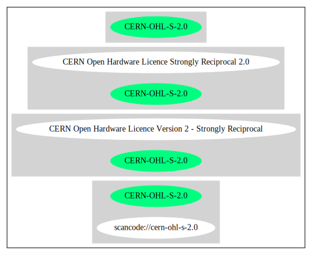

== CERN Open Hardware Licence Version 2 - Strongly Reciprocal (CERN-OHL-S-2.0)

[cols=",",options="header",]
|===
|Key |Value
|Fullname |CERN Open Hardware Licence Version 2 - Strongly Reciprocal
|Shortname |CERN-OHL-S-2.0
|Rating |Unknown, probably Attention or Stop or No-Go
|===

=== Comments on (easy) usability

=== General Comments

=== URLs

* *SPDX:* http://spdx.org/licenses/CERN-OHL-S-2.0.json
* https://www.ohwr.org/project/cernohl/wikis/Documents/CERN-OHL-version-2

'''''

=== Raw Data

* SPDX

....
{
    "__impliedNames": [
        "CERN-OHL-S-2.0",
        "CERN Open Hardware Licence Version 2 - Strongly Reciprocal"
    ],
    "__impliedId": "CERN-OHL-S-2.0",
    "facts": {
        "SPDX": {
            "isSPDXLicenseDeprecated": false,
            "spdxFullName": "CERN Open Hardware Licence Version 2 - Strongly Reciprocal",
            "spdxDetailsURL": "http://spdx.org/licenses/CERN-OHL-S-2.0.json",
            "_sourceURL": "https://spdx.org/licenses/CERN-OHL-S-2.0.html",
            "spdxLicIsOSIApproved": false,
            "spdxSeeAlso": [
                "https://www.ohwr.org/project/cernohl/wikis/Documents/CERN-OHL-version-2"
            ],
            "_implications": {
                "__impliedNames": [
                    "CERN-OHL-S-2.0",
                    "CERN Open Hardware Licence Version 2 - Strongly Reciprocal"
                ],
                "__impliedId": "CERN-OHL-S-2.0",
                "__isOsiApproved": false,
                "__impliedURLs": [
                    [
                        "SPDX",
                        "http://spdx.org/licenses/CERN-OHL-S-2.0.json"
                    ],
                    [
                        null,
                        "https://www.ohwr.org/project/cernohl/wikis/Documents/CERN-OHL-version-2"
                    ]
                ]
            },
            "spdxLicenseId": "CERN-OHL-S-2.0"
        }
    },
    "__isOsiApproved": false,
    "__impliedURLs": [
        [
            "SPDX",
            "http://spdx.org/licenses/CERN-OHL-S-2.0.json"
        ],
        [
            null,
            "https://www.ohwr.org/project/cernohl/wikis/Documents/CERN-OHL-version-2"
        ]
    ]
}
....

'''''

=== Dot Cluster Graph

