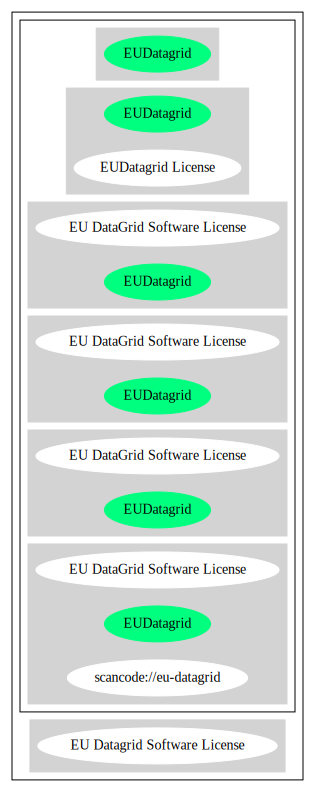

== EU DataGrid Software License (EUDatagrid)

[cols=",",options="header",]
|===
|Key |Value
|Fullname |EU DataGrid Software License
|Shortname |EUDatagrid
|Rating |Unknown
|Classification |NoCopyleft
|===

*Other Names:*

* `+scancode://eu-datagrid+`

=== Comments on (easy) usability

* **↑**``Is OSI Approved'' (source:
https://spdx.org/licenses/EUDatagrid.html[SPDX])
* **↑**``This software Licenses is OK for Fedora'' (source:
https://fedoraproject.org/wiki/Licensing:Main?rd=Licensing[Fedora
Project Wiki])

=== General Comments

* ``Per SPDX.org, this license is OSI certified'' (source:
https://github.com/nexB/scancode-toolkit/blob/develop/src/licensedcode/data/licenses/eu-datagrid.yml[Scancode])

=== URLs

* *Homepage:* http://eu-datagrid.web.cern.ch/eu-datagrid/license.html
* *OSI Page:* http://www.opensource.org/licenses/eudatagrid.php
* *OSI Page:* https://opensource.org/licenses/EUDatagrid
* *SPDX:* http://spdx.org/licenses/EUDatagrid.json
* http://www.eu-egee.org/
* http://www.opensource.org/licenses/EUDatagrid

=== Text

....
EU DataGrid Software License

Copyright (c) 2001 EU DataGrid. All rights reserved.

This software includes voluntary contributions made to the EU DataGrid. For more information on the EU DataGrid, please see http://www.eu-datagrid.org/.

Installation, use, reproduction, display, modification and redistribution of this software, with or without modification, in source and binary forms, are permitted. Any exercise of rights under this license by you or your sub-licensees is subject to the following conditions:

1. Redistributions of this software, with or without modification, must reproduce the above copyright notice and the above license statement as well as this list of conditions, in the software, the user documentation and any other materials provided with the software.

2. The user documentation, if any, included with a redistribution, must include the following notice: "This product includes software developed by the EU DataGrid (http://www.eu-datagrid.org/)."

Alternatively, if that is where third-party acknowledgments normally appear, this acknowledgment must be reproduced in the software itself.

3. The names "EDG", "EDG Toolkit", and "EU DataGrid Project" may not be used to endorse or promote software, or products derived therefrom, except with prior written permission by hep-project-grid-edg-license@cern.ch.

4. You are under no obligation to provide anyone with any bug fixes, patches, upgrades or other modifications, enhancements or derivatives of the features,functionality or performance of this software that you may develop. However, if you publish or distribute your modifications, enhancements or derivative works without contemporaneously requiring users to enter into a separate written license agreement, then you are deemed to have granted participants in the EU DataGrid a worldwide, non-exclusive, royalty-free, perpetual license to install, use, reproduce, display, modify, redistribute and sub-license your modifications, enhancements or derivative works, whether in binary or source code form, under the license conditions stated in this list of conditions.

5. DISCLAIMER

THIS SOFTWARE IS PROVIDED BY THE EU DATAGRID AND CONTRIBUTORS "AS IS" AND ANY EXPRESS OR IMPLIED WARRANTIES, INCLUDING, BUT NOT LIMITED TO, THE IMPLIED WARRANTIES OF MERCHANTABILITY, OF SATISFACTORY QUALITY, AND FITNESS FOR A PARTICULAR PURPOSE OR USE ARE DISCLAIMED. THE EU DATAGRID AND CONTRIBUTORS MAKE NO REPRESENTATION THAT THE SOFTWARE, MODIFICATIONS, ENHANCEMENTS OR DERIVATIVE WORKS THEREOF, WILL NOT INFRINGE ANY PATENT, COPYRIGHT, TRADE SECRET OR OTHER PROPRIETARY RIGHT.

6. LIMITATION OF LIABILITY

THE EU DATAGRID AND CONTRIBUTORS SHALL HAVE NO LIABILITY TO LICENSEE OR OTHER PERSONS FOR DIRECT, INDIRECT, SPECIAL, INCIDENTAL, CONSEQUENTIAL, EXEMPLARY, OR PUNITIVE DAMAGES OF ANY CHARACTER INCLUDING, WITHOUT LIMITATION, PROCUREMENT OF SUBSTITUTE GOODS OR SERVICES, LOSS OF USE, DATA OR PROFITS, OR BUSINESS INTERRUPTION, HOWEVER CAUSED AND ON ANY THEORY OF CONTRACT, WARRANTY, TORT (INCLUDING NEGLIGENCE), PRODUCT LIABILITY OR OTHERWISE, ARISING IN ANY WAY OUT OF THE USE OF THIS SOFTWARE, EVEN IF ADVISED OF THE POSSIBILITY OF SUCH DAMAGES.
....

'''''

=== Raw Data

* SPDX
* OpenChainPolicyTemplate
* Scancode
* Fedora Project Wiki
* OpenSourceInitiative
* Open Knowledge International

....
{
    "__impliedNames": [
        "EUDatagrid",
        "EU DataGrid Software License",
        "scancode://eu-datagrid",
        "EU Datagrid Software License"
    ],
    "__impliedId": "EUDatagrid",
    "__isFsfFree": true,
    "__impliedComments": [
        [
            "Scancode",
            [
                "Per SPDX.org, this license is OSI certified"
            ]
        ]
    ],
    "facts": {
        "Open Knowledge International": {
            "is_generic": null,
            "status": "active",
            "domain_software": true,
            "url": "https://opensource.org/licenses/EUDatagrid",
            "maintainer": "",
            "od_conformance": "not reviewed",
            "_sourceURL": "https://github.com/okfn/licenses/blob/master/licenses.csv",
            "domain_data": false,
            "osd_conformance": "approved",
            "id": "EUDatagrid",
            "title": "EU DataGrid Software License",
            "_implications": {
                "__impliedNames": [
                    "EUDatagrid",
                    "EU DataGrid Software License"
                ],
                "__impliedId": "EUDatagrid",
                "__impliedURLs": [
                    [
                        null,
                        "https://opensource.org/licenses/EUDatagrid"
                    ]
                ]
            },
            "domain_content": false
        },
        "SPDX": {
            "isSPDXLicenseDeprecated": false,
            "spdxFullName": "EU DataGrid Software License",
            "spdxDetailsURL": "http://spdx.org/licenses/EUDatagrid.json",
            "_sourceURL": "https://spdx.org/licenses/EUDatagrid.html",
            "spdxLicIsOSIApproved": true,
            "spdxSeeAlso": [
                "http://eu-datagrid.web.cern.ch/eu-datagrid/license.html",
                "https://opensource.org/licenses/EUDatagrid"
            ],
            "_implications": {
                "__impliedNames": [
                    "EUDatagrid",
                    "EU DataGrid Software License"
                ],
                "__impliedId": "EUDatagrid",
                "__impliedJudgement": [
                    [
                        "SPDX",
                        {
                            "tag": "PositiveJudgement",
                            "contents": "Is OSI Approved"
                        }
                    ]
                ],
                "__isOsiApproved": true,
                "__impliedURLs": [
                    [
                        "SPDX",
                        "http://spdx.org/licenses/EUDatagrid.json"
                    ],
                    [
                        null,
                        "http://eu-datagrid.web.cern.ch/eu-datagrid/license.html"
                    ],
                    [
                        null,
                        "https://opensource.org/licenses/EUDatagrid"
                    ]
                ]
            },
            "spdxLicenseId": "EUDatagrid"
        },
        "Fedora Project Wiki": {
            "GPLv2 Compat?": "Yes",
            "rating": "Good",
            "Upstream URL": "http://www.opensource.org/licenses/eudatagrid.php",
            "GPLv3 Compat?": "Yes",
            "Short Name": "EU Datagrid",
            "licenseType": "license",
            "_sourceURL": "https://fedoraproject.org/wiki/Licensing:Main?rd=Licensing",
            "Full Name": "EU Datagrid Software License",
            "FSF Free?": "Yes",
            "_implications": {
                "__impliedNames": [
                    "EU Datagrid Software License"
                ],
                "__isFsfFree": true,
                "__impliedJudgement": [
                    [
                        "Fedora Project Wiki",
                        {
                            "tag": "PositiveJudgement",
                            "contents": "This software Licenses is OK for Fedora"
                        }
                    ]
                ]
            }
        },
        "Scancode": {
            "otherUrls": [
                "http://www.eu-egee.org/",
                "http://www.opensource.org/licenses/EUDatagrid",
                "https://opensource.org/licenses/EUDatagrid"
            ],
            "homepageUrl": "http://eu-datagrid.web.cern.ch/eu-datagrid/license.html",
            "shortName": "EU DataGrid Software License",
            "textUrls": null,
            "text": "EU DataGrid Software License\n\nCopyright (c) 2001 EU DataGrid. All rights reserved.\n\nThis software includes voluntary contributions made to the EU DataGrid. For more information on the EU DataGrid, please see http://www.eu-datagrid.org/.\n\nInstallation, use, reproduction, display, modification and redistribution of this software, with or without modification, in source and binary forms, are permitted. Any exercise of rights under this license by you or your sub-licensees is subject to the following conditions:\n\n1. Redistributions of this software, with or without modification, must reproduce the above copyright notice and the above license statement as well as this list of conditions, in the software, the user documentation and any other materials provided with the software.\n\n2. The user documentation, if any, included with a redistribution, must include the following notice: \"This product includes software developed by the EU DataGrid (http://www.eu-datagrid.org/).\"\n\nAlternatively, if that is where third-party acknowledgments normally appear, this acknowledgment must be reproduced in the software itself.\n\n3. The names \"EDG\", \"EDG Toolkit\", and \"EU DataGrid Project\" may not be used to endorse or promote software, or products derived therefrom, except with prior written permission by hep-project-grid-edg-license@cern.ch.\n\n4. You are under no obligation to provide anyone with any bug fixes, patches, upgrades or other modifications, enhancements or derivatives of the features,functionality or performance of this software that you may develop. However, if you publish or distribute your modifications, enhancements or derivative works without contemporaneously requiring users to enter into a separate written license agreement, then you are deemed to have granted participants in the EU DataGrid a worldwide, non-exclusive, royalty-free, perpetual license to install, use, reproduce, display, modify, redistribute and sub-license your modifications, enhancements or derivative works, whether in binary or source code form, under the license conditions stated in this list of conditions.\n\n5. DISCLAIMER\n\nTHIS SOFTWARE IS PROVIDED BY THE EU DATAGRID AND CONTRIBUTORS \"AS IS\" AND ANY EXPRESS OR IMPLIED WARRANTIES, INCLUDING, BUT NOT LIMITED TO, THE IMPLIED WARRANTIES OF MERCHANTABILITY, OF SATISFACTORY QUALITY, AND FITNESS FOR A PARTICULAR PURPOSE OR USE ARE DISCLAIMED. THE EU DATAGRID AND CONTRIBUTORS MAKE NO REPRESENTATION THAT THE SOFTWARE, MODIFICATIONS, ENHANCEMENTS OR DERIVATIVE WORKS THEREOF, WILL NOT INFRINGE ANY PATENT, COPYRIGHT, TRADE SECRET OR OTHER PROPRIETARY RIGHT.\n\n6. LIMITATION OF LIABILITY\n\nTHE EU DATAGRID AND CONTRIBUTORS SHALL HAVE NO LIABILITY TO LICENSEE OR OTHER PERSONS FOR DIRECT, INDIRECT, SPECIAL, INCIDENTAL, CONSEQUENTIAL, EXEMPLARY, OR PUNITIVE DAMAGES OF ANY CHARACTER INCLUDING, WITHOUT LIMITATION, PROCUREMENT OF SUBSTITUTE GOODS OR SERVICES, LOSS OF USE, DATA OR PROFITS, OR BUSINESS INTERRUPTION, HOWEVER CAUSED AND ON ANY THEORY OF CONTRACT, WARRANTY, TORT (INCLUDING NEGLIGENCE), PRODUCT LIABILITY OR OTHERWISE, ARISING IN ANY WAY OUT OF THE USE OF THIS SOFTWARE, EVEN IF ADVISED OF THE POSSIBILITY OF SUCH DAMAGES.",
            "category": "Permissive",
            "osiUrl": "http://www.opensource.org/licenses/eudatagrid.php",
            "owner": "DataGrid Project",
            "_sourceURL": "https://github.com/nexB/scancode-toolkit/blob/develop/src/licensedcode/data/licenses/eu-datagrid.yml",
            "key": "eu-datagrid",
            "name": "EU DataGrid Software License",
            "spdxId": "EUDatagrid",
            "notes": "Per SPDX.org, this license is OSI certified",
            "_implications": {
                "__impliedNames": [
                    "scancode://eu-datagrid",
                    "EU DataGrid Software License",
                    "EUDatagrid"
                ],
                "__impliedId": "EUDatagrid",
                "__impliedComments": [
                    [
                        "Scancode",
                        [
                            "Per SPDX.org, this license is OSI certified"
                        ]
                    ]
                ],
                "__impliedCopyleft": [
                    [
                        "Scancode",
                        "NoCopyleft"
                    ]
                ],
                "__calculatedCopyleft": "NoCopyleft",
                "__impliedText": "EU DataGrid Software License\n\nCopyright (c) 2001 EU DataGrid. All rights reserved.\n\nThis software includes voluntary contributions made to the EU DataGrid. For more information on the EU DataGrid, please see http://www.eu-datagrid.org/.\n\nInstallation, use, reproduction, display, modification and redistribution of this software, with or without modification, in source and binary forms, are permitted. Any exercise of rights under this license by you or your sub-licensees is subject to the following conditions:\n\n1. Redistributions of this software, with or without modification, must reproduce the above copyright notice and the above license statement as well as this list of conditions, in the software, the user documentation and any other materials provided with the software.\n\n2. The user documentation, if any, included with a redistribution, must include the following notice: \"This product includes software developed by the EU DataGrid (http://www.eu-datagrid.org/).\"\n\nAlternatively, if that is where third-party acknowledgments normally appear, this acknowledgment must be reproduced in the software itself.\n\n3. The names \"EDG\", \"EDG Toolkit\", and \"EU DataGrid Project\" may not be used to endorse or promote software, or products derived therefrom, except with prior written permission by hep-project-grid-edg-license@cern.ch.\n\n4. You are under no obligation to provide anyone with any bug fixes, patches, upgrades or other modifications, enhancements or derivatives of the features,functionality or performance of this software that you may develop. However, if you publish or distribute your modifications, enhancements or derivative works without contemporaneously requiring users to enter into a separate written license agreement, then you are deemed to have granted participants in the EU DataGrid a worldwide, non-exclusive, royalty-free, perpetual license to install, use, reproduce, display, modify, redistribute and sub-license your modifications, enhancements or derivative works, whether in binary or source code form, under the license conditions stated in this list of conditions.\n\n5. DISCLAIMER\n\nTHIS SOFTWARE IS PROVIDED BY THE EU DATAGRID AND CONTRIBUTORS \"AS IS\" AND ANY EXPRESS OR IMPLIED WARRANTIES, INCLUDING, BUT NOT LIMITED TO, THE IMPLIED WARRANTIES OF MERCHANTABILITY, OF SATISFACTORY QUALITY, AND FITNESS FOR A PARTICULAR PURPOSE OR USE ARE DISCLAIMED. THE EU DATAGRID AND CONTRIBUTORS MAKE NO REPRESENTATION THAT THE SOFTWARE, MODIFICATIONS, ENHANCEMENTS OR DERIVATIVE WORKS THEREOF, WILL NOT INFRINGE ANY PATENT, COPYRIGHT, TRADE SECRET OR OTHER PROPRIETARY RIGHT.\n\n6. LIMITATION OF LIABILITY\n\nTHE EU DATAGRID AND CONTRIBUTORS SHALL HAVE NO LIABILITY TO LICENSEE OR OTHER PERSONS FOR DIRECT, INDIRECT, SPECIAL, INCIDENTAL, CONSEQUENTIAL, EXEMPLARY, OR PUNITIVE DAMAGES OF ANY CHARACTER INCLUDING, WITHOUT LIMITATION, PROCUREMENT OF SUBSTITUTE GOODS OR SERVICES, LOSS OF USE, DATA OR PROFITS, OR BUSINESS INTERRUPTION, HOWEVER CAUSED AND ON ANY THEORY OF CONTRACT, WARRANTY, TORT (INCLUDING NEGLIGENCE), PRODUCT LIABILITY OR OTHERWISE, ARISING IN ANY WAY OUT OF THE USE OF THIS SOFTWARE, EVEN IF ADVISED OF THE POSSIBILITY OF SUCH DAMAGES.",
                "__impliedURLs": [
                    [
                        "Homepage",
                        "http://eu-datagrid.web.cern.ch/eu-datagrid/license.html"
                    ],
                    [
                        "OSI Page",
                        "http://www.opensource.org/licenses/eudatagrid.php"
                    ],
                    [
                        null,
                        "http://www.eu-egee.org/"
                    ],
                    [
                        null,
                        "http://www.opensource.org/licenses/EUDatagrid"
                    ],
                    [
                        null,
                        "https://opensource.org/licenses/EUDatagrid"
                    ]
                ]
            }
        },
        "OpenChainPolicyTemplate": {
            "isSaaSDeemed": "yes",
            "licenseType": "SaaS",
            "freedomOrDeath": "no",
            "typeCopyleft": "no",
            "_sourceURL": "https://github.com/OpenChain-Project/curriculum/raw/ddf1e879341adbd9b297cd67c5d5c16b2076540b/policy-template/Open%20Source%20Policy%20Template%20for%20OpenChain%20Specification%201.2.ods",
            "name": "EU DataGrid Software License ",
            "commercialUse": true,
            "spdxId": "EUDatagrid",
            "_implications": {
                "__impliedNames": [
                    "EUDatagrid"
                ]
            }
        },
        "OpenSourceInitiative": {
            "text": [
                {
                    "url": "https://opensource.org/licenses/EUDatagrid",
                    "title": "HTML",
                    "media_type": "text/html"
                }
            ],
            "identifiers": [
                {
                    "identifier": "EUDatagrid",
                    "scheme": "SPDX"
                }
            ],
            "superseded_by": null,
            "_sourceURL": "https://opensource.org/licenses/",
            "name": "EU DataGrid Software License",
            "other_names": [],
            "keywords": [
                "discouraged",
                "non-reusable",
                "osi-approved"
            ],
            "id": "EUDatagrid",
            "links": [
                {
                    "note": "OSI Page",
                    "url": "https://opensource.org/licenses/EUDatagrid"
                }
            ],
            "_implications": {
                "__impliedNames": [
                    "EUDatagrid",
                    "EU DataGrid Software License",
                    "EUDatagrid"
                ],
                "__impliedURLs": [
                    [
                        "OSI Page",
                        "https://opensource.org/licenses/EUDatagrid"
                    ]
                ]
            }
        }
    },
    "__impliedJudgement": [
        [
            "Fedora Project Wiki",
            {
                "tag": "PositiveJudgement",
                "contents": "This software Licenses is OK for Fedora"
            }
        ],
        [
            "SPDX",
            {
                "tag": "PositiveJudgement",
                "contents": "Is OSI Approved"
            }
        ]
    ],
    "__impliedCopyleft": [
        [
            "Scancode",
            "NoCopyleft"
        ]
    ],
    "__calculatedCopyleft": "NoCopyleft",
    "__isOsiApproved": true,
    "__impliedText": "EU DataGrid Software License\n\nCopyright (c) 2001 EU DataGrid. All rights reserved.\n\nThis software includes voluntary contributions made to the EU DataGrid. For more information on the EU DataGrid, please see http://www.eu-datagrid.org/.\n\nInstallation, use, reproduction, display, modification and redistribution of this software, with or without modification, in source and binary forms, are permitted. Any exercise of rights under this license by you or your sub-licensees is subject to the following conditions:\n\n1. Redistributions of this software, with or without modification, must reproduce the above copyright notice and the above license statement as well as this list of conditions, in the software, the user documentation and any other materials provided with the software.\n\n2. The user documentation, if any, included with a redistribution, must include the following notice: \"This product includes software developed by the EU DataGrid (http://www.eu-datagrid.org/).\"\n\nAlternatively, if that is where third-party acknowledgments normally appear, this acknowledgment must be reproduced in the software itself.\n\n3. The names \"EDG\", \"EDG Toolkit\", and \"EU DataGrid Project\" may not be used to endorse or promote software, or products derived therefrom, except with prior written permission by hep-project-grid-edg-license@cern.ch.\n\n4. You are under no obligation to provide anyone with any bug fixes, patches, upgrades or other modifications, enhancements or derivatives of the features,functionality or performance of this software that you may develop. However, if you publish or distribute your modifications, enhancements or derivative works without contemporaneously requiring users to enter into a separate written license agreement, then you are deemed to have granted participants in the EU DataGrid a worldwide, non-exclusive, royalty-free, perpetual license to install, use, reproduce, display, modify, redistribute and sub-license your modifications, enhancements or derivative works, whether in binary or source code form, under the license conditions stated in this list of conditions.\n\n5. DISCLAIMER\n\nTHIS SOFTWARE IS PROVIDED BY THE EU DATAGRID AND CONTRIBUTORS \"AS IS\" AND ANY EXPRESS OR IMPLIED WARRANTIES, INCLUDING, BUT NOT LIMITED TO, THE IMPLIED WARRANTIES OF MERCHANTABILITY, OF SATISFACTORY QUALITY, AND FITNESS FOR A PARTICULAR PURPOSE OR USE ARE DISCLAIMED. THE EU DATAGRID AND CONTRIBUTORS MAKE NO REPRESENTATION THAT THE SOFTWARE, MODIFICATIONS, ENHANCEMENTS OR DERIVATIVE WORKS THEREOF, WILL NOT INFRINGE ANY PATENT, COPYRIGHT, TRADE SECRET OR OTHER PROPRIETARY RIGHT.\n\n6. LIMITATION OF LIABILITY\n\nTHE EU DATAGRID AND CONTRIBUTORS SHALL HAVE NO LIABILITY TO LICENSEE OR OTHER PERSONS FOR DIRECT, INDIRECT, SPECIAL, INCIDENTAL, CONSEQUENTIAL, EXEMPLARY, OR PUNITIVE DAMAGES OF ANY CHARACTER INCLUDING, WITHOUT LIMITATION, PROCUREMENT OF SUBSTITUTE GOODS OR SERVICES, LOSS OF USE, DATA OR PROFITS, OR BUSINESS INTERRUPTION, HOWEVER CAUSED AND ON ANY THEORY OF CONTRACT, WARRANTY, TORT (INCLUDING NEGLIGENCE), PRODUCT LIABILITY OR OTHERWISE, ARISING IN ANY WAY OUT OF THE USE OF THIS SOFTWARE, EVEN IF ADVISED OF THE POSSIBILITY OF SUCH DAMAGES.",
    "__impliedURLs": [
        [
            "SPDX",
            "http://spdx.org/licenses/EUDatagrid.json"
        ],
        [
            null,
            "http://eu-datagrid.web.cern.ch/eu-datagrid/license.html"
        ],
        [
            null,
            "https://opensource.org/licenses/EUDatagrid"
        ],
        [
            "Homepage",
            "http://eu-datagrid.web.cern.ch/eu-datagrid/license.html"
        ],
        [
            "OSI Page",
            "http://www.opensource.org/licenses/eudatagrid.php"
        ],
        [
            null,
            "http://www.eu-egee.org/"
        ],
        [
            null,
            "http://www.opensource.org/licenses/EUDatagrid"
        ],
        [
            "OSI Page",
            "https://opensource.org/licenses/EUDatagrid"
        ]
    ]
}
....

'''''

=== Dot Cluster Graph

