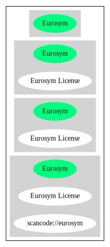

== Eurosym License (Eurosym)

[cols=",",options="header",]
|===
|Key |Value
|Fullname |Eurosym License
|Shortname |Eurosym
|Rating |Unknown, probably Attention or Stop or No-Go
|Classification |WeakCopyleft
|===

*Other Names:*

* `+scancode://eurosym+`

=== Comments on (easy) usability

=== General Comments

=== URLs

* *Homepage:*
https://fedoraproject.org/wiki/Licensing:Eurosym?rd=Licensing/Eurosym
* *SPDX:* http://spdx.org/licenses/Eurosym.json
* https://fedoraproject.org/wiki/Licensing/Eurosym

=== Text

....
Licence Version 2

This software is provided 'as-is', without warranty of any kind, express or implied. In no event will the authors or copyright holders be held liable for any damages arising from the use of this software.

Permission is granted to anyone to use this software for any purpose, including commercial applications, and to alter it and redistribute it freely, subject to the following restrictions:

     1. The origin of this software must not be misrepresented; you must not claim that you wrote the original software. If you use this software in a product, an acknowledgment in the product documentation would be appreciated.

     2. Altered source versions must be plainly marked as such, and must not be misrepresented as being the original software.

     3. You must not use any of the names of the authors or copyright holders of the original software for advertising or publicity pertaining to distribution without specific, written prior permission.

     4. If you change this software and redistribute parts or all of it in any form, you must make the source code of the altered version of this software available.

     5. This notice may not be removed or altered from any source distribution.

This licence is governed by the Laws of Germany. Disputes shall be settled by Saarbruecken City Court.
....

'''''

=== Raw Data

....
{
    "__impliedNames": [
        "Eurosym",
        "Eurosym License",
        "scancode://eurosym"
    ],
    "__impliedId": "Eurosym",
    "facts": {
        "SPDX": {
            "isSPDXLicenseDeprecated": false,
            "spdxFullName": "Eurosym License",
            "spdxDetailsURL": "http://spdx.org/licenses/Eurosym.json",
            "_sourceURL": "https://spdx.org/licenses/Eurosym.html",
            "spdxLicIsOSIApproved": false,
            "spdxSeeAlso": [
                "https://fedoraproject.org/wiki/Licensing/Eurosym"
            ],
            "_implications": {
                "__impliedNames": [
                    "Eurosym",
                    "Eurosym License"
                ],
                "__impliedId": "Eurosym",
                "__isOsiApproved": false,
                "__impliedURLs": [
                    [
                        "SPDX",
                        "http://spdx.org/licenses/Eurosym.json"
                    ],
                    [
                        null,
                        "https://fedoraproject.org/wiki/Licensing/Eurosym"
                    ]
                ]
            },
            "spdxLicenseId": "Eurosym"
        },
        "Scancode": {
            "otherUrls": [
                "https://fedoraproject.org/wiki/Licensing/Eurosym"
            ],
            "homepageUrl": "https://fedoraproject.org/wiki/Licensing:Eurosym?rd=Licensing/Eurosym",
            "shortName": "Eurosym License",
            "textUrls": null,
            "text": "Licence Version 2\n\nThis software is provided 'as-is', without warranty of any kind, express or implied. In no event will the authors or copyright holders be held liable for any damages arising from the use of this software.\n\nPermission is granted to anyone to use this software for any purpose, including commercial applications, and to alter it and redistribute it freely, subject to the following restrictions:\n\n     1. The origin of this software must not be misrepresented; you must not claim that you wrote the original software. If you use this software in a product, an acknowledgment in the product documentation would be appreciated.\n\n     2. Altered source versions must be plainly marked as such, and must not be misrepresented as being the original software.\n\n     3. You must not use any of the names of the authors or copyright holders of the original software for advertising or publicity pertaining to distribution without specific, written prior permission.\n\n     4. If you change this software and redistribute parts or all of it in any form, you must make the source code of the altered version of this software available.\n\n     5. This notice may not be removed or altered from any source distribution.\n\nThis licence is governed by the Laws of Germany. Disputes shall be settled by Saarbruecken City Court.\n",
            "category": "Copyleft Limited",
            "osiUrl": null,
            "owner": "Henrik Theiling",
            "_sourceURL": "https://github.com/nexB/scancode-toolkit/blob/develop/src/licensedcode/data/licenses/eurosym.yml",
            "key": "eurosym",
            "name": "Eurosym License",
            "spdxId": "Eurosym",
            "notes": null,
            "_implications": {
                "__impliedNames": [
                    "scancode://eurosym",
                    "Eurosym License",
                    "Eurosym"
                ],
                "__impliedId": "Eurosym",
                "__impliedCopyleft": [
                    [
                        "Scancode",
                        "WeakCopyleft"
                    ]
                ],
                "__calculatedCopyleft": "WeakCopyleft",
                "__impliedText": "Licence Version 2\n\nThis software is provided 'as-is', without warranty of any kind, express or implied. In no event will the authors or copyright holders be held liable for any damages arising from the use of this software.\n\nPermission is granted to anyone to use this software for any purpose, including commercial applications, and to alter it and redistribute it freely, subject to the following restrictions:\n\n     1. The origin of this software must not be misrepresented; you must not claim that you wrote the original software. If you use this software in a product, an acknowledgment in the product documentation would be appreciated.\n\n     2. Altered source versions must be plainly marked as such, and must not be misrepresented as being the original software.\n\n     3. You must not use any of the names of the authors or copyright holders of the original software for advertising or publicity pertaining to distribution without specific, written prior permission.\n\n     4. If you change this software and redistribute parts or all of it in any form, you must make the source code of the altered version of this software available.\n\n     5. This notice may not be removed or altered from any source distribution.\n\nThis licence is governed by the Laws of Germany. Disputes shall be settled by Saarbruecken City Court.\n",
                "__impliedURLs": [
                    [
                        "Homepage",
                        "https://fedoraproject.org/wiki/Licensing:Eurosym?rd=Licensing/Eurosym"
                    ],
                    [
                        null,
                        "https://fedoraproject.org/wiki/Licensing/Eurosym"
                    ]
                ]
            }
        },
        "Cavil": {
            "implications": {
                "__impliedNames": [
                    "Eurosym",
                    "Eurosym"
                ],
                "__impliedId": "Eurosym"
            },
            "shortname": "Eurosym",
            "riskInt": 5,
            "trademarkInt": 0,
            "opinionInt": 0,
            "otherNames": [
                "Eurosym"
            ],
            "patentInt": 0
        }
    },
    "__impliedCopyleft": [
        [
            "Scancode",
            "WeakCopyleft"
        ]
    ],
    "__calculatedCopyleft": "WeakCopyleft",
    "__isOsiApproved": false,
    "__impliedText": "Licence Version 2\n\nThis software is provided 'as-is', without warranty of any kind, express or implied. In no event will the authors or copyright holders be held liable for any damages arising from the use of this software.\n\nPermission is granted to anyone to use this software for any purpose, including commercial applications, and to alter it and redistribute it freely, subject to the following restrictions:\n\n     1. The origin of this software must not be misrepresented; you must not claim that you wrote the original software. If you use this software in a product, an acknowledgment in the product documentation would be appreciated.\n\n     2. Altered source versions must be plainly marked as such, and must not be misrepresented as being the original software.\n\n     3. You must not use any of the names of the authors or copyright holders of the original software for advertising or publicity pertaining to distribution without specific, written prior permission.\n\n     4. If you change this software and redistribute parts or all of it in any form, you must make the source code of the altered version of this software available.\n\n     5. This notice may not be removed or altered from any source distribution.\n\nThis licence is governed by the Laws of Germany. Disputes shall be settled by Saarbruecken City Court.\n",
    "__impliedURLs": [
        [
            "SPDX",
            "http://spdx.org/licenses/Eurosym.json"
        ],
        [
            null,
            "https://fedoraproject.org/wiki/Licensing/Eurosym"
        ],
        [
            "Homepage",
            "https://fedoraproject.org/wiki/Licensing:Eurosym?rd=Licensing/Eurosym"
        ]
    ]
}
....

'''''

=== Dot Cluster Graph

