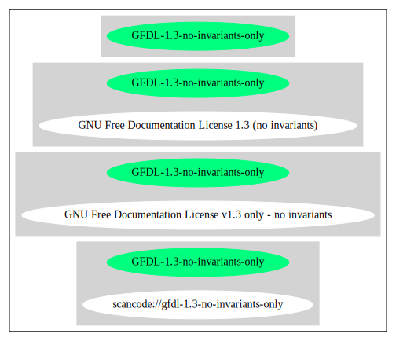

== GNU Free Documentation License v1.3 only - no invariants (GFDL-1.3-no-invariants-only)

[cols=",",options="header",]
|===
|Key |Value
|Fullname |GNU Free Documentation License v1.3 only - no invariants
|Shortname |GFDL-1.3-no-invariants-only
|Rating |Unknown, probably Attention or Stop or No-Go
|===

=== Comments on (easy) usability

=== General Comments

=== URLs

* *SPDX:* http://spdx.org/licenses/GFDL-1.3-no-invariants-only.json
* https://www.gnu.org/licenses/fdl-1.3.txt

'''''

=== Raw Data

....
{
    "__impliedNames": [
        "GFDL-1.3-no-invariants-only",
        "GNU Free Documentation License v1.3 only - no invariants"
    ],
    "__impliedId": "GFDL-1.3-no-invariants-only",
    "facts": {
        "SPDX": {
            "isSPDXLicenseDeprecated": false,
            "spdxFullName": "GNU Free Documentation License v1.3 only - no invariants",
            "spdxDetailsURL": "http://spdx.org/licenses/GFDL-1.3-no-invariants-only.json",
            "_sourceURL": "https://spdx.org/licenses/GFDL-1.3-no-invariants-only.html",
            "spdxLicIsOSIApproved": false,
            "spdxSeeAlso": [
                "https://www.gnu.org/licenses/fdl-1.3.txt"
            ],
            "_implications": {
                "__impliedNames": [
                    "GFDL-1.3-no-invariants-only",
                    "GNU Free Documentation License v1.3 only - no invariants"
                ],
                "__impliedId": "GFDL-1.3-no-invariants-only",
                "__isOsiApproved": false,
                "__impliedURLs": [
                    [
                        "SPDX",
                        "http://spdx.org/licenses/GFDL-1.3-no-invariants-only.json"
                    ],
                    [
                        null,
                        "https://www.gnu.org/licenses/fdl-1.3.txt"
                    ]
                ]
            },
            "spdxLicenseId": "GFDL-1.3-no-invariants-only"
        }
    },
    "__isOsiApproved": false,
    "__impliedURLs": [
        [
            "SPDX",
            "http://spdx.org/licenses/GFDL-1.3-no-invariants-only.json"
        ],
        [
            null,
            "https://www.gnu.org/licenses/fdl-1.3.txt"
        ]
    ]
}
....

'''''

=== Dot Cluster Graph

