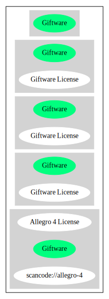

== Giftware License (Giftware)

[cols=",",options="header",]
|===
|Key |Value
|Fullname |Giftware License
|Shortname |Giftware
|Rating |Unknown, probably Stop or No-Go
|Classification |NoCopyleft
|===

*Other Names:*

* `+scancode://allegro-4+`
* `+Allegro 4 License+`

=== Comments on (easy) usability

* **↓**``Rating is: Lead'' (source:
https://blueoakcouncil.org/list[BlueOak License List])

=== General Comments

* ``Per SPDX.org, this license may also be known as Allegro 4. The
Allegro 5 license shown at the alleg.sourceforge.net URL is the same as
zlib. '' (source:
https://github.com/nexB/scancode-toolkit/blob/develop/src/licensedcode/data/licenses/allegro-4.yml[Scancode])

=== URLs

* *Homepage:* http://alleg.sourceforge.net//license.html
* *SPDX:* http://spdx.org/licenses/Giftware.json
* *SPDX:* https://spdx.org/licenses/Giftware.html
* http://liballeg.org/license.html#allegro-4-the-giftware-license

=== Text

....
Allegro 4 (the giftware license)

Allegro is gift-ware. It was created by a number of people working in cooperation, and is given to you freely as a gift. You may use, modify, redistribute, and generally hack it about in any way you like, and you do not have to give us anything in return.

However, if you like this product you are encouraged to thank us by making a return gift to the Allegro community. This could be by writing an add-on package, providing a useful bug report, making an improvement to the library, or perhaps just releasing the sources of your program so that other people can learn from them. If you redistribute parts of this code or make a game using it, it would be nice if you mentioned Allegro somewhere in the credits, but you are not required to do this. We trust you not to abuse our generosity.

By Shawn Hargreaves, 18 October 1998.

DISCLAIMER: THE SOFTWARE IS PROVIDED "AS IS", WITHOUT WARRANTY OF ANY KIND, EXPRESS OR IMPLIED, INCLUDING BUT NOT LIMITED TO THE WARRANTIES OF MERCHANTABILITY, FITNESS FOR A PARTICULAR PURPOSE, TITLE AND NON-INFRINGEMENT. IN NO EVENT SHALL THE COPYRIGHT HOLDERS OR ANYONE DISTRIBUTING THE SOFTWARE BE LIABLE FOR ANY DAMAGES OR OTHER LIABILITY, WHETHER IN CONTRACT, TORT OR OTHERWISE, ARISING FROM, OUT OF OR IN CONNECTION WITH THE SOFTWARE OR THE USE OR OTHER DEALINGS IN THE SOFTWARE.
....

'''''

=== Raw Data

....
{
    "__impliedNames": [
        "Giftware",
        "Giftware License",
        "scancode://allegro-4",
        "Allegro 4 License"
    ],
    "__impliedId": "Giftware",
    "__impliedComments": [
        [
            "Scancode",
            [
                "Per SPDX.org, this license may also be known as Allegro 4. The Allegro 5\nlicense shown at the alleg.sourceforge.net URL is the same as zlib.\n"
            ]
        ]
    ],
    "facts": {
        "SPDX": {
            "isSPDXLicenseDeprecated": false,
            "spdxFullName": "Giftware License",
            "spdxDetailsURL": "http://spdx.org/licenses/Giftware.json",
            "_sourceURL": "https://spdx.org/licenses/Giftware.html",
            "spdxLicIsOSIApproved": false,
            "spdxSeeAlso": [
                "http://liballeg.org/license.html#allegro-4-the-giftware-license"
            ],
            "_implications": {
                "__impliedNames": [
                    "Giftware",
                    "Giftware License"
                ],
                "__impliedId": "Giftware",
                "__isOsiApproved": false,
                "__impliedURLs": [
                    [
                        "SPDX",
                        "http://spdx.org/licenses/Giftware.json"
                    ],
                    [
                        null,
                        "http://liballeg.org/license.html#allegro-4-the-giftware-license"
                    ]
                ]
            },
            "spdxLicenseId": "Giftware"
        },
        "Scancode": {
            "otherUrls": [
                "http://liballeg.org/license.html#allegro-4-the-giftware-license"
            ],
            "homepageUrl": "http://alleg.sourceforge.net//license.html",
            "shortName": "Allegro 4 License",
            "textUrls": null,
            "text": "Allegro 4 (the giftware license)\n\nAllegro is gift-ware. It was created by a number of people working in cooperation, and is given to you freely as a gift. You may use, modify, redistribute, and generally hack it about in any way you like, and you do not have to give us anything in return.\n\nHowever, if you like this product you are encouraged to thank us by making a return gift to the Allegro community. This could be by writing an add-on package, providing a useful bug report, making an improvement to the library, or perhaps just releasing the sources of your program so that other people can learn from them. If you redistribute parts of this code or make a game using it, it would be nice if you mentioned Allegro somewhere in the credits, but you are not required to do this. We trust you not to abuse our generosity.\n\nBy Shawn Hargreaves, 18 October 1998.\n\nDISCLAIMER: THE SOFTWARE IS PROVIDED \"AS IS\", WITHOUT WARRANTY OF ANY KIND, EXPRESS OR IMPLIED, INCLUDING BUT NOT LIMITED TO THE WARRANTIES OF MERCHANTABILITY, FITNESS FOR A PARTICULAR PURPOSE, TITLE AND NON-INFRINGEMENT. IN NO EVENT SHALL THE COPYRIGHT HOLDERS OR ANYONE DISTRIBUTING THE SOFTWARE BE LIABLE FOR ANY DAMAGES OR OTHER LIABILITY, WHETHER IN CONTRACT, TORT OR OTHERWISE, ARISING FROM, OUT OF OR IN CONNECTION WITH THE SOFTWARE OR THE USE OR OTHER DEALINGS IN THE SOFTWARE.",
            "category": "Permissive",
            "osiUrl": null,
            "owner": "Allegro Project",
            "_sourceURL": "https://github.com/nexB/scancode-toolkit/blob/develop/src/licensedcode/data/licenses/allegro-4.yml",
            "key": "allegro-4",
            "name": "Allegro 4 License",
            "spdxId": "Giftware",
            "notes": "Per SPDX.org, this license may also be known as Allegro 4. The Allegro 5\nlicense shown at the alleg.sourceforge.net URL is the same as zlib.\n",
            "_implications": {
                "__impliedNames": [
                    "scancode://allegro-4",
                    "Allegro 4 License",
                    "Giftware"
                ],
                "__impliedId": "Giftware",
                "__impliedComments": [
                    [
                        "Scancode",
                        [
                            "Per SPDX.org, this license may also be known as Allegro 4. The Allegro 5\nlicense shown at the alleg.sourceforge.net URL is the same as zlib.\n"
                        ]
                    ]
                ],
                "__impliedCopyleft": [
                    [
                        "Scancode",
                        "NoCopyleft"
                    ]
                ],
                "__calculatedCopyleft": "NoCopyleft",
                "__impliedText": "Allegro 4 (the giftware license)\n\nAllegro is gift-ware. It was created by a number of people working in cooperation, and is given to you freely as a gift. You may use, modify, redistribute, and generally hack it about in any way you like, and you do not have to give us anything in return.\n\nHowever, if you like this product you are encouraged to thank us by making a return gift to the Allegro community. This could be by writing an add-on package, providing a useful bug report, making an improvement to the library, or perhaps just releasing the sources of your program so that other people can learn from them. If you redistribute parts of this code or make a game using it, it would be nice if you mentioned Allegro somewhere in the credits, but you are not required to do this. We trust you not to abuse our generosity.\n\nBy Shawn Hargreaves, 18 October 1998.\n\nDISCLAIMER: THE SOFTWARE IS PROVIDED \"AS IS\", WITHOUT WARRANTY OF ANY KIND, EXPRESS OR IMPLIED, INCLUDING BUT NOT LIMITED TO THE WARRANTIES OF MERCHANTABILITY, FITNESS FOR A PARTICULAR PURPOSE, TITLE AND NON-INFRINGEMENT. IN NO EVENT SHALL THE COPYRIGHT HOLDERS OR ANYONE DISTRIBUTING THE SOFTWARE BE LIABLE FOR ANY DAMAGES OR OTHER LIABILITY, WHETHER IN CONTRACT, TORT OR OTHERWISE, ARISING FROM, OUT OF OR IN CONNECTION WITH THE SOFTWARE OR THE USE OR OTHER DEALINGS IN THE SOFTWARE.",
                "__impliedURLs": [
                    [
                        "Homepage",
                        "http://alleg.sourceforge.net//license.html"
                    ],
                    [
                        null,
                        "http://liballeg.org/license.html#allegro-4-the-giftware-license"
                    ]
                ]
            }
        },
        "BlueOak License List": {
            "BlueOakRating": "Lead",
            "url": "https://spdx.org/licenses/Giftware.html",
            "isPermissive": true,
            "_sourceURL": "https://blueoakcouncil.org/list",
            "name": "Giftware License",
            "id": "Giftware",
            "_implications": {
                "__impliedNames": [
                    "Giftware"
                ],
                "__impliedJudgement": [
                    [
                        "BlueOak License List",
                        {
                            "tag": "NegativeJudgement",
                            "contents": "Rating is: Lead"
                        }
                    ]
                ],
                "__impliedCopyleft": [
                    [
                        "BlueOak License List",
                        "NoCopyleft"
                    ]
                ],
                "__calculatedCopyleft": "NoCopyleft",
                "__impliedURLs": [
                    [
                        "SPDX",
                        "https://spdx.org/licenses/Giftware.html"
                    ]
                ]
            }
        }
    },
    "__impliedJudgement": [
        [
            "BlueOak License List",
            {
                "tag": "NegativeJudgement",
                "contents": "Rating is: Lead"
            }
        ]
    ],
    "__impliedCopyleft": [
        [
            "BlueOak License List",
            "NoCopyleft"
        ],
        [
            "Scancode",
            "NoCopyleft"
        ]
    ],
    "__calculatedCopyleft": "NoCopyleft",
    "__isOsiApproved": false,
    "__impliedText": "Allegro 4 (the giftware license)\n\nAllegro is gift-ware. It was created by a number of people working in cooperation, and is given to you freely as a gift. You may use, modify, redistribute, and generally hack it about in any way you like, and you do not have to give us anything in return.\n\nHowever, if you like this product you are encouraged to thank us by making a return gift to the Allegro community. This could be by writing an add-on package, providing a useful bug report, making an improvement to the library, or perhaps just releasing the sources of your program so that other people can learn from them. If you redistribute parts of this code or make a game using it, it would be nice if you mentioned Allegro somewhere in the credits, but you are not required to do this. We trust you not to abuse our generosity.\n\nBy Shawn Hargreaves, 18 October 1998.\n\nDISCLAIMER: THE SOFTWARE IS PROVIDED \"AS IS\", WITHOUT WARRANTY OF ANY KIND, EXPRESS OR IMPLIED, INCLUDING BUT NOT LIMITED TO THE WARRANTIES OF MERCHANTABILITY, FITNESS FOR A PARTICULAR PURPOSE, TITLE AND NON-INFRINGEMENT. IN NO EVENT SHALL THE COPYRIGHT HOLDERS OR ANYONE DISTRIBUTING THE SOFTWARE BE LIABLE FOR ANY DAMAGES OR OTHER LIABILITY, WHETHER IN CONTRACT, TORT OR OTHERWISE, ARISING FROM, OUT OF OR IN CONNECTION WITH THE SOFTWARE OR THE USE OR OTHER DEALINGS IN THE SOFTWARE.",
    "__impliedURLs": [
        [
            "SPDX",
            "http://spdx.org/licenses/Giftware.json"
        ],
        [
            null,
            "http://liballeg.org/license.html#allegro-4-the-giftware-license"
        ],
        [
            "SPDX",
            "https://spdx.org/licenses/Giftware.html"
        ],
        [
            "Homepage",
            "http://alleg.sourceforge.net//license.html"
        ]
    ]
}
....

'''''

=== Dot Cluster Graph

