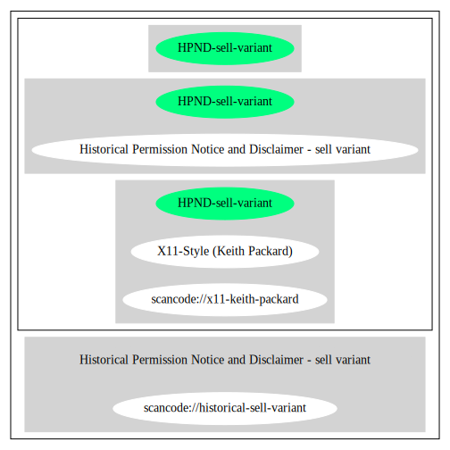

== Historical Permission Notice and Disclaimer - sell variant (HPND-sell-variant)

[cols=",",options="header",]
|===
|Key |Value
|Fullname |Historical Permission Notice and Disclaimer - sell variant
|Shortname |HPND-sell-variant
|Rating |Unknown, probably Attention or Stop or No-Go
|Classification |NoCopyleft
|===

*Other Names:*

* `+scancode://x11-keith-packard+`
* `+X11-Style (Keith Packard)+`
* `+scancode://historical-sell-variant+`

=== Comments on (easy) usability

* ``this is actually the same as the x11-keith-packard'' (source:
https://github.com/nexB/scancode-toolkit/blob/develop/src/licensedcode/data/licenses/historical-sell-variant.yml[Scancode])

=== URLs

* *SPDX:* http://spdx.org/licenses/HPND-sell-variant.json
* https://git.kernel.org/pub/scm/linux/kernel/git/torvalds/linux.git/tree/net/sunrpc/auth_gss/gss_generic_token.c?h=v4.19
* http://www.freedesktop.org/software/fontconfig/release/

=== Text

....
Permission to use, copy, modify, distribute, and sell this software and its
documentation for any purpose is hereby granted without fee, provided that the
above copyright notice appears in all copies, and that both that the copyright
notice and this permission notice appear in supporting documentation , and that
the name of copyright holder or related entities not be used in advertising
or publicity pertaining to distribution of the software without specific,
written prior permission.

copyright holder makes no representations about the suitability of this software
for any purpose. It is provided "as is" without express or implied warranty.

copyright holder DISCLAIMS ALL WARRANTIES WITH REGARD TO THIS SOFTWARE,
INCLUDING ALL IMPLIED WARRANTIES OF MERCHANTABILITY AND FITNESS.
IN NO EVENT SHALL copyright holder BE LIABLE FOR ANY SPECIAL, INDIRECT OR
CONSEQUENTIAL DAMAGES OR ANY DAMAGES WHATSOEVER RESULTING FROM LOSS OF USE,
DATA OR PROFITS, WHETHER IN AN ACTION OF CONTRACT, NEGLIGENCE OR OTHER TORTIOUS
ACTION, ARISING OUT OF OR IN CONNECTION WITH THE USE OR PERFORMANCE OF THIS SOFTWARE.
....

'''''

=== Raw Data

....
{
    "__impliedNames": [
        "HPND-sell-variant",
        "Historical Permission Notice and Disclaimer - sell variant",
        "scancode://x11-keith-packard",
        "X11-Style (Keith Packard)",
        "scancode://historical-sell-variant"
    ],
    "__impliedId": "HPND-sell-variant",
    "facts": {
        "SPDX": {
            "isSPDXLicenseDeprecated": false,
            "spdxFullName": "Historical Permission Notice and Disclaimer - sell variant",
            "spdxDetailsURL": "http://spdx.org/licenses/HPND-sell-variant.json",
            "_sourceURL": "https://spdx.org/licenses/HPND-sell-variant.html",
            "spdxLicIsOSIApproved": false,
            "spdxSeeAlso": [
                "https://git.kernel.org/pub/scm/linux/kernel/git/torvalds/linux.git/tree/net/sunrpc/auth_gss/gss_generic_token.c?h=v4.19"
            ],
            "_implications": {
                "__impliedNames": [
                    "HPND-sell-variant",
                    "Historical Permission Notice and Disclaimer - sell variant"
                ],
                "__impliedId": "HPND-sell-variant",
                "__isOsiApproved": false,
                "__impliedURLs": [
                    [
                        "SPDX",
                        "http://spdx.org/licenses/HPND-sell-variant.json"
                    ],
                    [
                        null,
                        "https://git.kernel.org/pub/scm/linux/kernel/git/torvalds/linux.git/tree/net/sunrpc/auth_gss/gss_generic_token.c?h=v4.19"
                    ]
                ]
            },
            "spdxLicenseId": "HPND-sell-variant"
        },
        "Scancode": {
            "otherUrls": [
                "https://git.kernel.org/pub/scm/linux/kernel/git/torvalds/linux.git/tree/net/sunrpc/auth_gss/gss_generic_token.c?h=v4.19",
                "http://www.freedesktop.org/software/fontconfig/release/"
            ],
            "homepageUrl": null,
            "shortName": "X11-Style (Keith Packard)",
            "textUrls": null,
            "text": "Permission to use, copy, modify, distribute, and sell this software and its\ndocumentation for any purpose is hereby granted without fee, provided that the\nabove copyright notice appears in all copies, and that both that the copyright\nnotice and this permission notice appear in supporting documentation , and that\nthe name of copyright holder or related entities not be used in advertising\nor publicity pertaining to distribution of the software without specific,\nwritten prior permission.\n\ncopyright holder makes no representations about the suitability of this software\nfor any purpose. It is provided \"as is\" without express or implied warranty.\n\ncopyright holder DISCLAIMS ALL WARRANTIES WITH REGARD TO THIS SOFTWARE,\nINCLUDING ALL IMPLIED WARRANTIES OF MERCHANTABILITY AND FITNESS.\nIN NO EVENT SHALL copyright holder BE LIABLE FOR ANY SPECIAL, INDIRECT OR\nCONSEQUENTIAL DAMAGES OR ANY DAMAGES WHATSOEVER RESULTING FROM LOSS OF USE,\nDATA OR PROFITS, WHETHER IN AN ACTION OF CONTRACT, NEGLIGENCE OR OTHER TORTIOUS\nACTION, ARISING OUT OF OR IN CONNECTION WITH THE USE OR PERFORMANCE OF THIS SOFTWARE.",
            "category": "Permissive",
            "osiUrl": null,
            "owner": "Unspecified",
            "_sourceURL": "https://github.com/nexB/scancode-toolkit/blob/develop/src/licensedcode/data/licenses/x11-keith-packard.yml",
            "key": "x11-keith-packard",
            "name": "X11-Style (Keith Packard)",
            "spdxId": "HPND-sell-variant",
            "notes": null,
            "_implications": {
                "__impliedNames": [
                    "scancode://x11-keith-packard",
                    "X11-Style (Keith Packard)",
                    "HPND-sell-variant"
                ],
                "__impliedId": "HPND-sell-variant",
                "__impliedCopyleft": [
                    [
                        "Scancode",
                        "NoCopyleft"
                    ]
                ],
                "__calculatedCopyleft": "NoCopyleft",
                "__impliedText": "Permission to use, copy, modify, distribute, and sell this software and its\ndocumentation for any purpose is hereby granted without fee, provided that the\nabove copyright notice appears in all copies, and that both that the copyright\nnotice and this permission notice appear in supporting documentation , and that\nthe name of copyright holder or related entities not be used in advertising\nor publicity pertaining to distribution of the software without specific,\nwritten prior permission.\n\ncopyright holder makes no representations about the suitability of this software\nfor any purpose. It is provided \"as is\" without express or implied warranty.\n\ncopyright holder DISCLAIMS ALL WARRANTIES WITH REGARD TO THIS SOFTWARE,\nINCLUDING ALL IMPLIED WARRANTIES OF MERCHANTABILITY AND FITNESS.\nIN NO EVENT SHALL copyright holder BE LIABLE FOR ANY SPECIAL, INDIRECT OR\nCONSEQUENTIAL DAMAGES OR ANY DAMAGES WHATSOEVER RESULTING FROM LOSS OF USE,\nDATA OR PROFITS, WHETHER IN AN ACTION OF CONTRACT, NEGLIGENCE OR OTHER TORTIOUS\nACTION, ARISING OUT OF OR IN CONNECTION WITH THE USE OR PERFORMANCE OF THIS SOFTWARE.",
                "__impliedURLs": [
                    [
                        null,
                        "https://git.kernel.org/pub/scm/linux/kernel/git/torvalds/linux.git/tree/net/sunrpc/auth_gss/gss_generic_token.c?h=v4.19"
                    ],
                    [
                        null,
                        "http://www.freedesktop.org/software/fontconfig/release/"
                    ]
                ]
            }
        }
    },
    "__impliedJudgement": [
        [
            "Scancode",
            {
                "tag": "NeutralJudgement",
                "contents": "this is actually the same as the x11-keith-packard"
            }
        ]
    ],
    "__impliedCopyleft": [
        [
            "Scancode",
            "NoCopyleft"
        ]
    ],
    "__calculatedCopyleft": "NoCopyleft",
    "__isOsiApproved": false,
    "__impliedText": "Permission to use, copy, modify, distribute, and sell this software and its\ndocumentation for any purpose is hereby granted without fee, provided that the\nabove copyright notice appears in all copies, and that both that the copyright\nnotice and this permission notice appear in supporting documentation , and that\nthe name of copyright holder or related entities not be used in advertising\nor publicity pertaining to distribution of the software without specific,\nwritten prior permission.\n\ncopyright holder makes no representations about the suitability of this software\nfor any purpose. It is provided \"as is\" without express or implied warranty.\n\ncopyright holder DISCLAIMS ALL WARRANTIES WITH REGARD TO THIS SOFTWARE,\nINCLUDING ALL IMPLIED WARRANTIES OF MERCHANTABILITY AND FITNESS.\nIN NO EVENT SHALL copyright holder BE LIABLE FOR ANY SPECIAL, INDIRECT OR\nCONSEQUENTIAL DAMAGES OR ANY DAMAGES WHATSOEVER RESULTING FROM LOSS OF USE,\nDATA OR PROFITS, WHETHER IN AN ACTION OF CONTRACT, NEGLIGENCE OR OTHER TORTIOUS\nACTION, ARISING OUT OF OR IN CONNECTION WITH THE USE OR PERFORMANCE OF THIS SOFTWARE.",
    "__impliedURLs": [
        [
            "SPDX",
            "http://spdx.org/licenses/HPND-sell-variant.json"
        ],
        [
            null,
            "https://git.kernel.org/pub/scm/linux/kernel/git/torvalds/linux.git/tree/net/sunrpc/auth_gss/gss_generic_token.c?h=v4.19"
        ],
        [
            null,
            "http://www.freedesktop.org/software/fontconfig/release/"
        ]
    ]
}
....

'''''

=== Dot Cluster Graph

