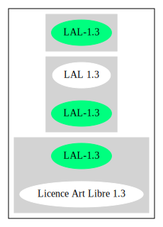

== Licence Art Libre 1.3 (LAL-1.3)

[cols=",",options="header",]
|===
|Key |Value
|Fullname |Licence Art Libre 1.3
|Shortname |LAL-1.3
|Rating |Unknown, probably Attention or Stop or No-Go
|===

=== Comments on (easy) usability

* ``It is currently unstettled whether this license is DFSG-free''
(source: https://wiki.debian.org/DFSGLicenses[Debian Free Software
Guidelines])

=== General Comments

=== URLs

* *SPDX:* http://spdx.org/licenses/LAL-1.3.json
* https://artlibre.org/

'''''

=== Raw Data

==== Facts

* https://spdx.org/licenses/LAL-1.3.html[SPDX]
* https://wiki.debian.org/DFSGLicenses[Debian Free Software Guidelines]

==== Raw JSON

....
{
    "__impliedNames": [
        "LAL-1.3",
        "Licence Art Libre 1.3"
    ],
    "__impliedId": "LAL-1.3",
    "__impliedAmbiguousNames": [
        "Licence Art Libre (Free Art License)"
    ],
    "facts": {
        "SPDX": {
            "isSPDXLicenseDeprecated": false,
            "spdxFullName": "Licence Art Libre 1.3",
            "spdxDetailsURL": "http://spdx.org/licenses/LAL-1.3.json",
            "_sourceURL": "https://spdx.org/licenses/LAL-1.3.html",
            "spdxLicIsOSIApproved": false,
            "spdxSeeAlso": [
                "https://artlibre.org/"
            ],
            "_implications": {
                "__impliedNames": [
                    "LAL-1.3",
                    "Licence Art Libre 1.3"
                ],
                "__impliedId": "LAL-1.3",
                "__isOsiApproved": false,
                "__impliedURLs": [
                    [
                        "SPDX",
                        "http://spdx.org/licenses/LAL-1.3.json"
                    ],
                    [
                        null,
                        "https://artlibre.org/"
                    ]
                ]
            },
            "spdxLicenseId": "LAL-1.3"
        },
        "Debian Free Software Guidelines": {
            "LicenseName": "Licence Art Libre (Free Art License)",
            "State": "DFSGStateUnsettled",
            "_sourceURL": "https://wiki.debian.org/DFSGLicenses",
            "_implications": {
                "__impliedNames": [
                    "LAL-1.3"
                ],
                "__impliedAmbiguousNames": [
                    "Licence Art Libre (Free Art License)"
                ],
                "__impliedJudgement": [
                    [
                        "Debian Free Software Guidelines",
                        {
                            "tag": "NeutralJudgement",
                            "contents": "It is currently unstettled whether this license is DFSG-free"
                        }
                    ]
                ]
            },
            "Comment": null,
            "LicenseId": "LAL-1.3"
        }
    },
    "__impliedJudgement": [
        [
            "Debian Free Software Guidelines",
            {
                "tag": "NeutralJudgement",
                "contents": "It is currently unstettled whether this license is DFSG-free"
            }
        ]
    ],
    "__isOsiApproved": false,
    "__impliedURLs": [
        [
            "SPDX",
            "http://spdx.org/licenses/LAL-1.3.json"
        ],
        [
            null,
            "https://artlibre.org/"
        ]
    ]
}
....

'''''

=== Dot Cluster Graph

