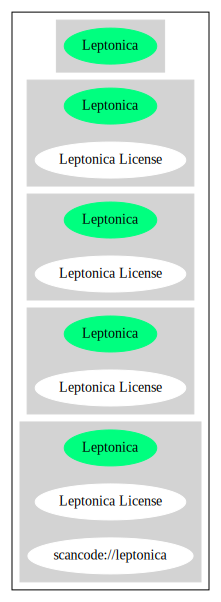

== Leptonica License (Leptonica)

[cols=",",options="header",]
|===
|Key |Value
|Fullname |Leptonica License
|Shortname |Leptonica
|Rating |Unknown, probably Stop or No-Go
|Classification |NoCopyleft
|===

*Other Names:*

* `+scancode://leptonica+`

=== Comments on (easy) usability

* **↓**``Rating is: Lead'' (source:
https://blueoakcouncil.org/list[BlueOak License List])

=== General Comments

=== URLs

* *Homepage:* https://fedoraproject.org/wiki/Licensing/Leptonica
* *SPDX:* http://spdx.org/licenses/Leptonica.json
* *SPDX:* https://spdx.org/licenses/Leptonica.html

=== Text

....
This software is distributed in the hope that it will be useful, but with NO WARRANTY OF ANY KIND.

No author or distributor accepts responsibility to anyone for the consequences of using this software, or for whether it serves any particular purpose or works at all, unless he or she says so in writing.  Everyone is granted permission to copy, modify and redistribute this source code, for commercial or non-commercial purposes, with the following restrictions: 

(1) the origin of this source code must not be misrepresented; 
(2) modified versions must be plainly marked as such; and 
(3) this notice may not be removed or altered from any source or modified source distribution.
....

'''''

=== Raw Data

....
{
    "__impliedNames": [
        "Leptonica",
        "Leptonica License",
        "scancode://leptonica"
    ],
    "__impliedId": "Leptonica",
    "facts": {
        "SPDX": {
            "isSPDXLicenseDeprecated": false,
            "spdxFullName": "Leptonica License",
            "spdxDetailsURL": "http://spdx.org/licenses/Leptonica.json",
            "_sourceURL": "https://spdx.org/licenses/Leptonica.html",
            "spdxLicIsOSIApproved": false,
            "spdxSeeAlso": [
                "https://fedoraproject.org/wiki/Licensing/Leptonica"
            ],
            "_implications": {
                "__impliedNames": [
                    "Leptonica",
                    "Leptonica License"
                ],
                "__impliedId": "Leptonica",
                "__isOsiApproved": false,
                "__impliedURLs": [
                    [
                        "SPDX",
                        "http://spdx.org/licenses/Leptonica.json"
                    ],
                    [
                        null,
                        "https://fedoraproject.org/wiki/Licensing/Leptonica"
                    ]
                ]
            },
            "spdxLicenseId": "Leptonica"
        },
        "Scancode": {
            "otherUrls": null,
            "homepageUrl": "https://fedoraproject.org/wiki/Licensing/Leptonica",
            "shortName": "Leptonica License",
            "textUrls": null,
            "text": "This software is distributed in the hope that it will be useful, but with NO WARRANTY OF ANY KIND.\n\nNo author or distributor accepts responsibility to anyone for the consequences of using this software, or for whether it serves any particular purpose or works at all, unless he or she says so in writing.  Everyone is granted permission to copy, modify and redistribute this source code, for commercial or non-commercial purposes, with the following restrictions: \n\n(1) the origin of this source code must not be misrepresented; \n(2) modified versions must be plainly marked as such; and \n(3) this notice may not be removed or altered from any source or modified source distribution.",
            "category": "Permissive",
            "osiUrl": null,
            "owner": "Leptonica",
            "_sourceURL": "https://github.com/nexB/scancode-toolkit/blob/develop/src/licensedcode/data/licenses/leptonica.yml",
            "key": "leptonica",
            "name": "Leptonica License",
            "spdxId": "Leptonica",
            "notes": null,
            "_implications": {
                "__impliedNames": [
                    "scancode://leptonica",
                    "Leptonica License",
                    "Leptonica"
                ],
                "__impliedId": "Leptonica",
                "__impliedCopyleft": [
                    [
                        "Scancode",
                        "NoCopyleft"
                    ]
                ],
                "__calculatedCopyleft": "NoCopyleft",
                "__impliedText": "This software is distributed in the hope that it will be useful, but with NO WARRANTY OF ANY KIND.\n\nNo author or distributor accepts responsibility to anyone for the consequences of using this software, or for whether it serves any particular purpose or works at all, unless he or she says so in writing.  Everyone is granted permission to copy, modify and redistribute this source code, for commercial or non-commercial purposes, with the following restrictions: \n\n(1) the origin of this source code must not be misrepresented; \n(2) modified versions must be plainly marked as such; and \n(3) this notice may not be removed or altered from any source or modified source distribution.",
                "__impliedURLs": [
                    [
                        "Homepage",
                        "https://fedoraproject.org/wiki/Licensing/Leptonica"
                    ]
                ]
            }
        },
        "BlueOak License List": {
            "BlueOakRating": "Lead",
            "url": "https://spdx.org/licenses/Leptonica.html",
            "isPermissive": true,
            "_sourceURL": "https://blueoakcouncil.org/list",
            "name": "Leptonica License",
            "id": "Leptonica",
            "_implications": {
                "__impliedNames": [
                    "Leptonica"
                ],
                "__impliedJudgement": [
                    [
                        "BlueOak License List",
                        {
                            "tag": "NegativeJudgement",
                            "contents": "Rating is: Lead"
                        }
                    ]
                ],
                "__impliedCopyleft": [
                    [
                        "BlueOak License List",
                        "NoCopyleft"
                    ]
                ],
                "__calculatedCopyleft": "NoCopyleft",
                "__impliedURLs": [
                    [
                        "SPDX",
                        "https://spdx.org/licenses/Leptonica.html"
                    ]
                ]
            }
        }
    },
    "__impliedJudgement": [
        [
            "BlueOak License List",
            {
                "tag": "NegativeJudgement",
                "contents": "Rating is: Lead"
            }
        ]
    ],
    "__impliedCopyleft": [
        [
            "BlueOak License List",
            "NoCopyleft"
        ],
        [
            "Scancode",
            "NoCopyleft"
        ]
    ],
    "__calculatedCopyleft": "NoCopyleft",
    "__isOsiApproved": false,
    "__impliedText": "This software is distributed in the hope that it will be useful, but with NO WARRANTY OF ANY KIND.\n\nNo author or distributor accepts responsibility to anyone for the consequences of using this software, or for whether it serves any particular purpose or works at all, unless he or she says so in writing.  Everyone is granted permission to copy, modify and redistribute this source code, for commercial or non-commercial purposes, with the following restrictions: \n\n(1) the origin of this source code must not be misrepresented; \n(2) modified versions must be plainly marked as such; and \n(3) this notice may not be removed or altered from any source or modified source distribution.",
    "__impliedURLs": [
        [
            "SPDX",
            "http://spdx.org/licenses/Leptonica.json"
        ],
        [
            null,
            "https://fedoraproject.org/wiki/Licensing/Leptonica"
        ],
        [
            "SPDX",
            "https://spdx.org/licenses/Leptonica.html"
        ],
        [
            "Homepage",
            "https://fedoraproject.org/wiki/Licensing/Leptonica"
        ]
    ]
}
....

'''''

=== Dot Cluster Graph

