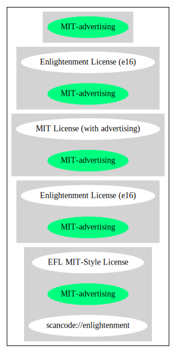

== Enlightenment License (e16) (MIT-advertising)

[cols=",",options="header",]
|===
|Key |Value
|Fullname |Enlightenment License (e16)
|Shortname |MIT-advertising
|Rating |Go
|Classification |NoCopyleft
|===

*Other Names:*

* `+scancode://enlightenment+`
* `+EFL MIT-Style License+`

=== Comments on (easy) usability

* **↑**``Rating is: Bronze'' (source:
https://blueoakcouncil.org/list[BlueOak License List])

=== General Comments

* ``Per Fedora, this license is a modified version of the common MIT
license, with an additional advertising clause that makes it
GPL-incompatible. It was originally found at
http://www.enlightenment.org/viewvc/e16/e/COPYING?revision=1.10 , but
that URL is gone (they seem to have moved source control systems). The
latest available copy from enlightment.org
http://trac.enlightenment.org/e/browser/trunk/E16/e/COPYING has been
preserved here for reference. '' (source:
https://github.com/nexB/scancode-toolkit/blob/develop/src/licensedcode/data/licenses/enlightenment.yml[Scancode])

=== URLs

* *Homepage:* http://www.enlightenment.org/
* *SPDX:* http://spdx.org/licenses/MIT-advertising.json
* *SPDX:* https://spdx.org/licenses/MIT-advertising.html
* https://fedoraproject.org/wiki/Licensing/MIT_With_Advertising

=== Text

....
Permission is hereby granted, free of charge, to any person obtaining a copy of this software and associated documentation files (the "Software"), to deal in the Software without restriction, including without limitation the rights to use, copy, modify, merge, publish, distribute, sublicense, and/or sell copies of the Software, and to permit persons to whom the Software is furnished to do so, subject to the following conditions:

The above copyright notice and this permission notice shall be included in all copies of the Software, its documentation and marketing & publicity materials, and acknowledgment shall be given in the documentation, materials and software packages that this Software was used.

THE SOFTWARE IS PROVIDED "AS IS", WITHOUT WARRANTY OF ANY KIND, EXPRESS OR IMPLIED, INCLUDING BUT NOT LIMITED TO THE WARRANTIES OF MERCHANTABILITY, FITNESS FOR A PARTICULAR PURPOSE AND NONINFRINGEMENT. IN NO EVENT SHALL THE AUTHORS BE LIABLE FOR ANY CLAIM, DAMAGES OR OTHER LIABILITY, WHETHER IN AN ACTION OF CONTRACT, TORT OR OTHERWISE, ARISING FROM, OUT OF OR IN CONNECTION WITH THE SOFTWARE OR THE USE OR OTHER DEALINGS IN THE SOFTWARE.
....

'''''

=== Raw Data

....
{
    "__impliedNames": [
        "MIT-advertising",
        "Enlightenment License (e16)",
        "scancode://enlightenment",
        "EFL MIT-Style License"
    ],
    "__impliedId": "MIT-advertising",
    "__impliedComments": [
        [
            "Scancode",
            [
                "Per Fedora, this license is a modified version of the common MIT license,\nwith an additional advertising clause that makes it GPL-incompatible. It\nwas originally found at\nhttp://www.enlightenment.org/viewvc/e16/e/COPYING?revision=1.10 , but that\nURL is gone (they seem to have moved source control systems). The latest\navailable copy from enlightment.org\nhttp://trac.enlightenment.org/e/browser/trunk/E16/e/COPYING has been\npreserved here for reference.\n"
            ]
        ]
    ],
    "facts": {
        "SPDX": {
            "isSPDXLicenseDeprecated": false,
            "spdxFullName": "Enlightenment License (e16)",
            "spdxDetailsURL": "http://spdx.org/licenses/MIT-advertising.json",
            "_sourceURL": "https://spdx.org/licenses/MIT-advertising.html",
            "spdxLicIsOSIApproved": false,
            "spdxSeeAlso": [
                "https://fedoraproject.org/wiki/Licensing/MIT_With_Advertising"
            ],
            "_implications": {
                "__impliedNames": [
                    "MIT-advertising",
                    "Enlightenment License (e16)"
                ],
                "__impliedId": "MIT-advertising",
                "__isOsiApproved": false,
                "__impliedURLs": [
                    [
                        "SPDX",
                        "http://spdx.org/licenses/MIT-advertising.json"
                    ],
                    [
                        null,
                        "https://fedoraproject.org/wiki/Licensing/MIT_With_Advertising"
                    ]
                ]
            },
            "spdxLicenseId": "MIT-advertising"
        },
        "Scancode": {
            "otherUrls": null,
            "homepageUrl": "http://www.enlightenment.org/",
            "shortName": "EFL MIT-Style License",
            "textUrls": null,
            "text": "Permission is hereby granted, free of charge, to any person obtaining a copy of this software and associated documentation files (the \"Software\"), to deal in the Software without restriction, including without limitation the rights to use, copy, modify, merge, publish, distribute, sublicense, and/or sell copies of the Software, and to permit persons to whom the Software is furnished to do so, subject to the following conditions:\n\nThe above copyright notice and this permission notice shall be included in all copies of the Software, its documentation and marketing & publicity materials, and acknowledgment shall be given in the documentation, materials and software packages that this Software was used.\n\nTHE SOFTWARE IS PROVIDED \"AS IS\", WITHOUT WARRANTY OF ANY KIND, EXPRESS OR IMPLIED, INCLUDING BUT NOT LIMITED TO THE WARRANTIES OF MERCHANTABILITY, FITNESS FOR A PARTICULAR PURPOSE AND NONINFRINGEMENT. IN NO EVENT SHALL THE AUTHORS BE LIABLE FOR ANY CLAIM, DAMAGES OR OTHER LIABILITY, WHETHER IN AN ACTION OF CONTRACT, TORT OR OTHERWISE, ARISING FROM, OUT OF OR IN CONNECTION WITH THE SOFTWARE OR THE USE OR OTHER DEALINGS IN THE SOFTWARE.\n",
            "category": "Permissive",
            "osiUrl": null,
            "owner": "Enlightenment",
            "_sourceURL": "https://github.com/nexB/scancode-toolkit/blob/develop/src/licensedcode/data/licenses/enlightenment.yml",
            "key": "enlightenment",
            "name": "Enlightenment (EFL) MIT-Style License",
            "spdxId": "MIT-advertising",
            "notes": "Per Fedora, this license is a modified version of the common MIT license,\nwith an additional advertising clause that makes it GPL-incompatible. It\nwas originally found at\nhttp://www.enlightenment.org/viewvc/e16/e/COPYING?revision=1.10 , but that\nURL is gone (they seem to have moved source control systems). The latest\navailable copy from enlightment.org\nhttp://trac.enlightenment.org/e/browser/trunk/E16/e/COPYING has been\npreserved here for reference.\n",
            "_implications": {
                "__impliedNames": [
                    "scancode://enlightenment",
                    "EFL MIT-Style License",
                    "MIT-advertising"
                ],
                "__impliedId": "MIT-advertising",
                "__impliedComments": [
                    [
                        "Scancode",
                        [
                            "Per Fedora, this license is a modified version of the common MIT license,\nwith an additional advertising clause that makes it GPL-incompatible. It\nwas originally found at\nhttp://www.enlightenment.org/viewvc/e16/e/COPYING?revision=1.10 , but that\nURL is gone (they seem to have moved source control systems). The latest\navailable copy from enlightment.org\nhttp://trac.enlightenment.org/e/browser/trunk/E16/e/COPYING has been\npreserved here for reference.\n"
                        ]
                    ]
                ],
                "__impliedCopyleft": [
                    [
                        "Scancode",
                        "NoCopyleft"
                    ]
                ],
                "__calculatedCopyleft": "NoCopyleft",
                "__impliedText": "Permission is hereby granted, free of charge, to any person obtaining a copy of this software and associated documentation files (the \"Software\"), to deal in the Software without restriction, including without limitation the rights to use, copy, modify, merge, publish, distribute, sublicense, and/or sell copies of the Software, and to permit persons to whom the Software is furnished to do so, subject to the following conditions:\n\nThe above copyright notice and this permission notice shall be included in all copies of the Software, its documentation and marketing & publicity materials, and acknowledgment shall be given in the documentation, materials and software packages that this Software was used.\n\nTHE SOFTWARE IS PROVIDED \"AS IS\", WITHOUT WARRANTY OF ANY KIND, EXPRESS OR IMPLIED, INCLUDING BUT NOT LIMITED TO THE WARRANTIES OF MERCHANTABILITY, FITNESS FOR A PARTICULAR PURPOSE AND NONINFRINGEMENT. IN NO EVENT SHALL THE AUTHORS BE LIABLE FOR ANY CLAIM, DAMAGES OR OTHER LIABILITY, WHETHER IN AN ACTION OF CONTRACT, TORT OR OTHERWISE, ARISING FROM, OUT OF OR IN CONNECTION WITH THE SOFTWARE OR THE USE OR OTHER DEALINGS IN THE SOFTWARE.\n",
                "__impliedURLs": [
                    [
                        "Homepage",
                        "http://www.enlightenment.org/"
                    ]
                ]
            }
        },
        "BlueOak License List": {
            "BlueOakRating": "Bronze",
            "url": "https://spdx.org/licenses/MIT-advertising.html",
            "isPermissive": true,
            "_sourceURL": "https://blueoakcouncil.org/list",
            "name": "Enlightenment License (e16)",
            "id": "MIT-advertising",
            "_implications": {
                "__impliedNames": [
                    "MIT-advertising",
                    "Enlightenment License (e16)"
                ],
                "__impliedJudgement": [
                    [
                        "BlueOak License List",
                        {
                            "tag": "PositiveJudgement",
                            "contents": "Rating is: Bronze"
                        }
                    ]
                ],
                "__impliedCopyleft": [
                    [
                        "BlueOak License List",
                        "NoCopyleft"
                    ]
                ],
                "__calculatedCopyleft": "NoCopyleft",
                "__impliedURLs": [
                    [
                        "SPDX",
                        "https://spdx.org/licenses/MIT-advertising.html"
                    ]
                ]
            }
        }
    },
    "__impliedJudgement": [
        [
            "BlueOak License List",
            {
                "tag": "PositiveJudgement",
                "contents": "Rating is: Bronze"
            }
        ]
    ],
    "__impliedCopyleft": [
        [
            "BlueOak License List",
            "NoCopyleft"
        ],
        [
            "Scancode",
            "NoCopyleft"
        ]
    ],
    "__calculatedCopyleft": "NoCopyleft",
    "__isOsiApproved": false,
    "__impliedText": "Permission is hereby granted, free of charge, to any person obtaining a copy of this software and associated documentation files (the \"Software\"), to deal in the Software without restriction, including without limitation the rights to use, copy, modify, merge, publish, distribute, sublicense, and/or sell copies of the Software, and to permit persons to whom the Software is furnished to do so, subject to the following conditions:\n\nThe above copyright notice and this permission notice shall be included in all copies of the Software, its documentation and marketing & publicity materials, and acknowledgment shall be given in the documentation, materials and software packages that this Software was used.\n\nTHE SOFTWARE IS PROVIDED \"AS IS\", WITHOUT WARRANTY OF ANY KIND, EXPRESS OR IMPLIED, INCLUDING BUT NOT LIMITED TO THE WARRANTIES OF MERCHANTABILITY, FITNESS FOR A PARTICULAR PURPOSE AND NONINFRINGEMENT. IN NO EVENT SHALL THE AUTHORS BE LIABLE FOR ANY CLAIM, DAMAGES OR OTHER LIABILITY, WHETHER IN AN ACTION OF CONTRACT, TORT OR OTHERWISE, ARISING FROM, OUT OF OR IN CONNECTION WITH THE SOFTWARE OR THE USE OR OTHER DEALINGS IN THE SOFTWARE.\n",
    "__impliedURLs": [
        [
            "SPDX",
            "http://spdx.org/licenses/MIT-advertising.json"
        ],
        [
            null,
            "https://fedoraproject.org/wiki/Licensing/MIT_With_Advertising"
        ],
        [
            "SPDX",
            "https://spdx.org/licenses/MIT-advertising.html"
        ],
        [
            "Homepage",
            "http://www.enlightenment.org/"
        ]
    ]
}
....

'''''

=== Dot Cluster Graph

