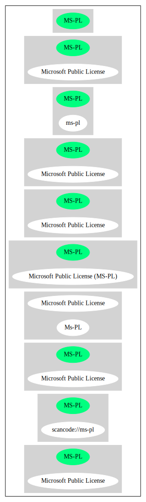

== Microsoft Public License (MS-PL)

[cols=",",options="header",]
|===
|Key |Value
|Fullname |Microsoft Public License
|Shortname |MS-PL
|Rating |Unknown, probably Attention or Stop or No-Go
|Classification |MaybeCopyleft
|Has Patent Hint |True
|===

*Other Names:*

* `+scancode://ms-pl+`
* `+Microsoft Public License (MS-PL)+`
* `+Microsoft Public License (Ms-PL)+`

=== Description

____
An open source license with a patent grant.
____

(source: choosealicense.com)

=== Comments on (easy) usability

* **↑**``Google Classification is NOTICE'' (source:
https://opensource.google.com/docs/thirdparty/licenses/[Google OSS
Policy])
* **↑**``Is OSI Approved'' (source:
https://spdx.org/licenses/MS-PL.html[SPDX])
* **↑**``Rating is: Silver'' (source:
https://blueoakcouncil.org/list[BlueOak License List])
* **↑**``This software Licenses is OK for Fedora'' (source:
https://fedoraproject.org/wiki/Licensing:Main?rd=Licensing[Fedora
Project Wiki])

=== General Comments

* ``also known as Microsoft Permissive License (Ms-PL) v1.1'' (source:
https://github.com/nexB/scancode-toolkit/blob/develop/src/licensedcode/data/licenses/ms-pl.yml[Scancode])
* ``Lizenzen ohne Copyleft-Effekt zeichnen sich dadurch aus, dass sie
dem Lizenznehmer alle Freiheiten einer Open Source Lizenz einräumen und
für Veränderungen der Software keine Bedingungen hinsichtlich des zu
verwendenden Lizenztyps enthalten. Damit kann der Lizenznehmer
veränderte Versionen der Software unter beliebigen Lizenzbedingungen
weiterverbreiten, also auch in proprietäre Software überführen.''
(source: https://ifross.github.io/ifrOSS/Lizenzcenter[ifrOSS])

=== Obligations

[cols=",,",options="header",]
|===
|Rights: |Conditions: |Limitations:
a|
* commercial-use
* modifications
* distribution
* patent-use
* private-use

a|
* include-copyright

a|
* warranty
* trademark-use

|===

(source:
https://github.com/github/choosealicense.com/blob/gh-pages/_licenses/ms-pl.txt[choosealicense.com])

=== URLs

* *Homepage:* http://www.microsoft.com/opensource/licenses.mspx#Ms-PL
* *OSI Page:* http://www.opensource.org/licenses/ms-pl.html
* *OSI Page:* https://opensource.org/licenses/MS-PL
* *SPDX:* http://spdx.org/licenses/MS-PL.json
* *SPDX:* https://spdx.org/licenses/MS-PL.html
* http://www.microsoft.com/opensource/licenses.mspx
* http://www.microsoft.com/en-us/openness/licenses.aspx#MPL
* http://www.opensource.org/licenses/MS-PL
* https://web.archive.org/web/20080104234143/http://www.microsoft.com:80/resources/sharedsource/licensingbasics/publiclicense.mspx
(Einordnung unklar)

=== OSADL Rule

....
USE CASE Source code delivery
	YOU MUST Grant License
	YOU MUST Forward Copyright notices
	YOU MUST Forward Patent notices
	YOU MUST Forward Trademark notices
	YOU MUST Forward License text
	YOU MUST Use Original license
USE CASE Binary delivery
	YOU MUST Grant License
	YOU MUST Forward Copyright notices
	YOU MUST Forward Patent notices
	YOU MUST Forward Trademark notices
	YOU MUST Use Compatible license
PATENT HINTS Yes
COPYLEFT CLAUSE Questionable
....

(source: OSADL License Checklist)

=== Text

....
Microsoft Public License (Ms-PL)

This license governs use of the accompanying software. If you use the software,
you accept this license. If you do not accept the license, do not use the
software.

1. Definitions

The terms "reproduce," "reproduction," "derivative works," and "distribution"
have the same meaning here as under U.S. copyright law.

A "contribution" is the original software, or any additions or changes to the
software.

A "contributor" is any person that distributes its contribution under this
license.

"Licensed patents" are a contributor's patent claims that read directly on its
contribution.

2. Grant of Rights

(A) Copyright Grant- Subject to the terms of this license, including the license
conditions and limitations in section 3, each contributor grants you a non-
exclusive, worldwide, royalty-free copyright license to reproduce its
contribution, prepare derivative works of its contribution, and distribute its
contribution or any derivative works that you create.

(B) Patent Grant- Subject to the terms of this license, including the license
conditions and limitations in section 3, each contributor grants you a non-
exclusive, worldwide, royalty-free license under its licensed patents to make,
have made, use, sell, offer for sale, import, and/or otherwise dispose of its
contribution in the software or derivative works of the contribution in the
software.

3. Conditions and Limitations

(A) No Trademark License- This license does not grant you rights to use any
contributors' name, logo, or trademarks.

(B) If you bring a patent claim against any contributor over patents that you
claim are infringed by the software, your patent license from such contributor
to the software ends automatically.

(C) If you distribute any portion of the software, you must retain all
copyright, patent, trademark, and attribution notices that are present in the
software.

(D) If you distribute any portion of the software in source code form, you may
do so only under this license by including a complete copy of this license with
your distribution. If you distribute any portion of the software in compiled or
object code form, you may only do so under a license that complies with this
license.

(E) The software is licensed "as-is." You bear the risk of using it. The
contributors give no express warranties, guarantees, or conditions. You may have
additional consumer rights under your local laws which this license cannot
change. To the extent permitted under your local laws, the contributors exclude
the implied warranties of merchantability, fitness for a particular purpose and
non-infringement.
....

'''''

=== Raw Data

....
{
    "__impliedNames": [
        "MS-PL",
        "Microsoft Public License",
        "scancode://ms-pl",
        "ms-pl",
        "Microsoft Public License (MS-PL)",
        "Ms-PL",
        "Microsoft Public License (Ms-PL)"
    ],
    "__impliedId": "MS-PL",
    "__isFsfFree": true,
    "__impliedComments": [
        [
            "Scancode",
            [
                "also known as Microsoft Permissive License (Ms-PL) v1.1"
            ]
        ],
        [
            "ifrOSS",
            [
                "Lizenzen ohne Copyleft-Effekt zeichnen sich dadurch aus, dass sie dem Lizenznehmer alle Freiheiten einer Open Source Lizenz einräumen und für Veränderungen der Software keine Bedingungen hinsichtlich des zu verwendenden Lizenztyps enthalten. Damit kann der Lizenznehmer veränderte Versionen der Software unter beliebigen Lizenzbedingungen weiterverbreiten, also auch in proprietäre Software überführen."
            ]
        ]
    ],
    "__hasPatentHint": true,
    "facts": {
        "Open Knowledge International": {
            "is_generic": null,
            "status": "active",
            "domain_software": true,
            "url": "https://opensource.org/licenses/MS-PL",
            "maintainer": "Microsoft Corporation",
            "od_conformance": "not reviewed",
            "_sourceURL": "https://github.com/okfn/licenses/blob/master/licenses.csv",
            "domain_data": false,
            "osd_conformance": "approved",
            "id": "MS-PL",
            "title": "Microsoft Public License",
            "_implications": {
                "__impliedNames": [
                    "MS-PL",
                    "Microsoft Public License"
                ],
                "__impliedId": "MS-PL",
                "__impliedURLs": [
                    [
                        null,
                        "https://opensource.org/licenses/MS-PL"
                    ]
                ]
            },
            "domain_content": false
        },
        "SPDX": {
            "isSPDXLicenseDeprecated": false,
            "spdxFullName": "Microsoft Public License",
            "spdxDetailsURL": "http://spdx.org/licenses/MS-PL.json",
            "_sourceURL": "https://spdx.org/licenses/MS-PL.html",
            "spdxLicIsOSIApproved": true,
            "spdxSeeAlso": [
                "http://www.microsoft.com/opensource/licenses.mspx",
                "https://opensource.org/licenses/MS-PL"
            ],
            "_implications": {
                "__impliedNames": [
                    "MS-PL",
                    "Microsoft Public License"
                ],
                "__impliedId": "MS-PL",
                "__impliedJudgement": [
                    [
                        "SPDX",
                        {
                            "tag": "PositiveJudgement",
                            "contents": "Is OSI Approved"
                        }
                    ]
                ],
                "__isOsiApproved": true,
                "__impliedURLs": [
                    [
                        "SPDX",
                        "http://spdx.org/licenses/MS-PL.json"
                    ],
                    [
                        null,
                        "http://www.microsoft.com/opensource/licenses.mspx"
                    ],
                    [
                        null,
                        "https://opensource.org/licenses/MS-PL"
                    ]
                ]
            },
            "spdxLicenseId": "MS-PL"
        },
        "OSADL License Checklist": {
            "_sourceURL": "https://www.osadl.org/fileadmin/checklists/unreflicenses/MS-PL.txt",
            "spdxId": "MS-PL",
            "osadlRule": "USE CASE Source code delivery\r\n\tYOU MUST Grant License\n\tYOU MUST Forward Copyright notices\n\tYOU MUST Forward Patent notices\n\tYOU MUST Forward Trademark notices\n\tYOU MUST Forward License text\n\tYOU MUST Use Original license\nUSE CASE Binary delivery\r\n\tYOU MUST Grant License\n\tYOU MUST Forward Copyright notices\n\tYOU MUST Forward Patent notices\n\tYOU MUST Forward Trademark notices\n\tYOU MUST Use Compatible license\nPATENT HINTS Yes\nCOPYLEFT CLAUSE Questionable\n",
            "_implications": {
                "__impliedNames": [
                    "MS-PL"
                ],
                "__hasPatentHint": true,
                "__impliedCopyleft": [
                    [
                        "OSADL License Checklist",
                        "MaybeCopyleft"
                    ]
                ],
                "__calculatedCopyleft": "MaybeCopyleft"
            }
        },
        "Fedora Project Wiki": {
            "GPLv2 Compat?": "NO",
            "rating": "Good",
            "Upstream URL": "http://www.microsoft.com/opensource/licenses.mspx#Ms-PL",
            "GPLv3 Compat?": "NO",
            "Short Name": "MS-PL",
            "licenseType": "license",
            "_sourceURL": "https://fedoraproject.org/wiki/Licensing:Main?rd=Licensing",
            "Full Name": "Microsoft Public License",
            "FSF Free?": "Yes",
            "_implications": {
                "__impliedNames": [
                    "Microsoft Public License"
                ],
                "__isFsfFree": true,
                "__impliedJudgement": [
                    [
                        "Fedora Project Wiki",
                        {
                            "tag": "PositiveJudgement",
                            "contents": "This software Licenses is OK for Fedora"
                        }
                    ]
                ]
            }
        },
        "Scancode": {
            "otherUrls": [
                "http://www.microsoft.com/en-us/openness/licenses.aspx#MPL",
                "http://www.microsoft.com/opensource/licenses.mspx",
                "http://www.opensource.org/licenses/MS-PL",
                "https://opensource.org/licenses/MS-PL"
            ],
            "homepageUrl": "http://www.microsoft.com/opensource/licenses.mspx#Ms-PL",
            "shortName": "MS-PL",
            "textUrls": null,
            "text": "Microsoft Public License (Ms-PL)\n\nThis license governs use of the accompanying software. If you use the software,\nyou accept this license. If you do not accept the license, do not use the\nsoftware.\n\n1. Definitions\n\nThe terms \"reproduce,\" \"reproduction,\" \"derivative works,\" and \"distribution\"\nhave the same meaning here as under U.S. copyright law.\n\nA \"contribution\" is the original software, or any additions or changes to the\nsoftware.\n\nA \"contributor\" is any person that distributes its contribution under this\nlicense.\n\n\"Licensed patents\" are a contributor's patent claims that read directly on its\ncontribution.\n\n2. Grant of Rights\n\n(A) Copyright Grant- Subject to the terms of this license, including the license\nconditions and limitations in section 3, each contributor grants you a non-\nexclusive, worldwide, royalty-free copyright license to reproduce its\ncontribution, prepare derivative works of its contribution, and distribute its\ncontribution or any derivative works that you create.\n\n(B) Patent Grant- Subject to the terms of this license, including the license\nconditions and limitations in section 3, each contributor grants you a non-\nexclusive, worldwide, royalty-free license under its licensed patents to make,\nhave made, use, sell, offer for sale, import, and/or otherwise dispose of its\ncontribution in the software or derivative works of the contribution in the\nsoftware.\n\n3. Conditions and Limitations\n\n(A) No Trademark License- This license does not grant you rights to use any\ncontributors' name, logo, or trademarks.\n\n(B) If you bring a patent claim against any contributor over patents that you\nclaim are infringed by the software, your patent license from such contributor\nto the software ends automatically.\n\n(C) If you distribute any portion of the software, you must retain all\ncopyright, patent, trademark, and attribution notices that are present in the\nsoftware.\n\n(D) If you distribute any portion of the software in source code form, you may\ndo so only under this license by including a complete copy of this license with\nyour distribution. If you distribute any portion of the software in compiled or\nobject code form, you may only do so under a license that complies with this\nlicense.\n\n(E) The software is licensed \"as-is.\" You bear the risk of using it. The\ncontributors give no express warranties, guarantees, or conditions. You may have\nadditional consumer rights under your local laws which this license cannot\nchange. To the extent permitted under your local laws, the contributors exclude\nthe implied warranties of merchantability, fitness for a particular purpose and\nnon-infringement.",
            "category": "Permissive",
            "osiUrl": "http://www.opensource.org/licenses/ms-pl.html",
            "owner": "Microsoft",
            "_sourceURL": "https://github.com/nexB/scancode-toolkit/blob/develop/src/licensedcode/data/licenses/ms-pl.yml",
            "key": "ms-pl",
            "name": "Microsoft Public License",
            "spdxId": "MS-PL",
            "notes": "also known as Microsoft Permissive License (Ms-PL) v1.1",
            "_implications": {
                "__impliedNames": [
                    "scancode://ms-pl",
                    "MS-PL",
                    "MS-PL"
                ],
                "__impliedId": "MS-PL",
                "__impliedComments": [
                    [
                        "Scancode",
                        [
                            "also known as Microsoft Permissive License (Ms-PL) v1.1"
                        ]
                    ]
                ],
                "__impliedCopyleft": [
                    [
                        "Scancode",
                        "NoCopyleft"
                    ]
                ],
                "__calculatedCopyleft": "NoCopyleft",
                "__impliedText": "Microsoft Public License (Ms-PL)\n\nThis license governs use of the accompanying software. If you use the software,\nyou accept this license. If you do not accept the license, do not use the\nsoftware.\n\n1. Definitions\n\nThe terms \"reproduce,\" \"reproduction,\" \"derivative works,\" and \"distribution\"\nhave the same meaning here as under U.S. copyright law.\n\nA \"contribution\" is the original software, or any additions or changes to the\nsoftware.\n\nA \"contributor\" is any person that distributes its contribution under this\nlicense.\n\n\"Licensed patents\" are a contributor's patent claims that read directly on its\ncontribution.\n\n2. Grant of Rights\n\n(A) Copyright Grant- Subject to the terms of this license, including the license\nconditions and limitations in section 3, each contributor grants you a non-\nexclusive, worldwide, royalty-free copyright license to reproduce its\ncontribution, prepare derivative works of its contribution, and distribute its\ncontribution or any derivative works that you create.\n\n(B) Patent Grant- Subject to the terms of this license, including the license\nconditions and limitations in section 3, each contributor grants you a non-\nexclusive, worldwide, royalty-free license under its licensed patents to make,\nhave made, use, sell, offer for sale, import, and/or otherwise dispose of its\ncontribution in the software or derivative works of the contribution in the\nsoftware.\n\n3. Conditions and Limitations\n\n(A) No Trademark License- This license does not grant you rights to use any\ncontributors' name, logo, or trademarks.\n\n(B) If you bring a patent claim against any contributor over patents that you\nclaim are infringed by the software, your patent license from such contributor\nto the software ends automatically.\n\n(C) If you distribute any portion of the software, you must retain all\ncopyright, patent, trademark, and attribution notices that are present in the\nsoftware.\n\n(D) If you distribute any portion of the software in source code form, you may\ndo so only under this license by including a complete copy of this license with\nyour distribution. If you distribute any portion of the software in compiled or\nobject code form, you may only do so under a license that complies with this\nlicense.\n\n(E) The software is licensed \"as-is.\" You bear the risk of using it. The\ncontributors give no express warranties, guarantees, or conditions. You may have\nadditional consumer rights under your local laws which this license cannot\nchange. To the extent permitted under your local laws, the contributors exclude\nthe implied warranties of merchantability, fitness for a particular purpose and\nnon-infringement.",
                "__impliedURLs": [
                    [
                        "Homepage",
                        "http://www.microsoft.com/opensource/licenses.mspx#Ms-PL"
                    ],
                    [
                        "OSI Page",
                        "http://www.opensource.org/licenses/ms-pl.html"
                    ],
                    [
                        null,
                        "http://www.microsoft.com/en-us/openness/licenses.aspx#MPL"
                    ],
                    [
                        null,
                        "http://www.microsoft.com/opensource/licenses.mspx"
                    ],
                    [
                        null,
                        "http://www.opensource.org/licenses/MS-PL"
                    ],
                    [
                        null,
                        "https://opensource.org/licenses/MS-PL"
                    ]
                ]
            }
        },
        "OpenChainPolicyTemplate": {
            "isSaaSDeemed": "no",
            "licenseType": "copyleft",
            "freedomOrDeath": "no",
            "typeCopyleft": "weak",
            "_sourceURL": "https://github.com/OpenChain-Project/curriculum/raw/ddf1e879341adbd9b297cd67c5d5c16b2076540b/policy-template/Open%20Source%20Policy%20Template%20for%20OpenChain%20Specification%201.2.ods",
            "name": "Microsoft Public License",
            "commercialUse": true,
            "spdxId": "MS-PL",
            "_implications": {
                "__impliedNames": [
                    "MS-PL"
                ]
            }
        },
        "BlueOak License List": {
            "BlueOakRating": "Silver",
            "url": "https://spdx.org/licenses/MS-PL.html",
            "isPermissive": true,
            "_sourceURL": "https://blueoakcouncil.org/list",
            "name": "Microsoft Public License",
            "id": "MS-PL",
            "_implications": {
                "__impliedNames": [
                    "MS-PL",
                    "Microsoft Public License"
                ],
                "__impliedJudgement": [
                    [
                        "BlueOak License List",
                        {
                            "tag": "PositiveJudgement",
                            "contents": "Rating is: Silver"
                        }
                    ]
                ],
                "__impliedCopyleft": [
                    [
                        "BlueOak License List",
                        "NoCopyleft"
                    ]
                ],
                "__calculatedCopyleft": "NoCopyleft",
                "__impliedURLs": [
                    [
                        "SPDX",
                        "https://spdx.org/licenses/MS-PL.html"
                    ]
                ]
            }
        },
        "ifrOSS": {
            "ifrKind": "IfrNoCopyleft",
            "ifrURL": "https://web.archive.org/web/20080104234143/http://www.microsoft.com:80/resources/sharedsource/licensingbasics/publiclicense.mspx (Einordnung unklar)",
            "_sourceURL": "https://ifross.github.io/ifrOSS/Lizenzcenter",
            "ifrName": "Microsoft Public License (Ms-PL)",
            "ifrId": null,
            "_implications": {
                "__impliedNames": [
                    "Microsoft Public License (Ms-PL)"
                ],
                "__impliedComments": [
                    [
                        "ifrOSS",
                        [
                            "Lizenzen ohne Copyleft-Effekt zeichnen sich dadurch aus, dass sie dem Lizenznehmer alle Freiheiten einer Open Source Lizenz einräumen und für Veränderungen der Software keine Bedingungen hinsichtlich des zu verwendenden Lizenztyps enthalten. Damit kann der Lizenznehmer veränderte Versionen der Software unter beliebigen Lizenzbedingungen weiterverbreiten, also auch in proprietäre Software überführen."
                        ]
                    ]
                ],
                "__impliedCopyleft": [
                    [
                        "ifrOSS",
                        "NoCopyleft"
                    ]
                ],
                "__calculatedCopyleft": "NoCopyleft",
                "__impliedURLs": [
                    [
                        null,
                        "https://web.archive.org/web/20080104234143/http://www.microsoft.com:80/resources/sharedsource/licensingbasics/publiclicense.mspx (Einordnung unklar)"
                    ]
                ]
            }
        },
        "OpenSourceInitiative": {
            "text": [
                {
                    "url": "https://opensource.org/licenses/MS-PL",
                    "title": "HTML",
                    "media_type": "text/html"
                }
            ],
            "identifiers": [
                {
                    "identifier": "MS-PL",
                    "scheme": "SPDX"
                }
            ],
            "superseded_by": null,
            "_sourceURL": "https://opensource.org/licenses/",
            "name": "Microsoft Public License (MS-PL)",
            "other_names": [],
            "keywords": [
                "osi-approved"
            ],
            "id": "MS-PL",
            "links": [
                {
                    "note": "OSI Page",
                    "url": "https://opensource.org/licenses/MS-PL"
                }
            ],
            "_implications": {
                "__impliedNames": [
                    "MS-PL",
                    "Microsoft Public License (MS-PL)",
                    "MS-PL"
                ],
                "__impliedURLs": [
                    [
                        "OSI Page",
                        "https://opensource.org/licenses/MS-PL"
                    ]
                ]
            }
        },
        "Wikipedia": {
            "Distribution": {
                "value": "Permissive",
                "description": "distribution of the code to third parties"
            },
            "Linking": {
                "value": "Permissive",
                "description": "linking of the licensed code with code licensed under a different license (e.g. when the code is provided as a library)"
            },
            "Publication date": null,
            "_sourceURL": "https://en.wikipedia.org/wiki/Comparison_of_free_and_open-source_software_licenses",
            "Koordinaten": {
                "name": "Microsoft Public License",
                "version": null,
                "spdxId": "MS-PL"
            },
            "Patent grant": {
                "value": "No",
                "description": "protection of licensees from patent claims made by code contributors regarding their contribution, and protection of contributors from patent claims made by licensees"
            },
            "Trademark grant": {
                "value": "No",
                "description": "use of trademarks associated with the licensed code or its contributors by a licensee"
            },
            "_implications": {
                "__impliedNames": [
                    "MS-PL",
                    "Microsoft Public License"
                ],
                "__hasPatentHint": false
            },
            "Private use": {
                "value": "Permissive",
                "description": "whether modification to the code must be shared with the community or may be used privately (e.g. internal use by a corporation)"
            },
            "Modification": {
                "value": "Permissive",
                "description": "modification of the code by a licensee"
            }
        },
        "finos-osr/OSLC-handbook": {
            "terms": [
                {
                    "termUseCases": [
                        "US",
                        "MS"
                    ],
                    "termSeeAlso": null,
                    "termDescription": "Provide copy of license",
                    "termComplianceNotes": "Include a complete copy of license with source code distributions",
                    "termType": "condition"
                },
                {
                    "termUseCases": [
                        "UB",
                        "MB",
                        "US",
                        "MS"
                    ],
                    "termSeeAlso": null,
                    "termDescription": "Retain all notices",
                    "termComplianceNotes": "Retain all notices present in software",
                    "termType": "condition"
                },
                {
                    "termUseCases": [
                        "US",
                        "MS"
                    ],
                    "termSeeAlso": null,
                    "termDescription": "Source code under same license",
                    "termComplianceNotes": "Distributions of \"any portion of the software in source code form\" must be under this license",
                    "termType": "condition"
                },
                {
                    "termUseCases": [
                        "UB",
                        "MB"
                    ],
                    "termSeeAlso": null,
                    "termDescription": "Comply with this license",
                    "termComplianceNotes": "Object or compiled code distributions must be under a license that complies with this license",
                    "termType": "condition"
                },
                {
                    "termUseCases": null,
                    "termSeeAlso": null,
                    "termDescription": "Any patent claims by licensee against any contributor accusing the software result in termination of all patent licenses from that contributor",
                    "termComplianceNotes": null,
                    "termType": "termination"
                }
            ],
            "_sourceURL": "https://github.com/finos-osr/OSLC-handbook/blob/master/src/Ms-PL.yaml",
            "name": "Microsoft Public License",
            "nameFromFilename": "Ms-PL",
            "notes": null,
            "_implications": {
                "__impliedNames": [
                    "Ms-PL",
                    "Microsoft Public License"
                ]
            },
            "licenseId": [
                "Ms-PL",
                "Microsoft Public License"
            ]
        },
        "choosealicense.com": {
            "limitations": [
                "warranty",
                "trademark-use"
            ],
            "_sourceURL": "https://github.com/github/choosealicense.com/blob/gh-pages/_licenses/ms-pl.txt",
            "content": "---\ntitle: Microsoft Public License\nspdx-id: MS-PL\n\ndescription: An open source license with a patent grant.\n\nhow: Create a text file (typically named LICENSE or LICENSE.txt) in the root of your source code and copy the text of the license into the file.\n\nusing:\n\npermissions:\n  - commercial-use\n  - modifications\n  - distribution\n  - patent-use\n  - private-use\n\nconditions:\n  - include-copyright\n\nlimitations:\n  - warranty\n  - trademark-use\n\n---\n\nMicrosoft Public License (Ms-PL)\n\nThis license governs use of the accompanying software. If you use the\nsoftware, you accept this license. If you do not accept the license, do not\nuse the software.\n\n1.  Definitions\nThe terms \"reproduce,\" \"reproduction,\" \"derivative works,\" and \"distribution\"\nhave the same meaning here as under U.S. copyright law. A \"contribution\" is\nthe original software, or any additions or changes to the software. A\n\"contributor\" is any person that distributes its contribution under this\nlicense. \"Licensed patents\" are a contributor's patent claims that read\ndirectly on its contribution.\n\n2.  Grant of Rights\n     (A) Copyright Grant- Subject to the terms of this license, including the\n     license conditions and limitations in section 3, each contributor grants\n     you a non-exclusive, worldwide, royalty-free copyright license to\n     reproduce its contribution, prepare derivative works of its contribution,\n     and distribute its contribution or any derivative works that you create.\n\n     (B) Patent Grant- Subject to the terms of this license, including the\n     license conditions and limitations in section 3, each contributor grants\n     you a non-exclusive, worldwide, royalty-free license under its licensed\n     patents to make, have made, use, sell, offer for sale, import, and/or\n     otherwise dispose of its contribution in the software or derivative works\n     of the contribution in the software.\n\n3.  Conditions and Limitations\n     (A) No Trademark License- This license does not grant you rights to use\n     any contributors' name, logo, or trademarks.\n\n     (B) If you bring a patent claim against any contributor over patents that\n     you claim are infringed by the software, your patent license from such\n     contributor to the software ends automatically.\n\n     (C) If you distribute any portion of the software, you must retain all\n     copyright, patent, trademark, and attribution notices that are present in\n     the software.\n\n     (D) If you distribute any portion of the software in source code form,\n     you may do so only under this license by including a complete copy of\n     this license with your distribution. If you distribute any portion of the\n     software in compiled or object code form, you may only do so under a\n     license that complies with this license.\n\n     (E) The software is licensed \"as-is.\" You bear the risk of using it. The\n     contributors give no express warranties, guarantees, or conditions. You\n     may have additional consumer rights under your local laws which this\n     license cannot change. To the extent permitted under your local laws, the\n     contributors exclude the implied warranties of merchantability, fitness\n     for a particular purpose and non-infringement.\n",
            "name": "ms-pl",
            "hidden": null,
            "spdxId": "MS-PL",
            "conditions": [
                "include-copyright"
            ],
            "permissions": [
                "commercial-use",
                "modifications",
                "distribution",
                "patent-use",
                "private-use"
            ],
            "featured": null,
            "nickname": null,
            "how": "Create a text file (typically named LICENSE or LICENSE.txt) in the root of your source code and copy the text of the license into the file.",
            "title": "Microsoft Public License",
            "_implications": {
                "__impliedNames": [
                    "ms-pl",
                    "MS-PL"
                ],
                "__obligations": {
                    "limitations": [
                        {
                            "tag": "ImpliedLimitation",
                            "contents": "warranty"
                        },
                        {
                            "tag": "ImpliedLimitation",
                            "contents": "trademark-use"
                        }
                    ],
                    "rights": [
                        {
                            "tag": "ImpliedRight",
                            "contents": "commercial-use"
                        },
                        {
                            "tag": "ImpliedRight",
                            "contents": "modifications"
                        },
                        {
                            "tag": "ImpliedRight",
                            "contents": "distribution"
                        },
                        {
                            "tag": "ImpliedRight",
                            "contents": "patent-use"
                        },
                        {
                            "tag": "ImpliedRight",
                            "contents": "private-use"
                        }
                    ],
                    "conditions": [
                        {
                            "tag": "ImpliedCondition",
                            "contents": "include-copyright"
                        }
                    ]
                }
            },
            "description": "An open source license with a patent grant."
        },
        "Google OSS Policy": {
            "rating": "NOTICE",
            "_sourceURL": "https://opensource.google.com/docs/thirdparty/licenses/",
            "id": "MS-PL",
            "_implications": {
                "__impliedNames": [
                    "MS-PL"
                ],
                "__impliedJudgement": [
                    [
                        "Google OSS Policy",
                        {
                            "tag": "PositiveJudgement",
                            "contents": "Google Classification is NOTICE"
                        }
                    ]
                ],
                "__impliedCopyleft": [
                    [
                        "Google OSS Policy",
                        "NoCopyleft"
                    ]
                ],
                "__calculatedCopyleft": "NoCopyleft"
            }
        }
    },
    "__impliedJudgement": [
        [
            "BlueOak License List",
            {
                "tag": "PositiveJudgement",
                "contents": "Rating is: Silver"
            }
        ],
        [
            "Fedora Project Wiki",
            {
                "tag": "PositiveJudgement",
                "contents": "This software Licenses is OK for Fedora"
            }
        ],
        [
            "Google OSS Policy",
            {
                "tag": "PositiveJudgement",
                "contents": "Google Classification is NOTICE"
            }
        ],
        [
            "SPDX",
            {
                "tag": "PositiveJudgement",
                "contents": "Is OSI Approved"
            }
        ]
    ],
    "__impliedCopyleft": [
        [
            "BlueOak License List",
            "NoCopyleft"
        ],
        [
            "Google OSS Policy",
            "NoCopyleft"
        ],
        [
            "OSADL License Checklist",
            "MaybeCopyleft"
        ],
        [
            "Scancode",
            "NoCopyleft"
        ],
        [
            "ifrOSS",
            "NoCopyleft"
        ]
    ],
    "__calculatedCopyleft": "MaybeCopyleft",
    "__obligations": {
        "limitations": [
            {
                "tag": "ImpliedLimitation",
                "contents": "warranty"
            },
            {
                "tag": "ImpliedLimitation",
                "contents": "trademark-use"
            }
        ],
        "rights": [
            {
                "tag": "ImpliedRight",
                "contents": "commercial-use"
            },
            {
                "tag": "ImpliedRight",
                "contents": "modifications"
            },
            {
                "tag": "ImpliedRight",
                "contents": "distribution"
            },
            {
                "tag": "ImpliedRight",
                "contents": "patent-use"
            },
            {
                "tag": "ImpliedRight",
                "contents": "private-use"
            }
        ],
        "conditions": [
            {
                "tag": "ImpliedCondition",
                "contents": "include-copyright"
            }
        ]
    },
    "__isOsiApproved": true,
    "__impliedText": "Microsoft Public License (Ms-PL)\n\nThis license governs use of the accompanying software. If you use the software,\nyou accept this license. If you do not accept the license, do not use the\nsoftware.\n\n1. Definitions\n\nThe terms \"reproduce,\" \"reproduction,\" \"derivative works,\" and \"distribution\"\nhave the same meaning here as under U.S. copyright law.\n\nA \"contribution\" is the original software, or any additions or changes to the\nsoftware.\n\nA \"contributor\" is any person that distributes its contribution under this\nlicense.\n\n\"Licensed patents\" are a contributor's patent claims that read directly on its\ncontribution.\n\n2. Grant of Rights\n\n(A) Copyright Grant- Subject to the terms of this license, including the license\nconditions and limitations in section 3, each contributor grants you a non-\nexclusive, worldwide, royalty-free copyright license to reproduce its\ncontribution, prepare derivative works of its contribution, and distribute its\ncontribution or any derivative works that you create.\n\n(B) Patent Grant- Subject to the terms of this license, including the license\nconditions and limitations in section 3, each contributor grants you a non-\nexclusive, worldwide, royalty-free license under its licensed patents to make,\nhave made, use, sell, offer for sale, import, and/or otherwise dispose of its\ncontribution in the software or derivative works of the contribution in the\nsoftware.\n\n3. Conditions and Limitations\n\n(A) No Trademark License- This license does not grant you rights to use any\ncontributors' name, logo, or trademarks.\n\n(B) If you bring a patent claim against any contributor over patents that you\nclaim are infringed by the software, your patent license from such contributor\nto the software ends automatically.\n\n(C) If you distribute any portion of the software, you must retain all\ncopyright, patent, trademark, and attribution notices that are present in the\nsoftware.\n\n(D) If you distribute any portion of the software in source code form, you may\ndo so only under this license by including a complete copy of this license with\nyour distribution. If you distribute any portion of the software in compiled or\nobject code form, you may only do so under a license that complies with this\nlicense.\n\n(E) The software is licensed \"as-is.\" You bear the risk of using it. The\ncontributors give no express warranties, guarantees, or conditions. You may have\nadditional consumer rights under your local laws which this license cannot\nchange. To the extent permitted under your local laws, the contributors exclude\nthe implied warranties of merchantability, fitness for a particular purpose and\nnon-infringement.",
    "__impliedURLs": [
        [
            "SPDX",
            "http://spdx.org/licenses/MS-PL.json"
        ],
        [
            null,
            "http://www.microsoft.com/opensource/licenses.mspx"
        ],
        [
            null,
            "https://opensource.org/licenses/MS-PL"
        ],
        [
            "SPDX",
            "https://spdx.org/licenses/MS-PL.html"
        ],
        [
            "Homepage",
            "http://www.microsoft.com/opensource/licenses.mspx#Ms-PL"
        ],
        [
            "OSI Page",
            "http://www.opensource.org/licenses/ms-pl.html"
        ],
        [
            null,
            "http://www.microsoft.com/en-us/openness/licenses.aspx#MPL"
        ],
        [
            null,
            "http://www.opensource.org/licenses/MS-PL"
        ],
        [
            "OSI Page",
            "https://opensource.org/licenses/MS-PL"
        ],
        [
            null,
            "https://web.archive.org/web/20080104234143/http://www.microsoft.com:80/resources/sharedsource/licensingbasics/publiclicense.mspx (Einordnung unklar)"
        ]
    ]
}
....

'''''

=== Dot Cluster Graph

