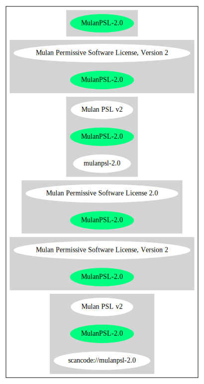

== Mulan Permissive Software License, Version 2 (MulanPSL-2.0)

[cols=",",options="header",]
|===
|Key |Value
|Fullname |Mulan Permissive Software License, Version 2
|Shortname |MulanPSL-2.0
|Rating |Unknown, probably Attention or Stop or No-Go
|===

=== Comments on (easy) usability

* **↑**``Is OSI Approved'' (source:
https://spdx.org/licenses/MulanPSL-2.0.html[SPDX])

=== General Comments

=== URLs

* *SPDX:* http://spdx.org/licenses/MulanPSL-2.0.json
* https://license.coscl.org.cn/MulanPSL2/

'''''

=== Raw Data

* SPDX

....
{
    "__impliedNames": [
        "MulanPSL-2.0",
        "Mulan Permissive Software License, Version 2"
    ],
    "__impliedId": "MulanPSL-2.0",
    "facts": {
        "SPDX": {
            "isSPDXLicenseDeprecated": false,
            "spdxFullName": "Mulan Permissive Software License, Version 2",
            "spdxDetailsURL": "http://spdx.org/licenses/MulanPSL-2.0.json",
            "_sourceURL": "https://spdx.org/licenses/MulanPSL-2.0.html",
            "spdxLicIsOSIApproved": true,
            "spdxSeeAlso": [
                "https://license.coscl.org.cn/MulanPSL2/"
            ],
            "_implications": {
                "__impliedNames": [
                    "MulanPSL-2.0",
                    "Mulan Permissive Software License, Version 2"
                ],
                "__impliedId": "MulanPSL-2.0",
                "__impliedJudgement": [
                    [
                        "SPDX",
                        {
                            "tag": "PositiveJudgement",
                            "contents": "Is OSI Approved"
                        }
                    ]
                ],
                "__isOsiApproved": true,
                "__impliedURLs": [
                    [
                        "SPDX",
                        "http://spdx.org/licenses/MulanPSL-2.0.json"
                    ],
                    [
                        null,
                        "https://license.coscl.org.cn/MulanPSL2/"
                    ]
                ]
            },
            "spdxLicenseId": "MulanPSL-2.0"
        }
    },
    "__impliedJudgement": [
        [
            "SPDX",
            {
                "tag": "PositiveJudgement",
                "contents": "Is OSI Approved"
            }
        ]
    ],
    "__isOsiApproved": true,
    "__impliedURLs": [
        [
            "SPDX",
            "http://spdx.org/licenses/MulanPSL-2.0.json"
        ],
        [
            null,
            "https://license.coscl.org.cn/MulanPSL2/"
        ]
    ]
}
....

'''''

=== Dot Cluster Graph

