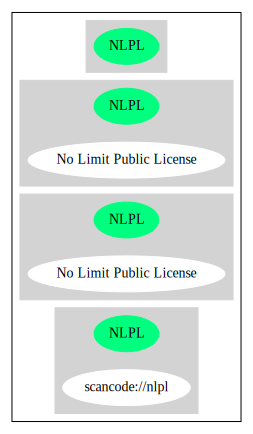

== No Limit Public License (NLPL)

[cols=",",options="header",]
|===
|Key |Value
|Fullname |No Limit Public License
|Shortname |NLPL
|Rating |Unknown, probably Stop or No-Go
|Classification |NoCopyleft
|===

*Other Names:*

* `+scancode://nlpl+`

=== Comments on (easy) usability

* **↓**``Rating is: Lead'' (source:
https://blueoakcouncil.org/list[BlueOak License List])

=== General Comments

* ``Per Fedora, there is a certain irony in a Frenchman writing a
license that isn't wholly applicable in France, due to Moral Rights. But
I digress. This license is basically the same as the WTFPL (with
slightly less profanity). It is Free and GPL-Compatible. A copy of the
license text was taken from http://imapsync.lamiral.info/COPYING on
2012-07-09. '' (source:
https://github.com/nexB/scancode-toolkit/blob/develop/src/licensedcode/data/licenses/nlpl.yml[Scancode])

=== URLs

* *Homepage:* https://fedoraproject.org/wiki/Licensing/NLPL
* *SPDX:* http://spdx.org/licenses/NLPL.json
* *SPDX:* https://spdx.org/licenses/NLPL.html

=== Text

....
NO LIMIT PUBLIC LICENSE
           Version 0, June 2012

Gilles LAMIRAL
La Billais
35580 Baulon
France

                 NO LIMIT PUBLIC LICENSE
Terms and conditions for copying, distribution, modification
or anything else.

  0. No limit to do anything with this work and this license.
....

'''''

=== Raw Data

* SPDX
* BlueOak License List
* Scancode

....
{
    "__impliedNames": [
        "NLPL",
        "No Limit Public License",
        "scancode://nlpl"
    ],
    "__impliedId": "NLPL",
    "__impliedComments": [
        [
            "Scancode",
            [
                "Per Fedora, there is a certain irony in a Frenchman writing a license that\nisn't wholly applicable in France, due to Moral Rights. But I digress. This\nlicense is basically the same as the WTFPL (with slightly less profanity).\nIt is Free and GPL-Compatible. A copy of the license text was taken from\nhttp://imapsync.lamiral.info/COPYING on 2012-07-09.\n"
            ]
        ]
    ],
    "facts": {
        "SPDX": {
            "isSPDXLicenseDeprecated": false,
            "spdxFullName": "No Limit Public License",
            "spdxDetailsURL": "http://spdx.org/licenses/NLPL.json",
            "_sourceURL": "https://spdx.org/licenses/NLPL.html",
            "spdxLicIsOSIApproved": false,
            "spdxSeeAlso": [
                "https://fedoraproject.org/wiki/Licensing/NLPL"
            ],
            "_implications": {
                "__impliedNames": [
                    "NLPL",
                    "No Limit Public License"
                ],
                "__impliedId": "NLPL",
                "__isOsiApproved": false,
                "__impliedURLs": [
                    [
                        "SPDX",
                        "http://spdx.org/licenses/NLPL.json"
                    ],
                    [
                        null,
                        "https://fedoraproject.org/wiki/Licensing/NLPL"
                    ]
                ]
            },
            "spdxLicenseId": "NLPL"
        },
        "Scancode": {
            "otherUrls": null,
            "homepageUrl": "https://fedoraproject.org/wiki/Licensing/NLPL",
            "shortName": "NLPL",
            "textUrls": null,
            "text": "NO LIMIT PUBLIC LICENSE\n           Version 0, June 2012\n\nGilles LAMIRAL\nLa Billais\n35580 Baulon\nFrance\n\n                 NO LIMIT PUBLIC LICENSE\nTerms and conditions for copying, distribution, modification\nor anything else.\n\n  0. No limit to do anything with this work and this license.",
            "category": "Public Domain",
            "osiUrl": null,
            "owner": "Gilles Lamiral",
            "_sourceURL": "https://github.com/nexB/scancode-toolkit/blob/develop/src/licensedcode/data/licenses/nlpl.yml",
            "key": "nlpl",
            "name": "No Limit Public License",
            "spdxId": "NLPL",
            "notes": "Per Fedora, there is a certain irony in a Frenchman writing a license that\nisn't wholly applicable in France, due to Moral Rights. But I digress. This\nlicense is basically the same as the WTFPL (with slightly less profanity).\nIt is Free and GPL-Compatible. A copy of the license text was taken from\nhttp://imapsync.lamiral.info/COPYING on 2012-07-09.\n",
            "_implications": {
                "__impliedNames": [
                    "scancode://nlpl",
                    "NLPL",
                    "NLPL"
                ],
                "__impliedId": "NLPL",
                "__impliedComments": [
                    [
                        "Scancode",
                        [
                            "Per Fedora, there is a certain irony in a Frenchman writing a license that\nisn't wholly applicable in France, due to Moral Rights. But I digress. This\nlicense is basically the same as the WTFPL (with slightly less profanity).\nIt is Free and GPL-Compatible. A copy of the license text was taken from\nhttp://imapsync.lamiral.info/COPYING on 2012-07-09.\n"
                        ]
                    ]
                ],
                "__impliedCopyleft": [
                    [
                        "Scancode",
                        "NoCopyleft"
                    ]
                ],
                "__calculatedCopyleft": "NoCopyleft",
                "__impliedText": "NO LIMIT PUBLIC LICENSE\n           Version 0, June 2012\n\nGilles LAMIRAL\nLa Billais\n35580 Baulon\nFrance\n\n                 NO LIMIT PUBLIC LICENSE\nTerms and conditions for copying, distribution, modification\nor anything else.\n\n  0. No limit to do anything with this work and this license.",
                "__impliedURLs": [
                    [
                        "Homepage",
                        "https://fedoraproject.org/wiki/Licensing/NLPL"
                    ]
                ]
            }
        },
        "BlueOak License List": {
            "BlueOakRating": "Lead",
            "url": "https://spdx.org/licenses/NLPL.html",
            "isPermissive": true,
            "_sourceURL": "https://blueoakcouncil.org/list",
            "name": "No Limit Public License",
            "id": "NLPL",
            "_implications": {
                "__impliedNames": [
                    "NLPL",
                    "No Limit Public License"
                ],
                "__impliedJudgement": [
                    [
                        "BlueOak License List",
                        {
                            "tag": "NegativeJudgement",
                            "contents": "Rating is: Lead"
                        }
                    ]
                ],
                "__impliedCopyleft": [
                    [
                        "BlueOak License List",
                        "NoCopyleft"
                    ]
                ],
                "__calculatedCopyleft": "NoCopyleft",
                "__impliedURLs": [
                    [
                        "SPDX",
                        "https://spdx.org/licenses/NLPL.html"
                    ]
                ]
            }
        }
    },
    "__impliedJudgement": [
        [
            "BlueOak License List",
            {
                "tag": "NegativeJudgement",
                "contents": "Rating is: Lead"
            }
        ]
    ],
    "__impliedCopyleft": [
        [
            "BlueOak License List",
            "NoCopyleft"
        ],
        [
            "Scancode",
            "NoCopyleft"
        ]
    ],
    "__calculatedCopyleft": "NoCopyleft",
    "__isOsiApproved": false,
    "__impliedText": "NO LIMIT PUBLIC LICENSE\n           Version 0, June 2012\n\nGilles LAMIRAL\nLa Billais\n35580 Baulon\nFrance\n\n                 NO LIMIT PUBLIC LICENSE\nTerms and conditions for copying, distribution, modification\nor anything else.\n\n  0. No limit to do anything with this work and this license.",
    "__impliedURLs": [
        [
            "SPDX",
            "http://spdx.org/licenses/NLPL.json"
        ],
        [
            null,
            "https://fedoraproject.org/wiki/Licensing/NLPL"
        ],
        [
            "SPDX",
            "https://spdx.org/licenses/NLPL.html"
        ],
        [
            "Homepage",
            "https://fedoraproject.org/wiki/Licensing/NLPL"
        ]
    ]
}
....

'''''

=== Dot Cluster Graph

