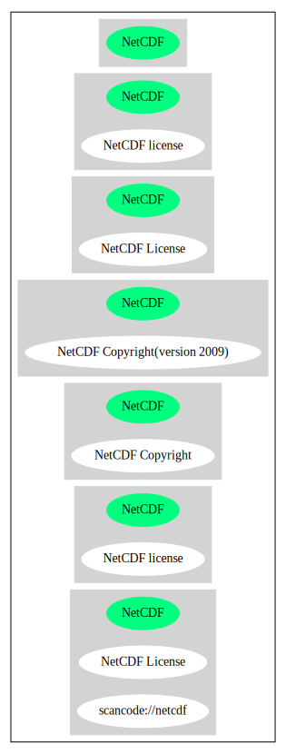

== NetCDF license (NetCDF)

[cols=",",options="header",]
|===
|Key |Value
|Fullname |NetCDF license
|Shortname |NetCDF
|Rating |Go
|Classification |NoCopyleft
|===

*Other Names:*

* `+scancode://netcdf+`

=== Comments on (easy) usability

* **↑**Rating is: Bronze (source:
https://blueoakcouncil.org/list[BlueOak License List])

=== URLs

* *Homepage:* http://www.unidata.ucar.edu/software/netcdf/copyright.html
* *SPDX:* http://spdx.org/licenses/NetCDF.json
* *SPDX:* https://spdx.org/licenses/NetCDF.html

=== Text

....

Portions of this software were developed by the Unidata Program at the
University Corporation for Atmospheric Research.

Access and use of this software shall impose the following obligations and
understandings on the user. The user is granted the right, without any fee or
cost, to use, copy, modify, alter, enhance and distribute this software, and any
derivative works thereof, and its supporting documentation for any purpose
whatsoever, provided that this entire notice appears in all copies of the
software, derivative works and supporting documentation. Further, UCAR requests
that the user credit UCAR/Unidata in any publications that result from the use
of this software or in any product that includes this software, although this is
not an obligation. The names UCAR and/or Unidata, however, may not be used in
any advertising or publicity to endorse or promote any products or commercial
entity unless specific written permission is obtained from UCAR/Unidata. The
user also understands that UCAR/Unidata is not obligated to provide the user
with any support, consulting, training or assistance of any kind with regard to
the use, operation and performance of this software nor to provide the user with
any updates, revisions, new versions or "bug fixes."

THIS SOFTWARE IS PROVIDED BY UCAR/UNIDATA "AS IS" AND ANY EXPRESS OR IMPLIED
WARRANTIES, INCLUDING, BUT NOT LIMITED TO, THE IMPLIED WARRANTIES OF
MERCHANTABILITY AND FITNESS FOR A PARTICULAR PURPOSE ARE DISCLAIMED. IN NO EVENT
SHALL UCAR/UNIDATA BE LIABLE FOR ANY SPECIAL, INDIRECT OR CONSEQUENTIAL DAMAGES
OR ANY DAMAGES WHATSOEVER RESULTING FROM LOSS OF USE, DATA OR PROFITS, WHETHER
IN AN ACTION OF CONTRACT, NEGLIGENCE OR OTHER TORTIOUS ACTION, ARISING OUT OF OR
IN CONNECTION WITH THE ACCESS, USE OR PERFORMANCE OF THIS SOFTWARE.
....

'''''

=== Raw Data

....
{
    "__impliedNames": [
        "NetCDF",
        "NetCDF license",
        "scancode://netcdf",
        "NetCDF License"
    ],
    "__impliedId": "NetCDF",
    "facts": {
        "SPDX": {
            "isSPDXLicenseDeprecated": false,
            "spdxFullName": "NetCDF license",
            "spdxDetailsURL": "http://spdx.org/licenses/NetCDF.json",
            "_sourceURL": "https://spdx.org/licenses/NetCDF.html",
            "spdxLicIsOSIApproved": false,
            "spdxSeeAlso": [
                "http://www.unidata.ucar.edu/software/netcdf/copyright.html"
            ],
            "_implications": {
                "__impliedNames": [
                    "NetCDF",
                    "NetCDF license"
                ],
                "__impliedId": "NetCDF",
                "__isOsiApproved": false,
                "__impliedURLs": [
                    [
                        "SPDX",
                        "http://spdx.org/licenses/NetCDF.json"
                    ],
                    [
                        null,
                        "http://www.unidata.ucar.edu/software/netcdf/copyright.html"
                    ]
                ]
            },
            "spdxLicenseId": "NetCDF"
        },
        "Scancode": {
            "otherUrls": null,
            "homepageUrl": "http://www.unidata.ucar.edu/software/netcdf/copyright.html",
            "shortName": "NetCDF License",
            "textUrls": null,
            "text": "\nPortions of this software were developed by the Unidata Program at the\nUniversity Corporation for Atmospheric Research.\n\nAccess and use of this software shall impose the following obligations and\nunderstandings on the user. The user is granted the right, without any fee or\ncost, to use, copy, modify, alter, enhance and distribute this software, and any\nderivative works thereof, and its supporting documentation for any purpose\nwhatsoever, provided that this entire notice appears in all copies of the\nsoftware, derivative works and supporting documentation. Further, UCAR requests\nthat the user credit UCAR/Unidata in any publications that result from the use\nof this software or in any product that includes this software, although this is\nnot an obligation. The names UCAR and/or Unidata, however, may not be used in\nany advertising or publicity to endorse or promote any products or commercial\nentity unless specific written permission is obtained from UCAR/Unidata. The\nuser also understands that UCAR/Unidata is not obligated to provide the user\nwith any support, consulting, training or assistance of any kind with regard to\nthe use, operation and performance of this software nor to provide the user with\nany updates, revisions, new versions or \"bug fixes.\"\n\nTHIS SOFTWARE IS PROVIDED BY UCAR/UNIDATA \"AS IS\" AND ANY EXPRESS OR IMPLIED\nWARRANTIES, INCLUDING, BUT NOT LIMITED TO, THE IMPLIED WARRANTIES OF\nMERCHANTABILITY AND FITNESS FOR A PARTICULAR PURPOSE ARE DISCLAIMED. IN NO EVENT\nSHALL UCAR/UNIDATA BE LIABLE FOR ANY SPECIAL, INDIRECT OR CONSEQUENTIAL DAMAGES\nOR ANY DAMAGES WHATSOEVER RESULTING FROM LOSS OF USE, DATA OR PROFITS, WHETHER\nIN AN ACTION OF CONTRACT, NEGLIGENCE OR OTHER TORTIOUS ACTION, ARISING OUT OF OR\nIN CONNECTION WITH THE ACCESS, USE OR PERFORMANCE OF THIS SOFTWARE.",
            "category": "Permissive",
            "osiUrl": null,
            "owner": "Unidata",
            "_sourceURL": "https://github.com/nexB/scancode-toolkit/blob/develop/src/licensedcode/data/licenses/netcdf.yml",
            "key": "netcdf",
            "name": "NetCDF License",
            "spdxId": "NetCDF",
            "_implications": {
                "__impliedNames": [
                    "scancode://netcdf",
                    "NetCDF License",
                    "NetCDF"
                ],
                "__impliedId": "NetCDF",
                "__impliedCopyleft": [
                    [
                        "Scancode",
                        "NoCopyleft"
                    ]
                ],
                "__calculatedCopyleft": "NoCopyleft",
                "__impliedText": "\nPortions of this software were developed by the Unidata Program at the\nUniversity Corporation for Atmospheric Research.\n\nAccess and use of this software shall impose the following obligations and\nunderstandings on the user. The user is granted the right, without any fee or\ncost, to use, copy, modify, alter, enhance and distribute this software, and any\nderivative works thereof, and its supporting documentation for any purpose\nwhatsoever, provided that this entire notice appears in all copies of the\nsoftware, derivative works and supporting documentation. Further, UCAR requests\nthat the user credit UCAR/Unidata in any publications that result from the use\nof this software or in any product that includes this software, although this is\nnot an obligation. The names UCAR and/or Unidata, however, may not be used in\nany advertising or publicity to endorse or promote any products or commercial\nentity unless specific written permission is obtained from UCAR/Unidata. The\nuser also understands that UCAR/Unidata is not obligated to provide the user\nwith any support, consulting, training or assistance of any kind with regard to\nthe use, operation and performance of this software nor to provide the user with\nany updates, revisions, new versions or \"bug fixes.\"\n\nTHIS SOFTWARE IS PROVIDED BY UCAR/UNIDATA \"AS IS\" AND ANY EXPRESS OR IMPLIED\nWARRANTIES, INCLUDING, BUT NOT LIMITED TO, THE IMPLIED WARRANTIES OF\nMERCHANTABILITY AND FITNESS FOR A PARTICULAR PURPOSE ARE DISCLAIMED. IN NO EVENT\nSHALL UCAR/UNIDATA BE LIABLE FOR ANY SPECIAL, INDIRECT OR CONSEQUENTIAL DAMAGES\nOR ANY DAMAGES WHATSOEVER RESULTING FROM LOSS OF USE, DATA OR PROFITS, WHETHER\nIN AN ACTION OF CONTRACT, NEGLIGENCE OR OTHER TORTIOUS ACTION, ARISING OUT OF OR\nIN CONNECTION WITH THE ACCESS, USE OR PERFORMANCE OF THIS SOFTWARE.",
                "__impliedURLs": [
                    [
                        "Homepage",
                        "http://www.unidata.ucar.edu/software/netcdf/copyright.html"
                    ]
                ]
            }
        },
        "BlueOak License List": {
            "BlueOakRating": "Bronze",
            "url": "https://spdx.org/licenses/NetCDF.html",
            "isPermissive": true,
            "_sourceURL": "https://blueoakcouncil.org/list",
            "name": "NetCDF license",
            "id": "NetCDF",
            "_implications": {
                "__impliedNames": [
                    "NetCDF"
                ],
                "__impliedJudgement": [
                    [
                        "BlueOak License List",
                        {
                            "tag": "PositiveJudgement",
                            "contents": "Rating is: Bronze"
                        }
                    ]
                ],
                "__impliedCopyleft": [
                    [
                        "BlueOak License List",
                        "NoCopyleft"
                    ]
                ],
                "__calculatedCopyleft": "NoCopyleft",
                "__impliedURLs": [
                    [
                        "SPDX",
                        "https://spdx.org/licenses/NetCDF.html"
                    ]
                ]
            }
        }
    },
    "__impliedJudgement": [
        [
            "BlueOak License List",
            {
                "tag": "PositiveJudgement",
                "contents": "Rating is: Bronze"
            }
        ]
    ],
    "__impliedCopyleft": [
        [
            "BlueOak License List",
            "NoCopyleft"
        ],
        [
            "Scancode",
            "NoCopyleft"
        ]
    ],
    "__calculatedCopyleft": "NoCopyleft",
    "__isOsiApproved": false,
    "__impliedText": "\nPortions of this software were developed by the Unidata Program at the\nUniversity Corporation for Atmospheric Research.\n\nAccess and use of this software shall impose the following obligations and\nunderstandings on the user. The user is granted the right, without any fee or\ncost, to use, copy, modify, alter, enhance and distribute this software, and any\nderivative works thereof, and its supporting documentation for any purpose\nwhatsoever, provided that this entire notice appears in all copies of the\nsoftware, derivative works and supporting documentation. Further, UCAR requests\nthat the user credit UCAR/Unidata in any publications that result from the use\nof this software or in any product that includes this software, although this is\nnot an obligation. The names UCAR and/or Unidata, however, may not be used in\nany advertising or publicity to endorse or promote any products or commercial\nentity unless specific written permission is obtained from UCAR/Unidata. The\nuser also understands that UCAR/Unidata is not obligated to provide the user\nwith any support, consulting, training or assistance of any kind with regard to\nthe use, operation and performance of this software nor to provide the user with\nany updates, revisions, new versions or \"bug fixes.\"\n\nTHIS SOFTWARE IS PROVIDED BY UCAR/UNIDATA \"AS IS\" AND ANY EXPRESS OR IMPLIED\nWARRANTIES, INCLUDING, BUT NOT LIMITED TO, THE IMPLIED WARRANTIES OF\nMERCHANTABILITY AND FITNESS FOR A PARTICULAR PURPOSE ARE DISCLAIMED. IN NO EVENT\nSHALL UCAR/UNIDATA BE LIABLE FOR ANY SPECIAL, INDIRECT OR CONSEQUENTIAL DAMAGES\nOR ANY DAMAGES WHATSOEVER RESULTING FROM LOSS OF USE, DATA OR PROFITS, WHETHER\nIN AN ACTION OF CONTRACT, NEGLIGENCE OR OTHER TORTIOUS ACTION, ARISING OUT OF OR\nIN CONNECTION WITH THE ACCESS, USE OR PERFORMANCE OF THIS SOFTWARE.",
    "__impliedURLs": [
        [
            "SPDX",
            "http://spdx.org/licenses/NetCDF.json"
        ],
        [
            null,
            "http://www.unidata.ucar.edu/software/netcdf/copyright.html"
        ],
        [
            "SPDX",
            "https://spdx.org/licenses/NetCDF.html"
        ],
        [
            "Homepage",
            "http://www.unidata.ucar.edu/software/netcdf/copyright.html"
        ]
    ]
}
....

'''''

=== Dot Cluster Graph

