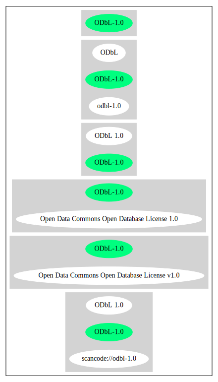

== ODC Open Database License v1.0 (ODbL-1.0)

[cols=",",options="header",]
|===
|Key |Value
|Fullname |ODC Open Database License v1.0
|Shortname |ODbL-1.0
|Rating |Unknown, probably Attention or Stop or No-Go
|Classification |Copyleft
|===

*Other Names:*

* `+scancode://odbl-1.0+`
* `+ODbL 1.0+`
* `+Open Data Commons Open Database License 1.0+`

=== Comments on (easy) usability

=== General Comments

=== URLs

* *Homepage:* http://www.opendatacommons.org/licenses/odbl/1.0/
* *SPDX:* http://spdx.org/licenses/ODbL-1.0.json
* https://opendefinition.org/licenses/odc-odbl

=== Text

....
## ODC Open Database License (ODbL)

### Preamble

The Open Database License (ODbL) is a license agreement intended to
allow users to freely share, modify, and use this Database while
maintaining this same freedom for others. Many databases are covered by
copyright, and therefore this document licenses these rights. Some
jurisdictions, mainly in the European Union, have specific rights that
cover databases, and so the ODbL addresses these rights, too. Finally,
the ODbL is also an agreement in contract for users of this Database to
act in certain ways in return for accessing this Database.

Databases can contain a wide variety of types of content (images,
audiovisual material, and sounds all in the same database, for example),
and so the ODbL only governs the rights over the Database, and not the
contents of the Database individually. Licensors should use the ODbL
together with another license for the contents, if the contents have a
single set of rights that uniformly covers all of the contents. If the
contents have multiple sets of different rights, Licensors should
describe what rights govern what contents together in the individual
record or in some other way that clarifies what rights apply. 

Sometimes the contents of a database, or the database itself, can be
covered by other rights not addressed here (such as private contracts,
trade mark over the name, or privacy rights / data protection rights
over information in the contents), and so you are advised that you may
have to consult other documents or clear other rights before doing
activities not covered by this License.

------

The Licensor (as defined below) 

and 

You (as defined below) 

agree as follows: 

### 1.0 Definitions of Capitalised Words

"Collective Database" – Means this Database in unmodified form as part
of a collection of independent databases in themselves that together are
assembled into a collective whole. A work that constitutes a Collective
Database will not be considered a Derivative Database.

"Convey" – As a verb, means Using the Database, a Derivative Database,
or the Database as part of a Collective Database in any way that enables
a Person to make or receive copies of the Database or a Derivative
Database. Conveying does not include interaction with a user through a
computer network, or creating and Using a Produced Work, where no
transfer of a copy of the Database or a Derivative Database occurs.
"Contents" – The contents of this Database, which includes the
information, independent works, or other material collected into the
Database. For example, the contents of the Database could be factual
data or works such as images, audiovisual material, text, or sounds.

"Database" – A collection of material (the Contents) arranged in a
systematic or methodical way and individually accessible by electronic
or other means offered under the terms of this License.

"Database Directive" – Means Directive 96/9/EC of the European
Parliament and of the Council of 11 March 1996 on the legal protection
of databases, as amended or succeeded.

"Database Right" – Means rights resulting from the Chapter III ("sui
generis") rights in the Database Directive (as amended and as transposed
by member states), which includes the Extraction and Re-utilisation of
the whole or a Substantial part of the Contents, as well as any similar
rights available in the relevant jurisdiction under Section 10.4. 

"Derivative Database" – Means a database based upon the Database, and
includes any translation, adaptation, arrangement, modification, or any
other alteration of the Database or of a Substantial part of the
Contents. This includes, but is not limited to, Extracting or
Re-utilising the whole or a Substantial part of the Contents in a new
Database.

"Extraction" – Means the permanent or temporary transfer of all or a
Substantial part of the Contents to another medium by any means or in
any form.

"License" – Means this license agreement and is both a license of rights
such as copyright and Database Rights and an agreement in contract.

"Licensor" – Means the Person that offers the Database under the terms
of this License. 

"Person" – Means a natural or legal person or a body of persons
corporate or incorporate.

"Produced Work" – a work (such as an image, audiovisual material, text,
or sounds) resulting from using the whole or a Substantial part of the
Contents (via a search or other query) from this Database, a Derivative
Database, or this Database as part of a Collective Database. 

"Publicly" – means to Persons other than You or under Your control by
either more than 50% ownership or by the power to direct their
activities (such as contracting with an independent consultant). 

"Re-utilisation" – means any form of making available to the public all
or a Substantial part of the Contents by the distribution of copies, by
renting, by online or other forms of transmission.

"Substantial" – Means substantial in terms of quantity or quality or a
combination of both. The repeated and systematic Extraction or
Re-utilisation of insubstantial parts of the Contents may amount to the
Extraction or Re-utilisation of a Substantial part of the Contents.

"Use" – As a verb, means doing any act that is restricted by copyright
or Database Rights whether in the original medium or any other; and
includes without limitation distributing, copying, publicly performing,
publicly displaying, and preparing derivative works of the Database, as
well as modifying the Database as may be technically necessary to use it
in a different mode or format. 

"You" – Means a Person exercising rights under this License who has not
previously violated the terms of this License with respect to the
Database, or who has received express permission from the Licensor to
exercise rights under this License despite a previous violation.

Words in the singular include the plural and vice versa.

### 2.0 What this License covers

2.1. Legal effect of this document. This License is:

a. A license of applicable copyright and neighbouring rights;

b. A license of the Database Right; and

c. An agreement in contract between You and the Licensor.

2.2 Legal rights covered. This License covers the legal rights in the
Database, including:

a. Copyright. Any copyright or neighbouring rights in the Database.
The copyright licensed includes any individual elements of the
Database, but does not cover the copyright over the Contents
independent of this Database. See Section 2.4 for details. Copyright
law varies between jurisdictions, but is likely to cover: the Database
model or schema, which is the structure, arrangement, and organisation
of the Database, and can also include the Database tables and table
indexes; the data entry and output sheets; and the Field names of
Contents stored in the Database;

b. Database Rights. Database Rights only extend to the Extraction and
Re-utilisation of the whole or a Substantial part of the Contents.
Database Rights can apply even when there is no copyright over the
Database. Database Rights can also apply when the Contents are removed
from the Database and are selected and arranged in a way that would
not infringe any applicable copyright; and

c. Contract. This is an agreement between You and the Licensor for
access to the Database. In return you agree to certain conditions of
use on this access as outlined in this License. 

2.3 Rights not covered. 

a. This License does not apply to computer programs used in the making
or operation of the Database; 

b. This License does not cover any patents over the Contents or the
Database; and

c. This License does not cover any trademarks associated with the
Database. 

2.4 Relationship to Contents in the Database. The individual items of
the Contents contained in this Database may be covered by other rights,
including copyright, patent, data protection, privacy, or personality
rights, and this License does not cover any rights (other than Database
Rights or in contract) in individual Contents contained in the Database.
For example, if used on a Database of images (the Contents), this
License would not apply to copyright over individual images, which could
have their own separate licenses, or one single license covering all of
the rights over the images. 

### 3.0 Rights granted

3.1 Subject to the terms and conditions of this License, the Licensor
grants to You a worldwide, royalty-free, non-exclusive, terminable (but
only under Section 9) license to Use the Database for the duration of
any applicable copyright and Database Rights. These rights explicitly
include commercial use, and do not exclude any field of endeavour. To
the extent possible in the relevant jurisdiction, these rights may be
exercised in all media and formats whether now known or created in the
future. 

The rights granted cover, for example:

a. Extraction and Re-utilisation of the whole or a Substantial part of
the Contents;

b. Creation of Derivative Databases;

c. Creation of Collective Databases;

d. Creation of temporary or permanent reproductions by any means and
in any form, in whole or in part, including of any Derivative
Databases or as a part of Collective Databases; and

e. Distribution, communication, display, lending, making available, or
performance to the public by any means and in any form, in whole or in
part, including of any Derivative Database or as a part of Collective
Databases.

3.2 Compulsory license schemes. For the avoidance of doubt:

a. Non-waivable compulsory license schemes. In those jurisdictions in
which the right to collect royalties through any statutory or
compulsory licensing scheme cannot be waived, the Licensor reserves
the exclusive right to collect such royalties for any exercise by You
of the rights granted under this License;

b. Waivable compulsory license schemes. In those jurisdictions in
which the right to collect royalties through any statutory or
compulsory licensing scheme can be waived, the Licensor waives the
exclusive right to collect such royalties for any exercise by You of
the rights granted under this License; and,

c. Voluntary license schemes. The Licensor waives the right to collect
royalties, whether individually or, in the event that the Licensor is
a member of a collecting society that administers voluntary licensing
schemes, via that society, from any exercise by You of the rights
granted under this License.

3.3 The right to release the Database under different terms, or to stop
distributing or making available the Database, is reserved. Note that
this Database may be multiple-licensed, and so You may have the choice
of using alternative licenses for this Database. Subject to Section
10.4, all other rights not expressly granted by Licensor are reserved.

### 4.0 Conditions of Use

4.1 The rights granted in Section 3 above are expressly made subject to
Your complying with the following conditions of use. These are important
conditions of this License, and if You fail to follow them, You will be
in material breach of its terms.

4.2 Notices. If You Publicly Convey this Database, any Derivative
Database, or the Database as part of a Collective Database, then You
must: 

a. Do so only under the terms of this License or another license
permitted under Section 4.4;

b. Include a copy of this License (or, as applicable, a license
permitted under Section 4.4) or its Uniform Resource Identifier (URI)
with the Database or Derivative Database, including both in the
Database or Derivative Database and in any relevant documentation; and

c. Keep intact any copyright or Database Right notices and notices
that refer to this License.

d. If it is not possible to put the required notices in a particular
file due to its structure, then You must include the notices in a
location (such as a relevant directory) where users would be likely to
look for it.

4.3 Notice for using output (Contents). Creating and Using a Produced
Work does not require the notice in Section 4.2. However, if you
Publicly Use a Produced Work, You must include a notice associated with
the Produced Work reasonably calculated to make any Person that uses,
views, accesses, interacts with, or is otherwise exposed to the Produced
Work aware that Content was obtained from the Database, Derivative
Database, or the Database as part of a Collective Database, and that it
is available under this License.

a. Example notice. The following text will satisfy notice under
Section 4.3:

Contains information from DATABASE NAME, which is made available
here under the Open Database License (ODbL).

DATABASE NAME should be replaced with the name of the Database and a
hyperlink to the URI of the Database. "Open Database License" should
contain a hyperlink to the URI of the text of this License. If
hyperlinks are not possible, You should include the plain text of the
required URI's with the above notice.

4.4 Share alike. 

a. Any Derivative Database that You Publicly Use must be only under
the terms of: 

i. This License;

ii. A later version of this License similar in spirit to this
License; or

iii. A compatible license. 

If You license the Derivative Database under one of the licenses
mentioned in (iii), You must comply with the terms of that license. 

b. For the avoidance of doubt, Extraction or Re-utilisation of the
whole or a Substantial part of the Contents into a new database is a
Derivative Database and must comply with Section 4.4. 

c. Derivative Databases and Produced Works. A Derivative Database is
Publicly Used and so must comply with Section 4.4. if a Produced Work
created from the Derivative Database is Publicly Used.

d. Share Alike and additional Contents. For the avoidance of doubt,
You must not add Contents to Derivative Databases under Section 4.4 a
that are incompatible with the rights granted under this License. 

e. Compatible licenses. Licensors may authorise a proxy to determine
compatible licenses under Section 4.4 a iii. If they do so, the
authorised proxy's public statement of acceptance of a compatible
license grants You permission to use the compatible license.

4.5 Limits of Share Alike. The requirements of Section 4.4 do not apply
in the following:

a. For the avoidance of doubt, You are not required to license
Collective Databases under this License if You incorporate this
Database or a Derivative Database in the collection, but this License
still applies to this Database or a Derivative Database as a part of
the Collective Database; 

b. Using this Database, a Derivative Database, or this Database as
part of a Collective Database to create a Produced Work does not
create a Derivative Database for purposes of Section 4.4; and

c. Use of a Derivative Database internally within an organisation is
not to the public and therefore does not fall under the requirements
of Section 4.4.

4.6 Access to Derivative Databases. If You Publicly Use a Derivative
Database or a Produced Work from a Derivative Database, You must also
offer to recipients of the Derivative Database or Produced Work a copy
in a machine readable form of:

a. The entire Derivative Database; or

b. A file containing all of the alterations made to the Database or
the method of making the alterations to the Database (such as an
algorithm), including any additional Contents, that make up all the
differences between the Database and the Derivative Database.

The Derivative Database (under a.) or alteration file (under b.) must be
available at no more than a reasonable production cost for physical
distributions and free of charge if distributed over the internet.

4.7 Technological measures and additional terms

a. This License does not allow You to impose (except subject to
Section 4.7 b.) any terms or any technological measures on the
Database, a Derivative Database, or the whole or a Substantial part of
the Contents that alter or restrict the terms of this License, or any
rights granted under it, or have the effect or intent of restricting
the ability of any person to exercise those rights.

b. Parallel distribution. You may impose terms or technological
measures on the Database, a Derivative Database, or the whole or a
Substantial part of the Contents (a "Restricted Database") in
contravention of Section 4.74 a. only if You also make a copy of the
Database or a Derivative Database available to the recipient of the
Restricted Database:

i. That is available without additional fee;

ii. That is available in a medium that does not alter or restrict
the terms of this License, or any rights granted under it, or have
the effect or intent of restricting the ability of any person to
exercise those rights (an "Unrestricted Database"); and

iii. The Unrestricted Database is at least as accessible to the
recipient as a practical matter as the Restricted Database.

c. For the avoidance of doubt, You may place this Database or a
Derivative Database in an authenticated environment, behind a
password, or within a similar access control scheme provided that You
do not alter or restrict the terms of this License or any rights
granted under it or have the effect or intent of restricting the
ability of any person to exercise those rights. 

4.8 Licensing of others. You may not sublicense the Database. Each time
You communicate the Database, the whole or Substantial part of the
Contents, or any Derivative Database to anyone else in any way, the
Licensor offers to the recipient a license to the Database on the same
terms and conditions as this License. You are not responsible for
enforcing compliance by third parties with this License, but You may
enforce any rights that You have over a Derivative Database. You are
solely responsible for any modifications of a Derivative Database made
by You or another Person at Your direction. You may not impose any
further restrictions on the exercise of the rights granted or affirmed
under this License.

### 5.0 Moral rights

5.1 Moral rights. This section covers moral rights, including any rights
to be identified as the author of the Database or to object to treatment
that would otherwise prejudice the author's honour and reputation, or
any other derogatory treatment:

a. For jurisdictions allowing waiver of moral rights, Licensor waives
all moral rights that Licensor may have in the Database to the fullest
extent possible by the law of the relevant jurisdiction under Section
10.4; 

b. If waiver of moral rights under Section 5.1 a in the relevant
jurisdiction is not possible, Licensor agrees not to assert any moral
rights over the Database and waives all claims in moral rights to the
fullest extent possible by the law of the relevant jurisdiction under
Section 10.4; and

c. For jurisdictions not allowing waiver or an agreement not to assert
moral rights under Section 5.1 a and b, the author may retain their
moral rights over certain aspects of the Database.

Please note that some jurisdictions do not allow for the waiver of moral
rights, and so moral rights may still subsist over the Database in some
jurisdictions.

### 6.0 Fair dealing, Database exceptions, and other rights not affected 

6.1 This License does not affect any rights that You or anyone else may
independently have under any applicable law to make any use of this
Database, including without limitation:

a. Exceptions to the Database Right including: Extraction of Contents
from non-electronic Databases for private purposes, Extraction for
purposes of illustration for teaching or scientific research, and
Extraction or Re-utilisation for public security or an administrative
or judicial procedure. 

b. Fair dealing, fair use, or any other legally recognised limitation
or exception to infringement of copyright or other applicable laws. 

6.2 This License does not affect any rights of lawful users to Extract
and Re-utilise insubstantial parts of the Contents, evaluated
quantitatively or qualitatively, for any purposes whatsoever, including
creating a Derivative Database (subject to other rights over the
Contents, see Section 2.4). The repeated and systematic Extraction or
Re-utilisation of insubstantial parts of the Contents may however amount
to the Extraction or Re-utilisation of a Substantial part of the
Contents.

### 7.0 Warranties and Disclaimer

7.1 The Database is licensed by the Licensor "as is" and without any
warranty of any kind, either express, implied, or arising by statute,
custom, course of dealing, or trade usage. Licensor specifically
disclaims any and all implied warranties or conditions of title,
non-infringement, accuracy or completeness, the presence or absence of
errors, fitness for a particular purpose, merchantability, or otherwise.
Some jurisdictions do not allow the exclusion of implied warranties, so
this exclusion may not apply to You.

### 8.0 Limitation of liability

8.1 Subject to any liability that may not be excluded or limited by law,
the Licensor is not liable for, and expressly excludes, all liability
for loss or damage however and whenever caused to anyone by any use
under this License, whether by You or by anyone else, and whether caused
by any fault on the part of the Licensor or not. This exclusion of
liability includes, but is not limited to, any special, incidental,
consequential, punitive, or exemplary damages such as loss of revenue,
data, anticipated profits, and lost business. This exclusion applies
even if the Licensor has been advised of the possibility of such
damages.

8.2 If liability may not be excluded by law, it is limited to actual and
direct financial loss to the extent it is caused by proved negligence on
the part of the Licensor.

### 9.0 Termination of Your rights under this License

9.1 Any breach by You of the terms and conditions of this License
automatically terminates this License with immediate effect and without
notice to You. For the avoidance of doubt, Persons who have received the
Database, the whole or a Substantial part of the Contents, Derivative
Databases, or the Database as part of a Collective Database from You
under this License will not have their licenses terminated provided
their use is in full compliance with this License or a license granted
under Section 4.8 of this License. Sections 1, 2, 7, 8, 9 and 10 will
survive any termination of this License.

9.2 If You are not in breach of the terms of this License, the Licensor
will not terminate Your rights under it. 

9.3 Unless terminated under Section 9.1, this License is granted to You
for the duration of applicable rights in the Database. 

9.4 Reinstatement of rights. If you cease any breach of the terms and
conditions of this License, then your full rights under this License
will be reinstated:

a. Provisionally and subject to permanent termination until the 60th
day after cessation of breach; 

b. Permanently on the 60th day after cessation of breach unless
otherwise reasonably notified by the Licensor; or

c. Permanently if reasonably notified by the Licensor of the
violation, this is the first time You have received notice of
violation of this License from the Licensor, and You cure the
violation prior to 30 days after your receipt of the notice.

Persons subject to permanent termination of rights are not eligible to
be a recipient and receive a license under Section 4.8.

9.5 Notwithstanding the above, Licensor reserves the right to release
the Database under different license terms or to stop distributing or
making available the Database. Releasing the Database under different
license terms or stopping the distribution of the Database will not
withdraw this License (or any other license that has been, or is
required to be, granted under the terms of this License), and this
License will continue in full force and effect unless terminated as
stated above.

### 10.0 General

10.1 If any provision of this License is held to be invalid or
unenforceable, that must not affect the validity or enforceability of
the remainder of the terms and conditions of this License and each
remaining provision of this License shall be valid and enforced to the
fullest extent permitted by law. 

10.2 This License is the entire agreement between the parties with
respect to the rights granted here over the Database. It replaces any
earlier understandings, agreements or representations with respect to
the Database. 

10.3 If You are in breach of the terms of this License, You will not be
entitled to rely on the terms of this License or to complain of any
breach by the Licensor. 

10.4 Choice of law. This License takes effect in and will be governed by
the laws of the relevant jurisdiction in which the License terms are
sought to be enforced. If the standard suite of rights granted under
applicable copyright law and Database Rights in the relevant
jurisdiction includes additional rights not granted under this License,
these additional rights are granted in this License in order to meet the
terms of this License.
....

'''''

=== Raw Data

==== Facts

* https://spdx.org/licenses/ODbL-1.0.html[SPDX]
* https://github.com/nexB/scancode-toolkit/blob/develop/src/licensedcode/data/licenses/odbl-1.0.yml[Scancode]
* https://github.com/okfn/licenses/blob/master/licenses.csv[Open
Knowledge International]

==== Raw JSON

....
{
    "__impliedNames": [
        "ODbL-1.0",
        "ODC Open Database License v1.0",
        "scancode://odbl-1.0",
        "ODbL 1.0",
        "Open Data Commons Open Database License 1.0"
    ],
    "__impliedId": "ODbL-1.0",
    "facts": {
        "Open Knowledge International": {
            "is_generic": null,
            "status": "active",
            "domain_software": false,
            "url": "https://opendefinition.org/licenses/odc-odbl",
            "maintainer": "Open Data Commons",
            "od_conformance": "approved",
            "_sourceURL": "https://github.com/okfn/licenses/blob/master/licenses.csv",
            "domain_data": true,
            "osd_conformance": "not reviewed",
            "id": "ODbL-1.0",
            "title": "Open Data Commons Open Database License 1.0",
            "_implications": {
                "__impliedNames": [
                    "ODbL-1.0",
                    "Open Data Commons Open Database License 1.0"
                ],
                "__impliedId": "ODbL-1.0",
                "__impliedURLs": [
                    [
                        null,
                        "https://opendefinition.org/licenses/odc-odbl"
                    ]
                ]
            },
            "domain_content": false
        },
        "SPDX": {
            "isSPDXLicenseDeprecated": false,
            "spdxFullName": "ODC Open Database License v1.0",
            "spdxDetailsURL": "http://spdx.org/licenses/ODbL-1.0.json",
            "_sourceURL": "https://spdx.org/licenses/ODbL-1.0.html",
            "spdxLicIsOSIApproved": false,
            "spdxSeeAlso": [
                "http://www.opendatacommons.org/licenses/odbl/1.0/"
            ],
            "_implications": {
                "__impliedNames": [
                    "ODbL-1.0",
                    "ODC Open Database License v1.0"
                ],
                "__impliedId": "ODbL-1.0",
                "__isOsiApproved": false,
                "__impliedURLs": [
                    [
                        "SPDX",
                        "http://spdx.org/licenses/ODbL-1.0.json"
                    ],
                    [
                        null,
                        "http://www.opendatacommons.org/licenses/odbl/1.0/"
                    ]
                ]
            },
            "spdxLicenseId": "ODbL-1.0"
        },
        "Scancode": {
            "otherUrls": null,
            "homepageUrl": "http://www.opendatacommons.org/licenses/odbl/1.0/",
            "shortName": "ODbL 1.0",
            "textUrls": null,
            "text": "## ODC Open Database License (ODbL)\n\n### Preamble\n\nThe Open Database License (ODbL) is a license agreement intended to\nallow users to freely share, modify, and use this Database while\nmaintaining this same freedom for others. Many databases are covered by\ncopyright, and therefore this document licenses these rights. Some\njurisdictions, mainly in the European Union, have specific rights that\ncover databases, and so the ODbL addresses these rights, too. Finally,\nthe ODbL is also an agreement in contract for users of this Database to\nact in certain ways in return for accessing this Database.\n\nDatabases can contain a wide variety of types of content (images,\naudiovisual material, and sounds all in the same database, for example),\nand so the ODbL only governs the rights over the Database, and not the\ncontents of the Database individually. Licensors should use the ODbL\ntogether with another license for the contents, if the contents have a\nsingle set of rights that uniformly covers all of the contents. If the\ncontents have multiple sets of different rights, Licensors should\ndescribe what rights govern what contents together in the individual\nrecord or in some other way that clarifies what rights apply. \n\nSometimes the contents of a database, or the database itself, can be\ncovered by other rights not addressed here (such as private contracts,\ntrade mark over the name, or privacy rights / data protection rights\nover information in the contents), and so you are advised that you may\nhave to consult other documents or clear other rights before doing\nactivities not covered by this License.\n\n------\n\nThe Licensor (as defined below) \n\nand \n\nYou (as defined below) \n\nagree as follows: \n\n### 1.0 Definitions of Capitalised Words\n\n\"Collective Database\" – Means this Database in unmodified form as part\nof a collection of independent databases in themselves that together are\nassembled into a collective whole. A work that constitutes a Collective\nDatabase will not be considered a Derivative Database.\n\n\"Convey\" – As a verb, means Using the Database, a Derivative Database,\nor the Database as part of a Collective Database in any way that enables\na Person to make or receive copies of the Database or a Derivative\nDatabase. Conveying does not include interaction with a user through a\ncomputer network, or creating and Using a Produced Work, where no\ntransfer of a copy of the Database or a Derivative Database occurs.\n\"Contents\" – The contents of this Database, which includes the\ninformation, independent works, or other material collected into the\nDatabase. For example, the contents of the Database could be factual\ndata or works such as images, audiovisual material, text, or sounds.\n\n\"Database\" – A collection of material (the Contents) arranged in a\nsystematic or methodical way and individually accessible by electronic\nor other means offered under the terms of this License.\n\n\"Database Directive\" – Means Directive 96/9/EC of the European\nParliament and of the Council of 11 March 1996 on the legal protection\nof databases, as amended or succeeded.\n\n\"Database Right\" – Means rights resulting from the Chapter III (\"sui\ngeneris\") rights in the Database Directive (as amended and as transposed\nby member states), which includes the Extraction and Re-utilisation of\nthe whole or a Substantial part of the Contents, as well as any similar\nrights available in the relevant jurisdiction under Section 10.4. \n\n\"Derivative Database\" – Means a database based upon the Database, and\nincludes any translation, adaptation, arrangement, modification, or any\nother alteration of the Database or of a Substantial part of the\nContents. This includes, but is not limited to, Extracting or\nRe-utilising the whole or a Substantial part of the Contents in a new\nDatabase.\n\n\"Extraction\" – Means the permanent or temporary transfer of all or a\nSubstantial part of the Contents to another medium by any means or in\nany form.\n\n\"License\" – Means this license agreement and is both a license of rights\nsuch as copyright and Database Rights and an agreement in contract.\n\n\"Licensor\" – Means the Person that offers the Database under the terms\nof this License. \n\n\"Person\" – Means a natural or legal person or a body of persons\ncorporate or incorporate.\n\n\"Produced Work\" – a work (such as an image, audiovisual material, text,\nor sounds) resulting from using the whole or a Substantial part of the\nContents (via a search or other query) from this Database, a Derivative\nDatabase, or this Database as part of a Collective Database. \n\n\"Publicly\" – means to Persons other than You or under Your control by\neither more than 50% ownership or by the power to direct their\nactivities (such as contracting with an independent consultant). \n\n\"Re-utilisation\" – means any form of making available to the public all\nor a Substantial part of the Contents by the distribution of copies, by\nrenting, by online or other forms of transmission.\n\n\"Substantial\" – Means substantial in terms of quantity or quality or a\ncombination of both. The repeated and systematic Extraction or\nRe-utilisation of insubstantial parts of the Contents may amount to the\nExtraction or Re-utilisation of a Substantial part of the Contents.\n\n\"Use\" – As a verb, means doing any act that is restricted by copyright\nor Database Rights whether in the original medium or any other; and\nincludes without limitation distributing, copying, publicly performing,\npublicly displaying, and preparing derivative works of the Database, as\nwell as modifying the Database as may be technically necessary to use it\nin a different mode or format. \n\n\"You\" – Means a Person exercising rights under this License who has not\npreviously violated the terms of this License with respect to the\nDatabase, or who has received express permission from the Licensor to\nexercise rights under this License despite a previous violation.\n\nWords in the singular include the plural and vice versa.\n\n### 2.0 What this License covers\n\n2.1. Legal effect of this document. This License is:\n\na. A license of applicable copyright and neighbouring rights;\n\nb. A license of the Database Right; and\n\nc. An agreement in contract between You and the Licensor.\n\n2.2 Legal rights covered. This License covers the legal rights in the\nDatabase, including:\n\na. Copyright. Any copyright or neighbouring rights in the Database.\nThe copyright licensed includes any individual elements of the\nDatabase, but does not cover the copyright over the Contents\nindependent of this Database. See Section 2.4 for details. Copyright\nlaw varies between jurisdictions, but is likely to cover: the Database\nmodel or schema, which is the structure, arrangement, and organisation\nof the Database, and can also include the Database tables and table\nindexes; the data entry and output sheets; and the Field names of\nContents stored in the Database;\n\nb. Database Rights. Database Rights only extend to the Extraction and\nRe-utilisation of the whole or a Substantial part of the Contents.\nDatabase Rights can apply even when there is no copyright over the\nDatabase. Database Rights can also apply when the Contents are removed\nfrom the Database and are selected and arranged in a way that would\nnot infringe any applicable copyright; and\n\nc. Contract. This is an agreement between You and the Licensor for\naccess to the Database. In return you agree to certain conditions of\nuse on this access as outlined in this License. \n\n2.3 Rights not covered. \n\na. This License does not apply to computer programs used in the making\nor operation of the Database; \n\nb. This License does not cover any patents over the Contents or the\nDatabase; and\n\nc. This License does not cover any trademarks associated with the\nDatabase. \n\n2.4 Relationship to Contents in the Database. The individual items of\nthe Contents contained in this Database may be covered by other rights,\nincluding copyright, patent, data protection, privacy, or personality\nrights, and this License does not cover any rights (other than Database\nRights or in contract) in individual Contents contained in the Database.\nFor example, if used on a Database of images (the Contents), this\nLicense would not apply to copyright over individual images, which could\nhave their own separate licenses, or one single license covering all of\nthe rights over the images. \n\n### 3.0 Rights granted\n\n3.1 Subject to the terms and conditions of this License, the Licensor\ngrants to You a worldwide, royalty-free, non-exclusive, terminable (but\nonly under Section 9) license to Use the Database for the duration of\nany applicable copyright and Database Rights. These rights explicitly\ninclude commercial use, and do not exclude any field of endeavour. To\nthe extent possible in the relevant jurisdiction, these rights may be\nexercised in all media and formats whether now known or created in the\nfuture. \n\nThe rights granted cover, for example:\n\na. Extraction and Re-utilisation of the whole or a Substantial part of\nthe Contents;\n\nb. Creation of Derivative Databases;\n\nc. Creation of Collective Databases;\n\nd. Creation of temporary or permanent reproductions by any means and\nin any form, in whole or in part, including of any Derivative\nDatabases or as a part of Collective Databases; and\n\ne. Distribution, communication, display, lending, making available, or\nperformance to the public by any means and in any form, in whole or in\npart, including of any Derivative Database or as a part of Collective\nDatabases.\n\n3.2 Compulsory license schemes. For the avoidance of doubt:\n\na. Non-waivable compulsory license schemes. In those jurisdictions in\nwhich the right to collect royalties through any statutory or\ncompulsory licensing scheme cannot be waived, the Licensor reserves\nthe exclusive right to collect such royalties for any exercise by You\nof the rights granted under this License;\n\nb. Waivable compulsory license schemes. In those jurisdictions in\nwhich the right to collect royalties through any statutory or\ncompulsory licensing scheme can be waived, the Licensor waives the\nexclusive right to collect such royalties for any exercise by You of\nthe rights granted under this License; and,\n\nc. Voluntary license schemes. The Licensor waives the right to collect\nroyalties, whether individually or, in the event that the Licensor is\na member of a collecting society that administers voluntary licensing\nschemes, via that society, from any exercise by You of the rights\ngranted under this License.\n\n3.3 The right to release the Database under different terms, or to stop\ndistributing or making available the Database, is reserved. Note that\nthis Database may be multiple-licensed, and so You may have the choice\nof using alternative licenses for this Database. Subject to Section\n10.4, all other rights not expressly granted by Licensor are reserved.\n\n### 4.0 Conditions of Use\n\n4.1 The rights granted in Section 3 above are expressly made subject to\nYour complying with the following conditions of use. These are important\nconditions of this License, and if You fail to follow them, You will be\nin material breach of its terms.\n\n4.2 Notices. If You Publicly Convey this Database, any Derivative\nDatabase, or the Database as part of a Collective Database, then You\nmust: \n\na. Do so only under the terms of this License or another license\npermitted under Section 4.4;\n\nb. Include a copy of this License (or, as applicable, a license\npermitted under Section 4.4) or its Uniform Resource Identifier (URI)\nwith the Database or Derivative Database, including both in the\nDatabase or Derivative Database and in any relevant documentation; and\n\nc. Keep intact any copyright or Database Right notices and notices\nthat refer to this License.\n\nd. If it is not possible to put the required notices in a particular\nfile due to its structure, then You must include the notices in a\nlocation (such as a relevant directory) where users would be likely to\nlook for it.\n\n4.3 Notice for using output (Contents). Creating and Using a Produced\nWork does not require the notice in Section 4.2. However, if you\nPublicly Use a Produced Work, You must include a notice associated with\nthe Produced Work reasonably calculated to make any Person that uses,\nviews, accesses, interacts with, or is otherwise exposed to the Produced\nWork aware that Content was obtained from the Database, Derivative\nDatabase, or the Database as part of a Collective Database, and that it\nis available under this License.\n\na. Example notice. The following text will satisfy notice under\nSection 4.3:\n\nContains information from DATABASE NAME, which is made available\nhere under the Open Database License (ODbL).\n\nDATABASE NAME should be replaced with the name of the Database and a\nhyperlink to the URI of the Database. \"Open Database License\" should\ncontain a hyperlink to the URI of the text of this License. If\nhyperlinks are not possible, You should include the plain text of the\nrequired URI's with the above notice.\n\n4.4 Share alike. \n\na. Any Derivative Database that You Publicly Use must be only under\nthe terms of: \n\ni. This License;\n\nii. A later version of this License similar in spirit to this\nLicense; or\n\niii. A compatible license. \n\nIf You license the Derivative Database under one of the licenses\nmentioned in (iii), You must comply with the terms of that license. \n\nb. For the avoidance of doubt, Extraction or Re-utilisation of the\nwhole or a Substantial part of the Contents into a new database is a\nDerivative Database and must comply with Section 4.4. \n\nc. Derivative Databases and Produced Works. A Derivative Database is\nPublicly Used and so must comply with Section 4.4. if a Produced Work\ncreated from the Derivative Database is Publicly Used.\n\nd. Share Alike and additional Contents. For the avoidance of doubt,\nYou must not add Contents to Derivative Databases under Section 4.4 a\nthat are incompatible with the rights granted under this License. \n\ne. Compatible licenses. Licensors may authorise a proxy to determine\ncompatible licenses under Section 4.4 a iii. If they do so, the\nauthorised proxy's public statement of acceptance of a compatible\nlicense grants You permission to use the compatible license.\n\n\n4.5 Limits of Share Alike. The requirements of Section 4.4 do not apply\nin the following:\n\na. For the avoidance of doubt, You are not required to license\nCollective Databases under this License if You incorporate this\nDatabase or a Derivative Database in the collection, but this License\nstill applies to this Database or a Derivative Database as a part of\nthe Collective Database; \n\nb. Using this Database, a Derivative Database, or this Database as\npart of a Collective Database to create a Produced Work does not\ncreate a Derivative Database for purposes of Section 4.4; and\n\nc. Use of a Derivative Database internally within an organisation is\nnot to the public and therefore does not fall under the requirements\nof Section 4.4.\n\n4.6 Access to Derivative Databases. If You Publicly Use a Derivative\nDatabase or a Produced Work from a Derivative Database, You must also\noffer to recipients of the Derivative Database or Produced Work a copy\nin a machine readable form of:\n\na. The entire Derivative Database; or\n\nb. A file containing all of the alterations made to the Database or\nthe method of making the alterations to the Database (such as an\nalgorithm), including any additional Contents, that make up all the\ndifferences between the Database and the Derivative Database.\n\nThe Derivative Database (under a.) or alteration file (under b.) must be\navailable at no more than a reasonable production cost for physical\ndistributions and free of charge if distributed over the internet.\n\n4.7 Technological measures and additional terms\n\na. This License does not allow You to impose (except subject to\nSection 4.7 b.) any terms or any technological measures on the\nDatabase, a Derivative Database, or the whole or a Substantial part of\nthe Contents that alter or restrict the terms of this License, or any\nrights granted under it, or have the effect or intent of restricting\nthe ability of any person to exercise those rights.\n\nb. Parallel distribution. You may impose terms or technological\nmeasures on the Database, a Derivative Database, or the whole or a\nSubstantial part of the Contents (a \"Restricted Database\") in\ncontravention of Section 4.74 a. only if You also make a copy of the\nDatabase or a Derivative Database available to the recipient of the\nRestricted Database:\n\ni. That is available without additional fee;\n\nii. That is available in a medium that does not alter or restrict\nthe terms of this License, or any rights granted under it, or have\nthe effect or intent of restricting the ability of any person to\nexercise those rights (an \"Unrestricted Database\"); and\n\niii. The Unrestricted Database is at least as accessible to the\nrecipient as a practical matter as the Restricted Database.\n\nc. For the avoidance of doubt, You may place this Database or a\nDerivative Database in an authenticated environment, behind a\npassword, or within a similar access control scheme provided that You\ndo not alter or restrict the terms of this License or any rights\ngranted under it or have the effect or intent of restricting the\nability of any person to exercise those rights. \n\n4.8 Licensing of others. You may not sublicense the Database. Each time\nYou communicate the Database, the whole or Substantial part of the\nContents, or any Derivative Database to anyone else in any way, the\nLicensor offers to the recipient a license to the Database on the same\nterms and conditions as this License. You are not responsible for\nenforcing compliance by third parties with this License, but You may\nenforce any rights that You have over a Derivative Database. You are\nsolely responsible for any modifications of a Derivative Database made\nby You or another Person at Your direction. You may not impose any\nfurther restrictions on the exercise of the rights granted or affirmed\nunder this License.\n\n### 5.0 Moral rights\n\n5.1 Moral rights. This section covers moral rights, including any rights\nto be identified as the author of the Database or to object to treatment\nthat would otherwise prejudice the author's honour and reputation, or\nany other derogatory treatment:\n\na. For jurisdictions allowing waiver of moral rights, Licensor waives\nall moral rights that Licensor may have in the Database to the fullest\nextent possible by the law of the relevant jurisdiction under Section\n10.4; \n\nb. If waiver of moral rights under Section 5.1 a in the relevant\njurisdiction is not possible, Licensor agrees not to assert any moral\nrights over the Database and waives all claims in moral rights to the\nfullest extent possible by the law of the relevant jurisdiction under\nSection 10.4; and\n\nc. For jurisdictions not allowing waiver or an agreement not to assert\nmoral rights under Section 5.1 a and b, the author may retain their\nmoral rights over certain aspects of the Database.\n\nPlease note that some jurisdictions do not allow for the waiver of moral\nrights, and so moral rights may still subsist over the Database in some\njurisdictions.\n\n### 6.0 Fair dealing, Database exceptions, and other rights not affected \n\n6.1 This License does not affect any rights that You or anyone else may\nindependently have under any applicable law to make any use of this\nDatabase, including without limitation:\n\na. Exceptions to the Database Right including: Extraction of Contents\nfrom non-electronic Databases for private purposes, Extraction for\npurposes of illustration for teaching or scientific research, and\nExtraction or Re-utilisation for public security or an administrative\nor judicial procedure. \n\nb. Fair dealing, fair use, or any other legally recognised limitation\nor exception to infringement of copyright or other applicable laws. \n\n6.2 This License does not affect any rights of lawful users to Extract\nand Re-utilise insubstantial parts of the Contents, evaluated\nquantitatively or qualitatively, for any purposes whatsoever, including\ncreating a Derivative Database (subject to other rights over the\nContents, see Section 2.4). The repeated and systematic Extraction or\nRe-utilisation of insubstantial parts of the Contents may however amount\nto the Extraction or Re-utilisation of a Substantial part of the\nContents.\n\n### 7.0 Warranties and Disclaimer\n\n7.1 The Database is licensed by the Licensor \"as is\" and without any\nwarranty of any kind, either express, implied, or arising by statute,\ncustom, course of dealing, or trade usage. Licensor specifically\ndisclaims any and all implied warranties or conditions of title,\nnon-infringement, accuracy or completeness, the presence or absence of\nerrors, fitness for a particular purpose, merchantability, or otherwise.\nSome jurisdictions do not allow the exclusion of implied warranties, so\nthis exclusion may not apply to You.\n\n### 8.0 Limitation of liability\n\n8.1 Subject to any liability that may not be excluded or limited by law,\nthe Licensor is not liable for, and expressly excludes, all liability\nfor loss or damage however and whenever caused to anyone by any use\nunder this License, whether by You or by anyone else, and whether caused\nby any fault on the part of the Licensor or not. This exclusion of\nliability includes, but is not limited to, any special, incidental,\nconsequential, punitive, or exemplary damages such as loss of revenue,\ndata, anticipated profits, and lost business. This exclusion applies\neven if the Licensor has been advised of the possibility of such\ndamages.\n\n8.2 If liability may not be excluded by law, it is limited to actual and\ndirect financial loss to the extent it is caused by proved negligence on\nthe part of the Licensor.\n\n### 9.0 Termination of Your rights under this License\n\n9.1 Any breach by You of the terms and conditions of this License\nautomatically terminates this License with immediate effect and without\nnotice to You. For the avoidance of doubt, Persons who have received the\nDatabase, the whole or a Substantial part of the Contents, Derivative\nDatabases, or the Database as part of a Collective Database from You\nunder this License will not have their licenses terminated provided\ntheir use is in full compliance with this License or a license granted\nunder Section 4.8 of this License. Sections 1, 2, 7, 8, 9 and 10 will\nsurvive any termination of this License.\n\n9.2 If You are not in breach of the terms of this License, the Licensor\nwill not terminate Your rights under it. \n\n9.3 Unless terminated under Section 9.1, this License is granted to You\nfor the duration of applicable rights in the Database. \n\n9.4 Reinstatement of rights. If you cease any breach of the terms and\nconditions of this License, then your full rights under this License\nwill be reinstated:\n\na. Provisionally and subject to permanent termination until the 60th\nday after cessation of breach; \n\nb. Permanently on the 60th day after cessation of breach unless\notherwise reasonably notified by the Licensor; or\n\nc. Permanently if reasonably notified by the Licensor of the\nviolation, this is the first time You have received notice of\nviolation of this License from the Licensor, and You cure the\nviolation prior to 30 days after your receipt of the notice.\n\nPersons subject to permanent termination of rights are not eligible to\nbe a recipient and receive a license under Section 4.8.\n\n9.5 Notwithstanding the above, Licensor reserves the right to release\nthe Database under different license terms or to stop distributing or\nmaking available the Database. Releasing the Database under different\nlicense terms or stopping the distribution of the Database will not\nwithdraw this License (or any other license that has been, or is\nrequired to be, granted under the terms of this License), and this\nLicense will continue in full force and effect unless terminated as\nstated above.\n\n### 10.0 General\n\n10.1 If any provision of this License is held to be invalid or\nunenforceable, that must not affect the validity or enforceability of\nthe remainder of the terms and conditions of this License and each\nremaining provision of this License shall be valid and enforced to the\nfullest extent permitted by law. \n\n10.2 This License is the entire agreement between the parties with\nrespect to the rights granted here over the Database. It replaces any\nearlier understandings, agreements or representations with respect to\nthe Database. \n\n10.3 If You are in breach of the terms of this License, You will not be\nentitled to rely on the terms of this License or to complain of any\nbreach by the Licensor. \n\n10.4 Choice of law. This License takes effect in and will be governed by\nthe laws of the relevant jurisdiction in which the License terms are\nsought to be enforced. If the standard suite of rights granted under\napplicable copyright law and Database Rights in the relevant\njurisdiction includes additional rights not granted under this License,\nthese additional rights are granted in this License in order to meet the\nterms of this License.",
            "category": "Copyleft",
            "osiUrl": null,
            "owner": "Open Data Commons",
            "_sourceURL": "https://github.com/nexB/scancode-toolkit/blob/develop/src/licensedcode/data/licenses/odbl-1.0.yml",
            "key": "odbl-1.0",
            "name": "ODC Open Database License v1.0",
            "spdxId": "ODbL-1.0",
            "notes": null,
            "_implications": {
                "__impliedNames": [
                    "scancode://odbl-1.0",
                    "ODbL 1.0",
                    "ODbL-1.0"
                ],
                "__impliedId": "ODbL-1.0",
                "__impliedCopyleft": [
                    [
                        "Scancode",
                        "Copyleft"
                    ]
                ],
                "__calculatedCopyleft": "Copyleft",
                "__impliedText": "## ODC Open Database License (ODbL)\n\n### Preamble\n\nThe Open Database License (ODbL) is a license agreement intended to\nallow users to freely share, modify, and use this Database while\nmaintaining this same freedom for others. Many databases are covered by\ncopyright, and therefore this document licenses these rights. Some\njurisdictions, mainly in the European Union, have specific rights that\ncover databases, and so the ODbL addresses these rights, too. Finally,\nthe ODbL is also an agreement in contract for users of this Database to\nact in certain ways in return for accessing this Database.\n\nDatabases can contain a wide variety of types of content (images,\naudiovisual material, and sounds all in the same database, for example),\nand so the ODbL only governs the rights over the Database, and not the\ncontents of the Database individually. Licensors should use the ODbL\ntogether with another license for the contents, if the contents have a\nsingle set of rights that uniformly covers all of the contents. If the\ncontents have multiple sets of different rights, Licensors should\ndescribe what rights govern what contents together in the individual\nrecord or in some other way that clarifies what rights apply. \n\nSometimes the contents of a database, or the database itself, can be\ncovered by other rights not addressed here (such as private contracts,\ntrade mark over the name, or privacy rights / data protection rights\nover information in the contents), and so you are advised that you may\nhave to consult other documents or clear other rights before doing\nactivities not covered by this License.\n\n------\n\nThe Licensor (as defined below) \n\nand \n\nYou (as defined below) \n\nagree as follows: \n\n### 1.0 Definitions of Capitalised Words\n\n\"Collective Database\" – Means this Database in unmodified form as part\nof a collection of independent databases in themselves that together are\nassembled into a collective whole. A work that constitutes a Collective\nDatabase will not be considered a Derivative Database.\n\n\"Convey\" – As a verb, means Using the Database, a Derivative Database,\nor the Database as part of a Collective Database in any way that enables\na Person to make or receive copies of the Database or a Derivative\nDatabase. Conveying does not include interaction with a user through a\ncomputer network, or creating and Using a Produced Work, where no\ntransfer of a copy of the Database or a Derivative Database occurs.\n\"Contents\" – The contents of this Database, which includes the\ninformation, independent works, or other material collected into the\nDatabase. For example, the contents of the Database could be factual\ndata or works such as images, audiovisual material, text, or sounds.\n\n\"Database\" – A collection of material (the Contents) arranged in a\nsystematic or methodical way and individually accessible by electronic\nor other means offered under the terms of this License.\n\n\"Database Directive\" – Means Directive 96/9/EC of the European\nParliament and of the Council of 11 March 1996 on the legal protection\nof databases, as amended or succeeded.\n\n\"Database Right\" – Means rights resulting from the Chapter III (\"sui\ngeneris\") rights in the Database Directive (as amended and as transposed\nby member states), which includes the Extraction and Re-utilisation of\nthe whole or a Substantial part of the Contents, as well as any similar\nrights available in the relevant jurisdiction under Section 10.4. \n\n\"Derivative Database\" – Means a database based upon the Database, and\nincludes any translation, adaptation, arrangement, modification, or any\nother alteration of the Database or of a Substantial part of the\nContents. This includes, but is not limited to, Extracting or\nRe-utilising the whole or a Substantial part of the Contents in a new\nDatabase.\n\n\"Extraction\" – Means the permanent or temporary transfer of all or a\nSubstantial part of the Contents to another medium by any means or in\nany form.\n\n\"License\" – Means this license agreement and is both a license of rights\nsuch as copyright and Database Rights and an agreement in contract.\n\n\"Licensor\" – Means the Person that offers the Database under the terms\nof this License. \n\n\"Person\" – Means a natural or legal person or a body of persons\ncorporate or incorporate.\n\n\"Produced Work\" – a work (such as an image, audiovisual material, text,\nor sounds) resulting from using the whole or a Substantial part of the\nContents (via a search or other query) from this Database, a Derivative\nDatabase, or this Database as part of a Collective Database. \n\n\"Publicly\" – means to Persons other than You or under Your control by\neither more than 50% ownership or by the power to direct their\nactivities (such as contracting with an independent consultant). \n\n\"Re-utilisation\" – means any form of making available to the public all\nor a Substantial part of the Contents by the distribution of copies, by\nrenting, by online or other forms of transmission.\n\n\"Substantial\" – Means substantial in terms of quantity or quality or a\ncombination of both. The repeated and systematic Extraction or\nRe-utilisation of insubstantial parts of the Contents may amount to the\nExtraction or Re-utilisation of a Substantial part of the Contents.\n\n\"Use\" – As a verb, means doing any act that is restricted by copyright\nor Database Rights whether in the original medium or any other; and\nincludes without limitation distributing, copying, publicly performing,\npublicly displaying, and preparing derivative works of the Database, as\nwell as modifying the Database as may be technically necessary to use it\nin a different mode or format. \n\n\"You\" – Means a Person exercising rights under this License who has not\npreviously violated the terms of this License with respect to the\nDatabase, or who has received express permission from the Licensor to\nexercise rights under this License despite a previous violation.\n\nWords in the singular include the plural and vice versa.\n\n### 2.0 What this License covers\n\n2.1. Legal effect of this document. This License is:\n\na. A license of applicable copyright and neighbouring rights;\n\nb. A license of the Database Right; and\n\nc. An agreement in contract between You and the Licensor.\n\n2.2 Legal rights covered. This License covers the legal rights in the\nDatabase, including:\n\na. Copyright. Any copyright or neighbouring rights in the Database.\nThe copyright licensed includes any individual elements of the\nDatabase, but does not cover the copyright over the Contents\nindependent of this Database. See Section 2.4 for details. Copyright\nlaw varies between jurisdictions, but is likely to cover: the Database\nmodel or schema, which is the structure, arrangement, and organisation\nof the Database, and can also include the Database tables and table\nindexes; the data entry and output sheets; and the Field names of\nContents stored in the Database;\n\nb. Database Rights. Database Rights only extend to the Extraction and\nRe-utilisation of the whole or a Substantial part of the Contents.\nDatabase Rights can apply even when there is no copyright over the\nDatabase. Database Rights can also apply when the Contents are removed\nfrom the Database and are selected and arranged in a way that would\nnot infringe any applicable copyright; and\n\nc. Contract. This is an agreement between You and the Licensor for\naccess to the Database. In return you agree to certain conditions of\nuse on this access as outlined in this License. \n\n2.3 Rights not covered. \n\na. This License does not apply to computer programs used in the making\nor operation of the Database; \n\nb. This License does not cover any patents over the Contents or the\nDatabase; and\n\nc. This License does not cover any trademarks associated with the\nDatabase. \n\n2.4 Relationship to Contents in the Database. The individual items of\nthe Contents contained in this Database may be covered by other rights,\nincluding copyright, patent, data protection, privacy, or personality\nrights, and this License does not cover any rights (other than Database\nRights or in contract) in individual Contents contained in the Database.\nFor example, if used on a Database of images (the Contents), this\nLicense would not apply to copyright over individual images, which could\nhave their own separate licenses, or one single license covering all of\nthe rights over the images. \n\n### 3.0 Rights granted\n\n3.1 Subject to the terms and conditions of this License, the Licensor\ngrants to You a worldwide, royalty-free, non-exclusive, terminable (but\nonly under Section 9) license to Use the Database for the duration of\nany applicable copyright and Database Rights. These rights explicitly\ninclude commercial use, and do not exclude any field of endeavour. To\nthe extent possible in the relevant jurisdiction, these rights may be\nexercised in all media and formats whether now known or created in the\nfuture. \n\nThe rights granted cover, for example:\n\na. Extraction and Re-utilisation of the whole or a Substantial part of\nthe Contents;\n\nb. Creation of Derivative Databases;\n\nc. Creation of Collective Databases;\n\nd. Creation of temporary or permanent reproductions by any means and\nin any form, in whole or in part, including of any Derivative\nDatabases or as a part of Collective Databases; and\n\ne. Distribution, communication, display, lending, making available, or\nperformance to the public by any means and in any form, in whole or in\npart, including of any Derivative Database or as a part of Collective\nDatabases.\n\n3.2 Compulsory license schemes. For the avoidance of doubt:\n\na. Non-waivable compulsory license schemes. In those jurisdictions in\nwhich the right to collect royalties through any statutory or\ncompulsory licensing scheme cannot be waived, the Licensor reserves\nthe exclusive right to collect such royalties for any exercise by You\nof the rights granted under this License;\n\nb. Waivable compulsory license schemes. In those jurisdictions in\nwhich the right to collect royalties through any statutory or\ncompulsory licensing scheme can be waived, the Licensor waives the\nexclusive right to collect such royalties for any exercise by You of\nthe rights granted under this License; and,\n\nc. Voluntary license schemes. The Licensor waives the right to collect\nroyalties, whether individually or, in the event that the Licensor is\na member of a collecting society that administers voluntary licensing\nschemes, via that society, from any exercise by You of the rights\ngranted under this License.\n\n3.3 The right to release the Database under different terms, or to stop\ndistributing or making available the Database, is reserved. Note that\nthis Database may be multiple-licensed, and so You may have the choice\nof using alternative licenses for this Database. Subject to Section\n10.4, all other rights not expressly granted by Licensor are reserved.\n\n### 4.0 Conditions of Use\n\n4.1 The rights granted in Section 3 above are expressly made subject to\nYour complying with the following conditions of use. These are important\nconditions of this License, and if You fail to follow them, You will be\nin material breach of its terms.\n\n4.2 Notices. If You Publicly Convey this Database, any Derivative\nDatabase, or the Database as part of a Collective Database, then You\nmust: \n\na. Do so only under the terms of this License or another license\npermitted under Section 4.4;\n\nb. Include a copy of this License (or, as applicable, a license\npermitted under Section 4.4) or its Uniform Resource Identifier (URI)\nwith the Database or Derivative Database, including both in the\nDatabase or Derivative Database and in any relevant documentation; and\n\nc. Keep intact any copyright or Database Right notices and notices\nthat refer to this License.\n\nd. If it is not possible to put the required notices in a particular\nfile due to its structure, then You must include the notices in a\nlocation (such as a relevant directory) where users would be likely to\nlook for it.\n\n4.3 Notice for using output (Contents). Creating and Using a Produced\nWork does not require the notice in Section 4.2. However, if you\nPublicly Use a Produced Work, You must include a notice associated with\nthe Produced Work reasonably calculated to make any Person that uses,\nviews, accesses, interacts with, or is otherwise exposed to the Produced\nWork aware that Content was obtained from the Database, Derivative\nDatabase, or the Database as part of a Collective Database, and that it\nis available under this License.\n\na. Example notice. The following text will satisfy notice under\nSection 4.3:\n\nContains information from DATABASE NAME, which is made available\nhere under the Open Database License (ODbL).\n\nDATABASE NAME should be replaced with the name of the Database and a\nhyperlink to the URI of the Database. \"Open Database License\" should\ncontain a hyperlink to the URI of the text of this License. If\nhyperlinks are not possible, You should include the plain text of the\nrequired URI's with the above notice.\n\n4.4 Share alike. \n\na. Any Derivative Database that You Publicly Use must be only under\nthe terms of: \n\ni. This License;\n\nii. A later version of this License similar in spirit to this\nLicense; or\n\niii. A compatible license. \n\nIf You license the Derivative Database under one of the licenses\nmentioned in (iii), You must comply with the terms of that license. \n\nb. For the avoidance of doubt, Extraction or Re-utilisation of the\nwhole or a Substantial part of the Contents into a new database is a\nDerivative Database and must comply with Section 4.4. \n\nc. Derivative Databases and Produced Works. A Derivative Database is\nPublicly Used and so must comply with Section 4.4. if a Produced Work\ncreated from the Derivative Database is Publicly Used.\n\nd. Share Alike and additional Contents. For the avoidance of doubt,\nYou must not add Contents to Derivative Databases under Section 4.4 a\nthat are incompatible with the rights granted under this License. \n\ne. Compatible licenses. Licensors may authorise a proxy to determine\ncompatible licenses under Section 4.4 a iii. If they do so, the\nauthorised proxy's public statement of acceptance of a compatible\nlicense grants You permission to use the compatible license.\n\n\n4.5 Limits of Share Alike. The requirements of Section 4.4 do not apply\nin the following:\n\na. For the avoidance of doubt, You are not required to license\nCollective Databases under this License if You incorporate this\nDatabase or a Derivative Database in the collection, but this License\nstill applies to this Database or a Derivative Database as a part of\nthe Collective Database; \n\nb. Using this Database, a Derivative Database, or this Database as\npart of a Collective Database to create a Produced Work does not\ncreate a Derivative Database for purposes of Section 4.4; and\n\nc. Use of a Derivative Database internally within an organisation is\nnot to the public and therefore does not fall under the requirements\nof Section 4.4.\n\n4.6 Access to Derivative Databases. If You Publicly Use a Derivative\nDatabase or a Produced Work from a Derivative Database, You must also\noffer to recipients of the Derivative Database or Produced Work a copy\nin a machine readable form of:\n\na. The entire Derivative Database; or\n\nb. A file containing all of the alterations made to the Database or\nthe method of making the alterations to the Database (such as an\nalgorithm), including any additional Contents, that make up all the\ndifferences between the Database and the Derivative Database.\n\nThe Derivative Database (under a.) or alteration file (under b.) must be\navailable at no more than a reasonable production cost for physical\ndistributions and free of charge if distributed over the internet.\n\n4.7 Technological measures and additional terms\n\na. This License does not allow You to impose (except subject to\nSection 4.7 b.) any terms or any technological measures on the\nDatabase, a Derivative Database, or the whole or a Substantial part of\nthe Contents that alter or restrict the terms of this License, or any\nrights granted under it, or have the effect or intent of restricting\nthe ability of any person to exercise those rights.\n\nb. Parallel distribution. You may impose terms or technological\nmeasures on the Database, a Derivative Database, or the whole or a\nSubstantial part of the Contents (a \"Restricted Database\") in\ncontravention of Section 4.74 a. only if You also make a copy of the\nDatabase or a Derivative Database available to the recipient of the\nRestricted Database:\n\ni. That is available without additional fee;\n\nii. That is available in a medium that does not alter or restrict\nthe terms of this License, or any rights granted under it, or have\nthe effect or intent of restricting the ability of any person to\nexercise those rights (an \"Unrestricted Database\"); and\n\niii. The Unrestricted Database is at least as accessible to the\nrecipient as a practical matter as the Restricted Database.\n\nc. For the avoidance of doubt, You may place this Database or a\nDerivative Database in an authenticated environment, behind a\npassword, or within a similar access control scheme provided that You\ndo not alter or restrict the terms of this License or any rights\ngranted under it or have the effect or intent of restricting the\nability of any person to exercise those rights. \n\n4.8 Licensing of others. You may not sublicense the Database. Each time\nYou communicate the Database, the whole or Substantial part of the\nContents, or any Derivative Database to anyone else in any way, the\nLicensor offers to the recipient a license to the Database on the same\nterms and conditions as this License. You are not responsible for\nenforcing compliance by third parties with this License, but You may\nenforce any rights that You have over a Derivative Database. You are\nsolely responsible for any modifications of a Derivative Database made\nby You or another Person at Your direction. You may not impose any\nfurther restrictions on the exercise of the rights granted or affirmed\nunder this License.\n\n### 5.0 Moral rights\n\n5.1 Moral rights. This section covers moral rights, including any rights\nto be identified as the author of the Database or to object to treatment\nthat would otherwise prejudice the author's honour and reputation, or\nany other derogatory treatment:\n\na. For jurisdictions allowing waiver of moral rights, Licensor waives\nall moral rights that Licensor may have in the Database to the fullest\nextent possible by the law of the relevant jurisdiction under Section\n10.4; \n\nb. If waiver of moral rights under Section 5.1 a in the relevant\njurisdiction is not possible, Licensor agrees not to assert any moral\nrights over the Database and waives all claims in moral rights to the\nfullest extent possible by the law of the relevant jurisdiction under\nSection 10.4; and\n\nc. For jurisdictions not allowing waiver or an agreement not to assert\nmoral rights under Section 5.1 a and b, the author may retain their\nmoral rights over certain aspects of the Database.\n\nPlease note that some jurisdictions do not allow for the waiver of moral\nrights, and so moral rights may still subsist over the Database in some\njurisdictions.\n\n### 6.0 Fair dealing, Database exceptions, and other rights not affected \n\n6.1 This License does not affect any rights that You or anyone else may\nindependently have under any applicable law to make any use of this\nDatabase, including without limitation:\n\na. Exceptions to the Database Right including: Extraction of Contents\nfrom non-electronic Databases for private purposes, Extraction for\npurposes of illustration for teaching or scientific research, and\nExtraction or Re-utilisation for public security or an administrative\nor judicial procedure. \n\nb. Fair dealing, fair use, or any other legally recognised limitation\nor exception to infringement of copyright or other applicable laws. \n\n6.2 This License does not affect any rights of lawful users to Extract\nand Re-utilise insubstantial parts of the Contents, evaluated\nquantitatively or qualitatively, for any purposes whatsoever, including\ncreating a Derivative Database (subject to other rights over the\nContents, see Section 2.4). The repeated and systematic Extraction or\nRe-utilisation of insubstantial parts of the Contents may however amount\nto the Extraction or Re-utilisation of a Substantial part of the\nContents.\n\n### 7.0 Warranties and Disclaimer\n\n7.1 The Database is licensed by the Licensor \"as is\" and without any\nwarranty of any kind, either express, implied, or arising by statute,\ncustom, course of dealing, or trade usage. Licensor specifically\ndisclaims any and all implied warranties or conditions of title,\nnon-infringement, accuracy or completeness, the presence or absence of\nerrors, fitness for a particular purpose, merchantability, or otherwise.\nSome jurisdictions do not allow the exclusion of implied warranties, so\nthis exclusion may not apply to You.\n\n### 8.0 Limitation of liability\n\n8.1 Subject to any liability that may not be excluded or limited by law,\nthe Licensor is not liable for, and expressly excludes, all liability\nfor loss or damage however and whenever caused to anyone by any use\nunder this License, whether by You or by anyone else, and whether caused\nby any fault on the part of the Licensor or not. This exclusion of\nliability includes, but is not limited to, any special, incidental,\nconsequential, punitive, or exemplary damages such as loss of revenue,\ndata, anticipated profits, and lost business. This exclusion applies\neven if the Licensor has been advised of the possibility of such\ndamages.\n\n8.2 If liability may not be excluded by law, it is limited to actual and\ndirect financial loss to the extent it is caused by proved negligence on\nthe part of the Licensor.\n\n### 9.0 Termination of Your rights under this License\n\n9.1 Any breach by You of the terms and conditions of this License\nautomatically terminates this License with immediate effect and without\nnotice to You. For the avoidance of doubt, Persons who have received the\nDatabase, the whole or a Substantial part of the Contents, Derivative\nDatabases, or the Database as part of a Collective Database from You\nunder this License will not have their licenses terminated provided\ntheir use is in full compliance with this License or a license granted\nunder Section 4.8 of this License. Sections 1, 2, 7, 8, 9 and 10 will\nsurvive any termination of this License.\n\n9.2 If You are not in breach of the terms of this License, the Licensor\nwill not terminate Your rights under it. \n\n9.3 Unless terminated under Section 9.1, this License is granted to You\nfor the duration of applicable rights in the Database. \n\n9.4 Reinstatement of rights. If you cease any breach of the terms and\nconditions of this License, then your full rights under this License\nwill be reinstated:\n\na. Provisionally and subject to permanent termination until the 60th\nday after cessation of breach; \n\nb. Permanently on the 60th day after cessation of breach unless\notherwise reasonably notified by the Licensor; or\n\nc. Permanently if reasonably notified by the Licensor of the\nviolation, this is the first time You have received notice of\nviolation of this License from the Licensor, and You cure the\nviolation prior to 30 days after your receipt of the notice.\n\nPersons subject to permanent termination of rights are not eligible to\nbe a recipient and receive a license under Section 4.8.\n\n9.5 Notwithstanding the above, Licensor reserves the right to release\nthe Database under different license terms or to stop distributing or\nmaking available the Database. Releasing the Database under different\nlicense terms or stopping the distribution of the Database will not\nwithdraw this License (or any other license that has been, or is\nrequired to be, granted under the terms of this License), and this\nLicense will continue in full force and effect unless terminated as\nstated above.\n\n### 10.0 General\n\n10.1 If any provision of this License is held to be invalid or\nunenforceable, that must not affect the validity or enforceability of\nthe remainder of the terms and conditions of this License and each\nremaining provision of this License shall be valid and enforced to the\nfullest extent permitted by law. \n\n10.2 This License is the entire agreement between the parties with\nrespect to the rights granted here over the Database. It replaces any\nearlier understandings, agreements or representations with respect to\nthe Database. \n\n10.3 If You are in breach of the terms of this License, You will not be\nentitled to rely on the terms of this License or to complain of any\nbreach by the Licensor. \n\n10.4 Choice of law. This License takes effect in and will be governed by\nthe laws of the relevant jurisdiction in which the License terms are\nsought to be enforced. If the standard suite of rights granted under\napplicable copyright law and Database Rights in the relevant\njurisdiction includes additional rights not granted under this License,\nthese additional rights are granted in this License in order to meet the\nterms of this License.",
                "__impliedURLs": [
                    [
                        "Homepage",
                        "http://www.opendatacommons.org/licenses/odbl/1.0/"
                    ]
                ]
            }
        }
    },
    "__impliedCopyleft": [
        [
            "Scancode",
            "Copyleft"
        ]
    ],
    "__calculatedCopyleft": "Copyleft",
    "__isOsiApproved": false,
    "__impliedText": "## ODC Open Database License (ODbL)\n\n### Preamble\n\nThe Open Database License (ODbL) is a license agreement intended to\nallow users to freely share, modify, and use this Database while\nmaintaining this same freedom for others. Many databases are covered by\ncopyright, and therefore this document licenses these rights. Some\njurisdictions, mainly in the European Union, have specific rights that\ncover databases, and so the ODbL addresses these rights, too. Finally,\nthe ODbL is also an agreement in contract for users of this Database to\nact in certain ways in return for accessing this Database.\n\nDatabases can contain a wide variety of types of content (images,\naudiovisual material, and sounds all in the same database, for example),\nand so the ODbL only governs the rights over the Database, and not the\ncontents of the Database individually. Licensors should use the ODbL\ntogether with another license for the contents, if the contents have a\nsingle set of rights that uniformly covers all of the contents. If the\ncontents have multiple sets of different rights, Licensors should\ndescribe what rights govern what contents together in the individual\nrecord or in some other way that clarifies what rights apply. \n\nSometimes the contents of a database, or the database itself, can be\ncovered by other rights not addressed here (such as private contracts,\ntrade mark over the name, or privacy rights / data protection rights\nover information in the contents), and so you are advised that you may\nhave to consult other documents or clear other rights before doing\nactivities not covered by this License.\n\n------\n\nThe Licensor (as defined below) \n\nand \n\nYou (as defined below) \n\nagree as follows: \n\n### 1.0 Definitions of Capitalised Words\n\n\"Collective Database\" – Means this Database in unmodified form as part\nof a collection of independent databases in themselves that together are\nassembled into a collective whole. A work that constitutes a Collective\nDatabase will not be considered a Derivative Database.\n\n\"Convey\" – As a verb, means Using the Database, a Derivative Database,\nor the Database as part of a Collective Database in any way that enables\na Person to make or receive copies of the Database or a Derivative\nDatabase. Conveying does not include interaction with a user through a\ncomputer network, or creating and Using a Produced Work, where no\ntransfer of a copy of the Database or a Derivative Database occurs.\n\"Contents\" – The contents of this Database, which includes the\ninformation, independent works, or other material collected into the\nDatabase. For example, the contents of the Database could be factual\ndata or works such as images, audiovisual material, text, or sounds.\n\n\"Database\" – A collection of material (the Contents) arranged in a\nsystematic or methodical way and individually accessible by electronic\nor other means offered under the terms of this License.\n\n\"Database Directive\" – Means Directive 96/9/EC of the European\nParliament and of the Council of 11 March 1996 on the legal protection\nof databases, as amended or succeeded.\n\n\"Database Right\" – Means rights resulting from the Chapter III (\"sui\ngeneris\") rights in the Database Directive (as amended and as transposed\nby member states), which includes the Extraction and Re-utilisation of\nthe whole or a Substantial part of the Contents, as well as any similar\nrights available in the relevant jurisdiction under Section 10.4. \n\n\"Derivative Database\" – Means a database based upon the Database, and\nincludes any translation, adaptation, arrangement, modification, or any\nother alteration of the Database or of a Substantial part of the\nContents. This includes, but is not limited to, Extracting or\nRe-utilising the whole or a Substantial part of the Contents in a new\nDatabase.\n\n\"Extraction\" – Means the permanent or temporary transfer of all or a\nSubstantial part of the Contents to another medium by any means or in\nany form.\n\n\"License\" – Means this license agreement and is both a license of rights\nsuch as copyright and Database Rights and an agreement in contract.\n\n\"Licensor\" – Means the Person that offers the Database under the terms\nof this License. \n\n\"Person\" – Means a natural or legal person or a body of persons\ncorporate or incorporate.\n\n\"Produced Work\" – a work (such as an image, audiovisual material, text,\nor sounds) resulting from using the whole or a Substantial part of the\nContents (via a search or other query) from this Database, a Derivative\nDatabase, or this Database as part of a Collective Database. \n\n\"Publicly\" – means to Persons other than You or under Your control by\neither more than 50% ownership or by the power to direct their\nactivities (such as contracting with an independent consultant). \n\n\"Re-utilisation\" – means any form of making available to the public all\nor a Substantial part of the Contents by the distribution of copies, by\nrenting, by online or other forms of transmission.\n\n\"Substantial\" – Means substantial in terms of quantity or quality or a\ncombination of both. The repeated and systematic Extraction or\nRe-utilisation of insubstantial parts of the Contents may amount to the\nExtraction or Re-utilisation of a Substantial part of the Contents.\n\n\"Use\" – As a verb, means doing any act that is restricted by copyright\nor Database Rights whether in the original medium or any other; and\nincludes without limitation distributing, copying, publicly performing,\npublicly displaying, and preparing derivative works of the Database, as\nwell as modifying the Database as may be technically necessary to use it\nin a different mode or format. \n\n\"You\" – Means a Person exercising rights under this License who has not\npreviously violated the terms of this License with respect to the\nDatabase, or who has received express permission from the Licensor to\nexercise rights under this License despite a previous violation.\n\nWords in the singular include the plural and vice versa.\n\n### 2.0 What this License covers\n\n2.1. Legal effect of this document. This License is:\n\na. A license of applicable copyright and neighbouring rights;\n\nb. A license of the Database Right; and\n\nc. An agreement in contract between You and the Licensor.\n\n2.2 Legal rights covered. This License covers the legal rights in the\nDatabase, including:\n\na. Copyright. Any copyright or neighbouring rights in the Database.\nThe copyright licensed includes any individual elements of the\nDatabase, but does not cover the copyright over the Contents\nindependent of this Database. See Section 2.4 for details. Copyright\nlaw varies between jurisdictions, but is likely to cover: the Database\nmodel or schema, which is the structure, arrangement, and organisation\nof the Database, and can also include the Database tables and table\nindexes; the data entry and output sheets; and the Field names of\nContents stored in the Database;\n\nb. Database Rights. Database Rights only extend to the Extraction and\nRe-utilisation of the whole or a Substantial part of the Contents.\nDatabase Rights can apply even when there is no copyright over the\nDatabase. Database Rights can also apply when the Contents are removed\nfrom the Database and are selected and arranged in a way that would\nnot infringe any applicable copyright; and\n\nc. Contract. This is an agreement between You and the Licensor for\naccess to the Database. In return you agree to certain conditions of\nuse on this access as outlined in this License. \n\n2.3 Rights not covered. \n\na. This License does not apply to computer programs used in the making\nor operation of the Database; \n\nb. This License does not cover any patents over the Contents or the\nDatabase; and\n\nc. This License does not cover any trademarks associated with the\nDatabase. \n\n2.4 Relationship to Contents in the Database. The individual items of\nthe Contents contained in this Database may be covered by other rights,\nincluding copyright, patent, data protection, privacy, or personality\nrights, and this License does not cover any rights (other than Database\nRights or in contract) in individual Contents contained in the Database.\nFor example, if used on a Database of images (the Contents), this\nLicense would not apply to copyright over individual images, which could\nhave their own separate licenses, or one single license covering all of\nthe rights over the images. \n\n### 3.0 Rights granted\n\n3.1 Subject to the terms and conditions of this License, the Licensor\ngrants to You a worldwide, royalty-free, non-exclusive, terminable (but\nonly under Section 9) license to Use the Database for the duration of\nany applicable copyright and Database Rights. These rights explicitly\ninclude commercial use, and do not exclude any field of endeavour. To\nthe extent possible in the relevant jurisdiction, these rights may be\nexercised in all media and formats whether now known or created in the\nfuture. \n\nThe rights granted cover, for example:\n\na. Extraction and Re-utilisation of the whole or a Substantial part of\nthe Contents;\n\nb. Creation of Derivative Databases;\n\nc. Creation of Collective Databases;\n\nd. Creation of temporary or permanent reproductions by any means and\nin any form, in whole or in part, including of any Derivative\nDatabases or as a part of Collective Databases; and\n\ne. Distribution, communication, display, lending, making available, or\nperformance to the public by any means and in any form, in whole or in\npart, including of any Derivative Database or as a part of Collective\nDatabases.\n\n3.2 Compulsory license schemes. For the avoidance of doubt:\n\na. Non-waivable compulsory license schemes. In those jurisdictions in\nwhich the right to collect royalties through any statutory or\ncompulsory licensing scheme cannot be waived, the Licensor reserves\nthe exclusive right to collect such royalties for any exercise by You\nof the rights granted under this License;\n\nb. Waivable compulsory license schemes. In those jurisdictions in\nwhich the right to collect royalties through any statutory or\ncompulsory licensing scheme can be waived, the Licensor waives the\nexclusive right to collect such royalties for any exercise by You of\nthe rights granted under this License; and,\n\nc. Voluntary license schemes. The Licensor waives the right to collect\nroyalties, whether individually or, in the event that the Licensor is\na member of a collecting society that administers voluntary licensing\nschemes, via that society, from any exercise by You of the rights\ngranted under this License.\n\n3.3 The right to release the Database under different terms, or to stop\ndistributing or making available the Database, is reserved. Note that\nthis Database may be multiple-licensed, and so You may have the choice\nof using alternative licenses for this Database. Subject to Section\n10.4, all other rights not expressly granted by Licensor are reserved.\n\n### 4.0 Conditions of Use\n\n4.1 The rights granted in Section 3 above are expressly made subject to\nYour complying with the following conditions of use. These are important\nconditions of this License, and if You fail to follow them, You will be\nin material breach of its terms.\n\n4.2 Notices. If You Publicly Convey this Database, any Derivative\nDatabase, or the Database as part of a Collective Database, then You\nmust: \n\na. Do so only under the terms of this License or another license\npermitted under Section 4.4;\n\nb. Include a copy of this License (or, as applicable, a license\npermitted under Section 4.4) or its Uniform Resource Identifier (URI)\nwith the Database or Derivative Database, including both in the\nDatabase or Derivative Database and in any relevant documentation; and\n\nc. Keep intact any copyright or Database Right notices and notices\nthat refer to this License.\n\nd. If it is not possible to put the required notices in a particular\nfile due to its structure, then You must include the notices in a\nlocation (such as a relevant directory) where users would be likely to\nlook for it.\n\n4.3 Notice for using output (Contents). Creating and Using a Produced\nWork does not require the notice in Section 4.2. However, if you\nPublicly Use a Produced Work, You must include a notice associated with\nthe Produced Work reasonably calculated to make any Person that uses,\nviews, accesses, interacts with, or is otherwise exposed to the Produced\nWork aware that Content was obtained from the Database, Derivative\nDatabase, or the Database as part of a Collective Database, and that it\nis available under this License.\n\na. Example notice. The following text will satisfy notice under\nSection 4.3:\n\nContains information from DATABASE NAME, which is made available\nhere under the Open Database License (ODbL).\n\nDATABASE NAME should be replaced with the name of the Database and a\nhyperlink to the URI of the Database. \"Open Database License\" should\ncontain a hyperlink to the URI of the text of this License. If\nhyperlinks are not possible, You should include the plain text of the\nrequired URI's with the above notice.\n\n4.4 Share alike. \n\na. Any Derivative Database that You Publicly Use must be only under\nthe terms of: \n\ni. This License;\n\nii. A later version of this License similar in spirit to this\nLicense; or\n\niii. A compatible license. \n\nIf You license the Derivative Database under one of the licenses\nmentioned in (iii), You must comply with the terms of that license. \n\nb. For the avoidance of doubt, Extraction or Re-utilisation of the\nwhole or a Substantial part of the Contents into a new database is a\nDerivative Database and must comply with Section 4.4. \n\nc. Derivative Databases and Produced Works. A Derivative Database is\nPublicly Used and so must comply with Section 4.4. if a Produced Work\ncreated from the Derivative Database is Publicly Used.\n\nd. Share Alike and additional Contents. For the avoidance of doubt,\nYou must not add Contents to Derivative Databases under Section 4.4 a\nthat are incompatible with the rights granted under this License. \n\ne. Compatible licenses. Licensors may authorise a proxy to determine\ncompatible licenses under Section 4.4 a iii. If they do so, the\nauthorised proxy's public statement of acceptance of a compatible\nlicense grants You permission to use the compatible license.\n\n\n4.5 Limits of Share Alike. The requirements of Section 4.4 do not apply\nin the following:\n\na. For the avoidance of doubt, You are not required to license\nCollective Databases under this License if You incorporate this\nDatabase or a Derivative Database in the collection, but this License\nstill applies to this Database or a Derivative Database as a part of\nthe Collective Database; \n\nb. Using this Database, a Derivative Database, or this Database as\npart of a Collective Database to create a Produced Work does not\ncreate a Derivative Database for purposes of Section 4.4; and\n\nc. Use of a Derivative Database internally within an organisation is\nnot to the public and therefore does not fall under the requirements\nof Section 4.4.\n\n4.6 Access to Derivative Databases. If You Publicly Use a Derivative\nDatabase or a Produced Work from a Derivative Database, You must also\noffer to recipients of the Derivative Database or Produced Work a copy\nin a machine readable form of:\n\na. The entire Derivative Database; or\n\nb. A file containing all of the alterations made to the Database or\nthe method of making the alterations to the Database (such as an\nalgorithm), including any additional Contents, that make up all the\ndifferences between the Database and the Derivative Database.\n\nThe Derivative Database (under a.) or alteration file (under b.) must be\navailable at no more than a reasonable production cost for physical\ndistributions and free of charge if distributed over the internet.\n\n4.7 Technological measures and additional terms\n\na. This License does not allow You to impose (except subject to\nSection 4.7 b.) any terms or any technological measures on the\nDatabase, a Derivative Database, or the whole or a Substantial part of\nthe Contents that alter or restrict the terms of this License, or any\nrights granted under it, or have the effect or intent of restricting\nthe ability of any person to exercise those rights.\n\nb. Parallel distribution. You may impose terms or technological\nmeasures on the Database, a Derivative Database, or the whole or a\nSubstantial part of the Contents (a \"Restricted Database\") in\ncontravention of Section 4.74 a. only if You also make a copy of the\nDatabase or a Derivative Database available to the recipient of the\nRestricted Database:\n\ni. That is available without additional fee;\n\nii. That is available in a medium that does not alter or restrict\nthe terms of this License, or any rights granted under it, or have\nthe effect or intent of restricting the ability of any person to\nexercise those rights (an \"Unrestricted Database\"); and\n\niii. The Unrestricted Database is at least as accessible to the\nrecipient as a practical matter as the Restricted Database.\n\nc. For the avoidance of doubt, You may place this Database or a\nDerivative Database in an authenticated environment, behind a\npassword, or within a similar access control scheme provided that You\ndo not alter or restrict the terms of this License or any rights\ngranted under it or have the effect or intent of restricting the\nability of any person to exercise those rights. \n\n4.8 Licensing of others. You may not sublicense the Database. Each time\nYou communicate the Database, the whole or Substantial part of the\nContents, or any Derivative Database to anyone else in any way, the\nLicensor offers to the recipient a license to the Database on the same\nterms and conditions as this License. You are not responsible for\nenforcing compliance by third parties with this License, but You may\nenforce any rights that You have over a Derivative Database. You are\nsolely responsible for any modifications of a Derivative Database made\nby You or another Person at Your direction. You may not impose any\nfurther restrictions on the exercise of the rights granted or affirmed\nunder this License.\n\n### 5.0 Moral rights\n\n5.1 Moral rights. This section covers moral rights, including any rights\nto be identified as the author of the Database or to object to treatment\nthat would otherwise prejudice the author's honour and reputation, or\nany other derogatory treatment:\n\na. For jurisdictions allowing waiver of moral rights, Licensor waives\nall moral rights that Licensor may have in the Database to the fullest\nextent possible by the law of the relevant jurisdiction under Section\n10.4; \n\nb. If waiver of moral rights under Section 5.1 a in the relevant\njurisdiction is not possible, Licensor agrees not to assert any moral\nrights over the Database and waives all claims in moral rights to the\nfullest extent possible by the law of the relevant jurisdiction under\nSection 10.4; and\n\nc. For jurisdictions not allowing waiver or an agreement not to assert\nmoral rights under Section 5.1 a and b, the author may retain their\nmoral rights over certain aspects of the Database.\n\nPlease note that some jurisdictions do not allow for the waiver of moral\nrights, and so moral rights may still subsist over the Database in some\njurisdictions.\n\n### 6.0 Fair dealing, Database exceptions, and other rights not affected \n\n6.1 This License does not affect any rights that You or anyone else may\nindependently have under any applicable law to make any use of this\nDatabase, including without limitation:\n\na. Exceptions to the Database Right including: Extraction of Contents\nfrom non-electronic Databases for private purposes, Extraction for\npurposes of illustration for teaching or scientific research, and\nExtraction or Re-utilisation for public security or an administrative\nor judicial procedure. \n\nb. Fair dealing, fair use, or any other legally recognised limitation\nor exception to infringement of copyright or other applicable laws. \n\n6.2 This License does not affect any rights of lawful users to Extract\nand Re-utilise insubstantial parts of the Contents, evaluated\nquantitatively or qualitatively, for any purposes whatsoever, including\ncreating a Derivative Database (subject to other rights over the\nContents, see Section 2.4). The repeated and systematic Extraction or\nRe-utilisation of insubstantial parts of the Contents may however amount\nto the Extraction or Re-utilisation of a Substantial part of the\nContents.\n\n### 7.0 Warranties and Disclaimer\n\n7.1 The Database is licensed by the Licensor \"as is\" and without any\nwarranty of any kind, either express, implied, or arising by statute,\ncustom, course of dealing, or trade usage. Licensor specifically\ndisclaims any and all implied warranties or conditions of title,\nnon-infringement, accuracy or completeness, the presence or absence of\nerrors, fitness for a particular purpose, merchantability, or otherwise.\nSome jurisdictions do not allow the exclusion of implied warranties, so\nthis exclusion may not apply to You.\n\n### 8.0 Limitation of liability\n\n8.1 Subject to any liability that may not be excluded or limited by law,\nthe Licensor is not liable for, and expressly excludes, all liability\nfor loss or damage however and whenever caused to anyone by any use\nunder this License, whether by You or by anyone else, and whether caused\nby any fault on the part of the Licensor or not. This exclusion of\nliability includes, but is not limited to, any special, incidental,\nconsequential, punitive, or exemplary damages such as loss of revenue,\ndata, anticipated profits, and lost business. This exclusion applies\neven if the Licensor has been advised of the possibility of such\ndamages.\n\n8.2 If liability may not be excluded by law, it is limited to actual and\ndirect financial loss to the extent it is caused by proved negligence on\nthe part of the Licensor.\n\n### 9.0 Termination of Your rights under this License\n\n9.1 Any breach by You of the terms and conditions of this License\nautomatically terminates this License with immediate effect and without\nnotice to You. For the avoidance of doubt, Persons who have received the\nDatabase, the whole or a Substantial part of the Contents, Derivative\nDatabases, or the Database as part of a Collective Database from You\nunder this License will not have their licenses terminated provided\ntheir use is in full compliance with this License or a license granted\nunder Section 4.8 of this License. Sections 1, 2, 7, 8, 9 and 10 will\nsurvive any termination of this License.\n\n9.2 If You are not in breach of the terms of this License, the Licensor\nwill not terminate Your rights under it. \n\n9.3 Unless terminated under Section 9.1, this License is granted to You\nfor the duration of applicable rights in the Database. \n\n9.4 Reinstatement of rights. If you cease any breach of the terms and\nconditions of this License, then your full rights under this License\nwill be reinstated:\n\na. Provisionally and subject to permanent termination until the 60th\nday after cessation of breach; \n\nb. Permanently on the 60th day after cessation of breach unless\notherwise reasonably notified by the Licensor; or\n\nc. Permanently if reasonably notified by the Licensor of the\nviolation, this is the first time You have received notice of\nviolation of this License from the Licensor, and You cure the\nviolation prior to 30 days after your receipt of the notice.\n\nPersons subject to permanent termination of rights are not eligible to\nbe a recipient and receive a license under Section 4.8.\n\n9.5 Notwithstanding the above, Licensor reserves the right to release\nthe Database under different license terms or to stop distributing or\nmaking available the Database. Releasing the Database under different\nlicense terms or stopping the distribution of the Database will not\nwithdraw this License (or any other license that has been, or is\nrequired to be, granted under the terms of this License), and this\nLicense will continue in full force and effect unless terminated as\nstated above.\n\n### 10.0 General\n\n10.1 If any provision of this License is held to be invalid or\nunenforceable, that must not affect the validity or enforceability of\nthe remainder of the terms and conditions of this License and each\nremaining provision of this License shall be valid and enforced to the\nfullest extent permitted by law. \n\n10.2 This License is the entire agreement between the parties with\nrespect to the rights granted here over the Database. It replaces any\nearlier understandings, agreements or representations with respect to\nthe Database. \n\n10.3 If You are in breach of the terms of this License, You will not be\nentitled to rely on the terms of this License or to complain of any\nbreach by the Licensor. \n\n10.4 Choice of law. This License takes effect in and will be governed by\nthe laws of the relevant jurisdiction in which the License terms are\nsought to be enforced. If the standard suite of rights granted under\napplicable copyright law and Database Rights in the relevant\njurisdiction includes additional rights not granted under this License,\nthese additional rights are granted in this License in order to meet the\nterms of this License.",
    "__impliedURLs": [
        [
            "SPDX",
            "http://spdx.org/licenses/ODbL-1.0.json"
        ],
        [
            null,
            "http://www.opendatacommons.org/licenses/odbl/1.0/"
        ],
        [
            "Homepage",
            "http://www.opendatacommons.org/licenses/odbl/1.0/"
        ],
        [
            null,
            "https://opendefinition.org/licenses/odc-odbl"
        ]
    ]
}
....

'''''

=== Dot Cluster Graph

