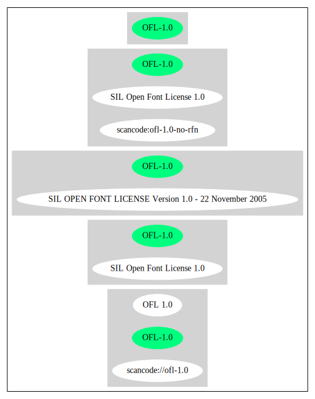

== SIL Open Font License 1.0 (OFL-1.0)

[cols=",",options="header",]
|===
|Key |Value
|Fullname |SIL Open Font License 1.0
|Shortname |OFL-1.0
|Rating |Unknown
|Classification |NoCopyleft
|===

*Other Names:*

* `+scancode://ofl-1.0+`
* `+OFL 1.0+`

=== Comments on (easy) usability

* **↑**``The following restriction on distributions, which is part of
OFL, has been widely accepted by open source projects when it is applied
to fonts: 1) Neither the Font Software nor any of its individual
components, in Original or Modified Versions, may be sold by itself.''
(source: https://wiki.debian.org/DFSGLicenses[Debian Free Software
Guidelines])

=== General Comments

* ``Per SPDX.org, this license has been superseded. This license was
released in November 2005. '' (source:
https://github.com/nexB/scancode-toolkit/blob/develop/src/licensedcode/data/licenses/ofl-1.0.yml[Scancode])

=== URLs

* *Homepage:*
http://scripts.sil.org/cms/scripts/page.php?item_id=OFL10_web
* *SPDX:* http://spdx.org/licenses/OFL-1.0.json

=== Text

....
SIL OPEN FONT LICENSE 

Version 1.0 - 22 November 2005 

PREAMBLE 
The goals of the Open Font License (OFL) are to stimulate worldwide 
development of cooperative font projects, to support the font creation 
efforts of academic and linguistic communities, and to provide an open 
framework in which fonts may be shared and improved in partnership with 
others. 

The OFL allows the licensed fonts to be used, studied, modified and 
redistributed freely as long as they are not sold by themselves. The 
fonts, including any derivative works, can be bundled, embedded, 
redistributed and sold with any software provided that the font 
names of derivative works are changed. The fonts and derivatives, 
however, cannot be released under any other type of license. 

DEFINITIONS 
"Font Software" refers to any and all of the following: 

font files 
data files 
source code 
build scripts 
documentation 
"Reserved Font Name" refers to the Font Software name as seen by 
users and any other names as specified after the copyright statement. 

"Standard Version" refers to the collection of Font Software 
components as distributed by the Copyright Holder. 

"Modified Version" refers to any derivative font software made by 
adding to, deleting, or substituting — in part or in whole -- 
any of the components of the Standard Version, by changing formats 
or by porting the Font Software to a new environment. 

"Author" refers to any designer, engineer, programmer, technical 
writer or other person who contributed to the Font Software. 

PERMISSION & CONDITIONS 
Permission is hereby granted, free of charge, to any person obtaining 
a copy of the Font Software, to use, study, copy, merge, embed, modify, 
redistribute, and sell modified and unmodified copies of the Font 
Software, subject to the following conditions: 

1) Neither the Font Software nor any of its individual components, 
in Standard or Modified Versions, may be sold by itself. 

2) Standard or Modified Versions of the Font Software may be bundled, 
redistributed and sold with any software, provided that each copy 
contains the above copyright notice and this license. These can be 
included either as stand-alone text files, human-readable headers or 
in the appropriate machine-readable metadata fields within text or 
binary files as long as those fields can be easily viewed by the user. 

3) No Modified Version of the Font Software may use the Reserved Font 
Name(s), in part or in whole, unless explicit written permission is 
granted by the Copyright Holder. This restriction applies to all 
references stored in the Font Software, such as the font menu name and 
other font description fields, which are used to differentiate the 
font from others. 

4) The name(s) of the Copyright Holder or the Author(s) of the Font 
Software shall not be used to promote, endorse or advertise any 
Modified Version, except to acknowledge the contribution(s) of the 
Copyright Holder and the Author(s) or with their explicit written 
permission. 

5) The Font Software, modified or unmodified, in part or in whole, 
must be distributed using this license, and may not be distributed 
under any other license. 

TERMINATION 
This license becomes null and void if any of the above conditions are 
not met. 

DISCLAIMER 
THE FONT SOFTWARE IS PROVIDED "AS IS", WITHOUT WARRANTY OF ANY KIND, 
EXPRESS OR IMPLIED, INCLUDING BUT NOT LIMITED TO ANY WARRANTIES OF 
MERCHANTABILITY, FITNESS FOR A PARTICULAR PURPOSE AND NONINFRINGEMENT 
OF COPYRIGHT, PATENT, TRADEMARK, OR OTHER RIGHT. IN NO EVENT SHALL THE 
COPYRIGHT HOLDER BE LIABLE FOR ANY CLAIM, DAMAGES OR OTHER LIABILITY, 
INCLUDING ANY GENERAL, SPECIAL, INDIRECT, INCIDENTAL, OR CONSEQUENTIAL 
DAMAGES, WHETHER IN AN ACTION OF CONTRACT, TORT OR OTHERWISE, ARISING 
FROM, OUT OF THE USE OR INABILITY TO USE THE FONT SOFTWARE OR FROM 
OTHER DEALINGS IN THE FONT SOFTWARE.
....

'''''

=== Raw Data

....
{
    "__impliedNames": [
        "OFL-1.0",
        "SIL Open Font License 1.0",
        "scancode://ofl-1.0",
        "OFL 1.0"
    ],
    "__impliedId": "OFL-1.0",
    "__impliedAmbiguousNames": [
        "The SIL Open Font License"
    ],
    "__impliedComments": [
        [
            "Scancode",
            [
                "Per SPDX.org, this license has been superseded. This license was released\nin November 2005.\n"
            ]
        ]
    ],
    "facts": {
        "SPDX": {
            "isSPDXLicenseDeprecated": false,
            "spdxFullName": "SIL Open Font License 1.0",
            "spdxDetailsURL": "http://spdx.org/licenses/OFL-1.0.json",
            "_sourceURL": "https://spdx.org/licenses/OFL-1.0.html",
            "spdxLicIsOSIApproved": false,
            "spdxSeeAlso": [
                "http://scripts.sil.org/cms/scripts/page.php?item_id=OFL10_web"
            ],
            "_implications": {
                "__impliedNames": [
                    "OFL-1.0",
                    "SIL Open Font License 1.0"
                ],
                "__impliedId": "OFL-1.0",
                "__isOsiApproved": false,
                "__impliedURLs": [
                    [
                        "SPDX",
                        "http://spdx.org/licenses/OFL-1.0.json"
                    ],
                    [
                        null,
                        "http://scripts.sil.org/cms/scripts/page.php?item_id=OFL10_web"
                    ]
                ]
            },
            "spdxLicenseId": "OFL-1.0"
        },
        "Scancode": {
            "otherUrls": null,
            "homepageUrl": "http://scripts.sil.org/cms/scripts/page.php?item_id=OFL10_web",
            "shortName": "OFL 1.0",
            "textUrls": null,
            "text": "SIL OPEN FONT LICENSE \n\nVersion 1.0 - 22 November 2005 \n\nPREAMBLE \nThe goals of the Open Font License (OFL) are to stimulate worldwide \ndevelopment of cooperative font projects, to support the font creation \nefforts of academic and linguistic communities, and to provide an open \nframework in which fonts may be shared and improved in partnership with \nothers. \n\nThe OFL allows the licensed fonts to be used, studied, modified and \nredistributed freely as long as they are not sold by themselves. The \nfonts, including any derivative works, can be bundled, embedded, \nredistributed and sold with any software provided that the font \nnames of derivative works are changed. The fonts and derivatives, \nhowever, cannot be released under any other type of license. \n\nDEFINITIONS \n\"Font Software\" refers to any and all of the following: \n\nfont files \ndata files \nsource code \nbuild scripts \ndocumentation \n\"Reserved Font Name\" refers to the Font Software name as seen by \nusers and any other names as specified after the copyright statement. \n\n\"Standard Version\" refers to the collection of Font Software \ncomponents as distributed by the Copyright Holder. \n\n\"Modified Version\" refers to any derivative font software made by \nadding to, deleting, or substituting — in part or in whole -- \nany of the components of the Standard Version, by changing formats \nor by porting the Font Software to a new environment. \n\n\"Author\" refers to any designer, engineer, programmer, technical \nwriter or other person who contributed to the Font Software. \n\nPERMISSION & CONDITIONS \nPermission is hereby granted, free of charge, to any person obtaining \na copy of the Font Software, to use, study, copy, merge, embed, modify, \nredistribute, and sell modified and unmodified copies of the Font \nSoftware, subject to the following conditions: \n\n1) Neither the Font Software nor any of its individual components, \nin Standard or Modified Versions, may be sold by itself. \n\n2) Standard or Modified Versions of the Font Software may be bundled, \nredistributed and sold with any software, provided that each copy \ncontains the above copyright notice and this license. These can be \nincluded either as stand-alone text files, human-readable headers or \nin the appropriate machine-readable metadata fields within text or \nbinary files as long as those fields can be easily viewed by the user. \n\n3) No Modified Version of the Font Software may use the Reserved Font \nName(s), in part or in whole, unless explicit written permission is \ngranted by the Copyright Holder. This restriction applies to all \nreferences stored in the Font Software, such as the font menu name and \nother font description fields, which are used to differentiate the \nfont from others. \n\n4) The name(s) of the Copyright Holder or the Author(s) of the Font \nSoftware shall not be used to promote, endorse or advertise any \nModified Version, except to acknowledge the contribution(s) of the \nCopyright Holder and the Author(s) or with their explicit written \npermission. \n\n5) The Font Software, modified or unmodified, in part or in whole, \nmust be distributed using this license, and may not be distributed \nunder any other license. \n\nTERMINATION \nThis license becomes null and void if any of the above conditions are \nnot met. \n\nDISCLAIMER \nTHE FONT SOFTWARE IS PROVIDED \"AS IS\", WITHOUT WARRANTY OF ANY KIND, \nEXPRESS OR IMPLIED, INCLUDING BUT NOT LIMITED TO ANY WARRANTIES OF \nMERCHANTABILITY, FITNESS FOR A PARTICULAR PURPOSE AND NONINFRINGEMENT \nOF COPYRIGHT, PATENT, TRADEMARK, OR OTHER RIGHT. IN NO EVENT SHALL THE \nCOPYRIGHT HOLDER BE LIABLE FOR ANY CLAIM, DAMAGES OR OTHER LIABILITY, \nINCLUDING ANY GENERAL, SPECIAL, INDIRECT, INCIDENTAL, OR CONSEQUENTIAL \nDAMAGES, WHETHER IN AN ACTION OF CONTRACT, TORT OR OTHERWISE, ARISING \nFROM, OUT OF THE USE OR INABILITY TO USE THE FONT SOFTWARE OR FROM \nOTHER DEALINGS IN THE FONT SOFTWARE.",
            "category": "Permissive",
            "osiUrl": null,
            "owner": "SIL International",
            "_sourceURL": "https://github.com/nexB/scancode-toolkit/blob/develop/src/licensedcode/data/licenses/ofl-1.0.yml",
            "key": "ofl-1.0",
            "name": "SIL Open Font License 1.0",
            "spdxId": "OFL-1.0",
            "notes": "Per SPDX.org, this license has been superseded. This license was released\nin November 2005.\n",
            "_implications": {
                "__impliedNames": [
                    "scancode://ofl-1.0",
                    "OFL 1.0",
                    "OFL-1.0"
                ],
                "__impliedId": "OFL-1.0",
                "__impliedComments": [
                    [
                        "Scancode",
                        [
                            "Per SPDX.org, this license has been superseded. This license was released\nin November 2005.\n"
                        ]
                    ]
                ],
                "__impliedCopyleft": [
                    [
                        "Scancode",
                        "NoCopyleft"
                    ]
                ],
                "__calculatedCopyleft": "NoCopyleft",
                "__impliedText": "SIL OPEN FONT LICENSE \n\nVersion 1.0 - 22 November 2005 \n\nPREAMBLE \nThe goals of the Open Font License (OFL) are to stimulate worldwide \ndevelopment of cooperative font projects, to support the font creation \nefforts of academic and linguistic communities, and to provide an open \nframework in which fonts may be shared and improved in partnership with \nothers. \n\nThe OFL allows the licensed fonts to be used, studied, modified and \nredistributed freely as long as they are not sold by themselves. The \nfonts, including any derivative works, can be bundled, embedded, \nredistributed and sold with any software provided that the font \nnames of derivative works are changed. The fonts and derivatives, \nhowever, cannot be released under any other type of license. \n\nDEFINITIONS \n\"Font Software\" refers to any and all of the following: \n\nfont files \ndata files \nsource code \nbuild scripts \ndocumentation \n\"Reserved Font Name\" refers to the Font Software name as seen by \nusers and any other names as specified after the copyright statement. \n\n\"Standard Version\" refers to the collection of Font Software \ncomponents as distributed by the Copyright Holder. \n\n\"Modified Version\" refers to any derivative font software made by \nadding to, deleting, or substituting — in part or in whole -- \nany of the components of the Standard Version, by changing formats \nor by porting the Font Software to a new environment. \n\n\"Author\" refers to any designer, engineer, programmer, technical \nwriter or other person who contributed to the Font Software. \n\nPERMISSION & CONDITIONS \nPermission is hereby granted, free of charge, to any person obtaining \na copy of the Font Software, to use, study, copy, merge, embed, modify, \nredistribute, and sell modified and unmodified copies of the Font \nSoftware, subject to the following conditions: \n\n1) Neither the Font Software nor any of its individual components, \nin Standard or Modified Versions, may be sold by itself. \n\n2) Standard or Modified Versions of the Font Software may be bundled, \nredistributed and sold with any software, provided that each copy \ncontains the above copyright notice and this license. These can be \nincluded either as stand-alone text files, human-readable headers or \nin the appropriate machine-readable metadata fields within text or \nbinary files as long as those fields can be easily viewed by the user. \n\n3) No Modified Version of the Font Software may use the Reserved Font \nName(s), in part or in whole, unless explicit written permission is \ngranted by the Copyright Holder. This restriction applies to all \nreferences stored in the Font Software, such as the font menu name and \nother font description fields, which are used to differentiate the \nfont from others. \n\n4) The name(s) of the Copyright Holder or the Author(s) of the Font \nSoftware shall not be used to promote, endorse or advertise any \nModified Version, except to acknowledge the contribution(s) of the \nCopyright Holder and the Author(s) or with their explicit written \npermission. \n\n5) The Font Software, modified or unmodified, in part or in whole, \nmust be distributed using this license, and may not be distributed \nunder any other license. \n\nTERMINATION \nThis license becomes null and void if any of the above conditions are \nnot met. \n\nDISCLAIMER \nTHE FONT SOFTWARE IS PROVIDED \"AS IS\", WITHOUT WARRANTY OF ANY KIND, \nEXPRESS OR IMPLIED, INCLUDING BUT NOT LIMITED TO ANY WARRANTIES OF \nMERCHANTABILITY, FITNESS FOR A PARTICULAR PURPOSE AND NONINFRINGEMENT \nOF COPYRIGHT, PATENT, TRADEMARK, OR OTHER RIGHT. IN NO EVENT SHALL THE \nCOPYRIGHT HOLDER BE LIABLE FOR ANY CLAIM, DAMAGES OR OTHER LIABILITY, \nINCLUDING ANY GENERAL, SPECIAL, INDIRECT, INCIDENTAL, OR CONSEQUENTIAL \nDAMAGES, WHETHER IN AN ACTION OF CONTRACT, TORT OR OTHERWISE, ARISING \nFROM, OUT OF THE USE OR INABILITY TO USE THE FONT SOFTWARE OR FROM \nOTHER DEALINGS IN THE FONT SOFTWARE.",
                "__impliedURLs": [
                    [
                        "Homepage",
                        "http://scripts.sil.org/cms/scripts/page.php?item_id=OFL10_web"
                    ]
                ]
            }
        },
        "Debian Free Software Guidelines": {
            "LicenseName": "The SIL Open Font License",
            "State": "DFSGCompatible",
            "_sourceURL": "https://wiki.debian.org/DFSGLicenses",
            "_implications": {
                "__impliedNames": [
                    "OFL-1.0"
                ],
                "__impliedAmbiguousNames": [
                    "The SIL Open Font License"
                ],
                "__impliedJudgement": [
                    [
                        "Debian Free Software Guidelines",
                        {
                            "tag": "PositiveJudgement",
                            "contents": "The following restriction on distributions, which is part of OFL, has been widely accepted by open source projects when it is applied to fonts: 1) Neither the Font Software nor any of its individual components, in Original or Modified Versions, may be sold by itself."
                        }
                    ]
                ]
            },
            "Comment": "The following restriction on distributions, which is part of OFL, has been widely accepted by open source projects when it is applied to fonts: 1) Neither the Font Software nor any of its individual components, in Original or Modified Versions, may be sold by itself.",
            "LicenseId": "OFL-1.0"
        }
    },
    "__impliedJudgement": [
        [
            "Debian Free Software Guidelines",
            {
                "tag": "PositiveJudgement",
                "contents": "The following restriction on distributions, which is part of OFL, has been widely accepted by open source projects when it is applied to fonts: 1) Neither the Font Software nor any of its individual components, in Original or Modified Versions, may be sold by itself."
            }
        ]
    ],
    "__impliedCopyleft": [
        [
            "Scancode",
            "NoCopyleft"
        ]
    ],
    "__calculatedCopyleft": "NoCopyleft",
    "__isOsiApproved": false,
    "__impliedText": "SIL OPEN FONT LICENSE \n\nVersion 1.0 - 22 November 2005 \n\nPREAMBLE \nThe goals of the Open Font License (OFL) are to stimulate worldwide \ndevelopment of cooperative font projects, to support the font creation \nefforts of academic and linguistic communities, and to provide an open \nframework in which fonts may be shared and improved in partnership with \nothers. \n\nThe OFL allows the licensed fonts to be used, studied, modified and \nredistributed freely as long as they are not sold by themselves. The \nfonts, including any derivative works, can be bundled, embedded, \nredistributed and sold with any software provided that the font \nnames of derivative works are changed. The fonts and derivatives, \nhowever, cannot be released under any other type of license. \n\nDEFINITIONS \n\"Font Software\" refers to any and all of the following: \n\nfont files \ndata files \nsource code \nbuild scripts \ndocumentation \n\"Reserved Font Name\" refers to the Font Software name as seen by \nusers and any other names as specified after the copyright statement. \n\n\"Standard Version\" refers to the collection of Font Software \ncomponents as distributed by the Copyright Holder. \n\n\"Modified Version\" refers to any derivative font software made by \nadding to, deleting, or substituting — in part or in whole -- \nany of the components of the Standard Version, by changing formats \nor by porting the Font Software to a new environment. \n\n\"Author\" refers to any designer, engineer, programmer, technical \nwriter or other person who contributed to the Font Software. \n\nPERMISSION & CONDITIONS \nPermission is hereby granted, free of charge, to any person obtaining \na copy of the Font Software, to use, study, copy, merge, embed, modify, \nredistribute, and sell modified and unmodified copies of the Font \nSoftware, subject to the following conditions: \n\n1) Neither the Font Software nor any of its individual components, \nin Standard or Modified Versions, may be sold by itself. \n\n2) Standard or Modified Versions of the Font Software may be bundled, \nredistributed and sold with any software, provided that each copy \ncontains the above copyright notice and this license. These can be \nincluded either as stand-alone text files, human-readable headers or \nin the appropriate machine-readable metadata fields within text or \nbinary files as long as those fields can be easily viewed by the user. \n\n3) No Modified Version of the Font Software may use the Reserved Font \nName(s), in part or in whole, unless explicit written permission is \ngranted by the Copyright Holder. This restriction applies to all \nreferences stored in the Font Software, such as the font menu name and \nother font description fields, which are used to differentiate the \nfont from others. \n\n4) The name(s) of the Copyright Holder or the Author(s) of the Font \nSoftware shall not be used to promote, endorse or advertise any \nModified Version, except to acknowledge the contribution(s) of the \nCopyright Holder and the Author(s) or with their explicit written \npermission. \n\n5) The Font Software, modified or unmodified, in part or in whole, \nmust be distributed using this license, and may not be distributed \nunder any other license. \n\nTERMINATION \nThis license becomes null and void if any of the above conditions are \nnot met. \n\nDISCLAIMER \nTHE FONT SOFTWARE IS PROVIDED \"AS IS\", WITHOUT WARRANTY OF ANY KIND, \nEXPRESS OR IMPLIED, INCLUDING BUT NOT LIMITED TO ANY WARRANTIES OF \nMERCHANTABILITY, FITNESS FOR A PARTICULAR PURPOSE AND NONINFRINGEMENT \nOF COPYRIGHT, PATENT, TRADEMARK, OR OTHER RIGHT. IN NO EVENT SHALL THE \nCOPYRIGHT HOLDER BE LIABLE FOR ANY CLAIM, DAMAGES OR OTHER LIABILITY, \nINCLUDING ANY GENERAL, SPECIAL, INDIRECT, INCIDENTAL, OR CONSEQUENTIAL \nDAMAGES, WHETHER IN AN ACTION OF CONTRACT, TORT OR OTHERWISE, ARISING \nFROM, OUT OF THE USE OR INABILITY TO USE THE FONT SOFTWARE OR FROM \nOTHER DEALINGS IN THE FONT SOFTWARE.",
    "__impliedURLs": [
        [
            "SPDX",
            "http://spdx.org/licenses/OFL-1.0.json"
        ],
        [
            null,
            "http://scripts.sil.org/cms/scripts/page.php?item_id=OFL10_web"
        ],
        [
            "Homepage",
            "http://scripts.sil.org/cms/scripts/page.php?item_id=OFL10_web"
        ]
    ]
}
....

'''''

=== Dot Cluster Graph

