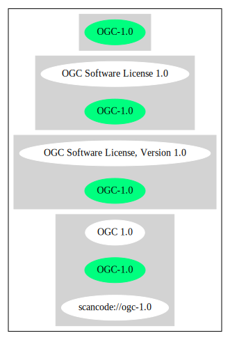

== OGC Software License, Version 1.0 (OGC-1.0)

[cols=",",options="header",]
|===
|Key |Value
|Fullname |OGC Software License, Version 1.0
|Shortname |OGC-1.0
|Rating |Unknown, probably Attention or Stop or No-Go
|===

=== Comments on (easy) usability

=== General Comments

=== URLs

* *SPDX:* http://spdx.org/licenses/OGC-1.0.json
* https://www.ogc.org/ogc/software/1.0

'''''

=== Raw Data

==== Facts

* https://spdx.org/licenses/OGC-1.0.html[SPDX]

==== Raw JSON

....
{
    "__impliedNames": [
        "OGC-1.0",
        "OGC Software License, Version 1.0"
    ],
    "__impliedId": "OGC-1.0",
    "facts": {
        "SPDX": {
            "isSPDXLicenseDeprecated": false,
            "spdxFullName": "OGC Software License, Version 1.0",
            "spdxDetailsURL": "http://spdx.org/licenses/OGC-1.0.json",
            "_sourceURL": "https://spdx.org/licenses/OGC-1.0.html",
            "spdxLicIsOSIApproved": false,
            "spdxSeeAlso": [
                "https://www.ogc.org/ogc/software/1.0"
            ],
            "_implications": {
                "__impliedNames": [
                    "OGC-1.0",
                    "OGC Software License, Version 1.0"
                ],
                "__impliedId": "OGC-1.0",
                "__isOsiApproved": false,
                "__impliedURLs": [
                    [
                        "SPDX",
                        "http://spdx.org/licenses/OGC-1.0.json"
                    ],
                    [
                        null,
                        "https://www.ogc.org/ogc/software/1.0"
                    ]
                ]
            },
            "spdxLicenseId": "OGC-1.0"
        }
    },
    "__isOsiApproved": false,
    "__impliedURLs": [
        [
            "SPDX",
            "http://spdx.org/licenses/OGC-1.0.json"
        ],
        [
            null,
            "https://www.ogc.org/ogc/software/1.0"
        ]
    ]
}
....

'''''

=== Dot Cluster Graph

