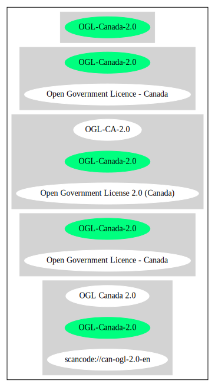

== Open Government Licence - Canada (OGL-Canada-2.0)

[cols=",",options="header",]
|===
|Key |Value
|Fullname |Open Government Licence - Canada
|Shortname |OGL-Canada-2.0
|Rating |Unknown, probably Attention or Stop or No-Go
|===

*Other Names:*

* `+Open Government License 2.0 (Canada)+`

=== Comments on (easy) usability

=== General Comments

=== URLs

* *SPDX:* http://spdx.org/licenses/OGL-Canada-2.0.json
* https://open.canada.ca/en/open-government-licence-canada

'''''

=== Raw Data

==== Facts

* https://spdx.org/licenses/OGL-Canada-2.0.html[SPDX]
* https://github.com/okfn/licenses/blob/master/licenses.csv[Open
Knowledge International]

==== Raw JSON

....
{
    "__impliedNames": [
        "OGL-Canada-2.0",
        "Open Government Licence - Canada",
        "Open Government License 2.0 (Canada)"
    ],
    "__impliedId": "OGL-Canada-2.0",
    "facts": {
        "Open Knowledge International": {
            "is_generic": false,
            "status": "active",
            "domain_software": false,
            "url": "https://open.canada.ca/en/open-government-licence-canada",
            "maintainer": "Government of Canada",
            "od_conformance": "approved",
            "_sourceURL": "https://github.com/okfn/licenses/blob/master/licenses.csv",
            "domain_data": true,
            "osd_conformance": "not reviewed",
            "id": "OGL-Canada-2.0",
            "title": "Open Government License 2.0 (Canada)",
            "_implications": {
                "__impliedNames": [
                    "OGL-Canada-2.0",
                    "Open Government License 2.0 (Canada)"
                ],
                "__impliedId": "OGL-Canada-2.0",
                "__impliedURLs": [
                    [
                        null,
                        "https://open.canada.ca/en/open-government-licence-canada"
                    ]
                ]
            },
            "domain_content": true
        },
        "SPDX": {
            "isSPDXLicenseDeprecated": false,
            "spdxFullName": "Open Government Licence - Canada",
            "spdxDetailsURL": "http://spdx.org/licenses/OGL-Canada-2.0.json",
            "_sourceURL": "https://spdx.org/licenses/OGL-Canada-2.0.html",
            "spdxLicIsOSIApproved": false,
            "spdxSeeAlso": [
                "https://open.canada.ca/en/open-government-licence-canada"
            ],
            "_implications": {
                "__impliedNames": [
                    "OGL-Canada-2.0",
                    "Open Government Licence - Canada"
                ],
                "__impliedId": "OGL-Canada-2.0",
                "__isOsiApproved": false,
                "__impliedURLs": [
                    [
                        "SPDX",
                        "http://spdx.org/licenses/OGL-Canada-2.0.json"
                    ],
                    [
                        null,
                        "https://open.canada.ca/en/open-government-licence-canada"
                    ]
                ]
            },
            "spdxLicenseId": "OGL-Canada-2.0"
        }
    },
    "__isOsiApproved": false,
    "__impliedURLs": [
        [
            "SPDX",
            "http://spdx.org/licenses/OGL-Canada-2.0.json"
        ],
        [
            null,
            "https://open.canada.ca/en/open-government-licence-canada"
        ]
    ]
}
....

'''''

=== Dot Cluster Graph

