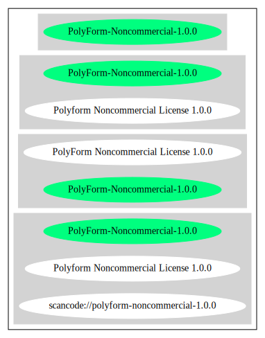

== PolyForm Noncommercial License 1.0.0 (PolyForm-Noncommercial-1.0.0)

[cols=",",options="header",]
|===
|Key |Value
|Fullname |PolyForm Noncommercial License 1.0.0
|Shortname |PolyForm-Noncommercial-1.0.0
|Rating |Unknown, probably Attention or Stop or No-Go
|===

*Other Names:*

* `+scancode://polyform-noncommercial-1.0.0+`

=== Comments on (easy) usability

=== General Comments

=== URLs

* *Homepage:* https://polyformproject.org/licenses/noncommercial/1.0.0/
* *SPDX:* http://spdx.org/licenses/PolyForm-Noncommercial-1.0.0.json
* https://polyformproject.org/licenses/noncommercial/1.0.0

=== Text

....
# Polyform Noncommercial License 1.0.0

<https://polyformproject.org/licenses/noncommercial/1.0.0>

## Acceptance

In order to get any license under these terms, you must agree
to them as both strict obligations and conditions to all
your licenses.

## Copyright License

The licensor grants you a copyright license for the
software to do everything you might do with the software
that would otherwise infringe the licensor's copyright
in it for any permitted purpose.  However, you may
only distribute the software according to [Distribution
License](#distribution-license) and make changes or new works
based on the software according to [Changes and New Works
License](#changes-and-new-works-license).

## Distribution License

The licensor grants you an additional copyright license
to distribute copies of the software.  Your license
to distribute covers distributing the software with
changes and new works permitted by [Changes and New Works
License](#changes-and-new-works-license).

## Notices

You must ensure that anyone who gets a copy of any part of
the software from you also gets a copy of these terms or the
URL for them above, as well as copies of any plain-text lines
beginning with `Required Notice:` that the licensor provided
with the software.  For example:

> Required Notice: Copyright Yoyodyne, Inc. (http://example.com)

## Changes and New Works License

The licensor grants you an additional copyright license to
make changes and new works based on the software for any
permitted purpose.

## Patent License

The licensor grants you a patent license for the software that
covers patent claims the licensor can license, or becomes able
to license, that you would infringe by using the software.

## Noncommercial Purposes

Any noncommercial purpose is a permitted purpose.

## Personal Uses

Personal use for research, experiment, and testing for
the benefit of public knowledge, personal study, private
entertainment, hobby projects, amateur pursuits, or religious
observance, without any anticipated commercial application,
is use for a permitted purpose.

## Noncommercial Organizations

Use by any charitable organization, educational institution,
public research organization, public safety or health
organization, environmental protection organization,
or government institution is use for a permitted purpose
regardless of the source of funding or obligations resulting
from the funding.

## Fair Use

You may have "fair use" rights for the software under the
law. These terms do not limit them.

## No Other Rights

These terms do not allow you to sublicense or transfer any of
your licenses to anyone else, or prevent the licensor from
granting licenses to anyone else.  These terms do not imply
any other licenses.

## Patent Defense

If you make any written claim that the software infringes or
contributes to infringement of any patent, your patent license
for the software granted under these terms ends immediately. If
your company makes such a claim, your patent license ends
immediately for work on behalf of your company.

## Violations

The first time you are notified in writing that you have
violated any of these terms, or done anything with the software
not covered by your licenses, your licenses can nonetheless
continue if you come into full compliance with these terms,
and take practical steps to correct past violations, within
32 days of receiving notice.  Otherwise, all your licenses
end immediately.

## No Liability

***As far as the law allows, the software comes as is, without
any warranty or condition, and the licensor will not be liable
to you for any damages arising out of these terms or the use
or nature of the software, under any kind of legal claim.***

## Definitions

The **licensor** is the individual or entity offering these
terms, and the **software** is the software the licensor makes
available under these terms.

**You** refers to the individual or entity agreeing to these
terms.

**Your company** is any legal entity, sole proprietorship,
or other kind of organization that you work for, plus all
organizations that have control over, are under the control of,
or are under common control with that organization.  **Control**
means ownership of substantially all the assets of an entity,
or the power to direct its management and policies by vote,
contract, or otherwise.  Control can be direct or indirect.

**Your licenses** are all the licenses granted to you for the
software under these terms.

**Use** means anything you do with the software requiring one
of your licenses.
....

'''''

=== Raw Data

* SPDX
* Scancode

....
{
    "__impliedNames": [
        "PolyForm-Noncommercial-1.0.0",
        "PolyForm Noncommercial License 1.0.0",
        "scancode://polyform-noncommercial-1.0.0",
        "Polyform Noncommercial License 1.0.0"
    ],
    "__impliedId": "PolyForm-Noncommercial-1.0.0",
    "facts": {
        "SPDX": {
            "isSPDXLicenseDeprecated": false,
            "spdxFullName": "PolyForm Noncommercial License 1.0.0",
            "spdxDetailsURL": "http://spdx.org/licenses/PolyForm-Noncommercial-1.0.0.json",
            "_sourceURL": "https://spdx.org/licenses/PolyForm-Noncommercial-1.0.0.html",
            "spdxLicIsOSIApproved": false,
            "spdxSeeAlso": [
                "https://polyformproject.org/licenses/noncommercial/1.0.0"
            ],
            "_implications": {
                "__impliedNames": [
                    "PolyForm-Noncommercial-1.0.0",
                    "PolyForm Noncommercial License 1.0.0"
                ],
                "__impliedId": "PolyForm-Noncommercial-1.0.0",
                "__isOsiApproved": false,
                "__impliedURLs": [
                    [
                        "SPDX",
                        "http://spdx.org/licenses/PolyForm-Noncommercial-1.0.0.json"
                    ],
                    [
                        null,
                        "https://polyformproject.org/licenses/noncommercial/1.0.0"
                    ]
                ]
            },
            "spdxLicenseId": "PolyForm-Noncommercial-1.0.0"
        },
        "Scancode": {
            "otherUrls": null,
            "homepageUrl": "https://polyformproject.org/licenses/noncommercial/1.0.0/",
            "shortName": "Polyform Noncommercial License 1.0.0",
            "textUrls": null,
            "text": "# Polyform Noncommercial License 1.0.0\n\n<https://polyformproject.org/licenses/noncommercial/1.0.0>\n\n## Acceptance\n\nIn order to get any license under these terms, you must agree\nto them as both strict obligations and conditions to all\nyour licenses.\n\n## Copyright License\n\nThe licensor grants you a copyright license for the\nsoftware to do everything you might do with the software\nthat would otherwise infringe the licensor's copyright\nin it for any permitted purpose.  However, you may\nonly distribute the software according to [Distribution\nLicense](#distribution-license) and make changes or new works\nbased on the software according to [Changes and New Works\nLicense](#changes-and-new-works-license).\n\n## Distribution License\n\nThe licensor grants you an additional copyright license\nto distribute copies of the software.  Your license\nto distribute covers distributing the software with\nchanges and new works permitted by [Changes and New Works\nLicense](#changes-and-new-works-license).\n\n## Notices\n\nYou must ensure that anyone who gets a copy of any part of\nthe software from you also gets a copy of these terms or the\nURL for them above, as well as copies of any plain-text lines\nbeginning with `Required Notice:` that the licensor provided\nwith the software.  For example:\n\n> Required Notice: Copyright Yoyodyne, Inc. (http://example.com)\n\n## Changes and New Works License\n\nThe licensor grants you an additional copyright license to\nmake changes and new works based on the software for any\npermitted purpose.\n\n## Patent License\n\nThe licensor grants you a patent license for the software that\ncovers patent claims the licensor can license, or becomes able\nto license, that you would infringe by using the software.\n\n## Noncommercial Purposes\n\nAny noncommercial purpose is a permitted purpose.\n\n## Personal Uses\n\nPersonal use for research, experiment, and testing for\nthe benefit of public knowledge, personal study, private\nentertainment, hobby projects, amateur pursuits, or religious\nobservance, without any anticipated commercial application,\nis use for a permitted purpose.\n\n## Noncommercial Organizations\n\nUse by any charitable organization, educational institution,\npublic research organization, public safety or health\norganization, environmental protection organization,\nor government institution is use for a permitted purpose\nregardless of the source of funding or obligations resulting\nfrom the funding.\n\n## Fair Use\n\nYou may have \"fair use\" rights for the software under the\nlaw. These terms do not limit them.\n\n## No Other Rights\n\nThese terms do not allow you to sublicense or transfer any of\nyour licenses to anyone else, or prevent the licensor from\ngranting licenses to anyone else.  These terms do not imply\nany other licenses.\n\n## Patent Defense\n\nIf you make any written claim that the software infringes or\ncontributes to infringement of any patent, your patent license\nfor the software granted under these terms ends immediately. If\nyour company makes such a claim, your patent license ends\nimmediately for work on behalf of your company.\n\n## Violations\n\nThe first time you are notified in writing that you have\nviolated any of these terms, or done anything with the software\nnot covered by your licenses, your licenses can nonetheless\ncontinue if you come into full compliance with these terms,\nand take practical steps to correct past violations, within\n32 days of receiving notice.  Otherwise, all your licenses\nend immediately.\n\n## No Liability\n\n***As far as the law allows, the software comes as is, without\nany warranty or condition, and the licensor will not be liable\nto you for any damages arising out of these terms or the use\nor nature of the software, under any kind of legal claim.***\n\n## Definitions\n\nThe **licensor** is the individual or entity offering these\nterms, and the **software** is the software the licensor makes\navailable under these terms.\n\n**You** refers to the individual or entity agreeing to these\nterms.\n\n**Your company** is any legal entity, sole proprietorship,\nor other kind of organization that you work for, plus all\norganizations that have control over, are under the control of,\nor are under common control with that organization.  **Control**\nmeans ownership of substantially all the assets of an entity,\nor the power to direct its management and policies by vote,\ncontract, or otherwise.  Control can be direct or indirect.\n\n**Your licenses** are all the licenses granted to you for the\nsoftware under these terms.\n\n**Use** means anything you do with the software requiring one\nof your licenses.",
            "category": "Source-available",
            "osiUrl": null,
            "owner": "Polyform",
            "_sourceURL": "https://github.com/nexB/scancode-toolkit/blob/develop/src/licensedcode/data/licenses/polyform-noncommercial-1.0.0.yml",
            "key": "polyform-noncommercial-1.0.0",
            "name": "Polyform Noncommercial License 1.0.0",
            "spdxId": null,
            "notes": null,
            "_implications": {
                "__impliedNames": [
                    "scancode://polyform-noncommercial-1.0.0",
                    "Polyform Noncommercial License 1.0.0"
                ],
                "__impliedText": "# Polyform Noncommercial License 1.0.0\n\n<https://polyformproject.org/licenses/noncommercial/1.0.0>\n\n## Acceptance\n\nIn order to get any license under these terms, you must agree\nto them as both strict obligations and conditions to all\nyour licenses.\n\n## Copyright License\n\nThe licensor grants you a copyright license for the\nsoftware to do everything you might do with the software\nthat would otherwise infringe the licensor's copyright\nin it for any permitted purpose.  However, you may\nonly distribute the software according to [Distribution\nLicense](#distribution-license) and make changes or new works\nbased on the software according to [Changes and New Works\nLicense](#changes-and-new-works-license).\n\n## Distribution License\n\nThe licensor grants you an additional copyright license\nto distribute copies of the software.  Your license\nto distribute covers distributing the software with\nchanges and new works permitted by [Changes and New Works\nLicense](#changes-and-new-works-license).\n\n## Notices\n\nYou must ensure that anyone who gets a copy of any part of\nthe software from you also gets a copy of these terms or the\nURL for them above, as well as copies of any plain-text lines\nbeginning with `Required Notice:` that the licensor provided\nwith the software.  For example:\n\n> Required Notice: Copyright Yoyodyne, Inc. (http://example.com)\n\n## Changes and New Works License\n\nThe licensor grants you an additional copyright license to\nmake changes and new works based on the software for any\npermitted purpose.\n\n## Patent License\n\nThe licensor grants you a patent license for the software that\ncovers patent claims the licensor can license, or becomes able\nto license, that you would infringe by using the software.\n\n## Noncommercial Purposes\n\nAny noncommercial purpose is a permitted purpose.\n\n## Personal Uses\n\nPersonal use for research, experiment, and testing for\nthe benefit of public knowledge, personal study, private\nentertainment, hobby projects, amateur pursuits, or religious\nobservance, without any anticipated commercial application,\nis use for a permitted purpose.\n\n## Noncommercial Organizations\n\nUse by any charitable organization, educational institution,\npublic research organization, public safety or health\norganization, environmental protection organization,\nor government institution is use for a permitted purpose\nregardless of the source of funding or obligations resulting\nfrom the funding.\n\n## Fair Use\n\nYou may have \"fair use\" rights for the software under the\nlaw. These terms do not limit them.\n\n## No Other Rights\n\nThese terms do not allow you to sublicense or transfer any of\nyour licenses to anyone else, or prevent the licensor from\ngranting licenses to anyone else.  These terms do not imply\nany other licenses.\n\n## Patent Defense\n\nIf you make any written claim that the software infringes or\ncontributes to infringement of any patent, your patent license\nfor the software granted under these terms ends immediately. If\nyour company makes such a claim, your patent license ends\nimmediately for work on behalf of your company.\n\n## Violations\n\nThe first time you are notified in writing that you have\nviolated any of these terms, or done anything with the software\nnot covered by your licenses, your licenses can nonetheless\ncontinue if you come into full compliance with these terms,\nand take practical steps to correct past violations, within\n32 days of receiving notice.  Otherwise, all your licenses\nend immediately.\n\n## No Liability\n\n***As far as the law allows, the software comes as is, without\nany warranty or condition, and the licensor will not be liable\nto you for any damages arising out of these terms or the use\nor nature of the software, under any kind of legal claim.***\n\n## Definitions\n\nThe **licensor** is the individual or entity offering these\nterms, and the **software** is the software the licensor makes\navailable under these terms.\n\n**You** refers to the individual or entity agreeing to these\nterms.\n\n**Your company** is any legal entity, sole proprietorship,\nor other kind of organization that you work for, plus all\norganizations that have control over, are under the control of,\nor are under common control with that organization.  **Control**\nmeans ownership of substantially all the assets of an entity,\nor the power to direct its management and policies by vote,\ncontract, or otherwise.  Control can be direct or indirect.\n\n**Your licenses** are all the licenses granted to you for the\nsoftware under these terms.\n\n**Use** means anything you do with the software requiring one\nof your licenses.",
                "__impliedURLs": [
                    [
                        "Homepage",
                        "https://polyformproject.org/licenses/noncommercial/1.0.0/"
                    ]
                ]
            }
        }
    },
    "__isOsiApproved": false,
    "__impliedText": "# Polyform Noncommercial License 1.0.0\n\n<https://polyformproject.org/licenses/noncommercial/1.0.0>\n\n## Acceptance\n\nIn order to get any license under these terms, you must agree\nto them as both strict obligations and conditions to all\nyour licenses.\n\n## Copyright License\n\nThe licensor grants you a copyright license for the\nsoftware to do everything you might do with the software\nthat would otherwise infringe the licensor's copyright\nin it for any permitted purpose.  However, you may\nonly distribute the software according to [Distribution\nLicense](#distribution-license) and make changes or new works\nbased on the software according to [Changes and New Works\nLicense](#changes-and-new-works-license).\n\n## Distribution License\n\nThe licensor grants you an additional copyright license\nto distribute copies of the software.  Your license\nto distribute covers distributing the software with\nchanges and new works permitted by [Changes and New Works\nLicense](#changes-and-new-works-license).\n\n## Notices\n\nYou must ensure that anyone who gets a copy of any part of\nthe software from you also gets a copy of these terms or the\nURL for them above, as well as copies of any plain-text lines\nbeginning with `Required Notice:` that the licensor provided\nwith the software.  For example:\n\n> Required Notice: Copyright Yoyodyne, Inc. (http://example.com)\n\n## Changes and New Works License\n\nThe licensor grants you an additional copyright license to\nmake changes and new works based on the software for any\npermitted purpose.\n\n## Patent License\n\nThe licensor grants you a patent license for the software that\ncovers patent claims the licensor can license, or becomes able\nto license, that you would infringe by using the software.\n\n## Noncommercial Purposes\n\nAny noncommercial purpose is a permitted purpose.\n\n## Personal Uses\n\nPersonal use for research, experiment, and testing for\nthe benefit of public knowledge, personal study, private\nentertainment, hobby projects, amateur pursuits, or religious\nobservance, without any anticipated commercial application,\nis use for a permitted purpose.\n\n## Noncommercial Organizations\n\nUse by any charitable organization, educational institution,\npublic research organization, public safety or health\norganization, environmental protection organization,\nor government institution is use for a permitted purpose\nregardless of the source of funding or obligations resulting\nfrom the funding.\n\n## Fair Use\n\nYou may have \"fair use\" rights for the software under the\nlaw. These terms do not limit them.\n\n## No Other Rights\n\nThese terms do not allow you to sublicense or transfer any of\nyour licenses to anyone else, or prevent the licensor from\ngranting licenses to anyone else.  These terms do not imply\nany other licenses.\n\n## Patent Defense\n\nIf you make any written claim that the software infringes or\ncontributes to infringement of any patent, your patent license\nfor the software granted under these terms ends immediately. If\nyour company makes such a claim, your patent license ends\nimmediately for work on behalf of your company.\n\n## Violations\n\nThe first time you are notified in writing that you have\nviolated any of these terms, or done anything with the software\nnot covered by your licenses, your licenses can nonetheless\ncontinue if you come into full compliance with these terms,\nand take practical steps to correct past violations, within\n32 days of receiving notice.  Otherwise, all your licenses\nend immediately.\n\n## No Liability\n\n***As far as the law allows, the software comes as is, without\nany warranty or condition, and the licensor will not be liable\nto you for any damages arising out of these terms or the use\nor nature of the software, under any kind of legal claim.***\n\n## Definitions\n\nThe **licensor** is the individual or entity offering these\nterms, and the **software** is the software the licensor makes\navailable under these terms.\n\n**You** refers to the individual or entity agreeing to these\nterms.\n\n**Your company** is any legal entity, sole proprietorship,\nor other kind of organization that you work for, plus all\norganizations that have control over, are under the control of,\nor are under common control with that organization.  **Control**\nmeans ownership of substantially all the assets of an entity,\nor the power to direct its management and policies by vote,\ncontract, or otherwise.  Control can be direct or indirect.\n\n**Your licenses** are all the licenses granted to you for the\nsoftware under these terms.\n\n**Use** means anything you do with the software requiring one\nof your licenses.",
    "__impliedURLs": [
        [
            "SPDX",
            "http://spdx.org/licenses/PolyForm-Noncommercial-1.0.0.json"
        ],
        [
            null,
            "https://polyformproject.org/licenses/noncommercial/1.0.0"
        ],
        [
            "Homepage",
            "https://polyformproject.org/licenses/noncommercial/1.0.0/"
        ]
    ]
}
....

'''''

=== Dot Cluster Graph

