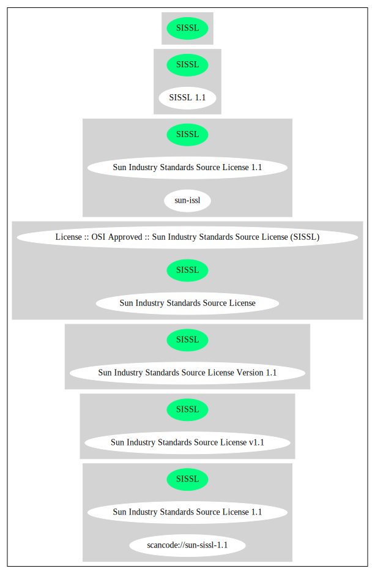

== Sun Industry Standards Source License v1.1 (SISSL)

[cols=",",options="header",]
|===
|Key |Value
|Fullname |Sun Industry Standards Source License v1.1
|Shortname |SISSL
|Rating |Unknown, probably Attention or Stop or No-Go
|===

*Other Names:*

* `+scancode://sun-sissl-1.1+`
* `+Sun Industry Standards Source License 1.1+`
* `+Sun Industry Standards Source License+`
* `+License :: OSI Approved :: Sun Industry Standards Source License (SISSL)+`

=== Comments on (easy) usability

* **↑**``Is OSI Approved'' (source:
https://spdx.org/licenses/SISSL.html[SPDX])
* **↓**``Google Classification is CANNOT_BE_USED "Code released under
the Sun Industry Standards Source License (SISSL) cannot be used at
Google. This license has terms that are very difficult to comply with
(even Sun, before being acquired, ceased to use or recommend this
license). Source files related to sFlow sometimes are released under
this license, but are typically also available under a slightly less
onerous sFlow License."'' (source:
https://opensource.google.com/docs/thirdparty/licenses/[Google OSS
Policy])

=== General Comments

=== URLs

* *Homepage:* http://www.openoffice.org/licenses/sissl_license.html
* *OSI Page:* https://opensource.org/licenses/SISSL
* *SPDX:* http://spdx.org/licenses/SISSL.json

=== Text

....
Sun Industry Standards Source License - Version 1.1

   1.0 DEFINITIONS

   1.1 "Commercial Use" means distribution or otherwise making the
   Original Code available to a third party.

   1.2 "Contributor Version" means the combination of the Original Code,
   and the Modifications made by that particular Contributor.

   1.3 "Electronic Distribution Mechanism" means a mechanism generally
   accepted in the software development community for the electronic
   transfer of data.

   1.4 "Executable" means Original Code in any form other than Source
   Code.

   1.5 "Initial Developer" means the individual or entity identified as
   the Initial Developer in the Source Code notice required by Exhibit A.

   1.6 "Larger Work" means a work which combines Original Code or
   portions thereof with code not governed by the terms of this License.

   1.7 "License" means this document.

   1.8 "Licensable" means having the right to grant, to the maximum
   extent possible, whether at the time of the initial grant or
   subsequently acquired, any and all of the rights conveyed herein.

   1.9 "Modifications" means any addition to or deletion from the
   substance or structure of either the Original Code or any previous
   Modifications.  A Modification is:
   A. Any addition to or deletion from the contents of a file containing
       Original Code or previous Modifications.
   B. Any new file that contains any part of the Original Code or
       previous Modifications.

   1.10 "Original Code" means Source Code of computer software code which
   is described in the Source Code notice required by Exhibit A as Original Code.

   1.11 "Patent Claims" means any patent claim(s), now owned or hereafter
   acquired, including without limitation, method, process, and apparatus
   claims, in any patent Licensable by grantor.

   1.12 "Source Code" means the preferred form of the Original Code for
   making modifications to it, including all modules it contains, plus
   any associated interface definition files, or scripts used to control
   compilation and installation of an Executable.

   1.13 "Standards" means the standards identified in Exhibit B.

   1.14 "You" (or "Your") means an individual or a legal entity
   exercising rights under, and complying with all of the terms of, this
   License or a future version of this License issued under Section 6.1.
   For legal entities, "You'' includes any entity which controls, is
   controlled by, or is under common control with You. For purposes of
   this definition, "control'' means (a) the power, direct or indirect,
   to cause the direction or management of such entity, whether by
   contract or otherwise, or (b) ownership of more than fifty percent
   (50%) of the outstanding shares or beneficial ownership of such
   entity.

   2.0 SOURCE CODE LICENSE

   2.1 The Initial Developer Grant
   The Initial Developer hereby grants You a world-wide, royalty-free,
   non-exclusive license, subject to third party intellectual property
   claims:
   (a) under intellectual property rights (other than patent or
       trademark) Licensable by Initial Developer to use, reproduce,
       modify, display, perform, sublicense and distribute the Original
       Code (or portions thereof) with or without Modifications, and/or
       as part of a Larger Work; and
   (b) under Patents Claims infringed by the making, using or selling
       of Original Code, to make, have made, use, practice, sell, and
       offer for sale, and/or otherwise dispose of the Original Code (or
       portions thereof).
   (c) the licenses granted in this Section 2.1(a) and (b) are
       effective on the date Initial Developer first distributes Original
       Code under the terms of this License.
   (d) Notwithstanding Section 2.1(b) above, no patent license is
       granted: 1) for code that You delete from the Original Code; 2)
       separate from the Original Code; or 3) for infringements caused
       by: i) the modification of the Original Code or ii) the
       combination of the Original Code with other software or devices,
       including but not limited to Modifications.

   3.0 DISTRIBUTION OBLIGATIONS

   3.1 Application of License.
   The Source Code version of Original Code may be distributed only under
   the terms of this License or a future version of this License released
   under Section 6.1, and You must include a copy of this License with
   every copy of the Source Code You distribute. You may not offer or
   impose any terms on any Source Code version that alters or restricts
   the applicable version of this License or the recipients' rights
   hereunder. Your license for shipment of the Contributor Version is
   conditioned upon Your full compliance with this Section. The
   Modifications which You create must comply with all requirements set
   out by the Standards body in effect one hundred twenty (120) days
   before You ship the Contributor Version. In the event that the
   Modifications do not meet such requirements, You agree to publish
   either (i) any deviation from the Standards protocol resulting from
   implementation of Your Modifications and a reference implementation of
   Your Modifications or (ii) Your Modifications in Source Code form, and
   to make any such deviation and reference implementation or
   Modifications available to all third parties under the same terms as
   this license on a royalty free basis within thirty (30) days of Your
   first customer shipment of Your Modifications.

   3.2 Required Notices.
   You must duplicate the notice in Exhibit A in each file of the Source
   Code. If it is not possible to put such notice in a particular Source
   Code file due to its structure, then You must include such notice in a
   location (such as a relevant directory) where a user would be likely
   to look for such a notice. If You created one or more Modification(s)
   You may add Your name as a Contributor to the notice described in
   Exhibit A. You must also duplicate this License in any documentation
   for the Source Code where You describe recipients' rights or ownership
   rights relating to Initial Code. You may choose to offer, and to
   charge a fee for, warranty, support, indemnity or liability
   obligations to one or more recipients of Your version of the Code.
   However, You may do so only on Your own behalf, and not on behalf of
   the Initial Developer. You must make it absolutely clear than any such
   warranty, support, indemnity or liability obligation is offered by You
   alone, and You hereby agree to indemnify the Initial Developer for any
   liability incurred by the Initial Developer as a result of warranty,
   support, indemnity or liability terms You offer.

   3.3 Distribution of Executable Versions.
   You may distribute Original Code in Executable and Source form only if
   the requirements of Sections 3.1 and 3.2 have been met for that
   Original Code, and if You include a notice stating that the Source
   Code version of the Original Code is available under the terms of this
   License. The notice must be conspicuously included in any notice in an
   Executable or Source versions, related documentation or collateral in
   which You describe recipients' rights relating to the Original Code.
   You may distribute the Executable and Source versions of Your version
   of the Code or ownership rights under a license of Your choice, which
   may contain terms different from this License, provided that You are
   in compliance with the terms of this License. If You distribute the
   Executable and Source versions under a different license You must make
   it absolutely clear that any terms which differ from this License are
   offered by You alone, not by the Initial Developer. You hereby agree
   to indemnify the Initial Developer for any liability incurred by the
   Initial Developer as a result of any such terms You offer.

   3.4 Larger Works.
   You may create a Larger Work by combining Original Code with other
   code not governed by the terms of this License and distribute the
   Larger Work as a single product. In such a case, You must make sure
   the requirements of this License are fulfilled for the Original Code.

   4.0 INABILITY TO COMPLY DUE TO STATUTE OR REGULATION

   If it is impossible for You to comply with any of the terms of this
   License with respect to some or all of the Original Code due to
   statute, judicial order, or regulation then You must: (a) comply with
   the terms of this License to the maximum extent possible; and (b)
   describe the limitations and the code they affect. Such description
   must be included in the LEGAL file described in Section 3.2 and must
   be included with all distributions of the Source Code. Except to the
   extent prohibited by statute or regulation, such description must be
   sufficiently detailed for a recipient of ordinary skill to be able to
   understand it.

   5.0 APPLICATION OF THIS LICENSE

   This License applies to code to which the Initial Developer has
   attached the notice in Exhibit A and to related Modifications as set
   out in Section 3.1.

   6.0 VERSIONS OF THE LICENSE

   6.1 New Versions.
   Sun may publish revised and/or new versions of the License from time
   to time. Each version will be given a distinguishing version number.

   6.2 Effect of New Versions.
   Once Original Code has been published under a particular version of
   the License, You may always continue to use it under the terms of that
   version. You may also choose to use such Original Code under the terms
   of any subsequent version of the License published by Sun. No one
   other than Sun has the right to modify the terms applicable to
   Original Code.

   7.0 DISCLAIMER OF WARRANTY

   ORIGINAL CODE IS PROVIDED UNDER THIS LICENSE ON AN "AS IS" BASIS,
   WITHOUT WARRANTY OF ANY KIND, EITHER EXPRESSED OR IMPLIED, INCLUDING,
   WITHOUT LIMITATION, WARRANTIES THAT THE ORIGINAL CODE IS FREE OF
   DEFECTS, MERCHANTABLE, FIT FOR A PARTICULAR PURPOSE OR NON-INFRINGING.
   THE ENTIRE RISK AS TO THE QUALITY AND PERFORMANCE OF THE ORIGINAL CODE
   IS WITH YOU. SHOULD ANY ORIGINAL CODE PROVE DEFECTIVE IN ANY RESPECT,
   YOU (NOT THE INITIAL DEVELOPER) ASSUME THE COST OF ANY NECESSARY
   SERVICING, REPAIR OR CORRECTION. THIS DISCLAIMER OF WARRANTY
   CONSTITUTES AN ESSENTIAL PART OF THIS LICENSE. NO USE OF ANY ORIGINAL
   CODE IS AUTHORIZED HEREUNDER EXCEPT UNDER THIS DISCLAIMER.

   8.0 TERMINATION

   8.1 This License and the rights granted hereunder will terminate
   automatically if You fail to comply with terms herein and fail to cure
   such breach within 30 days of becoming aware of the breach. All
   sublicenses to the Original Code which are properly granted shall
   survive any termination of this License. Provisions which, by their
   nature, must remain in effect beyond the termination of this License
   shall survive.

   8.2 In the event of termination under Section 8.1 above, all end user
   license agreements (excluding distributors and resellers) which have
   been validly granted by You or any distributor hereunder prior to
   termination shall survive termination.

   9.0 LIMIT OF LIABILITY

   UNDER NO CIRCUMSTANCES AND UNDER NO LEGAL THEORY, WHETHER TORT
   (INCLUDING NEGLIGENCE), CONTRACT, OR OTHERWISE, SHALL YOU, THE INITIAL
   DEVELOPER, ANY OTHER CONTRIBUTOR, OR ANY DISTRIBUTOR OF ORIGINAL CODE,
   OR ANY SUPPLIER OF ANY OF SUCH PARTIES, BE LIABLE TO ANY PERSON FOR
   ANY INDIRECT, SPECIAL, INCIDENTAL, OR CONSEQUENTIAL DAMAGES OF ANY
   CHARACTER INCLUDING, WITHOUT LIMITATION, DAMAGES FOR LOSS OF GOODWILL,
   WORK STOPPAGE, COMPUTER FAILURE OR MALFUNCTION, OR ANY AND ALL OTHER
   COMMERCIAL DAMAGES OR LOSSES, EVEN IF SUCH PARTY SHALL HAVE BEEN
   INFORMED OF THE POSSIBILITY OF SUCH DAMAGES. THIS LIMITATION OF
   LIABILITY SHALL NOT APPLY TO LIABILITY FOR DEATH OR PERSONAL INJURY
   RESULTING FROM SUCH PARTY'S NEGLIGENCE TO THE EXTENT APPLICABLE LAW
   PROHIBITS SUCH LIMITATION. SOME JURISDICTIONS DO NOT ALLOW THE
   EXCLUSION OR LIMITATION OF INCIDENTAL OR CONSEQUENTIAL DAMAGES, SO
   THIS EXCLUSION AND LIMITATION MAY NOT APPLY TO YOU.

   10.0 U.S. GOVERNMENT END USERS

   U.S. Government: If this Software is being acquired by or on behalf of
   the U.S. Government or by a U.S. Government prime contractor or
   subcontractor (at any tier), then the Government's rights in the
   Software and accompanying documentation shall be only as set forth in
   this license; this is in accordance with 48 C.F.R. 227.7201 through
   227.7202-4 (for Department of Defense (DoD) acquisitions) and with 48
   C.F.R. 2.101 and 12.212 (for non-DoD acquisitions).

   11.0 MISCELLANEOUS

   This License represents the complete agreement concerning subject
   matter hereof. If any provision of this License is held to be
   unenforceable, such provision shall be reformed only to the extent
   necessary to make it enforceable. This License shall be governed by
   California law provisions (except to the extent applicable law, if
   any, provides otherwise), excluding its conflict-of-law provisions.
   With respect to disputes in which at least one party is a citizen of,
   or an entity chartered or registered to do business in the United
   States of America, any litigation relating to this License shall be
   subject to the jurisdiction of the Federal Courts of the Northern
   District of California, with venue lying in Santa Clara County,
   California, with the losing party responsible for costs, including
   without limitation, court costs and reasonable attorneys' fees and
   expenses. The application of the United Nations Convention on
   Contracts for the International Sale of Goods is expressly excluded.
   Any law or regulation which provides that the language of a contract
   shall be construed against the drafter shall not apply to this License.

   EXHIBIT A - Sun Standards License
"The contents of this file are subject to the Sun Standards
License Version 1.1 (the "License");
You may not use this file except in compliance with the
License. You may obtain a copy of the
License at  .

Software distributed under the License is distributed on
an "AS IS" basis, WITHOUT WARRANTY OF ANY KIND, either
express or implied. See the License for the specific
language governing rights and limitations under the License.

The Original Code is  .

The Initial Developer of the Original Code is:
Sun Microsystems, Inc..

Portions created by:  

are Copyright (C):  

All Rights Reserved.

Contributor(s):  

   EXHIBIT B - Standards

   The Standard is defined as the following:

   OpenOffice.org XML File Format Specification, located at
   http://xml.openoffice.org

   OpenOffice.org Application Programming Interface Specification,
   located at
   http://api.openoffice.org

   We welcome your feedback.
   CollabNet, Inc. CollabNet is a trademark of CollabNet, Inc.
   Sun, Sun Microsystems, the Sun Logo, Solaris, Java, StarOffice,
   StarOffice 6.0 and StarSuite 6.0 are trademarks or registered
   trademarks of Sun Microsystems, Inc., in the United States and other countries.
....

'''''

=== Raw Data

....
{
    "__impliedNames": [
        "SISSL",
        "Sun Industry Standards Source License v1.1",
        "scancode://sun-sissl-1.1",
        "Sun Industry Standards Source License 1.1",
        "Sun Industry Standards Source License",
        "License :: OSI Approved :: Sun Industry Standards Source License (SISSL)"
    ],
    "__impliedId": "SISSL",
    "facts": {
        "Open Knowledge International": {
            "is_generic": null,
            "status": "retired",
            "domain_software": true,
            "url": "https://opensource.org/licenses/SISSL",
            "maintainer": "",
            "od_conformance": "not reviewed",
            "_sourceURL": "https://github.com/okfn/licenses/blob/master/licenses.csv",
            "domain_data": false,
            "osd_conformance": "approved",
            "id": "SISSL",
            "title": "Sun Industry Standards Source License 1.1",
            "_implications": {
                "__impliedNames": [
                    "SISSL",
                    "Sun Industry Standards Source License 1.1"
                ],
                "__impliedId": "SISSL",
                "__impliedURLs": [
                    [
                        null,
                        "https://opensource.org/licenses/SISSL"
                    ]
                ]
            },
            "domain_content": false
        },
        "SPDX": {
            "isSPDXLicenseDeprecated": false,
            "spdxFullName": "Sun Industry Standards Source License v1.1",
            "spdxDetailsURL": "http://spdx.org/licenses/SISSL.json",
            "_sourceURL": "https://spdx.org/licenses/SISSL.html",
            "spdxLicIsOSIApproved": true,
            "spdxSeeAlso": [
                "http://www.openoffice.org/licenses/sissl_license.html",
                "https://opensource.org/licenses/SISSL"
            ],
            "_implications": {
                "__impliedNames": [
                    "SISSL",
                    "Sun Industry Standards Source License v1.1"
                ],
                "__impliedId": "SISSL",
                "__impliedJudgement": [
                    [
                        "SPDX",
                        {
                            "tag": "PositiveJudgement",
                            "contents": "Is OSI Approved"
                        }
                    ]
                ],
                "__isOsiApproved": true,
                "__impliedURLs": [
                    [
                        "SPDX",
                        "http://spdx.org/licenses/SISSL.json"
                    ],
                    [
                        null,
                        "http://www.openoffice.org/licenses/sissl_license.html"
                    ],
                    [
                        null,
                        "https://opensource.org/licenses/SISSL"
                    ]
                ]
            },
            "spdxLicenseId": "SISSL"
        },
        "Scancode": {
            "otherUrls": [
                "http://opensource.org/licenses/SISSL",
                "https://opensource.org/licenses/SISSL"
            ],
            "homepageUrl": "http://www.openoffice.org/licenses/sissl_license.html",
            "shortName": "Sun Industry Standards Source License 1.1",
            "textUrls": null,
            "text": "Sun Industry Standards Source License - Version 1.1\n\n   1.0 DEFINITIONS\n\n   1.1 \"Commercial Use\" means distribution or otherwise making the\n   Original Code available to a third party.\n\n   1.2 \"Contributor Version\" means the combination of the Original Code,\n   and the Modifications made by that particular Contributor.\n\n   1.3 \"Electronic Distribution Mechanism\" means a mechanism generally\n   accepted in the software development community for the electronic\n   transfer of data.\n\n   1.4 \"Executable\" means Original Code in any form other than Source\n   Code.\n\n   1.5 \"Initial Developer\" means the individual or entity identified as\n   the Initial Developer in the Source Code notice required by Exhibit A.\n\n   1.6 \"Larger Work\" means a work which combines Original Code or\n   portions thereof with code not governed by the terms of this License.\n\n   1.7 \"License\" means this document.\n\n   1.8 \"Licensable\" means having the right to grant, to the maximum\n   extent possible, whether at the time of the initial grant or\n   subsequently acquired, any and all of the rights conveyed herein.\n\n   1.9 \"Modifications\" means any addition to or deletion from the\n   substance or structure of either the Original Code or any previous\n   Modifications.  A Modification is:\n   A. Any addition to or deletion from the contents of a file containing\n       Original Code or previous Modifications.\n   B. Any new file that contains any part of the Original Code or\n       previous Modifications.\n\n   1.10 \"Original Code\" means Source Code of computer software code which\n   is described in the Source Code notice required by Exhibit A as Original Code.\n\n   1.11 \"Patent Claims\" means any patent claim(s), now owned or hereafter\n   acquired, including without limitation, method, process, and apparatus\n   claims, in any patent Licensable by grantor.\n\n   1.12 \"Source Code\" means the preferred form of the Original Code for\n   making modifications to it, including all modules it contains, plus\n   any associated interface definition files, or scripts used to control\n   compilation and installation of an Executable.\n\n   1.13 \"Standards\" means the standards identified in Exhibit B.\n\n   1.14 \"You\" (or \"Your\") means an individual or a legal entity\n   exercising rights under, and complying with all of the terms of, this\n   License or a future version of this License issued under Section 6.1.\n   For legal entities, \"You'' includes any entity which controls, is\n   controlled by, or is under common control with You. For purposes of\n   this definition, \"control'' means (a) the power, direct or indirect,\n   to cause the direction or management of such entity, whether by\n   contract or otherwise, or (b) ownership of more than fifty percent\n   (50%) of the outstanding shares or beneficial ownership of such\n   entity.\n\n   2.0 SOURCE CODE LICENSE\n\n   2.1 The Initial Developer Grant\n   The Initial Developer hereby grants You a world-wide, royalty-free,\n   non-exclusive license, subject to third party intellectual property\n   claims:\n   (a) under intellectual property rights (other than patent or\n       trademark) Licensable by Initial Developer to use, reproduce,\n       modify, display, perform, sublicense and distribute the Original\n       Code (or portions thereof) with or without Modifications, and/or\n       as part of a Larger Work; and\n   (b) under Patents Claims infringed by the making, using or selling\n       of Original Code, to make, have made, use, practice, sell, and\n       offer for sale, and/or otherwise dispose of the Original Code (or\n       portions thereof).\n   (c) the licenses granted in this Section 2.1(a) and (b) are\n       effective on the date Initial Developer first distributes Original\n       Code under the terms of this License.\n   (d) Notwithstanding Section 2.1(b) above, no patent license is\n       granted: 1) for code that You delete from the Original Code; 2)\n       separate from the Original Code; or 3) for infringements caused\n       by: i) the modification of the Original Code or ii) the\n       combination of the Original Code with other software or devices,\n       including but not limited to Modifications.\n\n   3.0 DISTRIBUTION OBLIGATIONS\n\n   3.1 Application of License.\n   The Source Code version of Original Code may be distributed only under\n   the terms of this License or a future version of this License released\n   under Section 6.1, and You must include a copy of this License with\n   every copy of the Source Code You distribute. You may not offer or\n   impose any terms on any Source Code version that alters or restricts\n   the applicable version of this License or the recipients' rights\n   hereunder. Your license for shipment of the Contributor Version is\n   conditioned upon Your full compliance with this Section. The\n   Modifications which You create must comply with all requirements set\n   out by the Standards body in effect one hundred twenty (120) days\n   before You ship the Contributor Version. In the event that the\n   Modifications do not meet such requirements, You agree to publish\n   either (i) any deviation from the Standards protocol resulting from\n   implementation of Your Modifications and a reference implementation of\n   Your Modifications or (ii) Your Modifications in Source Code form, and\n   to make any such deviation and reference implementation or\n   Modifications available to all third parties under the same terms as\n   this license on a royalty free basis within thirty (30) days of Your\n   first customer shipment of Your Modifications.\n\n   3.2 Required Notices.\n   You must duplicate the notice in Exhibit A in each file of the Source\n   Code. If it is not possible to put such notice in a particular Source\n   Code file due to its structure, then You must include such notice in a\n   location (such as a relevant directory) where a user would be likely\n   to look for such a notice. If You created one or more Modification(s)\n   You may add Your name as a Contributor to the notice described in\n   Exhibit A. You must also duplicate this License in any documentation\n   for the Source Code where You describe recipients' rights or ownership\n   rights relating to Initial Code. You may choose to offer, and to\n   charge a fee for, warranty, support, indemnity or liability\n   obligations to one or more recipients of Your version of the Code.\n   However, You may do so only on Your own behalf, and not on behalf of\n   the Initial Developer. You must make it absolutely clear than any such\n   warranty, support, indemnity or liability obligation is offered by You\n   alone, and You hereby agree to indemnify the Initial Developer for any\n   liability incurred by the Initial Developer as a result of warranty,\n   support, indemnity or liability terms You offer.\n\n   3.3 Distribution of Executable Versions.\n   You may distribute Original Code in Executable and Source form only if\n   the requirements of Sections 3.1 and 3.2 have been met for that\n   Original Code, and if You include a notice stating that the Source\n   Code version of the Original Code is available under the terms of this\n   License. The notice must be conspicuously included in any notice in an\n   Executable or Source versions, related documentation or collateral in\n   which You describe recipients' rights relating to the Original Code.\n   You may distribute the Executable and Source versions of Your version\n   of the Code or ownership rights under a license of Your choice, which\n   may contain terms different from this License, provided that You are\n   in compliance with the terms of this License. If You distribute the\n   Executable and Source versions under a different license You must make\n   it absolutely clear that any terms which differ from this License are\n   offered by You alone, not by the Initial Developer. You hereby agree\n   to indemnify the Initial Developer for any liability incurred by the\n   Initial Developer as a result of any such terms You offer.\n\n   3.4 Larger Works.\n   You may create a Larger Work by combining Original Code with other\n   code not governed by the terms of this License and distribute the\n   Larger Work as a single product. In such a case, You must make sure\n   the requirements of this License are fulfilled for the Original Code.\n\n   4.0 INABILITY TO COMPLY DUE TO STATUTE OR REGULATION\n\n   If it is impossible for You to comply with any of the terms of this\n   License with respect to some or all of the Original Code due to\n   statute, judicial order, or regulation then You must: (a) comply with\n   the terms of this License to the maximum extent possible; and (b)\n   describe the limitations and the code they affect. Such description\n   must be included in the LEGAL file described in Section 3.2 and must\n   be included with all distributions of the Source Code. Except to the\n   extent prohibited by statute or regulation, such description must be\n   sufficiently detailed for a recipient of ordinary skill to be able to\n   understand it.\n\n   5.0 APPLICATION OF THIS LICENSE\n\n   This License applies to code to which the Initial Developer has\n   attached the notice in Exhibit A and to related Modifications as set\n   out in Section 3.1.\n\n   6.0 VERSIONS OF THE LICENSE\n\n   6.1 New Versions.\n   Sun may publish revised and/or new versions of the License from time\n   to time. Each version will be given a distinguishing version number.\n\n   6.2 Effect of New Versions.\n   Once Original Code has been published under a particular version of\n   the License, You may always continue to use it under the terms of that\n   version. You may also choose to use such Original Code under the terms\n   of any subsequent version of the License published by Sun. No one\n   other than Sun has the right to modify the terms applicable to\n   Original Code.\n\n   7.0 DISCLAIMER OF WARRANTY\n\n   ORIGINAL CODE IS PROVIDED UNDER THIS LICENSE ON AN \"AS IS\" BASIS,\n   WITHOUT WARRANTY OF ANY KIND, EITHER EXPRESSED OR IMPLIED, INCLUDING,\n   WITHOUT LIMITATION, WARRANTIES THAT THE ORIGINAL CODE IS FREE OF\n   DEFECTS, MERCHANTABLE, FIT FOR A PARTICULAR PURPOSE OR NON-INFRINGING.\n   THE ENTIRE RISK AS TO THE QUALITY AND PERFORMANCE OF THE ORIGINAL CODE\n   IS WITH YOU. SHOULD ANY ORIGINAL CODE PROVE DEFECTIVE IN ANY RESPECT,\n   YOU (NOT THE INITIAL DEVELOPER) ASSUME THE COST OF ANY NECESSARY\n   SERVICING, REPAIR OR CORRECTION. THIS DISCLAIMER OF WARRANTY\n   CONSTITUTES AN ESSENTIAL PART OF THIS LICENSE. NO USE OF ANY ORIGINAL\n   CODE IS AUTHORIZED HEREUNDER EXCEPT UNDER THIS DISCLAIMER.\n\n   8.0 TERMINATION\n\n   8.1 This License and the rights granted hereunder will terminate\n   automatically if You fail to comply with terms herein and fail to cure\n   such breach within 30 days of becoming aware of the breach. All\n   sublicenses to the Original Code which are properly granted shall\n   survive any termination of this License. Provisions which, by their\n   nature, must remain in effect beyond the termination of this License\n   shall survive.\n\n   8.2 In the event of termination under Section 8.1 above, all end user\n   license agreements (excluding distributors and resellers) which have\n   been validly granted by You or any distributor hereunder prior to\n   termination shall survive termination.\n\n   9.0 LIMIT OF LIABILITY\n\n   UNDER NO CIRCUMSTANCES AND UNDER NO LEGAL THEORY, WHETHER TORT\n   (INCLUDING NEGLIGENCE), CONTRACT, OR OTHERWISE, SHALL YOU, THE INITIAL\n   DEVELOPER, ANY OTHER CONTRIBUTOR, OR ANY DISTRIBUTOR OF ORIGINAL CODE,\n   OR ANY SUPPLIER OF ANY OF SUCH PARTIES, BE LIABLE TO ANY PERSON FOR\n   ANY INDIRECT, SPECIAL, INCIDENTAL, OR CONSEQUENTIAL DAMAGES OF ANY\n   CHARACTER INCLUDING, WITHOUT LIMITATION, DAMAGES FOR LOSS OF GOODWILL,\n   WORK STOPPAGE, COMPUTER FAILURE OR MALFUNCTION, OR ANY AND ALL OTHER\n   COMMERCIAL DAMAGES OR LOSSES, EVEN IF SUCH PARTY SHALL HAVE BEEN\n   INFORMED OF THE POSSIBILITY OF SUCH DAMAGES. THIS LIMITATION OF\n   LIABILITY SHALL NOT APPLY TO LIABILITY FOR DEATH OR PERSONAL INJURY\n   RESULTING FROM SUCH PARTY'S NEGLIGENCE TO THE EXTENT APPLICABLE LAW\n   PROHIBITS SUCH LIMITATION. SOME JURISDICTIONS DO NOT ALLOW THE\n   EXCLUSION OR LIMITATION OF INCIDENTAL OR CONSEQUENTIAL DAMAGES, SO\n   THIS EXCLUSION AND LIMITATION MAY NOT APPLY TO YOU.\n\n   10.0 U.S. GOVERNMENT END USERS\n\n   U.S. Government: If this Software is being acquired by or on behalf of\n   the U.S. Government or by a U.S. Government prime contractor or\n   subcontractor (at any tier), then the Government's rights in the\n   Software and accompanying documentation shall be only as set forth in\n   this license; this is in accordance with 48 C.F.R. 227.7201 through\n   227.7202-4 (for Department of Defense (DoD) acquisitions) and with 48\n   C.F.R. 2.101 and 12.212 (for non-DoD acquisitions).\n\n   11.0 MISCELLANEOUS\n\n   This License represents the complete agreement concerning subject\n   matter hereof. If any provision of this License is held to be\n   unenforceable, such provision shall be reformed only to the extent\n   necessary to make it enforceable. This License shall be governed by\n   California law provisions (except to the extent applicable law, if\n   any, provides otherwise), excluding its conflict-of-law provisions.\n   With respect to disputes in which at least one party is a citizen of,\n   or an entity chartered or registered to do business in the United\n   States of America, any litigation relating to this License shall be\n   subject to the jurisdiction of the Federal Courts of the Northern\n   District of California, with venue lying in Santa Clara County,\n   California, with the losing party responsible for costs, including\n   without limitation, court costs and reasonable attorneys' fees and\n   expenses. The application of the United Nations Convention on\n   Contracts for the International Sale of Goods is expressly excluded.\n   Any law or regulation which provides that the language of a contract\n   shall be construed against the drafter shall not apply to this License.\n\n   EXHIBIT A - Sun Standards License\n\"The contents of this file are subject to the Sun Standards\nLicense Version 1.1 (the \"License\");\nYou may not use this file except in compliance with the\nLicense. You may obtain a copy of the\nLicense at  .\n\nSoftware distributed under the License is distributed on\nan \"AS IS\" basis, WITHOUT WARRANTY OF ANY KIND, either\nexpress or implied. See the License for the specific\nlanguage governing rights and limitations under the License.\n\nThe Original Code is  .\n\nThe Initial Developer of the Original Code is:\nSun Microsystems, Inc..\n\nPortions created by:  \n\nare Copyright (C):  \n\nAll Rights Reserved.\n\nContributor(s):  \n\n   EXHIBIT B - Standards\n\n   The Standard is defined as the following:\n\n   OpenOffice.org XML File Format Specification, located at\n   http://xml.openoffice.org\n\n   OpenOffice.org Application Programming Interface Specification,\n   located at\n   http://api.openoffice.org\n\n   We welcome your feedback.\n   CollabNet, Inc. CollabNet is a trademark of CollabNet, Inc.\n   Sun, Sun Microsystems, the Sun Logo, Solaris, Java, StarOffice,\n   StarOffice 6.0 and StarSuite 6.0 are trademarks or registered\n   trademarks of Sun Microsystems, Inc., in the United States and other countries.",
            "category": "Proprietary Free",
            "osiUrl": null,
            "owner": "Oracle (Sun)",
            "_sourceURL": "https://github.com/nexB/scancode-toolkit/blob/develop/src/licensedcode/data/licenses/sun-sissl-1.1.yml",
            "key": "sun-sissl-1.1",
            "name": "Sun Industry Standards Source License 1.1",
            "spdxId": "SISSL",
            "notes": null,
            "_implications": {
                "__impliedNames": [
                    "scancode://sun-sissl-1.1",
                    "Sun Industry Standards Source License 1.1",
                    "SISSL"
                ],
                "__impliedId": "SISSL",
                "__impliedText": "Sun Industry Standards Source License - Version 1.1\n\n   1.0 DEFINITIONS\n\n   1.1 \"Commercial Use\" means distribution or otherwise making the\n   Original Code available to a third party.\n\n   1.2 \"Contributor Version\" means the combination of the Original Code,\n   and the Modifications made by that particular Contributor.\n\n   1.3 \"Electronic Distribution Mechanism\" means a mechanism generally\n   accepted in the software development community for the electronic\n   transfer of data.\n\n   1.4 \"Executable\" means Original Code in any form other than Source\n   Code.\n\n   1.5 \"Initial Developer\" means the individual or entity identified as\n   the Initial Developer in the Source Code notice required by Exhibit A.\n\n   1.6 \"Larger Work\" means a work which combines Original Code or\n   portions thereof with code not governed by the terms of this License.\n\n   1.7 \"License\" means this document.\n\n   1.8 \"Licensable\" means having the right to grant, to the maximum\n   extent possible, whether at the time of the initial grant or\n   subsequently acquired, any and all of the rights conveyed herein.\n\n   1.9 \"Modifications\" means any addition to or deletion from the\n   substance or structure of either the Original Code or any previous\n   Modifications.  A Modification is:\n   A. Any addition to or deletion from the contents of a file containing\n       Original Code or previous Modifications.\n   B. Any new file that contains any part of the Original Code or\n       previous Modifications.\n\n   1.10 \"Original Code\" means Source Code of computer software code which\n   is described in the Source Code notice required by Exhibit A as Original Code.\n\n   1.11 \"Patent Claims\" means any patent claim(s), now owned or hereafter\n   acquired, including without limitation, method, process, and apparatus\n   claims, in any patent Licensable by grantor.\n\n   1.12 \"Source Code\" means the preferred form of the Original Code for\n   making modifications to it, including all modules it contains, plus\n   any associated interface definition files, or scripts used to control\n   compilation and installation of an Executable.\n\n   1.13 \"Standards\" means the standards identified in Exhibit B.\n\n   1.14 \"You\" (or \"Your\") means an individual or a legal entity\n   exercising rights under, and complying with all of the terms of, this\n   License or a future version of this License issued under Section 6.1.\n   For legal entities, \"You'' includes any entity which controls, is\n   controlled by, or is under common control with You. For purposes of\n   this definition, \"control'' means (a) the power, direct or indirect,\n   to cause the direction or management of such entity, whether by\n   contract or otherwise, or (b) ownership of more than fifty percent\n   (50%) of the outstanding shares or beneficial ownership of such\n   entity.\n\n   2.0 SOURCE CODE LICENSE\n\n   2.1 The Initial Developer Grant\n   The Initial Developer hereby grants You a world-wide, royalty-free,\n   non-exclusive license, subject to third party intellectual property\n   claims:\n   (a) under intellectual property rights (other than patent or\n       trademark) Licensable by Initial Developer to use, reproduce,\n       modify, display, perform, sublicense and distribute the Original\n       Code (or portions thereof) with or without Modifications, and/or\n       as part of a Larger Work; and\n   (b) under Patents Claims infringed by the making, using or selling\n       of Original Code, to make, have made, use, practice, sell, and\n       offer for sale, and/or otherwise dispose of the Original Code (or\n       portions thereof).\n   (c) the licenses granted in this Section 2.1(a) and (b) are\n       effective on the date Initial Developer first distributes Original\n       Code under the terms of this License.\n   (d) Notwithstanding Section 2.1(b) above, no patent license is\n       granted: 1) for code that You delete from the Original Code; 2)\n       separate from the Original Code; or 3) for infringements caused\n       by: i) the modification of the Original Code or ii) the\n       combination of the Original Code with other software or devices,\n       including but not limited to Modifications.\n\n   3.0 DISTRIBUTION OBLIGATIONS\n\n   3.1 Application of License.\n   The Source Code version of Original Code may be distributed only under\n   the terms of this License or a future version of this License released\n   under Section 6.1, and You must include a copy of this License with\n   every copy of the Source Code You distribute. You may not offer or\n   impose any terms on any Source Code version that alters or restricts\n   the applicable version of this License or the recipients' rights\n   hereunder. Your license for shipment of the Contributor Version is\n   conditioned upon Your full compliance with this Section. The\n   Modifications which You create must comply with all requirements set\n   out by the Standards body in effect one hundred twenty (120) days\n   before You ship the Contributor Version. In the event that the\n   Modifications do not meet such requirements, You agree to publish\n   either (i) any deviation from the Standards protocol resulting from\n   implementation of Your Modifications and a reference implementation of\n   Your Modifications or (ii) Your Modifications in Source Code form, and\n   to make any such deviation and reference implementation or\n   Modifications available to all third parties under the same terms as\n   this license on a royalty free basis within thirty (30) days of Your\n   first customer shipment of Your Modifications.\n\n   3.2 Required Notices.\n   You must duplicate the notice in Exhibit A in each file of the Source\n   Code. If it is not possible to put such notice in a particular Source\n   Code file due to its structure, then You must include such notice in a\n   location (such as a relevant directory) where a user would be likely\n   to look for such a notice. If You created one or more Modification(s)\n   You may add Your name as a Contributor to the notice described in\n   Exhibit A. You must also duplicate this License in any documentation\n   for the Source Code where You describe recipients' rights or ownership\n   rights relating to Initial Code. You may choose to offer, and to\n   charge a fee for, warranty, support, indemnity or liability\n   obligations to one or more recipients of Your version of the Code.\n   However, You may do so only on Your own behalf, and not on behalf of\n   the Initial Developer. You must make it absolutely clear than any such\n   warranty, support, indemnity or liability obligation is offered by You\n   alone, and You hereby agree to indemnify the Initial Developer for any\n   liability incurred by the Initial Developer as a result of warranty,\n   support, indemnity or liability terms You offer.\n\n   3.3 Distribution of Executable Versions.\n   You may distribute Original Code in Executable and Source form only if\n   the requirements of Sections 3.1 and 3.2 have been met for that\n   Original Code, and if You include a notice stating that the Source\n   Code version of the Original Code is available under the terms of this\n   License. The notice must be conspicuously included in any notice in an\n   Executable or Source versions, related documentation or collateral in\n   which You describe recipients' rights relating to the Original Code.\n   You may distribute the Executable and Source versions of Your version\n   of the Code or ownership rights under a license of Your choice, which\n   may contain terms different from this License, provided that You are\n   in compliance with the terms of this License. If You distribute the\n   Executable and Source versions under a different license You must make\n   it absolutely clear that any terms which differ from this License are\n   offered by You alone, not by the Initial Developer. You hereby agree\n   to indemnify the Initial Developer for any liability incurred by the\n   Initial Developer as a result of any such terms You offer.\n\n   3.4 Larger Works.\n   You may create a Larger Work by combining Original Code with other\n   code not governed by the terms of this License and distribute the\n   Larger Work as a single product. In such a case, You must make sure\n   the requirements of this License are fulfilled for the Original Code.\n\n   4.0 INABILITY TO COMPLY DUE TO STATUTE OR REGULATION\n\n   If it is impossible for You to comply with any of the terms of this\n   License with respect to some or all of the Original Code due to\n   statute, judicial order, or regulation then You must: (a) comply with\n   the terms of this License to the maximum extent possible; and (b)\n   describe the limitations and the code they affect. Such description\n   must be included in the LEGAL file described in Section 3.2 and must\n   be included with all distributions of the Source Code. Except to the\n   extent prohibited by statute or regulation, such description must be\n   sufficiently detailed for a recipient of ordinary skill to be able to\n   understand it.\n\n   5.0 APPLICATION OF THIS LICENSE\n\n   This License applies to code to which the Initial Developer has\n   attached the notice in Exhibit A and to related Modifications as set\n   out in Section 3.1.\n\n   6.0 VERSIONS OF THE LICENSE\n\n   6.1 New Versions.\n   Sun may publish revised and/or new versions of the License from time\n   to time. Each version will be given a distinguishing version number.\n\n   6.2 Effect of New Versions.\n   Once Original Code has been published under a particular version of\n   the License, You may always continue to use it under the terms of that\n   version. You may also choose to use such Original Code under the terms\n   of any subsequent version of the License published by Sun. No one\n   other than Sun has the right to modify the terms applicable to\n   Original Code.\n\n   7.0 DISCLAIMER OF WARRANTY\n\n   ORIGINAL CODE IS PROVIDED UNDER THIS LICENSE ON AN \"AS IS\" BASIS,\n   WITHOUT WARRANTY OF ANY KIND, EITHER EXPRESSED OR IMPLIED, INCLUDING,\n   WITHOUT LIMITATION, WARRANTIES THAT THE ORIGINAL CODE IS FREE OF\n   DEFECTS, MERCHANTABLE, FIT FOR A PARTICULAR PURPOSE OR NON-INFRINGING.\n   THE ENTIRE RISK AS TO THE QUALITY AND PERFORMANCE OF THE ORIGINAL CODE\n   IS WITH YOU. SHOULD ANY ORIGINAL CODE PROVE DEFECTIVE IN ANY RESPECT,\n   YOU (NOT THE INITIAL DEVELOPER) ASSUME THE COST OF ANY NECESSARY\n   SERVICING, REPAIR OR CORRECTION. THIS DISCLAIMER OF WARRANTY\n   CONSTITUTES AN ESSENTIAL PART OF THIS LICENSE. NO USE OF ANY ORIGINAL\n   CODE IS AUTHORIZED HEREUNDER EXCEPT UNDER THIS DISCLAIMER.\n\n   8.0 TERMINATION\n\n   8.1 This License and the rights granted hereunder will terminate\n   automatically if You fail to comply with terms herein and fail to cure\n   such breach within 30 days of becoming aware of the breach. All\n   sublicenses to the Original Code which are properly granted shall\n   survive any termination of this License. Provisions which, by their\n   nature, must remain in effect beyond the termination of this License\n   shall survive.\n\n   8.2 In the event of termination under Section 8.1 above, all end user\n   license agreements (excluding distributors and resellers) which have\n   been validly granted by You or any distributor hereunder prior to\n   termination shall survive termination.\n\n   9.0 LIMIT OF LIABILITY\n\n   UNDER NO CIRCUMSTANCES AND UNDER NO LEGAL THEORY, WHETHER TORT\n   (INCLUDING NEGLIGENCE), CONTRACT, OR OTHERWISE, SHALL YOU, THE INITIAL\n   DEVELOPER, ANY OTHER CONTRIBUTOR, OR ANY DISTRIBUTOR OF ORIGINAL CODE,\n   OR ANY SUPPLIER OF ANY OF SUCH PARTIES, BE LIABLE TO ANY PERSON FOR\n   ANY INDIRECT, SPECIAL, INCIDENTAL, OR CONSEQUENTIAL DAMAGES OF ANY\n   CHARACTER INCLUDING, WITHOUT LIMITATION, DAMAGES FOR LOSS OF GOODWILL,\n   WORK STOPPAGE, COMPUTER FAILURE OR MALFUNCTION, OR ANY AND ALL OTHER\n   COMMERCIAL DAMAGES OR LOSSES, EVEN IF SUCH PARTY SHALL HAVE BEEN\n   INFORMED OF THE POSSIBILITY OF SUCH DAMAGES. THIS LIMITATION OF\n   LIABILITY SHALL NOT APPLY TO LIABILITY FOR DEATH OR PERSONAL INJURY\n   RESULTING FROM SUCH PARTY'S NEGLIGENCE TO THE EXTENT APPLICABLE LAW\n   PROHIBITS SUCH LIMITATION. SOME JURISDICTIONS DO NOT ALLOW THE\n   EXCLUSION OR LIMITATION OF INCIDENTAL OR CONSEQUENTIAL DAMAGES, SO\n   THIS EXCLUSION AND LIMITATION MAY NOT APPLY TO YOU.\n\n   10.0 U.S. GOVERNMENT END USERS\n\n   U.S. Government: If this Software is being acquired by or on behalf of\n   the U.S. Government or by a U.S. Government prime contractor or\n   subcontractor (at any tier), then the Government's rights in the\n   Software and accompanying documentation shall be only as set forth in\n   this license; this is in accordance with 48 C.F.R. 227.7201 through\n   227.7202-4 (for Department of Defense (DoD) acquisitions) and with 48\n   C.F.R. 2.101 and 12.212 (for non-DoD acquisitions).\n\n   11.0 MISCELLANEOUS\n\n   This License represents the complete agreement concerning subject\n   matter hereof. If any provision of this License is held to be\n   unenforceable, such provision shall be reformed only to the extent\n   necessary to make it enforceable. This License shall be governed by\n   California law provisions (except to the extent applicable law, if\n   any, provides otherwise), excluding its conflict-of-law provisions.\n   With respect to disputes in which at least one party is a citizen of,\n   or an entity chartered or registered to do business in the United\n   States of America, any litigation relating to this License shall be\n   subject to the jurisdiction of the Federal Courts of the Northern\n   District of California, with venue lying in Santa Clara County,\n   California, with the losing party responsible for costs, including\n   without limitation, court costs and reasonable attorneys' fees and\n   expenses. The application of the United Nations Convention on\n   Contracts for the International Sale of Goods is expressly excluded.\n   Any law or regulation which provides that the language of a contract\n   shall be construed against the drafter shall not apply to this License.\n\n   EXHIBIT A - Sun Standards License\n\"The contents of this file are subject to the Sun Standards\nLicense Version 1.1 (the \"License\");\nYou may not use this file except in compliance with the\nLicense. You may obtain a copy of the\nLicense at  .\n\nSoftware distributed under the License is distributed on\nan \"AS IS\" basis, WITHOUT WARRANTY OF ANY KIND, either\nexpress or implied. See the License for the specific\nlanguage governing rights and limitations under the License.\n\nThe Original Code is  .\n\nThe Initial Developer of the Original Code is:\nSun Microsystems, Inc..\n\nPortions created by:  \n\nare Copyright (C):  \n\nAll Rights Reserved.\n\nContributor(s):  \n\n   EXHIBIT B - Standards\n\n   The Standard is defined as the following:\n\n   OpenOffice.org XML File Format Specification, located at\n   http://xml.openoffice.org\n\n   OpenOffice.org Application Programming Interface Specification,\n   located at\n   http://api.openoffice.org\n\n   We welcome your feedback.\n   CollabNet, Inc. CollabNet is a trademark of CollabNet, Inc.\n   Sun, Sun Microsystems, the Sun Logo, Solaris, Java, StarOffice,\n   StarOffice 6.0 and StarSuite 6.0 are trademarks or registered\n   trademarks of Sun Microsystems, Inc., in the United States and other countries.",
                "__impliedURLs": [
                    [
                        "Homepage",
                        "http://www.openoffice.org/licenses/sissl_license.html"
                    ],
                    [
                        null,
                        "http://opensource.org/licenses/SISSL"
                    ],
                    [
                        null,
                        "https://opensource.org/licenses/SISSL"
                    ]
                ]
            }
        },
        "Cavil": {
            "implications": {
                "__impliedNames": [
                    "SISSL"
                ],
                "__impliedId": "SISSL"
            },
            "shortname": "SISSL",
            "riskInt": 4,
            "trademarkInt": 0,
            "opinionInt": 0,
            "otherNames": [],
            "patentInt": 0
        },
        "OpenSourceInitiative": {
            "text": [
                {
                    "url": "https://opensource.org/licenses/SISSL",
                    "title": "HTML",
                    "media_type": "text/html"
                }
            ],
            "identifiers": [
                {
                    "identifier": "SISSL",
                    "scheme": "SPDX"
                },
                {
                    "identifier": "License :: OSI Approved :: Sun Industry Standards Source License (SISSL)",
                    "scheme": "Trove"
                }
            ],
            "superseded_by": null,
            "_sourceURL": "https://opensource.org/licenses/",
            "name": "Sun Industry Standards Source License",
            "other_names": [],
            "keywords": [
                "discouraged",
                "retired",
                "osi-approved"
            ],
            "id": "SISSL",
            "links": [
                {
                    "note": "OSI Page",
                    "url": "https://opensource.org/licenses/SISSL"
                }
            ],
            "_implications": {
                "__impliedNames": [
                    "SISSL",
                    "Sun Industry Standards Source License",
                    "SISSL",
                    "License :: OSI Approved :: Sun Industry Standards Source License (SISSL)"
                ],
                "__impliedURLs": [
                    [
                        "OSI Page",
                        "https://opensource.org/licenses/SISSL"
                    ]
                ]
            }
        },
        "Google OSS Policy": {
            "rating": "CANNOT_BE_USED",
            "_sourceURL": "https://opensource.google.com/docs/thirdparty/licenses/",
            "id": "SISSL",
            "_implications": {
                "__impliedNames": [
                    "SISSL"
                ],
                "__impliedJudgement": [
                    [
                        "Google OSS Policy",
                        {
                            "tag": "NegativeJudgement",
                            "contents": "Google Classification is CANNOT_BE_USED \"Code released under the Sun Industry Standards Source License (SISSL) cannot be used at Google. This license has terms that are very difficult to comply with (even Sun, before being acquired, ceased to use or recommend this license). Source files related to sFlow sometimes are released under this license, but are typically also available under a slightly less onerous sFlow License.\""
                        }
                    ]
                ]
            },
            "description": "Code released under the Sun Industry Standards Source License (SISSL) cannot be used at Google. This license has terms that are very difficult to comply with (even Sun, before being acquired, ceased to use or recommend this license). Source files related to sFlow sometimes are released under this license, but are typically also available under a slightly less onerous sFlow License."
        }
    },
    "__impliedJudgement": [
        [
            "Google OSS Policy",
            {
                "tag": "NegativeJudgement",
                "contents": "Google Classification is CANNOT_BE_USED \"Code released under the Sun Industry Standards Source License (SISSL) cannot be used at Google. This license has terms that are very difficult to comply with (even Sun, before being acquired, ceased to use or recommend this license). Source files related to sFlow sometimes are released under this license, but are typically also available under a slightly less onerous sFlow License.\""
            }
        ],
        [
            "SPDX",
            {
                "tag": "PositiveJudgement",
                "contents": "Is OSI Approved"
            }
        ]
    ],
    "__isOsiApproved": true,
    "__impliedText": "Sun Industry Standards Source License - Version 1.1\n\n   1.0 DEFINITIONS\n\n   1.1 \"Commercial Use\" means distribution or otherwise making the\n   Original Code available to a third party.\n\n   1.2 \"Contributor Version\" means the combination of the Original Code,\n   and the Modifications made by that particular Contributor.\n\n   1.3 \"Electronic Distribution Mechanism\" means a mechanism generally\n   accepted in the software development community for the electronic\n   transfer of data.\n\n   1.4 \"Executable\" means Original Code in any form other than Source\n   Code.\n\n   1.5 \"Initial Developer\" means the individual or entity identified as\n   the Initial Developer in the Source Code notice required by Exhibit A.\n\n   1.6 \"Larger Work\" means a work which combines Original Code or\n   portions thereof with code not governed by the terms of this License.\n\n   1.7 \"License\" means this document.\n\n   1.8 \"Licensable\" means having the right to grant, to the maximum\n   extent possible, whether at the time of the initial grant or\n   subsequently acquired, any and all of the rights conveyed herein.\n\n   1.9 \"Modifications\" means any addition to or deletion from the\n   substance or structure of either the Original Code or any previous\n   Modifications.  A Modification is:\n   A. Any addition to or deletion from the contents of a file containing\n       Original Code or previous Modifications.\n   B. Any new file that contains any part of the Original Code or\n       previous Modifications.\n\n   1.10 \"Original Code\" means Source Code of computer software code which\n   is described in the Source Code notice required by Exhibit A as Original Code.\n\n   1.11 \"Patent Claims\" means any patent claim(s), now owned or hereafter\n   acquired, including without limitation, method, process, and apparatus\n   claims, in any patent Licensable by grantor.\n\n   1.12 \"Source Code\" means the preferred form of the Original Code for\n   making modifications to it, including all modules it contains, plus\n   any associated interface definition files, or scripts used to control\n   compilation and installation of an Executable.\n\n   1.13 \"Standards\" means the standards identified in Exhibit B.\n\n   1.14 \"You\" (or \"Your\") means an individual or a legal entity\n   exercising rights under, and complying with all of the terms of, this\n   License or a future version of this License issued under Section 6.1.\n   For legal entities, \"You'' includes any entity which controls, is\n   controlled by, or is under common control with You. For purposes of\n   this definition, \"control'' means (a) the power, direct or indirect,\n   to cause the direction or management of such entity, whether by\n   contract or otherwise, or (b) ownership of more than fifty percent\n   (50%) of the outstanding shares or beneficial ownership of such\n   entity.\n\n   2.0 SOURCE CODE LICENSE\n\n   2.1 The Initial Developer Grant\n   The Initial Developer hereby grants You a world-wide, royalty-free,\n   non-exclusive license, subject to third party intellectual property\n   claims:\n   (a) under intellectual property rights (other than patent or\n       trademark) Licensable by Initial Developer to use, reproduce,\n       modify, display, perform, sublicense and distribute the Original\n       Code (or portions thereof) with or without Modifications, and/or\n       as part of a Larger Work; and\n   (b) under Patents Claims infringed by the making, using or selling\n       of Original Code, to make, have made, use, practice, sell, and\n       offer for sale, and/or otherwise dispose of the Original Code (or\n       portions thereof).\n   (c) the licenses granted in this Section 2.1(a) and (b) are\n       effective on the date Initial Developer first distributes Original\n       Code under the terms of this License.\n   (d) Notwithstanding Section 2.1(b) above, no patent license is\n       granted: 1) for code that You delete from the Original Code; 2)\n       separate from the Original Code; or 3) for infringements caused\n       by: i) the modification of the Original Code or ii) the\n       combination of the Original Code with other software or devices,\n       including but not limited to Modifications.\n\n   3.0 DISTRIBUTION OBLIGATIONS\n\n   3.1 Application of License.\n   The Source Code version of Original Code may be distributed only under\n   the terms of this License or a future version of this License released\n   under Section 6.1, and You must include a copy of this License with\n   every copy of the Source Code You distribute. You may not offer or\n   impose any terms on any Source Code version that alters or restricts\n   the applicable version of this License or the recipients' rights\n   hereunder. Your license for shipment of the Contributor Version is\n   conditioned upon Your full compliance with this Section. The\n   Modifications which You create must comply with all requirements set\n   out by the Standards body in effect one hundred twenty (120) days\n   before You ship the Contributor Version. In the event that the\n   Modifications do not meet such requirements, You agree to publish\n   either (i) any deviation from the Standards protocol resulting from\n   implementation of Your Modifications and a reference implementation of\n   Your Modifications or (ii) Your Modifications in Source Code form, and\n   to make any such deviation and reference implementation or\n   Modifications available to all third parties under the same terms as\n   this license on a royalty free basis within thirty (30) days of Your\n   first customer shipment of Your Modifications.\n\n   3.2 Required Notices.\n   You must duplicate the notice in Exhibit A in each file of the Source\n   Code. If it is not possible to put such notice in a particular Source\n   Code file due to its structure, then You must include such notice in a\n   location (such as a relevant directory) where a user would be likely\n   to look for such a notice. If You created one or more Modification(s)\n   You may add Your name as a Contributor to the notice described in\n   Exhibit A. You must also duplicate this License in any documentation\n   for the Source Code where You describe recipients' rights or ownership\n   rights relating to Initial Code. You may choose to offer, and to\n   charge a fee for, warranty, support, indemnity or liability\n   obligations to one or more recipients of Your version of the Code.\n   However, You may do so only on Your own behalf, and not on behalf of\n   the Initial Developer. You must make it absolutely clear than any such\n   warranty, support, indemnity or liability obligation is offered by You\n   alone, and You hereby agree to indemnify the Initial Developer for any\n   liability incurred by the Initial Developer as a result of warranty,\n   support, indemnity or liability terms You offer.\n\n   3.3 Distribution of Executable Versions.\n   You may distribute Original Code in Executable and Source form only if\n   the requirements of Sections 3.1 and 3.2 have been met for that\n   Original Code, and if You include a notice stating that the Source\n   Code version of the Original Code is available under the terms of this\n   License. The notice must be conspicuously included in any notice in an\n   Executable or Source versions, related documentation or collateral in\n   which You describe recipients' rights relating to the Original Code.\n   You may distribute the Executable and Source versions of Your version\n   of the Code or ownership rights under a license of Your choice, which\n   may contain terms different from this License, provided that You are\n   in compliance with the terms of this License. If You distribute the\n   Executable and Source versions under a different license You must make\n   it absolutely clear that any terms which differ from this License are\n   offered by You alone, not by the Initial Developer. You hereby agree\n   to indemnify the Initial Developer for any liability incurred by the\n   Initial Developer as a result of any such terms You offer.\n\n   3.4 Larger Works.\n   You may create a Larger Work by combining Original Code with other\n   code not governed by the terms of this License and distribute the\n   Larger Work as a single product. In such a case, You must make sure\n   the requirements of this License are fulfilled for the Original Code.\n\n   4.0 INABILITY TO COMPLY DUE TO STATUTE OR REGULATION\n\n   If it is impossible for You to comply with any of the terms of this\n   License with respect to some or all of the Original Code due to\n   statute, judicial order, or regulation then You must: (a) comply with\n   the terms of this License to the maximum extent possible; and (b)\n   describe the limitations and the code they affect. Such description\n   must be included in the LEGAL file described in Section 3.2 and must\n   be included with all distributions of the Source Code. Except to the\n   extent prohibited by statute or regulation, such description must be\n   sufficiently detailed for a recipient of ordinary skill to be able to\n   understand it.\n\n   5.0 APPLICATION OF THIS LICENSE\n\n   This License applies to code to which the Initial Developer has\n   attached the notice in Exhibit A and to related Modifications as set\n   out in Section 3.1.\n\n   6.0 VERSIONS OF THE LICENSE\n\n   6.1 New Versions.\n   Sun may publish revised and/or new versions of the License from time\n   to time. Each version will be given a distinguishing version number.\n\n   6.2 Effect of New Versions.\n   Once Original Code has been published under a particular version of\n   the License, You may always continue to use it under the terms of that\n   version. You may also choose to use such Original Code under the terms\n   of any subsequent version of the License published by Sun. No one\n   other than Sun has the right to modify the terms applicable to\n   Original Code.\n\n   7.0 DISCLAIMER OF WARRANTY\n\n   ORIGINAL CODE IS PROVIDED UNDER THIS LICENSE ON AN \"AS IS\" BASIS,\n   WITHOUT WARRANTY OF ANY KIND, EITHER EXPRESSED OR IMPLIED, INCLUDING,\n   WITHOUT LIMITATION, WARRANTIES THAT THE ORIGINAL CODE IS FREE OF\n   DEFECTS, MERCHANTABLE, FIT FOR A PARTICULAR PURPOSE OR NON-INFRINGING.\n   THE ENTIRE RISK AS TO THE QUALITY AND PERFORMANCE OF THE ORIGINAL CODE\n   IS WITH YOU. SHOULD ANY ORIGINAL CODE PROVE DEFECTIVE IN ANY RESPECT,\n   YOU (NOT THE INITIAL DEVELOPER) ASSUME THE COST OF ANY NECESSARY\n   SERVICING, REPAIR OR CORRECTION. THIS DISCLAIMER OF WARRANTY\n   CONSTITUTES AN ESSENTIAL PART OF THIS LICENSE. NO USE OF ANY ORIGINAL\n   CODE IS AUTHORIZED HEREUNDER EXCEPT UNDER THIS DISCLAIMER.\n\n   8.0 TERMINATION\n\n   8.1 This License and the rights granted hereunder will terminate\n   automatically if You fail to comply with terms herein and fail to cure\n   such breach within 30 days of becoming aware of the breach. All\n   sublicenses to the Original Code which are properly granted shall\n   survive any termination of this License. Provisions which, by their\n   nature, must remain in effect beyond the termination of this License\n   shall survive.\n\n   8.2 In the event of termination under Section 8.1 above, all end user\n   license agreements (excluding distributors and resellers) which have\n   been validly granted by You or any distributor hereunder prior to\n   termination shall survive termination.\n\n   9.0 LIMIT OF LIABILITY\n\n   UNDER NO CIRCUMSTANCES AND UNDER NO LEGAL THEORY, WHETHER TORT\n   (INCLUDING NEGLIGENCE), CONTRACT, OR OTHERWISE, SHALL YOU, THE INITIAL\n   DEVELOPER, ANY OTHER CONTRIBUTOR, OR ANY DISTRIBUTOR OF ORIGINAL CODE,\n   OR ANY SUPPLIER OF ANY OF SUCH PARTIES, BE LIABLE TO ANY PERSON FOR\n   ANY INDIRECT, SPECIAL, INCIDENTAL, OR CONSEQUENTIAL DAMAGES OF ANY\n   CHARACTER INCLUDING, WITHOUT LIMITATION, DAMAGES FOR LOSS OF GOODWILL,\n   WORK STOPPAGE, COMPUTER FAILURE OR MALFUNCTION, OR ANY AND ALL OTHER\n   COMMERCIAL DAMAGES OR LOSSES, EVEN IF SUCH PARTY SHALL HAVE BEEN\n   INFORMED OF THE POSSIBILITY OF SUCH DAMAGES. THIS LIMITATION OF\n   LIABILITY SHALL NOT APPLY TO LIABILITY FOR DEATH OR PERSONAL INJURY\n   RESULTING FROM SUCH PARTY'S NEGLIGENCE TO THE EXTENT APPLICABLE LAW\n   PROHIBITS SUCH LIMITATION. SOME JURISDICTIONS DO NOT ALLOW THE\n   EXCLUSION OR LIMITATION OF INCIDENTAL OR CONSEQUENTIAL DAMAGES, SO\n   THIS EXCLUSION AND LIMITATION MAY NOT APPLY TO YOU.\n\n   10.0 U.S. GOVERNMENT END USERS\n\n   U.S. Government: If this Software is being acquired by or on behalf of\n   the U.S. Government or by a U.S. Government prime contractor or\n   subcontractor (at any tier), then the Government's rights in the\n   Software and accompanying documentation shall be only as set forth in\n   this license; this is in accordance with 48 C.F.R. 227.7201 through\n   227.7202-4 (for Department of Defense (DoD) acquisitions) and with 48\n   C.F.R. 2.101 and 12.212 (for non-DoD acquisitions).\n\n   11.0 MISCELLANEOUS\n\n   This License represents the complete agreement concerning subject\n   matter hereof. If any provision of this License is held to be\n   unenforceable, such provision shall be reformed only to the extent\n   necessary to make it enforceable. This License shall be governed by\n   California law provisions (except to the extent applicable law, if\n   any, provides otherwise), excluding its conflict-of-law provisions.\n   With respect to disputes in which at least one party is a citizen of,\n   or an entity chartered or registered to do business in the United\n   States of America, any litigation relating to this License shall be\n   subject to the jurisdiction of the Federal Courts of the Northern\n   District of California, with venue lying in Santa Clara County,\n   California, with the losing party responsible for costs, including\n   without limitation, court costs and reasonable attorneys' fees and\n   expenses. The application of the United Nations Convention on\n   Contracts for the International Sale of Goods is expressly excluded.\n   Any law or regulation which provides that the language of a contract\n   shall be construed against the drafter shall not apply to this License.\n\n   EXHIBIT A - Sun Standards License\n\"The contents of this file are subject to the Sun Standards\nLicense Version 1.1 (the \"License\");\nYou may not use this file except in compliance with the\nLicense. You may obtain a copy of the\nLicense at  .\n\nSoftware distributed under the License is distributed on\nan \"AS IS\" basis, WITHOUT WARRANTY OF ANY KIND, either\nexpress or implied. See the License for the specific\nlanguage governing rights and limitations under the License.\n\nThe Original Code is  .\n\nThe Initial Developer of the Original Code is:\nSun Microsystems, Inc..\n\nPortions created by:  \n\nare Copyright (C):  \n\nAll Rights Reserved.\n\nContributor(s):  \n\n   EXHIBIT B - Standards\n\n   The Standard is defined as the following:\n\n   OpenOffice.org XML File Format Specification, located at\n   http://xml.openoffice.org\n\n   OpenOffice.org Application Programming Interface Specification,\n   located at\n   http://api.openoffice.org\n\n   We welcome your feedback.\n   CollabNet, Inc. CollabNet is a trademark of CollabNet, Inc.\n   Sun, Sun Microsystems, the Sun Logo, Solaris, Java, StarOffice,\n   StarOffice 6.0 and StarSuite 6.0 are trademarks or registered\n   trademarks of Sun Microsystems, Inc., in the United States and other countries.",
    "__impliedURLs": [
        [
            "SPDX",
            "http://spdx.org/licenses/SISSL.json"
        ],
        [
            null,
            "http://www.openoffice.org/licenses/sissl_license.html"
        ],
        [
            null,
            "https://opensource.org/licenses/SISSL"
        ],
        [
            "Homepage",
            "http://www.openoffice.org/licenses/sissl_license.html"
        ],
        [
            null,
            "http://opensource.org/licenses/SISSL"
        ],
        [
            "OSI Page",
            "https://opensource.org/licenses/SISSL"
        ]
    ]
}
....

'''''

=== Dot Cluster Graph

