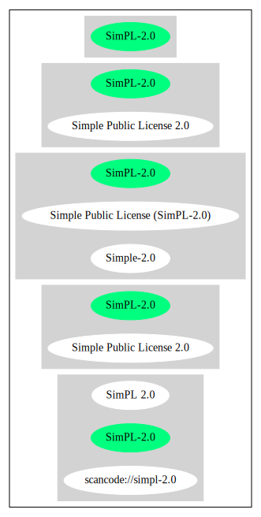

== Simple Public License 2.0 (SimPL-2.0)

[cols=",",options="header",]
|===
|Key |Value
|Fullname |Simple Public License 2.0
|Shortname |SimPL-2.0
|Rating |Unknown, probably Attention or Stop or No-Go
|Classification |Copyleft
|===

*Other Names:*

* `+scancode://simpl-2.0+`
* `+SimPL 2.0+`
* `+Simple-2.0+`
* `+Simple Public License (SimPL-2.0)+`

=== Comments on (easy) usability

* **↑**``Is OSI Approved'' (source:
https://spdx.org/licenses/SimPL-2.0.html[SPDX])

=== General Comments

* ``Per SPDX.org, this license is OSI certified'' (source:
https://github.com/nexB/scancode-toolkit/blob/develop/src/licensedcode/data/licenses/simpl-2.0.yml[Scancode])

=== URLs

* *Homepage:* http://www.opensource.org/licenses/simpl-2.0.html
* *OSI Page:* https://opensource.org/licenses/Simple-2.0
* *SPDX:* http://spdx.org/licenses/SimPL-2.0.json
* https://opensource.org/licenses/SimPL-2.0
* http://www.opensource.org/licenses/SimPL-2.0

=== Text

....
Preamble
This Simple Public License 2.0 (SimPL 2.0 for short) is a plain language implementation of GPL 2.0.  The words are different, but the goal is the same - to guarantee for all users the freedom to share and change software.  If anyone wonders about the meaning of the SimPL, they should interpret it as consistent with GPL 2.0.

Simple Public License (SimPL) 2.0
The SimPL applies to the software's source and object code and comes with any rights that I have in it (other than trademarks). You agree to the SimPL by copying, distributing, or making a derivative work of the software.

You get the royalty free right to:
Use the software for any purpose;
Make derivative works of it (this is called a "Derived Work");
Copy and distribute it and any Derived Work.

If you distribute the software or a Derived Work, you must give back to the community by:
Prominently noting the date of any changes you make;
Leaving other people's copyright notices, warranty disclaimers, and license terms  in place;
Providing the source code, build scripts, installation scripts, and interface definitions in a form that is easy to get and best to modify;
Licensing it to everyone under SimPL, or substantially similar terms (such as GPL 2.0), without adding further restrictions to the rights provided;
Conspicuously announcing that it is available under that license.

There are some things that you must shoulder:
You get NO WARRANTIES. None of any kind;
If the software damages you in any way, you may only recover direct damages up to the amount you paid for it (that is zero if you did not pay anything). You may not recover any other damages, including those called "consequential damages." (The state or country where you live may not allow you to limit your liability in this way, so this may not apply to you);

The SimPL continues perpetually, except that your license rights end automatically if:
You do not abide by the "give back to the community" terms (your licensees get to keep their rights if they abide);
Anyone prevents you from distributing the software under the terms of the SimPL.

License for the License
You may do anything that you want with the SimPL text; it's a license form to use in any way that you find helpful.  To avoid confusion, however, if you change the terms in any way then you may not call your license the Simple Public License or the SimPL (but feel free to acknowledge that your license is "based on the Simple Public License").
....

'''''

=== Raw Data

....
{
    "__impliedNames": [
        "SimPL-2.0",
        "Simple Public License 2.0",
        "scancode://simpl-2.0",
        "SimPL 2.0",
        "Simple-2.0",
        "Simple Public License (SimPL-2.0)"
    ],
    "__impliedId": "SimPL-2.0",
    "__impliedComments": [
        [
            "Scancode",
            [
                "Per SPDX.org, this license is OSI certified"
            ]
        ]
    ],
    "facts": {
        "Open Knowledge International": {
            "is_generic": null,
            "status": "active",
            "domain_software": true,
            "url": "https://opensource.org/licenses/SimPL-2.0",
            "maintainer": "",
            "od_conformance": "not reviewed",
            "_sourceURL": "https://github.com/okfn/licenses/blob/master/licenses.csv",
            "domain_data": false,
            "osd_conformance": "approved",
            "id": "SimPL-2.0",
            "title": "Simple Public License 2.0",
            "_implications": {
                "__impliedNames": [
                    "SimPL-2.0",
                    "Simple Public License 2.0"
                ],
                "__impliedId": "SimPL-2.0",
                "__impliedURLs": [
                    [
                        null,
                        "https://opensource.org/licenses/SimPL-2.0"
                    ]
                ]
            },
            "domain_content": false
        },
        "SPDX": {
            "isSPDXLicenseDeprecated": false,
            "spdxFullName": "Simple Public License 2.0",
            "spdxDetailsURL": "http://spdx.org/licenses/SimPL-2.0.json",
            "_sourceURL": "https://spdx.org/licenses/SimPL-2.0.html",
            "spdxLicIsOSIApproved": true,
            "spdxSeeAlso": [
                "https://opensource.org/licenses/SimPL-2.0"
            ],
            "_implications": {
                "__impliedNames": [
                    "SimPL-2.0",
                    "Simple Public License 2.0"
                ],
                "__impliedId": "SimPL-2.0",
                "__impliedJudgement": [
                    [
                        "SPDX",
                        {
                            "tag": "PositiveJudgement",
                            "contents": "Is OSI Approved"
                        }
                    ]
                ],
                "__isOsiApproved": true,
                "__impliedURLs": [
                    [
                        "SPDX",
                        "http://spdx.org/licenses/SimPL-2.0.json"
                    ],
                    [
                        null,
                        "https://opensource.org/licenses/SimPL-2.0"
                    ]
                ]
            },
            "spdxLicenseId": "SimPL-2.0"
        },
        "Scancode": {
            "otherUrls": [
                "http://www.opensource.org/licenses/SimPL-2.0",
                "https://opensource.org/licenses/SimPL-2.0"
            ],
            "homepageUrl": "http://www.opensource.org/licenses/simpl-2.0.html",
            "shortName": "SimPL 2.0",
            "textUrls": null,
            "text": "Preamble\nThis Simple Public License 2.0 (SimPL 2.0 for short) is a plain language implementation of GPL 2.0.  The words are different, but the goal is the same - to guarantee for all users the freedom to share and change software.  If anyone wonders about the meaning of the SimPL, they should interpret it as consistent with GPL 2.0.\n\nSimple Public License (SimPL) 2.0\nThe SimPL applies to the software's source and object code and comes with any rights that I have in it (other than trademarks). You agree to the SimPL by copying, distributing, or making a derivative work of the software.\n\nYou get the royalty free right to:\nUse the software for any purpose;\nMake derivative works of it (this is called a \"Derived Work\");\nCopy and distribute it and any Derived Work.\n\nIf you distribute the software or a Derived Work, you must give back to the community by:\nProminently noting the date of any changes you make;\nLeaving other people's copyright notices, warranty disclaimers, and license terms  in place;\nProviding the source code, build scripts, installation scripts, and interface definitions in a form that is easy to get and best to modify;\nLicensing it to everyone under SimPL, or substantially similar terms (such as GPL 2.0), without adding further restrictions to the rights provided;\nConspicuously announcing that it is available under that license.\n\nThere are some things that you must shoulder:\nYou get NO WARRANTIES. None of any kind;\nIf the software damages you in any way, you may only recover direct damages up to the amount you paid for it (that is zero if you did not pay anything). You may not recover any other damages, including those called \"consequential damages.\" (The state or country where you live may not allow you to limit your liability in this way, so this may not apply to you);\n\nThe SimPL continues perpetually, except that your license rights end automatically if:\nYou do not abide by the \"give back to the community\" terms (your licensees get to keep their rights if they abide);\nAnyone prevents you from distributing the software under the terms of the SimPL.\n\nLicense for the License\nYou may do anything that you want with the SimPL text; it's a license form to use in any way that you find helpful.  To avoid confusion, however, if you change the terms in any way then you may not call your license the Simple Public License or the SimPL (but feel free to acknowledge that your license is \"based on the Simple Public License\").",
            "category": "Copyleft",
            "osiUrl": "http://www.opensource.org/licenses/simpl-2.0.html",
            "owner": "OSI - Open Source Initiative",
            "_sourceURL": "https://github.com/nexB/scancode-toolkit/blob/develop/src/licensedcode/data/licenses/simpl-2.0.yml",
            "key": "simpl-2.0",
            "name": "Simple Public License Version 2.0",
            "spdxId": "SimPL-2.0",
            "notes": "Per SPDX.org, this license is OSI certified",
            "_implications": {
                "__impliedNames": [
                    "scancode://simpl-2.0",
                    "SimPL 2.0",
                    "SimPL-2.0"
                ],
                "__impliedId": "SimPL-2.0",
                "__impliedComments": [
                    [
                        "Scancode",
                        [
                            "Per SPDX.org, this license is OSI certified"
                        ]
                    ]
                ],
                "__impliedCopyleft": [
                    [
                        "Scancode",
                        "Copyleft"
                    ]
                ],
                "__calculatedCopyleft": "Copyleft",
                "__impliedText": "Preamble\nThis Simple Public License 2.0 (SimPL 2.0 for short) is a plain language implementation of GPL 2.0.  The words are different, but the goal is the same - to guarantee for all users the freedom to share and change software.  If anyone wonders about the meaning of the SimPL, they should interpret it as consistent with GPL 2.0.\n\nSimple Public License (SimPL) 2.0\nThe SimPL applies to the software's source and object code and comes with any rights that I have in it (other than trademarks). You agree to the SimPL by copying, distributing, or making a derivative work of the software.\n\nYou get the royalty free right to:\nUse the software for any purpose;\nMake derivative works of it (this is called a \"Derived Work\");\nCopy and distribute it and any Derived Work.\n\nIf you distribute the software or a Derived Work, you must give back to the community by:\nProminently noting the date of any changes you make;\nLeaving other people's copyright notices, warranty disclaimers, and license terms  in place;\nProviding the source code, build scripts, installation scripts, and interface definitions in a form that is easy to get and best to modify;\nLicensing it to everyone under SimPL, or substantially similar terms (such as GPL 2.0), without adding further restrictions to the rights provided;\nConspicuously announcing that it is available under that license.\n\nThere are some things that you must shoulder:\nYou get NO WARRANTIES. None of any kind;\nIf the software damages you in any way, you may only recover direct damages up to the amount you paid for it (that is zero if you did not pay anything). You may not recover any other damages, including those called \"consequential damages.\" (The state or country where you live may not allow you to limit your liability in this way, so this may not apply to you);\n\nThe SimPL continues perpetually, except that your license rights end automatically if:\nYou do not abide by the \"give back to the community\" terms (your licensees get to keep their rights if they abide);\nAnyone prevents you from distributing the software under the terms of the SimPL.\n\nLicense for the License\nYou may do anything that you want with the SimPL text; it's a license form to use in any way that you find helpful.  To avoid confusion, however, if you change the terms in any way then you may not call your license the Simple Public License or the SimPL (but feel free to acknowledge that your license is \"based on the Simple Public License\").",
                "__impliedURLs": [
                    [
                        "Homepage",
                        "http://www.opensource.org/licenses/simpl-2.0.html"
                    ],
                    [
                        "OSI Page",
                        "http://www.opensource.org/licenses/simpl-2.0.html"
                    ],
                    [
                        null,
                        "http://www.opensource.org/licenses/SimPL-2.0"
                    ],
                    [
                        null,
                        "https://opensource.org/licenses/SimPL-2.0"
                    ]
                ]
            }
        },
        "Cavil": {
            "implications": {
                "__impliedNames": [
                    "SimPL-2.0",
                    "SimPL-2.0"
                ],
                "__impliedId": "SimPL-2.0"
            },
            "shortname": "SimPL-2.0",
            "riskInt": 5,
            "trademarkInt": 0,
            "opinionInt": 0,
            "otherNames": [
                "SimPL-2.0"
            ],
            "patentInt": 0
        },
        "OpenChainPolicyTemplate": {
            "isSaaSDeemed": "no",
            "licenseType": "copyleft",
            "freedomOrDeath": "no",
            "typeCopyleft": "yes",
            "_sourceURL": "https://github.com/OpenChain-Project/curriculum/raw/ddf1e879341adbd9b297cd67c5d5c16b2076540b/policy-template/Open%20Source%20Policy%20Template%20for%20OpenChain%20Specification%201.2.ods",
            "name": "Simple Public License 2.0 ",
            "commercialUse": true,
            "spdxId": "SimPL-2.0",
            "_implications": {
                "__impliedNames": [
                    "SimPL-2.0"
                ]
            }
        },
        "OpenSourceInitiative": {
            "text": [
                {
                    "url": "https://opensource.org/licenses/Simple-2.0",
                    "title": "HTML",
                    "media_type": "text/html"
                }
            ],
            "identifiers": [
                {
                    "identifier": "SimPL-2.0",
                    "scheme": "SPDX"
                }
            ],
            "superseded_by": null,
            "_sourceURL": "https://opensource.org/licenses/",
            "name": "Simple Public License (SimPL-2.0)",
            "other_names": [],
            "keywords": [
                "osi-approved"
            ],
            "id": "Simple-2.0",
            "links": [
                {
                    "note": "OSI Page",
                    "url": "https://opensource.org/licenses/Simple-2.0"
                }
            ],
            "_implications": {
                "__impliedNames": [
                    "Simple-2.0",
                    "Simple Public License (SimPL-2.0)",
                    "SimPL-2.0"
                ],
                "__impliedURLs": [
                    [
                        "OSI Page",
                        "https://opensource.org/licenses/Simple-2.0"
                    ]
                ]
            }
        }
    },
    "__impliedJudgement": [
        [
            "SPDX",
            {
                "tag": "PositiveJudgement",
                "contents": "Is OSI Approved"
            }
        ]
    ],
    "__impliedCopyleft": [
        [
            "Scancode",
            "Copyleft"
        ]
    ],
    "__calculatedCopyleft": "Copyleft",
    "__isOsiApproved": true,
    "__impliedText": "Preamble\nThis Simple Public License 2.0 (SimPL 2.0 for short) is a plain language implementation of GPL 2.0.  The words are different, but the goal is the same - to guarantee for all users the freedom to share and change software.  If anyone wonders about the meaning of the SimPL, they should interpret it as consistent with GPL 2.0.\n\nSimple Public License (SimPL) 2.0\nThe SimPL applies to the software's source and object code and comes with any rights that I have in it (other than trademarks). You agree to the SimPL by copying, distributing, or making a derivative work of the software.\n\nYou get the royalty free right to:\nUse the software for any purpose;\nMake derivative works of it (this is called a \"Derived Work\");\nCopy and distribute it and any Derived Work.\n\nIf you distribute the software or a Derived Work, you must give back to the community by:\nProminently noting the date of any changes you make;\nLeaving other people's copyright notices, warranty disclaimers, and license terms  in place;\nProviding the source code, build scripts, installation scripts, and interface definitions in a form that is easy to get and best to modify;\nLicensing it to everyone under SimPL, or substantially similar terms (such as GPL 2.0), without adding further restrictions to the rights provided;\nConspicuously announcing that it is available under that license.\n\nThere are some things that you must shoulder:\nYou get NO WARRANTIES. None of any kind;\nIf the software damages you in any way, you may only recover direct damages up to the amount you paid for it (that is zero if you did not pay anything). You may not recover any other damages, including those called \"consequential damages.\" (The state or country where you live may not allow you to limit your liability in this way, so this may not apply to you);\n\nThe SimPL continues perpetually, except that your license rights end automatically if:\nYou do not abide by the \"give back to the community\" terms (your licensees get to keep their rights if they abide);\nAnyone prevents you from distributing the software under the terms of the SimPL.\n\nLicense for the License\nYou may do anything that you want with the SimPL text; it's a license form to use in any way that you find helpful.  To avoid confusion, however, if you change the terms in any way then you may not call your license the Simple Public License or the SimPL (but feel free to acknowledge that your license is \"based on the Simple Public License\").",
    "__impliedURLs": [
        [
            "SPDX",
            "http://spdx.org/licenses/SimPL-2.0.json"
        ],
        [
            null,
            "https://opensource.org/licenses/SimPL-2.0"
        ],
        [
            "Homepage",
            "http://www.opensource.org/licenses/simpl-2.0.html"
        ],
        [
            "OSI Page",
            "http://www.opensource.org/licenses/simpl-2.0.html"
        ],
        [
            null,
            "http://www.opensource.org/licenses/SimPL-2.0"
        ],
        [
            "OSI Page",
            "https://opensource.org/licenses/Simple-2.0"
        ]
    ]
}
....

'''''

=== Dot Cluster Graph

