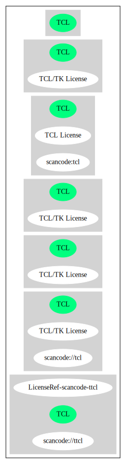

== TCL/TK License (TCL)

[cols=",",options="header",]
|===
|Key |Value
|Fullname |TCL/TK License
|Shortname |TCL
|Rating |Go
|Classification |NoCopyleft
|===

*Other Names:*

* `+scancode://tcl+`

=== Comments on (easy) usability

* **↑**``Rating is: Bronze'' (source:
https://blueoakcouncil.org/list[BlueOak License List])

=== General Comments

=== URLs

* *Homepage:* http://www.tcl.tk/software/tcltk/license.html
* *SPDX:* http://spdx.org/licenses/TCL.json
* *SPDX:* https://spdx.org/licenses/TCL.html
* https://fedoraproject.org/wiki/Licensing/TCL

=== Text

....
This software is copyrighted by the Regents of the University of
California, Sun Microsystems, Inc., Scriptics Corporation, ActiveState
Corporation and other parties.  The following terms apply to all files
associated with the software unless explicitly disclaimed in
individual files.

The authors hereby grant permission to use, copy, modify, distribute,
and license this software and its documentation for any purpose, provided
that existing copyright notices are retained in all copies and that this
notice is included verbatim in any distributions. No written agreement,
license, or royalty fee is required for any of the authorized uses.
Modifications to this software may be copyrighted by their authors
and need not follow the licensing terms described here, provided that
the new terms are clearly indicated on the first page of each file where
they apply.

IN NO EVENT SHALL THE AUTHORS OR DISTRIBUTORS BE LIABLE TO ANY PARTY
FOR DIRECT, INDIRECT, SPECIAL, INCIDENTAL, OR CONSEQUENTIAL DAMAGES
ARISING OUT OF THE USE OF THIS SOFTWARE, ITS DOCUMENTATION, OR ANY
DERIVATIVES THEREOF, EVEN IF THE AUTHORS HAVE BEEN ADVISED OF THE
POSSIBILITY OF SUCH DAMAGE.

THE AUTHORS AND DISTRIBUTORS SPECIFICALLY DISCLAIM ANY WARRANTIES,
INCLUDING, BUT NOT LIMITED TO, THE IMPLIED WARRANTIES OF
MERCHANTABILITY, FITNESS FOR A PARTICULAR PURPOSE, AND NON-INFRINGEMENT.
THIS SOFTWARE IS PROVIDED ON AN "AS IS" BASIS, AND THE AUTHORS AND
DISTRIBUTORS HAVE NO OBLIGATION TO PROVIDE MAINTENANCE, SUPPORT,
UPDATES, ENHANCEMENTS, OR MODIFICATIONS.

GOVERNMENT USE: If you are acquiring this software on behalf of the
U.S. government, the Government shall have only "Restricted Rights"
in the software and related documentation as defined in the Federal
Acquisition Regulations (FARs) in Clause 52.227.19 (c) (2).  If you
are acquiring the software on behalf of the Department of Defense, the
software shall be classified as "Commercial Computer Software" and the
Government shall have only "Restricted Rights" as defined in Clause
252.227-7013 (c) (1) of DFARs.  Notwithstanding the foregoing, the
authors grant the U.S. Government and others acting in its behalf
permission to use and distribute the software in accordance with the
terms specified in this license.
....

'''''

=== Raw Data

* https://spdx.org/licenses/TCL.html[SPDX]
* https://blueoakcouncil.org/list[BlueOak License List]
* https://github.com/nexB/scancode-toolkit/blob/develop/src/licensedcode/data/licenses/tcl.yml[Scancode]
* https://github.com/finos/OSLC-handbook/blob/master/src/TCL.yaml[finos/OSLC-handbook]

....
{
    "__impliedNames": [
        "TCL",
        "TCL/TK License",
        "scancode://tcl"
    ],
    "__impliedId": "TCL",
    "facts": {
        "SPDX": {
            "isSPDXLicenseDeprecated": false,
            "spdxFullName": "TCL/TK License",
            "spdxDetailsURL": "http://spdx.org/licenses/TCL.json",
            "_sourceURL": "https://spdx.org/licenses/TCL.html",
            "spdxLicIsOSIApproved": false,
            "spdxSeeAlso": [
                "http://www.tcl.tk/software/tcltk/license.html",
                "https://fedoraproject.org/wiki/Licensing/TCL"
            ],
            "_implications": {
                "__impliedNames": [
                    "TCL",
                    "TCL/TK License"
                ],
                "__impliedId": "TCL",
                "__isOsiApproved": false,
                "__impliedURLs": [
                    [
                        "SPDX",
                        "http://spdx.org/licenses/TCL.json"
                    ],
                    [
                        null,
                        "http://www.tcl.tk/software/tcltk/license.html"
                    ],
                    [
                        null,
                        "https://fedoraproject.org/wiki/Licensing/TCL"
                    ]
                ]
            },
            "spdxLicenseId": "TCL"
        },
        "Scancode": {
            "otherUrls": [
                "http://fedoraproject.org/wiki/Licensing/TCL",
                "https://fedoraproject.org/wiki/Licensing/TCL"
            ],
            "homepageUrl": "http://www.tcl.tk/software/tcltk/license.html",
            "shortName": "TCL/TK License",
            "textUrls": null,
            "text": "This software is copyrighted by the Regents of the University of\nCalifornia, Sun Microsystems, Inc., Scriptics Corporation, ActiveState\nCorporation and other parties.  The following terms apply to all files\nassociated with the software unless explicitly disclaimed in\nindividual files.\n\nThe authors hereby grant permission to use, copy, modify, distribute,\nand license this software and its documentation for any purpose, provided\nthat existing copyright notices are retained in all copies and that this\nnotice is included verbatim in any distributions. No written agreement,\nlicense, or royalty fee is required for any of the authorized uses.\nModifications to this software may be copyrighted by their authors\nand need not follow the licensing terms described here, provided that\nthe new terms are clearly indicated on the first page of each file where\nthey apply.\n\nIN NO EVENT SHALL THE AUTHORS OR DISTRIBUTORS BE LIABLE TO ANY PARTY\nFOR DIRECT, INDIRECT, SPECIAL, INCIDENTAL, OR CONSEQUENTIAL DAMAGES\nARISING OUT OF THE USE OF THIS SOFTWARE, ITS DOCUMENTATION, OR ANY\nDERIVATIVES THEREOF, EVEN IF THE AUTHORS HAVE BEEN ADVISED OF THE\nPOSSIBILITY OF SUCH DAMAGE.\n\nTHE AUTHORS AND DISTRIBUTORS SPECIFICALLY DISCLAIM ANY WARRANTIES,\nINCLUDING, BUT NOT LIMITED TO, THE IMPLIED WARRANTIES OF\nMERCHANTABILITY, FITNESS FOR A PARTICULAR PURPOSE, AND NON-INFRINGEMENT.\nTHIS SOFTWARE IS PROVIDED ON AN \"AS IS\" BASIS, AND THE AUTHORS AND\nDISTRIBUTORS HAVE NO OBLIGATION TO PROVIDE MAINTENANCE, SUPPORT,\nUPDATES, ENHANCEMENTS, OR MODIFICATIONS.\n\nGOVERNMENT USE: If you are acquiring this software on behalf of the\nU.S. government, the Government shall have only \"Restricted Rights\"\nin the software and related documentation as defined in the Federal\nAcquisition Regulations (FARs) in Clause 52.227.19 (c) (2).  If you\nare acquiring the software on behalf of the Department of Defense, the\nsoftware shall be classified as \"Commercial Computer Software\" and the\nGovernment shall have only \"Restricted Rights\" as defined in Clause\n252.227-7013 (c) (1) of DFARs.  Notwithstanding the foregoing, the\nauthors grant the U.S. Government and others acting in its behalf\npermission to use and distribute the software in accordance with the\nterms specified in this license.",
            "category": "Permissive",
            "osiUrl": null,
            "owner": "Tcl Developer Xchange",
            "_sourceURL": "https://github.com/nexB/scancode-toolkit/blob/develop/src/licensedcode/data/licenses/tcl.yml",
            "key": "tcl",
            "name": "TCL/TK License",
            "spdxId": "TCL",
            "notes": null,
            "_implications": {
                "__impliedNames": [
                    "scancode://tcl",
                    "TCL/TK License",
                    "TCL"
                ],
                "__impliedId": "TCL",
                "__impliedCopyleft": [
                    [
                        "Scancode",
                        "NoCopyleft"
                    ]
                ],
                "__calculatedCopyleft": "NoCopyleft",
                "__impliedText": "This software is copyrighted by the Regents of the University of\nCalifornia, Sun Microsystems, Inc., Scriptics Corporation, ActiveState\nCorporation and other parties.  The following terms apply to all files\nassociated with the software unless explicitly disclaimed in\nindividual files.\n\nThe authors hereby grant permission to use, copy, modify, distribute,\nand license this software and its documentation for any purpose, provided\nthat existing copyright notices are retained in all copies and that this\nnotice is included verbatim in any distributions. No written agreement,\nlicense, or royalty fee is required for any of the authorized uses.\nModifications to this software may be copyrighted by their authors\nand need not follow the licensing terms described here, provided that\nthe new terms are clearly indicated on the first page of each file where\nthey apply.\n\nIN NO EVENT SHALL THE AUTHORS OR DISTRIBUTORS BE LIABLE TO ANY PARTY\nFOR DIRECT, INDIRECT, SPECIAL, INCIDENTAL, OR CONSEQUENTIAL DAMAGES\nARISING OUT OF THE USE OF THIS SOFTWARE, ITS DOCUMENTATION, OR ANY\nDERIVATIVES THEREOF, EVEN IF THE AUTHORS HAVE BEEN ADVISED OF THE\nPOSSIBILITY OF SUCH DAMAGE.\n\nTHE AUTHORS AND DISTRIBUTORS SPECIFICALLY DISCLAIM ANY WARRANTIES,\nINCLUDING, BUT NOT LIMITED TO, THE IMPLIED WARRANTIES OF\nMERCHANTABILITY, FITNESS FOR A PARTICULAR PURPOSE, AND NON-INFRINGEMENT.\nTHIS SOFTWARE IS PROVIDED ON AN \"AS IS\" BASIS, AND THE AUTHORS AND\nDISTRIBUTORS HAVE NO OBLIGATION TO PROVIDE MAINTENANCE, SUPPORT,\nUPDATES, ENHANCEMENTS, OR MODIFICATIONS.\n\nGOVERNMENT USE: If you are acquiring this software on behalf of the\nU.S. government, the Government shall have only \"Restricted Rights\"\nin the software and related documentation as defined in the Federal\nAcquisition Regulations (FARs) in Clause 52.227.19 (c) (2).  If you\nare acquiring the software on behalf of the Department of Defense, the\nsoftware shall be classified as \"Commercial Computer Software\" and the\nGovernment shall have only \"Restricted Rights\" as defined in Clause\n252.227-7013 (c) (1) of DFARs.  Notwithstanding the foregoing, the\nauthors grant the U.S. Government and others acting in its behalf\npermission to use and distribute the software in accordance with the\nterms specified in this license.",
                "__impliedURLs": [
                    [
                        "Homepage",
                        "http://www.tcl.tk/software/tcltk/license.html"
                    ],
                    [
                        null,
                        "http://fedoraproject.org/wiki/Licensing/TCL"
                    ],
                    [
                        null,
                        "https://fedoraproject.org/wiki/Licensing/TCL"
                    ]
                ]
            }
        },
        "BlueOak License List": {
            "BlueOakRating": "Bronze",
            "url": "https://spdx.org/licenses/TCL.html",
            "isPermissive": true,
            "_sourceURL": "https://blueoakcouncil.org/list",
            "name": "TCL/TK License",
            "id": "TCL",
            "_implications": {
                "__impliedNames": [
                    "TCL",
                    "TCL/TK License"
                ],
                "__impliedJudgement": [
                    [
                        "BlueOak License List",
                        {
                            "tag": "PositiveJudgement",
                            "contents": "Rating is: Bronze"
                        }
                    ]
                ],
                "__impliedCopyleft": [
                    [
                        "BlueOak License List",
                        "NoCopyleft"
                    ]
                ],
                "__calculatedCopyleft": "NoCopyleft",
                "__impliedURLs": [
                    [
                        "SPDX",
                        "https://spdx.org/licenses/TCL.html"
                    ]
                ]
            }
        },
        "finos/OSLC-handbook": {
            "terms": [
                {
                    "termUseCases": [
                        "UB",
                        "MB",
                        "US",
                        "MS"
                    ],
                    "termSeeAlso": null,
                    "termDescription": "Provide copy of license",
                    "termComplianceNotes": null,
                    "termType": "condition"
                },
                {
                    "termUseCases": [
                        "UB",
                        "MB",
                        "US",
                        "MS"
                    ],
                    "termSeeAlso": null,
                    "termDescription": "Retain copyright notices",
                    "termComplianceNotes": null,
                    "termType": "condition"
                },
                {
                    "termUseCases": [
                        "MB",
                        "MS"
                    ],
                    "termSeeAlso": null,
                    "termDescription": "Modified versions need not follow this license, provided that new license terms appear on first page of each applicable file",
                    "termComplianceNotes": null,
                    "termType": "other"
                }
            ],
            "_sourceURL": "https://github.com/finos/OSLC-handbook/blob/master/src/TCL.yaml",
            "name": "TCL/TK License",
            "nameFromFilename": "TCL",
            "notes": null,
            "_implications": {
                "__impliedNames": [
                    "TCL",
                    "TCL/TK License"
                ]
            },
            "licenseId": [
                "TCL",
                "TCL/TK License"
            ]
        }
    },
    "__impliedJudgement": [
        [
            "BlueOak License List",
            {
                "tag": "PositiveJudgement",
                "contents": "Rating is: Bronze"
            }
        ]
    ],
    "__impliedCopyleft": [
        [
            "BlueOak License List",
            "NoCopyleft"
        ],
        [
            "Scancode",
            "NoCopyleft"
        ]
    ],
    "__calculatedCopyleft": "NoCopyleft",
    "__isOsiApproved": false,
    "__impliedText": "This software is copyrighted by the Regents of the University of\nCalifornia, Sun Microsystems, Inc., Scriptics Corporation, ActiveState\nCorporation and other parties.  The following terms apply to all files\nassociated with the software unless explicitly disclaimed in\nindividual files.\n\nThe authors hereby grant permission to use, copy, modify, distribute,\nand license this software and its documentation for any purpose, provided\nthat existing copyright notices are retained in all copies and that this\nnotice is included verbatim in any distributions. No written agreement,\nlicense, or royalty fee is required for any of the authorized uses.\nModifications to this software may be copyrighted by their authors\nand need not follow the licensing terms described here, provided that\nthe new terms are clearly indicated on the first page of each file where\nthey apply.\n\nIN NO EVENT SHALL THE AUTHORS OR DISTRIBUTORS BE LIABLE TO ANY PARTY\nFOR DIRECT, INDIRECT, SPECIAL, INCIDENTAL, OR CONSEQUENTIAL DAMAGES\nARISING OUT OF THE USE OF THIS SOFTWARE, ITS DOCUMENTATION, OR ANY\nDERIVATIVES THEREOF, EVEN IF THE AUTHORS HAVE BEEN ADVISED OF THE\nPOSSIBILITY OF SUCH DAMAGE.\n\nTHE AUTHORS AND DISTRIBUTORS SPECIFICALLY DISCLAIM ANY WARRANTIES,\nINCLUDING, BUT NOT LIMITED TO, THE IMPLIED WARRANTIES OF\nMERCHANTABILITY, FITNESS FOR A PARTICULAR PURPOSE, AND NON-INFRINGEMENT.\nTHIS SOFTWARE IS PROVIDED ON AN \"AS IS\" BASIS, AND THE AUTHORS AND\nDISTRIBUTORS HAVE NO OBLIGATION TO PROVIDE MAINTENANCE, SUPPORT,\nUPDATES, ENHANCEMENTS, OR MODIFICATIONS.\n\nGOVERNMENT USE: If you are acquiring this software on behalf of the\nU.S. government, the Government shall have only \"Restricted Rights\"\nin the software and related documentation as defined in the Federal\nAcquisition Regulations (FARs) in Clause 52.227.19 (c) (2).  If you\nare acquiring the software on behalf of the Department of Defense, the\nsoftware shall be classified as \"Commercial Computer Software\" and the\nGovernment shall have only \"Restricted Rights\" as defined in Clause\n252.227-7013 (c) (1) of DFARs.  Notwithstanding the foregoing, the\nauthors grant the U.S. Government and others acting in its behalf\npermission to use and distribute the software in accordance with the\nterms specified in this license.",
    "__impliedURLs": [
        [
            "SPDX",
            "http://spdx.org/licenses/TCL.json"
        ],
        [
            null,
            "http://www.tcl.tk/software/tcltk/license.html"
        ],
        [
            null,
            "https://fedoraproject.org/wiki/Licensing/TCL"
        ],
        [
            "SPDX",
            "https://spdx.org/licenses/TCL.html"
        ],
        [
            "Homepage",
            "http://www.tcl.tk/software/tcltk/license.html"
        ],
        [
            null,
            "http://fedoraproject.org/wiki/Licensing/TCL"
        ]
    ]
}
....

'''''

=== Dot Cluster Graph

