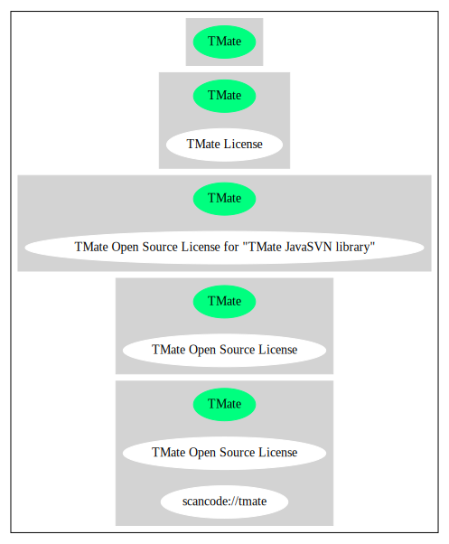

== TMate Open Source License (TMate)

[cols=",",options="header",]
|===
|Key |Value
|Fullname |TMate Open Source License
|Shortname |TMate
|Rating |Unknown, probably Attention or Stop or No-Go
|Classification |Copyleft
|===

*Other Names:*

* `+scancode://tmate+`

=== Comments on (easy) usability

=== URLs

* *Homepage:* http://svnkit.com/licensing.html
* *SPDX:* http://spdx.org/licenses/TMate.json
* http://svnkit.com/license.html

=== Text

....
This license applies to all portions of TMate SVNKit library, which 
are not externally-maintained libraries (e.g. Ganymed SSH library).

All the source code and compiled classes in package org.tigris.subversion.javahl
except SvnClient class are covered by the license in JAVAHL-LICENSE file

Copyright (c) 2004-2009 TMate Software. All rights reserved.

Redistribution and use in source and binary forms, with or without modification, 
are permitted provided that the following conditions are met:

    * Redistributions of source code must retain the above copyright notice, 
      this list of conditions and the following disclaimer.
      
    * Redistributions in binary form must reproduce the above copyright notice, 
      this list of conditions and the following disclaimer in the documentation 
      and/or other materials provided with the distribution.
      
    * Redistributions in any form must be accompanied by information on how to 
      obtain complete source code for the software that uses SVNKit and any 
      accompanying software that uses the software that uses SVNKit. The source 
      code must either be included in the distribution or be available for no 
      more than the cost of distribution plus a nominal fee, and must be freely 
      redistributable under reasonable conditions. For an executable file, complete 
      source code means the source code for all modules it contains. It does not 
      include source code for modules or files that typically accompany the major 
      components of the operating system on which the executable file runs.
      
    * Redistribution in any form without redistributing source code for software 
      that uses SVNKit is possible only when such redistribution is explictly permitted 
      by TMate Software. Please, contact TMate Software at support@svnkit.com to 
      get such permission.

THIS SOFTWARE IS PROVIDED BY TMATE SOFTWARE ``AS IS'' AND ANY EXPRESS OR IMPLIED
WARRANTIES, INCLUDING, BUT NOT LIMITED TO, THE IMPLIED WARRANTIES OF 
MERCHANTABILITY, FITNESS FOR A PARTICULAR PURPOSE, OR NON-INFRINGEMENT, ARE 
DISCLAIMED. 

IN NO EVENT SHALL TMATE SOFTWARE BE LIABLE FOR ANY DIRECT, INDIRECT, 
INCIDENTAL, SPECIAL, EXEMPLARY, OR CONSEQUENTIAL DAMAGES (INCLUDING, BUT NOT 
LIMITED TO, PROCUREMENT OF SUBSTITUTE GOODS OR SERVICES; LOSS OF USE, DATA, OR 
PROFITS; OR BUSINESS INTERRUPTION) HOWEVER CAUSED AND ON ANY THEORY OF 
LIABILITY, WHETHER IN CONTRACT, STRICT LIABILITY, OR TORT (INCLUDING NEGLIGENCE 
OR OTHERWISE) ARISING IN ANY WAY OUT OF THE USE OF THIS SOFTWARE, EVEN IF 
ADVISED OF THE POSSIBILITY OF SUCH DAMAGE.
....

'''''

=== Raw Data

....
{
    "__impliedNames": [
        "TMate",
        "TMate Open Source License",
        "scancode://tmate"
    ],
    "__impliedId": "TMate",
    "facts": {
        "SPDX": {
            "isSPDXLicenseDeprecated": false,
            "spdxFullName": "TMate Open Source License",
            "spdxDetailsURL": "http://spdx.org/licenses/TMate.json",
            "_sourceURL": "https://spdx.org/licenses/TMate.html",
            "spdxLicIsOSIApproved": false,
            "spdxSeeAlso": [
                "http://svnkit.com/license.html"
            ],
            "_implications": {
                "__impliedNames": [
                    "TMate",
                    "TMate Open Source License"
                ],
                "__impliedId": "TMate",
                "__isOsiApproved": false,
                "__impliedURLs": [
                    [
                        "SPDX",
                        "http://spdx.org/licenses/TMate.json"
                    ],
                    [
                        null,
                        "http://svnkit.com/license.html"
                    ]
                ]
            },
            "spdxLicenseId": "TMate"
        },
        "Scancode": {
            "otherUrls": null,
            "homepageUrl": "http://svnkit.com/licensing.html",
            "shortName": "TMate Open Source License",
            "textUrls": null,
            "text": "This license applies to all portions of TMate SVNKit library, which \nare not externally-maintained libraries (e.g. Ganymed SSH library).\n\nAll the source code and compiled classes in package org.tigris.subversion.javahl\nexcept SvnClient class are covered by the license in JAVAHL-LICENSE file\n\nCopyright (c) 2004-2009 TMate Software. All rights reserved.\n\nRedistribution and use in source and binary forms, with or without modification, \nare permitted provided that the following conditions are met:\n\n    * Redistributions of source code must retain the above copyright notice, \n      this list of conditions and the following disclaimer.\n      \n    * Redistributions in binary form must reproduce the above copyright notice, \n      this list of conditions and the following disclaimer in the documentation \n      and/or other materials provided with the distribution.\n      \n    * Redistributions in any form must be accompanied by information on how to \n      obtain complete source code for the software that uses SVNKit and any \n      accompanying software that uses the software that uses SVNKit. The source \n      code must either be included in the distribution or be available for no \n      more than the cost of distribution plus a nominal fee, and must be freely \n      redistributable under reasonable conditions. For an executable file, complete \n      source code means the source code for all modules it contains. It does not \n      include source code for modules or files that typically accompany the major \n      components of the operating system on which the executable file runs.\n      \n    * Redistribution in any form without redistributing source code for software \n      that uses SVNKit is possible only when such redistribution is explictly permitted \n      by TMate Software. Please, contact TMate Software at support@svnkit.com to \n      get such permission.\n\nTHIS SOFTWARE IS PROVIDED BY TMATE SOFTWARE ``AS IS'' AND ANY EXPRESS OR IMPLIED\nWARRANTIES, INCLUDING, BUT NOT LIMITED TO, THE IMPLIED WARRANTIES OF \nMERCHANTABILITY, FITNESS FOR A PARTICULAR PURPOSE, OR NON-INFRINGEMENT, ARE \nDISCLAIMED. \n\nIN NO EVENT SHALL TMATE SOFTWARE BE LIABLE FOR ANY DIRECT, INDIRECT, \nINCIDENTAL, SPECIAL, EXEMPLARY, OR CONSEQUENTIAL DAMAGES (INCLUDING, BUT NOT \nLIMITED TO, PROCUREMENT OF SUBSTITUTE GOODS OR SERVICES; LOSS OF USE, DATA, OR \nPROFITS; OR BUSINESS INTERRUPTION) HOWEVER CAUSED AND ON ANY THEORY OF \nLIABILITY, WHETHER IN CONTRACT, STRICT LIABILITY, OR TORT (INCLUDING NEGLIGENCE \nOR OTHERWISE) ARISING IN ANY WAY OUT OF THE USE OF THIS SOFTWARE, EVEN IF \nADVISED OF THE POSSIBILITY OF SUCH DAMAGE.",
            "category": "Copyleft",
            "osiUrl": null,
            "owner": "SVNKit (TMate)",
            "_sourceURL": "https://github.com/nexB/scancode-toolkit/blob/develop/src/licensedcode/data/licenses/tmate.yml",
            "key": "tmate",
            "name": "TMate Open Source License",
            "spdxId": "TMate",
            "notes": null,
            "_implications": {
                "__impliedNames": [
                    "scancode://tmate",
                    "TMate Open Source License",
                    "TMate"
                ],
                "__impliedId": "TMate",
                "__impliedCopyleft": [
                    [
                        "Scancode",
                        "Copyleft"
                    ]
                ],
                "__calculatedCopyleft": "Copyleft",
                "__impliedText": "This license applies to all portions of TMate SVNKit library, which \nare not externally-maintained libraries (e.g. Ganymed SSH library).\n\nAll the source code and compiled classes in package org.tigris.subversion.javahl\nexcept SvnClient class are covered by the license in JAVAHL-LICENSE file\n\nCopyright (c) 2004-2009 TMate Software. All rights reserved.\n\nRedistribution and use in source and binary forms, with or without modification, \nare permitted provided that the following conditions are met:\n\n    * Redistributions of source code must retain the above copyright notice, \n      this list of conditions and the following disclaimer.\n      \n    * Redistributions in binary form must reproduce the above copyright notice, \n      this list of conditions and the following disclaimer in the documentation \n      and/or other materials provided with the distribution.\n      \n    * Redistributions in any form must be accompanied by information on how to \n      obtain complete source code for the software that uses SVNKit and any \n      accompanying software that uses the software that uses SVNKit. The source \n      code must either be included in the distribution or be available for no \n      more than the cost of distribution plus a nominal fee, and must be freely \n      redistributable under reasonable conditions. For an executable file, complete \n      source code means the source code for all modules it contains. It does not \n      include source code for modules or files that typically accompany the major \n      components of the operating system on which the executable file runs.\n      \n    * Redistribution in any form without redistributing source code for software \n      that uses SVNKit is possible only when such redistribution is explictly permitted \n      by TMate Software. Please, contact TMate Software at support@svnkit.com to \n      get such permission.\n\nTHIS SOFTWARE IS PROVIDED BY TMATE SOFTWARE ``AS IS'' AND ANY EXPRESS OR IMPLIED\nWARRANTIES, INCLUDING, BUT NOT LIMITED TO, THE IMPLIED WARRANTIES OF \nMERCHANTABILITY, FITNESS FOR A PARTICULAR PURPOSE, OR NON-INFRINGEMENT, ARE \nDISCLAIMED. \n\nIN NO EVENT SHALL TMATE SOFTWARE BE LIABLE FOR ANY DIRECT, INDIRECT, \nINCIDENTAL, SPECIAL, EXEMPLARY, OR CONSEQUENTIAL DAMAGES (INCLUDING, BUT NOT \nLIMITED TO, PROCUREMENT OF SUBSTITUTE GOODS OR SERVICES; LOSS OF USE, DATA, OR \nPROFITS; OR BUSINESS INTERRUPTION) HOWEVER CAUSED AND ON ANY THEORY OF \nLIABILITY, WHETHER IN CONTRACT, STRICT LIABILITY, OR TORT (INCLUDING NEGLIGENCE \nOR OTHERWISE) ARISING IN ANY WAY OUT OF THE USE OF THIS SOFTWARE, EVEN IF \nADVISED OF THE POSSIBILITY OF SUCH DAMAGE.",
                "__impliedURLs": [
                    [
                        "Homepage",
                        "http://svnkit.com/licensing.html"
                    ]
                ]
            }
        }
    },
    "__impliedCopyleft": [
        [
            "Scancode",
            "Copyleft"
        ]
    ],
    "__calculatedCopyleft": "Copyleft",
    "__isOsiApproved": false,
    "__impliedText": "This license applies to all portions of TMate SVNKit library, which \nare not externally-maintained libraries (e.g. Ganymed SSH library).\n\nAll the source code and compiled classes in package org.tigris.subversion.javahl\nexcept SvnClient class are covered by the license in JAVAHL-LICENSE file\n\nCopyright (c) 2004-2009 TMate Software. All rights reserved.\n\nRedistribution and use in source and binary forms, with or without modification, \nare permitted provided that the following conditions are met:\n\n    * Redistributions of source code must retain the above copyright notice, \n      this list of conditions and the following disclaimer.\n      \n    * Redistributions in binary form must reproduce the above copyright notice, \n      this list of conditions and the following disclaimer in the documentation \n      and/or other materials provided with the distribution.\n      \n    * Redistributions in any form must be accompanied by information on how to \n      obtain complete source code for the software that uses SVNKit and any \n      accompanying software that uses the software that uses SVNKit. The source \n      code must either be included in the distribution or be available for no \n      more than the cost of distribution plus a nominal fee, and must be freely \n      redistributable under reasonable conditions. For an executable file, complete \n      source code means the source code for all modules it contains. It does not \n      include source code for modules or files that typically accompany the major \n      components of the operating system on which the executable file runs.\n      \n    * Redistribution in any form without redistributing source code for software \n      that uses SVNKit is possible only when such redistribution is explictly permitted \n      by TMate Software. Please, contact TMate Software at support@svnkit.com to \n      get such permission.\n\nTHIS SOFTWARE IS PROVIDED BY TMATE SOFTWARE ``AS IS'' AND ANY EXPRESS OR IMPLIED\nWARRANTIES, INCLUDING, BUT NOT LIMITED TO, THE IMPLIED WARRANTIES OF \nMERCHANTABILITY, FITNESS FOR A PARTICULAR PURPOSE, OR NON-INFRINGEMENT, ARE \nDISCLAIMED. \n\nIN NO EVENT SHALL TMATE SOFTWARE BE LIABLE FOR ANY DIRECT, INDIRECT, \nINCIDENTAL, SPECIAL, EXEMPLARY, OR CONSEQUENTIAL DAMAGES (INCLUDING, BUT NOT \nLIMITED TO, PROCUREMENT OF SUBSTITUTE GOODS OR SERVICES; LOSS OF USE, DATA, OR \nPROFITS; OR BUSINESS INTERRUPTION) HOWEVER CAUSED AND ON ANY THEORY OF \nLIABILITY, WHETHER IN CONTRACT, STRICT LIABILITY, OR TORT (INCLUDING NEGLIGENCE \nOR OTHERWISE) ARISING IN ANY WAY OUT OF THE USE OF THIS SOFTWARE, EVEN IF \nADVISED OF THE POSSIBILITY OF SUCH DAMAGE.",
    "__impliedURLs": [
        [
            "SPDX",
            "http://spdx.org/licenses/TMate.json"
        ],
        [
            null,
            "http://svnkit.com/license.html"
        ],
        [
            "Homepage",
            "http://svnkit.com/licensing.html"
        ]
    ]
}
....

'''''

=== Dot Cluster Graph

