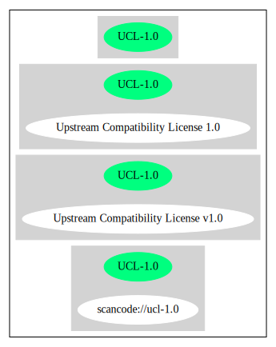

== Upstream Compatibility License v1.0 (UCL-1.0)

[cols=",",options="header",]
|===
|Key |Value
|Fullname |Upstream Compatibility License v1.0
|Shortname |UCL-1.0
|Rating |Unknown, probably Attention or Stop or No-Go
|Classification |WeakCopyleft
|===

*Other Names:*

* `+scancode://ucl-1.0+`

=== Comments on (easy) usability

* **↑**``Is OSI Approved'' (source:
https://spdx.org/licenses/UCL-1.0.html[SPDX])

=== General Comments

=== URLs

* *Homepage:* https://opensource.org/licenses/UCL-1.0
* *SPDX:* http://spdx.org/licenses/UCL-1.0.json

=== Text

....
Upstream Compatibility License v. 1.0 (UCL-1.0)

This Upstream Compatibility License (the "License") applies to any
original work of authorship (the "Original Work") whose owner (the
"Licensor") has placed the following licensing notice adjacent to the
copyright notice for the Original Work:

Licensed under the Upstream Compatibility License 1.0

1) Grant of Copyright License.

Licensor grants You a worldwide, royalty-free, non-exclusive,
sublicensable license, for the duration of the copyright, to do the
following:

a) to reproduce the Original Work in copies, either alone or as part of
a collective work;

b) to translate, adapt, alter, transform, modify, or arrange the
Original Work, thereby creating derivative works ("Derivative Works")
based upon the Original Work;

c) to distribute or communicate copies of the Original Work and
Derivative Works to the public, with the proviso that copies of Original
Work You distribute or communicate shall be licensed under this Upstream
Compatibility License and all Derivative Work You distribute or
communicate shall be licensed under both this Upstream Compatibility
License and the Apache License 2.0 or later;

d) to perform the Original Work publicly; and

e) to display the Original Work publicly.

2) Grant of Patent License.

Licensor grants You a worldwide, royalty-free, non-exclusive,
sublicensable license, under patent claims owned or controlled by the
Licensor that are embodied in the Original Work as furnished by the
Licensor, for the duration of the patents, to make, use, sell, offer for
sale, have made, and import the Original Work and Derivative Works.

3) Grant of Source Code License.

The term "Source Code" means the preferred form of the Original Work for
making modifications to it and all available documentation describing
how to modify the Original Work. Licensor agrees to provide a machine-
readable copy of the Source Code of the Original Work along with each
copy of the Original Work that Licensor distributes. Licensor reserves
the right to satisfy this obligation by placing a machine-readable copy
of the Source Code in an information repository reasonably calculated to
permit inexpensive and convenient access by You for as long as Licensor
continues to distribute the Original Work.

4) Exclusions From License Grant.

Neither the names of Licensor, nor the names of any contributors to the
Original Work, nor any of their trademarks or service marks, may be used
to endorse or promote products derived from this Original Work without
express prior permission of the Licensor. Except as expressly stated
herein, nothing in this License grants any license to Licensor's
trademarks, copyrights, patents, trade secrets or any other intellectual
property. No patent license is granted to make, use, sell, offer for
sale, have made, or import embodiments of any patent claims other than
the licensed claims defined in Section 2. No license is granted to the
trademarks of Licensor even if such marks are included in the Original
Work. Nothing in this License shall be interpreted to prohibit Licensor
from licensing under terms different from this License any Original Work
that Licensor otherwise would have a right to license.

5) External Deployment.

The term "External Deployment" means the use, distribution, or
communication of the Original Work or Derivative Works in any way such
that the Original Work or Derivative Works may be used by anyone other
than You, whether those works are distributed or communicated to those
persons or made available as an application intended for use over a
network. As an express condition for the grants of license hereunder,
You must treat any External Deployment by You of the Original Work or a
Derivative Work as a distribution under section 1(c).

6) Attribution Rights.

You must retain, in the Source Code of any Derivative Works that You
create, all copyright, patent, or trademark notices from the Source Code
of the Original Work, as well as any notices of licensing and any
descriptive text identified therein as an "Attribution Notice." You must
cause the Source Code for any Derivative Works that You create to carry
a prominent Attribution Notice reasonably calculated to inform
recipients that You have modified the Original Work.

7) Warranty of Provenance and Disclaimer of Warranty.

Licensor warrants that the copyright in and to the Original Work and the
patent rights granted herein by Licensor are owned by the Licensor or
are sublicensed to You under the terms of this License with the
permission of the contributor(s) of those copyrights and patent rights.
Except as expressly stated in the immediately preceding sentence, the
Original Work is provided under this License on an "AS IS" BASIS and
WITHOUT WARRANTY, either express or implied, including, without
limitation, the warranties of non-infringement, merchantability or
fitness for a particular purpose. THE ENTIRE RISK AS TO THE QUALITY OF
THE ORIGINAL WORK IS WITH YOU. This DISCLAIMER OF WARRANTY constitutes
an essential part of this License. No license to the Original Work is
granted by this License except under this disclaimer.

8) Limitation of Liability.

Under no circumstances and under no legal theory, whether in tort
(including negligence), contract, or otherwise, shall the Licensor be
liable to anyone for any indirect, special, incidental, or consequential
damages of any character arising as a result of this License or the use
of the Original Work including, without limitation, damages for loss of
goodwill, work stoppage, computer failure or malfunction, or any and all
other commercial damages or losses. This limitation of liability shall
not apply to the extent applicable law prohibits such limitation.

9) Acceptance and Termination.

If, at any time, You expressly assented to this License, that assent
indicates your clear and irrevocable acceptance of this License and all
of its terms and conditions. If You distribute or communicate copies of
the Original Work or a Derivative Work, You must make a reasonable
effort under the circumstances to obtain the express assent of
recipients to the terms of this License. This License conditions your
rights to undertake the activities listed in Section 1, including your
right to create Derivative Works based upon the Original Work, and doing
so without honoring these terms and conditions is prohibited by
copyright law and international treaty. Nothing in this License is
intended to affect copyright exceptions and limitations (including "fair
use" or "fair dealing"). This License shall terminate immediately and
You may no longer exercise any of the rights granted to You by this
License upon your failure to honor the conditions in Section 1(c).

10) Termination for Patent Action.

This License shall terminate automatically and You may no longer
exercise any of the rights granted to You by this License as of the date
You commence an action, including a cross-claim or counterclaim, against
Licensor or any licensee alleging that the Original Work infringes a
patent. This termination provision shall not apply for an action
alleging patent infringement by combinations of the Original Work with
other software or hardware.

11) Jurisdiction, Venue and Governing Law.

Any action or suit relating to this License may be brought only in the
courts of a jurisdiction wherein the Licensor resides or in which
Licensor conducts its primary business, and under the laws of that
jurisdiction excluding its conflict-of-law provisions. The application
of the United Nations Convention on Contracts for the International Sale
of Goods is expressly excluded. Any use of the Original Work outside the
scope of this License or after its termination shall be subject to the
requirements and penalties of copyright or patent law in the appropriate
jurisdiction. This section shall survive the termination of this
License.

12) Attorneys' Fees.

In any action to enforce the terms of this License or seeking damages
relating thereto, the prevailing party shall be entitled to recover its
costs and expenses, including, without limitation, reasonable attorneys'
fees and costs incurred in connection with such action, including any
appeal of such action. This section shall survive the termination of
this License.

13) Miscellaneous.

If any provision of this License is held to be unenforceable, such
provision shall be reformed only to the extent necessary to make it
enforceable.

14) Definition of "You" in This License.

"You" throughout this License, whether in upper or lower case, means an
individual or a legal entity exercising rights under, and complying with
all of the terms of, this License. For legal entities, "You" includes
any entity that controls, is controlled by, or is under common control
with you. For purposes of this definition, "control" means (i) the
power, direct or indirect, to cause the direction or management of such
entity, whether by contract or otherwise, or (ii) ownership of fifty
percent (50%) or more of the outstanding shares, or (iii) beneficial
ownership of such entity.

15) Right to Use.

You may use the Original Work in all ways not otherwise restricted or
conditioned by this License or by law, and Licensor promises not to
interfere with or be responsible for such uses by You.

16) Modification of This License.

This License is Copyright © 2005 Lawrence Rosen and Copyright © 2017
Nigel Tzeng. Permission is granted to copy, distribute, or communicate
this License without modification. Nothing in this License permits You
to modify this License as applied to the Original Work or to Derivative
Works. However, You may modify the text of this License and copy,
distribute or communicate your modified version (the "Modified License")
and apply it to other original works of authorship subject to the
following conditions: (i) You may not indicate in any way that your
Modified License is the "Open Software License" or "OSL" or the
"Upstream Compatibility License" or "UCL" and you may not use those
names in the name of your Modified License; (ii) You must replace the
notice specified in the first paragraph above with the notice "Licensed
under " or with a notice of your own that is not confusingly similar to
the notice in this License; and (iii) You may not claim that your
original works are open source software unless your Modified License has
been approved by Open Source Initiative (OSI) and You comply with its
license review and certification process.
....

'''''

=== Raw Data

* SPDX
* OpenChainPolicyTemplate
* Scancode

....
{
    "__impliedNames": [
        "UCL-1.0",
        "Upstream Compatibility License v1.0",
        "scancode://ucl-1.0"
    ],
    "__impliedId": "UCL-1.0",
    "facts": {
        "SPDX": {
            "isSPDXLicenseDeprecated": false,
            "spdxFullName": "Upstream Compatibility License v1.0",
            "spdxDetailsURL": "http://spdx.org/licenses/UCL-1.0.json",
            "_sourceURL": "https://spdx.org/licenses/UCL-1.0.html",
            "spdxLicIsOSIApproved": true,
            "spdxSeeAlso": [
                "https://opensource.org/licenses/UCL-1.0"
            ],
            "_implications": {
                "__impliedNames": [
                    "UCL-1.0",
                    "Upstream Compatibility License v1.0"
                ],
                "__impliedId": "UCL-1.0",
                "__impliedJudgement": [
                    [
                        "SPDX",
                        {
                            "tag": "PositiveJudgement",
                            "contents": "Is OSI Approved"
                        }
                    ]
                ],
                "__isOsiApproved": true,
                "__impliedURLs": [
                    [
                        "SPDX",
                        "http://spdx.org/licenses/UCL-1.0.json"
                    ],
                    [
                        null,
                        "https://opensource.org/licenses/UCL-1.0"
                    ]
                ]
            },
            "spdxLicenseId": "UCL-1.0"
        },
        "Scancode": {
            "otherUrls": null,
            "homepageUrl": "https://opensource.org/licenses/UCL-1.0",
            "shortName": "UCL-1.0",
            "textUrls": null,
            "text": "Upstream Compatibility License v. 1.0 (UCL-1.0)\n\nThis Upstream Compatibility License (the \"License\") applies to any\noriginal work of authorship (the \"Original Work\") whose owner (the\n\"Licensor\") has placed the following licensing notice adjacent to the\ncopyright notice for the Original Work:\n\nLicensed under the Upstream Compatibility License 1.0\n\n1) Grant of Copyright License.\n\nLicensor grants You a worldwide, royalty-free, non-exclusive,\nsublicensable license, for the duration of the copyright, to do the\nfollowing:\n\na) to reproduce the Original Work in copies, either alone or as part of\na collective work;\n\nb) to translate, adapt, alter, transform, modify, or arrange the\nOriginal Work, thereby creating derivative works (\"Derivative Works\")\nbased upon the Original Work;\n\nc) to distribute or communicate copies of the Original Work and\nDerivative Works to the public, with the proviso that copies of Original\nWork You distribute or communicate shall be licensed under this Upstream\nCompatibility License and all Derivative Work You distribute or\ncommunicate shall be licensed under both this Upstream Compatibility\nLicense and the Apache License 2.0 or later;\n\nd) to perform the Original Work publicly; and\n\ne) to display the Original Work publicly.\n\n2) Grant of Patent License.\n\nLicensor grants You a worldwide, royalty-free, non-exclusive,\nsublicensable license, under patent claims owned or controlled by the\nLicensor that are embodied in the Original Work as furnished by the\nLicensor, for the duration of the patents, to make, use, sell, offer for\nsale, have made, and import the Original Work and Derivative Works.\n\n3) Grant of Source Code License.\n\nThe term \"Source Code\" means the preferred form of the Original Work for\nmaking modifications to it and all available documentation describing\nhow to modify the Original Work. Licensor agrees to provide a machine-\nreadable copy of the Source Code of the Original Work along with each\ncopy of the Original Work that Licensor distributes. Licensor reserves\nthe right to satisfy this obligation by placing a machine-readable copy\nof the Source Code in an information repository reasonably calculated to\npermit inexpensive and convenient access by You for as long as Licensor\ncontinues to distribute the Original Work.\n\n4) Exclusions From License Grant.\n\nNeither the names of Licensor, nor the names of any contributors to the\nOriginal Work, nor any of their trademarks or service marks, may be used\nto endorse or promote products derived from this Original Work without\nexpress prior permission of the Licensor. Except as expressly stated\nherein, nothing in this License grants any license to Licensor's\ntrademarks, copyrights, patents, trade secrets or any other intellectual\nproperty. No patent license is granted to make, use, sell, offer for\nsale, have made, or import embodiments of any patent claims other than\nthe licensed claims defined in Section 2. No license is granted to the\ntrademarks of Licensor even if such marks are included in the Original\nWork. Nothing in this License shall be interpreted to prohibit Licensor\nfrom licensing under terms different from this License any Original Work\nthat Licensor otherwise would have a right to license.\n\n5) External Deployment.\n\nThe term \"External Deployment\" means the use, distribution, or\ncommunication of the Original Work or Derivative Works in any way such\nthat the Original Work or Derivative Works may be used by anyone other\nthan You, whether those works are distributed or communicated to those\npersons or made available as an application intended for use over a\nnetwork. As an express condition for the grants of license hereunder,\nYou must treat any External Deployment by You of the Original Work or a\nDerivative Work as a distribution under section 1(c).\n\n6) Attribution Rights.\n\nYou must retain, in the Source Code of any Derivative Works that You\ncreate, all copyright, patent, or trademark notices from the Source Code\nof the Original Work, as well as any notices of licensing and any\ndescriptive text identified therein as an \"Attribution Notice.\" You must\ncause the Source Code for any Derivative Works that You create to carry\na prominent Attribution Notice reasonably calculated to inform\nrecipients that You have modified the Original Work.\n\n7) Warranty of Provenance and Disclaimer of Warranty.\n\nLicensor warrants that the copyright in and to the Original Work and the\npatent rights granted herein by Licensor are owned by the Licensor or\nare sublicensed to You under the terms of this License with the\npermission of the contributor(s) of those copyrights and patent rights.\nExcept as expressly stated in the immediately preceding sentence, the\nOriginal Work is provided under this License on an \"AS IS\" BASIS and\nWITHOUT WARRANTY, either express or implied, including, without\nlimitation, the warranties of non-infringement, merchantability or\nfitness for a particular purpose. THE ENTIRE RISK AS TO THE QUALITY OF\nTHE ORIGINAL WORK IS WITH YOU. This DISCLAIMER OF WARRANTY constitutes\nan essential part of this License. No license to the Original Work is\ngranted by this License except under this disclaimer.\n\n8) Limitation of Liability.\n\nUnder no circumstances and under no legal theory, whether in tort\n(including negligence), contract, or otherwise, shall the Licensor be\nliable to anyone for any indirect, special, incidental, or consequential\ndamages of any character arising as a result of this License or the use\nof the Original Work including, without limitation, damages for loss of\ngoodwill, work stoppage, computer failure or malfunction, or any and all\nother commercial damages or losses. This limitation of liability shall\nnot apply to the extent applicable law prohibits such limitation.\n\n9) Acceptance and Termination.\n\nIf, at any time, You expressly assented to this License, that assent\nindicates your clear and irrevocable acceptance of this License and all\nof its terms and conditions. If You distribute or communicate copies of\nthe Original Work or a Derivative Work, You must make a reasonable\neffort under the circumstances to obtain the express assent of\nrecipients to the terms of this License. This License conditions your\nrights to undertake the activities listed in Section 1, including your\nright to create Derivative Works based upon the Original Work, and doing\nso without honoring these terms and conditions is prohibited by\ncopyright law and international treaty. Nothing in this License is\nintended to affect copyright exceptions and limitations (including \"fair\nuse\" or \"fair dealing\"). This License shall terminate immediately and\nYou may no longer exercise any of the rights granted to You by this\nLicense upon your failure to honor the conditions in Section 1(c).\n\n10) Termination for Patent Action.\n\nThis License shall terminate automatically and You may no longer\nexercise any of the rights granted to You by this License as of the date\nYou commence an action, including a cross-claim or counterclaim, against\nLicensor or any licensee alleging that the Original Work infringes a\npatent. This termination provision shall not apply for an action\nalleging patent infringement by combinations of the Original Work with\nother software or hardware.\n\n11) Jurisdiction, Venue and Governing Law.\n\nAny action or suit relating to this License may be brought only in the\ncourts of a jurisdiction wherein the Licensor resides or in which\nLicensor conducts its primary business, and under the laws of that\njurisdiction excluding its conflict-of-law provisions. The application\nof the United Nations Convention on Contracts for the International Sale\nof Goods is expressly excluded. Any use of the Original Work outside the\nscope of this License or after its termination shall be subject to the\nrequirements and penalties of copyright or patent law in the appropriate\njurisdiction. This section shall survive the termination of this\nLicense.\n\n12) Attorneys' Fees.\n\nIn any action to enforce the terms of this License or seeking damages\nrelating thereto, the prevailing party shall be entitled to recover its\ncosts and expenses, including, without limitation, reasonable attorneys'\nfees and costs incurred in connection with such action, including any\nappeal of such action. This section shall survive the termination of\nthis License.\n\n13) Miscellaneous.\n\nIf any provision of this License is held to be unenforceable, such\nprovision shall be reformed only to the extent necessary to make it\nenforceable.\n\n14) Definition of \"You\" in This License.\n\n\"You\" throughout this License, whether in upper or lower case, means an\nindividual or a legal entity exercising rights under, and complying with\nall of the terms of, this License. For legal entities, \"You\" includes\nany entity that controls, is controlled by, or is under common control\nwith you. For purposes of this definition, \"control\" means (i) the\npower, direct or indirect, to cause the direction or management of such\nentity, whether by contract or otherwise, or (ii) ownership of fifty\npercent (50%) or more of the outstanding shares, or (iii) beneficial\nownership of such entity.\n\n15) Right to Use.\n\nYou may use the Original Work in all ways not otherwise restricted or\nconditioned by this License or by law, and Licensor promises not to\ninterfere with or be responsible for such uses by You.\n\n16) Modification of This License.\n\nThis License is Copyright © 2005 Lawrence Rosen and Copyright © 2017\nNigel Tzeng. Permission is granted to copy, distribute, or communicate\nthis License without modification. Nothing in this License permits You\nto modify this License as applied to the Original Work or to Derivative\nWorks. However, You may modify the text of this License and copy,\ndistribute or communicate your modified version (the \"Modified License\")\nand apply it to other original works of authorship subject to the\nfollowing conditions: (i) You may not indicate in any way that your\nModified License is the \"Open Software License\" or \"OSL\" or the\n\"Upstream Compatibility License\" or \"UCL\" and you may not use those\nnames in the name of your Modified License; (ii) You must replace the\nnotice specified in the first paragraph above with the notice \"Licensed\nunder \" or with a notice of your own that is not confusingly similar to\nthe notice in this License; and (iii) You may not claim that your\noriginal works are open source software unless your Modified License has\nbeen approved by Open Source Initiative (OSI) and You comply with its\nlicense review and certification process.\n",
            "category": "Copyleft Limited",
            "osiUrl": "https://opensource.org/licenses/UCL-1.0",
            "owner": "Lawrence Rosen",
            "_sourceURL": "https://github.com/nexB/scancode-toolkit/blob/develop/src/licensedcode/data/licenses/ucl-1.0.yml",
            "key": "ucl-1.0",
            "name": "Upstream Compatibility License v1.0",
            "spdxId": null,
            "notes": null,
            "_implications": {
                "__impliedNames": [
                    "scancode://ucl-1.0",
                    "UCL-1.0"
                ],
                "__impliedCopyleft": [
                    [
                        "Scancode",
                        "WeakCopyleft"
                    ]
                ],
                "__calculatedCopyleft": "WeakCopyleft",
                "__impliedText": "Upstream Compatibility License v. 1.0 (UCL-1.0)\n\nThis Upstream Compatibility License (the \"License\") applies to any\noriginal work of authorship (the \"Original Work\") whose owner (the\n\"Licensor\") has placed the following licensing notice adjacent to the\ncopyright notice for the Original Work:\n\nLicensed under the Upstream Compatibility License 1.0\n\n1) Grant of Copyright License.\n\nLicensor grants You a worldwide, royalty-free, non-exclusive,\nsublicensable license, for the duration of the copyright, to do the\nfollowing:\n\na) to reproduce the Original Work in copies, either alone or as part of\na collective work;\n\nb) to translate, adapt, alter, transform, modify, or arrange the\nOriginal Work, thereby creating derivative works (\"Derivative Works\")\nbased upon the Original Work;\n\nc) to distribute or communicate copies of the Original Work and\nDerivative Works to the public, with the proviso that copies of Original\nWork You distribute or communicate shall be licensed under this Upstream\nCompatibility License and all Derivative Work You distribute or\ncommunicate shall be licensed under both this Upstream Compatibility\nLicense and the Apache License 2.0 or later;\n\nd) to perform the Original Work publicly; and\n\ne) to display the Original Work publicly.\n\n2) Grant of Patent License.\n\nLicensor grants You a worldwide, royalty-free, non-exclusive,\nsublicensable license, under patent claims owned or controlled by the\nLicensor that are embodied in the Original Work as furnished by the\nLicensor, for the duration of the patents, to make, use, sell, offer for\nsale, have made, and import the Original Work and Derivative Works.\n\n3) Grant of Source Code License.\n\nThe term \"Source Code\" means the preferred form of the Original Work for\nmaking modifications to it and all available documentation describing\nhow to modify the Original Work. Licensor agrees to provide a machine-\nreadable copy of the Source Code of the Original Work along with each\ncopy of the Original Work that Licensor distributes. Licensor reserves\nthe right to satisfy this obligation by placing a machine-readable copy\nof the Source Code in an information repository reasonably calculated to\npermit inexpensive and convenient access by You for as long as Licensor\ncontinues to distribute the Original Work.\n\n4) Exclusions From License Grant.\n\nNeither the names of Licensor, nor the names of any contributors to the\nOriginal Work, nor any of their trademarks or service marks, may be used\nto endorse or promote products derived from this Original Work without\nexpress prior permission of the Licensor. Except as expressly stated\nherein, nothing in this License grants any license to Licensor's\ntrademarks, copyrights, patents, trade secrets or any other intellectual\nproperty. No patent license is granted to make, use, sell, offer for\nsale, have made, or import embodiments of any patent claims other than\nthe licensed claims defined in Section 2. No license is granted to the\ntrademarks of Licensor even if such marks are included in the Original\nWork. Nothing in this License shall be interpreted to prohibit Licensor\nfrom licensing under terms different from this License any Original Work\nthat Licensor otherwise would have a right to license.\n\n5) External Deployment.\n\nThe term \"External Deployment\" means the use, distribution, or\ncommunication of the Original Work or Derivative Works in any way such\nthat the Original Work or Derivative Works may be used by anyone other\nthan You, whether those works are distributed or communicated to those\npersons or made available as an application intended for use over a\nnetwork. As an express condition for the grants of license hereunder,\nYou must treat any External Deployment by You of the Original Work or a\nDerivative Work as a distribution under section 1(c).\n\n6) Attribution Rights.\n\nYou must retain, in the Source Code of any Derivative Works that You\ncreate, all copyright, patent, or trademark notices from the Source Code\nof the Original Work, as well as any notices of licensing and any\ndescriptive text identified therein as an \"Attribution Notice.\" You must\ncause the Source Code for any Derivative Works that You create to carry\na prominent Attribution Notice reasonably calculated to inform\nrecipients that You have modified the Original Work.\n\n7) Warranty of Provenance and Disclaimer of Warranty.\n\nLicensor warrants that the copyright in and to the Original Work and the\npatent rights granted herein by Licensor are owned by the Licensor or\nare sublicensed to You under the terms of this License with the\npermission of the contributor(s) of those copyrights and patent rights.\nExcept as expressly stated in the immediately preceding sentence, the\nOriginal Work is provided under this License on an \"AS IS\" BASIS and\nWITHOUT WARRANTY, either express or implied, including, without\nlimitation, the warranties of non-infringement, merchantability or\nfitness for a particular purpose. THE ENTIRE RISK AS TO THE QUALITY OF\nTHE ORIGINAL WORK IS WITH YOU. This DISCLAIMER OF WARRANTY constitutes\nan essential part of this License. No license to the Original Work is\ngranted by this License except under this disclaimer.\n\n8) Limitation of Liability.\n\nUnder no circumstances and under no legal theory, whether in tort\n(including negligence), contract, or otherwise, shall the Licensor be\nliable to anyone for any indirect, special, incidental, or consequential\ndamages of any character arising as a result of this License or the use\nof the Original Work including, without limitation, damages for loss of\ngoodwill, work stoppage, computer failure or malfunction, or any and all\nother commercial damages or losses. This limitation of liability shall\nnot apply to the extent applicable law prohibits such limitation.\n\n9) Acceptance and Termination.\n\nIf, at any time, You expressly assented to this License, that assent\nindicates your clear and irrevocable acceptance of this License and all\nof its terms and conditions. If You distribute or communicate copies of\nthe Original Work or a Derivative Work, You must make a reasonable\neffort under the circumstances to obtain the express assent of\nrecipients to the terms of this License. This License conditions your\nrights to undertake the activities listed in Section 1, including your\nright to create Derivative Works based upon the Original Work, and doing\nso without honoring these terms and conditions is prohibited by\ncopyright law and international treaty. Nothing in this License is\nintended to affect copyright exceptions and limitations (including \"fair\nuse\" or \"fair dealing\"). This License shall terminate immediately and\nYou may no longer exercise any of the rights granted to You by this\nLicense upon your failure to honor the conditions in Section 1(c).\n\n10) Termination for Patent Action.\n\nThis License shall terminate automatically and You may no longer\nexercise any of the rights granted to You by this License as of the date\nYou commence an action, including a cross-claim or counterclaim, against\nLicensor or any licensee alleging that the Original Work infringes a\npatent. This termination provision shall not apply for an action\nalleging patent infringement by combinations of the Original Work with\nother software or hardware.\n\n11) Jurisdiction, Venue and Governing Law.\n\nAny action or suit relating to this License may be brought only in the\ncourts of a jurisdiction wherein the Licensor resides or in which\nLicensor conducts its primary business, and under the laws of that\njurisdiction excluding its conflict-of-law provisions. The application\nof the United Nations Convention on Contracts for the International Sale\nof Goods is expressly excluded. Any use of the Original Work outside the\nscope of this License or after its termination shall be subject to the\nrequirements and penalties of copyright or patent law in the appropriate\njurisdiction. This section shall survive the termination of this\nLicense.\n\n12) Attorneys' Fees.\n\nIn any action to enforce the terms of this License or seeking damages\nrelating thereto, the prevailing party shall be entitled to recover its\ncosts and expenses, including, without limitation, reasonable attorneys'\nfees and costs incurred in connection with such action, including any\nappeal of such action. This section shall survive the termination of\nthis License.\n\n13) Miscellaneous.\n\nIf any provision of this License is held to be unenforceable, such\nprovision shall be reformed only to the extent necessary to make it\nenforceable.\n\n14) Definition of \"You\" in This License.\n\n\"You\" throughout this License, whether in upper or lower case, means an\nindividual or a legal entity exercising rights under, and complying with\nall of the terms of, this License. For legal entities, \"You\" includes\nany entity that controls, is controlled by, or is under common control\nwith you. For purposes of this definition, \"control\" means (i) the\npower, direct or indirect, to cause the direction or management of such\nentity, whether by contract or otherwise, or (ii) ownership of fifty\npercent (50%) or more of the outstanding shares, or (iii) beneficial\nownership of such entity.\n\n15) Right to Use.\n\nYou may use the Original Work in all ways not otherwise restricted or\nconditioned by this License or by law, and Licensor promises not to\ninterfere with or be responsible for such uses by You.\n\n16) Modification of This License.\n\nThis License is Copyright © 2005 Lawrence Rosen and Copyright © 2017\nNigel Tzeng. Permission is granted to copy, distribute, or communicate\nthis License without modification. Nothing in this License permits You\nto modify this License as applied to the Original Work or to Derivative\nWorks. However, You may modify the text of this License and copy,\ndistribute or communicate your modified version (the \"Modified License\")\nand apply it to other original works of authorship subject to the\nfollowing conditions: (i) You may not indicate in any way that your\nModified License is the \"Open Software License\" or \"OSL\" or the\n\"Upstream Compatibility License\" or \"UCL\" and you may not use those\nnames in the name of your Modified License; (ii) You must replace the\nnotice specified in the first paragraph above with the notice \"Licensed\nunder \" or with a notice of your own that is not confusingly similar to\nthe notice in this License; and (iii) You may not claim that your\noriginal works are open source software unless your Modified License has\nbeen approved by Open Source Initiative (OSI) and You comply with its\nlicense review and certification process.\n",
                "__impliedURLs": [
                    [
                        "Homepage",
                        "https://opensource.org/licenses/UCL-1.0"
                    ],
                    [
                        "OSI Page",
                        "https://opensource.org/licenses/UCL-1.0"
                    ]
                ]
            }
        },
        "OpenChainPolicyTemplate": {
            "isSaaSDeemed": "no",
            "licenseType": "copyleft",
            "freedomOrDeath": "no",
            "typeCopyleft": "yes",
            "_sourceURL": "https://github.com/OpenChain-Project/curriculum/raw/ddf1e879341adbd9b297cd67c5d5c16b2076540b/policy-template/Open%20Source%20Policy%20Template%20for%20OpenChain%20Specification%201.2.ods",
            "name": "Upstream Compatibility License v1.0",
            "commercialUse": true,
            "spdxId": "UCL-1.0",
            "_implications": {
                "__impliedNames": [
                    "UCL-1.0"
                ]
            }
        }
    },
    "__impliedJudgement": [
        [
            "SPDX",
            {
                "tag": "PositiveJudgement",
                "contents": "Is OSI Approved"
            }
        ]
    ],
    "__impliedCopyleft": [
        [
            "Scancode",
            "WeakCopyleft"
        ]
    ],
    "__calculatedCopyleft": "WeakCopyleft",
    "__isOsiApproved": true,
    "__impliedText": "Upstream Compatibility License v. 1.0 (UCL-1.0)\n\nThis Upstream Compatibility License (the \"License\") applies to any\noriginal work of authorship (the \"Original Work\") whose owner (the\n\"Licensor\") has placed the following licensing notice adjacent to the\ncopyright notice for the Original Work:\n\nLicensed under the Upstream Compatibility License 1.0\n\n1) Grant of Copyright License.\n\nLicensor grants You a worldwide, royalty-free, non-exclusive,\nsublicensable license, for the duration of the copyright, to do the\nfollowing:\n\na) to reproduce the Original Work in copies, either alone or as part of\na collective work;\n\nb) to translate, adapt, alter, transform, modify, or arrange the\nOriginal Work, thereby creating derivative works (\"Derivative Works\")\nbased upon the Original Work;\n\nc) to distribute or communicate copies of the Original Work and\nDerivative Works to the public, with the proviso that copies of Original\nWork You distribute or communicate shall be licensed under this Upstream\nCompatibility License and all Derivative Work You distribute or\ncommunicate shall be licensed under both this Upstream Compatibility\nLicense and the Apache License 2.0 or later;\n\nd) to perform the Original Work publicly; and\n\ne) to display the Original Work publicly.\n\n2) Grant of Patent License.\n\nLicensor grants You a worldwide, royalty-free, non-exclusive,\nsublicensable license, under patent claims owned or controlled by the\nLicensor that are embodied in the Original Work as furnished by the\nLicensor, for the duration of the patents, to make, use, sell, offer for\nsale, have made, and import the Original Work and Derivative Works.\n\n3) Grant of Source Code License.\n\nThe term \"Source Code\" means the preferred form of the Original Work for\nmaking modifications to it and all available documentation describing\nhow to modify the Original Work. Licensor agrees to provide a machine-\nreadable copy of the Source Code of the Original Work along with each\ncopy of the Original Work that Licensor distributes. Licensor reserves\nthe right to satisfy this obligation by placing a machine-readable copy\nof the Source Code in an information repository reasonably calculated to\npermit inexpensive and convenient access by You for as long as Licensor\ncontinues to distribute the Original Work.\n\n4) Exclusions From License Grant.\n\nNeither the names of Licensor, nor the names of any contributors to the\nOriginal Work, nor any of their trademarks or service marks, may be used\nto endorse or promote products derived from this Original Work without\nexpress prior permission of the Licensor. Except as expressly stated\nherein, nothing in this License grants any license to Licensor's\ntrademarks, copyrights, patents, trade secrets or any other intellectual\nproperty. No patent license is granted to make, use, sell, offer for\nsale, have made, or import embodiments of any patent claims other than\nthe licensed claims defined in Section 2. No license is granted to the\ntrademarks of Licensor even if such marks are included in the Original\nWork. Nothing in this License shall be interpreted to prohibit Licensor\nfrom licensing under terms different from this License any Original Work\nthat Licensor otherwise would have a right to license.\n\n5) External Deployment.\n\nThe term \"External Deployment\" means the use, distribution, or\ncommunication of the Original Work or Derivative Works in any way such\nthat the Original Work or Derivative Works may be used by anyone other\nthan You, whether those works are distributed or communicated to those\npersons or made available as an application intended for use over a\nnetwork. As an express condition for the grants of license hereunder,\nYou must treat any External Deployment by You of the Original Work or a\nDerivative Work as a distribution under section 1(c).\n\n6) Attribution Rights.\n\nYou must retain, in the Source Code of any Derivative Works that You\ncreate, all copyright, patent, or trademark notices from the Source Code\nof the Original Work, as well as any notices of licensing and any\ndescriptive text identified therein as an \"Attribution Notice.\" You must\ncause the Source Code for any Derivative Works that You create to carry\na prominent Attribution Notice reasonably calculated to inform\nrecipients that You have modified the Original Work.\n\n7) Warranty of Provenance and Disclaimer of Warranty.\n\nLicensor warrants that the copyright in and to the Original Work and the\npatent rights granted herein by Licensor are owned by the Licensor or\nare sublicensed to You under the terms of this License with the\npermission of the contributor(s) of those copyrights and patent rights.\nExcept as expressly stated in the immediately preceding sentence, the\nOriginal Work is provided under this License on an \"AS IS\" BASIS and\nWITHOUT WARRANTY, either express or implied, including, without\nlimitation, the warranties of non-infringement, merchantability or\nfitness for a particular purpose. THE ENTIRE RISK AS TO THE QUALITY OF\nTHE ORIGINAL WORK IS WITH YOU. This DISCLAIMER OF WARRANTY constitutes\nan essential part of this License. No license to the Original Work is\ngranted by this License except under this disclaimer.\n\n8) Limitation of Liability.\n\nUnder no circumstances and under no legal theory, whether in tort\n(including negligence), contract, or otherwise, shall the Licensor be\nliable to anyone for any indirect, special, incidental, or consequential\ndamages of any character arising as a result of this License or the use\nof the Original Work including, without limitation, damages for loss of\ngoodwill, work stoppage, computer failure or malfunction, or any and all\nother commercial damages or losses. This limitation of liability shall\nnot apply to the extent applicable law prohibits such limitation.\n\n9) Acceptance and Termination.\n\nIf, at any time, You expressly assented to this License, that assent\nindicates your clear and irrevocable acceptance of this License and all\nof its terms and conditions. If You distribute or communicate copies of\nthe Original Work or a Derivative Work, You must make a reasonable\neffort under the circumstances to obtain the express assent of\nrecipients to the terms of this License. This License conditions your\nrights to undertake the activities listed in Section 1, including your\nright to create Derivative Works based upon the Original Work, and doing\nso without honoring these terms and conditions is prohibited by\ncopyright law and international treaty. Nothing in this License is\nintended to affect copyright exceptions and limitations (including \"fair\nuse\" or \"fair dealing\"). This License shall terminate immediately and\nYou may no longer exercise any of the rights granted to You by this\nLicense upon your failure to honor the conditions in Section 1(c).\n\n10) Termination for Patent Action.\n\nThis License shall terminate automatically and You may no longer\nexercise any of the rights granted to You by this License as of the date\nYou commence an action, including a cross-claim or counterclaim, against\nLicensor or any licensee alleging that the Original Work infringes a\npatent. This termination provision shall not apply for an action\nalleging patent infringement by combinations of the Original Work with\nother software or hardware.\n\n11) Jurisdiction, Venue and Governing Law.\n\nAny action or suit relating to this License may be brought only in the\ncourts of a jurisdiction wherein the Licensor resides or in which\nLicensor conducts its primary business, and under the laws of that\njurisdiction excluding its conflict-of-law provisions. The application\nof the United Nations Convention on Contracts for the International Sale\nof Goods is expressly excluded. Any use of the Original Work outside the\nscope of this License or after its termination shall be subject to the\nrequirements and penalties of copyright or patent law in the appropriate\njurisdiction. This section shall survive the termination of this\nLicense.\n\n12) Attorneys' Fees.\n\nIn any action to enforce the terms of this License or seeking damages\nrelating thereto, the prevailing party shall be entitled to recover its\ncosts and expenses, including, without limitation, reasonable attorneys'\nfees and costs incurred in connection with such action, including any\nappeal of such action. This section shall survive the termination of\nthis License.\n\n13) Miscellaneous.\n\nIf any provision of this License is held to be unenforceable, such\nprovision shall be reformed only to the extent necessary to make it\nenforceable.\n\n14) Definition of \"You\" in This License.\n\n\"You\" throughout this License, whether in upper or lower case, means an\nindividual or a legal entity exercising rights under, and complying with\nall of the terms of, this License. For legal entities, \"You\" includes\nany entity that controls, is controlled by, or is under common control\nwith you. For purposes of this definition, \"control\" means (i) the\npower, direct or indirect, to cause the direction or management of such\nentity, whether by contract or otherwise, or (ii) ownership of fifty\npercent (50%) or more of the outstanding shares, or (iii) beneficial\nownership of such entity.\n\n15) Right to Use.\n\nYou may use the Original Work in all ways not otherwise restricted or\nconditioned by this License or by law, and Licensor promises not to\ninterfere with or be responsible for such uses by You.\n\n16) Modification of This License.\n\nThis License is Copyright © 2005 Lawrence Rosen and Copyright © 2017\nNigel Tzeng. Permission is granted to copy, distribute, or communicate\nthis License without modification. Nothing in this License permits You\nto modify this License as applied to the Original Work or to Derivative\nWorks. However, You may modify the text of this License and copy,\ndistribute or communicate your modified version (the \"Modified License\")\nand apply it to other original works of authorship subject to the\nfollowing conditions: (i) You may not indicate in any way that your\nModified License is the \"Open Software License\" or \"OSL\" or the\n\"Upstream Compatibility License\" or \"UCL\" and you may not use those\nnames in the name of your Modified License; (ii) You must replace the\nnotice specified in the first paragraph above with the notice \"Licensed\nunder \" or with a notice of your own that is not confusingly similar to\nthe notice in this License; and (iii) You may not claim that your\noriginal works are open source software unless your Modified License has\nbeen approved by Open Source Initiative (OSI) and You comply with its\nlicense review and certification process.\n",
    "__impliedURLs": [
        [
            "SPDX",
            "http://spdx.org/licenses/UCL-1.0.json"
        ],
        [
            null,
            "https://opensource.org/licenses/UCL-1.0"
        ],
        [
            "Homepage",
            "https://opensource.org/licenses/UCL-1.0"
        ],
        [
            "OSI Page",
            "https://opensource.org/licenses/UCL-1.0"
        ]
    ]
}
....

'''''

=== Dot Cluster Graph

