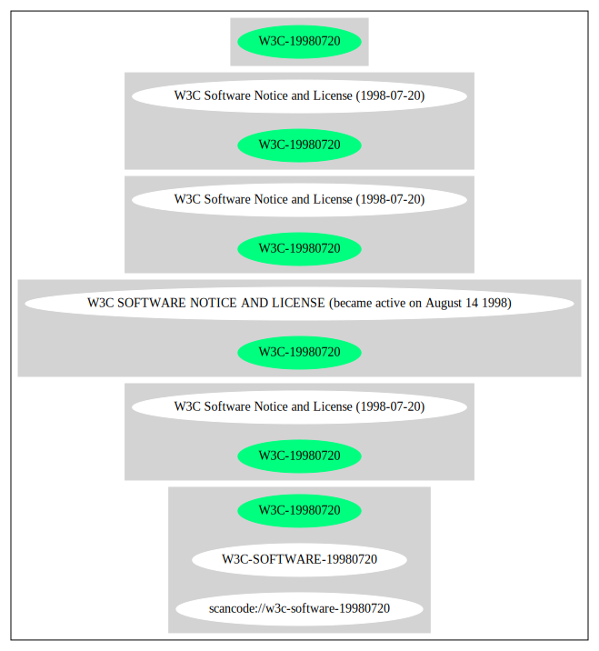

== W3C Software Notice and License (1998-07-20) (W3C-19980720)

[cols=",",options="header",]
|===
|Key |Value
|Fullname |W3C Software Notice and License (1998-07-20)
|Shortname |W3C-19980720
|Rating |Unknown, probably Stop or No-Go
|Classification |NoCopyleft
|===

*Other Names:*

* `+scancode://w3c-software-19980720+`
* `+W3C-SOFTWARE-19980720+`

=== Comments on (easy) usability

* **↑**``Google Classification is NOTICE'' (source:
https://opensource.google.com/docs/thirdparty/licenses/[Google OSS
Policy])
* **↓**``Rating is: Lead'' (source:
https://blueoakcouncil.org/list[BlueOak License List])

=== General Comments

=== URLs

* *Homepage:*
http://www.w3.org/Consortium/Legal/copyright-software-19980720.html
* *SPDX:* http://spdx.org/licenses/W3C-19980720.json
* *SPDX:* https://spdx.org/licenses/W3C-19980720.html

=== Text

....
W3C® SOFTWARE NOTICE AND LICENSE

Copyright © 1994-2002 World Wide Web Consortium, (Massachusetts Institute of
Technology, Institut National de Recherche en Informatique et en Automatique,
Keio University). All Rights Reserved. http://www.w3.org/Consortium/Legal/

This W3C work (including software, documents, or other related items) is being
provided by the copyright holders under the following license. By obtaining,
using and/or copying this work, you (the licensee) agree that you have read,
understood, and will comply with the following terms and conditions:

Permission to use, copy, modify, and distribute this software and its
documentation, with or without modification,  for any purpose and without fee or
royalty is hereby granted, provided that you include the following on ALL copies
of the software and documentation or portions thereof, including modifications,
that you make:

The full text of this NOTICE in a location viewable to users of the
redistributed or derivative work.

Any pre-existing intellectual property disclaimers, notices, or terms and
conditions. If none exist, a short notice of the following form (hypertext is
preferred, text is permitted) should be used within the body of any
redistributed or derivative code: "Copyright © [$date-of-software] World Wide
Web Consortium, (Massachusetts Institute of Technology, Institut National de
Recherche en Informatique et en Automatique, Keio University). All Rights
Reserved. http://www.w3.org/Consortium/Legal/"

Notice of any changes or modifications to the W3C files, including the date
changes were made. (We recommend you provide URIs to the location from which the
code is derived.)

THIS SOFTWARE AND DOCUMENTATION IS PROVIDED "AS IS," AND COPYRIGHT HOLDERS MAKE
NO REPRESENTATIONS OR WARRANTIES, EXPRESS OR IMPLIED, INCLUDING BUT NOT LIMITED
TO, WARRANTIES OF MERCHANTABILITY OR FITNESS FOR ANY PARTICULAR PURPOSE OR THAT
THE USE OF THE SOFTWARE OR DOCUMENTATION WILL NOT INFRINGE ANY THIRD PARTY
PATENTS, COPYRIGHTS, TRADEMARKS OR OTHER RIGHTS.

COPYRIGHT HOLDERS WILL NOT BE LIABLE FOR ANY DIRECT, INDIRECT, SPECIAL OR
CONSEQUENTIAL DAMAGES ARISING OUT OF ANY USE OF THE SOFTWARE OR DOCUMENTATION.

The name and trademarks of copyright holders may NOT be used in advertising or
publicity pertaining to the software without specific, written prior permission.
Title to copyright in this software and any associated documentation will at all
times remain with copyright holders.

 
This formulation of W3C's notice and license became active on August 14 1998 so
as to improve compatibility with GPL. This version ensures that W3C software
licensing terms are no more restrictive than GPL and consequently W3C software
may be distributed in GPL packages. See the older formulation for the policy
prior to this date. Please see our Copyright FAQ for common questions about
using materials from our site, including specific terms and conditions for
packages like libwww, Amaya, and Jigsaw. Other questions about this notice can
be directed to site-policy@w3.org.
....

'''''

=== Raw Data

==== Facts

* https://spdx.org/licenses/W3C-19980720.html[SPDX]
* https://blueoakcouncil.org/list[BlueOak License List]
* https://github.com/nexB/scancode-toolkit/blob/develop/src/licensedcode/data/licenses/w3c-software-19980720.yml[Scancode]
* https://opensource.google.com/docs/thirdparty/licenses/[Google OSS
Policy]

==== Raw JSON

....
{
    "__impliedNames": [
        "W3C-19980720",
        "W3C Software Notice and License (1998-07-20)",
        "scancode://w3c-software-19980720",
        "W3C-SOFTWARE-19980720"
    ],
    "__impliedId": "W3C-19980720",
    "facts": {
        "SPDX": {
            "isSPDXLicenseDeprecated": false,
            "spdxFullName": "W3C Software Notice and License (1998-07-20)",
            "spdxDetailsURL": "http://spdx.org/licenses/W3C-19980720.json",
            "_sourceURL": "https://spdx.org/licenses/W3C-19980720.html",
            "spdxLicIsOSIApproved": false,
            "spdxSeeAlso": [
                "http://www.w3.org/Consortium/Legal/copyright-software-19980720.html"
            ],
            "_implications": {
                "__impliedNames": [
                    "W3C-19980720",
                    "W3C Software Notice and License (1998-07-20)"
                ],
                "__impliedId": "W3C-19980720",
                "__isOsiApproved": false,
                "__impliedURLs": [
                    [
                        "SPDX",
                        "http://spdx.org/licenses/W3C-19980720.json"
                    ],
                    [
                        null,
                        "http://www.w3.org/Consortium/Legal/copyright-software-19980720.html"
                    ]
                ]
            },
            "spdxLicenseId": "W3C-19980720"
        },
        "Scancode": {
            "otherUrls": null,
            "homepageUrl": "http://www.w3.org/Consortium/Legal/copyright-software-19980720.html",
            "shortName": "W3C-SOFTWARE-19980720",
            "textUrls": null,
            "text": "W3C® SOFTWARE NOTICE AND LICENSE\n\nCopyright © 1994-2002 World Wide Web Consortium, (Massachusetts Institute of\nTechnology, Institut National de Recherche en Informatique et en Automatique,\nKeio University). All Rights Reserved. http://www.w3.org/Consortium/Legal/\n\nThis W3C work (including software, documents, or other related items) is being\nprovided by the copyright holders under the following license. By obtaining,\nusing and/or copying this work, you (the licensee) agree that you have read,\nunderstood, and will comply with the following terms and conditions:\n\nPermission to use, copy, modify, and distribute this software and its\ndocumentation, with or without modification,  for any purpose and without fee or\nroyalty is hereby granted, provided that you include the following on ALL copies\nof the software and documentation or portions thereof, including modifications,\nthat you make:\n\nThe full text of this NOTICE in a location viewable to users of the\nredistributed or derivative work.\n\nAny pre-existing intellectual property disclaimers, notices, or terms and\nconditions. If none exist, a short notice of the following form (hypertext is\npreferred, text is permitted) should be used within the body of any\nredistributed or derivative code: \"Copyright © [$date-of-software] World Wide\nWeb Consortium, (Massachusetts Institute of Technology, Institut National de\nRecherche en Informatique et en Automatique, Keio University). All Rights\nReserved. http://www.w3.org/Consortium/Legal/\"\n\nNotice of any changes or modifications to the W3C files, including the date\nchanges were made. (We recommend you provide URIs to the location from which the\ncode is derived.)\n\nTHIS SOFTWARE AND DOCUMENTATION IS PROVIDED \"AS IS,\" AND COPYRIGHT HOLDERS MAKE\nNO REPRESENTATIONS OR WARRANTIES, EXPRESS OR IMPLIED, INCLUDING BUT NOT LIMITED\nTO, WARRANTIES OF MERCHANTABILITY OR FITNESS FOR ANY PARTICULAR PURPOSE OR THAT\nTHE USE OF THE SOFTWARE OR DOCUMENTATION WILL NOT INFRINGE ANY THIRD PARTY\nPATENTS, COPYRIGHTS, TRADEMARKS OR OTHER RIGHTS.\n\nCOPYRIGHT HOLDERS WILL NOT BE LIABLE FOR ANY DIRECT, INDIRECT, SPECIAL OR\nCONSEQUENTIAL DAMAGES ARISING OUT OF ANY USE OF THE SOFTWARE OR DOCUMENTATION.\n\nThe name and trademarks of copyright holders may NOT be used in advertising or\npublicity pertaining to the software without specific, written prior permission.\nTitle to copyright in this software and any associated documentation will at all\ntimes remain with copyright holders.\n\n \nThis formulation of W3C's notice and license became active on August 14 1998 so\nas to improve compatibility with GPL. This version ensures that W3C software\nlicensing terms are no more restrictive than GPL and consequently W3C software\nmay be distributed in GPL packages. See the older formulation for the policy\nprior to this date. Please see our Copyright FAQ for common questions about\nusing materials from our site, including specific terms and conditions for\npackages like libwww, Amaya, and Jigsaw. Other questions about this notice can\nbe directed to site-policy@w3.org.",
            "category": "Permissive",
            "osiUrl": null,
            "owner": "W3C - World Wide Web Consortium",
            "_sourceURL": "https://github.com/nexB/scancode-toolkit/blob/develop/src/licensedcode/data/licenses/w3c-software-19980720.yml",
            "key": "w3c-software-19980720",
            "name": "W3C Software Notice and License (1998-07-20)",
            "spdxId": "W3C-19980720",
            "notes": null,
            "_implications": {
                "__impliedNames": [
                    "scancode://w3c-software-19980720",
                    "W3C-SOFTWARE-19980720",
                    "W3C-19980720"
                ],
                "__impliedId": "W3C-19980720",
                "__impliedCopyleft": [
                    [
                        "Scancode",
                        "NoCopyleft"
                    ]
                ],
                "__calculatedCopyleft": "NoCopyleft",
                "__impliedText": "W3C® SOFTWARE NOTICE AND LICENSE\n\nCopyright © 1994-2002 World Wide Web Consortium, (Massachusetts Institute of\nTechnology, Institut National de Recherche en Informatique et en Automatique,\nKeio University). All Rights Reserved. http://www.w3.org/Consortium/Legal/\n\nThis W3C work (including software, documents, or other related items) is being\nprovided by the copyright holders under the following license. By obtaining,\nusing and/or copying this work, you (the licensee) agree that you have read,\nunderstood, and will comply with the following terms and conditions:\n\nPermission to use, copy, modify, and distribute this software and its\ndocumentation, with or without modification,  for any purpose and without fee or\nroyalty is hereby granted, provided that you include the following on ALL copies\nof the software and documentation or portions thereof, including modifications,\nthat you make:\n\nThe full text of this NOTICE in a location viewable to users of the\nredistributed or derivative work.\n\nAny pre-existing intellectual property disclaimers, notices, or terms and\nconditions. If none exist, a short notice of the following form (hypertext is\npreferred, text is permitted) should be used within the body of any\nredistributed or derivative code: \"Copyright © [$date-of-software] World Wide\nWeb Consortium, (Massachusetts Institute of Technology, Institut National de\nRecherche en Informatique et en Automatique, Keio University). All Rights\nReserved. http://www.w3.org/Consortium/Legal/\"\n\nNotice of any changes or modifications to the W3C files, including the date\nchanges were made. (We recommend you provide URIs to the location from which the\ncode is derived.)\n\nTHIS SOFTWARE AND DOCUMENTATION IS PROVIDED \"AS IS,\" AND COPYRIGHT HOLDERS MAKE\nNO REPRESENTATIONS OR WARRANTIES, EXPRESS OR IMPLIED, INCLUDING BUT NOT LIMITED\nTO, WARRANTIES OF MERCHANTABILITY OR FITNESS FOR ANY PARTICULAR PURPOSE OR THAT\nTHE USE OF THE SOFTWARE OR DOCUMENTATION WILL NOT INFRINGE ANY THIRD PARTY\nPATENTS, COPYRIGHTS, TRADEMARKS OR OTHER RIGHTS.\n\nCOPYRIGHT HOLDERS WILL NOT BE LIABLE FOR ANY DIRECT, INDIRECT, SPECIAL OR\nCONSEQUENTIAL DAMAGES ARISING OUT OF ANY USE OF THE SOFTWARE OR DOCUMENTATION.\n\nThe name and trademarks of copyright holders may NOT be used in advertising or\npublicity pertaining to the software without specific, written prior permission.\nTitle to copyright in this software and any associated documentation will at all\ntimes remain with copyright holders.\n\n \nThis formulation of W3C's notice and license became active on August 14 1998 so\nas to improve compatibility with GPL. This version ensures that W3C software\nlicensing terms are no more restrictive than GPL and consequently W3C software\nmay be distributed in GPL packages. See the older formulation for the policy\nprior to this date. Please see our Copyright FAQ for common questions about\nusing materials from our site, including specific terms and conditions for\npackages like libwww, Amaya, and Jigsaw. Other questions about this notice can\nbe directed to site-policy@w3.org.",
                "__impliedURLs": [
                    [
                        "Homepage",
                        "http://www.w3.org/Consortium/Legal/copyright-software-19980720.html"
                    ]
                ]
            }
        },
        "BlueOak License List": {
            "BlueOakRating": "Lead",
            "url": "https://spdx.org/licenses/W3C-19980720.html",
            "isPermissive": true,
            "_sourceURL": "https://blueoakcouncil.org/list",
            "name": "W3C Software Notice and License (1998-07-20)",
            "id": "W3C-19980720",
            "_implications": {
                "__impliedNames": [
                    "W3C-19980720",
                    "W3C Software Notice and License (1998-07-20)"
                ],
                "__impliedJudgement": [
                    [
                        "BlueOak License List",
                        {
                            "tag": "NegativeJudgement",
                            "contents": "Rating is: Lead"
                        }
                    ]
                ],
                "__impliedCopyleft": [
                    [
                        "BlueOak License List",
                        "NoCopyleft"
                    ]
                ],
                "__calculatedCopyleft": "NoCopyleft",
                "__impliedURLs": [
                    [
                        "SPDX",
                        "https://spdx.org/licenses/W3C-19980720.html"
                    ]
                ]
            }
        },
        "Google OSS Policy": {
            "rating": "NOTICE",
            "_sourceURL": "https://opensource.google.com/docs/thirdparty/licenses/",
            "id": "W3C-19980720",
            "_implications": {
                "__impliedNames": [
                    "W3C-19980720"
                ],
                "__impliedJudgement": [
                    [
                        "Google OSS Policy",
                        {
                            "tag": "PositiveJudgement",
                            "contents": "Google Classification is NOTICE"
                        }
                    ]
                ],
                "__impliedCopyleft": [
                    [
                        "Google OSS Policy",
                        "NoCopyleft"
                    ]
                ],
                "__calculatedCopyleft": "NoCopyleft"
            }
        }
    },
    "__impliedJudgement": [
        [
            "BlueOak License List",
            {
                "tag": "NegativeJudgement",
                "contents": "Rating is: Lead"
            }
        ],
        [
            "Google OSS Policy",
            {
                "tag": "PositiveJudgement",
                "contents": "Google Classification is NOTICE"
            }
        ]
    ],
    "__impliedCopyleft": [
        [
            "BlueOak License List",
            "NoCopyleft"
        ],
        [
            "Google OSS Policy",
            "NoCopyleft"
        ],
        [
            "Scancode",
            "NoCopyleft"
        ]
    ],
    "__calculatedCopyleft": "NoCopyleft",
    "__isOsiApproved": false,
    "__impliedText": "W3C® SOFTWARE NOTICE AND LICENSE\n\nCopyright © 1994-2002 World Wide Web Consortium, (Massachusetts Institute of\nTechnology, Institut National de Recherche en Informatique et en Automatique,\nKeio University). All Rights Reserved. http://www.w3.org/Consortium/Legal/\n\nThis W3C work (including software, documents, or other related items) is being\nprovided by the copyright holders under the following license. By obtaining,\nusing and/or copying this work, you (the licensee) agree that you have read,\nunderstood, and will comply with the following terms and conditions:\n\nPermission to use, copy, modify, and distribute this software and its\ndocumentation, with or without modification,  for any purpose and without fee or\nroyalty is hereby granted, provided that you include the following on ALL copies\nof the software and documentation or portions thereof, including modifications,\nthat you make:\n\nThe full text of this NOTICE in a location viewable to users of the\nredistributed or derivative work.\n\nAny pre-existing intellectual property disclaimers, notices, or terms and\nconditions. If none exist, a short notice of the following form (hypertext is\npreferred, text is permitted) should be used within the body of any\nredistributed or derivative code: \"Copyright © [$date-of-software] World Wide\nWeb Consortium, (Massachusetts Institute of Technology, Institut National de\nRecherche en Informatique et en Automatique, Keio University). All Rights\nReserved. http://www.w3.org/Consortium/Legal/\"\n\nNotice of any changes or modifications to the W3C files, including the date\nchanges were made. (We recommend you provide URIs to the location from which the\ncode is derived.)\n\nTHIS SOFTWARE AND DOCUMENTATION IS PROVIDED \"AS IS,\" AND COPYRIGHT HOLDERS MAKE\nNO REPRESENTATIONS OR WARRANTIES, EXPRESS OR IMPLIED, INCLUDING BUT NOT LIMITED\nTO, WARRANTIES OF MERCHANTABILITY OR FITNESS FOR ANY PARTICULAR PURPOSE OR THAT\nTHE USE OF THE SOFTWARE OR DOCUMENTATION WILL NOT INFRINGE ANY THIRD PARTY\nPATENTS, COPYRIGHTS, TRADEMARKS OR OTHER RIGHTS.\n\nCOPYRIGHT HOLDERS WILL NOT BE LIABLE FOR ANY DIRECT, INDIRECT, SPECIAL OR\nCONSEQUENTIAL DAMAGES ARISING OUT OF ANY USE OF THE SOFTWARE OR DOCUMENTATION.\n\nThe name and trademarks of copyright holders may NOT be used in advertising or\npublicity pertaining to the software without specific, written prior permission.\nTitle to copyright in this software and any associated documentation will at all\ntimes remain with copyright holders.\n\n \nThis formulation of W3C's notice and license became active on August 14 1998 so\nas to improve compatibility with GPL. This version ensures that W3C software\nlicensing terms are no more restrictive than GPL and consequently W3C software\nmay be distributed in GPL packages. See the older formulation for the policy\nprior to this date. Please see our Copyright FAQ for common questions about\nusing materials from our site, including specific terms and conditions for\npackages like libwww, Amaya, and Jigsaw. Other questions about this notice can\nbe directed to site-policy@w3.org.",
    "__impliedURLs": [
        [
            "SPDX",
            "http://spdx.org/licenses/W3C-19980720.json"
        ],
        [
            null,
            "http://www.w3.org/Consortium/Legal/copyright-software-19980720.html"
        ],
        [
            "SPDX",
            "https://spdx.org/licenses/W3C-19980720.html"
        ],
        [
            "Homepage",
            "http://www.w3.org/Consortium/Legal/copyright-software-19980720.html"
        ]
    ]
}
....

'''''

=== Dot Cluster Graph

