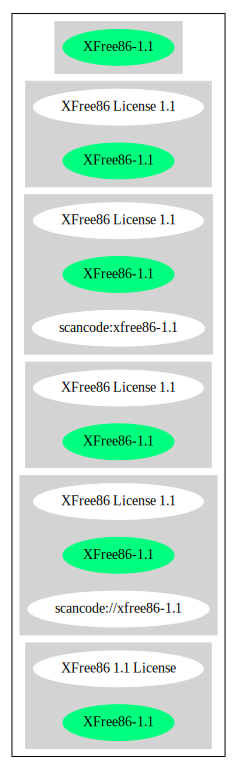

== XFree86 License 1.1 (XFree86-1.1)

[cols=",",options="header",]
|===
|Key |Value
|Fullname |XFree86 License 1.1
|Shortname |XFree86-1.1
|Rating |Go
|Classification |NoCopyleft
|Has Patent Hint |False
|===

*Other Names:*

* `+scancode://xfree86-1.1+`
* `+XFree86 1.1 License+`

=== Comments on (easy) usability

* **↑**``Rating is: Bronze'' (source:
https://blueoakcouncil.org/list[BlueOak License List])

=== General Comments

=== URLs

* *Homepage:* http://www.xfree86.org/current/LICENSE4.html
* *SPDX:* http://spdx.org/licenses/XFree86-1.1.json
* *SPDX:* https://spdx.org/licenses/XFree86-1.1.html

=== OSADL Rule

....
USE CASE Source code delivery
	YOU MUST Forward Copyright notices
	YOU MUST Forward License text
	YOU MUST Forward Warranty disclaimer
	IF Documentation
		YOU MUST Credit Organization in Documentation
	IF NOT Documentation
		YOU MUST Credit Organization in Software
	YOU MUST NOT Promote
USE CASE Binary delivery
	IF Documentation
		YOU MUST Credit Organization in Documentation
	IF NOT Documentation
		YOU MUST Credit Organization in Software
	YOU MUST Forward Copyright notices In Documentation OR Distribution material
	YOU MUST Forward License text In Documentation OR Distribution material
	YOU MUST Forward Warranty disclaimer In Documentation OR Distribution material
	YOU MUST NOT Promote
....

(source: OSADL License Checklist)

=== Text

....
Permission is hereby granted, free of charge, to any person obtaining a copy of
this software and associated documentation files (the "Software"), to deal in
the Software without restriction, including without limitation the rights to
use, copy, modify, merge, publish, distribute, sublicense, and/or sell copies of
the Software, and to permit persons to whom the Software is furnished to do so,
subject to the following conditions:

1. Redistributions of source code must retain the above copyright notice, this
list of conditions, and the following disclaimer.

2. Redistributions in binary form must reproduce the above copyright notice,
this list of conditions and the following disclaimer in the documentation and/or
other materials provided with the distribution, and in the same place and form
as other copyright, license and disclaimer information.

3. The end-user documentation included with the redistribution, if any, must
include the following acknowledgment: "This product includes software developed
by The XFree86 Project, Inc (http://www.xfree86.org/) and its contributors", in
the same place and form as other third-party acknowledgments. Alternately, this
acknowledgment may appear in the software itself, in the same form and location
as other such third-party acknowledgments.

4. Except as contained in this notice, the name of The XFree86 Project, Inc
shall not be used in advertising or otherwise to promote the sale, use or other
dealings in this Software without prior written authorization from The XFree86
Project, Inc.

THIS SOFTWARE IS PROVIDED ``AS IS'' AND ANY EXPRESSED OR IMPLIED WARRANTIES,
INCLUDING, BUT NOT LIMITED TO, THE IMPLIED WARRANTIES OF MERCHANTABILITY AND
FITNESS FOR A PARTICULAR PURPOSE ARE DISCLAIMED. IN NO EVENT SHALL THE XFREE86
PROJECT, INC OR ITS CONTRIBUTORS BE LIABLE FOR ANY DIRECT, INDIRECT, INCIDENTAL,
SPECIAL, EXEMPLARY, OR CONSEQUENTIAL DAMAGES (INCLUDING, BUT NOT LIMITED TO,
PROCUREMENT OF SUBSTITUTE GOODS OR SERVICES; LOSS OF USE, DATA, OR PROFITS; OR
BUSINESS INTERRUPTION) HOWEVER CAUSED AND ON ANY THEORY OF LIABILITY, WHETHER IN
CONTRACT, STRICT LIABILITY, OR TORT (INCLUDING NEGLIGENCE OR OTHERWISE) ARISING
IN ANY WAY OUT OF THE USE OF THIS SOFTWARE, EVEN IF ADVISED OF THE POSSIBILITY
OF SUCH DAMAGE.
....

'''''

=== Raw Data

* SPDX
* BlueOak License List
* Scancode
* OSADL License Checklist
* Wikipedia

....
{
    "__impliedNames": [
        "XFree86-1.1",
        "XFree86 License 1.1",
        "scancode://xfree86-1.1",
        "XFree86 1.1 License"
    ],
    "__impliedId": "XFree86-1.1",
    "__hasPatentHint": false,
    "facts": {
        "SPDX": {
            "isSPDXLicenseDeprecated": false,
            "spdxFullName": "XFree86 License 1.1",
            "spdxDetailsURL": "http://spdx.org/licenses/XFree86-1.1.json",
            "_sourceURL": "https://spdx.org/licenses/XFree86-1.1.html",
            "spdxLicIsOSIApproved": false,
            "spdxSeeAlso": [
                "http://www.xfree86.org/current/LICENSE4.html"
            ],
            "_implications": {
                "__impliedNames": [
                    "XFree86-1.1",
                    "XFree86 License 1.1"
                ],
                "__impliedId": "XFree86-1.1",
                "__isOsiApproved": false,
                "__impliedURLs": [
                    [
                        "SPDX",
                        "http://spdx.org/licenses/XFree86-1.1.json"
                    ],
                    [
                        null,
                        "http://www.xfree86.org/current/LICENSE4.html"
                    ]
                ]
            },
            "spdxLicenseId": "XFree86-1.1"
        },
        "OSADL License Checklist": {
            "_sourceURL": "https://www.osadl.org/fileadmin/checklists/unreflicenses/XFree86-1.1.txt",
            "spdxId": "XFree86-1.1",
            "osadlRule": "USE CASE Source code delivery\n\tYOU MUST Forward Copyright notices\n\tYOU MUST Forward License text\n\tYOU MUST Forward Warranty disclaimer\n\tIF Documentation\n\t\tYOU MUST Credit Organization in Documentation\n\tIF NOT Documentation\n\t\tYOU MUST Credit Organization in Software\n\tYOU MUST NOT Promote\nUSE CASE Binary delivery\n\tIF Documentation\n\t\tYOU MUST Credit Organization in Documentation\n\tIF NOT Documentation\n\t\tYOU MUST Credit Organization in Software\n\tYOU MUST Forward Copyright notices In Documentation OR Distribution material\n\tYOU MUST Forward License text In Documentation OR Distribution material\n\tYOU MUST Forward Warranty disclaimer In Documentation OR Distribution material\n\tYOU MUST NOT Promote\n",
            "_implications": {
                "__impliedNames": [
                    "XFree86-1.1"
                ]
            }
        },
        "Scancode": {
            "otherUrls": null,
            "homepageUrl": "http://www.xfree86.org/current/LICENSE4.html",
            "shortName": "XFree86 License 1.1",
            "textUrls": null,
            "text": "Permission is hereby granted, free of charge, to any person obtaining a copy of\nthis software and associated documentation files (the \"Software\"), to deal in\nthe Software without restriction, including without limitation the rights to\nuse, copy, modify, merge, publish, distribute, sublicense, and/or sell copies of\nthe Software, and to permit persons to whom the Software is furnished to do so,\nsubject to the following conditions:\n\n1. Redistributions of source code must retain the above copyright notice, this\nlist of conditions, and the following disclaimer.\n\n2. Redistributions in binary form must reproduce the above copyright notice,\nthis list of conditions and the following disclaimer in the documentation and/or\nother materials provided with the distribution, and in the same place and form\nas other copyright, license and disclaimer information.\n\n3. The end-user documentation included with the redistribution, if any, must\ninclude the following acknowledgment: \"This product includes software developed\nby The XFree86 Project, Inc (http://www.xfree86.org/) and its contributors\", in\nthe same place and form as other third-party acknowledgments. Alternately, this\nacknowledgment may appear in the software itself, in the same form and location\nas other such third-party acknowledgments.\n\n4. Except as contained in this notice, the name of The XFree86 Project, Inc\nshall not be used in advertising or otherwise to promote the sale, use or other\ndealings in this Software without prior written authorization from The XFree86\nProject, Inc.\n\nTHIS SOFTWARE IS PROVIDED ``AS IS'' AND ANY EXPRESSED OR IMPLIED WARRANTIES,\nINCLUDING, BUT NOT LIMITED TO, THE IMPLIED WARRANTIES OF MERCHANTABILITY AND\nFITNESS FOR A PARTICULAR PURPOSE ARE DISCLAIMED. IN NO EVENT SHALL THE XFREE86\nPROJECT, INC OR ITS CONTRIBUTORS BE LIABLE FOR ANY DIRECT, INDIRECT, INCIDENTAL,\nSPECIAL, EXEMPLARY, OR CONSEQUENTIAL DAMAGES (INCLUDING, BUT NOT LIMITED TO,\nPROCUREMENT OF SUBSTITUTE GOODS OR SERVICES; LOSS OF USE, DATA, OR PROFITS; OR\nBUSINESS INTERRUPTION) HOWEVER CAUSED AND ON ANY THEORY OF LIABILITY, WHETHER IN\nCONTRACT, STRICT LIABILITY, OR TORT (INCLUDING NEGLIGENCE OR OTHERWISE) ARISING\nIN ANY WAY OUT OF THE USE OF THIS SOFTWARE, EVEN IF ADVISED OF THE POSSIBILITY\nOF SUCH DAMAGE.",
            "category": "Permissive",
            "osiUrl": null,
            "owner": "XFree86 Project, Inc",
            "_sourceURL": "https://github.com/nexB/scancode-toolkit/blob/develop/src/licensedcode/data/licenses/xfree86-1.1.yml",
            "key": "xfree86-1.1",
            "name": "XFree86 License 1.1",
            "spdxId": "XFree86-1.1",
            "notes": null,
            "_implications": {
                "__impliedNames": [
                    "scancode://xfree86-1.1",
                    "XFree86 License 1.1",
                    "XFree86-1.1"
                ],
                "__impliedId": "XFree86-1.1",
                "__impliedCopyleft": [
                    [
                        "Scancode",
                        "NoCopyleft"
                    ]
                ],
                "__calculatedCopyleft": "NoCopyleft",
                "__impliedText": "Permission is hereby granted, free of charge, to any person obtaining a copy of\nthis software and associated documentation files (the \"Software\"), to deal in\nthe Software without restriction, including without limitation the rights to\nuse, copy, modify, merge, publish, distribute, sublicense, and/or sell copies of\nthe Software, and to permit persons to whom the Software is furnished to do so,\nsubject to the following conditions:\n\n1. Redistributions of source code must retain the above copyright notice, this\nlist of conditions, and the following disclaimer.\n\n2. Redistributions in binary form must reproduce the above copyright notice,\nthis list of conditions and the following disclaimer in the documentation and/or\nother materials provided with the distribution, and in the same place and form\nas other copyright, license and disclaimer information.\n\n3. The end-user documentation included with the redistribution, if any, must\ninclude the following acknowledgment: \"This product includes software developed\nby The XFree86 Project, Inc (http://www.xfree86.org/) and its contributors\", in\nthe same place and form as other third-party acknowledgments. Alternately, this\nacknowledgment may appear in the software itself, in the same form and location\nas other such third-party acknowledgments.\n\n4. Except as contained in this notice, the name of The XFree86 Project, Inc\nshall not be used in advertising or otherwise to promote the sale, use or other\ndealings in this Software without prior written authorization from The XFree86\nProject, Inc.\n\nTHIS SOFTWARE IS PROVIDED ``AS IS'' AND ANY EXPRESSED OR IMPLIED WARRANTIES,\nINCLUDING, BUT NOT LIMITED TO, THE IMPLIED WARRANTIES OF MERCHANTABILITY AND\nFITNESS FOR A PARTICULAR PURPOSE ARE DISCLAIMED. IN NO EVENT SHALL THE XFREE86\nPROJECT, INC OR ITS CONTRIBUTORS BE LIABLE FOR ANY DIRECT, INDIRECT, INCIDENTAL,\nSPECIAL, EXEMPLARY, OR CONSEQUENTIAL DAMAGES (INCLUDING, BUT NOT LIMITED TO,\nPROCUREMENT OF SUBSTITUTE GOODS OR SERVICES; LOSS OF USE, DATA, OR PROFITS; OR\nBUSINESS INTERRUPTION) HOWEVER CAUSED AND ON ANY THEORY OF LIABILITY, WHETHER IN\nCONTRACT, STRICT LIABILITY, OR TORT (INCLUDING NEGLIGENCE OR OTHERWISE) ARISING\nIN ANY WAY OUT OF THE USE OF THIS SOFTWARE, EVEN IF ADVISED OF THE POSSIBILITY\nOF SUCH DAMAGE.",
                "__impliedURLs": [
                    [
                        "Homepage",
                        "http://www.xfree86.org/current/LICENSE4.html"
                    ]
                ]
            }
        },
        "BlueOak License List": {
            "BlueOakRating": "Bronze",
            "url": "https://spdx.org/licenses/XFree86-1.1.html",
            "isPermissive": true,
            "_sourceURL": "https://blueoakcouncil.org/list",
            "name": "XFree86 License 1.1",
            "id": "XFree86-1.1",
            "_implications": {
                "__impliedNames": [
                    "XFree86-1.1",
                    "XFree86 License 1.1"
                ],
                "__impliedJudgement": [
                    [
                        "BlueOak License List",
                        {
                            "tag": "PositiveJudgement",
                            "contents": "Rating is: Bronze"
                        }
                    ]
                ],
                "__impliedCopyleft": [
                    [
                        "BlueOak License List",
                        "NoCopyleft"
                    ]
                ],
                "__calculatedCopyleft": "NoCopyleft",
                "__impliedURLs": [
                    [
                        "SPDX",
                        "https://spdx.org/licenses/XFree86-1.1.html"
                    ]
                ]
            }
        },
        "Wikipedia": {
            "Linking": {
                "value": "Permissive",
                "description": "linking of the licensed code with code licensed under a different license (e.g. when the code is provided as a library)"
            },
            "Publication date": null,
            "Coordinates": {
                "name": "XFree86 1.1 License",
                "version": null,
                "spdxId": "XFree86-1.1"
            },
            "_sourceURL": "https://en.wikipedia.org/wiki/Comparison_of_free_and_open-source_software_licenses",
            "_implications": {
                "__impliedNames": [
                    "XFree86-1.1",
                    "XFree86 1.1 License"
                ],
                "__hasPatentHint": false
            },
            "Modification": {
                "value": "Permissive",
                "description": "modification of the code by a licensee"
            }
        }
    },
    "__impliedJudgement": [
        [
            "BlueOak License List",
            {
                "tag": "PositiveJudgement",
                "contents": "Rating is: Bronze"
            }
        ]
    ],
    "__impliedCopyleft": [
        [
            "BlueOak License List",
            "NoCopyleft"
        ],
        [
            "Scancode",
            "NoCopyleft"
        ]
    ],
    "__calculatedCopyleft": "NoCopyleft",
    "__isOsiApproved": false,
    "__impliedText": "Permission is hereby granted, free of charge, to any person obtaining a copy of\nthis software and associated documentation files (the \"Software\"), to deal in\nthe Software without restriction, including without limitation the rights to\nuse, copy, modify, merge, publish, distribute, sublicense, and/or sell copies of\nthe Software, and to permit persons to whom the Software is furnished to do so,\nsubject to the following conditions:\n\n1. Redistributions of source code must retain the above copyright notice, this\nlist of conditions, and the following disclaimer.\n\n2. Redistributions in binary form must reproduce the above copyright notice,\nthis list of conditions and the following disclaimer in the documentation and/or\nother materials provided with the distribution, and in the same place and form\nas other copyright, license and disclaimer information.\n\n3. The end-user documentation included with the redistribution, if any, must\ninclude the following acknowledgment: \"This product includes software developed\nby The XFree86 Project, Inc (http://www.xfree86.org/) and its contributors\", in\nthe same place and form as other third-party acknowledgments. Alternately, this\nacknowledgment may appear in the software itself, in the same form and location\nas other such third-party acknowledgments.\n\n4. Except as contained in this notice, the name of The XFree86 Project, Inc\nshall not be used in advertising or otherwise to promote the sale, use or other\ndealings in this Software without prior written authorization from The XFree86\nProject, Inc.\n\nTHIS SOFTWARE IS PROVIDED ``AS IS'' AND ANY EXPRESSED OR IMPLIED WARRANTIES,\nINCLUDING, BUT NOT LIMITED TO, THE IMPLIED WARRANTIES OF MERCHANTABILITY AND\nFITNESS FOR A PARTICULAR PURPOSE ARE DISCLAIMED. IN NO EVENT SHALL THE XFREE86\nPROJECT, INC OR ITS CONTRIBUTORS BE LIABLE FOR ANY DIRECT, INDIRECT, INCIDENTAL,\nSPECIAL, EXEMPLARY, OR CONSEQUENTIAL DAMAGES (INCLUDING, BUT NOT LIMITED TO,\nPROCUREMENT OF SUBSTITUTE GOODS OR SERVICES; LOSS OF USE, DATA, OR PROFITS; OR\nBUSINESS INTERRUPTION) HOWEVER CAUSED AND ON ANY THEORY OF LIABILITY, WHETHER IN\nCONTRACT, STRICT LIABILITY, OR TORT (INCLUDING NEGLIGENCE OR OTHERWISE) ARISING\nIN ANY WAY OUT OF THE USE OF THIS SOFTWARE, EVEN IF ADVISED OF THE POSSIBILITY\nOF SUCH DAMAGE.",
    "__impliedURLs": [
        [
            "SPDX",
            "http://spdx.org/licenses/XFree86-1.1.json"
        ],
        [
            null,
            "http://www.xfree86.org/current/LICENSE4.html"
        ],
        [
            "SPDX",
            "https://spdx.org/licenses/XFree86-1.1.html"
        ],
        [
            "Homepage",
            "http://www.xfree86.org/current/LICENSE4.html"
        ]
    ]
}
....

'''''

=== Dot Cluster Graph

