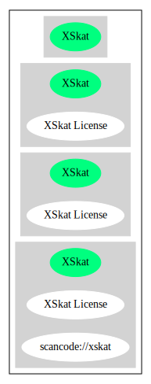

== XSkat License (XSkat)

[cols=",",options="header",]
|===
|Key |Value
|Fullname |XSkat License
|Shortname |XSkat
|Rating |Unknown, probably Attention or Stop or No-Go
|Classification |NoCopyleft
|===

*Other Names:*

* `+scancode://xskat+`

=== Comments on (easy) usability

=== General Comments

* ``Per Fedora, this license is Free only when clause 2.b is used. It is
always GPL-incompatible. Packagers using code under this license in
Fedora should note that while the RPM changelog is sufficient to meet
one requirement of clause 2.b (to "clearly state who last changed the
program"), the Release field in the RPM is not enough to meet the other
requirement of clause 2.b. Packagers can meet the other requirement by
simply adding a .0 to the end of the upstream version in the RPM
package. You need to do this, and not simply use the regular NVR to
fulfill 2.b, because the license explicitly specifies the versioning
schema x.y.z, which is different from how RPM displays it (x.y-z). Just
add a dummy .0 to the end of the version then increment the Release
field like any other package. '' (source:
https://github.com/nexB/scancode-toolkit/blob/develop/src/licensedcode/data/licenses/xskat.yml[Scancode])

=== URLs

* *Homepage:* https://fedoraproject.org/wiki/Licensing/XSkat_License
* *SPDX:* http://spdx.org/licenses/XSkat.json

=== Text

....
This program is free software; you can redistribute it freely.
Use it at your own risk; there is NO WARRANTY.

Redistribution of modified versions is permitted provided that the following
conditions are met:

1. All copyright & permission notices are preserved.

2.a) Only changes required for packaging or porting are made. 
or
2.b) It is clearly stated who last changed the program. The program is renamed
or the version number is of the form x.y.z, where x.y is the version of the
original program and z is an arbitrary suffix.
....

'''''

=== Raw Data

* SPDX
* Scancode

....
{
    "__impliedNames": [
        "XSkat",
        "XSkat License",
        "scancode://xskat"
    ],
    "__impliedId": "XSkat",
    "__impliedComments": [
        [
            "Scancode",
            [
                "Per Fedora, this license is Free only when clause 2.b is used. It is always\nGPL-incompatible. Packagers using code under this license in Fedora should\nnote that while the RPM changelog is sufficient to meet one requirement of\nclause 2.b (to \"clearly state who last changed the program\"), the Release\nfield in the RPM is not enough to meet the other requirement of clause 2.b.\nPackagers can meet the other requirement by simply adding a .0 to the end\nof the upstream version in the RPM package. You need to do this, and not\nsimply use the regular NVR to fulfill 2.b, because the license explicitly\nspecifies the versioning schema x.y.z, which is different from how RPM\ndisplays it (x.y-z). Just add a dummy .0 to the end of the version then\nincrement the Release field like any other package.\n"
            ]
        ]
    ],
    "facts": {
        "SPDX": {
            "isSPDXLicenseDeprecated": false,
            "spdxFullName": "XSkat License",
            "spdxDetailsURL": "http://spdx.org/licenses/XSkat.json",
            "_sourceURL": "https://spdx.org/licenses/XSkat.html",
            "spdxLicIsOSIApproved": false,
            "spdxSeeAlso": [
                "https://fedoraproject.org/wiki/Licensing/XSkat_License"
            ],
            "_implications": {
                "__impliedNames": [
                    "XSkat",
                    "XSkat License"
                ],
                "__impliedId": "XSkat",
                "__isOsiApproved": false,
                "__impliedURLs": [
                    [
                        "SPDX",
                        "http://spdx.org/licenses/XSkat.json"
                    ],
                    [
                        null,
                        "https://fedoraproject.org/wiki/Licensing/XSkat_License"
                    ]
                ]
            },
            "spdxLicenseId": "XSkat"
        },
        "Scancode": {
            "otherUrls": null,
            "homepageUrl": "https://fedoraproject.org/wiki/Licensing/XSkat_License",
            "shortName": "XSkat License",
            "textUrls": null,
            "text": "This program is free software; you can redistribute it freely.\nUse it at your own risk; there is NO WARRANTY.\n\nRedistribution of modified versions is permitted provided that the following\nconditions are met:\n\n1. All copyright & permission notices are preserved.\n\n2.a) Only changes required for packaging or porting are made. \nor\n2.b) It is clearly stated who last changed the program. The program is renamed\nor the version number is of the form x.y.z, where x.y is the version of the\noriginal program and z is an arbitrary suffix.",
            "category": "Permissive",
            "osiUrl": null,
            "owner": "XSkat",
            "_sourceURL": "https://github.com/nexB/scancode-toolkit/blob/develop/src/licensedcode/data/licenses/xskat.yml",
            "key": "xskat",
            "name": "XSkat License",
            "spdxId": "XSkat",
            "notes": "Per Fedora, this license is Free only when clause 2.b is used. It is always\nGPL-incompatible. Packagers using code under this license in Fedora should\nnote that while the RPM changelog is sufficient to meet one requirement of\nclause 2.b (to \"clearly state who last changed the program\"), the Release\nfield in the RPM is not enough to meet the other requirement of clause 2.b.\nPackagers can meet the other requirement by simply adding a .0 to the end\nof the upstream version in the RPM package. You need to do this, and not\nsimply use the regular NVR to fulfill 2.b, because the license explicitly\nspecifies the versioning schema x.y.z, which is different from how RPM\ndisplays it (x.y-z). Just add a dummy .0 to the end of the version then\nincrement the Release field like any other package.\n",
            "_implications": {
                "__impliedNames": [
                    "scancode://xskat",
                    "XSkat License",
                    "XSkat"
                ],
                "__impliedId": "XSkat",
                "__impliedComments": [
                    [
                        "Scancode",
                        [
                            "Per Fedora, this license is Free only when clause 2.b is used. It is always\nGPL-incompatible. Packagers using code under this license in Fedora should\nnote that while the RPM changelog is sufficient to meet one requirement of\nclause 2.b (to \"clearly state who last changed the program\"), the Release\nfield in the RPM is not enough to meet the other requirement of clause 2.b.\nPackagers can meet the other requirement by simply adding a .0 to the end\nof the upstream version in the RPM package. You need to do this, and not\nsimply use the regular NVR to fulfill 2.b, because the license explicitly\nspecifies the versioning schema x.y.z, which is different from how RPM\ndisplays it (x.y-z). Just add a dummy .0 to the end of the version then\nincrement the Release field like any other package.\n"
                        ]
                    ]
                ],
                "__impliedCopyleft": [
                    [
                        "Scancode",
                        "NoCopyleft"
                    ]
                ],
                "__calculatedCopyleft": "NoCopyleft",
                "__impliedText": "This program is free software; you can redistribute it freely.\nUse it at your own risk; there is NO WARRANTY.\n\nRedistribution of modified versions is permitted provided that the following\nconditions are met:\n\n1. All copyright & permission notices are preserved.\n\n2.a) Only changes required for packaging or porting are made. \nor\n2.b) It is clearly stated who last changed the program. The program is renamed\nor the version number is of the form x.y.z, where x.y is the version of the\noriginal program and z is an arbitrary suffix.",
                "__impliedURLs": [
                    [
                        "Homepage",
                        "https://fedoraproject.org/wiki/Licensing/XSkat_License"
                    ]
                ]
            }
        }
    },
    "__impliedCopyleft": [
        [
            "Scancode",
            "NoCopyleft"
        ]
    ],
    "__calculatedCopyleft": "NoCopyleft",
    "__isOsiApproved": false,
    "__impliedText": "This program is free software; you can redistribute it freely.\nUse it at your own risk; there is NO WARRANTY.\n\nRedistribution of modified versions is permitted provided that the following\nconditions are met:\n\n1. All copyright & permission notices are preserved.\n\n2.a) Only changes required for packaging or porting are made. \nor\n2.b) It is clearly stated who last changed the program. The program is renamed\nor the version number is of the form x.y.z, where x.y is the version of the\noriginal program and z is an arbitrary suffix.",
    "__impliedURLs": [
        [
            "SPDX",
            "http://spdx.org/licenses/XSkat.json"
        ],
        [
            null,
            "https://fedoraproject.org/wiki/Licensing/XSkat_License"
        ],
        [
            "Homepage",
            "https://fedoraproject.org/wiki/Licensing/XSkat_License"
        ]
    ]
}
....

'''''

=== Dot Cluster Graph

