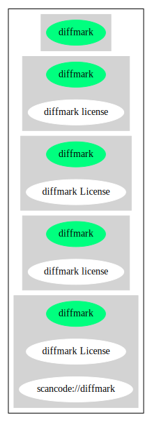

== diffmark license (diffmark)

[cols=",",options="header",]
|===
|Key |Value
|Fullname |diffmark license
|Shortname |diffmark
|Rating |Unknown, probably Stop or No-Go
|Classification |NoCopyleft
|===

*Other Names:*

* `+scancode://diffmark+`

=== Comments on (easy) usability

* **↓**``Rating is: Lead'' (source:
https://blueoakcouncil.org/list[BlueOak License List])

=== General Comments

* ``Per Fedora, this extremely minimal and permissive license was found
in diffmark (0.08). While poorly written, our interpretation of the text
permits use, modification, and distribution. It also permits wearing it
as a hat or eating it for lunch, although neither of those cases are
recommended. This would perhaps be considered Copyright only, except
that no requirement of retention of copyright is present, and the
copyright holder is disclaiming liability (albeit, poorly). This license
is Free, and GPL compatible. '' (source:
https://github.com/nexB/scancode-toolkit/blob/develop/src/licensedcode/data/licenses/diffmark.yml[Scancode])

=== URLs

* *Homepage:* https://fedoraproject.org/wiki/Licensing/diffmark
* *SPDX:* http://spdx.org/licenses/diffmark.json
* *SPDX:* https://spdx.org/licenses/diffmark.html

=== Text

....
1. you can do what you want with it
2. I refuse any responsibility for the consequences
....

'''''

=== Raw Data

....
{
    "__impliedNames": [
        "diffmark",
        "diffmark license",
        "scancode://diffmark",
        "diffmark License"
    ],
    "__impliedId": "diffmark",
    "__impliedComments": [
        [
            "Scancode",
            [
                "Per Fedora, this extremely minimal and permissive license was found in\ndiffmark (0.08). While poorly written, our interpretation of the text\npermits use, modification, and distribution. It also permits wearing it as\na hat or eating it for lunch, although neither of those cases are\nrecommended. This would perhaps be considered Copyright only, except that\nno requirement of retention of copyright is present, and the copyright\nholder is disclaiming liability (albeit, poorly). This license is Free, and\nGPL compatible.\n"
            ]
        ]
    ],
    "facts": {
        "SPDX": {
            "isSPDXLicenseDeprecated": false,
            "spdxFullName": "diffmark license",
            "spdxDetailsURL": "http://spdx.org/licenses/diffmark.json",
            "_sourceURL": "https://spdx.org/licenses/diffmark.html",
            "spdxLicIsOSIApproved": false,
            "spdxSeeAlso": [
                "https://fedoraproject.org/wiki/Licensing/diffmark"
            ],
            "_implications": {
                "__impliedNames": [
                    "diffmark",
                    "diffmark license"
                ],
                "__impliedId": "diffmark",
                "__isOsiApproved": false,
                "__impliedURLs": [
                    [
                        "SPDX",
                        "http://spdx.org/licenses/diffmark.json"
                    ],
                    [
                        null,
                        "https://fedoraproject.org/wiki/Licensing/diffmark"
                    ]
                ]
            },
            "spdxLicenseId": "diffmark"
        },
        "Scancode": {
            "otherUrls": null,
            "homepageUrl": "https://fedoraproject.org/wiki/Licensing/diffmark",
            "shortName": "diffmark License",
            "textUrls": null,
            "text": "1. you can do what you want with it\n2. I refuse any responsibility for the consequences",
            "category": "Public Domain",
            "osiUrl": null,
            "owner": "Unspecified",
            "_sourceURL": "https://github.com/nexB/scancode-toolkit/blob/develop/src/licensedcode/data/licenses/diffmark.yml",
            "key": "diffmark",
            "name": "diffmark License",
            "spdxId": "diffmark",
            "notes": "Per Fedora, this extremely minimal and permissive license was found in\ndiffmark (0.08). While poorly written, our interpretation of the text\npermits use, modification, and distribution. It also permits wearing it as\na hat or eating it for lunch, although neither of those cases are\nrecommended. This would perhaps be considered Copyright only, except that\nno requirement of retention of copyright is present, and the copyright\nholder is disclaiming liability (albeit, poorly). This license is Free, and\nGPL compatible.\n",
            "_implications": {
                "__impliedNames": [
                    "scancode://diffmark",
                    "diffmark License",
                    "diffmark"
                ],
                "__impliedId": "diffmark",
                "__impliedComments": [
                    [
                        "Scancode",
                        [
                            "Per Fedora, this extremely minimal and permissive license was found in\ndiffmark (0.08). While poorly written, our interpretation of the text\npermits use, modification, and distribution. It also permits wearing it as\na hat or eating it for lunch, although neither of those cases are\nrecommended. This would perhaps be considered Copyright only, except that\nno requirement of retention of copyright is present, and the copyright\nholder is disclaiming liability (albeit, poorly). This license is Free, and\nGPL compatible.\n"
                        ]
                    ]
                ],
                "__impliedCopyleft": [
                    [
                        "Scancode",
                        "NoCopyleft"
                    ]
                ],
                "__calculatedCopyleft": "NoCopyleft",
                "__impliedText": "1. you can do what you want with it\n2. I refuse any responsibility for the consequences",
                "__impliedURLs": [
                    [
                        "Homepage",
                        "https://fedoraproject.org/wiki/Licensing/diffmark"
                    ]
                ]
            }
        },
        "BlueOak License List": {
            "BlueOakRating": "Lead",
            "url": "https://spdx.org/licenses/diffmark.html",
            "isPermissive": true,
            "_sourceURL": "https://blueoakcouncil.org/list",
            "name": "diffmark license",
            "id": "diffmark",
            "_implications": {
                "__impliedNames": [
                    "diffmark",
                    "diffmark license"
                ],
                "__impliedJudgement": [
                    [
                        "BlueOak License List",
                        {
                            "tag": "NegativeJudgement",
                            "contents": "Rating is: Lead"
                        }
                    ]
                ],
                "__impliedCopyleft": [
                    [
                        "BlueOak License List",
                        "NoCopyleft"
                    ]
                ],
                "__calculatedCopyleft": "NoCopyleft",
                "__impliedURLs": [
                    [
                        "SPDX",
                        "https://spdx.org/licenses/diffmark.html"
                    ]
                ]
            }
        }
    },
    "__impliedJudgement": [
        [
            "BlueOak License List",
            {
                "tag": "NegativeJudgement",
                "contents": "Rating is: Lead"
            }
        ]
    ],
    "__impliedCopyleft": [
        [
            "BlueOak License List",
            "NoCopyleft"
        ],
        [
            "Scancode",
            "NoCopyleft"
        ]
    ],
    "__calculatedCopyleft": "NoCopyleft",
    "__isOsiApproved": false,
    "__impliedText": "1. you can do what you want with it\n2. I refuse any responsibility for the consequences",
    "__impliedURLs": [
        [
            "SPDX",
            "http://spdx.org/licenses/diffmark.json"
        ],
        [
            null,
            "https://fedoraproject.org/wiki/Licensing/diffmark"
        ],
        [
            "SPDX",
            "https://spdx.org/licenses/diffmark.html"
        ],
        [
            "Homepage",
            "https://fedoraproject.org/wiki/Licensing/diffmark"
        ]
    ]
}
....

'''''

=== Dot Cluster Graph

