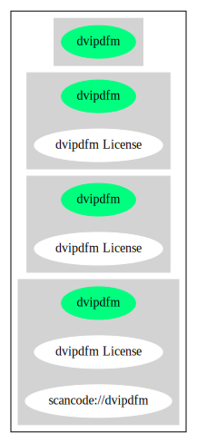

== dvipdfm License (dvipdfm)

[cols=",",options="header",]
|===
|Key |Value
|Fullname |dvipdfm License
|Shortname |dvipdfm
|Rating |Unknown, probably Attention or Stop or No-Go
|Classification |NoCopyleft
|===

*Other Names:*

* `+scancode://dvipdfm+`

=== Comments on (easy) usability

=== General Comments

* ``Per Fedora, "should" does not mean "must", and there are implied
rights for unlimited copying and distribution rights for unmodified
versions. '' (source:
https://github.com/nexB/scancode-toolkit/blob/develop/src/licensedcode/data/licenses/dvipdfm.yml[Scancode])

=== URLs

* *Homepage:* https://fedoraproject.org/wiki/Licensing/dvipdfm
* *SPDX:* http://spdx.org/licenses/dvipdfm.json

=== Text

....
A modified version of this file may be distributed, but it should be distributed
with a *different* name. Changed files must be distributed *together with a
complete and unchanged* distribution of these files.
....

'''''

=== Raw Data

==== Facts

* https://spdx.org/licenses/dvipdfm.html[SPDX]
* https://github.com/nexB/scancode-toolkit/blob/develop/src/licensedcode/data/licenses/dvipdfm.yml[Scancode]

==== Raw JSON

....
{
    "__impliedNames": [
        "dvipdfm",
        "dvipdfm License",
        "scancode://dvipdfm"
    ],
    "__impliedId": "dvipdfm",
    "__impliedComments": [
        [
            "Scancode",
            [
                "Per Fedora, \"should\" does not mean \"must\", and there are implied rights for\nunlimited copying and distribution rights for unmodified versions.\n"
            ]
        ]
    ],
    "facts": {
        "SPDX": {
            "isSPDXLicenseDeprecated": false,
            "spdxFullName": "dvipdfm License",
            "spdxDetailsURL": "http://spdx.org/licenses/dvipdfm.json",
            "_sourceURL": "https://spdx.org/licenses/dvipdfm.html",
            "spdxLicIsOSIApproved": false,
            "spdxSeeAlso": [
                "https://fedoraproject.org/wiki/Licensing/dvipdfm"
            ],
            "_implications": {
                "__impliedNames": [
                    "dvipdfm",
                    "dvipdfm License"
                ],
                "__impliedId": "dvipdfm",
                "__isOsiApproved": false,
                "__impliedURLs": [
                    [
                        "SPDX",
                        "http://spdx.org/licenses/dvipdfm.json"
                    ],
                    [
                        null,
                        "https://fedoraproject.org/wiki/Licensing/dvipdfm"
                    ]
                ]
            },
            "spdxLicenseId": "dvipdfm"
        },
        "Scancode": {
            "otherUrls": null,
            "homepageUrl": "https://fedoraproject.org/wiki/Licensing/dvipdfm",
            "shortName": "dvipdfm License",
            "textUrls": null,
            "text": "A modified version of this file may be distributed, but it should be distributed\nwith a *different* name. Changed files must be distributed *together with a\ncomplete and unchanged* distribution of these files.",
            "category": "Permissive",
            "osiUrl": null,
            "owner": "Unspecified",
            "_sourceURL": "https://github.com/nexB/scancode-toolkit/blob/develop/src/licensedcode/data/licenses/dvipdfm.yml",
            "key": "dvipdfm",
            "name": "dvipdfm License",
            "spdxId": "dvipdfm",
            "notes": "Per Fedora, \"should\" does not mean \"must\", and there are implied rights for\nunlimited copying and distribution rights for unmodified versions.\n",
            "_implications": {
                "__impliedNames": [
                    "scancode://dvipdfm",
                    "dvipdfm License",
                    "dvipdfm"
                ],
                "__impliedId": "dvipdfm",
                "__impliedComments": [
                    [
                        "Scancode",
                        [
                            "Per Fedora, \"should\" does not mean \"must\", and there are implied rights for\nunlimited copying and distribution rights for unmodified versions.\n"
                        ]
                    ]
                ],
                "__impliedCopyleft": [
                    [
                        "Scancode",
                        "NoCopyleft"
                    ]
                ],
                "__calculatedCopyleft": "NoCopyleft",
                "__impliedText": "A modified version of this file may be distributed, but it should be distributed\nwith a *different* name. Changed files must be distributed *together with a\ncomplete and unchanged* distribution of these files.",
                "__impliedURLs": [
                    [
                        "Homepage",
                        "https://fedoraproject.org/wiki/Licensing/dvipdfm"
                    ]
                ]
            }
        }
    },
    "__impliedCopyleft": [
        [
            "Scancode",
            "NoCopyleft"
        ]
    ],
    "__calculatedCopyleft": "NoCopyleft",
    "__isOsiApproved": false,
    "__impliedText": "A modified version of this file may be distributed, but it should be distributed\nwith a *different* name. Changed files must be distributed *together with a\ncomplete and unchanged* distribution of these files.",
    "__impliedURLs": [
        [
            "SPDX",
            "http://spdx.org/licenses/dvipdfm.json"
        ],
        [
            null,
            "https://fedoraproject.org/wiki/Licensing/dvipdfm"
        ],
        [
            "Homepage",
            "https://fedoraproject.org/wiki/Licensing/dvipdfm"
        ]
    ]
}
....

'''''

=== Dot Cluster Graph

