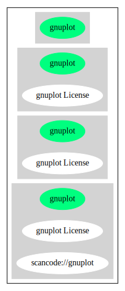

== gnuplot License (gnuplot)

[cols=",",options="header",]
|===
|Key |Value
|Fullname |gnuplot License
|Shortname |gnuplot
|Rating |Unknown, probably Attention or Stop or No-Go
|Classification |WeakCopyleft
|===

*Other Names:*

* `+scancode://gnuplot+`

=== Comments on (easy) usability

=== General Comments

=== URLs

* *Homepage:*
https://fedoraproject.org/wiki/Licensing:Gnuplot?rd=Licensing/Gnuplot
* *SPDX:* http://spdx.org/licenses/gnuplot.json
* https://fedoraproject.org/wiki/Licensing/Gnuplot

=== Text

....
Permission to use, copy, and distribute this software and its documentation for
any purpose with or without fee is hereby granted, provided that the above
copyright notice appear in all copies and that both that copyright notice and
this permission notice appear in supporting documentation.

Permission to modify the software is granted, but not the right to distribute
the complete modified source code. Modifications are to be distributed as
patches to the released version. 

Permission to distribute binaries produced by compiling modified sources is
granted, provided you 

     1. distribute the corresponding source modifications from the released
        version in the form of a patch file along with the binaries, 
     2. add special version identification to distinguish your version in
        addition to the base release version number, 
     3. provide your name and address as the primary contact for the support of
        your modified version, and 
     4. retain our contact information in regard to use of the base software. 

Permission to distribute the released version of the source code along with
corresponding source modifications in the form of a patch file is granted with
same provisions 2 through 4 for binary distributions.

This software is provided "as is" without express or implied warranty to the
extent permitted by applicable law.
....

'''''

=== Raw Data

....
{
    "__impliedNames": [
        "gnuplot",
        "gnuplot License",
        "scancode://gnuplot"
    ],
    "__impliedId": "gnuplot",
    "facts": {
        "SPDX": {
            "isSPDXLicenseDeprecated": false,
            "spdxFullName": "gnuplot License",
            "spdxDetailsURL": "http://spdx.org/licenses/gnuplot.json",
            "_sourceURL": "https://spdx.org/licenses/gnuplot.html",
            "spdxLicIsOSIApproved": false,
            "spdxSeeAlso": [
                "https://fedoraproject.org/wiki/Licensing/Gnuplot"
            ],
            "_implications": {
                "__impliedNames": [
                    "gnuplot",
                    "gnuplot License"
                ],
                "__impliedId": "gnuplot",
                "__isOsiApproved": false,
                "__impliedURLs": [
                    [
                        "SPDX",
                        "http://spdx.org/licenses/gnuplot.json"
                    ],
                    [
                        null,
                        "https://fedoraproject.org/wiki/Licensing/Gnuplot"
                    ]
                ]
            },
            "spdxLicenseId": "gnuplot"
        },
        "Scancode": {
            "otherUrls": [
                "https://fedoraproject.org/wiki/Licensing/Gnuplot"
            ],
            "homepageUrl": "https://fedoraproject.org/wiki/Licensing:Gnuplot?rd=Licensing/Gnuplot",
            "shortName": "gnuplot License",
            "textUrls": null,
            "text": "Permission to use, copy, and distribute this software and its documentation for\nany purpose with or without fee is hereby granted, provided that the above\ncopyright notice appear in all copies and that both that copyright notice and\nthis permission notice appear in supporting documentation.\n\nPermission to modify the software is granted, but not the right to distribute\nthe complete modified source code. Modifications are to be distributed as\npatches to the released version. \n\nPermission to distribute binaries produced by compiling modified sources is\ngranted, provided you \n\n     1. distribute the corresponding source modifications from the released\n        version in the form of a patch file along with the binaries, \n     2. add special version identification to distinguish your version in\n        addition to the base release version number, \n     3. provide your name and address as the primary contact for the support of\n        your modified version, and \n     4. retain our contact information in regard to use of the base software. \n\nPermission to distribute the released version of the source code along with\ncorresponding source modifications in the form of a patch file is granted with\nsame provisions 2 through 4 for binary distributions.\n\nThis software is provided \"as is\" without express or implied warranty to the\nextent permitted by applicable law.",
            "category": "Copyleft Limited",
            "osiUrl": null,
            "owner": "GNU Project",
            "_sourceURL": "https://github.com/nexB/scancode-toolkit/blob/develop/src/licensedcode/data/licenses/gnuplot.yml",
            "key": "gnuplot",
            "name": "gnuplot License",
            "spdxId": "gnuplot",
            "notes": null,
            "_implications": {
                "__impliedNames": [
                    "scancode://gnuplot",
                    "gnuplot License",
                    "gnuplot"
                ],
                "__impliedId": "gnuplot",
                "__impliedCopyleft": [
                    [
                        "Scancode",
                        "WeakCopyleft"
                    ]
                ],
                "__calculatedCopyleft": "WeakCopyleft",
                "__impliedText": "Permission to use, copy, and distribute this software and its documentation for\nany purpose with or without fee is hereby granted, provided that the above\ncopyright notice appear in all copies and that both that copyright notice and\nthis permission notice appear in supporting documentation.\n\nPermission to modify the software is granted, but not the right to distribute\nthe complete modified source code. Modifications are to be distributed as\npatches to the released version. \n\nPermission to distribute binaries produced by compiling modified sources is\ngranted, provided you \n\n     1. distribute the corresponding source modifications from the released\n        version in the form of a patch file along with the binaries, \n     2. add special version identification to distinguish your version in\n        addition to the base release version number, \n     3. provide your name and address as the primary contact for the support of\n        your modified version, and \n     4. retain our contact information in regard to use of the base software. \n\nPermission to distribute the released version of the source code along with\ncorresponding source modifications in the form of a patch file is granted with\nsame provisions 2 through 4 for binary distributions.\n\nThis software is provided \"as is\" without express or implied warranty to the\nextent permitted by applicable law.",
                "__impliedURLs": [
                    [
                        "Homepage",
                        "https://fedoraproject.org/wiki/Licensing:Gnuplot?rd=Licensing/Gnuplot"
                    ],
                    [
                        null,
                        "https://fedoraproject.org/wiki/Licensing/Gnuplot"
                    ]
                ]
            }
        },
        "Cavil": {
            "implications": {
                "__impliedNames": [
                    "gnuplot"
                ],
                "__impliedId": "gnuplot"
            },
            "shortname": "gnuplot",
            "riskInt": 5,
            "trademarkInt": 0,
            "opinionInt": 0,
            "otherNames": [],
            "patentInt": 0
        }
    },
    "__impliedCopyleft": [
        [
            "Scancode",
            "WeakCopyleft"
        ]
    ],
    "__calculatedCopyleft": "WeakCopyleft",
    "__isOsiApproved": false,
    "__impliedText": "Permission to use, copy, and distribute this software and its documentation for\nany purpose with or without fee is hereby granted, provided that the above\ncopyright notice appear in all copies and that both that copyright notice and\nthis permission notice appear in supporting documentation.\n\nPermission to modify the software is granted, but not the right to distribute\nthe complete modified source code. Modifications are to be distributed as\npatches to the released version. \n\nPermission to distribute binaries produced by compiling modified sources is\ngranted, provided you \n\n     1. distribute the corresponding source modifications from the released\n        version in the form of a patch file along with the binaries, \n     2. add special version identification to distinguish your version in\n        addition to the base release version number, \n     3. provide your name and address as the primary contact for the support of\n        your modified version, and \n     4. retain our contact information in regard to use of the base software. \n\nPermission to distribute the released version of the source code along with\ncorresponding source modifications in the form of a patch file is granted with\nsame provisions 2 through 4 for binary distributions.\n\nThis software is provided \"as is\" without express or implied warranty to the\nextent permitted by applicable law.",
    "__impliedURLs": [
        [
            "SPDX",
            "http://spdx.org/licenses/gnuplot.json"
        ],
        [
            null,
            "https://fedoraproject.org/wiki/Licensing/Gnuplot"
        ],
        [
            "Homepage",
            "https://fedoraproject.org/wiki/Licensing:Gnuplot?rd=Licensing/Gnuplot"
        ]
    ]
}
....

'''''

=== Dot Cluster Graph

