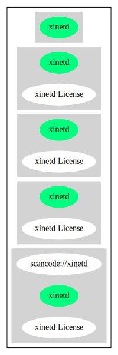

== xinetd License (xinetd)

[cols=",",options="header",]
|===
|Key |Value
|Fullname |xinetd License
|Shortname |xinetd
|Rating |Unknown, probably Stop or No-Go
|Classification |NoCopyleft
|===

*Other Names:*

* `+SUSE-xinetd+`
* `+scancode://xinetd+`

=== Comments on (easy) usability

* **↓**``Rating is: Lead'' (source:
https://blueoakcouncil.org/list[BlueOak License List])

=== General Comments

=== URLs

* *Homepage:* https://fedoraproject.org/wiki/Licensing/Xinetd_License
* *SPDX:* http://spdx.org/licenses/xinetd.json
* *SPDX:* https://spdx.org/licenses/xinetd.html

=== Text

....
xinetd License

ORIGINAL LICENSE:
This software is

(c) Copyright 1992 by Panagiotis Tsirigotis

The author (Panagiotis Tsirigotis) grants permission to use, copy, and
distribute this software and its documentation for any purpose and without fee,
provided that the above copyright notice extant in files in this distribution is
not removed from files included in any redistribution and that this copyright
notice is also included in any redistribution.

Modifications to this software may be distributed, either by distributing the
modified software or by distributing patches to the original software, under the
following additional terms:

1. The version number will be modified as follows:

a. The first 3 components of the version number (i.e <number>.<number>.<number>)
will remain unchanged.

b. A new component will be appended to the version number to indicate the
modification level. The form of this component is up to the author of the
modifications.

2. The author of the modifications will include his/her name by appending it
along with the new version number to this file and will be responsible for any
wrong behavior of the modified software.

The author makes no representations about the suitability of this software for
any purpose. It is provided "as is" without any express or implied warranty.

Modifications: Version: 2.1.8.7-current Copyright 1998-2001 by Rob Braun

Sensor Addition Version: 2.1.8.9pre14a Copyright 2001 by Steve Grubb

This is an exerpt from an email I recieved from the original author, allowing
xinetd as maintained by me, to use the higher version numbers:

I appreciate your maintaining the version string guidelines as specified in the
copyright. But I did not mean them to last as long as they did.

So, if you want, you may use any 2.N.* (N >= 3) version string for future xinetd
versions that you release. Note that I am excluding the 2.2.* line; using that
would only create confusion. Naming the next release 2.3.0 would put to rest the
confusion about 2.2.1 and 2.1.8.*.
....

'''''

=== Raw Data

....
{
    "__impliedNames": [
        "xinetd",
        "xinetd License",
        "SUSE-xinetd",
        "scancode://xinetd"
    ],
    "__impliedId": "xinetd",
    "facts": {
        "SPDX": {
            "isSPDXLicenseDeprecated": false,
            "spdxFullName": "xinetd License",
            "spdxDetailsURL": "http://spdx.org/licenses/xinetd.json",
            "_sourceURL": "https://spdx.org/licenses/xinetd.html",
            "spdxLicIsOSIApproved": false,
            "spdxSeeAlso": [
                "https://fedoraproject.org/wiki/Licensing/Xinetd_License"
            ],
            "_implications": {
                "__impliedNames": [
                    "xinetd",
                    "xinetd License"
                ],
                "__impliedId": "xinetd",
                "__isOsiApproved": false,
                "__impliedURLs": [
                    [
                        "SPDX",
                        "http://spdx.org/licenses/xinetd.json"
                    ],
                    [
                        null,
                        "https://fedoraproject.org/wiki/Licensing/Xinetd_License"
                    ]
                ]
            },
            "spdxLicenseId": "xinetd"
        },
        "Scancode": {
            "otherUrls": null,
            "homepageUrl": "https://fedoraproject.org/wiki/Licensing/Xinetd_License",
            "shortName": "xinetd License",
            "textUrls": null,
            "text": "xinetd License\n\nORIGINAL LICENSE:\nThis software is\n\n(c) Copyright 1992 by Panagiotis Tsirigotis\n\nThe author (Panagiotis Tsirigotis) grants permission to use, copy, and\ndistribute this software and its documentation for any purpose and without fee,\nprovided that the above copyright notice extant in files in this distribution is\nnot removed from files included in any redistribution and that this copyright\nnotice is also included in any redistribution.\n\nModifications to this software may be distributed, either by distributing the\nmodified software or by distributing patches to the original software, under the\nfollowing additional terms:\n\n1. The version number will be modified as follows:\n\na. The first 3 components of the version number (i.e <number>.<number>.<number>)\nwill remain unchanged.\n\nb. A new component will be appended to the version number to indicate the\nmodification level. The form of this component is up to the author of the\nmodifications.\n\n2. The author of the modifications will include his/her name by appending it\nalong with the new version number to this file and will be responsible for any\nwrong behavior of the modified software.\n\nThe author makes no representations about the suitability of this software for\nany purpose. It is provided \"as is\" without any express or implied warranty.\n\nModifications: Version: 2.1.8.7-current Copyright 1998-2001 by Rob Braun\n\nSensor Addition Version: 2.1.8.9pre14a Copyright 2001 by Steve Grubb\n\nThis is an exerpt from an email I recieved from the original author, allowing\nxinetd as maintained by me, to use the higher version numbers:\n\nI appreciate your maintaining the version string guidelines as specified in the\ncopyright. But I did not mean them to last as long as they did.\n\nSo, if you want, you may use any 2.N.* (N >= 3) version string for future xinetd\nversions that you release. Note that I am excluding the 2.2.* line; using that\nwould only create confusion. Naming the next release 2.3.0 would put to rest the\nconfusion about 2.2.1 and 2.1.8.*.",
            "category": "Permissive",
            "osiUrl": null,
            "owner": "xinetd",
            "_sourceURL": "https://github.com/nexB/scancode-toolkit/blob/develop/src/licensedcode/data/licenses/xinetd.yml",
            "key": "xinetd",
            "name": "xinetd License",
            "spdxId": "xinetd",
            "notes": null,
            "_implications": {
                "__impliedNames": [
                    "scancode://xinetd",
                    "xinetd License",
                    "xinetd"
                ],
                "__impliedId": "xinetd",
                "__impliedCopyleft": [
                    [
                        "Scancode",
                        "NoCopyleft"
                    ]
                ],
                "__calculatedCopyleft": "NoCopyleft",
                "__impliedText": "xinetd License\n\nORIGINAL LICENSE:\nThis software is\n\n(c) Copyright 1992 by Panagiotis Tsirigotis\n\nThe author (Panagiotis Tsirigotis) grants permission to use, copy, and\ndistribute this software and its documentation for any purpose and without fee,\nprovided that the above copyright notice extant in files in this distribution is\nnot removed from files included in any redistribution and that this copyright\nnotice is also included in any redistribution.\n\nModifications to this software may be distributed, either by distributing the\nmodified software or by distributing patches to the original software, under the\nfollowing additional terms:\n\n1. The version number will be modified as follows:\n\na. The first 3 components of the version number (i.e <number>.<number>.<number>)\nwill remain unchanged.\n\nb. A new component will be appended to the version number to indicate the\nmodification level. The form of this component is up to the author of the\nmodifications.\n\n2. The author of the modifications will include his/her name by appending it\nalong with the new version number to this file and will be responsible for any\nwrong behavior of the modified software.\n\nThe author makes no representations about the suitability of this software for\nany purpose. It is provided \"as is\" without any express or implied warranty.\n\nModifications: Version: 2.1.8.7-current Copyright 1998-2001 by Rob Braun\n\nSensor Addition Version: 2.1.8.9pre14a Copyright 2001 by Steve Grubb\n\nThis is an exerpt from an email I recieved from the original author, allowing\nxinetd as maintained by me, to use the higher version numbers:\n\nI appreciate your maintaining the version string guidelines as specified in the\ncopyright. But I did not mean them to last as long as they did.\n\nSo, if you want, you may use any 2.N.* (N >= 3) version string for future xinetd\nversions that you release. Note that I am excluding the 2.2.* line; using that\nwould only create confusion. Naming the next release 2.3.0 would put to rest the\nconfusion about 2.2.1 and 2.1.8.*.",
                "__impliedURLs": [
                    [
                        "Homepage",
                        "https://fedoraproject.org/wiki/Licensing/Xinetd_License"
                    ]
                ]
            }
        },
        "Cavil": {
            "implications": {
                "__impliedNames": [
                    "xinetd",
                    "xinetd",
                    "SUSE-xinetd"
                ],
                "__impliedId": "xinetd"
            },
            "shortname": "xinetd",
            "riskInt": 2,
            "trademarkInt": 0,
            "opinionInt": 0,
            "otherNames": [
                "xinetd",
                "SUSE-xinetd"
            ],
            "patentInt": 0
        },
        "BlueOak License List": {
            "BlueOakRating": "Lead",
            "url": "https://spdx.org/licenses/xinetd.html",
            "isPermissive": true,
            "_sourceURL": "https://blueoakcouncil.org/list",
            "name": "xinetd License",
            "id": "xinetd",
            "_implications": {
                "__impliedNames": [
                    "xinetd",
                    "xinetd License"
                ],
                "__impliedJudgement": [
                    [
                        "BlueOak License List",
                        {
                            "tag": "NegativeJudgement",
                            "contents": "Rating is: Lead"
                        }
                    ]
                ],
                "__impliedCopyleft": [
                    [
                        "BlueOak License List",
                        "NoCopyleft"
                    ]
                ],
                "__calculatedCopyleft": "NoCopyleft",
                "__impliedURLs": [
                    [
                        "SPDX",
                        "https://spdx.org/licenses/xinetd.html"
                    ]
                ]
            }
        }
    },
    "__impliedJudgement": [
        [
            "BlueOak License List",
            {
                "tag": "NegativeJudgement",
                "contents": "Rating is: Lead"
            }
        ]
    ],
    "__impliedCopyleft": [
        [
            "BlueOak License List",
            "NoCopyleft"
        ],
        [
            "Scancode",
            "NoCopyleft"
        ]
    ],
    "__calculatedCopyleft": "NoCopyleft",
    "__isOsiApproved": false,
    "__impliedText": "xinetd License\n\nORIGINAL LICENSE:\nThis software is\n\n(c) Copyright 1992 by Panagiotis Tsirigotis\n\nThe author (Panagiotis Tsirigotis) grants permission to use, copy, and\ndistribute this software and its documentation for any purpose and without fee,\nprovided that the above copyright notice extant in files in this distribution is\nnot removed from files included in any redistribution and that this copyright\nnotice is also included in any redistribution.\n\nModifications to this software may be distributed, either by distributing the\nmodified software or by distributing patches to the original software, under the\nfollowing additional terms:\n\n1. The version number will be modified as follows:\n\na. The first 3 components of the version number (i.e <number>.<number>.<number>)\nwill remain unchanged.\n\nb. A new component will be appended to the version number to indicate the\nmodification level. The form of this component is up to the author of the\nmodifications.\n\n2. The author of the modifications will include his/her name by appending it\nalong with the new version number to this file and will be responsible for any\nwrong behavior of the modified software.\n\nThe author makes no representations about the suitability of this software for\nany purpose. It is provided \"as is\" without any express or implied warranty.\n\nModifications: Version: 2.1.8.7-current Copyright 1998-2001 by Rob Braun\n\nSensor Addition Version: 2.1.8.9pre14a Copyright 2001 by Steve Grubb\n\nThis is an exerpt from an email I recieved from the original author, allowing\nxinetd as maintained by me, to use the higher version numbers:\n\nI appreciate your maintaining the version string guidelines as specified in the\ncopyright. But I did not mean them to last as long as they did.\n\nSo, if you want, you may use any 2.N.* (N >= 3) version string for future xinetd\nversions that you release. Note that I am excluding the 2.2.* line; using that\nwould only create confusion. Naming the next release 2.3.0 would put to rest the\nconfusion about 2.2.1 and 2.1.8.*.",
    "__impliedURLs": [
        [
            "SPDX",
            "http://spdx.org/licenses/xinetd.json"
        ],
        [
            null,
            "https://fedoraproject.org/wiki/Licensing/Xinetd_License"
        ],
        [
            "SPDX",
            "https://spdx.org/licenses/xinetd.html"
        ],
        [
            "Homepage",
            "https://fedoraproject.org/wiki/Licensing/Xinetd_License"
        ]
    ]
}
....

'''''

=== Dot Cluster Graph

