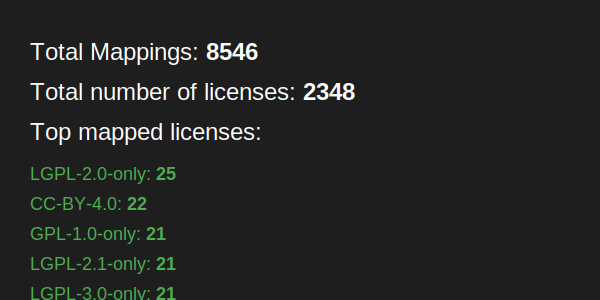

# LicenseLynx


[](https://github.com/licenselynx/licenselynx/actions/workflows/python.yaml)
[](https://github.com/licenselynx/licenselynx/actions/workflows/java.yaml)
[](https://github.com/licenselynx/licenselynx/actions/workflows/typescript.yaml)
[](https://github.com/licenselynx/licenselynx/actions/workflows/scripts.yaml)
[](https://github.com/licenselynx/licenselynx/actions/workflows/data.yaml)


[](https://github.com/licenselynx/licenselynx/releases/latest)

[](LICENSE)

## License Mapping Statistics

[](#License-Mapping-Statistics)

## Overview

LicenseLynx is a comprehensive project
focused on bridging the gap between unknown or ambiguous license names and their canonical license names.
Additionally, we offer libraries for Python, Java,
and TypeScript to streamline the process of mapping licenses to their canonical names,
typically represented by SPDX IDs.

## Folder Structure

The folders **Java**, **Python**, and **TypeScript** are providing libraries to use in code.
The folder **scripts** contains several useful scripts to update, transform, and verify data.
In the folder **website** we host a static website to introduce the community to the LicenseLynx project.

## Data source structure

In folder **data** all licenses are stored in single json-files.
The structure of a stored license looks like this:

```json
{
    "canonical": "LGPL-2.0-only",
    "aliases": {
        "spdx": [
            "GNU Library General Public License v2 only",
            "LGPL-2.0"
        ],
        "custom": [],
        "scancode-licensedb": [
            "GNU Library General Public License 2.0",
            "LicenseRef-LGPL-2",
            "LGPL 2.0",
            "LicenseRef-LGPL-2.0",
            "lgpl-2.0"
        ]
    },
    "src": "spdx"
}

```

| ID        | Description                                                                                          |
|-----------|------------------------------------------------------------------------------------------------------|
| canonical | Canonical name for license                                                                           |
| aliases   | Dictionary of sources, where each source is list of aliases of license (e.g. "spdx", "custom", etc.) |
| src       | Source for canonical license name                                                                    |

## Contributing

We welcome contributions from the community to improve this project. If you'd like to contribute, please refer to
our [Contribution Guidelines](https://licenselynx.org/contribution) for detailed instructions on how to get started.

## License

This project is licensed under the [Apache License, Version 2.0](LICENSE) (SPDX-License-Identifier: Apache-2.0).

Copyright (c) Siemens AG 2025 ALL RIGHTS RESERVED
