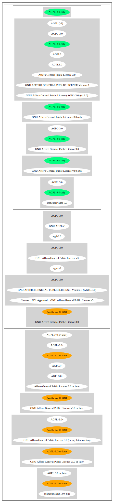

GNU Affero General Public License v3.0 only (AGPL-3.0-only)
===========================================================

[TABLE]

**Other Names:**

-   `AGPL-3.0`

-   `scancode://agpl-3.0`

-   `AGPL 3.0`

-   `agpl-3.0`

-   `GNU AGPLv3`

-   `Affero General Public License 3.0`

-   `GNU AFFERO GENERAL PUBLIC LICENSE, Version 3 (AGPL-3.0)`

-   `License :: OSI Approved :: GNU Affero General Public License v3`

-   `GNU Affero General Public License v3`

-   `AGPL3.0`

-   `AGPL3`

-   `AGPL (v3)`

Description
-----------

> Permissions of this strongest copyleft license are conditioned on
> making available complete source code of licensed works and
> modifications, which include larger works using a licensed work, under
> the same license. Copyright and license notices must be preserved.
> Contributors provide an express grant of patent rights. When a
> modified version is used to provide a service over a network, the
> complete source code of the modified version must be made available.

(source: choosealicense.com
([MIT](https://github.com/github/choosealicense.com/blob/gh-pages/LICENSE.md "MIT")))

Comments on (easy) usability
----------------------------

-   **↑**“Is OSI Approved” (source:
    [SPDX](https://spdx.org/licenses/AGPL-3.0-only.html "SPDX"))

-   **↑**“This license is compatible with the
    DebianFreeSoftwareGuidelines (DFSG-free)” (source: [Debian Free
    Software
    Guidelines](https://wiki.debian.org/DFSGLicenses "Debian Free Software Guidelines"))

-   **↑**“This software Licenses is OK for Fedora” (source: [Fedora
    Project
    Wiki](https://fedoraproject.org/wiki/Licensing:Main?rd=Licensing "Fedora Project Wiki"))

-   **↓**“Google Classification is CANNOT\_BE\_USED "Code released under
    the GNU Affero General Public License (AGPL) cannot be used in
    google3 under any circumstances, and only very rarely on
    workstations. Read more at go/agpl"” (source: [Google OSS
    Policy](https://opensource.google.com/docs/thirdparty/licenses/ "Google OSS Policy"))

General Comments
----------------

-   “In addition to the requirements of strong copyleft licenses,
    network copyleft licenses require you to share larger programs that
    you build with the licensed software not just when you give copies
    to others, but also when you run the software for others to use over
    the Internet or another network.” (source: [BlueOak License
    List](https://blueoakcouncil.org/copyleft "BlueOak License List"))

-   “Strong copyleft licenses require you to share both the licensed
    software (like the weak copyleft licenses, and larger programs that
    you build with the licensed software, when you give copies to
    others.” (source: [BlueOak License
    List](https://blueoakcouncil.org/copyleft "BlueOak License List"))

-   “Per SPDX.org, this version was released 19 November 2007 This
    license is OSI certified ” (source:
    [Scancode](https://github.com/nexB/scancode-toolkit/blob/develop/src/licensedcode/data/licenses/agpl-3.0.yml "Scancode"))

Obligations
-----------

[TABLE]

(source:
[choosealicense.com](https://github.com/github/choosealicense.com/blob/gh-pages/_licenses/agpl-3.0.txt "choosealicense.com")
([MIT](https://github.com/github/choosealicense.com/blob/gh-pages/LICENSE.md "MIT")))

URLs
----

-   **Homepage:** http://www.gnu.org/licenses/agpl-3.0.html

-   **OSI Page:** http://www.opensource.org/licenses/agpl-v3.html

-   **OSI Page:** https://opensource.org/licenses/AGPL-3.0

-   **SPDX:** http://spdx.org/licenses/AGPL-3.0-only.json

-   https://www.gnu.org/licenses/agpl.txt

-   https://spdx.org/licenses/AGPL-3.0-only.html

-   http://www.opensource.org/licenses/AGPL-3.0

-   https://opensource.google.com/docs/using/agpl-policy/

OSADL Rule
----------

    USE CASE Source code delivery
    	YOU MUST Provide Copyright notice
    		ATTRIBUTE Highlighted
    		ATTRIBUTE Appropriately
    	YOU MUST NOT Modify License notices
    	YOU MUST NOT Modify Warranty disclaimer
    	YOU MUST Forward License text
    		IF Non-permissive Additional terms
    			EITHER
    				YOU MUST Include Additional terms In Source code
    			OR
    				YOU MUST Reference Additional terms In Source code
    			YOU MUST Forward Additional terms
    	IF Software modification
    		YOU MUST Provide Modification notice
    		YOU MUST Provide Modification date
    		YOU MUST Grant License
    			ATTRIBUTE Original license
    		IF Interactive AND Display License announcement
    			YOU MUST Display Appropriate legal notices
    	YOU MUST NOT Restrict Granted rights
    		EXCEPT IF NOT Permitted By Additional terms
    	YOU MUST NOT Litigate Circumvention
    USE CASE Binary delivery
    	YOU MUST Provide Copyright notice
    		ATTRIBUTE Highlighted
    		ATTRIBUTE Appropriately
    	YOU MUST NOT Modify License notices
    	YOU MUST NOT Modify Warranty disclaimer
    	YOU MUST Provide License text
    		IF Non-permissive Additional terms
    			EITHER
    				YOU MUST Include Additional terms In Source code
    			OR
    				YOU MUST Reference Additional terms In Source code
    			YOU MUST Provide Additional terms
    	YOU MUST Provide Source code
    		ATTRIBUTE Machine-readable
    		ATTRIBUTE Documented format
    		ATTRIBUTE Including Tool chain information
    	IF Binary delivery On Customary medium OR Installed
    		EITHER
    			YOU MUST Include Source code
    				ATTRIBUTE Customary medium
    		OR
    			YOU MUST Provide Delayed source code delivery
    			YOU MUST Provide Written offer
    				ATTRIBUTE Duration At least 3 years
    				ATTRIBUTE Duration As long as product is supported
    				ATTRIBUTE Source code delivery
    					EITHER
    						ATTRIBUTE Customary medium
    						ATTRIBUTE No profit
    					OR
    						ATTRIBUTE Via Internet
    						ATTRIBUTE No charge
    	IF Binary delivery Via Internet
    		YOU MUST Provide Source code
    			ATTRIBUTE Via Internet
    			ATTRIBUTE Duration As long as needed
    			IF Source code On same server
    				ATTRIBUTE No charge
    			IF Source code On other server
    				ATTRIBUTE Equivalent
    				YOU MUST Reference Source code
    	IF Binary delivery Via peer-to-peer transmission
    		YOU MUST Reference Source code
    			ATTRIBUTE No charge
    	IF Software modification
    		YOU MUST Provide Modification notice
    		YOU MUST Provide Modification date
    		YOU MUST Grant License
    			ATTRIBUTE Original license
    		IF Interactive AND Display License announcement
    			YOU MUST Display Appropriate legal notices
    	IF User product
    		YOU MUST Provide Installation information
    			EXCEPT IF Installation Is NOT Feasible
    	YOU MUST NOT Restrict Granted rights
    		EXCEPT IF NOT Permitted By Additional terms
    	YOU MUST NOT Litigate Circumvention
    USE CASE Network service
    	IF Software modification
    		YOU MUST Provide Source code
    			ATTRIBUTE Via Internet
    			ATTRIBUTE No charges
    			ATTRIBUTE Customary method
    COMPATIBILITY Apache-2.0
    COMPATIBILITY BSD-2-Clause
    COMPATIBILITY BSD-2-Clause-Patent
    COMPATIBILITY BSD-3-Clause
    COMPATIBILITY bzip2-1.0.5
    COMPATIBILITY bzip2-1.0.6
    COMPATIBILITY CC0-1.0
    COMPATIBILITY curl
    COMPATIBILITY GPL-3.0-only
    COMPATIBILITY GPL-3.0-or-later
    COMPATIBILITY IBM-pibs
    COMPATIBILITY ICU
    COMPATIBILITY ISC
    COMPATIBILITY LGPL-3.0-only
    COMPATIBILITY LGPL-3.0-or-later
    COMPATIBILITY Libpng
    COMPATIBILITY MIT
    COMPATIBILITY MPL-2.0
    COMPATIBILITY NTP
    COMPATIBILITY UPL-1.0
    COMPATIBILITY WTFPL
    COMPATIBILITY X11
    COMPATIBILITY Zlib
    INCOMPATIBILITY BSD-4-Clause
    INCOMPATIBILITY FTL
    INCOMPATIBILITY IJG
    INCOMPATIBILITY OpenSSL
    INCOMPATIBILITY Python-2.0
    INCOMPATIBILITY zlib-acknowledgement
    INCOMPATIBILITY XFree86-1.1
    PATENT HINTS Yes
    COPYLEFT CLAUSE Yes

(source: OSADL License Checklist)

Text
----

    GNU AFFERO GENERAL PUBLIC LICENSE

    Version 3, 19 November 2007

    Copyright © 2007 Free Software Foundation, Inc. <http://fsf.org/> 
    Everyone is permitted to copy and distribute verbatim copies of this license document, but changing it is not allowed.

    Preamble

    The GNU Affero General Public License is a free, copyleft license for software and other kinds of works, specifically designed to ensure cooperation with the community in the case of network server software.

    The licenses for most software and other practical works are designed to take away your freedom to share and change the works. By contrast, our General Public Licenses are intended to guarantee your freedom to share and change all versions of a program--to make sure it remains free software for all its users.

    When we speak of free software, we are referring to freedom, not price. Our General Public Licenses are designed to make sure that you have the freedom to distribute copies of free software (and charge for them if you wish), that you receive source code or can get it if you want it, that you can change the software or use pieces of it in new free programs, and that you know you can do these things.

    Developers that use our General Public Licenses protect your rights with two steps: (1) assert copyright on the software, and (2) offer you this License which gives you legal permission to copy, distribute and/or modify the software.

    A secondary benefit of defending all users' freedom is that improvements made in alternate versions of the program, if they receive widespread use, become available for other developers to incorporate. Many developers of free software are heartened and encouraged by the resulting cooperation. However, in the case of software used on network servers, this result may fail to come about. The GNU General Public License permits making a modified version and letting the public access it on a server without ever releasing its source code to the public.

    The GNU Affero General Public License is designed specifically to ensure that, in such cases, the modified source code becomes available to the community. It requires the operator of a network server to provide the source code of the modified version running there to the users of that server. Therefore, public use of a modified version, on a publicly accessible server, gives the public access to the source code of the modified version.

    An older license, called the Affero General Public License and published by Affero, was designed to accomplish similar goals. This is a different license, not a version of the Affero GPL, but Affero has released a new version of the Affero GPL which permits relicensing under this license.

    The precise terms and conditions for copying, distribution and modification follow.

    TERMS AND CONDITIONS

    0. Definitions.
    "This License" refers to version 3 of the GNU Affero General Public License.

    "Copyright" also means copyright-like laws that apply to other kinds of works, such as semiconductor masks.

    "The Program" refers to any copyrightable work licensed under this License. Each licensee is addressed as "you". "Licensees" and "recipients" may be individuals or organizations.

    To "modify" a work means to copy from or adapt all or part of the work in a fashion requiring copyright permission, other than the making of an exact copy. The resulting work is called a "modified version" of the earlier work or a work "based on" the earlier work.

    A "covered work" means either the unmodified Program or a work based on the Program.

    To "propagate" a work means to do anything with it that, without permission, would make you directly or secondarily liable for infringement under applicable copyright law, except executing it on a computer or modifying a private copy. Propagation includes copying, distribution (with or without modification), making available to the public, and in some countries other activities as well.

    To "convey" a work means any kind of propagation that enables other parties to make or receive copies. Mere interaction with a user through a computer network, with no transfer of a copy, is not conveying.

    An interactive user interface displays "Appropriate Legal Notices" to the extent that it includes a convenient and prominently visible feature that (1) displays an appropriate copyright notice, and (2) tells the user that there is no warranty for the work (except to the extent that warranties are provided), that licensees may convey the work under this License, and how to view a copy of this License. If the interface presents a list of user commands or options, such as a menu, a prominent item in the list meets this criterion.

    1. Source Code.
    The "source code" for a work means the preferred form of the work for making modifications to it. "Object code" means any non-source form of a work.

    A "Standard Interface" means an interface that either is an official standard defined by a recognized standards body, or, in the case of interfaces specified for a particular programming language, one that is widely used among developers working in that language.

    The "System Libraries" of an executable work include anything, other than the work as a whole, that (a) is included in the normal form of packaging a Major Component, but which is not part of that Major Component, and (b) serves only to enable use of the work with that Major Component, or to implement a Standard Interface for which an implementation is available to the public in source code form. A "Major Component", in this context, means a major essential component (kernel, window system, and so on) of the specific operating system (if any) on which the executable work runs, or a compiler used to produce the work, or an object code interpreter used to run it.

    The "Corresponding Source" for a work in object code form means all the source code needed to generate, install, and (for an executable work) run the object code and to modify the work, including scripts to control those activities. However, it does not include the work's System Libraries, or general-purpose tools or generally available free programs which are used unmodified in performing those activities but which are not part of the work. For example, Corresponding Source includes interface definition files associated with source files for the work, and the source code for shared libraries and dynamically linked subprograms that the work is specifically designed to require, such as by intimate data communication or control flow between those subprograms and other parts of the work.

    The Corresponding Source need not include anything that users can regenerate automatically from other parts of the Corresponding Source.

    The Corresponding Source for a work in source code form is that same work.

    2. Basic Permissions.
    All rights granted under this License are granted for the term of copyright on the Program, and are irrevocable provided the stated conditions are met. This License explicitly affirms your unlimited permission to run the unmodified Program. The output from running a covered work is covered by this License only if the output, given its content, constitutes a covered work. This License acknowledges your rights of fair use or other equivalent, as provided by copyright law.

    You may make, run and propagate covered works that you do not convey, without conditions so long as your license otherwise remains in force. You may convey covered works to others for the sole purpose of having them make modifications exclusively for you, or provide you with facilities for running those works, provided that you comply with the terms of this License in conveying all material for which you do not control copyright. Those thus making or running the covered works for you must do so exclusively on your behalf, under your direction and control, on terms that prohibit them from making any copies of your copyrighted material outside their relationship with you.

    Conveying under any other circumstances is permitted solely under the conditions stated below. Sublicensing is not allowed; section 10 makes it unnecessary.

    3. Protecting Users' Legal Rights From Anti-Circumvention Law.
    No covered work shall be deemed part of an effective technological measure under any applicable law fulfilling obligations under article 11 of the WIPO copyright treaty adopted on 20 December 1996, or similar laws prohibiting or restricting circumvention of such measures.

    When you convey a covered work, you waive any legal power to forbid circumvention of technological measures to the extent such circumvention is effected by exercising rights under this License with respect to the covered work, and you disclaim any intention to limit operation or modification of the work as a means of enforcing, against the work's users, your or third parties' legal rights to forbid circumvention of technological measures.

    4. Conveying Verbatim Copies.
    You may convey verbatim copies of the Program's source code as you receive it, in any medium, provided that you conspicuously and appropriately publish on each copy an appropriate copyright notice; keep intact all notices stating that this License and any non-permissive terms added in accord with section 7 apply to the code; keep intact all notices of the absence of any warranty; and give all recipients a copy of this License along with the Program.

    You may charge any price or no price for each copy that you convey, and you may offer support or warranty protection for a fee.

    5. Conveying Modified Source Versions.
    You may convey a work based on the Program, or the modifications to produce it from the Program, in the form of source code under the terms of section 4, provided that you also meet all of these conditions:

    a) The work must carry prominent notices stating that you modified it, and giving a relevant date.
    b) The work must carry prominent notices stating that it is released under this License and any conditions added under section 7. This requirement modifies the requirement in section 4 to "keep intact all notices".
    c) You must license the entire work, as a whole, under this License to anyone who comes into possession of a copy. This License will therefore apply, along with any applicable section 7 additional terms, to the whole of the work, and all its parts, regardless of how they are packaged. This License gives no permission to license the work in any other way, but it does not invalidate such permission if you have separately received it.
    d) If the work has interactive user interfaces, each must display Appropriate Legal Notices; however, if the Program has interactive interfaces that do not display Appropriate Legal Notices, your work need not make them do so.
    A compilation of a covered work with other separate and independent works, which are not by their nature extensions of the covered work, and which are not combined with it such as to form a larger program, in or on a volume of a storage or distribution medium, is called an "aggregate" if the compilation and its resulting copyright are not used to limit the access or legal rights of the compilation's users beyond what the individual works permit. Inclusion of a covered work in an aggregate does not cause this License to apply to the other parts of the aggregate.

    6. Conveying Non-Source Forms.
    You may convey a covered work in object code form under the terms of sections 4 and 5, provided that you also convey the machine-readable Corresponding Source under the terms of this License, in one of these ways:

    a) Convey the object code in, or embodied in, a physical product (including a physical distribution medium), accompanied by the Corresponding Source fixed on a durable physical medium customarily used for software interchange.
    b) Convey the object code in, or embodied in, a physical product (including a physical distribution medium), accompanied by a written offer, valid for at least three years and valid for as long as you offer spare parts or customer support for that product model, to give anyone who possesses the object code either (1) a copy of the Corresponding Source for all the software in the product that is covered by this License, on a durable physical medium customarily used for software interchange, for a price no more than your reasonable cost of physically performing this conveying of source, or (2) access to copy the Corresponding Source from a network server at no charge.
    c) Convey individual copies of the object code with a copy of the written offer to provide the Corresponding Source. This alternative is allowed only occasionally and noncommercially, and only if you received the object code with such an offer, in accord with subsection 6b.
    d) Convey the object code by offering access from a designated place (gratis or for a charge), and offer equivalent access to the Corresponding Source in the same way through the same place at no further charge. You need not require recipients to copy the Corresponding Source along with the object code. If the place to copy the object code is a network server, the Corresponding Source may be on a different server (operated by you or a third party) that supports equivalent copying facilities, provided you maintain clear directions next to the object code saying where to find the Corresponding Source. Regardless of what server hosts the Corresponding Source, you remain obligated to ensure that it is available for as long as needed to satisfy these requirements.
    e) Convey the object code using peer-to-peer transmission, provided you inform other peers where the object code and Corresponding Source of the work are being offered to the general public at no charge under subsection 6d.
    A separable portion of the object code, whose source code is excluded from the Corresponding Source as a System Library, need not be included in conveying the object code work.

    A "User Product" is either (1) a "consumer product", which means any tangible personal property which is normally used for personal, family, or household purposes, or (2) anything designed or sold for incorporation into a dwelling. In determining whether a product is a consumer product, doubtful cases shall be resolved in favor of coverage. For a particular product received by a particular user, "normally used" refers to a typical or common use of that class of product, regardless of the status of the particular user or of the way in which the particular user actually uses, or expects or is expected to use, the product. A product is a consumer product regardless of whether the product has substantial commercial, industrial or non-consumer uses, unless such uses represent the only significant mode of use of the product.

    "Installation Information" for a User Product means any methods, procedures, authorization keys, or other information required to install and execute modified versions of a covered work in that User Product from a modified version of its Corresponding Source. The information must suffice to ensure that the continued functioning of the modified object code is in no case prevented or interfered with solely because modification has been made.

    If you convey an object code work under this section in, or with, or specifically for use in, a User Product, and the conveying occurs as part of a transaction in which the right of possession and use of the User Product is transferred to the recipient in perpetuity or for a fixed term (regardless of how the transaction is characterized), the Corresponding Source conveyed under this section must be accompanied by the Installation Information. But this requirement does not apply if neither you nor any third party retains the ability to install modified object code on the User Product (for example, the work has been installed in ROM).

    The requirement to provide Installation Information does not include a requirement to continue to provide support service, warranty, or updates for a work that has been modified or installed by the recipient, or for the User Product in which it has been modified or installed. Access to a network may be denied when the modification itself materially and adversely affects the operation of the network or violates the rules and protocols for communication across the network.

    Corresponding Source conveyed, and Installation Information provided, in accord with this section must be in a format that is publicly documented (and with an implementation available to the public in source code form), and must require no special password or key for unpacking, reading or copying.

    7. Additional Terms.
    "Additional permissions" are terms that supplement the terms of this License by making exceptions from one or more of its conditions. Additional permissions that are applicable to the entire Program shall be treated as though they were included in this License, to the extent that they are valid under applicable law. If additional permissions apply only to part of the Program, that part may be used separately under those permissions, but the entire Program remains governed by this License without regard to the additional permissions.

    When you convey a copy of a covered work, you may at your option remove any additional permissions from that copy, or from any part of it. (Additional permissions may be written to require their own removal in certain cases when you modify the work.) You may place additional permissions on material, added by you to a covered work, for which you have or can give appropriate copyright permission.

    Notwithstanding any other provision of this License, for material you add to a covered work, you may (if authorized by the copyright holders of that material) supplement the terms of this License with terms:

    a) Disclaiming warranty or limiting liability differently from the terms of sections 15 and 16 of this License; or
    b) Requiring preservation of specified reasonable legal notices or author attributions in that material or in the Appropriate Legal Notices displayed by works containing it; or
    c) Prohibiting misrepresentation of the origin of that material, or requiring that modified versions of such material be marked in reasonable ways as different from the original version; or
    d) Limiting the use for publicity purposes of names of licensors or authors of the material; or
    e) Declining to grant rights under trademark law for use of some trade names, trademarks, or service marks; or
    f) Requiring indemnification of licensors and authors of that material by anyone who conveys the material (or modified versions of it) with contractual assumptions of liability to the recipient, for any liability that these contractual assumptions directly impose on those licensors and authors.
    All other non-permissive additional terms are considered "further restrictions" within the meaning of section 10. If the Program as you received it, or any part of it, contains a notice stating that it is governed by this License along with a term that is a further restriction, you may remove that term. If a license document contains a further restriction but permits relicensing or conveying under this License, you may add to a covered work material governed by the terms of that license document, provided that the further restriction does not survive such relicensing or conveying.

    If you add terms to a covered work in accord with this section, you must place, in the relevant source files, a statement of the additional terms that apply to those files, or a notice indicating where to find the applicable terms.

    Additional terms, permissive or non-permissive, may be stated in the form of a separately written license, or stated as exceptions; the above requirements apply either way.

    8. Termination.
    You may not propagate or modify a covered work except as expressly provided under this License. Any attempt otherwise to propagate or modify it is void, and will automatically terminate your rights under this License (including any patent licenses granted under the third paragraph of section 11).

    However, if you cease all violation of this License, then your license from a particular copyright holder is reinstated (a) provisionally, unless and until the copyright holder explicitly and finally terminates your license, and (b) permanently, if the copyright holder fails to notify you of the violation by some reasonable means prior to 60 days after the cessation.

    Moreover, your license from a particular copyright holder is reinstated permanently if the copyright holder notifies you of the violation by some reasonable means, this is the first time you have received notice of violation of this License (for any work) from that copyright holder, and you cure the violation prior to 30 days after your receipt of the notice.

    Termination of your rights under this section does not terminate the licenses of parties who have received copies or rights from you under this License. If your rights have been terminated and not permanently reinstated, you do not qualify to receive new licenses for the same material under section 10.

    9. Acceptance Not Required for Having Copies.
    You are not required to accept this License in order to receive or run a copy of the Program. Ancillary propagation of a covered work occurring solely as a consequence of using peer-to-peer transmission to receive a copy likewise does not require acceptance. However, nothing other than this License grants you permission to propagate or modify any covered work. These actions infringe copyright if you do not accept this License. Therefore, by modifying or propagating a covered work, you indicate your acceptance of this License to do so.

    10. Automatic Licensing of Downstream Recipients.
    Each time you convey a covered work, the recipient automatically receives a license from the original licensors, to run, modify and propagate that work, subject to this License. You are not responsible for enforcing compliance by third parties with this License.

    An "entity transaction" is a transaction transferring control of an organization, or substantially all assets of one, or subdividing an organization, or merging organizations. If propagation of a covered work results from an entity transaction, each party to that transaction who receives a copy of the work also receives whatever licenses to the work the party's predecessor in interest had or could give under the previous paragraph, plus a right to possession of the Corresponding Source of the work from the predecessor in interest, if the predecessor has it or can get it with reasonable efforts.

    You may not impose any further restrictions on the exercise of the rights granted or affirmed under this License. For example, you may not impose a license fee, royalty, or other charge for exercise of rights granted under this License, and you may not initiate litigation (including a cross-claim or counterclaim in a lawsuit) alleging that any patent claim is infringed by making, using, selling, offering for sale, or importing the Program or any portion of it.

    11. Patents.
    A "contributor" is a copyright holder who authorizes use under this License of the Program or a work on which the Program is based. The work thus licensed is called the contributor's "contributor version".

    A contributor's "essential patent claims" are all patent claims owned or controlled by the contributor, whether already acquired or hereafter acquired, that would be infringed by some manner, permitted by this License, of making, using, or selling its contributor version, but do not include claims that would be infringed only as a consequence of further modification of the contributor version. For purposes of this definition, "control" includes the right to grant patent sublicenses in a manner consistent with the requirements of this License.

    Each contributor grants you a non-exclusive, worldwide, royalty-free patent license under the contributor's essential patent claims, to make, use, sell, offer for sale, import and otherwise run, modify and propagate the contents of its contributor version.

    In the following three paragraphs, a "patent license" is any express agreement or commitment, however denominated, not to enforce a patent (such as an express permission to practice a patent or covenant not to sue for patent infringement). To "grant" such a patent license to a party means to make such an agreement or commitment not to enforce a patent against the party.

    If you convey a covered work, knowingly relying on a patent license, and the Corresponding Source of the work is not available for anyone to copy, free of charge and under the terms of this License, through a publicly available network server or other readily accessible means, then you must either (1) cause the Corresponding Source to be so available, or (2) arrange to deprive yourself of the benefit of the patent license for this particular work, or (3) arrange, in a manner consistent with the requirements of this License, to extend the patent license to downstream recipients. "Knowingly relying" means you have actual knowledge that, but for the patent license, your conveying the covered work in a country, or your recipient's use of the covered work in a country, would infringe one or more identifiable patents in that country that you have reason to believe are valid.

    If, pursuant to or in connection with a single transaction or arrangement, you convey, or propagate by procuring conveyance of, a covered work, and grant a patent license to some of the parties receiving the covered work authorizing them to use, propagate, modify or convey a specific copy of the covered work, then the patent license you grant is automatically extended to all recipients of the covered work and works based on it.

    A patent license is "discriminatory" if it does not include within the scope of its coverage, prohibits the exercise of, or is conditioned on the non-exercise of one or more of the rights that are specifically granted under this License. You may not convey a covered work if you are a party to an arrangement with a third party that is in the business of distributing software, under which you make payment to the third party based on the extent of your activity of conveying the work, and under which the third party grants, to any of the parties who would receive the covered work from you, a discriminatory patent license (a) in connection with copies of the covered work conveyed by you (or copies made from those copies), or (b) primarily for and in connection with specific products or compilations that contain the covered work, unless you entered into that arrangement, or that patent license was granted, prior to 28 March 2007.

    Nothing in this License shall be construed as excluding or limiting any implied license or other defenses to infringement that may otherwise be available to you under applicable patent law.

    12. No Surrender of Others' Freedom.
    If conditions are imposed on you (whether by court order, agreement or otherwise) that contradict the conditions of this License, they do not excuse you from the conditions of this License. If you cannot convey a covered work so as to satisfy simultaneously your obligations under this License and any other pertinent obligations, then as a consequence you may not convey it at all. For example, if you agree to terms that obligate you to collect a royalty for further conveying from those to whom you convey the Program, the only way you could satisfy both those terms and this License would be to refrain entirely from conveying the Program.

    13. Remote Network Interaction; Use with the GNU General Public License.
    Notwithstanding any other provision of this License, if you modify the Program, your modified version must prominently offer all users interacting with it remotely through a computer network (if your version supports such interaction) an opportunity to receive the Corresponding Source of your version by providing access to the Corresponding Source from a network server at no charge, through some standard or customary means of facilitating copying of software. This Corresponding Source shall include the Corresponding Source for any work covered by version 3 of the GNU General Public License that is incorporated pursuant to the following paragraph.

    Notwithstanding any other provision of this License, you have permission to link or combine any covered work with a work licensed under version 3 of the GNU General Public License into a single combined work, and to convey the resulting work. The terms of this License will continue to apply to the part which is the covered work, but the work with which it is combined will remain governed by version 3 of the GNU General Public License.

    14. Revised Versions of this License.
    The Free Software Foundation may publish revised and/or new versions of the GNU Affero General Public License from time to time. Such new versions will be similar in spirit to the present version, but may differ in detail to address new problems or concerns.

    Each version is given a distinguishing version number. If the Program specifies that a certain numbered version of the GNU Affero General Public License "or any later version" applies to it, you have the option of following the terms and conditions either of that numbered version or of any later version published by the Free Software Foundation. If the Program does not specify a version number of the GNU Affero General Public License, you may choose any version ever published by the Free Software Foundation.

    If the Program specifies that a proxy can decide which future versions of the GNU Affero General Public License can be used, that proxy's public statement of acceptance of a version permanently authorizes you to choose that version for the Program.

    Later license versions may give you additional or different permissions. However, no additional obligations are imposed on any author or copyright holder as a result of your choosing to follow a later version.

    15. Disclaimer of Warranty.
    THERE IS NO WARRANTY FOR THE PROGRAM, TO THE EXTENT PERMITTED BY APPLICABLE LAW. EXCEPT WHEN OTHERWISE STATED IN WRITING THE COPYRIGHT HOLDERS AND/OR OTHER PARTIES PROVIDE THE PROGRAM "AS IS" WITHOUT WARRANTY OF ANY KIND, EITHER EXPRESSED OR IMPLIED, INCLUDING, BUT NOT LIMITED TO, THE IMPLIED WARRANTIES OF MERCHANTABILITY AND FITNESS FOR A PARTICULAR PURPOSE. THE ENTIRE RISK AS TO THE QUALITY AND PERFORMANCE OF THE PROGRAM IS WITH YOU. SHOULD THE PROGRAM PROVE DEFECTIVE, YOU ASSUME THE COST OF ALL NECESSARY SERVICING, REPAIR OR CORRECTION.

    16. Limitation of Liability.
    IN NO EVENT UNLESS REQUIRED BY APPLICABLE LAW OR AGREED TO IN WRITING WILL ANY COPYRIGHT HOLDER, OR ANY OTHER PARTY WHO MODIFIES AND/OR CONVEYS THE PROGRAM AS PERMITTED ABOVE, BE LIABLE TO YOU FOR DAMAGES, INCLUDING ANY GENERAL, SPECIAL, INCIDENTAL OR CONSEQUENTIAL DAMAGES ARISING OUT OF THE USE OR INABILITY TO USE THE PROGRAM (INCLUDING BUT NOT LIMITED TO LOSS OF DATA OR DATA BEING RENDERED INACCURATE OR LOSSES SUSTAINED BY YOU OR THIRD PARTIES OR A FAILURE OF THE PROGRAM TO OPERATE WITH ANY OTHER PROGRAMS), EVEN IF SUCH HOLDER OR OTHER PARTY HAS BEEN ADVISED OF THE POSSIBILITY OF SUCH DAMAGES.

    17. Interpretation of Sections 15 and 16.
    If the disclaimer of warranty and limitation of liability provided above cannot be given local legal effect according to their terms, reviewing courts shall apply local law that most closely approximates an absolute waiver of all civil liability in connection with the Program, unless a warranty or assumption of liability accompanies a copy of the Program in return for a fee.

    END OF TERMS AND CONDITIONS

    How to Apply These Terms to Your New Programs

    If you develop a new program, and you want it to be of the greatest possible use to the public, the best way to achieve this is to make it free software which everyone can redistribute and change under these terms.

    To do so, attach the following notices to the program. It is safest to attach them to the start of each source file to most effectively state the exclusion of warranty; and each file should have at least the "copyright" line and a pointer to where the full notice is found.

        <one line to give the program's name and a brief idea of what it does.>
        Copyright (C) <year>  <name of author>

        This program is free software: you can redistribute it and/or modify
        it under the terms of the GNU Affero General Public License as
        published by the Free Software Foundation, either version 3 of the
        License, or (at your option) any later version.

        This program is distributed in the hope that it will be useful,
        but WITHOUT ANY WARRANTY; without even the implied warranty of
        MERCHANTABILITY or FITNESS FOR A PARTICULAR PURPOSE.  See the
        GNU Affero General Public License for more details.

        You should have received a copy of the GNU Affero General Public License
        along with this program.  If not, see <http://www.gnu.org/licenses/>.
    Also add information on how to contact you by electronic and paper mail.

    If your software can interact with users remotely through a computer network, you should also make sure that it provides a way for users to get its source. For example, if your program is a web application, its interface could display a "Source" link that leads users to an archive of the code. There are many ways you could offer source, and different solutions will be better for different programs; see section 13 for the specific requirements.

    You should also get your employer (if you work as a programmer) or school, if any, to sign a "copyright disclaimer" for the program, if necessary. For more information on this, and how to apply and follow the GNU AGPL, see <http://www.gnu.org/licenses/>.

------------------------------------------------------------------------

Raw Data
--------

    {
        "__impliedNames": [
            "AGPL-3.0-only",
            "GNU Affero General Public License v3.0 only",
            "AGPL-3.0",
            "scancode://agpl-3.0",
            "AGPL 3.0",
            "agpl-3.0",
            "GNU AGPLv3",
            "Affero General Public License 3.0",
            "GNU AFFERO GENERAL PUBLIC LICENSE, Version 3 (AGPL-3.0)",
            "License :: OSI Approved :: GNU Affero General Public License v3",
            "GNU Affero General Public License v3",
            "AGPL3.0",
            "AGPL3",
            "AGPL (v3)"
        ],
        "__impliedId": "AGPL-3.0-only",
        "__isFsfFree": true,
        "__impliedAmbiguousNames": [
            "Affero General Public License",
            "GNU AFFERO GENERAL PUBLIC LICENSE (AGPL-3)"
        ],
        "__impliedComments": [
            [
                "BlueOak License List",
                [
                    "In addition to the requirements of strong copyleft licenses, network copyleft licenses require you to share larger programs that you build with the licensed software not just when you give copies to others, but also when you run the software for others to use over the Internet or another network.",
                    "Strong copyleft licenses require you to share both the licensed software (like the weak copyleft licenses, and larger programs that you build with the licensed software, when you give copies to others."
                ]
            ],
            [
                "Scancode",
                [
                    "Per SPDX.org, this version was released 19 November 2007 This license is\nOSI certified\n"
                ]
            ]
        ],
        "__hasPatentHint": true,
        "facts": {
            "Open Knowledge International": {
                "is_generic": null,
                "status": "active",
                "domain_software": true,
                "url": "https://opensource.org/licenses/AGPL-3.0",
                "maintainer": "Free Software Foundation",
                "od_conformance": "not reviewed",
                "_sourceURL": "https://github.com/okfn/licenses/blob/master/licenses.csv",
                "domain_data": false,
                "osd_conformance": "approved",
                "id": "AGPL-3.0",
                "title": "GNU Affero General Public License v3",
                "_implications": {
                    "__impliedNames": [
                        "AGPL-3.0",
                        "GNU Affero General Public License v3"
                    ],
                    "__impliedId": "AGPL-3.0",
                    "__impliedURLs": [
                        [
                            null,
                            "https://opensource.org/licenses/AGPL-3.0"
                        ]
                    ]
                },
                "domain_content": false
            },
            "SPDX": {
                "isSPDXLicenseDeprecated": false,
                "spdxFullName": "GNU Affero General Public License v3.0 only",
                "spdxDetailsURL": "http://spdx.org/licenses/AGPL-3.0-only.json",
                "_sourceURL": "https://spdx.org/licenses/AGPL-3.0-only.html",
                "spdxLicIsOSIApproved": true,
                "spdxSeeAlso": [
                    "https://www.gnu.org/licenses/agpl.txt",
                    "https://opensource.org/licenses/AGPL-3.0"
                ],
                "_implications": {
                    "__impliedNames": [
                        "AGPL-3.0-only",
                        "GNU Affero General Public License v3.0 only"
                    ],
                    "__impliedId": "AGPL-3.0-only",
                    "__impliedJudgement": [
                        [
                            "SPDX",
                            {
                                "tag": "PositiveJudgement",
                                "contents": "Is OSI Approved"
                            }
                        ]
                    ],
                    "__isOsiApproved": true,
                    "__impliedURLs": [
                        [
                            "SPDX",
                            "http://spdx.org/licenses/AGPL-3.0-only.json"
                        ],
                        [
                            null,
                            "https://www.gnu.org/licenses/agpl.txt"
                        ],
                        [
                            null,
                            "https://opensource.org/licenses/AGPL-3.0"
                        ]
                    ]
                },
                "spdxLicenseId": "AGPL-3.0-only"
            },
            "OSADL License Checklist": {
                "_sourceURL": "https://www.osadl.org/fileadmin/checklists/unreflicenses/AGPL-3.0-only.txt",
                "spdxId": "AGPL-3.0-only",
                "osadlRule": "USE CASE Source code delivery\n\tYOU MUST Provide Copyright notice\n\t\tATTRIBUTE Highlighted\n\t\tATTRIBUTE Appropriately\n\tYOU MUST NOT Modify License notices\n\tYOU MUST NOT Modify Warranty disclaimer\n\tYOU MUST Forward License text\n\t\tIF Non-permissive Additional terms\n\t\t\tEITHER\r\n\t\t\t\tYOU MUST Include Additional terms In Source code\n\t\t\tOR\r\n\t\t\t\tYOU MUST Reference Additional terms In Source code\n\t\t\tYOU MUST Forward Additional terms\n\tIF Software modification\n\t\tYOU MUST Provide Modification notice\n\t\tYOU MUST Provide Modification date\n\t\tYOU MUST Grant License\n\t\t\tATTRIBUTE Original license\n\t\tIF Interactive AND Display License announcement\n\t\t\tYOU MUST Display Appropriate legal notices\n\tYOU MUST NOT Restrict Granted rights\n\t\tEXCEPT IF NOT Permitted By Additional terms\n\tYOU MUST NOT Litigate Circumvention\nUSE CASE Binary delivery\n\tYOU MUST Provide Copyright notice\n\t\tATTRIBUTE Highlighted\n\t\tATTRIBUTE Appropriately\n\tYOU MUST NOT Modify License notices\n\tYOU MUST NOT Modify Warranty disclaimer\n\tYOU MUST Provide License text\n\t\tIF Non-permissive Additional terms\n\t\t\tEITHER\r\n\t\t\t\tYOU MUST Include Additional terms In Source code\n\t\t\tOR\r\n\t\t\t\tYOU MUST Reference Additional terms In Source code\n\t\t\tYOU MUST Provide Additional terms\n\tYOU MUST Provide Source code\n\t\tATTRIBUTE Machine-readable\n\t\tATTRIBUTE Documented format\n\t\tATTRIBUTE Including Tool chain information\n\tIF Binary delivery On Customary medium OR Installed\r\n\t\tEITHER\n\t\t\tYOU MUST Include Source code\n\t\t\t\tATTRIBUTE Customary medium\n\t\tOR\r\n\t\t\tYOU MUST Provide Delayed source code delivery\n\t\t\tYOU MUST Provide Written offer\n\t\t\t\tATTRIBUTE Duration At least 3 years\n\t\t\t\tATTRIBUTE Duration As long as product is supported\n\t\t\t\tATTRIBUTE Source code delivery\r\n\t\t\t\t\tEITHER\r\n\t\t\t\t\t\tATTRIBUTE Customary medium\n\t\t\t\t\t\tATTRIBUTE No profit\n\t\t\t\t\tOR\r\n\t\t\t\t\t\tATTRIBUTE Via Internet\n\t\t\t\t\t\tATTRIBUTE No charge\n\tIF Binary delivery Via Internet\n\t\tYOU MUST Provide Source code\r\n\t\t\tATTRIBUTE Via Internet\n\t\t\tATTRIBUTE Duration As long as needed\n\t\t\tIF Source code On same server\n\t\t\t\tATTRIBUTE No charge\n\t\t\tIF Source code On other server\n\t\t\t\tATTRIBUTE Equivalent\n\t\t\t\tYOU MUST Reference Source code\n\tIF Binary delivery Via peer-to-peer transmission\n\t\tYOU MUST Reference Source code\n\t\t\tATTRIBUTE No charge\n\tIF Software modification\n\t\tYOU MUST Provide Modification notice\n\t\tYOU MUST Provide Modification date\n\t\tYOU MUST Grant License\n\t\t\tATTRIBUTE Original license\n\t\tIF Interactive AND Display License announcement\n\t\t\tYOU MUST Display Appropriate legal notices\n\tIF User product\n\t\tYOU MUST Provide Installation information\n\t\t\tEXCEPT IF Installation Is NOT Feasible\n\tYOU MUST NOT Restrict Granted rights\n\t\tEXCEPT IF NOT Permitted By Additional terms\n\tYOU MUST NOT Litigate Circumvention\nUSE CASE Network service\n\tIF Software modification\n\t\tYOU MUST Provide Source code\n\t\t\tATTRIBUTE Via Internet\n\t\t\tATTRIBUTE No charges\n\t\t\tATTRIBUTE Customary method\nCOMPATIBILITY Apache-2.0\nCOMPATIBILITY BSD-2-Clause\r\nCOMPATIBILITY BSD-2-Clause-Patent\r\nCOMPATIBILITY BSD-3-Clause\r\nCOMPATIBILITY bzip2-1.0.5\r\nCOMPATIBILITY bzip2-1.0.6\r\nCOMPATIBILITY CC0-1.0\r\nCOMPATIBILITY curl\r\nCOMPATIBILITY GPL-3.0-only\nCOMPATIBILITY GPL-3.0-or-later\nCOMPATIBILITY IBM-pibs\r\nCOMPATIBILITY ICU\r\nCOMPATIBILITY ISC\r\nCOMPATIBILITY LGPL-3.0-only\nCOMPATIBILITY LGPL-3.0-or-later\nCOMPATIBILITY Libpng\r\nCOMPATIBILITY MIT\r\nCOMPATIBILITY MPL-2.0\nCOMPATIBILITY NTP\r\nCOMPATIBILITY UPL-1.0\r\nCOMPATIBILITY WTFPL\r\nCOMPATIBILITY X11\r\nCOMPATIBILITY Zlib\r\nINCOMPATIBILITY BSD-4-Clause\nINCOMPATIBILITY FTL\nINCOMPATIBILITY IJG\nINCOMPATIBILITY OpenSSL\nINCOMPATIBILITY Python-2.0\nINCOMPATIBILITY zlib-acknowledgement\nINCOMPATIBILITY XFree86-1.1\nPATENT HINTS Yes\nCOPYLEFT CLAUSE Yes\n",
                "_implications": {
                    "__impliedNames": [
                        "AGPL-3.0-only"
                    ],
                    "__hasPatentHint": true,
                    "__impliedCopyleft": [
                        [
                            "OSADL License Checklist",
                            "Copyleft"
                        ]
                    ],
                    "__calculatedCopyleft": "Copyleft"
                }
            },
            "Fedora Project Wiki": {
                "GPLv2 Compat?": "NO",
                "rating": "Good",
                "Upstream URL": "http://www.fsf.org/licensing/licenses/agpl-3.0.html",
                "GPLv3 Compat?": "Sortof",
                "Short Name": "AGPLv3",
                "licenseType": "license",
                "_sourceURL": "https://fedoraproject.org/wiki/Licensing:Main?rd=Licensing",
                "Full Name": "Affero General Public License 3.0",
                "FSF Free?": "Yes",
                "_implications": {
                    "__impliedNames": [
                        "Affero General Public License 3.0"
                    ],
                    "__isFsfFree": true,
                    "__impliedJudgement": [
                        [
                            "Fedora Project Wiki",
                            {
                                "tag": "PositiveJudgement",
                                "contents": "This software Licenses is OK for Fedora"
                            }
                        ]
                    ]
                }
            },
            "Scancode": {
                "otherUrls": [
                    "http://www.gnu.org/licenses/agpl.txt",
                    "http://www.opensource.org/licenses/AGPL-3.0",
                    "https://opensource.google.com/docs/using/agpl-policy/",
                    "https://opensource.org/licenses/AGPL-3.0",
                    "https://www.gnu.org/licenses/agpl.txt"
                ],
                "homepageUrl": "http://www.gnu.org/licenses/agpl-3.0.html",
                "shortName": "AGPL 3.0",
                "textUrls": null,
                "text": "GNU AFFERO GENERAL PUBLIC LICENSE\n\nVersion 3, 19 November 2007\n\nCopyright © 2007 Free Software Foundation, Inc. <http://fsf.org/> \nEveryone is permitted to copy and distribute verbatim copies of this license document, but changing it is not allowed.\n\nPreamble\n\nThe GNU Affero General Public License is a free, copyleft license for software and other kinds of works, specifically designed to ensure cooperation with the community in the case of network server software.\n\nThe licenses for most software and other practical works are designed to take away your freedom to share and change the works. By contrast, our General Public Licenses are intended to guarantee your freedom to share and change all versions of a program--to make sure it remains free software for all its users.\n\nWhen we speak of free software, we are referring to freedom, not price. Our General Public Licenses are designed to make sure that you have the freedom to distribute copies of free software (and charge for them if you wish), that you receive source code or can get it if you want it, that you can change the software or use pieces of it in new free programs, and that you know you can do these things.\n\nDevelopers that use our General Public Licenses protect your rights with two steps: (1) assert copyright on the software, and (2) offer you this License which gives you legal permission to copy, distribute and/or modify the software.\n\nA secondary benefit of defending all users' freedom is that improvements made in alternate versions of the program, if they receive widespread use, become available for other developers to incorporate. Many developers of free software are heartened and encouraged by the resulting cooperation. However, in the case of software used on network servers, this result may fail to come about. The GNU General Public License permits making a modified version and letting the public access it on a server without ever releasing its source code to the public.\n\nThe GNU Affero General Public License is designed specifically to ensure that, in such cases, the modified source code becomes available to the community. It requires the operator of a network server to provide the source code of the modified version running there to the users of that server. Therefore, public use of a modified version, on a publicly accessible server, gives the public access to the source code of the modified version.\n\nAn older license, called the Affero General Public License and published by Affero, was designed to accomplish similar goals. This is a different license, not a version of the Affero GPL, but Affero has released a new version of the Affero GPL which permits relicensing under this license.\n\nThe precise terms and conditions for copying, distribution and modification follow.\n\nTERMS AND CONDITIONS\n\n0. Definitions.\n\"This License\" refers to version 3 of the GNU Affero General Public License.\n\n\"Copyright\" also means copyright-like laws that apply to other kinds of works, such as semiconductor masks.\n\n\"The Program\" refers to any copyrightable work licensed under this License. Each licensee is addressed as \"you\". \"Licensees\" and \"recipients\" may be individuals or organizations.\n\nTo \"modify\" a work means to copy from or adapt all or part of the work in a fashion requiring copyright permission, other than the making of an exact copy. The resulting work is called a \"modified version\" of the earlier work or a work \"based on\" the earlier work.\n\nA \"covered work\" means either the unmodified Program or a work based on the Program.\n\nTo \"propagate\" a work means to do anything with it that, without permission, would make you directly or secondarily liable for infringement under applicable copyright law, except executing it on a computer or modifying a private copy. Propagation includes copying, distribution (with or without modification), making available to the public, and in some countries other activities as well.\n\nTo \"convey\" a work means any kind of propagation that enables other parties to make or receive copies. Mere interaction with a user through a computer network, with no transfer of a copy, is not conveying.\n\nAn interactive user interface displays \"Appropriate Legal Notices\" to the extent that it includes a convenient and prominently visible feature that (1) displays an appropriate copyright notice, and (2) tells the user that there is no warranty for the work (except to the extent that warranties are provided), that licensees may convey the work under this License, and how to view a copy of this License. If the interface presents a list of user commands or options, such as a menu, a prominent item in the list meets this criterion.\n\n1. Source Code.\nThe \"source code\" for a work means the preferred form of the work for making modifications to it. \"Object code\" means any non-source form of a work.\n\nA \"Standard Interface\" means an interface that either is an official standard defined by a recognized standards body, or, in the case of interfaces specified for a particular programming language, one that is widely used among developers working in that language.\n\nThe \"System Libraries\" of an executable work include anything, other than the work as a whole, that (a) is included in the normal form of packaging a Major Component, but which is not part of that Major Component, and (b) serves only to enable use of the work with that Major Component, or to implement a Standard Interface for which an implementation is available to the public in source code form. A \"Major Component\", in this context, means a major essential component (kernel, window system, and so on) of the specific operating system (if any) on which the executable work runs, or a compiler used to produce the work, or an object code interpreter used to run it.\n\nThe \"Corresponding Source\" for a work in object code form means all the source code needed to generate, install, and (for an executable work) run the object code and to modify the work, including scripts to control those activities. However, it does not include the work's System Libraries, or general-purpose tools or generally available free programs which are used unmodified in performing those activities but which are not part of the work. For example, Corresponding Source includes interface definition files associated with source files for the work, and the source code for shared libraries and dynamically linked subprograms that the work is specifically designed to require, such as by intimate data communication or control flow between those subprograms and other parts of the work.\n\nThe Corresponding Source need not include anything that users can regenerate automatically from other parts of the Corresponding Source.\n\nThe Corresponding Source for a work in source code form is that same work.\n\n2. Basic Permissions.\nAll rights granted under this License are granted for the term of copyright on the Program, and are irrevocable provided the stated conditions are met. This License explicitly affirms your unlimited permission to run the unmodified Program. The output from running a covered work is covered by this License only if the output, given its content, constitutes a covered work. This License acknowledges your rights of fair use or other equivalent, as provided by copyright law.\n\nYou may make, run and propagate covered works that you do not convey, without conditions so long as your license otherwise remains in force. You may convey covered works to others for the sole purpose of having them make modifications exclusively for you, or provide you with facilities for running those works, provided that you comply with the terms of this License in conveying all material for which you do not control copyright. Those thus making or running the covered works for you must do so exclusively on your behalf, under your direction and control, on terms that prohibit them from making any copies of your copyrighted material outside their relationship with you.\n\nConveying under any other circumstances is permitted solely under the conditions stated below. Sublicensing is not allowed; section 10 makes it unnecessary.\n\n3. Protecting Users' Legal Rights From Anti-Circumvention Law.\nNo covered work shall be deemed part of an effective technological measure under any applicable law fulfilling obligations under article 11 of the WIPO copyright treaty adopted on 20 December 1996, or similar laws prohibiting or restricting circumvention of such measures.\n\nWhen you convey a covered work, you waive any legal power to forbid circumvention of technological measures to the extent such circumvention is effected by exercising rights under this License with respect to the covered work, and you disclaim any intention to limit operation or modification of the work as a means of enforcing, against the work's users, your or third parties' legal rights to forbid circumvention of technological measures.\n\n4. Conveying Verbatim Copies.\nYou may convey verbatim copies of the Program's source code as you receive it, in any medium, provided that you conspicuously and appropriately publish on each copy an appropriate copyright notice; keep intact all notices stating that this License and any non-permissive terms added in accord with section 7 apply to the code; keep intact all notices of the absence of any warranty; and give all recipients a copy of this License along with the Program.\n\nYou may charge any price or no price for each copy that you convey, and you may offer support or warranty protection for a fee.\n\n5. Conveying Modified Source Versions.\nYou may convey a work based on the Program, or the modifications to produce it from the Program, in the form of source code under the terms of section 4, provided that you also meet all of these conditions:\n\na) The work must carry prominent notices stating that you modified it, and giving a relevant date.\nb) The work must carry prominent notices stating that it is released under this License and any conditions added under section 7. This requirement modifies the requirement in section 4 to \"keep intact all notices\".\nc) You must license the entire work, as a whole, under this License to anyone who comes into possession of a copy. This License will therefore apply, along with any applicable section 7 additional terms, to the whole of the work, and all its parts, regardless of how they are packaged. This License gives no permission to license the work in any other way, but it does not invalidate such permission if you have separately received it.\nd) If the work has interactive user interfaces, each must display Appropriate Legal Notices; however, if the Program has interactive interfaces that do not display Appropriate Legal Notices, your work need not make them do so.\nA compilation of a covered work with other separate and independent works, which are not by their nature extensions of the covered work, and which are not combined with it such as to form a larger program, in or on a volume of a storage or distribution medium, is called an \"aggregate\" if the compilation and its resulting copyright are not used to limit the access or legal rights of the compilation's users beyond what the individual works permit. Inclusion of a covered work in an aggregate does not cause this License to apply to the other parts of the aggregate.\n\n6. Conveying Non-Source Forms.\nYou may convey a covered work in object code form under the terms of sections 4 and 5, provided that you also convey the machine-readable Corresponding Source under the terms of this License, in one of these ways:\n\na) Convey the object code in, or embodied in, a physical product (including a physical distribution medium), accompanied by the Corresponding Source fixed on a durable physical medium customarily used for software interchange.\nb) Convey the object code in, or embodied in, a physical product (including a physical distribution medium), accompanied by a written offer, valid for at least three years and valid for as long as you offer spare parts or customer support for that product model, to give anyone who possesses the object code either (1) a copy of the Corresponding Source for all the software in the product that is covered by this License, on a durable physical medium customarily used for software interchange, for a price no more than your reasonable cost of physically performing this conveying of source, or (2) access to copy the Corresponding Source from a network server at no charge.\nc) Convey individual copies of the object code with a copy of the written offer to provide the Corresponding Source. This alternative is allowed only occasionally and noncommercially, and only if you received the object code with such an offer, in accord with subsection 6b.\nd) Convey the object code by offering access from a designated place (gratis or for a charge), and offer equivalent access to the Corresponding Source in the same way through the same place at no further charge. You need not require recipients to copy the Corresponding Source along with the object code. If the place to copy the object code is a network server, the Corresponding Source may be on a different server (operated by you or a third party) that supports equivalent copying facilities, provided you maintain clear directions next to the object code saying where to find the Corresponding Source. Regardless of what server hosts the Corresponding Source, you remain obligated to ensure that it is available for as long as needed to satisfy these requirements.\ne) Convey the object code using peer-to-peer transmission, provided you inform other peers where the object code and Corresponding Source of the work are being offered to the general public at no charge under subsection 6d.\nA separable portion of the object code, whose source code is excluded from the Corresponding Source as a System Library, need not be included in conveying the object code work.\n\nA \"User Product\" is either (1) a \"consumer product\", which means any tangible personal property which is normally used for personal, family, or household purposes, or (2) anything designed or sold for incorporation into a dwelling. In determining whether a product is a consumer product, doubtful cases shall be resolved in favor of coverage. For a particular product received by a particular user, \"normally used\" refers to a typical or common use of that class of product, regardless of the status of the particular user or of the way in which the particular user actually uses, or expects or is expected to use, the product. A product is a consumer product regardless of whether the product has substantial commercial, industrial or non-consumer uses, unless such uses represent the only significant mode of use of the product.\n\n\"Installation Information\" for a User Product means any methods, procedures, authorization keys, or other information required to install and execute modified versions of a covered work in that User Product from a modified version of its Corresponding Source. The information must suffice to ensure that the continued functioning of the modified object code is in no case prevented or interfered with solely because modification has been made.\n\nIf you convey an object code work under this section in, or with, or specifically for use in, a User Product, and the conveying occurs as part of a transaction in which the right of possession and use of the User Product is transferred to the recipient in perpetuity or for a fixed term (regardless of how the transaction is characterized), the Corresponding Source conveyed under this section must be accompanied by the Installation Information. But this requirement does not apply if neither you nor any third party retains the ability to install modified object code on the User Product (for example, the work has been installed in ROM).\n\nThe requirement to provide Installation Information does not include a requirement to continue to provide support service, warranty, or updates for a work that has been modified or installed by the recipient, or for the User Product in which it has been modified or installed. Access to a network may be denied when the modification itself materially and adversely affects the operation of the network or violates the rules and protocols for communication across the network.\n\nCorresponding Source conveyed, and Installation Information provided, in accord with this section must be in a format that is publicly documented (and with an implementation available to the public in source code form), and must require no special password or key for unpacking, reading or copying.\n\n7. Additional Terms.\n\"Additional permissions\" are terms that supplement the terms of this License by making exceptions from one or more of its conditions. Additional permissions that are applicable to the entire Program shall be treated as though they were included in this License, to the extent that they are valid under applicable law. If additional permissions apply only to part of the Program, that part may be used separately under those permissions, but the entire Program remains governed by this License without regard to the additional permissions.\n\nWhen you convey a copy of a covered work, you may at your option remove any additional permissions from that copy, or from any part of it. (Additional permissions may be written to require their own removal in certain cases when you modify the work.) You may place additional permissions on material, added by you to a covered work, for which you have or can give appropriate copyright permission.\n\nNotwithstanding any other provision of this License, for material you add to a covered work, you may (if authorized by the copyright holders of that material) supplement the terms of this License with terms:\n\na) Disclaiming warranty or limiting liability differently from the terms of sections 15 and 16 of this License; or\nb) Requiring preservation of specified reasonable legal notices or author attributions in that material or in the Appropriate Legal Notices displayed by works containing it; or\nc) Prohibiting misrepresentation of the origin of that material, or requiring that modified versions of such material be marked in reasonable ways as different from the original version; or\nd) Limiting the use for publicity purposes of names of licensors or authors of the material; or\ne) Declining to grant rights under trademark law for use of some trade names, trademarks, or service marks; or\nf) Requiring indemnification of licensors and authors of that material by anyone who conveys the material (or modified versions of it) with contractual assumptions of liability to the recipient, for any liability that these contractual assumptions directly impose on those licensors and authors.\nAll other non-permissive additional terms are considered \"further restrictions\" within the meaning of section 10. If the Program as you received it, or any part of it, contains a notice stating that it is governed by this License along with a term that is a further restriction, you may remove that term. If a license document contains a further restriction but permits relicensing or conveying under this License, you may add to a covered work material governed by the terms of that license document, provided that the further restriction does not survive such relicensing or conveying.\n\nIf you add terms to a covered work in accord with this section, you must place, in the relevant source files, a statement of the additional terms that apply to those files, or a notice indicating where to find the applicable terms.\n\nAdditional terms, permissive or non-permissive, may be stated in the form of a separately written license, or stated as exceptions; the above requirements apply either way.\n\n8. Termination.\nYou may not propagate or modify a covered work except as expressly provided under this License. Any attempt otherwise to propagate or modify it is void, and will automatically terminate your rights under this License (including any patent licenses granted under the third paragraph of section 11).\n\nHowever, if you cease all violation of this License, then your license from a particular copyright holder is reinstated (a) provisionally, unless and until the copyright holder explicitly and finally terminates your license, and (b) permanently, if the copyright holder fails to notify you of the violation by some reasonable means prior to 60 days after the cessation.\n\nMoreover, your license from a particular copyright holder is reinstated permanently if the copyright holder notifies you of the violation by some reasonable means, this is the first time you have received notice of violation of this License (for any work) from that copyright holder, and you cure the violation prior to 30 days after your receipt of the notice.\n\nTermination of your rights under this section does not terminate the licenses of parties who have received copies or rights from you under this License. If your rights have been terminated and not permanently reinstated, you do not qualify to receive new licenses for the same material under section 10.\n\n9. Acceptance Not Required for Having Copies.\nYou are not required to accept this License in order to receive or run a copy of the Program. Ancillary propagation of a covered work occurring solely as a consequence of using peer-to-peer transmission to receive a copy likewise does not require acceptance. However, nothing other than this License grants you permission to propagate or modify any covered work. These actions infringe copyright if you do not accept this License. Therefore, by modifying or propagating a covered work, you indicate your acceptance of this License to do so.\n\n10. Automatic Licensing of Downstream Recipients.\nEach time you convey a covered work, the recipient automatically receives a license from the original licensors, to run, modify and propagate that work, subject to this License. You are not responsible for enforcing compliance by third parties with this License.\n\nAn \"entity transaction\" is a transaction transferring control of an organization, or substantially all assets of one, or subdividing an organization, or merging organizations. If propagation of a covered work results from an entity transaction, each party to that transaction who receives a copy of the work also receives whatever licenses to the work the party's predecessor in interest had or could give under the previous paragraph, plus a right to possession of the Corresponding Source of the work from the predecessor in interest, if the predecessor has it or can get it with reasonable efforts.\n\nYou may not impose any further restrictions on the exercise of the rights granted or affirmed under this License. For example, you may not impose a license fee, royalty, or other charge for exercise of rights granted under this License, and you may not initiate litigation (including a cross-claim or counterclaim in a lawsuit) alleging that any patent claim is infringed by making, using, selling, offering for sale, or importing the Program or any portion of it.\n\n11. Patents.\nA \"contributor\" is a copyright holder who authorizes use under this License of the Program or a work on which the Program is based. The work thus licensed is called the contributor's \"contributor version\".\n\nA contributor's \"essential patent claims\" are all patent claims owned or controlled by the contributor, whether already acquired or hereafter acquired, that would be infringed by some manner, permitted by this License, of making, using, or selling its contributor version, but do not include claims that would be infringed only as a consequence of further modification of the contributor version. For purposes of this definition, \"control\" includes the right to grant patent sublicenses in a manner consistent with the requirements of this License.\n\nEach contributor grants you a non-exclusive, worldwide, royalty-free patent license under the contributor's essential patent claims, to make, use, sell, offer for sale, import and otherwise run, modify and propagate the contents of its contributor version.\n\nIn the following three paragraphs, a \"patent license\" is any express agreement or commitment, however denominated, not to enforce a patent (such as an express permission to practice a patent or covenant not to sue for patent infringement). To \"grant\" such a patent license to a party means to make such an agreement or commitment not to enforce a patent against the party.\n\nIf you convey a covered work, knowingly relying on a patent license, and the Corresponding Source of the work is not available for anyone to copy, free of charge and under the terms of this License, through a publicly available network server or other readily accessible means, then you must either (1) cause the Corresponding Source to be so available, or (2) arrange to deprive yourself of the benefit of the patent license for this particular work, or (3) arrange, in a manner consistent with the requirements of this License, to extend the patent license to downstream recipients. \"Knowingly relying\" means you have actual knowledge that, but for the patent license, your conveying the covered work in a country, or your recipient's use of the covered work in a country, would infringe one or more identifiable patents in that country that you have reason to believe are valid.\n\nIf, pursuant to or in connection with a single transaction or arrangement, you convey, or propagate by procuring conveyance of, a covered work, and grant a patent license to some of the parties receiving the covered work authorizing them to use, propagate, modify or convey a specific copy of the covered work, then the patent license you grant is automatically extended to all recipients of the covered work and works based on it.\n\nA patent license is \"discriminatory\" if it does not include within the scope of its coverage, prohibits the exercise of, or is conditioned on the non-exercise of one or more of the rights that are specifically granted under this License. You may not convey a covered work if you are a party to an arrangement with a third party that is in the business of distributing software, under which you make payment to the third party based on the extent of your activity of conveying the work, and under which the third party grants, to any of the parties who would receive the covered work from you, a discriminatory patent license (a) in connection with copies of the covered work conveyed by you (or copies made from those copies), or (b) primarily for and in connection with specific products or compilations that contain the covered work, unless you entered into that arrangement, or that patent license was granted, prior to 28 March 2007.\n\nNothing in this License shall be construed as excluding or limiting any implied license or other defenses to infringement that may otherwise be available to you under applicable patent law.\n\n12. No Surrender of Others' Freedom.\nIf conditions are imposed on you (whether by court order, agreement or otherwise) that contradict the conditions of this License, they do not excuse you from the conditions of this License. If you cannot convey a covered work so as to satisfy simultaneously your obligations under this License and any other pertinent obligations, then as a consequence you may not convey it at all. For example, if you agree to terms that obligate you to collect a royalty for further conveying from those to whom you convey the Program, the only way you could satisfy both those terms and this License would be to refrain entirely from conveying the Program.\n\n13. Remote Network Interaction; Use with the GNU General Public License.\nNotwithstanding any other provision of this License, if you modify the Program, your modified version must prominently offer all users interacting with it remotely through a computer network (if your version supports such interaction) an opportunity to receive the Corresponding Source of your version by providing access to the Corresponding Source from a network server at no charge, through some standard or customary means of facilitating copying of software. This Corresponding Source shall include the Corresponding Source for any work covered by version 3 of the GNU General Public License that is incorporated pursuant to the following paragraph.\n\nNotwithstanding any other provision of this License, you have permission to link or combine any covered work with a work licensed under version 3 of the GNU General Public License into a single combined work, and to convey the resulting work. The terms of this License will continue to apply to the part which is the covered work, but the work with which it is combined will remain governed by version 3 of the GNU General Public License.\n\n14. Revised Versions of this License.\nThe Free Software Foundation may publish revised and/or new versions of the GNU Affero General Public License from time to time. Such new versions will be similar in spirit to the present version, but may differ in detail to address new problems or concerns.\n\nEach version is given a distinguishing version number. If the Program specifies that a certain numbered version of the GNU Affero General Public License \"or any later version\" applies to it, you have the option of following the terms and conditions either of that numbered version or of any later version published by the Free Software Foundation. If the Program does not specify a version number of the GNU Affero General Public License, you may choose any version ever published by the Free Software Foundation.\n\nIf the Program specifies that a proxy can decide which future versions of the GNU Affero General Public License can be used, that proxy's public statement of acceptance of a version permanently authorizes you to choose that version for the Program.\n\nLater license versions may give you additional or different permissions. However, no additional obligations are imposed on any author or copyright holder as a result of your choosing to follow a later version.\n\n15. Disclaimer of Warranty.\nTHERE IS NO WARRANTY FOR THE PROGRAM, TO THE EXTENT PERMITTED BY APPLICABLE LAW. EXCEPT WHEN OTHERWISE STATED IN WRITING THE COPYRIGHT HOLDERS AND/OR OTHER PARTIES PROVIDE THE PROGRAM \"AS IS\" WITHOUT WARRANTY OF ANY KIND, EITHER EXPRESSED OR IMPLIED, INCLUDING, BUT NOT LIMITED TO, THE IMPLIED WARRANTIES OF MERCHANTABILITY AND FITNESS FOR A PARTICULAR PURPOSE. THE ENTIRE RISK AS TO THE QUALITY AND PERFORMANCE OF THE PROGRAM IS WITH YOU. SHOULD THE PROGRAM PROVE DEFECTIVE, YOU ASSUME THE COST OF ALL NECESSARY SERVICING, REPAIR OR CORRECTION.\n\n16. Limitation of Liability.\nIN NO EVENT UNLESS REQUIRED BY APPLICABLE LAW OR AGREED TO IN WRITING WILL ANY COPYRIGHT HOLDER, OR ANY OTHER PARTY WHO MODIFIES AND/OR CONVEYS THE PROGRAM AS PERMITTED ABOVE, BE LIABLE TO YOU FOR DAMAGES, INCLUDING ANY GENERAL, SPECIAL, INCIDENTAL OR CONSEQUENTIAL DAMAGES ARISING OUT OF THE USE OR INABILITY TO USE THE PROGRAM (INCLUDING BUT NOT LIMITED TO LOSS OF DATA OR DATA BEING RENDERED INACCURATE OR LOSSES SUSTAINED BY YOU OR THIRD PARTIES OR A FAILURE OF THE PROGRAM TO OPERATE WITH ANY OTHER PROGRAMS), EVEN IF SUCH HOLDER OR OTHER PARTY HAS BEEN ADVISED OF THE POSSIBILITY OF SUCH DAMAGES.\n\n17. Interpretation of Sections 15 and 16.\nIf the disclaimer of warranty and limitation of liability provided above cannot be given local legal effect according to their terms, reviewing courts shall apply local law that most closely approximates an absolute waiver of all civil liability in connection with the Program, unless a warranty or assumption of liability accompanies a copy of the Program in return for a fee.\n\nEND OF TERMS AND CONDITIONS\n\nHow to Apply These Terms to Your New Programs\n\nIf you develop a new program, and you want it to be of the greatest possible use to the public, the best way to achieve this is to make it free software which everyone can redistribute and change under these terms.\n\nTo do so, attach the following notices to the program. It is safest to attach them to the start of each source file to most effectively state the exclusion of warranty; and each file should have at least the \"copyright\" line and a pointer to where the full notice is found.\n\n    <one line to give the program's name and a brief idea of what it does.>\n    Copyright (C) <year>  <name of author>\n\n    This program is free software: you can redistribute it and/or modify\n    it under the terms of the GNU Affero General Public License as\n    published by the Free Software Foundation, either version 3 of the\n    License, or (at your option) any later version.\n\n    This program is distributed in the hope that it will be useful,\n    but WITHOUT ANY WARRANTY; without even the implied warranty of\n    MERCHANTABILITY or FITNESS FOR A PARTICULAR PURPOSE.  See the\n    GNU Affero General Public License for more details.\n\n    You should have received a copy of the GNU Affero General Public License\n    along with this program.  If not, see <http://www.gnu.org/licenses/>.\nAlso add information on how to contact you by electronic and paper mail.\n\nIf your software can interact with users remotely through a computer network, you should also make sure that it provides a way for users to get its source. For example, if your program is a web application, its interface could display a \"Source\" link that leads users to an archive of the code. There are many ways you could offer source, and different solutions will be better for different programs; see section 13 for the specific requirements.\n\nYou should also get your employer (if you work as a programmer) or school, if any, to sign a \"copyright disclaimer\" for the program, if necessary. For more information on this, and how to apply and follow the GNU AGPL, see <http://www.gnu.org/licenses/>.",
                "category": "Copyleft",
                "osiUrl": "http://www.opensource.org/licenses/agpl-v3.html",
                "owner": "Free Software Foundation (FSF)",
                "_sourceURL": "https://github.com/nexB/scancode-toolkit/blob/develop/src/licensedcode/data/licenses/agpl-3.0.yml",
                "key": "agpl-3.0",
                "name": "GNU Affero General Public License 3.0",
                "spdxId": "AGPL-3.0-only",
                "notes": "Per SPDX.org, this version was released 19 November 2007 This license is\nOSI certified\n",
                "_implications": {
                    "__impliedNames": [
                        "scancode://agpl-3.0",
                        "AGPL 3.0",
                        "AGPL-3.0-only"
                    ],
                    "__impliedId": "AGPL-3.0-only",
                    "__impliedComments": [
                        [
                            "Scancode",
                            [
                                "Per SPDX.org, this version was released 19 November 2007 This license is\nOSI certified\n"
                            ]
                        ]
                    ],
                    "__impliedCopyleft": [
                        [
                            "Scancode",
                            "Copyleft"
                        ]
                    ],
                    "__calculatedCopyleft": "Copyleft",
                    "__impliedText": "GNU AFFERO GENERAL PUBLIC LICENSE\n\nVersion 3, 19 November 2007\n\nCopyright © 2007 Free Software Foundation, Inc. <http://fsf.org/> \nEveryone is permitted to copy and distribute verbatim copies of this license document, but changing it is not allowed.\n\nPreamble\n\nThe GNU Affero General Public License is a free, copyleft license for software and other kinds of works, specifically designed to ensure cooperation with the community in the case of network server software.\n\nThe licenses for most software and other practical works are designed to take away your freedom to share and change the works. By contrast, our General Public Licenses are intended to guarantee your freedom to share and change all versions of a program--to make sure it remains free software for all its users.\n\nWhen we speak of free software, we are referring to freedom, not price. Our General Public Licenses are designed to make sure that you have the freedom to distribute copies of free software (and charge for them if you wish), that you receive source code or can get it if you want it, that you can change the software or use pieces of it in new free programs, and that you know you can do these things.\n\nDevelopers that use our General Public Licenses protect your rights with two steps: (1) assert copyright on the software, and (2) offer you this License which gives you legal permission to copy, distribute and/or modify the software.\n\nA secondary benefit of defending all users' freedom is that improvements made in alternate versions of the program, if they receive widespread use, become available for other developers to incorporate. Many developers of free software are heartened and encouraged by the resulting cooperation. However, in the case of software used on network servers, this result may fail to come about. The GNU General Public License permits making a modified version and letting the public access it on a server without ever releasing its source code to the public.\n\nThe GNU Affero General Public License is designed specifically to ensure that, in such cases, the modified source code becomes available to the community. It requires the operator of a network server to provide the source code of the modified version running there to the users of that server. Therefore, public use of a modified version, on a publicly accessible server, gives the public access to the source code of the modified version.\n\nAn older license, called the Affero General Public License and published by Affero, was designed to accomplish similar goals. This is a different license, not a version of the Affero GPL, but Affero has released a new version of the Affero GPL which permits relicensing under this license.\n\nThe precise terms and conditions for copying, distribution and modification follow.\n\nTERMS AND CONDITIONS\n\n0. Definitions.\n\"This License\" refers to version 3 of the GNU Affero General Public License.\n\n\"Copyright\" also means copyright-like laws that apply to other kinds of works, such as semiconductor masks.\n\n\"The Program\" refers to any copyrightable work licensed under this License. Each licensee is addressed as \"you\". \"Licensees\" and \"recipients\" may be individuals or organizations.\n\nTo \"modify\" a work means to copy from or adapt all or part of the work in a fashion requiring copyright permission, other than the making of an exact copy. The resulting work is called a \"modified version\" of the earlier work or a work \"based on\" the earlier work.\n\nA \"covered work\" means either the unmodified Program or a work based on the Program.\n\nTo \"propagate\" a work means to do anything with it that, without permission, would make you directly or secondarily liable for infringement under applicable copyright law, except executing it on a computer or modifying a private copy. Propagation includes copying, distribution (with or without modification), making available to the public, and in some countries other activities as well.\n\nTo \"convey\" a work means any kind of propagation that enables other parties to make or receive copies. Mere interaction with a user through a computer network, with no transfer of a copy, is not conveying.\n\nAn interactive user interface displays \"Appropriate Legal Notices\" to the extent that it includes a convenient and prominently visible feature that (1) displays an appropriate copyright notice, and (2) tells the user that there is no warranty for the work (except to the extent that warranties are provided), that licensees may convey the work under this License, and how to view a copy of this License. If the interface presents a list of user commands or options, such as a menu, a prominent item in the list meets this criterion.\n\n1. Source Code.\nThe \"source code\" for a work means the preferred form of the work for making modifications to it. \"Object code\" means any non-source form of a work.\n\nA \"Standard Interface\" means an interface that either is an official standard defined by a recognized standards body, or, in the case of interfaces specified for a particular programming language, one that is widely used among developers working in that language.\n\nThe \"System Libraries\" of an executable work include anything, other than the work as a whole, that (a) is included in the normal form of packaging a Major Component, but which is not part of that Major Component, and (b) serves only to enable use of the work with that Major Component, or to implement a Standard Interface for which an implementation is available to the public in source code form. A \"Major Component\", in this context, means a major essential component (kernel, window system, and so on) of the specific operating system (if any) on which the executable work runs, or a compiler used to produce the work, or an object code interpreter used to run it.\n\nThe \"Corresponding Source\" for a work in object code form means all the source code needed to generate, install, and (for an executable work) run the object code and to modify the work, including scripts to control those activities. However, it does not include the work's System Libraries, or general-purpose tools or generally available free programs which are used unmodified in performing those activities but which are not part of the work. For example, Corresponding Source includes interface definition files associated with source files for the work, and the source code for shared libraries and dynamically linked subprograms that the work is specifically designed to require, such as by intimate data communication or control flow between those subprograms and other parts of the work.\n\nThe Corresponding Source need not include anything that users can regenerate automatically from other parts of the Corresponding Source.\n\nThe Corresponding Source for a work in source code form is that same work.\n\n2. Basic Permissions.\nAll rights granted under this License are granted for the term of copyright on the Program, and are irrevocable provided the stated conditions are met. This License explicitly affirms your unlimited permission to run the unmodified Program. The output from running a covered work is covered by this License only if the output, given its content, constitutes a covered work. This License acknowledges your rights of fair use or other equivalent, as provided by copyright law.\n\nYou may make, run and propagate covered works that you do not convey, without conditions so long as your license otherwise remains in force. You may convey covered works to others for the sole purpose of having them make modifications exclusively for you, or provide you with facilities for running those works, provided that you comply with the terms of this License in conveying all material for which you do not control copyright. Those thus making or running the covered works for you must do so exclusively on your behalf, under your direction and control, on terms that prohibit them from making any copies of your copyrighted material outside their relationship with you.\n\nConveying under any other circumstances is permitted solely under the conditions stated below. Sublicensing is not allowed; section 10 makes it unnecessary.\n\n3. Protecting Users' Legal Rights From Anti-Circumvention Law.\nNo covered work shall be deemed part of an effective technological measure under any applicable law fulfilling obligations under article 11 of the WIPO copyright treaty adopted on 20 December 1996, or similar laws prohibiting or restricting circumvention of such measures.\n\nWhen you convey a covered work, you waive any legal power to forbid circumvention of technological measures to the extent such circumvention is effected by exercising rights under this License with respect to the covered work, and you disclaim any intention to limit operation or modification of the work as a means of enforcing, against the work's users, your or third parties' legal rights to forbid circumvention of technological measures.\n\n4. Conveying Verbatim Copies.\nYou may convey verbatim copies of the Program's source code as you receive it, in any medium, provided that you conspicuously and appropriately publish on each copy an appropriate copyright notice; keep intact all notices stating that this License and any non-permissive terms added in accord with section 7 apply to the code; keep intact all notices of the absence of any warranty; and give all recipients a copy of this License along with the Program.\n\nYou may charge any price or no price for each copy that you convey, and you may offer support or warranty protection for a fee.\n\n5. Conveying Modified Source Versions.\nYou may convey a work based on the Program, or the modifications to produce it from the Program, in the form of source code under the terms of section 4, provided that you also meet all of these conditions:\n\na) The work must carry prominent notices stating that you modified it, and giving a relevant date.\nb) The work must carry prominent notices stating that it is released under this License and any conditions added under section 7. This requirement modifies the requirement in section 4 to \"keep intact all notices\".\nc) You must license the entire work, as a whole, under this License to anyone who comes into possession of a copy. This License will therefore apply, along with any applicable section 7 additional terms, to the whole of the work, and all its parts, regardless of how they are packaged. This License gives no permission to license the work in any other way, but it does not invalidate such permission if you have separately received it.\nd) If the work has interactive user interfaces, each must display Appropriate Legal Notices; however, if the Program has interactive interfaces that do not display Appropriate Legal Notices, your work need not make them do so.\nA compilation of a covered work with other separate and independent works, which are not by their nature extensions of the covered work, and which are not combined with it such as to form a larger program, in or on a volume of a storage or distribution medium, is called an \"aggregate\" if the compilation and its resulting copyright are not used to limit the access or legal rights of the compilation's users beyond what the individual works permit. Inclusion of a covered work in an aggregate does not cause this License to apply to the other parts of the aggregate.\n\n6. Conveying Non-Source Forms.\nYou may convey a covered work in object code form under the terms of sections 4 and 5, provided that you also convey the machine-readable Corresponding Source under the terms of this License, in one of these ways:\n\na) Convey the object code in, or embodied in, a physical product (including a physical distribution medium), accompanied by the Corresponding Source fixed on a durable physical medium customarily used for software interchange.\nb) Convey the object code in, or embodied in, a physical product (including a physical distribution medium), accompanied by a written offer, valid for at least three years and valid for as long as you offer spare parts or customer support for that product model, to give anyone who possesses the object code either (1) a copy of the Corresponding Source for all the software in the product that is covered by this License, on a durable physical medium customarily used for software interchange, for a price no more than your reasonable cost of physically performing this conveying of source, or (2) access to copy the Corresponding Source from a network server at no charge.\nc) Convey individual copies of the object code with a copy of the written offer to provide the Corresponding Source. This alternative is allowed only occasionally and noncommercially, and only if you received the object code with such an offer, in accord with subsection 6b.\nd) Convey the object code by offering access from a designated place (gratis or for a charge), and offer equivalent access to the Corresponding Source in the same way through the same place at no further charge. You need not require recipients to copy the Corresponding Source along with the object code. If the place to copy the object code is a network server, the Corresponding Source may be on a different server (operated by you or a third party) that supports equivalent copying facilities, provided you maintain clear directions next to the object code saying where to find the Corresponding Source. Regardless of what server hosts the Corresponding Source, you remain obligated to ensure that it is available for as long as needed to satisfy these requirements.\ne) Convey the object code using peer-to-peer transmission, provided you inform other peers where the object code and Corresponding Source of the work are being offered to the general public at no charge under subsection 6d.\nA separable portion of the object code, whose source code is excluded from the Corresponding Source as a System Library, need not be included in conveying the object code work.\n\nA \"User Product\" is either (1) a \"consumer product\", which means any tangible personal property which is normally used for personal, family, or household purposes, or (2) anything designed or sold for incorporation into a dwelling. In determining whether a product is a consumer product, doubtful cases shall be resolved in favor of coverage. For a particular product received by a particular user, \"normally used\" refers to a typical or common use of that class of product, regardless of the status of the particular user or of the way in which the particular user actually uses, or expects or is expected to use, the product. A product is a consumer product regardless of whether the product has substantial commercial, industrial or non-consumer uses, unless such uses represent the only significant mode of use of the product.\n\n\"Installation Information\" for a User Product means any methods, procedures, authorization keys, or other information required to install and execute modified versions of a covered work in that User Product from a modified version of its Corresponding Source. The information must suffice to ensure that the continued functioning of the modified object code is in no case prevented or interfered with solely because modification has been made.\n\nIf you convey an object code work under this section in, or with, or specifically for use in, a User Product, and the conveying occurs as part of a transaction in which the right of possession and use of the User Product is transferred to the recipient in perpetuity or for a fixed term (regardless of how the transaction is characterized), the Corresponding Source conveyed under this section must be accompanied by the Installation Information. But this requirement does not apply if neither you nor any third party retains the ability to install modified object code on the User Product (for example, the work has been installed in ROM).\n\nThe requirement to provide Installation Information does not include a requirement to continue to provide support service, warranty, or updates for a work that has been modified or installed by the recipient, or for the User Product in which it has been modified or installed. Access to a network may be denied when the modification itself materially and adversely affects the operation of the network or violates the rules and protocols for communication across the network.\n\nCorresponding Source conveyed, and Installation Information provided, in accord with this section must be in a format that is publicly documented (and with an implementation available to the public in source code form), and must require no special password or key for unpacking, reading or copying.\n\n7. Additional Terms.\n\"Additional permissions\" are terms that supplement the terms of this License by making exceptions from one or more of its conditions. Additional permissions that are applicable to the entire Program shall be treated as though they were included in this License, to the extent that they are valid under applicable law. If additional permissions apply only to part of the Program, that part may be used separately under those permissions, but the entire Program remains governed by this License without regard to the additional permissions.\n\nWhen you convey a copy of a covered work, you may at your option remove any additional permissions from that copy, or from any part of it. (Additional permissions may be written to require their own removal in certain cases when you modify the work.) You may place additional permissions on material, added by you to a covered work, for which you have or can give appropriate copyright permission.\n\nNotwithstanding any other provision of this License, for material you add to a covered work, you may (if authorized by the copyright holders of that material) supplement the terms of this License with terms:\n\na) Disclaiming warranty or limiting liability differently from the terms of sections 15 and 16 of this License; or\nb) Requiring preservation of specified reasonable legal notices or author attributions in that material or in the Appropriate Legal Notices displayed by works containing it; or\nc) Prohibiting misrepresentation of the origin of that material, or requiring that modified versions of such material be marked in reasonable ways as different from the original version; or\nd) Limiting the use for publicity purposes of names of licensors or authors of the material; or\ne) Declining to grant rights under trademark law for use of some trade names, trademarks, or service marks; or\nf) Requiring indemnification of licensors and authors of that material by anyone who conveys the material (or modified versions of it) with contractual assumptions of liability to the recipient, for any liability that these contractual assumptions directly impose on those licensors and authors.\nAll other non-permissive additional terms are considered \"further restrictions\" within the meaning of section 10. If the Program as you received it, or any part of it, contains a notice stating that it is governed by this License along with a term that is a further restriction, you may remove that term. If a license document contains a further restriction but permits relicensing or conveying under this License, you may add to a covered work material governed by the terms of that license document, provided that the further restriction does not survive such relicensing or conveying.\n\nIf you add terms to a covered work in accord with this section, you must place, in the relevant source files, a statement of the additional terms that apply to those files, or a notice indicating where to find the applicable terms.\n\nAdditional terms, permissive or non-permissive, may be stated in the form of a separately written license, or stated as exceptions; the above requirements apply either way.\n\n8. Termination.\nYou may not propagate or modify a covered work except as expressly provided under this License. Any attempt otherwise to propagate or modify it is void, and will automatically terminate your rights under this License (including any patent licenses granted under the third paragraph of section 11).\n\nHowever, if you cease all violation of this License, then your license from a particular copyright holder is reinstated (a) provisionally, unless and until the copyright holder explicitly and finally terminates your license, and (b) permanently, if the copyright holder fails to notify you of the violation by some reasonable means prior to 60 days after the cessation.\n\nMoreover, your license from a particular copyright holder is reinstated permanently if the copyright holder notifies you of the violation by some reasonable means, this is the first time you have received notice of violation of this License (for any work) from that copyright holder, and you cure the violation prior to 30 days after your receipt of the notice.\n\nTermination of your rights under this section does not terminate the licenses of parties who have received copies or rights from you under this License. If your rights have been terminated and not permanently reinstated, you do not qualify to receive new licenses for the same material under section 10.\n\n9. Acceptance Not Required for Having Copies.\nYou are not required to accept this License in order to receive or run a copy of the Program. Ancillary propagation of a covered work occurring solely as a consequence of using peer-to-peer transmission to receive a copy likewise does not require acceptance. However, nothing other than this License grants you permission to propagate or modify any covered work. These actions infringe copyright if you do not accept this License. Therefore, by modifying or propagating a covered work, you indicate your acceptance of this License to do so.\n\n10. Automatic Licensing of Downstream Recipients.\nEach time you convey a covered work, the recipient automatically receives a license from the original licensors, to run, modify and propagate that work, subject to this License. You are not responsible for enforcing compliance by third parties with this License.\n\nAn \"entity transaction\" is a transaction transferring control of an organization, or substantially all assets of one, or subdividing an organization, or merging organizations. If propagation of a covered work results from an entity transaction, each party to that transaction who receives a copy of the work also receives whatever licenses to the work the party's predecessor in interest had or could give under the previous paragraph, plus a right to possession of the Corresponding Source of the work from the predecessor in interest, if the predecessor has it or can get it with reasonable efforts.\n\nYou may not impose any further restrictions on the exercise of the rights granted or affirmed under this License. For example, you may not impose a license fee, royalty, or other charge for exercise of rights granted under this License, and you may not initiate litigation (including a cross-claim or counterclaim in a lawsuit) alleging that any patent claim is infringed by making, using, selling, offering for sale, or importing the Program or any portion of it.\n\n11. Patents.\nA \"contributor\" is a copyright holder who authorizes use under this License of the Program or a work on which the Program is based. The work thus licensed is called the contributor's \"contributor version\".\n\nA contributor's \"essential patent claims\" are all patent claims owned or controlled by the contributor, whether already acquired or hereafter acquired, that would be infringed by some manner, permitted by this License, of making, using, or selling its contributor version, but do not include claims that would be infringed only as a consequence of further modification of the contributor version. For purposes of this definition, \"control\" includes the right to grant patent sublicenses in a manner consistent with the requirements of this License.\n\nEach contributor grants you a non-exclusive, worldwide, royalty-free patent license under the contributor's essential patent claims, to make, use, sell, offer for sale, import and otherwise run, modify and propagate the contents of its contributor version.\n\nIn the following three paragraphs, a \"patent license\" is any express agreement or commitment, however denominated, not to enforce a patent (such as an express permission to practice a patent or covenant not to sue for patent infringement). To \"grant\" such a patent license to a party means to make such an agreement or commitment not to enforce a patent against the party.\n\nIf you convey a covered work, knowingly relying on a patent license, and the Corresponding Source of the work is not available for anyone to copy, free of charge and under the terms of this License, through a publicly available network server or other readily accessible means, then you must either (1) cause the Corresponding Source to be so available, or (2) arrange to deprive yourself of the benefit of the patent license for this particular work, or (3) arrange, in a manner consistent with the requirements of this License, to extend the patent license to downstream recipients. \"Knowingly relying\" means you have actual knowledge that, but for the patent license, your conveying the covered work in a country, or your recipient's use of the covered work in a country, would infringe one or more identifiable patents in that country that you have reason to believe are valid.\n\nIf, pursuant to or in connection with a single transaction or arrangement, you convey, or propagate by procuring conveyance of, a covered work, and grant a patent license to some of the parties receiving the covered work authorizing them to use, propagate, modify or convey a specific copy of the covered work, then the patent license you grant is automatically extended to all recipients of the covered work and works based on it.\n\nA patent license is \"discriminatory\" if it does not include within the scope of its coverage, prohibits the exercise of, or is conditioned on the non-exercise of one or more of the rights that are specifically granted under this License. You may not convey a covered work if you are a party to an arrangement with a third party that is in the business of distributing software, under which you make payment to the third party based on the extent of your activity of conveying the work, and under which the third party grants, to any of the parties who would receive the covered work from you, a discriminatory patent license (a) in connection with copies of the covered work conveyed by you (or copies made from those copies), or (b) primarily for and in connection with specific products or compilations that contain the covered work, unless you entered into that arrangement, or that patent license was granted, prior to 28 March 2007.\n\nNothing in this License shall be construed as excluding or limiting any implied license or other defenses to infringement that may otherwise be available to you under applicable patent law.\n\n12. No Surrender of Others' Freedom.\nIf conditions are imposed on you (whether by court order, agreement or otherwise) that contradict the conditions of this License, they do not excuse you from the conditions of this License. If you cannot convey a covered work so as to satisfy simultaneously your obligations under this License and any other pertinent obligations, then as a consequence you may not convey it at all. For example, if you agree to terms that obligate you to collect a royalty for further conveying from those to whom you convey the Program, the only way you could satisfy both those terms and this License would be to refrain entirely from conveying the Program.\n\n13. Remote Network Interaction; Use with the GNU General Public License.\nNotwithstanding any other provision of this License, if you modify the Program, your modified version must prominently offer all users interacting with it remotely through a computer network (if your version supports such interaction) an opportunity to receive the Corresponding Source of your version by providing access to the Corresponding Source from a network server at no charge, through some standard or customary means of facilitating copying of software. This Corresponding Source shall include the Corresponding Source for any work covered by version 3 of the GNU General Public License that is incorporated pursuant to the following paragraph.\n\nNotwithstanding any other provision of this License, you have permission to link or combine any covered work with a work licensed under version 3 of the GNU General Public License into a single combined work, and to convey the resulting work. The terms of this License will continue to apply to the part which is the covered work, but the work with which it is combined will remain governed by version 3 of the GNU General Public License.\n\n14. Revised Versions of this License.\nThe Free Software Foundation may publish revised and/or new versions of the GNU Affero General Public License from time to time. Such new versions will be similar in spirit to the present version, but may differ in detail to address new problems or concerns.\n\nEach version is given a distinguishing version number. If the Program specifies that a certain numbered version of the GNU Affero General Public License \"or any later version\" applies to it, you have the option of following the terms and conditions either of that numbered version or of any later version published by the Free Software Foundation. If the Program does not specify a version number of the GNU Affero General Public License, you may choose any version ever published by the Free Software Foundation.\n\nIf the Program specifies that a proxy can decide which future versions of the GNU Affero General Public License can be used, that proxy's public statement of acceptance of a version permanently authorizes you to choose that version for the Program.\n\nLater license versions may give you additional or different permissions. However, no additional obligations are imposed on any author or copyright holder as a result of your choosing to follow a later version.\n\n15. Disclaimer of Warranty.\nTHERE IS NO WARRANTY FOR THE PROGRAM, TO THE EXTENT PERMITTED BY APPLICABLE LAW. EXCEPT WHEN OTHERWISE STATED IN WRITING THE COPYRIGHT HOLDERS AND/OR OTHER PARTIES PROVIDE THE PROGRAM \"AS IS\" WITHOUT WARRANTY OF ANY KIND, EITHER EXPRESSED OR IMPLIED, INCLUDING, BUT NOT LIMITED TO, THE IMPLIED WARRANTIES OF MERCHANTABILITY AND FITNESS FOR A PARTICULAR PURPOSE. THE ENTIRE RISK AS TO THE QUALITY AND PERFORMANCE OF THE PROGRAM IS WITH YOU. SHOULD THE PROGRAM PROVE DEFECTIVE, YOU ASSUME THE COST OF ALL NECESSARY SERVICING, REPAIR OR CORRECTION.\n\n16. Limitation of Liability.\nIN NO EVENT UNLESS REQUIRED BY APPLICABLE LAW OR AGREED TO IN WRITING WILL ANY COPYRIGHT HOLDER, OR ANY OTHER PARTY WHO MODIFIES AND/OR CONVEYS THE PROGRAM AS PERMITTED ABOVE, BE LIABLE TO YOU FOR DAMAGES, INCLUDING ANY GENERAL, SPECIAL, INCIDENTAL OR CONSEQUENTIAL DAMAGES ARISING OUT OF THE USE OR INABILITY TO USE THE PROGRAM (INCLUDING BUT NOT LIMITED TO LOSS OF DATA OR DATA BEING RENDERED INACCURATE OR LOSSES SUSTAINED BY YOU OR THIRD PARTIES OR A FAILURE OF THE PROGRAM TO OPERATE WITH ANY OTHER PROGRAMS), EVEN IF SUCH HOLDER OR OTHER PARTY HAS BEEN ADVISED OF THE POSSIBILITY OF SUCH DAMAGES.\n\n17. Interpretation of Sections 15 and 16.\nIf the disclaimer of warranty and limitation of liability provided above cannot be given local legal effect according to their terms, reviewing courts shall apply local law that most closely approximates an absolute waiver of all civil liability in connection with the Program, unless a warranty or assumption of liability accompanies a copy of the Program in return for a fee.\n\nEND OF TERMS AND CONDITIONS\n\nHow to Apply These Terms to Your New Programs\n\nIf you develop a new program, and you want it to be of the greatest possible use to the public, the best way to achieve this is to make it free software which everyone can redistribute and change under these terms.\n\nTo do so, attach the following notices to the program. It is safest to attach them to the start of each source file to most effectively state the exclusion of warranty; and each file should have at least the \"copyright\" line and a pointer to where the full notice is found.\n\n    <one line to give the program's name and a brief idea of what it does.>\n    Copyright (C) <year>  <name of author>\n\n    This program is free software: you can redistribute it and/or modify\n    it under the terms of the GNU Affero General Public License as\n    published by the Free Software Foundation, either version 3 of the\n    License, or (at your option) any later version.\n\n    This program is distributed in the hope that it will be useful,\n    but WITHOUT ANY WARRANTY; without even the implied warranty of\n    MERCHANTABILITY or FITNESS FOR A PARTICULAR PURPOSE.  See the\n    GNU Affero General Public License for more details.\n\n    You should have received a copy of the GNU Affero General Public License\n    along with this program.  If not, see <http://www.gnu.org/licenses/>.\nAlso add information on how to contact you by electronic and paper mail.\n\nIf your software can interact with users remotely through a computer network, you should also make sure that it provides a way for users to get its source. For example, if your program is a web application, its interface could display a \"Source\" link that leads users to an archive of the code. There are many ways you could offer source, and different solutions will be better for different programs; see section 13 for the specific requirements.\n\nYou should also get your employer (if you work as a programmer) or school, if any, to sign a \"copyright disclaimer\" for the program, if necessary. For more information on this, and how to apply and follow the GNU AGPL, see <http://www.gnu.org/licenses/>.",
                    "__impliedURLs": [
                        [
                            "Homepage",
                            "http://www.gnu.org/licenses/agpl-3.0.html"
                        ],
                        [
                            "OSI Page",
                            "http://www.opensource.org/licenses/agpl-v3.html"
                        ],
                        [
                            null,
                            "http://www.gnu.org/licenses/agpl.txt"
                        ],
                        [
                            null,
                            "http://www.opensource.org/licenses/AGPL-3.0"
                        ],
                        [
                            null,
                            "https://opensource.google.com/docs/using/agpl-policy/"
                        ],
                        [
                            null,
                            "https://opensource.org/licenses/AGPL-3.0"
                        ],
                        [
                            null,
                            "https://www.gnu.org/licenses/agpl.txt"
                        ]
                    ]
                }
            },
            "OpenChainPolicyTemplate": {
                "isSaaSDeemed": "yes",
                "licenseType": "SaaS",
                "freedomOrDeath": "yes",
                "typeCopyleft": "strong",
                "_sourceURL": "https://github.com/OpenChain-Project/curriculum/raw/ddf1e879341adbd9b297cd67c5d5c16b2076540b/policy-template/Open%20Source%20Policy%20Template%20for%20OpenChain%20Specification%201.2.ods",
                "name": "GNU Affero General Public License version 3",
                "commercialUse": true,
                "spdxId": "AGPL-3.0",
                "_implications": {
                    "__impliedNames": [
                        "AGPL-3.0"
                    ]
                }
            },
            "Debian Free Software Guidelines": {
                "LicenseName": "GNU AFFERO GENERAL PUBLIC LICENSE (AGPL-3)",
                "State": "DFSGCompatible",
                "_sourceURL": "https://wiki.debian.org/DFSGLicenses",
                "_implications": {
                    "__impliedNames": [
                        "AGPL-3.0-only"
                    ],
                    "__impliedAmbiguousNames": [
                        "GNU AFFERO GENERAL PUBLIC LICENSE (AGPL-3)"
                    ],
                    "__impliedJudgement": [
                        [
                            "Debian Free Software Guidelines",
                            {
                                "tag": "PositiveJudgement",
                                "contents": "This license is compatible with the DebianFreeSoftwareGuidelines (DFSG-free)"
                            }
                        ]
                    ]
                },
                "Comment": null,
                "LicenseId": "AGPL-3.0-only"
            },
            "Override": {
                "oNonCommecrial": null,
                "implications": {
                    "__impliedNames": [
                        "AGPL-3.0-only",
                        "AGPL-3.0",
                        "AGPL3.0",
                        "AGPL3",
                        "AGPL (v3)",
                        "Affero General Public License 3.0"
                    ],
                    "__impliedId": "AGPL-3.0-only"
                },
                "oName": "AGPL-3.0-only",
                "oOtherLicenseIds": [
                    "AGPL-3.0",
                    "AGPL3.0",
                    "AGPL3",
                    "AGPL (v3)",
                    "Affero General Public License 3.0"
                ],
                "oDescription": null,
                "oJudgement": null,
                "oCompatibilities": null,
                "oRatingState": null
            },
            "BlueOak License List": {
                "url": "https://spdx.org/licenses/AGPL-3.0-only.html",
                "familyName": "Affero General Public License",
                "_sourceURL": "https://blueoakcouncil.org/copyleft",
                "name": "GNU Affero General Public License v3.0 only",
                "id": "AGPL-3.0-only",
                "_implications": {
                    "__impliedNames": [
                        "AGPL-3.0-only",
                        "GNU Affero General Public License v3.0 only"
                    ],
                    "__impliedAmbiguousNames": [
                        "Affero General Public License"
                    ],
                    "__impliedComments": [
                        [
                            "BlueOak License List",
                            [
                                "In addition to the requirements of strong copyleft licenses, network copyleft licenses require you to share larger programs that you build with the licensed software not just when you give copies to others, but also when you run the software for others to use over the Internet or another network.",
                                "Strong copyleft licenses require you to share both the licensed software (like the weak copyleft licenses, and larger programs that you build with the licensed software, when you give copies to others."
                            ]
                        ]
                    ],
                    "__impliedCopyleft": [
                        [
                            "BlueOak License List",
                            "SaaSCopyleft"
                        ]
                    ],
                    "__calculatedCopyleft": "SaaSCopyleft",
                    "__impliedURLs": [
                        [
                            null,
                            "https://spdx.org/licenses/AGPL-3.0-only.html"
                        ]
                    ]
                },
                "CopyleftKind": "SaaSCopyleft"
            },
            "OpenSourceInitiative": {
                "text": [
                    {
                        "url": "https://opensource.org/licenses/AGPL-3.0",
                        "title": "HTML",
                        "media_type": "text/html"
                    }
                ],
                "identifiers": [
                    {
                        "identifier": "AGPL-3.0",
                        "scheme": "SPDX"
                    },
                    {
                        "identifier": "License :: OSI Approved :: GNU Affero General Public License v3",
                        "scheme": "Trove"
                    }
                ],
                "superseded_by": null,
                "_sourceURL": "https://opensource.org/licenses/",
                "name": "GNU AFFERO GENERAL PUBLIC LICENSE, Version 3 (AGPL-3.0)",
                "other_names": [],
                "keywords": [
                    "osi-approved"
                ],
                "id": "AGPL-3.0",
                "links": [
                    {
                        "note": "OSI Page",
                        "url": "https://opensource.org/licenses/AGPL-3.0"
                    }
                ],
                "_implications": {
                    "__impliedNames": [
                        "AGPL-3.0",
                        "GNU AFFERO GENERAL PUBLIC LICENSE, Version 3 (AGPL-3.0)",
                        "AGPL-3.0",
                        "License :: OSI Approved :: GNU Affero General Public License v3"
                    ],
                    "__impliedURLs": [
                        [
                            "OSI Page",
                            "https://opensource.org/licenses/AGPL-3.0"
                        ]
                    ]
                }
            },
            "choosealicense.com": {
                "limitations": [
                    "liability",
                    "warranty"
                ],
                "_sourceURL": "https://github.com/github/choosealicense.com/blob/gh-pages/_licenses/agpl-3.0.txt",
                "content": "---\ntitle: GNU Affero General Public License v3.0\nspdx-id: AGPL-3.0\nnickname: GNU AGPLv3\nredirect_from: /licenses/agpl/\nhidden: false\n\ndescription: Permissions of this strongest copyleft license are conditioned on making available complete source code of licensed works and modifications, which include larger works using a licensed work, under the same license. Copyright and license notices must be preserved. Contributors provide an express grant of patent rights. When a modified version is used to provide a service over a network, the complete source code of the modified version must be made available.\n\nhow: Create a text file (typically named LICENSE or LICENSE.txt) in the root of your source code and copy the text of the license into the file.\n\nnote: The Free Software Foundation recommends taking the additional step of adding a boilerplate notice to the top of each file. The boilerplate can be found at the end of the license.\n\nusing:\n\npermissions:\n  - commercial-use\n  - modifications\n  - distribution\n  - patent-use\n  - private-use\n\nconditions:\n  - include-copyright\n  - document-changes\n  - disclose-source\n  - network-use-disclose\n  - same-license\n\nlimitations:\n  - liability\n  - warranty\n\n---\n\n                    GNU AFFERO GENERAL PUBLIC LICENSE\n                       Version 3, 19 November 2007\n\n Copyright (C) 2007 Free Software Foundation, Inc. <https://fsf.org/>\n Everyone is permitted to copy and distribute verbatim copies\n of this license document, but changing it is not allowed.\n\n                            Preamble\n\n  The GNU Affero General Public License is a free, copyleft license for\nsoftware and other kinds of works, specifically designed to ensure\ncooperation with the community in the case of network server software.\n\n  The licenses for most software and other practical works are designed\nto take away your freedom to share and change the works.  By contrast,\nour General Public Licenses are intended to guarantee your freedom to\nshare and change all versions of a program--to make sure it remains free\nsoftware for all its users.\n\n  When we speak of free software, we are referring to freedom, not\nprice.  Our General Public Licenses are designed to make sure that you\nhave the freedom to distribute copies of free software (and charge for\nthem if you wish), that you receive source code or can get it if you\nwant it, that you can change the software or use pieces of it in new\nfree programs, and that you know you can do these things.\n\n  Developers that use our General Public Licenses protect your rights\nwith two steps: (1) assert copyright on the software, and (2) offer\nyou this License which gives you legal permission to copy, distribute\nand/or modify the software.\n\n  A secondary benefit of defending all users' freedom is that\nimprovements made in alternate versions of the program, if they\nreceive widespread use, become available for other developers to\nincorporate.  Many developers of free software are heartened and\nencouraged by the resulting cooperation.  However, in the case of\nsoftware used on network servers, this result may fail to come about.\nThe GNU General Public License permits making a modified version and\nletting the public access it on a server without ever releasing its\nsource code to the public.\n\n  The GNU Affero General Public License is designed specifically to\nensure that, in such cases, the modified source code becomes available\nto the community.  It requires the operator of a network server to\nprovide the source code of the modified version running there to the\nusers of that server.  Therefore, public use of a modified version, on\na publicly accessible server, gives the public access to the source\ncode of the modified version.\n\n  An older license, called the Affero General Public License and\npublished by Affero, was designed to accomplish similar goals.  This is\na different license, not a version of the Affero GPL, but Affero has\nreleased a new version of the Affero GPL which permits relicensing under\nthis license.\n\n  The precise terms and conditions for copying, distribution and\nmodification follow.\n\n                       TERMS AND CONDITIONS\n\n  0. Definitions.\n\n  \"This License\" refers to version 3 of the GNU Affero General Public License.\n\n  \"Copyright\" also means copyright-like laws that apply to other kinds of\nworks, such as semiconductor masks.\n\n  \"The Program\" refers to any copyrightable work licensed under this\nLicense.  Each licensee is addressed as \"you\".  \"Licensees\" and\n\"recipients\" may be individuals or organizations.\n\n  To \"modify\" a work means to copy from or adapt all or part of the work\nin a fashion requiring copyright permission, other than the making of an\nexact copy.  The resulting work is called a \"modified version\" of the\nearlier work or a work \"based on\" the earlier work.\n\n  A \"covered work\" means either the unmodified Program or a work based\non the Program.\n\n  To \"propagate\" a work means to do anything with it that, without\npermission, would make you directly or secondarily liable for\ninfringement under applicable copyright law, except executing it on a\ncomputer or modifying a private copy.  Propagation includes copying,\ndistribution (with or without modification), making available to the\npublic, and in some countries other activities as well.\n\n  To \"convey\" a work means any kind of propagation that enables other\nparties to make or receive copies.  Mere interaction with a user through\na computer network, with no transfer of a copy, is not conveying.\n\n  An interactive user interface displays \"Appropriate Legal Notices\"\nto the extent that it includes a convenient and prominently visible\nfeature that (1) displays an appropriate copyright notice, and (2)\ntells the user that there is no warranty for the work (except to the\nextent that warranties are provided), that licensees may convey the\nwork under this License, and how to view a copy of this License.  If\nthe interface presents a list of user commands or options, such as a\nmenu, a prominent item in the list meets this criterion.\n\n  1. Source Code.\n\n  The \"source code\" for a work means the preferred form of the work\nfor making modifications to it.  \"Object code\" means any non-source\nform of a work.\n\n  A \"Standard Interface\" means an interface that either is an official\nstandard defined by a recognized standards body, or, in the case of\ninterfaces specified for a particular programming language, one that\nis widely used among developers working in that language.\n\n  The \"System Libraries\" of an executable work include anything, other\nthan the work as a whole, that (a) is included in the normal form of\npackaging a Major Component, but which is not part of that Major\nComponent, and (b) serves only to enable use of the work with that\nMajor Component, or to implement a Standard Interface for which an\nimplementation is available to the public in source code form.  A\n\"Major Component\", in this context, means a major essential component\n(kernel, window system, and so on) of the specific operating system\n(if any) on which the executable work runs, or a compiler used to\nproduce the work, or an object code interpreter used to run it.\n\n  The \"Corresponding Source\" for a work in object code form means all\nthe source code needed to generate, install, and (for an executable\nwork) run the object code and to modify the work, including scripts to\ncontrol those activities.  However, it does not include the work's\nSystem Libraries, or general-purpose tools or generally available free\nprograms which are used unmodified in performing those activities but\nwhich are not part of the work.  For example, Corresponding Source\nincludes interface definition files associated with source files for\nthe work, and the source code for shared libraries and dynamically\nlinked subprograms that the work is specifically designed to require,\nsuch as by intimate data communication or control flow between those\nsubprograms and other parts of the work.\n\n  The Corresponding Source need not include anything that users\ncan regenerate automatically from other parts of the Corresponding\nSource.\n\n  The Corresponding Source for a work in source code form is that\nsame work.\n\n  2. Basic Permissions.\n\n  All rights granted under this License are granted for the term of\ncopyright on the Program, and are irrevocable provided the stated\nconditions are met.  This License explicitly affirms your unlimited\npermission to run the unmodified Program.  The output from running a\ncovered work is covered by this License only if the output, given its\ncontent, constitutes a covered work.  This License acknowledges your\nrights of fair use or other equivalent, as provided by copyright law.\n\n  You may make, run and propagate covered works that you do not\nconvey, without conditions so long as your license otherwise remains\nin force.  You may convey covered works to others for the sole purpose\nof having them make modifications exclusively for you, or provide you\nwith facilities for running those works, provided that you comply with\nthe terms of this License in conveying all material for which you do\nnot control copyright.  Those thus making or running the covered works\nfor you must do so exclusively on your behalf, under your direction\nand control, on terms that prohibit them from making any copies of\nyour copyrighted material outside their relationship with you.\n\n  Conveying under any other circumstances is permitted solely under\nthe conditions stated below.  Sublicensing is not allowed; section 10\nmakes it unnecessary.\n\n  3. Protecting Users' Legal Rights From Anti-Circumvention Law.\n\n  No covered work shall be deemed part of an effective technological\nmeasure under any applicable law fulfilling obligations under article\n11 of the WIPO copyright treaty adopted on 20 December 1996, or\nsimilar laws prohibiting or restricting circumvention of such\nmeasures.\n\n  When you convey a covered work, you waive any legal power to forbid\ncircumvention of technological measures to the extent such circumvention\nis effected by exercising rights under this License with respect to\nthe covered work, and you disclaim any intention to limit operation or\nmodification of the work as a means of enforcing, against the work's\nusers, your or third parties' legal rights to forbid circumvention of\ntechnological measures.\n\n  4. Conveying Verbatim Copies.\n\n  You may convey verbatim copies of the Program's source code as you\nreceive it, in any medium, provided that you conspicuously and\nappropriately publish on each copy an appropriate copyright notice;\nkeep intact all notices stating that this License and any\nnon-permissive terms added in accord with section 7 apply to the code;\nkeep intact all notices of the absence of any warranty; and give all\nrecipients a copy of this License along with the Program.\n\n  You may charge any price or no price for each copy that you convey,\nand you may offer support or warranty protection for a fee.\n\n  5. Conveying Modified Source Versions.\n\n  You may convey a work based on the Program, or the modifications to\nproduce it from the Program, in the form of source code under the\nterms of section 4, provided that you also meet all of these conditions:\n\n    a) The work must carry prominent notices stating that you modified\n    it, and giving a relevant date.\n\n    b) The work must carry prominent notices stating that it is\n    released under this License and any conditions added under section\n    7.  This requirement modifies the requirement in section 4 to\n    \"keep intact all notices\".\n\n    c) You must license the entire work, as a whole, under this\n    License to anyone who comes into possession of a copy.  This\n    License will therefore apply, along with any applicable section 7\n    additional terms, to the whole of the work, and all its parts,\n    regardless of how they are packaged.  This License gives no\n    permission to license the work in any other way, but it does not\n    invalidate such permission if you have separately received it.\n\n    d) If the work has interactive user interfaces, each must display\n    Appropriate Legal Notices; however, if the Program has interactive\n    interfaces that do not display Appropriate Legal Notices, your\n    work need not make them do so.\n\n  A compilation of a covered work with other separate and independent\nworks, which are not by their nature extensions of the covered work,\nand which are not combined with it such as to form a larger program,\nin or on a volume of a storage or distribution medium, is called an\n\"aggregate\" if the compilation and its resulting copyright are not\nused to limit the access or legal rights of the compilation's users\nbeyond what the individual works permit.  Inclusion of a covered work\nin an aggregate does not cause this License to apply to the other\nparts of the aggregate.\n\n  6. Conveying Non-Source Forms.\n\n  You may convey a covered work in object code form under the terms\nof sections 4 and 5, provided that you also convey the\nmachine-readable Corresponding Source under the terms of this License,\nin one of these ways:\n\n    a) Convey the object code in, or embodied in, a physical product\n    (including a physical distribution medium), accompanied by the\n    Corresponding Source fixed on a durable physical medium\n    customarily used for software interchange.\n\n    b) Convey the object code in, or embodied in, a physical product\n    (including a physical distribution medium), accompanied by a\n    written offer, valid for at least three years and valid for as\n    long as you offer spare parts or customer support for that product\n    model, to give anyone who possesses the object code either (1) a\n    copy of the Corresponding Source for all the software in the\n    product that is covered by this License, on a durable physical\n    medium customarily used for software interchange, for a price no\n    more than your reasonable cost of physically performing this\n    conveying of source, or (2) access to copy the\n    Corresponding Source from a network server at no charge.\n\n    c) Convey individual copies of the object code with a copy of the\n    written offer to provide the Corresponding Source.  This\n    alternative is allowed only occasionally and noncommercially, and\n    only if you received the object code with such an offer, in accord\n    with subsection 6b.\n\n    d) Convey the object code by offering access from a designated\n    place (gratis or for a charge), and offer equivalent access to the\n    Corresponding Source in the same way through the same place at no\n    further charge.  You need not require recipients to copy the\n    Corresponding Source along with the object code.  If the place to\n    copy the object code is a network server, the Corresponding Source\n    may be on a different server (operated by you or a third party)\n    that supports equivalent copying facilities, provided you maintain\n    clear directions next to the object code saying where to find the\n    Corresponding Source.  Regardless of what server hosts the\n    Corresponding Source, you remain obligated to ensure that it is\n    available for as long as needed to satisfy these requirements.\n\n    e) Convey the object code using peer-to-peer transmission, provided\n    you inform other peers where the object code and Corresponding\n    Source of the work are being offered to the general public at no\n    charge under subsection 6d.\n\n  A separable portion of the object code, whose source code is excluded\nfrom the Corresponding Source as a System Library, need not be\nincluded in conveying the object code work.\n\n  A \"User Product\" is either (1) a \"consumer product\", which means any\ntangible personal property which is normally used for personal, family,\nor household purposes, or (2) anything designed or sold for incorporation\ninto a dwelling.  In determining whether a product is a consumer product,\ndoubtful cases shall be resolved in favor of coverage.  For a particular\nproduct received by a particular user, \"normally used\" refers to a\ntypical or common use of that class of product, regardless of the status\nof the particular user or of the way in which the particular user\nactually uses, or expects or is expected to use, the product.  A product\nis a consumer product regardless of whether the product has substantial\ncommercial, industrial or non-consumer uses, unless such uses represent\nthe only significant mode of use of the product.\n\n  \"Installation Information\" for a User Product means any methods,\nprocedures, authorization keys, or other information required to install\nand execute modified versions of a covered work in that User Product from\na modified version of its Corresponding Source.  The information must\nsuffice to ensure that the continued functioning of the modified object\ncode is in no case prevented or interfered with solely because\nmodification has been made.\n\n  If you convey an object code work under this section in, or with, or\nspecifically for use in, a User Product, and the conveying occurs as\npart of a transaction in which the right of possession and use of the\nUser Product is transferred to the recipient in perpetuity or for a\nfixed term (regardless of how the transaction is characterized), the\nCorresponding Source conveyed under this section must be accompanied\nby the Installation Information.  But this requirement does not apply\nif neither you nor any third party retains the ability to install\nmodified object code on the User Product (for example, the work has\nbeen installed in ROM).\n\n  The requirement to provide Installation Information does not include a\nrequirement to continue to provide support service, warranty, or updates\nfor a work that has been modified or installed by the recipient, or for\nthe User Product in which it has been modified or installed.  Access to a\nnetwork may be denied when the modification itself materially and\nadversely affects the operation of the network or violates the rules and\nprotocols for communication across the network.\n\n  Corresponding Source conveyed, and Installation Information provided,\nin accord with this section must be in a format that is publicly\ndocumented (and with an implementation available to the public in\nsource code form), and must require no special password or key for\nunpacking, reading or copying.\n\n  7. Additional Terms.\n\n  \"Additional permissions\" are terms that supplement the terms of this\nLicense by making exceptions from one or more of its conditions.\nAdditional permissions that are applicable to the entire Program shall\nbe treated as though they were included in this License, to the extent\nthat they are valid under applicable law.  If additional permissions\napply only to part of the Program, that part may be used separately\nunder those permissions, but the entire Program remains governed by\nthis License without regard to the additional permissions.\n\n  When you convey a copy of a covered work, you may at your option\nremove any additional permissions from that copy, or from any part of\nit.  (Additional permissions may be written to require their own\nremoval in certain cases when you modify the work.)  You may place\nadditional permissions on material, added by you to a covered work,\nfor which you have or can give appropriate copyright permission.\n\n  Notwithstanding any other provision of this License, for material you\nadd to a covered work, you may (if authorized by the copyright holders of\nthat material) supplement the terms of this License with terms:\n\n    a) Disclaiming warranty or limiting liability differently from the\n    terms of sections 15 and 16 of this License; or\n\n    b) Requiring preservation of specified reasonable legal notices or\n    author attributions in that material or in the Appropriate Legal\n    Notices displayed by works containing it; or\n\n    c) Prohibiting misrepresentation of the origin of that material, or\n    requiring that modified versions of such material be marked in\n    reasonable ways as different from the original version; or\n\n    d) Limiting the use for publicity purposes of names of licensors or\n    authors of the material; or\n\n    e) Declining to grant rights under trademark law for use of some\n    trade names, trademarks, or service marks; or\n\n    f) Requiring indemnification of licensors and authors of that\n    material by anyone who conveys the material (or modified versions of\n    it) with contractual assumptions of liability to the recipient, for\n    any liability that these contractual assumptions directly impose on\n    those licensors and authors.\n\n  All other non-permissive additional terms are considered \"further\nrestrictions\" within the meaning of section 10.  If the Program as you\nreceived it, or any part of it, contains a notice stating that it is\ngoverned by this License along with a term that is a further\nrestriction, you may remove that term.  If a license document contains\na further restriction but permits relicensing or conveying under this\nLicense, you may add to a covered work material governed by the terms\nof that license document, provided that the further restriction does\nnot survive such relicensing or conveying.\n\n  If you add terms to a covered work in accord with this section, you\nmust place, in the relevant source files, a statement of the\nadditional terms that apply to those files, or a notice indicating\nwhere to find the applicable terms.\n\n  Additional terms, permissive or non-permissive, may be stated in the\nform of a separately written license, or stated as exceptions;\nthe above requirements apply either way.\n\n  8. Termination.\n\n  You may not propagate or modify a covered work except as expressly\nprovided under this License.  Any attempt otherwise to propagate or\nmodify it is void, and will automatically terminate your rights under\nthis License (including any patent licenses granted under the third\nparagraph of section 11).\n\n  However, if you cease all violation of this License, then your\nlicense from a particular copyright holder is reinstated (a)\nprovisionally, unless and until the copyright holder explicitly and\nfinally terminates your license, and (b) permanently, if the copyright\nholder fails to notify you of the violation by some reasonable means\nprior to 60 days after the cessation.\n\n  Moreover, your license from a particular copyright holder is\nreinstated permanently if the copyright holder notifies you of the\nviolation by some reasonable means, this is the first time you have\nreceived notice of violation of this License (for any work) from that\ncopyright holder, and you cure the violation prior to 30 days after\nyour receipt of the notice.\n\n  Termination of your rights under this section does not terminate the\nlicenses of parties who have received copies or rights from you under\nthis License.  If your rights have been terminated and not permanently\nreinstated, you do not qualify to receive new licenses for the same\nmaterial under section 10.\n\n  9. Acceptance Not Required for Having Copies.\n\n  You are not required to accept this License in order to receive or\nrun a copy of the Program.  Ancillary propagation of a covered work\noccurring solely as a consequence of using peer-to-peer transmission\nto receive a copy likewise does not require acceptance.  However,\nnothing other than this License grants you permission to propagate or\nmodify any covered work.  These actions infringe copyright if you do\nnot accept this License.  Therefore, by modifying or propagating a\ncovered work, you indicate your acceptance of this License to do so.\n\n  10. Automatic Licensing of Downstream Recipients.\n\n  Each time you convey a covered work, the recipient automatically\nreceives a license from the original licensors, to run, modify and\npropagate that work, subject to this License.  You are not responsible\nfor enforcing compliance by third parties with this License.\n\n  An \"entity transaction\" is a transaction transferring control of an\norganization, or substantially all assets of one, or subdividing an\norganization, or merging organizations.  If propagation of a covered\nwork results from an entity transaction, each party to that\ntransaction who receives a copy of the work also receives whatever\nlicenses to the work the party's predecessor in interest had or could\ngive under the previous paragraph, plus a right to possession of the\nCorresponding Source of the work from the predecessor in interest, if\nthe predecessor has it or can get it with reasonable efforts.\n\n  You may not impose any further restrictions on the exercise of the\nrights granted or affirmed under this License.  For example, you may\nnot impose a license fee, royalty, or other charge for exercise of\nrights granted under this License, and you may not initiate litigation\n(including a cross-claim or counterclaim in a lawsuit) alleging that\nany patent claim is infringed by making, using, selling, offering for\nsale, or importing the Program or any portion of it.\n\n  11. Patents.\n\n  A \"contributor\" is a copyright holder who authorizes use under this\nLicense of the Program or a work on which the Program is based.  The\nwork thus licensed is called the contributor's \"contributor version\".\n\n  A contributor's \"essential patent claims\" are all patent claims\nowned or controlled by the contributor, whether already acquired or\nhereafter acquired, that would be infringed by some manner, permitted\nby this License, of making, using, or selling its contributor version,\nbut do not include claims that would be infringed only as a\nconsequence of further modification of the contributor version.  For\npurposes of this definition, \"control\" includes the right to grant\npatent sublicenses in a manner consistent with the requirements of\nthis License.\n\n  Each contributor grants you a non-exclusive, worldwide, royalty-free\npatent license under the contributor's essential patent claims, to\nmake, use, sell, offer for sale, import and otherwise run, modify and\npropagate the contents of its contributor version.\n\n  In the following three paragraphs, a \"patent license\" is any express\nagreement or commitment, however denominated, not to enforce a patent\n(such as an express permission to practice a patent or covenant not to\nsue for patent infringement).  To \"grant\" such a patent license to a\nparty means to make such an agreement or commitment not to enforce a\npatent against the party.\n\n  If you convey a covered work, knowingly relying on a patent license,\nand the Corresponding Source of the work is not available for anyone\nto copy, free of charge and under the terms of this License, through a\npublicly available network server or other readily accessible means,\nthen you must either (1) cause the Corresponding Source to be so\navailable, or (2) arrange to deprive yourself of the benefit of the\npatent license for this particular work, or (3) arrange, in a manner\nconsistent with the requirements of this License, to extend the patent\nlicense to downstream recipients.  \"Knowingly relying\" means you have\nactual knowledge that, but for the patent license, your conveying the\ncovered work in a country, or your recipient's use of the covered work\nin a country, would infringe one or more identifiable patents in that\ncountry that you have reason to believe are valid.\n\n  If, pursuant to or in connection with a single transaction or\narrangement, you convey, or propagate by procuring conveyance of, a\ncovered work, and grant a patent license to some of the parties\nreceiving the covered work authorizing them to use, propagate, modify\nor convey a specific copy of the covered work, then the patent license\nyou grant is automatically extended to all recipients of the covered\nwork and works based on it.\n\n  A patent license is \"discriminatory\" if it does not include within\nthe scope of its coverage, prohibits the exercise of, or is\nconditioned on the non-exercise of one or more of the rights that are\nspecifically granted under this License.  You may not convey a covered\nwork if you are a party to an arrangement with a third party that is\nin the business of distributing software, under which you make payment\nto the third party based on the extent of your activity of conveying\nthe work, and under which the third party grants, to any of the\nparties who would receive the covered work from you, a discriminatory\npatent license (a) in connection with copies of the covered work\nconveyed by you (or copies made from those copies), or (b) primarily\nfor and in connection with specific products or compilations that\ncontain the covered work, unless you entered into that arrangement,\nor that patent license was granted, prior to 28 March 2007.\n\n  Nothing in this License shall be construed as excluding or limiting\nany implied license or other defenses to infringement that may\notherwise be available to you under applicable patent law.\n\n  12. No Surrender of Others' Freedom.\n\n  If conditions are imposed on you (whether by court order, agreement or\notherwise) that contradict the conditions of this License, they do not\nexcuse you from the conditions of this License.  If you cannot convey a\ncovered work so as to satisfy simultaneously your obligations under this\nLicense and any other pertinent obligations, then as a consequence you may\nnot convey it at all.  For example, if you agree to terms that obligate you\nto collect a royalty for further conveying from those to whom you convey\nthe Program, the only way you could satisfy both those terms and this\nLicense would be to refrain entirely from conveying the Program.\n\n  13. Remote Network Interaction; Use with the GNU General Public License.\n\n  Notwithstanding any other provision of this License, if you modify the\nProgram, your modified version must prominently offer all users\ninteracting with it remotely through a computer network (if your version\nsupports such interaction) an opportunity to receive the Corresponding\nSource of your version by providing access to the Corresponding Source\nfrom a network server at no charge, through some standard or customary\nmeans of facilitating copying of software.  This Corresponding Source\nshall include the Corresponding Source for any work covered by version 3\nof the GNU General Public License that is incorporated pursuant to the\nfollowing paragraph.\n\n  Notwithstanding any other provision of this License, you have\npermission to link or combine any covered work with a work licensed\nunder version 3 of the GNU General Public License into a single\ncombined work, and to convey the resulting work.  The terms of this\nLicense will continue to apply to the part which is the covered work,\nbut the work with which it is combined will remain governed by version\n3 of the GNU General Public License.\n\n  14. Revised Versions of this License.\n\n  The Free Software Foundation may publish revised and/or new versions of\nthe GNU Affero General Public License from time to time.  Such new versions\nwill be similar in spirit to the present version, but may differ in detail to\naddress new problems or concerns.\n\n  Each version is given a distinguishing version number.  If the\nProgram specifies that a certain numbered version of the GNU Affero General\nPublic License \"or any later version\" applies to it, you have the\noption of following the terms and conditions either of that numbered\nversion or of any later version published by the Free Software\nFoundation.  If the Program does not specify a version number of the\nGNU Affero General Public License, you may choose any version ever published\nby the Free Software Foundation.\n\n  If the Program specifies that a proxy can decide which future\nversions of the GNU Affero General Public License can be used, that proxy's\npublic statement of acceptance of a version permanently authorizes you\nto choose that version for the Program.\n\n  Later license versions may give you additional or different\npermissions.  However, no additional obligations are imposed on any\nauthor or copyright holder as a result of your choosing to follow a\nlater version.\n\n  15. Disclaimer of Warranty.\n\n  THERE IS NO WARRANTY FOR THE PROGRAM, TO THE EXTENT PERMITTED BY\nAPPLICABLE LAW.  EXCEPT WHEN OTHERWISE STATED IN WRITING THE COPYRIGHT\nHOLDERS AND/OR OTHER PARTIES PROVIDE THE PROGRAM \"AS IS\" WITHOUT WARRANTY\nOF ANY KIND, EITHER EXPRESSED OR IMPLIED, INCLUDING, BUT NOT LIMITED TO,\nTHE IMPLIED WARRANTIES OF MERCHANTABILITY AND FITNESS FOR A PARTICULAR\nPURPOSE.  THE ENTIRE RISK AS TO THE QUALITY AND PERFORMANCE OF THE PROGRAM\nIS WITH YOU.  SHOULD THE PROGRAM PROVE DEFECTIVE, YOU ASSUME THE COST OF\nALL NECESSARY SERVICING, REPAIR OR CORRECTION.\n\n  16. Limitation of Liability.\n\n  IN NO EVENT UNLESS REQUIRED BY APPLICABLE LAW OR AGREED TO IN WRITING\nWILL ANY COPYRIGHT HOLDER, OR ANY OTHER PARTY WHO MODIFIES AND/OR CONVEYS\nTHE PROGRAM AS PERMITTED ABOVE, BE LIABLE TO YOU FOR DAMAGES, INCLUDING ANY\nGENERAL, SPECIAL, INCIDENTAL OR CONSEQUENTIAL DAMAGES ARISING OUT OF THE\nUSE OR INABILITY TO USE THE PROGRAM (INCLUDING BUT NOT LIMITED TO LOSS OF\nDATA OR DATA BEING RENDERED INACCURATE OR LOSSES SUSTAINED BY YOU OR THIRD\nPARTIES OR A FAILURE OF THE PROGRAM TO OPERATE WITH ANY OTHER PROGRAMS),\nEVEN IF SUCH HOLDER OR OTHER PARTY HAS BEEN ADVISED OF THE POSSIBILITY OF\nSUCH DAMAGES.\n\n  17. Interpretation of Sections 15 and 16.\n\n  If the disclaimer of warranty and limitation of liability provided\nabove cannot be given local legal effect according to their terms,\nreviewing courts shall apply local law that most closely approximates\nan absolute waiver of all civil liability in connection with the\nProgram, unless a warranty or assumption of liability accompanies a\ncopy of the Program in return for a fee.\n\n                     END OF TERMS AND CONDITIONS\n\n            How to Apply These Terms to Your New Programs\n\n  If you develop a new program, and you want it to be of the greatest\npossible use to the public, the best way to achieve this is to make it\nfree software which everyone can redistribute and change under these terms.\n\n  To do so, attach the following notices to the program.  It is safest\nto attach them to the start of each source file to most effectively\nstate the exclusion of warranty; and each file should have at least\nthe \"copyright\" line and a pointer to where the full notice is found.\n\n    <one line to give the program's name and a brief idea of what it does.>\n    Copyright (C) <year>  <name of author>\n\n    This program is free software: you can redistribute it and/or modify\n    it under the terms of the GNU Affero General Public License as published\n    by the Free Software Foundation, either version 3 of the License, or\n    (at your option) any later version.\n\n    This program is distributed in the hope that it will be useful,\n    but WITHOUT ANY WARRANTY; without even the implied warranty of\n    MERCHANTABILITY or FITNESS FOR A PARTICULAR PURPOSE.  See the\n    GNU Affero General Public License for more details.\n\n    You should have received a copy of the GNU Affero General Public License\n    along with this program.  If not, see <https://www.gnu.org/licenses/>.\n\nAlso add information on how to contact you by electronic and paper mail.\n\n  If your software can interact with users remotely through a computer\nnetwork, you should also make sure that it provides a way for users to\nget its source.  For example, if your program is a web application, its\ninterface could display a \"Source\" link that leads users to an archive\nof the code.  There are many ways you could offer source, and different\nsolutions will be better for different programs; see section 13 for the\nspecific requirements.\n\n  You should also get your employer (if you work as a programmer) or school,\nif any, to sign a \"copyright disclaimer\" for the program, if necessary.\nFor more information on this, and how to apply and follow the GNU AGPL, see\n<https://www.gnu.org/licenses/>.\n",
                "name": "agpl-3.0",
                "hidden": "false",
                "spdxId": "AGPL-3.0",
                "conditions": [
                    "include-copyright",
                    "document-changes",
                    "disclose-source",
                    "network-use-disclose",
                    "same-license"
                ],
                "permissions": [
                    "commercial-use",
                    "modifications",
                    "distribution",
                    "patent-use",
                    "private-use"
                ],
                "featured": null,
                "nickname": "GNU AGPLv3",
                "how": "Create a text file (typically named LICENSE or LICENSE.txt) in the root of your source code and copy the text of the license into the file.",
                "title": "GNU Affero General Public License v3.0",
                "_implications": {
                    "__impliedNames": [
                        "agpl-3.0",
                        "AGPL-3.0",
                        "GNU AGPLv3"
                    ],
                    "__obligations": {
                        "limitations": [
                            {
                                "tag": "ImpliedLimitation",
                                "contents": "liability"
                            },
                            {
                                "tag": "ImpliedLimitation",
                                "contents": "warranty"
                            }
                        ],
                        "rights": [
                            {
                                "tag": "ImpliedRight",
                                "contents": "commercial-use"
                            },
                            {
                                "tag": "ImpliedRight",
                                "contents": "modifications"
                            },
                            {
                                "tag": "ImpliedRight",
                                "contents": "distribution"
                            },
                            {
                                "tag": "ImpliedRight",
                                "contents": "patent-use"
                            },
                            {
                                "tag": "ImpliedRight",
                                "contents": "private-use"
                            }
                        ],
                        "conditions": [
                            {
                                "tag": "ImpliedCondition",
                                "contents": "include-copyright"
                            },
                            {
                                "tag": "ImpliedCondition",
                                "contents": "document-changes"
                            },
                            {
                                "tag": "ImpliedCondition",
                                "contents": "disclose-source"
                            },
                            {
                                "tag": "ImpliedCondition",
                                "contents": "network-use-disclose"
                            },
                            {
                                "tag": "ImpliedCondition",
                                "contents": "same-license"
                            }
                        ]
                    }
                },
                "description": "Permissions of this strongest copyleft license are conditioned on making available complete source code of licensed works and modifications, which include larger works using a licensed work, under the same license. Copyright and license notices must be preserved. Contributors provide an express grant of patent rights. When a modified version is used to provide a service over a network, the complete source code of the modified version must be made available."
            },
            "finos/OSLC-handbook": {
                "terms": [
                    {
                        "termUseCases": [
                            "UB",
                            "MB",
                            "US",
                            "MS"
                        ],
                        "termSeeAlso": null,
                        "termDescription": "Provide copy of license",
                        "termComplianceNotes": "It must be an actual copy of the license not a website link",
                        "termType": "condition"
                    },
                    {
                        "termUseCases": [
                            "UB",
                            "MB",
                            "US",
                            "MS"
                        ],
                        "termSeeAlso": null,
                        "termDescription": "Retain notices on all files",
                        "termComplianceNotes": "Source files usually have a standard license header that includes a copyright notice and disclaimer of warranty. This is also where you determine if the license is “or later” or the specific version only",
                        "termType": "condition"
                    },
                    {
                        "termUseCases": [
                            "MB",
                            "MS"
                        ],
                        "termSeeAlso": null,
                        "termDescription": "Notice of modifications",
                        "termComplianceNotes": "Modified files must have “prominent notices that you changed the files” and a date",
                        "termType": "condition"
                    },
                    {
                        "termUseCases": [
                            "MB",
                            "MS"
                        ],
                        "termSeeAlso": [
                            "https://copyleft.org/guide/comprehensive-gpl-guidech10.html#x13-650009[Copyleft Guide]",
                            "https://www.gnu.org/licenses/gpl-faq.en.html#MereAggregation[FSF FAQ: mere aggregation]"
                        ],
                        "termDescription": "Modifications or derivative work must be licensed under same license",
                        "termComplianceNotes": "Strong copyleft or reciprocal, project-based license meaning that derivative works must also be under AGPL-3.0. For more information about AGPL-3.0 compliance and this condition in particular (which is the same as for GPL-3.0), see the references provided or consult with your open source legal counsel.",
                        "termType": "condition"
                    },
                    {
                        "termUseCases": [
                            "UB",
                            "MB"
                        ],
                        "termSeeAlso": [
                            "https://www.gnu.org/licenses/gpl-faq.html#AGPLv3CorrespondingSource[FSF FAQ: AGPLv3 corresponding source]",
                            "https://copyleft.org/guide/comprehensive-gpl-guidech10.html#x13-740009.3[Copyleft Guide]",
                            "https://www.gnu.org/licenses/gpl-faq.html#SystemLibraryException[FSF FAQ: System library exception]",
                            "https://www.gnu.org/licenses/gpl-faq.html#MustSourceBuildToMatchExactHashOfBinary[FSF FAQ: source code match binary]"
                        ],
                        "termDescription": "Provide corresponding source code",
                        "termComplianceNotes": "Corresponding Source = all the source code needed to generate, install, and (for an executable work) run the object code and to modify the work, including scripts to control those activities. Options for providing source = with binary, written offer, or via a network server. See section 6 for more details. For more information about AGPL-3.0 compliance and this condition in particular, see the references provided or consult your open source legal counsel.",
                        "termType": "condition"
                    },
                    {
                        "termUseCases": [
                            "UB",
                            "MB",
                            "US",
                            "MS"
                        ],
                        "termSeeAlso": null,
                        "termDescription": "No additional restrictions",
                        "termComplianceNotes": "You may not impose any further restrictions on the exercise of the rights granted under this license.",
                        "termType": "condition"
                    },
                    {
                        "termUseCases": null,
                        "termSeeAlso": null,
                        "termDescription": "License automatically terminates if you do not comply with the terms of the license",
                        "termComplianceNotes": null,
                        "termType": "termination"
                    },
                    {
                        "termUseCases": null,
                        "termSeeAlso": null,
                        "termDescription": "License terminates if you initiate litigation claiming use of the program under this license violates a patent",
                        "termComplianceNotes": null,
                        "termType": "termination"
                    },
                    {
                        "termUseCases": null,
                        "termSeeAlso": null,
                        "termDescription": "Allows use of covered code under the terms of same version or any later version of the license or that version only, as specified. If no license version is specificed, then you may use any version ever published by the FSF.",
                        "termComplianceNotes": null,
                        "termType": "license_versions"
                    },
                    {
                        "termUseCases": null,
                        "termSeeAlso": [
                            "https://copyleft.org/guide/comprehensive-gpl-guidech10.html#x13-830009.9",
                            "https://www.gnu.org/licenses/gpl-faq.en.html#InstInfo"
                        ],
                        "termDescription": "Provide information necessary to install modified versions on 'User Products'",
                        "termComplianceNotes": "If convey object code in, with, or specificially for use in a User Product and the right of possession for the User Product is tranferred as part of the conveyance, then the corresponding source code must include Installation Information (methods, procedures, authorization keys, or other information required to install and execute modified versions of a covered work in that User Product from a modified version of its Corresponding Source) (see section 6 for more details)",
                        "termType": "other"
                    },
                    {
                        "termUseCases": null,
                        "termSeeAlso": [
                            "https://www.gnu.org/licenses/gpl-faq.html#AGPLv3InteractingRemotely[FSF FAQ: AGPLv3 interacting remotely]",
                            "https://www.gnu.org/licenses/gpl-faq.html#AGPLv3ServerAsUser[FSF FAQ: AGPLv3 server as user]"
                        ],
                        "termDescription": "Provide corresponding source code for modified versions to users interacting with the program remotely through a computer network (see section 13 for more details). For more information about AGPL-3.0 compliance and this condition in particular, see the references provided or consult your open source legal counsel.",
                        "termComplianceNotes": null,
                        "termType": "other"
                    }
                ],
                "_sourceURL": "https://github.com/finos/OSLC-handbook/blob/master/src/AGPL-3.0.yaml",
                "name": "GNU Affero General Public License 3.0",
                "nameFromFilename": "AGPL-3.0",
                "notes": "AGPL-3.0 is the same license as GPL-3.0, but with an additional term in section 13 which imposes a requirement for a modified version accessed via remote computer network. AGPL-3.0 provides the option to use either that version of the license only or to make it available under any later version of that license. This is denoted in the standard license header and by using AGPL-3.0-only or AGPL-3.0-or-later.",
                "_implications": {
                    "__impliedNames": [
                        "AGPL-3.0-only"
                    ]
                },
                "licenseId": [
                    "AGPL-3.0-only"
                ]
            },
            "Google OSS Policy": {
                "rating": "CANNOT_BE_USED",
                "_sourceURL": "https://opensource.google.com/docs/thirdparty/licenses/",
                "id": "AGPL-3.0",
                "_implications": {
                    "__impliedNames": [
                        "AGPL-3.0"
                    ],
                    "__impliedJudgement": [
                        [
                            "Google OSS Policy",
                            {
                                "tag": "NegativeJudgement",
                                "contents": "Google Classification is CANNOT_BE_USED \"Code released under the GNU Affero General Public License (AGPL) cannot be used in google3 under any circumstances, and only very rarely on workstations. Read more at go/agpl\""
                            }
                        ]
                    ]
                },
                "description": "Code released under the GNU Affero General Public License (AGPL) cannot be used in google3 under any circumstances, and only very rarely on workstations. Read more at go/agpl"
            }
        },
        "__impliedJudgement": [
            [
                "Debian Free Software Guidelines",
                {
                    "tag": "PositiveJudgement",
                    "contents": "This license is compatible with the DebianFreeSoftwareGuidelines (DFSG-free)"
                }
            ],
            [
                "Fedora Project Wiki",
                {
                    "tag": "PositiveJudgement",
                    "contents": "This software Licenses is OK for Fedora"
                }
            ],
            [
                "Google OSS Policy",
                {
                    "tag": "NegativeJudgement",
                    "contents": "Google Classification is CANNOT_BE_USED \"Code released under the GNU Affero General Public License (AGPL) cannot be used in google3 under any circumstances, and only very rarely on workstations. Read more at go/agpl\""
                }
            ],
            [
                "SPDX",
                {
                    "tag": "PositiveJudgement",
                    "contents": "Is OSI Approved"
                }
            ]
        ],
        "__impliedCopyleft": [
            [
                "BlueOak License List",
                "SaaSCopyleft"
            ],
            [
                "OSADL License Checklist",
                "Copyleft"
            ],
            [
                "Scancode",
                "Copyleft"
            ]
        ],
        "__calculatedCopyleft": "SaaSCopyleft",
        "__obligations": {
            "limitations": [
                {
                    "tag": "ImpliedLimitation",
                    "contents": "liability"
                },
                {
                    "tag": "ImpliedLimitation",
                    "contents": "warranty"
                }
            ],
            "rights": [
                {
                    "tag": "ImpliedRight",
                    "contents": "commercial-use"
                },
                {
                    "tag": "ImpliedRight",
                    "contents": "modifications"
                },
                {
                    "tag": "ImpliedRight",
                    "contents": "distribution"
                },
                {
                    "tag": "ImpliedRight",
                    "contents": "patent-use"
                },
                {
                    "tag": "ImpliedRight",
                    "contents": "private-use"
                }
            ],
            "conditions": [
                {
                    "tag": "ImpliedCondition",
                    "contents": "include-copyright"
                },
                {
                    "tag": "ImpliedCondition",
                    "contents": "document-changes"
                },
                {
                    "tag": "ImpliedCondition",
                    "contents": "disclose-source"
                },
                {
                    "tag": "ImpliedCondition",
                    "contents": "network-use-disclose"
                },
                {
                    "tag": "ImpliedCondition",
                    "contents": "same-license"
                }
            ]
        },
        "__isOsiApproved": true,
        "__impliedText": "GNU AFFERO GENERAL PUBLIC LICENSE\n\nVersion 3, 19 November 2007\n\nCopyright © 2007 Free Software Foundation, Inc. <http://fsf.org/> \nEveryone is permitted to copy and distribute verbatim copies of this license document, but changing it is not allowed.\n\nPreamble\n\nThe GNU Affero General Public License is a free, copyleft license for software and other kinds of works, specifically designed to ensure cooperation with the community in the case of network server software.\n\nThe licenses for most software and other practical works are designed to take away your freedom to share and change the works. By contrast, our General Public Licenses are intended to guarantee your freedom to share and change all versions of a program--to make sure it remains free software for all its users.\n\nWhen we speak of free software, we are referring to freedom, not price. Our General Public Licenses are designed to make sure that you have the freedom to distribute copies of free software (and charge for them if you wish), that you receive source code or can get it if you want it, that you can change the software or use pieces of it in new free programs, and that you know you can do these things.\n\nDevelopers that use our General Public Licenses protect your rights with two steps: (1) assert copyright on the software, and (2) offer you this License which gives you legal permission to copy, distribute and/or modify the software.\n\nA secondary benefit of defending all users' freedom is that improvements made in alternate versions of the program, if they receive widespread use, become available for other developers to incorporate. Many developers of free software are heartened and encouraged by the resulting cooperation. However, in the case of software used on network servers, this result may fail to come about. The GNU General Public License permits making a modified version and letting the public access it on a server without ever releasing its source code to the public.\n\nThe GNU Affero General Public License is designed specifically to ensure that, in such cases, the modified source code becomes available to the community. It requires the operator of a network server to provide the source code of the modified version running there to the users of that server. Therefore, public use of a modified version, on a publicly accessible server, gives the public access to the source code of the modified version.\n\nAn older license, called the Affero General Public License and published by Affero, was designed to accomplish similar goals. This is a different license, not a version of the Affero GPL, but Affero has released a new version of the Affero GPL which permits relicensing under this license.\n\nThe precise terms and conditions for copying, distribution and modification follow.\n\nTERMS AND CONDITIONS\n\n0. Definitions.\n\"This License\" refers to version 3 of the GNU Affero General Public License.\n\n\"Copyright\" also means copyright-like laws that apply to other kinds of works, such as semiconductor masks.\n\n\"The Program\" refers to any copyrightable work licensed under this License. Each licensee is addressed as \"you\". \"Licensees\" and \"recipients\" may be individuals or organizations.\n\nTo \"modify\" a work means to copy from or adapt all or part of the work in a fashion requiring copyright permission, other than the making of an exact copy. The resulting work is called a \"modified version\" of the earlier work or a work \"based on\" the earlier work.\n\nA \"covered work\" means either the unmodified Program or a work based on the Program.\n\nTo \"propagate\" a work means to do anything with it that, without permission, would make you directly or secondarily liable for infringement under applicable copyright law, except executing it on a computer or modifying a private copy. Propagation includes copying, distribution (with or without modification), making available to the public, and in some countries other activities as well.\n\nTo \"convey\" a work means any kind of propagation that enables other parties to make or receive copies. Mere interaction with a user through a computer network, with no transfer of a copy, is not conveying.\n\nAn interactive user interface displays \"Appropriate Legal Notices\" to the extent that it includes a convenient and prominently visible feature that (1) displays an appropriate copyright notice, and (2) tells the user that there is no warranty for the work (except to the extent that warranties are provided), that licensees may convey the work under this License, and how to view a copy of this License. If the interface presents a list of user commands or options, such as a menu, a prominent item in the list meets this criterion.\n\n1. Source Code.\nThe \"source code\" for a work means the preferred form of the work for making modifications to it. \"Object code\" means any non-source form of a work.\n\nA \"Standard Interface\" means an interface that either is an official standard defined by a recognized standards body, or, in the case of interfaces specified for a particular programming language, one that is widely used among developers working in that language.\n\nThe \"System Libraries\" of an executable work include anything, other than the work as a whole, that (a) is included in the normal form of packaging a Major Component, but which is not part of that Major Component, and (b) serves only to enable use of the work with that Major Component, or to implement a Standard Interface for which an implementation is available to the public in source code form. A \"Major Component\", in this context, means a major essential component (kernel, window system, and so on) of the specific operating system (if any) on which the executable work runs, or a compiler used to produce the work, or an object code interpreter used to run it.\n\nThe \"Corresponding Source\" for a work in object code form means all the source code needed to generate, install, and (for an executable work) run the object code and to modify the work, including scripts to control those activities. However, it does not include the work's System Libraries, or general-purpose tools or generally available free programs which are used unmodified in performing those activities but which are not part of the work. For example, Corresponding Source includes interface definition files associated with source files for the work, and the source code for shared libraries and dynamically linked subprograms that the work is specifically designed to require, such as by intimate data communication or control flow between those subprograms and other parts of the work.\n\nThe Corresponding Source need not include anything that users can regenerate automatically from other parts of the Corresponding Source.\n\nThe Corresponding Source for a work in source code form is that same work.\n\n2. Basic Permissions.\nAll rights granted under this License are granted for the term of copyright on the Program, and are irrevocable provided the stated conditions are met. This License explicitly affirms your unlimited permission to run the unmodified Program. The output from running a covered work is covered by this License only if the output, given its content, constitutes a covered work. This License acknowledges your rights of fair use or other equivalent, as provided by copyright law.\n\nYou may make, run and propagate covered works that you do not convey, without conditions so long as your license otherwise remains in force. You may convey covered works to others for the sole purpose of having them make modifications exclusively for you, or provide you with facilities for running those works, provided that you comply with the terms of this License in conveying all material for which you do not control copyright. Those thus making or running the covered works for you must do so exclusively on your behalf, under your direction and control, on terms that prohibit them from making any copies of your copyrighted material outside their relationship with you.\n\nConveying under any other circumstances is permitted solely under the conditions stated below. Sublicensing is not allowed; section 10 makes it unnecessary.\n\n3. Protecting Users' Legal Rights From Anti-Circumvention Law.\nNo covered work shall be deemed part of an effective technological measure under any applicable law fulfilling obligations under article 11 of the WIPO copyright treaty adopted on 20 December 1996, or similar laws prohibiting or restricting circumvention of such measures.\n\nWhen you convey a covered work, you waive any legal power to forbid circumvention of technological measures to the extent such circumvention is effected by exercising rights under this License with respect to the covered work, and you disclaim any intention to limit operation or modification of the work as a means of enforcing, against the work's users, your or third parties' legal rights to forbid circumvention of technological measures.\n\n4. Conveying Verbatim Copies.\nYou may convey verbatim copies of the Program's source code as you receive it, in any medium, provided that you conspicuously and appropriately publish on each copy an appropriate copyright notice; keep intact all notices stating that this License and any non-permissive terms added in accord with section 7 apply to the code; keep intact all notices of the absence of any warranty; and give all recipients a copy of this License along with the Program.\n\nYou may charge any price or no price for each copy that you convey, and you may offer support or warranty protection for a fee.\n\n5. Conveying Modified Source Versions.\nYou may convey a work based on the Program, or the modifications to produce it from the Program, in the form of source code under the terms of section 4, provided that you also meet all of these conditions:\n\na) The work must carry prominent notices stating that you modified it, and giving a relevant date.\nb) The work must carry prominent notices stating that it is released under this License and any conditions added under section 7. This requirement modifies the requirement in section 4 to \"keep intact all notices\".\nc) You must license the entire work, as a whole, under this License to anyone who comes into possession of a copy. This License will therefore apply, along with any applicable section 7 additional terms, to the whole of the work, and all its parts, regardless of how they are packaged. This License gives no permission to license the work in any other way, but it does not invalidate such permission if you have separately received it.\nd) If the work has interactive user interfaces, each must display Appropriate Legal Notices; however, if the Program has interactive interfaces that do not display Appropriate Legal Notices, your work need not make them do so.\nA compilation of a covered work with other separate and independent works, which are not by their nature extensions of the covered work, and which are not combined with it such as to form a larger program, in or on a volume of a storage or distribution medium, is called an \"aggregate\" if the compilation and its resulting copyright are not used to limit the access or legal rights of the compilation's users beyond what the individual works permit. Inclusion of a covered work in an aggregate does not cause this License to apply to the other parts of the aggregate.\n\n6. Conveying Non-Source Forms.\nYou may convey a covered work in object code form under the terms of sections 4 and 5, provided that you also convey the machine-readable Corresponding Source under the terms of this License, in one of these ways:\n\na) Convey the object code in, or embodied in, a physical product (including a physical distribution medium), accompanied by the Corresponding Source fixed on a durable physical medium customarily used for software interchange.\nb) Convey the object code in, or embodied in, a physical product (including a physical distribution medium), accompanied by a written offer, valid for at least three years and valid for as long as you offer spare parts or customer support for that product model, to give anyone who possesses the object code either (1) a copy of the Corresponding Source for all the software in the product that is covered by this License, on a durable physical medium customarily used for software interchange, for a price no more than your reasonable cost of physically performing this conveying of source, or (2) access to copy the Corresponding Source from a network server at no charge.\nc) Convey individual copies of the object code with a copy of the written offer to provide the Corresponding Source. This alternative is allowed only occasionally and noncommercially, and only if you received the object code with such an offer, in accord with subsection 6b.\nd) Convey the object code by offering access from a designated place (gratis or for a charge), and offer equivalent access to the Corresponding Source in the same way through the same place at no further charge. You need not require recipients to copy the Corresponding Source along with the object code. If the place to copy the object code is a network server, the Corresponding Source may be on a different server (operated by you or a third party) that supports equivalent copying facilities, provided you maintain clear directions next to the object code saying where to find the Corresponding Source. Regardless of what server hosts the Corresponding Source, you remain obligated to ensure that it is available for as long as needed to satisfy these requirements.\ne) Convey the object code using peer-to-peer transmission, provided you inform other peers where the object code and Corresponding Source of the work are being offered to the general public at no charge under subsection 6d.\nA separable portion of the object code, whose source code is excluded from the Corresponding Source as a System Library, need not be included in conveying the object code work.\n\nA \"User Product\" is either (1) a \"consumer product\", which means any tangible personal property which is normally used for personal, family, or household purposes, or (2) anything designed or sold for incorporation into a dwelling. In determining whether a product is a consumer product, doubtful cases shall be resolved in favor of coverage. For a particular product received by a particular user, \"normally used\" refers to a typical or common use of that class of product, regardless of the status of the particular user or of the way in which the particular user actually uses, or expects or is expected to use, the product. A product is a consumer product regardless of whether the product has substantial commercial, industrial or non-consumer uses, unless such uses represent the only significant mode of use of the product.\n\n\"Installation Information\" for a User Product means any methods, procedures, authorization keys, or other information required to install and execute modified versions of a covered work in that User Product from a modified version of its Corresponding Source. The information must suffice to ensure that the continued functioning of the modified object code is in no case prevented or interfered with solely because modification has been made.\n\nIf you convey an object code work under this section in, or with, or specifically for use in, a User Product, and the conveying occurs as part of a transaction in which the right of possession and use of the User Product is transferred to the recipient in perpetuity or for a fixed term (regardless of how the transaction is characterized), the Corresponding Source conveyed under this section must be accompanied by the Installation Information. But this requirement does not apply if neither you nor any third party retains the ability to install modified object code on the User Product (for example, the work has been installed in ROM).\n\nThe requirement to provide Installation Information does not include a requirement to continue to provide support service, warranty, or updates for a work that has been modified or installed by the recipient, or for the User Product in which it has been modified or installed. Access to a network may be denied when the modification itself materially and adversely affects the operation of the network or violates the rules and protocols for communication across the network.\n\nCorresponding Source conveyed, and Installation Information provided, in accord with this section must be in a format that is publicly documented (and with an implementation available to the public in source code form), and must require no special password or key for unpacking, reading or copying.\n\n7. Additional Terms.\n\"Additional permissions\" are terms that supplement the terms of this License by making exceptions from one or more of its conditions. Additional permissions that are applicable to the entire Program shall be treated as though they were included in this License, to the extent that they are valid under applicable law. If additional permissions apply only to part of the Program, that part may be used separately under those permissions, but the entire Program remains governed by this License without regard to the additional permissions.\n\nWhen you convey a copy of a covered work, you may at your option remove any additional permissions from that copy, or from any part of it. (Additional permissions may be written to require their own removal in certain cases when you modify the work.) You may place additional permissions on material, added by you to a covered work, for which you have or can give appropriate copyright permission.\n\nNotwithstanding any other provision of this License, for material you add to a covered work, you may (if authorized by the copyright holders of that material) supplement the terms of this License with terms:\n\na) Disclaiming warranty or limiting liability differently from the terms of sections 15 and 16 of this License; or\nb) Requiring preservation of specified reasonable legal notices or author attributions in that material or in the Appropriate Legal Notices displayed by works containing it; or\nc) Prohibiting misrepresentation of the origin of that material, or requiring that modified versions of such material be marked in reasonable ways as different from the original version; or\nd) Limiting the use for publicity purposes of names of licensors or authors of the material; or\ne) Declining to grant rights under trademark law for use of some trade names, trademarks, or service marks; or\nf) Requiring indemnification of licensors and authors of that material by anyone who conveys the material (or modified versions of it) with contractual assumptions of liability to the recipient, for any liability that these contractual assumptions directly impose on those licensors and authors.\nAll other non-permissive additional terms are considered \"further restrictions\" within the meaning of section 10. If the Program as you received it, or any part of it, contains a notice stating that it is governed by this License along with a term that is a further restriction, you may remove that term. If a license document contains a further restriction but permits relicensing or conveying under this License, you may add to a covered work material governed by the terms of that license document, provided that the further restriction does not survive such relicensing or conveying.\n\nIf you add terms to a covered work in accord with this section, you must place, in the relevant source files, a statement of the additional terms that apply to those files, or a notice indicating where to find the applicable terms.\n\nAdditional terms, permissive or non-permissive, may be stated in the form of a separately written license, or stated as exceptions; the above requirements apply either way.\n\n8. Termination.\nYou may not propagate or modify a covered work except as expressly provided under this License. Any attempt otherwise to propagate or modify it is void, and will automatically terminate your rights under this License (including any patent licenses granted under the third paragraph of section 11).\n\nHowever, if you cease all violation of this License, then your license from a particular copyright holder is reinstated (a) provisionally, unless and until the copyright holder explicitly and finally terminates your license, and (b) permanently, if the copyright holder fails to notify you of the violation by some reasonable means prior to 60 days after the cessation.\n\nMoreover, your license from a particular copyright holder is reinstated permanently if the copyright holder notifies you of the violation by some reasonable means, this is the first time you have received notice of violation of this License (for any work) from that copyright holder, and you cure the violation prior to 30 days after your receipt of the notice.\n\nTermination of your rights under this section does not terminate the licenses of parties who have received copies or rights from you under this License. If your rights have been terminated and not permanently reinstated, you do not qualify to receive new licenses for the same material under section 10.\n\n9. Acceptance Not Required for Having Copies.\nYou are not required to accept this License in order to receive or run a copy of the Program. Ancillary propagation of a covered work occurring solely as a consequence of using peer-to-peer transmission to receive a copy likewise does not require acceptance. However, nothing other than this License grants you permission to propagate or modify any covered work. These actions infringe copyright if you do not accept this License. Therefore, by modifying or propagating a covered work, you indicate your acceptance of this License to do so.\n\n10. Automatic Licensing of Downstream Recipients.\nEach time you convey a covered work, the recipient automatically receives a license from the original licensors, to run, modify and propagate that work, subject to this License. You are not responsible for enforcing compliance by third parties with this License.\n\nAn \"entity transaction\" is a transaction transferring control of an organization, or substantially all assets of one, or subdividing an organization, or merging organizations. If propagation of a covered work results from an entity transaction, each party to that transaction who receives a copy of the work also receives whatever licenses to the work the party's predecessor in interest had or could give under the previous paragraph, plus a right to possession of the Corresponding Source of the work from the predecessor in interest, if the predecessor has it or can get it with reasonable efforts.\n\nYou may not impose any further restrictions on the exercise of the rights granted or affirmed under this License. For example, you may not impose a license fee, royalty, or other charge for exercise of rights granted under this License, and you may not initiate litigation (including a cross-claim or counterclaim in a lawsuit) alleging that any patent claim is infringed by making, using, selling, offering for sale, or importing the Program or any portion of it.\n\n11. Patents.\nA \"contributor\" is a copyright holder who authorizes use under this License of the Program or a work on which the Program is based. The work thus licensed is called the contributor's \"contributor version\".\n\nA contributor's \"essential patent claims\" are all patent claims owned or controlled by the contributor, whether already acquired or hereafter acquired, that would be infringed by some manner, permitted by this License, of making, using, or selling its contributor version, but do not include claims that would be infringed only as a consequence of further modification of the contributor version. For purposes of this definition, \"control\" includes the right to grant patent sublicenses in a manner consistent with the requirements of this License.\n\nEach contributor grants you a non-exclusive, worldwide, royalty-free patent license under the contributor's essential patent claims, to make, use, sell, offer for sale, import and otherwise run, modify and propagate the contents of its contributor version.\n\nIn the following three paragraphs, a \"patent license\" is any express agreement or commitment, however denominated, not to enforce a patent (such as an express permission to practice a patent or covenant not to sue for patent infringement). To \"grant\" such a patent license to a party means to make such an agreement or commitment not to enforce a patent against the party.\n\nIf you convey a covered work, knowingly relying on a patent license, and the Corresponding Source of the work is not available for anyone to copy, free of charge and under the terms of this License, through a publicly available network server or other readily accessible means, then you must either (1) cause the Corresponding Source to be so available, or (2) arrange to deprive yourself of the benefit of the patent license for this particular work, or (3) arrange, in a manner consistent with the requirements of this License, to extend the patent license to downstream recipients. \"Knowingly relying\" means you have actual knowledge that, but for the patent license, your conveying the covered work in a country, or your recipient's use of the covered work in a country, would infringe one or more identifiable patents in that country that you have reason to believe are valid.\n\nIf, pursuant to or in connection with a single transaction or arrangement, you convey, or propagate by procuring conveyance of, a covered work, and grant a patent license to some of the parties receiving the covered work authorizing them to use, propagate, modify or convey a specific copy of the covered work, then the patent license you grant is automatically extended to all recipients of the covered work and works based on it.\n\nA patent license is \"discriminatory\" if it does not include within the scope of its coverage, prohibits the exercise of, or is conditioned on the non-exercise of one or more of the rights that are specifically granted under this License. You may not convey a covered work if you are a party to an arrangement with a third party that is in the business of distributing software, under which you make payment to the third party based on the extent of your activity of conveying the work, and under which the third party grants, to any of the parties who would receive the covered work from you, a discriminatory patent license (a) in connection with copies of the covered work conveyed by you (or copies made from those copies), or (b) primarily for and in connection with specific products or compilations that contain the covered work, unless you entered into that arrangement, or that patent license was granted, prior to 28 March 2007.\n\nNothing in this License shall be construed as excluding or limiting any implied license or other defenses to infringement that may otherwise be available to you under applicable patent law.\n\n12. No Surrender of Others' Freedom.\nIf conditions are imposed on you (whether by court order, agreement or otherwise) that contradict the conditions of this License, they do not excuse you from the conditions of this License. If you cannot convey a covered work so as to satisfy simultaneously your obligations under this License and any other pertinent obligations, then as a consequence you may not convey it at all. For example, if you agree to terms that obligate you to collect a royalty for further conveying from those to whom you convey the Program, the only way you could satisfy both those terms and this License would be to refrain entirely from conveying the Program.\n\n13. Remote Network Interaction; Use with the GNU General Public License.\nNotwithstanding any other provision of this License, if you modify the Program, your modified version must prominently offer all users interacting with it remotely through a computer network (if your version supports such interaction) an opportunity to receive the Corresponding Source of your version by providing access to the Corresponding Source from a network server at no charge, through some standard or customary means of facilitating copying of software. This Corresponding Source shall include the Corresponding Source for any work covered by version 3 of the GNU General Public License that is incorporated pursuant to the following paragraph.\n\nNotwithstanding any other provision of this License, you have permission to link or combine any covered work with a work licensed under version 3 of the GNU General Public License into a single combined work, and to convey the resulting work. The terms of this License will continue to apply to the part which is the covered work, but the work with which it is combined will remain governed by version 3 of the GNU General Public License.\n\n14. Revised Versions of this License.\nThe Free Software Foundation may publish revised and/or new versions of the GNU Affero General Public License from time to time. Such new versions will be similar in spirit to the present version, but may differ in detail to address new problems or concerns.\n\nEach version is given a distinguishing version number. If the Program specifies that a certain numbered version of the GNU Affero General Public License \"or any later version\" applies to it, you have the option of following the terms and conditions either of that numbered version or of any later version published by the Free Software Foundation. If the Program does not specify a version number of the GNU Affero General Public License, you may choose any version ever published by the Free Software Foundation.\n\nIf the Program specifies that a proxy can decide which future versions of the GNU Affero General Public License can be used, that proxy's public statement of acceptance of a version permanently authorizes you to choose that version for the Program.\n\nLater license versions may give you additional or different permissions. However, no additional obligations are imposed on any author or copyright holder as a result of your choosing to follow a later version.\n\n15. Disclaimer of Warranty.\nTHERE IS NO WARRANTY FOR THE PROGRAM, TO THE EXTENT PERMITTED BY APPLICABLE LAW. EXCEPT WHEN OTHERWISE STATED IN WRITING THE COPYRIGHT HOLDERS AND/OR OTHER PARTIES PROVIDE THE PROGRAM \"AS IS\" WITHOUT WARRANTY OF ANY KIND, EITHER EXPRESSED OR IMPLIED, INCLUDING, BUT NOT LIMITED TO, THE IMPLIED WARRANTIES OF MERCHANTABILITY AND FITNESS FOR A PARTICULAR PURPOSE. THE ENTIRE RISK AS TO THE QUALITY AND PERFORMANCE OF THE PROGRAM IS WITH YOU. SHOULD THE PROGRAM PROVE DEFECTIVE, YOU ASSUME THE COST OF ALL NECESSARY SERVICING, REPAIR OR CORRECTION.\n\n16. Limitation of Liability.\nIN NO EVENT UNLESS REQUIRED BY APPLICABLE LAW OR AGREED TO IN WRITING WILL ANY COPYRIGHT HOLDER, OR ANY OTHER PARTY WHO MODIFIES AND/OR CONVEYS THE PROGRAM AS PERMITTED ABOVE, BE LIABLE TO YOU FOR DAMAGES, INCLUDING ANY GENERAL, SPECIAL, INCIDENTAL OR CONSEQUENTIAL DAMAGES ARISING OUT OF THE USE OR INABILITY TO USE THE PROGRAM (INCLUDING BUT NOT LIMITED TO LOSS OF DATA OR DATA BEING RENDERED INACCURATE OR LOSSES SUSTAINED BY YOU OR THIRD PARTIES OR A FAILURE OF THE PROGRAM TO OPERATE WITH ANY OTHER PROGRAMS), EVEN IF SUCH HOLDER OR OTHER PARTY HAS BEEN ADVISED OF THE POSSIBILITY OF SUCH DAMAGES.\n\n17. Interpretation of Sections 15 and 16.\nIf the disclaimer of warranty and limitation of liability provided above cannot be given local legal effect according to their terms, reviewing courts shall apply local law that most closely approximates an absolute waiver of all civil liability in connection with the Program, unless a warranty or assumption of liability accompanies a copy of the Program in return for a fee.\n\nEND OF TERMS AND CONDITIONS\n\nHow to Apply These Terms to Your New Programs\n\nIf you develop a new program, and you want it to be of the greatest possible use to the public, the best way to achieve this is to make it free software which everyone can redistribute and change under these terms.\n\nTo do so, attach the following notices to the program. It is safest to attach them to the start of each source file to most effectively state the exclusion of warranty; and each file should have at least the \"copyright\" line and a pointer to where the full notice is found.\n\n    <one line to give the program's name and a brief idea of what it does.>\n    Copyright (C) <year>  <name of author>\n\n    This program is free software: you can redistribute it and/or modify\n    it under the terms of the GNU Affero General Public License as\n    published by the Free Software Foundation, either version 3 of the\n    License, or (at your option) any later version.\n\n    This program is distributed in the hope that it will be useful,\n    but WITHOUT ANY WARRANTY; without even the implied warranty of\n    MERCHANTABILITY or FITNESS FOR A PARTICULAR PURPOSE.  See the\n    GNU Affero General Public License for more details.\n\n    You should have received a copy of the GNU Affero General Public License\n    along with this program.  If not, see <http://www.gnu.org/licenses/>.\nAlso add information on how to contact you by electronic and paper mail.\n\nIf your software can interact with users remotely through a computer network, you should also make sure that it provides a way for users to get its source. For example, if your program is a web application, its interface could display a \"Source\" link that leads users to an archive of the code. There are many ways you could offer source, and different solutions will be better for different programs; see section 13 for the specific requirements.\n\nYou should also get your employer (if you work as a programmer) or school, if any, to sign a \"copyright disclaimer\" for the program, if necessary. For more information on this, and how to apply and follow the GNU AGPL, see <http://www.gnu.org/licenses/>.",
        "__impliedURLs": [
            [
                "SPDX",
                "http://spdx.org/licenses/AGPL-3.0-only.json"
            ],
            [
                null,
                "https://www.gnu.org/licenses/agpl.txt"
            ],
            [
                null,
                "https://opensource.org/licenses/AGPL-3.0"
            ],
            [
                null,
                "https://spdx.org/licenses/AGPL-3.0-only.html"
            ],
            [
                "Homepage",
                "http://www.gnu.org/licenses/agpl-3.0.html"
            ],
            [
                "OSI Page",
                "http://www.opensource.org/licenses/agpl-v3.html"
            ],
            [
                null,
                "http://www.gnu.org/licenses/agpl.txt"
            ],
            [
                null,
                "http://www.opensource.org/licenses/AGPL-3.0"
            ],
            [
                null,
                "https://opensource.google.com/docs/using/agpl-policy/"
            ],
            [
                "OSI Page",
                "https://opensource.org/licenses/AGPL-3.0"
            ]
        ]
    }

------------------------------------------------------------------------

Dot Cluster Graph
-----------------

