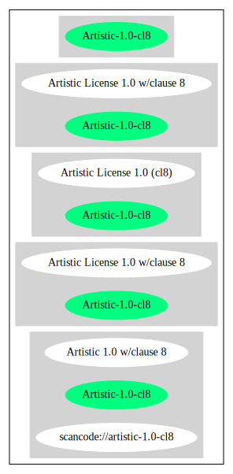

Artistic License 1.0 w/clause 8 (Artistic-1.0-cl8)
==================================================

[TABLE]

**Other Names:**

-   `scancode://artistic-1.0-cl8`

-   `Artistic 1.0 w/clause 8`

Comments on (easy) usability
----------------------------

-   **↑**“Do note that the Artistic License is considered non-free by
    the FSF. They suggest to use the Clarified Artistic License (also
    called Artistic License 2.0) instead. However, the original Artistic
    License is still considered DFSG-free.” (source: [Debian Free
    Software
    Guidelines](https://wiki.debian.org/DFSGLicenses "Debian Free Software Guidelines"))

-   **↑**“Is OSI Approved” (source:
    [SPDX](https://spdx.org/licenses/Artistic-1.0-cl8.html "SPDX"))

-   **↓**“Rating is: Lead” (source: [BlueOak License
    List](https://blueoakcouncil.org/list "BlueOak License List"))

General Comments
----------------

-   “Per SPDX.org, this license was superseded by v2.0 This is Artistic
    License 1.0 as found on OSI site, including clause 8. ” (source:
    [Scancode](https://github.com/nexB/scancode-toolkit/blob/develop/src/licensedcode/data/licenses/artistic-1.0-cl8.yml "Scancode"))

URLs
----

-   **Homepage:** http://spdx.org/licenses/Artistic-1.0-cl8

-   **OSI Page:** http://opensource.org/licenses/Artistic-1.0

-   **SPDX:** http://spdx.org/licenses/Artistic-1.0-cl8.json

-   **SPDX:** https://spdx.org/licenses/Artistic-1.0-cl8.html

-   http://www.gnu.org/licenses/license-list.html\#ArtisticLicense

Text
----

    Preamble

    The intent of this document is to state the conditions under which a Package may
    be copied, such that the Copyright Holder maintains some semblance of artistic
    control over the development of the package, while giving the users of the
    package the right to use and distribute the Package in a more-or-less customary
    fashion, plus the right to make reasonable modifications.

    Definitions:

    "Package" refers to the collection of files distributed by the Copyright Holder,
    and derivatives of that collection of files created through textual modification.

    "Standard Version" refers to such a Package if it has not been modified, or has
    been modified in accordance with the wishes of the Copyright Holder.

    "Copyright Holder" is whoever is named in the copyright or copyrights for the
    package.

    "You" is you, if you're thinking about copying or distributing this Package.

    "Reasonable copying fee" is whatever you can justify on the basis of media cost,
    duplication charges, time of people involved, and so on. (You will not be
    required to justify it to the Copyright Holder, but only to the computing
    community at large as a market that must bear the fee.)

    "Freely Available" means that no fee is charged for the item itself, though
    there may be fees involved in handling the item. It also means that recipients
    of the item may redistribute it under the same conditions they received it.

    1. You may make and give away verbatim copies of the source form of the Standard
    Version of this Package without restriction, provided that you duplicate all of
    the original copyright notices and associated disclaimers.

    2. You may apply bug fixes, portability fixes and other modifications derived
    from the Public Domain or from the Copyright Holder. A Package modified in such
    a way shall still be considered the Standard Version.

    3. You may otherwise modify your copy of this Package in any way, provided that
    you insert a prominent notice in each changed file stating how and when you
    changed that file, and provided that you do at least ONE of the following:

    a) place your modifications in the Public Domain or otherwise make them Freely
    Available, such as by posting said modifications to Usenet or an equivalent
    medium, or placing the modifications on a major archive site such as ftp.uu.net,
    or by allowing the Copyright Holder to include your modifications in the
    Standard Version of the Package.

    b) use the modified Package only within your corporation or organization.

    c) rename any non-standard executables so the names do not conflict with
    standard executables, which must also be provided, and provide a separate manual
    page for each non-standard executable that clearly documents how it differs from
    the Standard Version.

    d) make other distribution arrangements with the Copyright Holder.

    4. You may distribute the programs of this Package in object code or executable
    form, provided that you do at least ONE of the following:

    a) distribute a Standard Version of the executables and library files, together
    with instructions (in the manual page or equivalent) on where to get the
    Standard Version.

    b) accompany the distribution with the machine-readable source of the Package
    with your modifications.

    c) accompany any non-standard executables with their corresponding Standard
    Version executables, giving the non-standard executables non-standard names, and
    clearly documenting the differences in manual pages (or equivalent), together
    with instructions on where to get the Standard Version.

    d) make other distribution arrangements with the Copyright Holder.

    5. You may charge a reasonable copying fee for any distribution of this Package.
    You may charge any fee you choose for support of this Package. You may not
    charge a fee for this Package itself. However, you may distribute this Package
    in aggregate with other (possibly commercial) programs as part of a larger
    (possibly commercial) software distribution provided that you do not advertise
    this Package as a product of your own.

    6. The scripts and library files supplied as input to or produced as output from
    the programs of this Package do not automatically fall under the copyright of
    this Package, but belong to whomever generated them, and may be sold
    commercially, and may be aggregated with this Package.

    7. C or perl subroutines supplied by you and linked into this Package shall not
    be considered part of this Package.

    8.Aggregation of this Package with a commercial distribution is always permitted
    provided that the use of this Package is embedded; that is, when no overt
    attempt is made to make this Package's interfaces visible to the end user of the
    commercial distribution. Such use shall not be construed as a distribution of
    this Package.

    9. The name of the Copyright Holder may not be used to endorse or promote
    products derived from this software without specific prior written permission.

    10. THIS PACKAGE IS PROVIDED "AS IS" AND WITHOUT ANY EXPRESS OR IMPLIED
    WARRANTIES, INCLUDING, WITHOUT LIMITATION, THE IMPLIED WARRANTIES OF
    MERCHANTIBILITY AND FITNESS FOR A PARTICULAR PURPOSE.

    The End

------------------------------------------------------------------------

Raw Data
--------

    {
        "__impliedNames": [
            "Artistic-1.0-cl8",
            "Artistic License 1.0 w/clause 8",
            "scancode://artistic-1.0-cl8",
            "Artistic 1.0 w/clause 8"
        ],
        "__impliedId": "Artistic-1.0-cl8",
        "__impliedAmbiguousNames": [
            "Artistic License"
        ],
        "__impliedComments": [
            [
                "Scancode",
                [
                    "Per SPDX.org, this license was superseded by v2.0 This is Artistic License\n1.0 as found on OSI site, including clause 8.\n"
                ]
            ]
        ],
        "facts": {
            "SPDX": {
                "isSPDXLicenseDeprecated": false,
                "spdxFullName": "Artistic License 1.0 w/clause 8",
                "spdxDetailsURL": "http://spdx.org/licenses/Artistic-1.0-cl8.json",
                "_sourceURL": "https://spdx.org/licenses/Artistic-1.0-cl8.html",
                "spdxLicIsOSIApproved": true,
                "spdxSeeAlso": [
                    "https://opensource.org/licenses/Artistic-1.0"
                ],
                "_implications": {
                    "__impliedNames": [
                        "Artistic-1.0-cl8",
                        "Artistic License 1.0 w/clause 8"
                    ],
                    "__impliedId": "Artistic-1.0-cl8",
                    "__impliedJudgement": [
                        [
                            "SPDX",
                            {
                                "tag": "PositiveJudgement",
                                "contents": "Is OSI Approved"
                            }
                        ]
                    ],
                    "__isOsiApproved": true,
                    "__impliedURLs": [
                        [
                            "SPDX",
                            "http://spdx.org/licenses/Artistic-1.0-cl8.json"
                        ],
                        [
                            null,
                            "https://opensource.org/licenses/Artistic-1.0"
                        ]
                    ]
                },
                "spdxLicenseId": "Artistic-1.0-cl8"
            },
            "Scancode": {
                "otherUrls": [
                    "http://www.gnu.org/licenses/license-list.html#ArtisticLicense",
                    "https://opensource.org/licenses/Artistic-1.0"
                ],
                "homepageUrl": "http://spdx.org/licenses/Artistic-1.0-cl8",
                "shortName": "Artistic 1.0 w/clause 8",
                "textUrls": null,
                "text": "Preamble\n\nThe intent of this document is to state the conditions under which a Package may\nbe copied, such that the Copyright Holder maintains some semblance of artistic\ncontrol over the development of the package, while giving the users of the\npackage the right to use and distribute the Package in a more-or-less customary\nfashion, plus the right to make reasonable modifications.\n\nDefinitions:\n\n\"Package\" refers to the collection of files distributed by the Copyright Holder,\nand derivatives of that collection of files created through textual modification.\n\n\"Standard Version\" refers to such a Package if it has not been modified, or has\nbeen modified in accordance with the wishes of the Copyright Holder.\n\n\"Copyright Holder\" is whoever is named in the copyright or copyrights for the\npackage.\n\n\"You\" is you, if you're thinking about copying or distributing this Package.\n\n\"Reasonable copying fee\" is whatever you can justify on the basis of media cost,\nduplication charges, time of people involved, and so on. (You will not be\nrequired to justify it to the Copyright Holder, but only to the computing\ncommunity at large as a market that must bear the fee.)\n\n\"Freely Available\" means that no fee is charged for the item itself, though\nthere may be fees involved in handling the item. It also means that recipients\nof the item may redistribute it under the same conditions they received it.\n\n1. You may make and give away verbatim copies of the source form of the Standard\nVersion of this Package without restriction, provided that you duplicate all of\nthe original copyright notices and associated disclaimers.\n\n2. You may apply bug fixes, portability fixes and other modifications derived\nfrom the Public Domain or from the Copyright Holder. A Package modified in such\na way shall still be considered the Standard Version.\n\n3. You may otherwise modify your copy of this Package in any way, provided that\nyou insert a prominent notice in each changed file stating how and when you\nchanged that file, and provided that you do at least ONE of the following:\n\na) place your modifications in the Public Domain or otherwise make them Freely\nAvailable, such as by posting said modifications to Usenet or an equivalent\nmedium, or placing the modifications on a major archive site such as ftp.uu.net,\nor by allowing the Copyright Holder to include your modifications in the\nStandard Version of the Package.\n\nb) use the modified Package only within your corporation or organization.\n\nc) rename any non-standard executables so the names do not conflict with\nstandard executables, which must also be provided, and provide a separate manual\npage for each non-standard executable that clearly documents how it differs from\nthe Standard Version.\n\nd) make other distribution arrangements with the Copyright Holder.\n\n4. You may distribute the programs of this Package in object code or executable\nform, provided that you do at least ONE of the following:\n\na) distribute a Standard Version of the executables and library files, together\nwith instructions (in the manual page or equivalent) on where to get the\nStandard Version.\n\nb) accompany the distribution with the machine-readable source of the Package\nwith your modifications.\n\nc) accompany any non-standard executables with their corresponding Standard\nVersion executables, giving the non-standard executables non-standard names, and\nclearly documenting the differences in manual pages (or equivalent), together\nwith instructions on where to get the Standard Version.\n\nd) make other distribution arrangements with the Copyright Holder.\n\n5. You may charge a reasonable copying fee for any distribution of this Package.\nYou may charge any fee you choose for support of this Package. You may not\ncharge a fee for this Package itself. However, you may distribute this Package\nin aggregate with other (possibly commercial) programs as part of a larger\n(possibly commercial) software distribution provided that you do not advertise\nthis Package as a product of your own.\n\n6. The scripts and library files supplied as input to or produced as output from\nthe programs of this Package do not automatically fall under the copyright of\nthis Package, but belong to whomever generated them, and may be sold\ncommercially, and may be aggregated with this Package.\n\n7. C or perl subroutines supplied by you and linked into this Package shall not\nbe considered part of this Package.\n\n8.Aggregation of this Package with a commercial distribution is always permitted\nprovided that the use of this Package is embedded; that is, when no overt\nattempt is made to make this Package's interfaces visible to the end user of the\ncommercial distribution. Such use shall not be construed as a distribution of\nthis Package.\n\n9. The name of the Copyright Holder may not be used to endorse or promote\nproducts derived from this software without specific prior written permission.\n\n10. THIS PACKAGE IS PROVIDED \"AS IS\" AND WITHOUT ANY EXPRESS OR IMPLIED\nWARRANTIES, INCLUDING, WITHOUT LIMITATION, THE IMPLIED WARRANTIES OF\nMERCHANTIBILITY AND FITNESS FOR A PARTICULAR PURPOSE.\n\nThe End",
                "category": "Copyleft Limited",
                "osiUrl": "http://opensource.org/licenses/Artistic-1.0",
                "owner": "OSI - Open Source Initiative",
                "_sourceURL": "https://github.com/nexB/scancode-toolkit/blob/develop/src/licensedcode/data/licenses/artistic-1.0-cl8.yml",
                "key": "artistic-1.0-cl8",
                "name": "Artistic License 1.0 w/clause 8",
                "spdxId": "Artistic-1.0-cl8",
                "notes": "Per SPDX.org, this license was superseded by v2.0 This is Artistic License\n1.0 as found on OSI site, including clause 8.\n",
                "_implications": {
                    "__impliedNames": [
                        "scancode://artistic-1.0-cl8",
                        "Artistic 1.0 w/clause 8",
                        "Artistic-1.0-cl8"
                    ],
                    "__impliedId": "Artistic-1.0-cl8",
                    "__impliedComments": [
                        [
                            "Scancode",
                            [
                                "Per SPDX.org, this license was superseded by v2.0 This is Artistic License\n1.0 as found on OSI site, including clause 8.\n"
                            ]
                        ]
                    ],
                    "__impliedCopyleft": [
                        [
                            "Scancode",
                            "WeakCopyleft"
                        ]
                    ],
                    "__calculatedCopyleft": "WeakCopyleft",
                    "__impliedText": "Preamble\n\nThe intent of this document is to state the conditions under which a Package may\nbe copied, such that the Copyright Holder maintains some semblance of artistic\ncontrol over the development of the package, while giving the users of the\npackage the right to use and distribute the Package in a more-or-less customary\nfashion, plus the right to make reasonable modifications.\n\nDefinitions:\n\n\"Package\" refers to the collection of files distributed by the Copyright Holder,\nand derivatives of that collection of files created through textual modification.\n\n\"Standard Version\" refers to such a Package if it has not been modified, or has\nbeen modified in accordance with the wishes of the Copyright Holder.\n\n\"Copyright Holder\" is whoever is named in the copyright or copyrights for the\npackage.\n\n\"You\" is you, if you're thinking about copying or distributing this Package.\n\n\"Reasonable copying fee\" is whatever you can justify on the basis of media cost,\nduplication charges, time of people involved, and so on. (You will not be\nrequired to justify it to the Copyright Holder, but only to the computing\ncommunity at large as a market that must bear the fee.)\n\n\"Freely Available\" means that no fee is charged for the item itself, though\nthere may be fees involved in handling the item. It also means that recipients\nof the item may redistribute it under the same conditions they received it.\n\n1. You may make and give away verbatim copies of the source form of the Standard\nVersion of this Package without restriction, provided that you duplicate all of\nthe original copyright notices and associated disclaimers.\n\n2. You may apply bug fixes, portability fixes and other modifications derived\nfrom the Public Domain or from the Copyright Holder. A Package modified in such\na way shall still be considered the Standard Version.\n\n3. You may otherwise modify your copy of this Package in any way, provided that\nyou insert a prominent notice in each changed file stating how and when you\nchanged that file, and provided that you do at least ONE of the following:\n\na) place your modifications in the Public Domain or otherwise make them Freely\nAvailable, such as by posting said modifications to Usenet or an equivalent\nmedium, or placing the modifications on a major archive site such as ftp.uu.net,\nor by allowing the Copyright Holder to include your modifications in the\nStandard Version of the Package.\n\nb) use the modified Package only within your corporation or organization.\n\nc) rename any non-standard executables so the names do not conflict with\nstandard executables, which must also be provided, and provide a separate manual\npage for each non-standard executable that clearly documents how it differs from\nthe Standard Version.\n\nd) make other distribution arrangements with the Copyright Holder.\n\n4. You may distribute the programs of this Package in object code or executable\nform, provided that you do at least ONE of the following:\n\na) distribute a Standard Version of the executables and library files, together\nwith instructions (in the manual page or equivalent) on where to get the\nStandard Version.\n\nb) accompany the distribution with the machine-readable source of the Package\nwith your modifications.\n\nc) accompany any non-standard executables with their corresponding Standard\nVersion executables, giving the non-standard executables non-standard names, and\nclearly documenting the differences in manual pages (or equivalent), together\nwith instructions on where to get the Standard Version.\n\nd) make other distribution arrangements with the Copyright Holder.\n\n5. You may charge a reasonable copying fee for any distribution of this Package.\nYou may charge any fee you choose for support of this Package. You may not\ncharge a fee for this Package itself. However, you may distribute this Package\nin aggregate with other (possibly commercial) programs as part of a larger\n(possibly commercial) software distribution provided that you do not advertise\nthis Package as a product of your own.\n\n6. The scripts and library files supplied as input to or produced as output from\nthe programs of this Package do not automatically fall under the copyright of\nthis Package, but belong to whomever generated them, and may be sold\ncommercially, and may be aggregated with this Package.\n\n7. C or perl subroutines supplied by you and linked into this Package shall not\nbe considered part of this Package.\n\n8.Aggregation of this Package with a commercial distribution is always permitted\nprovided that the use of this Package is embedded; that is, when no overt\nattempt is made to make this Package's interfaces visible to the end user of the\ncommercial distribution. Such use shall not be construed as a distribution of\nthis Package.\n\n9. The name of the Copyright Holder may not be used to endorse or promote\nproducts derived from this software without specific prior written permission.\n\n10. THIS PACKAGE IS PROVIDED \"AS IS\" AND WITHOUT ANY EXPRESS OR IMPLIED\nWARRANTIES, INCLUDING, WITHOUT LIMITATION, THE IMPLIED WARRANTIES OF\nMERCHANTIBILITY AND FITNESS FOR A PARTICULAR PURPOSE.\n\nThe End",
                    "__impliedURLs": [
                        [
                            "Homepage",
                            "http://spdx.org/licenses/Artistic-1.0-cl8"
                        ],
                        [
                            "OSI Page",
                            "http://opensource.org/licenses/Artistic-1.0"
                        ],
                        [
                            null,
                            "http://www.gnu.org/licenses/license-list.html#ArtisticLicense"
                        ],
                        [
                            null,
                            "https://opensource.org/licenses/Artistic-1.0"
                        ]
                    ]
                }
            },
            "Cavil": {
                "implications": {
                    "__impliedNames": [
                        "Artistic-1.0-cl8",
                        "Artistic-1.0-cl8"
                    ],
                    "__impliedId": "Artistic-1.0-cl8"
                },
                "shortname": "Artistic-1.0-cl8",
                "riskInt": 5,
                "trademarkInt": 0,
                "opinionInt": 0,
                "otherNames": [
                    "Artistic-1.0-cl8"
                ],
                "patentInt": 0
            },
            "Debian Free Software Guidelines": {
                "LicenseName": "Artistic License",
                "State": "DFSGCompatible",
                "_sourceURL": "https://wiki.debian.org/DFSGLicenses",
                "_implications": {
                    "__impliedNames": [
                        "Artistic-1.0-cl8"
                    ],
                    "__impliedAmbiguousNames": [
                        "Artistic License"
                    ],
                    "__impliedJudgement": [
                        [
                            "Debian Free Software Guidelines",
                            {
                                "tag": "PositiveJudgement",
                                "contents": "Do note that the Artistic License is considered non-free by the FSF. They suggest to use the Clarified Artistic License (also called Artistic License 2.0) instead. However, the original Artistic License is still considered DFSG-free."
                            }
                        ]
                    ]
                },
                "Comment": "Do note that the Artistic License is considered non-free by the FSF. They suggest to use the Clarified Artistic License (also called Artistic License 2.0) instead. However, the original Artistic License is still considered DFSG-free.",
                "LicenseId": "Artistic-1.0-cl8"
            },
            "BlueOak License List": {
                "BlueOakRating": "Lead",
                "url": "https://spdx.org/licenses/Artistic-1.0-cl8.html",
                "isPermissive": true,
                "_sourceURL": "https://blueoakcouncil.org/list",
                "name": "Artistic License 1.0 w/clause 8",
                "id": "Artistic-1.0-cl8",
                "_implications": {
                    "__impliedNames": [
                        "Artistic-1.0-cl8",
                        "Artistic License 1.0 w/clause 8"
                    ],
                    "__impliedJudgement": [
                        [
                            "BlueOak License List",
                            {
                                "tag": "NegativeJudgement",
                                "contents": "Rating is: Lead"
                            }
                        ]
                    ],
                    "__impliedCopyleft": [
                        [
                            "BlueOak License List",
                            "NoCopyleft"
                        ]
                    ],
                    "__calculatedCopyleft": "NoCopyleft",
                    "__impliedURLs": [
                        [
                            "SPDX",
                            "https://spdx.org/licenses/Artistic-1.0-cl8.html"
                        ]
                    ]
                }
            }
        },
        "__impliedJudgement": [
            [
                "BlueOak License List",
                {
                    "tag": "NegativeJudgement",
                    "contents": "Rating is: Lead"
                }
            ],
            [
                "Debian Free Software Guidelines",
                {
                    "tag": "PositiveJudgement",
                    "contents": "Do note that the Artistic License is considered non-free by the FSF. They suggest to use the Clarified Artistic License (also called Artistic License 2.0) instead. However, the original Artistic License is still considered DFSG-free."
                }
            ],
            [
                "SPDX",
                {
                    "tag": "PositiveJudgement",
                    "contents": "Is OSI Approved"
                }
            ]
        ],
        "__impliedCopyleft": [
            [
                "BlueOak License List",
                "NoCopyleft"
            ],
            [
                "Scancode",
                "WeakCopyleft"
            ]
        ],
        "__calculatedCopyleft": "WeakCopyleft",
        "__isOsiApproved": true,
        "__impliedText": "Preamble\n\nThe intent of this document is to state the conditions under which a Package may\nbe copied, such that the Copyright Holder maintains some semblance of artistic\ncontrol over the development of the package, while giving the users of the\npackage the right to use and distribute the Package in a more-or-less customary\nfashion, plus the right to make reasonable modifications.\n\nDefinitions:\n\n\"Package\" refers to the collection of files distributed by the Copyright Holder,\nand derivatives of that collection of files created through textual modification.\n\n\"Standard Version\" refers to such a Package if it has not been modified, or has\nbeen modified in accordance with the wishes of the Copyright Holder.\n\n\"Copyright Holder\" is whoever is named in the copyright or copyrights for the\npackage.\n\n\"You\" is you, if you're thinking about copying or distributing this Package.\n\n\"Reasonable copying fee\" is whatever you can justify on the basis of media cost,\nduplication charges, time of people involved, and so on. (You will not be\nrequired to justify it to the Copyright Holder, but only to the computing\ncommunity at large as a market that must bear the fee.)\n\n\"Freely Available\" means that no fee is charged for the item itself, though\nthere may be fees involved in handling the item. It also means that recipients\nof the item may redistribute it under the same conditions they received it.\n\n1. You may make and give away verbatim copies of the source form of the Standard\nVersion of this Package without restriction, provided that you duplicate all of\nthe original copyright notices and associated disclaimers.\n\n2. You may apply bug fixes, portability fixes and other modifications derived\nfrom the Public Domain or from the Copyright Holder. A Package modified in such\na way shall still be considered the Standard Version.\n\n3. You may otherwise modify your copy of this Package in any way, provided that\nyou insert a prominent notice in each changed file stating how and when you\nchanged that file, and provided that you do at least ONE of the following:\n\na) place your modifications in the Public Domain or otherwise make them Freely\nAvailable, such as by posting said modifications to Usenet or an equivalent\nmedium, or placing the modifications on a major archive site such as ftp.uu.net,\nor by allowing the Copyright Holder to include your modifications in the\nStandard Version of the Package.\n\nb) use the modified Package only within your corporation or organization.\n\nc) rename any non-standard executables so the names do not conflict with\nstandard executables, which must also be provided, and provide a separate manual\npage for each non-standard executable that clearly documents how it differs from\nthe Standard Version.\n\nd) make other distribution arrangements with the Copyright Holder.\n\n4. You may distribute the programs of this Package in object code or executable\nform, provided that you do at least ONE of the following:\n\na) distribute a Standard Version of the executables and library files, together\nwith instructions (in the manual page or equivalent) on where to get the\nStandard Version.\n\nb) accompany the distribution with the machine-readable source of the Package\nwith your modifications.\n\nc) accompany any non-standard executables with their corresponding Standard\nVersion executables, giving the non-standard executables non-standard names, and\nclearly documenting the differences in manual pages (or equivalent), together\nwith instructions on where to get the Standard Version.\n\nd) make other distribution arrangements with the Copyright Holder.\n\n5. You may charge a reasonable copying fee for any distribution of this Package.\nYou may charge any fee you choose for support of this Package. You may not\ncharge a fee for this Package itself. However, you may distribute this Package\nin aggregate with other (possibly commercial) programs as part of a larger\n(possibly commercial) software distribution provided that you do not advertise\nthis Package as a product of your own.\n\n6. The scripts and library files supplied as input to or produced as output from\nthe programs of this Package do not automatically fall under the copyright of\nthis Package, but belong to whomever generated them, and may be sold\ncommercially, and may be aggregated with this Package.\n\n7. C or perl subroutines supplied by you and linked into this Package shall not\nbe considered part of this Package.\n\n8.Aggregation of this Package with a commercial distribution is always permitted\nprovided that the use of this Package is embedded; that is, when no overt\nattempt is made to make this Package's interfaces visible to the end user of the\ncommercial distribution. Such use shall not be construed as a distribution of\nthis Package.\n\n9. The name of the Copyright Holder may not be used to endorse or promote\nproducts derived from this software without specific prior written permission.\n\n10. THIS PACKAGE IS PROVIDED \"AS IS\" AND WITHOUT ANY EXPRESS OR IMPLIED\nWARRANTIES, INCLUDING, WITHOUT LIMITATION, THE IMPLIED WARRANTIES OF\nMERCHANTIBILITY AND FITNESS FOR A PARTICULAR PURPOSE.\n\nThe End",
        "__impliedURLs": [
            [
                "SPDX",
                "http://spdx.org/licenses/Artistic-1.0-cl8.json"
            ],
            [
                null,
                "https://opensource.org/licenses/Artistic-1.0"
            ],
            [
                "SPDX",
                "https://spdx.org/licenses/Artistic-1.0-cl8.html"
            ],
            [
                "Homepage",
                "http://spdx.org/licenses/Artistic-1.0-cl8"
            ],
            [
                "OSI Page",
                "http://opensource.org/licenses/Artistic-1.0"
            ],
            [
                null,
                "http://www.gnu.org/licenses/license-list.html#ArtisticLicense"
            ]
        ]
    }

------------------------------------------------------------------------

Dot Cluster Graph
-----------------

