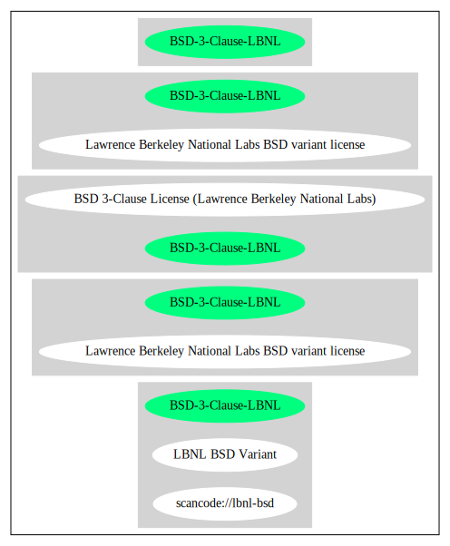

Lawrence Berkeley National Labs BSD variant license (BSD-3-Clause-LBNL)
=======================================================================

[TABLE]

**Other Names:**

-   `scancode://lbnl-bsd`

-   `LBNL BSD Variant`

Comments on (easy) usability
----------------------------

-   **↑**“Is OSI Approved” (source:
    [SPDX](https://spdx.org/licenses/BSD-3-Clause-LBNL.html "SPDX"))

-   **↑**“Rating is: Bronze” (source: [BlueOak License
    List](https://blueoakcouncil.org/list "BlueOak License List"))

General Comments
----------------

URLs
----

-   **Homepage:**
    https://fedoraproject.org/wiki/Licensing:LBNLBSD?rd=Licensing/LBNLBSD

-   **SPDX:** http://spdx.org/licenses/BSD-3-Clause-LBNL.json

-   **SPDX:** https://spdx.org/licenses/BSD-3-Clause-LBNL.html

-   https://fedoraproject.org/wiki/Licensing/LBNLBSD

Text
----

    Redistribution and use in source and binary forms, with or without modification, are permitted provided that the following conditions are met:

    (1) Redistributions of source code must retain the above copyright notice, this list of conditions and the following disclaimer.

    (2) Redistributions in binary form must reproduce the above copyright notice, this list of conditions and the following disclaimer in the documentation and/or other materials provided with the distribution.

    (3) Neither the name of the University of California, Lawrence Berkeley National Laboratory, U.S. Dept. of Energy nor the names of its contributors may be used to endorse or promote products derived from this software without specific prior written permission.

    THIS SOFTWARE IS PROVIDED BY THE COPYRIGHT HOLDERS AND CONTRIBUTORS "AS IS" AND ANY EXPRESS OR IMPLIED WARRANTIES, INCLUDING, BUT NOT LIMITED TO, THE IMPLIED WARRANTIES OF MERCHANTABILITY AND FITNESS FOR A PARTICULAR PURPOSE ARE DISCLAIMED. IN NO EVENT SHALL THE COPYRIGHT OWNER OR CONTRIBUTORS BE LIABLE FOR ANY DIRECT, INDIRECT, INCIDENTAL, SPECIAL, EXEMPLARY, OR CONSEQUENTIAL DAMAGES (INCLUDING, BUT NOT LIMITED TO, PROCUREMENT OF SUBSTITUTE GOODS OR SERVICES; LOSS OF USE, DATA, OR PROFITS; OR BUSINESS INTERRUPTION) HOWEVER CAUSED AND ON ANY THEORY OF LIABILITY, WHETHER IN CONTRACT, STRICT
    LIABILITY, OR TORT (INCLUDING NEGLIGENCE OR OTHERWISE) ARISING IN ANY WAY OUT OF THE USE OF THIS SOFTWARE, EVEN IF ADVISED OF THE POSSIBILITY OF SUCH DAMAGE.

    You are under no obligation whatsoever to provide any bug fixes, patches, or upgrades to the features, functionality or performance of the source code ("Enhancements") to anyone; however, if you choose to make your Enhancements available either publicly, or directly to Lawrence Berkeley National Laboratory, without imposing a separate written license agreement for such Enhancements, then you hereby grant the following license: a non-exclusive, royalty-free perpetual license to install, use, modify, prepare derivative works, incorporate into other computer software, distribute, and sublicense such Enhancements or derivative works thereof, in binary and source code form.

------------------------------------------------------------------------

Raw Data
--------

-   SPDX

-   BlueOak License List

-   Scancode

&nbsp;

    {
        "__impliedNames": [
            "BSD-3-Clause-LBNL",
            "Lawrence Berkeley National Labs BSD variant license",
            "scancode://lbnl-bsd",
            "LBNL BSD Variant"
        ],
        "__impliedId": "BSD-3-Clause-LBNL",
        "facts": {
            "SPDX": {
                "isSPDXLicenseDeprecated": false,
                "spdxFullName": "Lawrence Berkeley National Labs BSD variant license",
                "spdxDetailsURL": "http://spdx.org/licenses/BSD-3-Clause-LBNL.json",
                "_sourceURL": "https://spdx.org/licenses/BSD-3-Clause-LBNL.html",
                "spdxLicIsOSIApproved": true,
                "spdxSeeAlso": [
                    "https://fedoraproject.org/wiki/Licensing/LBNLBSD"
                ],
                "_implications": {
                    "__impliedNames": [
                        "BSD-3-Clause-LBNL",
                        "Lawrence Berkeley National Labs BSD variant license"
                    ],
                    "__impliedId": "BSD-3-Clause-LBNL",
                    "__impliedJudgement": [
                        [
                            "SPDX",
                            {
                                "tag": "PositiveJudgement",
                                "contents": "Is OSI Approved"
                            }
                        ]
                    ],
                    "__isOsiApproved": true,
                    "__impliedURLs": [
                        [
                            "SPDX",
                            "http://spdx.org/licenses/BSD-3-Clause-LBNL.json"
                        ],
                        [
                            null,
                            "https://fedoraproject.org/wiki/Licensing/LBNLBSD"
                        ]
                    ]
                },
                "spdxLicenseId": "BSD-3-Clause-LBNL"
            },
            "Scancode": {
                "otherUrls": [
                    "https://fedoraproject.org/wiki/Licensing/LBNLBSD"
                ],
                "homepageUrl": "https://fedoraproject.org/wiki/Licensing:LBNLBSD?rd=Licensing/LBNLBSD",
                "shortName": "LBNL BSD Variant",
                "textUrls": null,
                "text": "Redistribution and use in source and binary forms, with or without modification, are permitted provided that the following conditions are met:\n\n(1) Redistributions of source code must retain the above copyright notice, this list of conditions and the following disclaimer.\n\n(2) Redistributions in binary form must reproduce the above copyright notice, this list of conditions and the following disclaimer in the documentation and/or other materials provided with the distribution.\n\n(3) Neither the name of the University of California, Lawrence Berkeley National Laboratory, U.S. Dept. of Energy nor the names of its contributors may be used to endorse or promote products derived from this software without specific prior written permission.\n\nTHIS SOFTWARE IS PROVIDED BY THE COPYRIGHT HOLDERS AND CONTRIBUTORS \"AS IS\" AND ANY EXPRESS OR IMPLIED WARRANTIES, INCLUDING, BUT NOT LIMITED TO, THE IMPLIED WARRANTIES OF MERCHANTABILITY AND FITNESS FOR A PARTICULAR PURPOSE ARE DISCLAIMED. IN NO EVENT SHALL THE COPYRIGHT OWNER OR CONTRIBUTORS BE LIABLE FOR ANY DIRECT, INDIRECT, INCIDENTAL, SPECIAL, EXEMPLARY, OR CONSEQUENTIAL DAMAGES (INCLUDING, BUT NOT LIMITED TO, PROCUREMENT OF SUBSTITUTE GOODS OR SERVICES; LOSS OF USE, DATA, OR PROFITS; OR BUSINESS INTERRUPTION) HOWEVER CAUSED AND ON ANY THEORY OF LIABILITY, WHETHER IN CONTRACT, STRICT\nLIABILITY, OR TORT (INCLUDING NEGLIGENCE OR OTHERWISE) ARISING IN ANY WAY OUT OF THE USE OF THIS SOFTWARE, EVEN IF ADVISED OF THE POSSIBILITY OF SUCH DAMAGE.\n\nYou are under no obligation whatsoever to provide any bug fixes, patches, or upgrades to the features, functionality or performance of the source code (\"Enhancements\") to anyone; however, if you choose to make your Enhancements available either publicly, or directly to Lawrence Berkeley National Laboratory, without imposing a separate written license agreement for such Enhancements, then you hereby grant the following license: a non-exclusive, royalty-free perpetual license to install, use, modify, prepare derivative works, incorporate into other computer software, distribute, and sublicense such Enhancements or derivative works thereof, in binary and source code form.\n",
                "category": "Permissive",
                "osiUrl": null,
                "owner": "Regents of the University of California",
                "_sourceURL": "https://github.com/nexB/scancode-toolkit/blob/develop/src/licensedcode/data/licenses/lbnl-bsd.yml",
                "key": "lbnl-bsd",
                "name": "Lawrence Berkeley National Labs BSD variant license",
                "spdxId": "BSD-3-Clause-LBNL",
                "notes": null,
                "_implications": {
                    "__impliedNames": [
                        "scancode://lbnl-bsd",
                        "LBNL BSD Variant",
                        "BSD-3-Clause-LBNL"
                    ],
                    "__impliedId": "BSD-3-Clause-LBNL",
                    "__impliedCopyleft": [
                        [
                            "Scancode",
                            "NoCopyleft"
                        ]
                    ],
                    "__calculatedCopyleft": "NoCopyleft",
                    "__impliedText": "Redistribution and use in source and binary forms, with or without modification, are permitted provided that the following conditions are met:\n\n(1) Redistributions of source code must retain the above copyright notice, this list of conditions and the following disclaimer.\n\n(2) Redistributions in binary form must reproduce the above copyright notice, this list of conditions and the following disclaimer in the documentation and/or other materials provided with the distribution.\n\n(3) Neither the name of the University of California, Lawrence Berkeley National Laboratory, U.S. Dept. of Energy nor the names of its contributors may be used to endorse or promote products derived from this software without specific prior written permission.\n\nTHIS SOFTWARE IS PROVIDED BY THE COPYRIGHT HOLDERS AND CONTRIBUTORS \"AS IS\" AND ANY EXPRESS OR IMPLIED WARRANTIES, INCLUDING, BUT NOT LIMITED TO, THE IMPLIED WARRANTIES OF MERCHANTABILITY AND FITNESS FOR A PARTICULAR PURPOSE ARE DISCLAIMED. IN NO EVENT SHALL THE COPYRIGHT OWNER OR CONTRIBUTORS BE LIABLE FOR ANY DIRECT, INDIRECT, INCIDENTAL, SPECIAL, EXEMPLARY, OR CONSEQUENTIAL DAMAGES (INCLUDING, BUT NOT LIMITED TO, PROCUREMENT OF SUBSTITUTE GOODS OR SERVICES; LOSS OF USE, DATA, OR PROFITS; OR BUSINESS INTERRUPTION) HOWEVER CAUSED AND ON ANY THEORY OF LIABILITY, WHETHER IN CONTRACT, STRICT\nLIABILITY, OR TORT (INCLUDING NEGLIGENCE OR OTHERWISE) ARISING IN ANY WAY OUT OF THE USE OF THIS SOFTWARE, EVEN IF ADVISED OF THE POSSIBILITY OF SUCH DAMAGE.\n\nYou are under no obligation whatsoever to provide any bug fixes, patches, or upgrades to the features, functionality or performance of the source code (\"Enhancements\") to anyone; however, if you choose to make your Enhancements available either publicly, or directly to Lawrence Berkeley National Laboratory, without imposing a separate written license agreement for such Enhancements, then you hereby grant the following license: a non-exclusive, royalty-free perpetual license to install, use, modify, prepare derivative works, incorporate into other computer software, distribute, and sublicense such Enhancements or derivative works thereof, in binary and source code form.\n",
                    "__impliedURLs": [
                        [
                            "Homepage",
                            "https://fedoraproject.org/wiki/Licensing:LBNLBSD?rd=Licensing/LBNLBSD"
                        ],
                        [
                            null,
                            "https://fedoraproject.org/wiki/Licensing/LBNLBSD"
                        ]
                    ]
                }
            },
            "BlueOak License List": {
                "BlueOakRating": "Bronze",
                "url": "https://spdx.org/licenses/BSD-3-Clause-LBNL.html",
                "isPermissive": true,
                "_sourceURL": "https://blueoakcouncil.org/list",
                "name": "Lawrence Berkeley National Labs BSD variant license",
                "id": "BSD-3-Clause-LBNL",
                "_implications": {
                    "__impliedNames": [
                        "BSD-3-Clause-LBNL",
                        "Lawrence Berkeley National Labs BSD variant license"
                    ],
                    "__impliedJudgement": [
                        [
                            "BlueOak License List",
                            {
                                "tag": "PositiveJudgement",
                                "contents": "Rating is: Bronze"
                            }
                        ]
                    ],
                    "__impliedCopyleft": [
                        [
                            "BlueOak License List",
                            "NoCopyleft"
                        ]
                    ],
                    "__calculatedCopyleft": "NoCopyleft",
                    "__impliedURLs": [
                        [
                            "SPDX",
                            "https://spdx.org/licenses/BSD-3-Clause-LBNL.html"
                        ]
                    ]
                }
            }
        },
        "__impliedJudgement": [
            [
                "BlueOak License List",
                {
                    "tag": "PositiveJudgement",
                    "contents": "Rating is: Bronze"
                }
            ],
            [
                "SPDX",
                {
                    "tag": "PositiveJudgement",
                    "contents": "Is OSI Approved"
                }
            ]
        ],
        "__impliedCopyleft": [
            [
                "BlueOak License List",
                "NoCopyleft"
            ],
            [
                "Scancode",
                "NoCopyleft"
            ]
        ],
        "__calculatedCopyleft": "NoCopyleft",
        "__isOsiApproved": true,
        "__impliedText": "Redistribution and use in source and binary forms, with or without modification, are permitted provided that the following conditions are met:\n\n(1) Redistributions of source code must retain the above copyright notice, this list of conditions and the following disclaimer.\n\n(2) Redistributions in binary form must reproduce the above copyright notice, this list of conditions and the following disclaimer in the documentation and/or other materials provided with the distribution.\n\n(3) Neither the name of the University of California, Lawrence Berkeley National Laboratory, U.S. Dept. of Energy nor the names of its contributors may be used to endorse or promote products derived from this software without specific prior written permission.\n\nTHIS SOFTWARE IS PROVIDED BY THE COPYRIGHT HOLDERS AND CONTRIBUTORS \"AS IS\" AND ANY EXPRESS OR IMPLIED WARRANTIES, INCLUDING, BUT NOT LIMITED TO, THE IMPLIED WARRANTIES OF MERCHANTABILITY AND FITNESS FOR A PARTICULAR PURPOSE ARE DISCLAIMED. IN NO EVENT SHALL THE COPYRIGHT OWNER OR CONTRIBUTORS BE LIABLE FOR ANY DIRECT, INDIRECT, INCIDENTAL, SPECIAL, EXEMPLARY, OR CONSEQUENTIAL DAMAGES (INCLUDING, BUT NOT LIMITED TO, PROCUREMENT OF SUBSTITUTE GOODS OR SERVICES; LOSS OF USE, DATA, OR PROFITS; OR BUSINESS INTERRUPTION) HOWEVER CAUSED AND ON ANY THEORY OF LIABILITY, WHETHER IN CONTRACT, STRICT\nLIABILITY, OR TORT (INCLUDING NEGLIGENCE OR OTHERWISE) ARISING IN ANY WAY OUT OF THE USE OF THIS SOFTWARE, EVEN IF ADVISED OF THE POSSIBILITY OF SUCH DAMAGE.\n\nYou are under no obligation whatsoever to provide any bug fixes, patches, or upgrades to the features, functionality or performance of the source code (\"Enhancements\") to anyone; however, if you choose to make your Enhancements available either publicly, or directly to Lawrence Berkeley National Laboratory, without imposing a separate written license agreement for such Enhancements, then you hereby grant the following license: a non-exclusive, royalty-free perpetual license to install, use, modify, prepare derivative works, incorporate into other computer software, distribute, and sublicense such Enhancements or derivative works thereof, in binary and source code form.\n",
        "__impliedURLs": [
            [
                "SPDX",
                "http://spdx.org/licenses/BSD-3-Clause-LBNL.json"
            ],
            [
                null,
                "https://fedoraproject.org/wiki/Licensing/LBNLBSD"
            ],
            [
                "SPDX",
                "https://spdx.org/licenses/BSD-3-Clause-LBNL.html"
            ],
            [
                "Homepage",
                "https://fedoraproject.org/wiki/Licensing:LBNLBSD?rd=Licensing/LBNLBSD"
            ]
        ]
    }

------------------------------------------------------------------------

Dot Cluster Graph
-----------------

