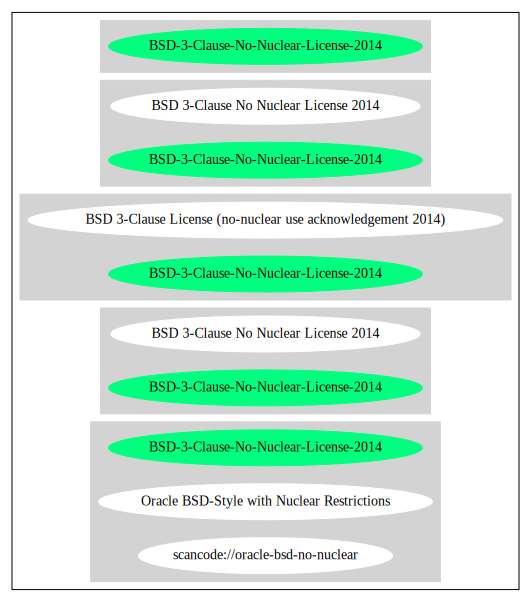

BSD 3-Clause No Nuclear License 2014 (BSD-3-Clause-No-Nuclear-License-2014)
===========================================================================

[TABLE]

**Other Names:**

-   `scancode://oracle-bsd-no-nuclear`

-   `Oracle BSD-Style with Nuclear Restrictions`

Comments on (easy) usability
----------------------------

-   **↑**“Rating is: Bronze” (source: [BlueOak License
    List](https://blueoakcouncil.org/list "BlueOak License List"))

General Comments
----------------

-   “this is a minor variation on similar licenses by Sun and Oracle.”
    (source:
    [Scancode](https://github.com/nexB/scancode-toolkit/blob/develop/src/licensedcode/data/licenses/oracle-bsd-no-nuclear.yml "Scancode"))

URLs
----

-   **Homepage:**
    https://java.net/projects/javaeetutorial/pages/BerkeleyLicense

-   **SPDX:**
    http://spdx.org/licenses/BSD-3-Clause-No-Nuclear-License-2014.json

-   **SPDX:**
    https://spdx.org/licenses/BSD-3-Clause-No-Nuclear-License-2014.html

-   https://web.archive.org/web/20150906075957/https://java.net/projects/javaeetutorial/pages/BerkeleyLicense

Text
----

    Use is subject to license terms.

    Redistribution and use in source and binary forms, with or without modification,
    are permitted provided that the following conditions are met:

    Redistributions of source code must retain the above copyright notice, this list
    of conditions and the following disclaimer.

    Redistributions in binary form must reproduce the above copyright notice, this
    list of conditions and the following disclaimer in the documentation and/or
    other materials provided with the distribution.

    Neither the name of Oracle Corporation nor the names of its contributors may be
    used to endorse or promote products derived from this software without specific
    prior written permission.

    THIS SOFTWARE IS PROVIDED BY THE COPYRIGHT HOLDERS AND CONTRIBUTORS "AS IS" AND
    ANY EXPRESS OR IMPLIED WARRANTIES, INCLUDING, BUT NOT LIMITED TO, THE IMPLIED
    WARRANTIES OF MERCHANTABILITY AND FITNESS FOR A PARTICULAR PURPOSE ARE
    DISCLAIMED. IN NO EVENT SHALL THE COPYRIGHT OWNER OR CONTRIBUTORS BE LIABLE FOR
    ANY DIRECT, INDIRECT, INCIDENTAL, SPECIAL, EXEMPLARY, OR CONSEQUENTIAL DAMAGES
    (INCLUDING, BUT NOT LIMITED TO, PROCUREMENT OF SUBSTITUTE GOODS OR SERVICES;
    LOSS OF USE, DATA, OR PROFITS; OR BUSINESS INTERRUPTION) HOWEVER CAUSED AND ON
    ANY THEORY OF LIABILITY, WHETHER IN CONTRACT, STRICT LIABILITY, OR TORT
    (INCLUDING NEGLIGENCE OR OTHERWISE) ARISING IN ANY WAY OUT OF THE USE OF THIS
    SOFTWARE, EVEN IF ADVISED OF THE POSSIBILITY OF SUCH DAMAGE.

    You acknowledge that this software is not designed, licensed or intended for use
    in the design, construction, operation or maintenance of any nuclear facility.

------------------------------------------------------------------------

Raw Data
--------

-   [SPDX](https://spdx.org/licenses/BSD-3-Clause-No-Nuclear-License-2014.html "SPDX")

-   [BlueOak License
    List](https://blueoakcouncil.org/list "BlueOak License List")

-   [Scancode](https://github.com/nexB/scancode-toolkit/blob/develop/src/licensedcode/data/licenses/oracle-bsd-no-nuclear.yml "Scancode")

&nbsp;

    {
        "__impliedNames": [
            "BSD-3-Clause-No-Nuclear-License-2014",
            "BSD 3-Clause No Nuclear License 2014",
            "scancode://oracle-bsd-no-nuclear",
            "Oracle BSD-Style with Nuclear Restrictions"
        ],
        "__impliedId": "BSD-3-Clause-No-Nuclear-License-2014",
        "__impliedComments": [
            [
                "Scancode",
                [
                    "this is a minor variation on similar licenses by Sun and Oracle."
                ]
            ]
        ],
        "facts": {
            "SPDX": {
                "isSPDXLicenseDeprecated": false,
                "spdxFullName": "BSD 3-Clause No Nuclear License 2014",
                "spdxDetailsURL": "http://spdx.org/licenses/BSD-3-Clause-No-Nuclear-License-2014.json",
                "_sourceURL": "https://spdx.org/licenses/BSD-3-Clause-No-Nuclear-License-2014.html",
                "spdxLicIsOSIApproved": false,
                "spdxSeeAlso": [
                    "https://java.net/projects/javaeetutorial/pages/BerkeleyLicense"
                ],
                "_implications": {
                    "__impliedNames": [
                        "BSD-3-Clause-No-Nuclear-License-2014",
                        "BSD 3-Clause No Nuclear License 2014"
                    ],
                    "__impliedId": "BSD-3-Clause-No-Nuclear-License-2014",
                    "__isOsiApproved": false,
                    "__impliedURLs": [
                        [
                            "SPDX",
                            "http://spdx.org/licenses/BSD-3-Clause-No-Nuclear-License-2014.json"
                        ],
                        [
                            null,
                            "https://java.net/projects/javaeetutorial/pages/BerkeleyLicense"
                        ]
                    ]
                },
                "spdxLicenseId": "BSD-3-Clause-No-Nuclear-License-2014"
            },
            "Scancode": {
                "otherUrls": [
                    "https://web.archive.org/web/20150906075957/https://java.net/projects/javaeetutorial/pages/BerkeleyLicense"
                ],
                "homepageUrl": "https://java.net/projects/javaeetutorial/pages/BerkeleyLicense",
                "shortName": "Oracle BSD-Style with Nuclear Restrictions",
                "textUrls": null,
                "text": "Use is subject to license terms.\n\nRedistribution and use in source and binary forms, with or without modification,\nare permitted provided that the following conditions are met:\n\nRedistributions of source code must retain the above copyright notice, this list\nof conditions and the following disclaimer.\n\nRedistributions in binary form must reproduce the above copyright notice, this\nlist of conditions and the following disclaimer in the documentation and/or\nother materials provided with the distribution.\n\nNeither the name of Oracle Corporation nor the names of its contributors may be\nused to endorse or promote products derived from this software without specific\nprior written permission.\n\nTHIS SOFTWARE IS PROVIDED BY THE COPYRIGHT HOLDERS AND CONTRIBUTORS \"AS IS\" AND\nANY EXPRESS OR IMPLIED WARRANTIES, INCLUDING, BUT NOT LIMITED TO, THE IMPLIED\nWARRANTIES OF MERCHANTABILITY AND FITNESS FOR A PARTICULAR PURPOSE ARE\nDISCLAIMED. IN NO EVENT SHALL THE COPYRIGHT OWNER OR CONTRIBUTORS BE LIABLE FOR\nANY DIRECT, INDIRECT, INCIDENTAL, SPECIAL, EXEMPLARY, OR CONSEQUENTIAL DAMAGES\n(INCLUDING, BUT NOT LIMITED TO, PROCUREMENT OF SUBSTITUTE GOODS OR SERVICES;\nLOSS OF USE, DATA, OR PROFITS; OR BUSINESS INTERRUPTION) HOWEVER CAUSED AND ON\nANY THEORY OF LIABILITY, WHETHER IN CONTRACT, STRICT LIABILITY, OR TORT\n(INCLUDING NEGLIGENCE OR OTHERWISE) ARISING IN ANY WAY OUT OF THE USE OF THIS\nSOFTWARE, EVEN IF ADVISED OF THE POSSIBILITY OF SUCH DAMAGE.\n\nYou acknowledge that this software is not designed, licensed or intended for use\nin the design, construction, operation or maintenance of any nuclear facility.",
                "category": "Free Restricted",
                "osiUrl": null,
                "owner": "Oracle Corporation",
                "_sourceURL": "https://github.com/nexB/scancode-toolkit/blob/develop/src/licensedcode/data/licenses/oracle-bsd-no-nuclear.yml",
                "key": "oracle-bsd-no-nuclear",
                "name": "Oracle BSD-Style with Nuclear Restrictions",
                "spdxId": "BSD-3-Clause-No-Nuclear-License-2014",
                "notes": "this is a minor variation on similar licenses by Sun and Oracle.",
                "_implications": {
                    "__impliedNames": [
                        "scancode://oracle-bsd-no-nuclear",
                        "Oracle BSD-Style with Nuclear Restrictions",
                        "BSD-3-Clause-No-Nuclear-License-2014"
                    ],
                    "__impliedId": "BSD-3-Clause-No-Nuclear-License-2014",
                    "__impliedComments": [
                        [
                            "Scancode",
                            [
                                "this is a minor variation on similar licenses by Sun and Oracle."
                            ]
                        ]
                    ],
                    "__impliedText": "Use is subject to license terms.\n\nRedistribution and use in source and binary forms, with or without modification,\nare permitted provided that the following conditions are met:\n\nRedistributions of source code must retain the above copyright notice, this list\nof conditions and the following disclaimer.\n\nRedistributions in binary form must reproduce the above copyright notice, this\nlist of conditions and the following disclaimer in the documentation and/or\nother materials provided with the distribution.\n\nNeither the name of Oracle Corporation nor the names of its contributors may be\nused to endorse or promote products derived from this software without specific\nprior written permission.\n\nTHIS SOFTWARE IS PROVIDED BY THE COPYRIGHT HOLDERS AND CONTRIBUTORS \"AS IS\" AND\nANY EXPRESS OR IMPLIED WARRANTIES, INCLUDING, BUT NOT LIMITED TO, THE IMPLIED\nWARRANTIES OF MERCHANTABILITY AND FITNESS FOR A PARTICULAR PURPOSE ARE\nDISCLAIMED. IN NO EVENT SHALL THE COPYRIGHT OWNER OR CONTRIBUTORS BE LIABLE FOR\nANY DIRECT, INDIRECT, INCIDENTAL, SPECIAL, EXEMPLARY, OR CONSEQUENTIAL DAMAGES\n(INCLUDING, BUT NOT LIMITED TO, PROCUREMENT OF SUBSTITUTE GOODS OR SERVICES;\nLOSS OF USE, DATA, OR PROFITS; OR BUSINESS INTERRUPTION) HOWEVER CAUSED AND ON\nANY THEORY OF LIABILITY, WHETHER IN CONTRACT, STRICT LIABILITY, OR TORT\n(INCLUDING NEGLIGENCE OR OTHERWISE) ARISING IN ANY WAY OUT OF THE USE OF THIS\nSOFTWARE, EVEN IF ADVISED OF THE POSSIBILITY OF SUCH DAMAGE.\n\nYou acknowledge that this software is not designed, licensed or intended for use\nin the design, construction, operation or maintenance of any nuclear facility.",
                    "__impliedURLs": [
                        [
                            "Homepage",
                            "https://java.net/projects/javaeetutorial/pages/BerkeleyLicense"
                        ],
                        [
                            null,
                            "https://web.archive.org/web/20150906075957/https://java.net/projects/javaeetutorial/pages/BerkeleyLicense"
                        ]
                    ]
                }
            },
            "BlueOak License List": {
                "BlueOakRating": "Bronze",
                "url": "https://spdx.org/licenses/BSD-3-Clause-No-Nuclear-License-2014.html",
                "isPermissive": true,
                "_sourceURL": "https://blueoakcouncil.org/list",
                "name": "BSD 3-Clause No Nuclear License 2014",
                "id": "BSD-3-Clause-No-Nuclear-License-2014",
                "_implications": {
                    "__impliedNames": [
                        "BSD-3-Clause-No-Nuclear-License-2014",
                        "BSD 3-Clause No Nuclear License 2014"
                    ],
                    "__impliedJudgement": [
                        [
                            "BlueOak License List",
                            {
                                "tag": "PositiveJudgement",
                                "contents": "Rating is: Bronze"
                            }
                        ]
                    ],
                    "__impliedCopyleft": [
                        [
                            "BlueOak License List",
                            "NoCopyleft"
                        ]
                    ],
                    "__calculatedCopyleft": "NoCopyleft",
                    "__impliedURLs": [
                        [
                            "SPDX",
                            "https://spdx.org/licenses/BSD-3-Clause-No-Nuclear-License-2014.html"
                        ]
                    ]
                }
            }
        },
        "__impliedJudgement": [
            [
                "BlueOak License List",
                {
                    "tag": "PositiveJudgement",
                    "contents": "Rating is: Bronze"
                }
            ]
        ],
        "__impliedCopyleft": [
            [
                "BlueOak License List",
                "NoCopyleft"
            ]
        ],
        "__calculatedCopyleft": "NoCopyleft",
        "__isOsiApproved": false,
        "__impliedText": "Use is subject to license terms.\n\nRedistribution and use in source and binary forms, with or without modification,\nare permitted provided that the following conditions are met:\n\nRedistributions of source code must retain the above copyright notice, this list\nof conditions and the following disclaimer.\n\nRedistributions in binary form must reproduce the above copyright notice, this\nlist of conditions and the following disclaimer in the documentation and/or\nother materials provided with the distribution.\n\nNeither the name of Oracle Corporation nor the names of its contributors may be\nused to endorse or promote products derived from this software without specific\nprior written permission.\n\nTHIS SOFTWARE IS PROVIDED BY THE COPYRIGHT HOLDERS AND CONTRIBUTORS \"AS IS\" AND\nANY EXPRESS OR IMPLIED WARRANTIES, INCLUDING, BUT NOT LIMITED TO, THE IMPLIED\nWARRANTIES OF MERCHANTABILITY AND FITNESS FOR A PARTICULAR PURPOSE ARE\nDISCLAIMED. IN NO EVENT SHALL THE COPYRIGHT OWNER OR CONTRIBUTORS BE LIABLE FOR\nANY DIRECT, INDIRECT, INCIDENTAL, SPECIAL, EXEMPLARY, OR CONSEQUENTIAL DAMAGES\n(INCLUDING, BUT NOT LIMITED TO, PROCUREMENT OF SUBSTITUTE GOODS OR SERVICES;\nLOSS OF USE, DATA, OR PROFITS; OR BUSINESS INTERRUPTION) HOWEVER CAUSED AND ON\nANY THEORY OF LIABILITY, WHETHER IN CONTRACT, STRICT LIABILITY, OR TORT\n(INCLUDING NEGLIGENCE OR OTHERWISE) ARISING IN ANY WAY OUT OF THE USE OF THIS\nSOFTWARE, EVEN IF ADVISED OF THE POSSIBILITY OF SUCH DAMAGE.\n\nYou acknowledge that this software is not designed, licensed or intended for use\nin the design, construction, operation or maintenance of any nuclear facility.",
        "__impliedURLs": [
            [
                "SPDX",
                "http://spdx.org/licenses/BSD-3-Clause-No-Nuclear-License-2014.json"
            ],
            [
                null,
                "https://java.net/projects/javaeetutorial/pages/BerkeleyLicense"
            ],
            [
                "SPDX",
                "https://spdx.org/licenses/BSD-3-Clause-No-Nuclear-License-2014.html"
            ],
            [
                "Homepage",
                "https://java.net/projects/javaeetutorial/pages/BerkeleyLicense"
            ],
            [
                null,
                "https://web.archive.org/web/20150906075957/https://java.net/projects/javaeetutorial/pages/BerkeleyLicense"
            ]
        ]
    }

------------------------------------------------------------------------

Dot Cluster Graph
-----------------

